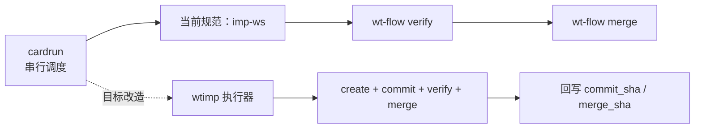

# cardrun 内部调用 wtimp：问题答复与最小改造清单（2026-03-06）

## 0. 结论先行

**结论**：`jjk-wtimp` 应该作为 `cardrun` 的执行器替代 `imp-ws`，但必须做“职责重分配”，不能只改命令名。

1. `cardrun` 保留“选卡/串行门禁/状态编排”。
2. `wtimp` 承担“create -> 实现 -> commit -> verify -> merge”执行闭环。
3. 若不做职责收敛，会出现“双重 create/merge”冲突与提交证据漂移。

---

## 1. 你的问题（原文）与我的答复（汇总）

### 1.1 问题原文

1. **问题 A**：`这条链路是不是应该用jjk-wtimp?`
2. **问题 B**：`我的意思,jjk-wtimp代替imp-ws,然后在cardrun 内部调用`

### 1.2 答复汇总（精简版）

1. **是，方向正确**：`wtimp` 比 `imp-ws` 更匹配“隔离实现 + 提交合并证据化”。
2. **但需改造接口**：`cardrun` 当前是调度器，不具备完整 dispatch 执行器能力。
3. **推荐目标形态**：`cardrun dispatch -> wtimp(执行闭环) -> 回写 commit/merge 证据 -> cardrun 继续下一卡`。

---

## 2. 现状证据（流程级）

### 2.1 链路与职责现状图

### 2.2 关键证据表

| 观察点 | 当前证据 | 说明 |
|---|---|---|
| `cardrun` 默认下游仍是 `imp-ws` | `/.cursor/commands/jjk-cardrun.md:11` | 规范层仍是旧执行器 |
| `cardrun` 子代理入口固定 `imp-ws` | `/.cursor/commands/jjk-cardrun.md:94` | 需要改为可配置执行器 |
| `wtimp` 自带 create/merge 执行流程 | `/.cursor/commands/jjk-wtimp.md:86`、`/.cursor/commands/jjk-wtimp.md:110` | 与 cardrun 现有 verify/merge 有潜在重复 |
| `wt-flow` 分支命名强依赖 card 语义 | `/scripts/coder4/wt-flow.sh:775` | 若 slug 不对齐 card_id，done 标记/会话识别会受影响 |
| merge 前强制 ahead>0（必须有提交） | `/scripts/coder4/wt-flow.sh:970` | 能防“无提交完成” |
| kernel 的 `dispatch` 仅是 pending，不执行实现 | `/scripts/coder4/coder4_bootstrap_kernel.py:1628`、`/scripts/coder4/coder4_bootstrap_kernel.py:2018` | 这是当前“自动执行不闭环”的根因 |

---

## 3. 架构评审四段式结论（用于改造前门禁）

### 3.1 模块边界

1. `cardrun`：仅做排程、选卡、失败重试策略、跨卡串行纪律。
2. `wtimp`：仅做单卡实现与提交收口。
3. `wt-flow`：底层 git/worktree 生命周期原子操作。

### 3.2 依赖方向

`cardrun -> wtimp -> wt-flow -> git`，保持单向调用，禁止反向耦合。

### 3.3 状态归属

1. 任务级真理源保持不变：`_active_task.json` + `.state/<task_key>/task-runner-state.json`。
2. 证据归档保持不变：`task-ledger.jsonl`（追加写）。

### 3.4 错误处理责任

1. `wtimp` 负责提交/验证/合并失败的原始错误。
2. `cardrun` 负责编排层错误码映射（例如 `CARDRUN_SUBAGENT_FAILED`、`CARDRUN_NO_COMMIT_EVIDENCE`）。
3. `wt-flow` 保持底层 fail-fast（如 `MERGE_NO_COMMITS`）。

---

## 4. 最小改造清单（MVP，可执行）

> 目标：最小改动实现 `cardrun 内部调用 wtimp`，并保证可回退。

### 4.1 改造任务表

| ID | 改造项 | 目标文件 | 预期结果 | 验收方式 |
|---|---|---|---|---|
| M1 | 增加执行器配置（默认 `imp-ws`，可切 `wtimp`） | `scripts/coder4/coder4_bootstrap_kernel.py` | dispatch 阶段可选执行器 | 本地运行输出包含 `executor=wtimp` |
| M2 | 为 `dispatch` 增加 `wtimp` 调用分支 | `scripts/coder4/coder4_bootstrap_kernel.py` | `dispatch` 不再仅 `pending`，可触发真实执行 | 单轮返回含 `subagent_id/ws_file/commit_sha` |
| M3 | 统一 card_id 与 wtimp slug 映射规则 | `scripts/coder4/coder4_bootstrap_kernel.py` + `scripts/coder4/wt-flow.sh` | 会话分支与当前卡可稳定回溯 | `wt-flow merge` 不命中卡片不一致 |
| M4 | 关闭重复收口（避免 cardrun 与 wtimp 双 merge） | `scripts/coder4/coder4_bootstrap_kernel.py` + `/.cursor/commands/jjk-cardrun.md` | 仅保留一条 merge 主路径 | 无双重 merge 日志 |
| M5 | 把 `commit_sha` 缺失升级为代码级阻断 | `scripts/coder4/coder4_bootstrap_kernel.py` | 真正落地 `CARDRUN_NO_COMMIT_EVIDENCE` | 缺失 commit 时返回阻断错误码 |
| M6 | 增加最小回归（dispatch->wtimp->证据） | `tests/unit/*`（新增/补充） | 防回归 | pytest 指定用例通过 |
| M7 | 增加回退开关（`executor=imp-ws`） | `scripts/coder4/coder4_bootstrap_kernel.py` | 失败可秒级回退旧路径 | 切换开关后恢复旧行为 |

### 4.2 执行顺序（建议）

1. 先做 `M1/M2/M7`（可跑通最小链路且可回退）。
2. 再做 `M3/M4`（消除双路径冲突）。
3. 最后做 `M5/M6`（强证据化与回归兜底）。

---

## 5. 风险与回退

| 风险 | 触发条件 | 影响 | 回退策略 |
|---|---|---|---|
| 双重 merge | cardrun 与 wtimp 都执行 merge | 状态错乱/重复提交 | 立即切回 `executor=imp-ws`，保留单收口 |
| 卡片映射错位 | slug 与 card_id 不一致 | `merge` 阶段卡片不一致阻断 | 统一 `card_id` 驱动分支段位 |
| 证据丢失 | dispatch 执行成功但未回填 commit_sha | 不可审计 | 强制 `commit_sha` 代码级门禁并阻断推进 |

---

## 6. 最终建议

1. 采纳方案：**`cardrun` 调度 + `wtimp` 执行器**。
2. 采用 MVP 清单分两阶段落地（先可切换可回退，再证据化增强）。
3. 先在单任务目录灰度一轮，验证无双重 merge 后再全量切换。

