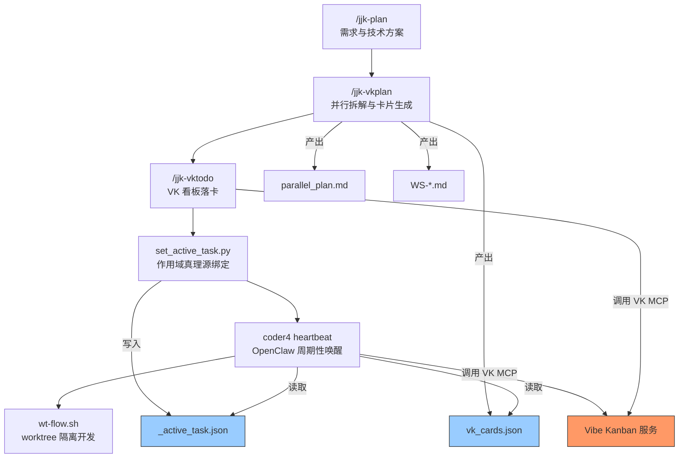
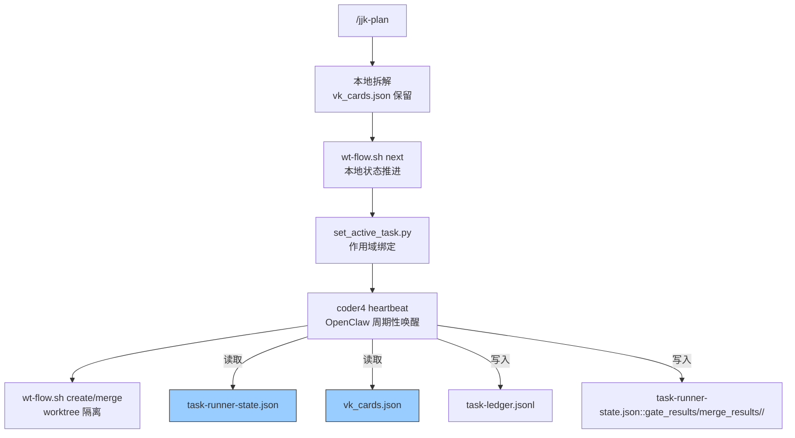
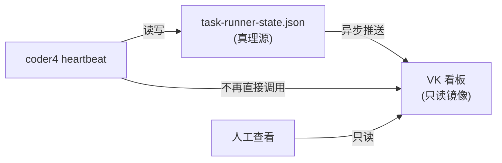
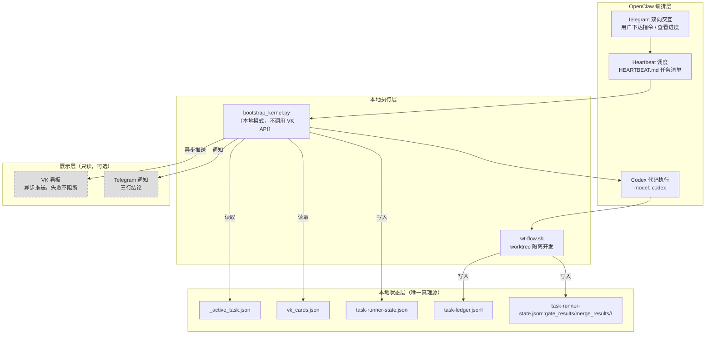

# Vibe Kanban 依赖分析报告

> 分析日期：2026-02-26
> 分析范围：`/Users/jijingkun/bojxAI/fastapi` 全仓库 + 仓外依赖（`~/.openclaw/`、`~/.openclaw-dev/`）
> 分析目标：评估 Vibe Kanban (VK) 在开发自动化工作流中的价值、保留必要性及替代方案

---

## 1. 摘要（Executive Summary）

Vibe Kanban 在当前工作流中承担的核心角色是"看板状态存储与卡片 CRUD"，但其被归因的能力（worktree 隔离、rebase/merge、串行门禁）实际由标准 git 操作和本地脚本完成。VK 的真正独有能力仅限于 attempt 系统和远程看板可视化。引入 VK 的代价是 1256 行专属规则/命令/脚本、约 156 处跨 21 个文件的引用、对外部 MCP 服务及本地 HTTP REST API 的强依赖，以及五方一致性校验（`_active_task.json` / `vk_cards.json` / VK 看板 / `parallel_plan.md` / coder4 状态）带来的脆弱性。VK API 依赖分为两类通道：4 个 MCP 工具调用（集中在 `/jjk-vktodo`）和 3 个 HTTP REST API 调用（`coder4_bootstrap_kernel.py` 直连 `127.0.0.1:3001`）。此外，`scripts/coder4/coder4_bootstrap_kernel.py`（463 行）存在对 VK 的幽灵依赖（读取 `vk_cards.json`、接受 `--vk-api-base` 参数），未被现有文档记录。`project_id` 是贯穿 `_active_task.json -> scope_guard -> bootstrap_kernel -> VK API` 的核心参数，移除需要设计替代标识符。推荐分三阶段实施：先将 VK 降级为只读看板，再扩展 `wt-flow.sh` 承接本地任务编排，最终完全移除 VK 依赖。仓内改造工作量估算 8-13 人天，仓外依赖改造额外增加 3-5 人天，总计 11-18 人天。

> 定位说明：本报告为决策草案，覆盖仓内 + 仓外依赖的全链路分析。工时估算基于静态代码分析，实际实施前建议对仓外依赖做专项评审以确认改造细节。

> **决策结论（2026-02-27 更新）**：VK 故障率高且不具备自动化场景的不可替代性，定位为"人类查看进度的带界面工具"。选定方向：**OpenClaw 保留为编排核心（Telegram 交互 + Codex 代码执行），调度机制从 cron 切换为 heartbeat，VK 从执行链路移除、仅做只读展示**。工作流引擎（Temporal/Prefect）作为可选的第二阶段增强。详见第 7 章。

---

## 2. 分析背景

### 2.1 当前工作流全景图



### 2.2 涉及的命令和脚本清单

| 组件 | 路径 | 行数 | 职责 |
|------|------|------|------|
| `/jjk-plan` | `.cursor/commands/jjk-plan.md` | 336 | 需求与技术方案规划 |
| `/jjk-vkplan` | `.cursor/commands/jjk-vkplan.md` | 253 | 并行拆解，生成 `vk_cards.json` |
| `/jjk-vktodo` | `.cursor/commands/jjk-vktodo.md` | 192 | VK 看板批量建卡/推进 |
| `/jjk-vksync` | `.cursor/commands/jjk-vksync.md` | 84 | 多 worktree G0 基线同步 |
| `set_active_task.py` | `.cursor/scripts/coder4/set_active_task.py` | 141 | 写入 `_active_task.json` |
| `coder4_scope_guard.py` | `scripts/coder4/coder4_scope_guard.py` | 260 | 作用域切换守卫 |
| `wt-flow.sh` | `scripts/coder4/wt-flow.sh` | 220 | worktree 生命周期管理 |
| VK Execution Guard | `.cursor/skills/vk-coder4-execution-guard/SKILL.md` | 145 | coder4 串行执行防漂移 |
| VK 运维脚本 | `.cursor/scripts/vk_*.sh` (4 个) | 582 | VK 服务启停/端口/清理 |

### 2.3 文档链层级（6 层）

```
Layer 1: _active_task.json          -- 作用域真理源
Layer 2: vk_cards.json              -- 卡片定义与机读契约
Layer 3: parallel_plan.md           -- 并行拆解计划
Layer 4: workstreams/WS-*.md        -- 工作流详细设计
Layer 5: implementation_plan.md     -- 技术方案
Layer 6: requirements.md            -- 需求文档
```

coder4 每轮执行前必须校验 Layer 1-4 的一致性，任一层缺失或不一致即阻断（`BLOCKED_DOC_CONTEXT`）。

引用来源：`docs/开发文档/工作流/Coder4自动执行总控手册.md` 第 2.2 节

---

## 3. 四个核心问题的分析结论

### 3.1 VK 的核心特性是否值得引入强依赖？

**结论：不值得。存在严重的能力错误归因。**

VK 在工作流中被赋予的角色远超其实际提供的能力。以下是归因分析：

| 被归因给 VK 的能力 | 实际提供者 | 证据 |
|-------------------|-----------|------|
| worktree 创建/隔离 | `scripts/coder4/wt-flow.sh` (L55-84) | `git worktree add` 标准命令 |
| rebase/merge 回主分支 | `scripts/coder4/wt-flow.sh` (L88-146) | `git rebase` + `git merge --no-ff` |
| 串行门禁（单卡推进） | `_active_task.json` + coder4 逻辑 | `single_active_card=true` 由本地 JSON 控制 |
| 卡片依赖链校验 | `vk_cards.json` 本地文件 | `hard_depends_on` 字段由本地 JSON 定义 |
| 证据绑定与台账 | `coder4_task_ledger.jsonl` | 本地 JSONL 文件 |
| 作用域锁定 | `set_active_task.py` + `coder4_scope_guard.py` | 纯本地 Python 脚本 |

**VK 的真正独有能力仅有两项：**

1. **attempt 系统**：记录每次卡片执行尝试的历史（成功/失败/重试）
2. **远程看板可视化**：提供 Web UI 查看卡片状态分布

**引入 VK 的代价清单：**

| 代价项 | 量化 | 来源 |
|--------|------|------|
| VK 专属规则/命令/脚本 | 1256 行 | `.cursor/commands/jjk-vk*.md` + `.cursor/scripts/vk_*.sh` + SKILL.md |
| 跨文件 VK 引用 | 约 156 处（21 个文件） | 全仓库 `grep` 统计（模式：`vibe_kanban\|jjk-vk\|mcp__vibe_kanban`） |
| VK MCP 工具调用 | 4 处（仓内直接调用） | `.cursor/commands/jjk-vktodo.md` L89-106 |
| VK HTTP REST API 调用 | 3 处（`127.0.0.1:3001/api/tasks`） | `scripts/coder4/coder4_bootstrap_kernel.py` L196, L382, L396 |
| 五方一致性校验 | 31 条约束 | `/jjk-vkplan` 中的硬拦截规则 |
| 外部服务依赖 | 1 个 MCP 二进制 | `.mcp.json` 中 `vibe_kanban` 配置 |
| VK 运维脚本 | 582 行 | `.cursor/scripts/vk_dev.sh` (300行) 等 4 个脚本 |

**五方一致性要求（任一不一致即阻断）：**

```
_active_task.json.task_key  ==  vk_cards.json.task_key
_active_task.json.project_id  ==  VK 看板 project_id
vk_cards.json.card_order  ==  VK 看板实际卡片
parallel_plan.md 的 Gate 定义  ==  vk_cards.json 的 Gate 卡
coder4 状态文件  ==  VK 看板卡片状态
```

引用来源：`.cursor/commands/jjk-vkplan.md` L56-73（机读契约继承）、L119-134（Gate 卡片化硬拦截）

**`wt-flow.sh` 已覆盖的基础能力（220 行）：**

- `create`：从基准分支创建 worktree + 分支（L55-84）
- `merge`：rebase + merge --no-ff 回主分支（L88-146）
- `cleanup`：清理 worktree 和分支（L150-171）
- `status`：查看当前会话状态（L175-182）
- `guard`：检查是否在主分支上（L186-193）

引用来源：`scripts/coder4/wt-flow.sh`

### 3.2 抛弃 VK 后的替代方案

#### 3.2.1 扩展 wt-flow.sh 的设计

在现有 220 行 `wt-flow.sh` 基础上新增子命令，承接 VK 的任务编排职责：

| 子命令 | 职责 | 对应原 VK 能力 |
|--------|------|---------------|
| `create` | 已有：创建 worktree | - |
| `merge` | 已有：合并回主分支 | - |
| `cleanup` | 已有：清理 worktree | - |
| `next` | 新增：按 `card_order` 推进到下一张卡 | VK 卡片状态迁移 |
| `verify` | 新增：执行 `acceptance_checks` 并记录结果 | VK done gate |
| `list` | 新增：列出当前任务队列与状态 | `mcp__vibe_kanban__list_issues` |
| `parallel-create` | 新增：批量创建多个 worktree | `/jjk-vktodo create` |
| `parallel-merge` | 新增：批量合并多个 worktree | `/jjk-vktodo move` |

#### 3.2.2 本地状态文件设计

替代 VK 远程状态存储，使用三个本地文件：

```
docs/内部参考/任务拆解/<task_split_dir>/.state/<task_key>/
  task-runner-state.json    -- 当前执行状态（替代 coder4_cron_state.json）
  wt-sessions/              -- 每个 worktree 会话的独立状态
    <slug>.json
  task-ledger.jsonl         -- 任务完成台账（已有，保持不变）
```

`task-runner-state.json` 结构：

```json
{
  "task_key": "PP-20260221-OPENCLAW-REBUILD-BASELINE",
  "current_card": "C01",
  "card_order": ["C01", "C02", "C03", "C04", "C05", "C06"],
  "card_status": {
    "C01": "done",
    "C02": "in_progress",
    "C03": "todo"
  },
  "execution_mode": "serial",
  "single_active_card": true,
  "no_increment_count": 0,
  "last_updated": "2026-02-26T10:00:00+08:00"
}
```

#### 3.2.3 attempt 系统的本地替代

VK 的 attempt 系统记录每次执行尝试。本地替代方案：

```
docs/内部参考/任务拆解/<task_split_dir>/.state/<task_key>/task-runner-state.json::gate_results/merge_results/
  <card_id>/
    attempt_001.json    -- { started_at, ended_at, result, evidence }
    attempt_002.json
```

每次 coder4 执行一轮，写入一个 attempt 文件。相比 VK 的远程 attempt，本地方案：
- 无网络延迟
- 无 502 风险
- 可直接 `git log` 追溯
- 缺点：无 Web UI 可视化（可通过 `wt-flow.sh list` 命令行替代）

#### 3.2.4 串行/并行模式的实现

串行模式（`execution_mode=serial`）：
1. `wt-flow.sh next` 读取 `task-runner-state.json`
2. 检查 `current_card` 的 `hard_depends_on` 是否全部 `done`
3. 若通过，推进 `current_card` 状态；否则阻断

并行模式（`execution_mode=parallel`）：
1. `wt-flow.sh parallel-create` 为每张无依赖卡创建独立 worktree
2. 各 worktree 独立执行
3. `wt-flow.sh parallel-merge` 按依赖顺序合并

#### 3.2.5 替代方案架构图



### 3.3 VK 降级为只读看板的可行性

**结论：可行，推荐作为过渡方案。**

#### 3.3.1 架构设计

核心思路：本地 JSON 做真理源，异步单向推送到 VK。



关键变化：
- coder4 不再从 VK 读取卡片状态，改为从本地 `task-runner-state.json` 读取
- 卡片状态变更先写本地，再异步推送到 VK（推送失败不阻断执行）
- VK 仅作为可视化看板，人工查看用

#### 3.3.2 VK API 调用分类

| API | 当前用途 | 降级后处理 |
|-----|---------|-----------|
| `list_organizations` | 解析 org_id | 硬编码或本地配置 |
| `list_projects` | 解析 project_id | 硬编码或本地配置 |
| `list_issues` | 读取卡片状态 | 改读本地 JSON |
| `create_issue` | 创建卡片 | 异步推送（可选） |
| `update_issue` | 更新卡片状态 | 异步推送（可选） |
| `get_issue` | 读取单卡详情 | 改读本地 JSON |
| `list_issue_priorities` | 读取优先级列表 | 本地枚举 |
| `list_issue_tags` | 读取标签列表 | 本地枚举 |
| `add_issue_tag` | 添加标签 | 异步推送（可选） |
| `assign_issue` | 分配负责人 | 异步推送（可选） |
| `list_issue_assignees` | 读取负责人列表 | 本地配置 |
| `list_repos` | 读取关联仓库 | 不再需要 |
| `get_repo` | 读取仓库详情 | 不再需要 |

**读操作（6 个）**：全部改为读本地 JSON
**写操作（5 个）**：改为异步推送，失败不阻断
**可删除（2 个）**：`list_repos`、`get_repo`

#### 3.3.3 实现复杂度评估

| 改造项 | 复杂度 | 工作量 |
|--------|--------|--------|
| 新建 `task-runner-state.json` 读写模块 | 低 | 0.5 天 |
| coder4 读取逻辑从 VK API 改为本地 JSON | 中 | 1 天 |
| 异步推送模块（VK 写入队列） | 低 | 0.5 天 |
| `/jjk-vktodo` 改为本地优先 + 异步推送 | 中 | 1 天 |
| 合计 | - | 2-3 天 |

#### 3.3.4 VK 不可用时的影响分析

| 场景 | 当前影响 | 降级后影响 |
|------|---------|-----------|
| VK MCP 502 | coder4 阻断，需手动兜底 | 无影响，本地继续执行 |
| VK 服务下线 | 整个自动化链路中断 | 仅丢失 Web 可视化 |
| VK 数据不一致 | 五方校验失败，全链路阻断 | 本地 JSON 为唯一真理源，无一致性问题 |
| 网络中断 | 无法读写卡片 | 无影响 |

引用来源：`.cursor/commands/jjk-vktodo.md` L117-124（MCP 502 自动兜底）

### 3.4 抛弃 VK 的风险与改造清单

#### 3.4.1 VK API 依赖清单（4 个 MCP 调用 + 3 个 HTTP REST API 调用）

**(a) MCP 工具调用（4 个，集中在 `/jjk-vktodo`）**

仓内明确写出 `mcp__vibe_kanban__*` 调用的位置仅有 `.cursor/commands/jjk-vktodo.md`，共 4 个直接调用点：

| 序号 | API | 调用位置 | 用途 |
|------|-----|---------|------|
| 1 | `mcp__vibe_kanban__list_organizations` + `list_projects` | `/jjk-vktodo` Step 1 (L89) | 解析 org_id / project_id |
| 2 | `mcp__vibe_kanban__list_issues` | `/jjk-vktodo` Step 1 (L90) | 读取卡片列表 |
| 3 | `mcp__vibe_kanban__create_issue` | `/jjk-vktodo` Step 3 (L105) | 创建卡片 |
| 4 | `mcp__vibe_kanban__update_issue` | `/jjk-vktodo` Step 3 (L106) | 更新卡片状态 |

其余 9 个 MCP API（`get_issue`、`list_issue_priorities`、`list_issue_tags`、`add_issue_tag`、`assign_issue`、`list_issue_assignees`、`list_repos`、`get_repo`）在 `/jjk-vktodo` 中作为可用工具被间接引用，但无明确的调用指令。

**(b) HTTP REST API 调用（3 个，集中在 `coder4_bootstrap_kernel.py`）**

`scripts/coder4/coder4_bootstrap_kernel.py` 不走 MCP 通道，而是通过 `http_json()` 直连本地 VK 服务 `127.0.0.1:3001`：

| 序号 | HTTP 方法 | 端点 | 调用位置 | 用途 |
|------|----------|------|---------|------|
| 1 | GET | `/api/tasks?project_id=<id>` | L196 (`list_tasks`) | 读取项目全部卡片 |
| 2 | POST | `/api/tasks` | L382 (`apply_action` seed) | 创建新卡片 |
| 3 | PUT | `/api/tasks/<task_id>` | L396 (`apply_action` activate) | 更新卡片状态为 inprogress |

引用来源：`.cursor/commands/jjk-vktodo.md` L89-106（MCP 通道）、`scripts/coder4/coder4_bootstrap_kernel.py` L196/L382/L396（HTTP REST 通道）、`.mcp.json` L43-54

#### 3.4.2 需要修改的文件清单（21 个文件）

| 文件 | 改动类型 | 估算改动量 | 说明 |
|------|---------|-----------|------|
| `.mcp.json` | 删除 VK 配置 | -12 行 | 移除 `vibe_kanban` MCP 服务器配置 |
| `.cursor/commands/jjk-vkplan.md` | 重写 | ~100 行 | 移除 VK 依赖，改为本地拆解 |
| `.cursor/commands/jjk-vktodo.md` | 重写 | ~150 行 | 从 VK MCP 改为本地状态管理 |
| `.cursor/commands/jjk-vksync.md` | 简化 | ~40 行 | 移除 VK 同步，保留 worktree 校验 |
| `.cursor/commands/jjk-plan.md` | 小改 | ~20 行 | 移除 VK project_id 引用 |
| `.cursor/skills/vk-coder4-execution-guard/SKILL.md` | 重写 | ~80 行 | 从 VK 卡片改为本地状态驱动 |
| `.cursor/scripts/coder4/set_active_task.py` | 中改 | ~30 行 | `--project-id` 为必填参数并写入 `_active_task.json` 真理源，`project_id` 贯穿 `_active_task.json -> scope_guard -> bootstrap_kernel -> VK API` 全链路，移除需设计替代标识符 |
| `scripts/coder4/coder4_scope_guard.py` | 中改 | ~25 行 | 依赖 `project_id` 做作用域门禁（L180-184 读取、L189-190 比对、L117-118 传递给 `set_active_task.py`），移除 VK 语义后需重新定义作用域判定逻辑 |
| `scripts/coder4/coder4_bootstrap_kernel.py` | 中改 | ~30 行 | 移除 `--vk-api-base` 参数及 VK HTTP REST API 调用逻辑（幽灵依赖，463 行文件） |
| `scripts/coder4/wt-flow.sh` | 扩展 | +150 行 | 新增 next/verify/list 子命令 |
| `CLAUDE.md` | 小改 | ~5 行 | 移除 VK 相关说明 |
| `docs/开发文档/工作流/Coder4自动执行总控手册.md` | 中改 | ~50 行 | 从 VK 看板改为本地状态 |
| `docs/开发文档/工作流/开发工作流.md` | 小改 | ~10 行 | 更新工作流描述 |
| `docs/开发文档/工作流/VibeKanban多Worktree本机开发测试.md` | 归档 | 全文 | 标记为历史文档 |
| `docs/开发文档/工作流/OpenClaw自动执行故障字典.md` | 中改 | ~30 行 | 移除 VK 相关故障条目 |
| `docs/开发文档/技巧与速查/AI协作速查表.md` | 小改 | ~5 行 | 移除 VK 引用 |
| `docs/开发文档/技巧与速查/vibe-coding开发技巧.md` | 小改 | ~5 行 | 移除 VK 引用 |
| `docs/内部参考/任务拆解/README.md` | 小改 | ~5 行 | 更新拆解流程说明 |
| `docs/内部参考/任务拆解/_templates/parallel_plan_template.md` | 小改 | ~10 行 | 移除 VK 引用 |
| `.cursor/rules/mcp-routing.mdc` | 小改 | ~5 行 | 移除 VK MCP 路由规则 |
| `docs/内部参考/迭代需求/openclaw迁移重建基线_implementation_plan.md` | 小改 | ~10 行 | 移除 VK 引用 |

#### 3.4.3 需要新建的文件清单

| 文件 | 用途 | 估算行数 |
|------|------|---------|
| `scripts/task-runner.sh` 或扩展 `wt-flow.sh` | 本地任务编排引擎（next/verify/list） | 150-200 行 |
| `docs/内部参考/任务拆解/<task_split_dir>/.state/<task_key>/task-runner-state.json` | 运行时状态文件（自动生成） | - |
| `scripts/vk_sync_push.py`（仅 Phase 1） | 异步推送本地状态到 VK（过渡期） | 80-120 行 |
| `.cursor/commands/jjk-task.md` | 替代 `/jjk-vktodo` 的本地任务管理命令 | 100-150 行 |
| `docs/开发文档/工作流/本地任务编排手册.md` | 替代 VK 相关文档 | 100-150 行 |

#### 3.4.4 可直接删除的文件清单

| 文件 | 行数 | 理由 |
|------|------|------|
| `.cursor/scripts/vk_cleanup.sh` | 65 | VK 服务清理脚本，不再需要 |
| `.cursor/scripts/vk_ports.sh` | 70 | VK 端口管理脚本，不再需要 |
| `.cursor/scripts/vk_dev.sh` | 300 | VK 开发环境启动脚本，不再需要 |
| `.cursor/scripts/vk_setup.sh` | 147 | VK 安装配置脚本，不再需要 |
| `.cursor/commands/jjk-vksync.md` | 84 | VK 同步命令（worktree 校验逻辑迁移到 `wt-flow.sh`） |
| `docs/开发文档/工作流/VibeKanban多Worktree本机开发测试.md` | ~100 | VK 专属测试文档 |
| `.mcp.json` 中 `vibe_kanban` 条目 | 12 | MCP 服务配置（Phase 3 删除） |

合计可删除：约 778 行

#### 3.4.5 风险矩阵

| 风险 | 等级 | 描述 | 缓解措施 |
|------|------|------|---------|
| coder4 自动执行中断 | 极高 | 改造期间 coder4 heartbeat 必须停止 | Phase 1 先降级为只读，不中断执行 |
| 历史任务数据丢失 | 高 | VK 中已有的卡片历史和 attempt 记录 | 改造前导出 VK 数据到本地 JSON 归档 |
| 五方一致性校验失效 | 高 | 移除 VK 后校验逻辑需要重写 | 简化为三方校验（本地 JSON / vk_cards.json / coder4 状态） |
| 团队可视化能力下降 | 中 | 失去 Web UI 看板 | 用 `wt-flow.sh list` 命令行替代；长期可接入 GitHub Projects |
| 规则文件改动引发连锁 | 中 | `.cursor/commands/` 改动可能影响其他命令 | 逐文件改造，每改一个文件做回归测试 |
| `vk_cards.json` 格式变更 | 低 | 本地编排可能需要扩展字段 | 保持向后兼容，只新增不删除字段 |

#### 3.4.6 总工作量估算

| 阶段 | 工作内容 | 工作量 |
|------|---------|--------|
| Phase 1 | VK 降级为只读看板 | 2-3 人天 |
| Phase 2 | 扩展 wt-flow.sh + 精简 coder4 规则 | 3-4 人天 |
| Phase 3 | 完全移除 VK 依赖 | 2-3 人天 |
| 缓冲 | 回归测试与文档同步 | 1-3 人天 |
| **合计（仓内）** | | **8-13 人天** |

### 3.5 仓外依赖影响评估

报告 3.4 节覆盖的是仓内文件改造。实际上 VK 依赖链还延伸到仓库外部的多个配置和规则文件，这些文件在改造时同样需要修改，否则会导致 coder4 运行态异常。

#### 3.5.1 仓外文件清单

| 文件路径 | 行数 | 职责 | 改造需求 |
|---------|------|------|---------|
| `~/.openclaw-dev/cron/jobs.json` | - | coder4 调度配置（当前 cron，目标 heartbeat） | coder4 job 从 `kind: cron` 切换为 `kind: heartbeat`；移除 VK 相关参数（如 `--vk-api-base`）；payload 精简 |
| `~/.openclaw/workspace-dev/state/` | 目录 | coder4 运行态状态文件 | 包含 `coder4_scope_request.json` 等文件，其中 `project_id` 字段指向 VK；需清理或迁移到本地标识符体系 |
| `~/.openclaw/workspace-dev/WORKFLOW_AUTO.md` | 447 | coder4 自动执行规则 | 内含 VK 卡片状态检查、MCP 调用指令等规则，需重写为本地状态驱动 |
| `~/.openclaw/workspace-dev/VK_AGENT_PROMPTS.md` | 622 | Agent 提示词（VK 专属） | 大量 VK 语义（卡片、看板、attempt），需重写或删除 |
| `.cursor/skills/vk-coder4-execution-guard/SKILL.md` | 145 | coder4 串行执行防漂移（已在 3.4.2 列出） | 已纳入仓内改造，此处标注为跨域文件 |

#### 3.5.2 仓外改造工作量估算

| 改造项 | 复杂度 | 工作量 |
|--------|--------|--------|
| `WORKFLOW_AUTO.md` 重写（447 行，VK 规则剥离） | 高 | 1-2 人天 |
| `VK_AGENT_PROMPTS.md` 重写或删除（622 行） | 中 | 0.5-1 人天 |
| cron `jobs.json` 参数清理 | 低 | 0.5 天 |
| 运行态 state 目录迁移 | 低 | 0.5 天 |
| 回归验证（coder4 heartbeat 端到端） | 中 | 0.5-1 人天 |
| **仓外合计** | | **3-5 人天** |

#### 3.5.3 仓外改造风险

| 风险 | 等级 | 描述 | 缓解措施 |
|------|------|------|---------|
| WORKFLOW_AUTO.md 改动导致 coder4 行为异变 | 高 | 该文件是 coder4 的核心执行规则，447 行中 VK 逻辑与通用逻辑交织 | 先做规则拆分（VK 专属 vs 通用），再逐段替换 |
| VK_AGENT_PROMPTS.md 删除后 Agent 能力退化 | 中 | 622 行提示词中可能包含非 VK 的通用指令 | 删除前提取通用指令到新的提示词文件 |
| cron state 迁移遗漏 | 低 | 运行态文件散落在 `~/.openclaw/` 多个子目录 | 改造前做一次全量扫描：`find ~/.openclaw -name "*.json" \| xargs grep -l "project_id\|vibe_kanban"` |

### 3.6 总工作量汇总（仓内 + 仓外）

| 阶段 | 工作内容 | 工作量 |
|------|---------|--------|
| Phase 1 | VK 降级为只读看板（仓内） | 2-3 人天 |
| Phase 2 | 扩展 wt-flow.sh + 精简 coder4 规则（仓内） | 3-4 人天 |
| Phase 3 | 完全移除 VK 依赖（仓内） | 2-3 人天 |
| Phase X | 仓外依赖改造（WORKFLOW_AUTO / VK_AGENT_PROMPTS / cron / state） | 3-5 人天 |
| 缓冲 | 回归测试与文档同步 | 1-3 人天 |
| **总计** | | **11-18 人天** |

> 注：仓外改造（Phase X）建议与 Phase 2 并行推进，不单独占用串行工期。

---

## 4. 推荐实施路线图

### Phase 1：VK 降级为只读看板（2-3 天）

**目标**：解除 VK 对执行链路的阻断能力，保留可视化。

| 步骤 | 内容 | 产出 |
|------|------|------|
| 1.1 | 新建 `task-runner-state.json` 读写模块 | `scripts/task_state.py` |
| 1.2 | coder4 读取逻辑从 VK API 改为本地 JSON | 修改 SKILL.md + 总控手册 |
| 1.3 | 新建异步推送模块 `scripts/vk_sync_push.py` | 状态变更后单向推送到 VK |
| 1.4 | `/jjk-vktodo` 改为"本地写入 + 异步推送" | 修改 `jjk-vktodo.md` |
| 1.5 | 回归测试：coder4 单轮执行 + VK 可视化确认 | 测试报告 |

**验收标准**：
- coder4 在 VK 服务不可用时仍能正常执行
- VK 看板能反映本地状态（延迟可接受）
- 五方一致性降级为三方（本地 JSON / vk_cards.json / coder4 状态）

### Phase 2：扩展 wt-flow.sh + 精简 coder4 规则（3-4 天）

**目标**：本地任务编排能力完整覆盖 VK 的卡片管理功能。

| 步骤 | 内容 | 产出 |
|------|------|------|
| 2.1 | `wt-flow.sh` 新增 `next/verify/list` 子命令 | 扩展后的 `wt-flow.sh`（~370 行） |
| 2.2 | 新建 `/jjk-task` 命令替代 `/jjk-vktodo` | `.cursor/commands/jjk-task.md` |
| 2.3 | 精简 `/jjk-vkplan` 中的 VK 硬拦截规则 | 从 31 条约束降至 ~10 条 |
| 2.4 | 重写 VK Execution Guard SKILL | 从 VK 驱动改为本地状态驱动 |
| 2.5 | 更新 Coder4 总控手册 | 反映新的本地编排架构 |
| 2.6 | 回归测试：完整串行任务链路 | 测试报告 |

**验收标准**：
- `wt-flow.sh list` 能展示完整任务队列
- `wt-flow.sh next` 能按依赖链推进卡片
- `wt-flow.sh verify` 能执行验收检查
- coder4 heartbeat 能在无 VK 的情况下完成完整任务链

### Phase 3：完全移除 VK 依赖（2-3 天）

**目标**：清除所有 VK 残留，简化系统。

| 步骤 | 内容 | 产出 |
|------|------|------|
| 3.1 | 删除 `.cursor/scripts/vk_*.sh`（4 个文件，582 行） | 清理完成 |
| 3.2 | 删除 `.mcp.json` 中 `vibe_kanban` 配置 | 清理完成 |
| 3.3 | 删除 `/jjk-vksync` 命令（迁移 worktree 校验到 `wt-flow.sh`） | 清理完成 |
| 3.4 | 归档 VK 相关文档 | 移至 `docs/内部参考/归档/` |
| 3.5 | 全仓库 VK 引用清理（约 156 处） | `grep` 验证零残留 |
| 3.6 | 删除异步推送模块 `vk_sync_push.py` | 清理完成 |
| 3.7 | 最终回归测试 | 测试报告 |

**验收标准**：
- `grep -rn "vibe_kanban\|mcp__vibe_kanban" .` 返回零结果
- coder4 完整串行链路通过
- 所有文档引用更新完毕

---

## 5. 关键文件引用索引

以下为本报告分析中引用的所有文件路径：

### 命令与规则文件

| 文件路径 | 引用章节 |
|---------|---------|
| `.cursor/commands/jjk-plan.md` | 2.2, 3.1 |
| `.cursor/commands/jjk-vkplan.md` | 2.2, 3.1, 3.4 |
| `.cursor/commands/jjk-vktodo.md` | 2.2, 3.1, 3.3, 3.4 |
| `.cursor/commands/jjk-vksync.md` | 2.2, 3.4 |
| `.cursor/skills/vk-coder4-execution-guard/SKILL.md` | 2.2, 3.4 |
| `.cursor/rules/mcp-routing.mdc` | 3.4 |

### 脚本文件

| 文件路径 | 引用章节 |
|---------|---------|
| `scripts/coder4/wt-flow.sh` | 2.2, 3.1, 3.2 |
| `.cursor/scripts/coder4/set_active_task.py` | 2.2, 3.1, 3.4 |
| `scripts/coder4/coder4_scope_guard.py` | 2.2, 3.1, 3.4 |
| `scripts/coder4/coder4_bootstrap_kernel.py` | 3.4 |
| `.cursor/scripts/vk_dev.sh` | 3.4 |
| `.cursor/scripts/vk_setup.sh` | 3.4 |
| `.cursor/scripts/vk_cleanup.sh` | 3.4 |
| `.cursor/scripts/vk_ports.sh` | 3.4 |

### 配置与数据文件

| 文件路径 | 引用章节 |
|---------|---------|
| `.mcp.json` | 3.1, 3.4 |
| `docs/内部参考/任务拆解/2026-02-21_openclaw迁移重建基线/vk_cards.json` | 2.3, 3.1 |
| `docs/内部参考/任务拆解/<task_split_dir>/_active_task.json` | 2.3, 3.1 |

### 文档文件

| 文件路径 | 引用章节 |
|---------|---------|
| `docs/开发文档/工作流/Coder4自动执行总控手册.md` | 2.3, 3.4 |
| `docs/开发文档/工作流/开发工作流.md` | 3.4 |
| `docs/开发文档/工作流/VibeKanban多Worktree本机开发测试.md` | 3.4 |
| `docs/开发文档/工作流/OpenClaw自动执行故障字典.md` | 3.4 |
| `docs/开发文档/技巧与速查/AI协作速查表.md` | 3.4 |
| `docs/开发文档/技巧与速查/vibe-coding开发技巧.md` | 3.4 |
| `docs/内部参考/任务拆解/README.md` | 3.4 |
| `docs/内部参考/任务拆解/_templates/parallel_plan_template.md` | 3.4 |
| `docs/内部参考/迭代需求/openclaw迁移重建基线_implementation_plan.md` | 3.4 |

### 仓外文件（非仓库管理）

| 文件路径 | 引用章节 |
|---------|---------|
| `~/.openclaw-dev/cron/jobs.json` | 3.5 |
| `~/.openclaw/workspace-dev/state/` | 3.5 |
| `~/.openclaw/workspace-dev/WORKFLOW_AUTO.md` | 3.5 |
| `~/.openclaw/workspace-dev/VK_AGENT_PROMPTS.md` | 3.5 |

---

## 6. 开放问题（Open Questions）

| 编号 | 问题 | 影响范围 | 建议处理时机 |
|------|------|---------|-------------|
| Q1 | VK 中已有的历史卡片数据是否需要导出归档？如需要，导出格式和存储位置是什么？ | Phase 3 | Phase 1 启动前确认 |
| Q2 | ~~coder4 的 cron 调度机制（OpenClaw `jobs.json`）是否也需要一并迁移为本地方案？~~ | **已解决** | 从 cron 切换为 OpenClaw heartbeat，见第 7 章 |
| Q3 | ~~长期是否需要接入 GitHub Projects 或其他看板工具替代 VK 的可视化能力？~~ | **已解决** | Telegram 双向交互 + 命令行满足日常需求，见 7.9 |
| Q4 | `vk_cards.json` 的格式是否需要版本化管理？当前无 schema 校验。 | Phase 2 | Phase 2 实施时确认 |
| Q5 | ~~多人协作场景下，本地 JSON 真理源如何处理并发写入冲突？~~ | **已解决** | heartbeat 串行执行，无并发问题，见 7.9 |
| Q6 | attempt 系统的本地替代方案是否需要支持跨会话查询（如"查看 C01 的所有历史尝试"）？ | Phase 2 | Phase 2 设计时确认 |
| Q7 | ~~`scripts/coder4/coder4_bootstrap_kernel.py`（463 行）存在对 VK 的幽灵依赖（读取 `vk_cards.json`、接受 `--vk-api-base` 参数、通过 HTTP REST 直连 `127.0.0.1:3001`），当前未被任何文档记录。是否需要在 Phase 1 即处理？~~ | **已解决** | Phase 1 新增 `--local-mode` 时一并处理，见 7.4 |
| Q8 | ~~历史上 coder4 是否出现过因 VK MCP 不可用导致的连续超时？如有，需补充故障频次数据以量化 VK 依赖的实际影响。~~ | **不再需要** | VK 从执行链路移除，见 7.9 |

---

## 7. OpenClaw Heartbeat + 本地状态驱动方案（用户选定方向）

> **核心决策**：VK 在自动化场景中不具备不可替代性，其 worktree/rebase/merge 能力实际由 `wt-flow.sh` 提供，attempt 系统可本地化。VK 定位降级为"人类查看进度的带界面工具"。OpenClaw 保留为编排核心（Telegram 交互 + Codex 代码执行），调度机制从 cron 切换为 heartbeat，本地 JSON 作为唯一真理源。工作流引擎（Temporal/Prefect）作为可选的第二阶段增强。

### 7.1 从 cron 切换到 heartbeat 的动机

coder4 当前通过 OpenClaw 的 `~/.openclaw-dev/cron/jobs.json` 以 `*/3 * * * *` 频率触发，每轮发送一个 `agentTurn` 消息给 `jjk_coder4_bot`。该 cron 机制存在以下结构性缺陷：

| 问题 | 现状 | 影响 |
|------|------|------|
| 固定频率盲触发 | 每 3 分钟无条件触发，不感知当前任务状态 | 任务已完成时仍空转；任务执行中时可能重叠 |
| 无原生重试策略 | `consecutiveErrors` 仅计数，不触发自动恢复 | 连续失败后需人工介入 |
| 无状态持久化 | 每轮 cron 独立执行，跨轮次状态靠外部文件 | 状态散落在 `_active_task.json` / `coder4_cron_state.json` / VK API 三处 |
| 无条件分支 | 每轮执行相同 prompt，靠 LLM 自行判断分支 | 决策不确定性高，同一状态可能产生不同行为 |
| 无超时恢复 | `timeoutSeconds: 240` 超时后静默丢弃 | 超时轮次的中间状态无法回滚 |
| VK API 单点故障 | `bootstrap_kernel.py` L196 `GET /api/tasks` 失败即阻断 | VK 不可用时整个自动化链路中断 |

**OpenClaw heartbeat 的优势**：

| 维度 | cron | heartbeat |
|------|------|-----------|
| 触发方式 | 固定 `*/3 * * * *`，盲触发 | Agent 周期性唤醒，读取 `HEARTBEAT.md` 任务清单 |
| 状态感知 | 无，每轮独立 | 有，`HEARTBEAT.md` 持有当前任务上下文 |
| 自适应 | 无，固定间隔 | 可根据任务状态调整行为（空闲时轻量检查，有任务时全力执行） |
| 任务清单 | 硬编码在 `payload.message` 中（jobs.json L53） | 写在 `HEARTBEAT.md` 中，可动态更新 |
| 与 Telegram 集成 | 仅 `delivery.mode=announce` 单向通知 | 双向：用户可通过 Telegram 修改 HEARTBEAT.md 内容 |

引用来源：`~/.openclaw-dev/cron/jobs.json` coder4 job 配置、`~/.openclaw/workspace-dev/AGENTS.md` L34-36（Heartbeats 章节）

### 7.2 Heartbeat 实现方案

#### 7.2.1 HEARTBEAT.md 设计

OpenClaw 的 heartbeat 机制通过 `~/.openclaw/workspace-dev/HEARTBEAT.md` 文件驱动。Agent 每次被唤醒时读取该文件，获取当前任务清单和执行指令。

```markdown
# coder4 Heartbeat 任务清单

## 当前任务链
- active_task: docs/内部参考/任务拆解/<task_split_dir>/_active_task.json
- task_runner_state: docs/内部参考/任务拆解/<task_split_dir>/.state/<task_key>/task-runner-state.json
- ledger: docs/内部参考/任务拆解/<task_split_dir>/.state/<task_key>/task-ledger.jsonl

## 每轮执行协议
1. 读取 task-runner-state.json，获取 current_card + card_status_map
2. 执行 bootstrap_kernel（本地模式，不调用 VK API）
3. 按 action 分支执行最小步骤
4. 更新 task-runner-state.json
5. 输出三行结论

## 状态感知规则
- all_done → 输出 ALL_DONE，不再触发后续 heartbeat
- blocked_depends → 输出 BLOCKED，等待下一次 heartbeat
- dispatch → 执行一步，更新状态
```

#### 7.2.2 从 cron job 迁移到 heartbeat

| 改造项 | cron 方式（当前） | heartbeat 方式（目标） |
|--------|-----------------|---------------------|
| 调度配置 | `jobs.json` 中 `"kind": "cron", "expr": "*/3 * * * *"` | `jobs.json` 中 `"kind": "heartbeat"` 或 OpenClaw 内置 heartbeat 触发 |
| 执行指令 | 硬编码在 `payload.message`（约 3000 字符） | 写在 `HEARTBEAT.md` 中，可动态更新 |
| 状态传递 | 每轮独立，靠外部文件 | `HEARTBEAT.md` + `task-runner-state.json` 持有跨轮上下文 |
| 任务完成 | 无感知，继续空转 | `all_done` 时停止触发 |
| Telegram 交互 | 单向通知 | 双向：用户可通过 Telegram 修改任务清单 |

#### 7.2.3 工作流引擎（可选第二阶段）

若后续需要更强的重试/恢复/DAG 可视化能力，可引入 Temporal 或 Prefect 作为增强层：

| 维度 | Temporal | Prefect |
|------|----------|---------|
| 定位 | 分布式工作流编排引擎 | Python 原生任务编排框架 |
| 状态持久化 | 内置 Event Sourcing | 内置状态追踪 |
| 重试策略 | `RetryPolicy(max_attempts, backoff)` | `task(retries=N, retry_delay_seconds=M)` |
| 部署复杂度 | 需要 Temporal Server（Docker Compose） | `prefect server start` |
| 学习曲线 | 中等 | 低 |

**当前阶段不引入工作流引擎**。OpenClaw heartbeat + 本地状态文件已能满足 coder4 的调度需求。工作流引擎作为"锦上添花"的可选项，待 heartbeat 方案稳定运行后再评估。

### 7.3 目标架构



**关键变化**：
1. **OpenClaw 保留为编排核心**：Telegram 双向交互（用户下达指令、查看进度）+ Codex 代码执行 + heartbeat 调度
2. **cron → heartbeat**：从固定 `*/3 * * * *` 盲触发，改为 heartbeat 状态感知调度，`HEARTBEAT.md` 持有任务清单
3. **VK API 从执行链路完全移除**：`bootstrap_kernel.py` 的 `build_kernel_context()` 不再调用 `list_tasks(api_base, project_id)`（L231），改为从本地 `task-runner-state.json` 读取 `card_status_map`
4. **本地 JSON 为唯一真理源**：状态变更先写本地，再异步推送 VK（推送失败不阻断）
5. **代码执行层**：OpenClaw 通过 Codex model 执行代码，wt-flow.sh 管理 worktree 隔离

### 7.4 核心改造：bootstrap_kernel.py 本地化

当前 `bootstrap_kernel.py`（463 行）通过 HTTP REST API 直连 VK 服务。改造目标：移除 VK API 依赖，改为纯本地状态驱动。

#### 7.4.1 模块拆分设计

将单体脚本拆分为可独立调用的模块，便于 heartbeat 按需组合：

| 模块 | 对应原函数 | 输入 | 输出 | 失败处理 |
|------|-----------|------|------|---------|
| `load_context` | `build_kernel_context()` L212-302 | `active_task_path` | `KernelContext` | 本地文件读取，失败即阻断 |
| `decide_action` | `decide_action()` | `KernelContext` | `(action, target_card, status)` | 纯计算，不会失败 |
| `execute_seed` | `apply_action("seed")` L370-390 | `card_id, card_def` | 写入 `task-runner-state.json` | 写本地 JSON，失败即阻断 |
| `execute_activate` | `apply_action("activate")` L392-404 | `card_id` | 更新 `task-runner-state.json` | 写本地 JSON，失败即阻断 |
| `dispatch_coder4` | 当前 cron payload 中的执行逻辑 | `card_id, worktree_path` | `execution_result` | 由 OpenClaw/Codex 执行，超时由 heartbeat 下一轮重试 |
| `verify_done_gate` | WORKFLOW_AUTO.md 中的 DONE_GATE_CHECK | `card_id, acceptance_checks` | `pass/fail + evidence` | 失败不重试，记录证据等下一轮 |
| `advance_card` | 状态迁移 + 台账写入 | `card_id, new_status` | `ledger_entry` | 写本地文件 |
| `sync_to_vk` | 新增：异步推送到 VK | `card_id, status` | `sync_result` | **失败静默**，不阻断任何逻辑 |

#### 7.4.2 `load_context` 改造要点

`build_kernel_context()` 当前在 L231 调用 `list_tasks(api_base, project_id)` 从 VK API 获取看板卡片状态。改造后：

```python
# 改造前（L231）
board_tasks = list_tasks(api_base, project_id)

# 改造后
card_status_map = load_local_card_status(task_runner_state_path)
# task_runner_state_path = docs/内部参考/任务拆解/<task_split_dir>/.state/<task_key>/task-runner-state.json
```

这是 **唯一需要改动的 VK API 读取点**。`seed` 和 `activate` 的写入操作改为写本地 JSON + 异步推送 VK。

#### 7.4.3 改造后的执行流程（heartbeat 每轮）

```python
# heartbeat 每轮执行逻辑（伪代码）
def heartbeat_turn(active_task_path: str):
    # 1. 加载上下文（纯本地）
    ctx = load_context(active_task_path)

    # 2. 决策（纯计算）
    action, target_card, target_status = decide_action(ctx)

    # 3. 按 action 分支执行
    if action == "preflight_blocked":
        return "BLOCKED_PREFLIGHT"

    if action == "seed":
        execute_seed(target_card, ctx)
        sync_to_vk(target_card, "todo")  # 异步，失败静默
        return "CARD_SEEDED"

    if action == "activate":
        execute_activate(target_card)
        sync_to_vk(target_card, "inprogress")  # 异步，失败静默
        return "CARD_ACTIVATED"

    if action == "dispatch":
        # OpenClaw 通过 Codex 执行代码
        result = dispatch_coder4(target_card, ctx)
        if target_status == "inreview":
            gate = verify_done_gate(target_card)
            if gate["passed"]:
                advance_card(target_card, "done")
                sync_to_vk(target_card, "done")
        return "DISPATCHED"

    if action == "all_done":
        # 更新 HEARTBEAT.md 标记完成，停止后续触发
        return "ALL_DONE"

    return f"BLOCKED_{action}"
```

#### 7.4.4 `--vk-api-base` 参数处理

`bootstrap_kernel.py` 当前接受 `--vk-api-base` 参数（L60，默认 `http://127.0.0.1:3001`）。改造后：

- 新增 `--local-mode` 参数，启用时跳过所有 VK API 调用
- `--vk-api-base` 保留但仅用于 `sync_to_vk`（异步推送），不再用于 `load_context`
- 长期目标：完全移除 `--vk-api-base` 参数

### 7.5 重试与恢复策略（heartbeat 模式）

#### 7.5.1 重试策略矩阵

heartbeat 的天然重试机制：每次唤醒都会重新读取 `task-runner-state.json`，若上一轮失败但状态未推进，下一轮自动从同一位置重试。

| 失败类型 | 当前处理（cron） | heartbeat 处理 |
|---------|----------------|---------------|
| VK API 502/超时 | `consecutiveErrors++`，人工介入 | **不再发生**（VK 从执行链路移除） |
| coder4 执行超时 | 静默丢弃，下轮重新开始 | 下一次 heartbeat 唤醒时重新读取状态，从断点继续 |
| bootstrap_kernel 异常 | `ok=false`，下轮重新开始 | 同上，heartbeat 下一轮自动重试 |
| worktree 冲突 | 人工介入 | `wt-flow.sh` auto-commit + rebuild 策略（见 L134-142），下一轮自动重建 |
| done_gate 验收失败 | 保持 inreview，下轮重试 | 保持 inreview，记录失败证据，下一次 heartbeat 重新验收 |
| 网络中断 | 整个链路阻断 | **不再发生**（全本地执行，VK 推送失败静默） |

#### 7.5.2 不可重试错误清单

以下状态应在 `task-runner-state.json` 中标记为 `blocked`，heartbeat 检测到后输出 BLOCKED 并等待人工干预：

```python
BLOCKED_STATES = [
    "preflight_blocked",       # 前置卡未完成
    "all_done",                # 所有卡片已完成（停止 heartbeat）
    "blocked_depends",         # 依赖未满足
    "worktree_conflict",       # git 冲突需人工解决（auto-commit 也失败时）
    "active_task_missing",     # _active_task.json 不存在
    "card_definition_missing", # vk_cards.json 中找不到卡片定义
]
```

#### 7.5.3 恢复机制

| 场景 | heartbeat 恢复方式 |
|------|-------------------|
| Agent 进程崩溃 | OpenClaw 自动重启 agent，下一次 heartbeat 从 `task-runner-state.json` 恢复 |
| 执行到一半断电 | `task-runner-state.json` 记录最后完成的步骤，heartbeat 从断点续跑 |
| 状态文件损坏 | heartbeat 检测到异常，输出 `BLOCKED_STATE_CORRUPTED`，等待人工修复 |
| 连续失败 N 轮 | `task-runner-state.json` 中 `no_increment_count` 累加，超过阈值后降频或暂停 |

### 7.6 VK 只读推送设计

VK 降级为只读展示层后，推送逻辑遵循以下原则：

1. **Fire-and-forget**：推送失败不阻断任何执行逻辑
2. **最终一致**：本地状态变更后异步推送，允许短暂不一致
3. **幂等推送**：同一状态多次推送不产生副作用
4. **可降级**：VK 服务完全不可用时，自动化链路零影响

```python
# scripts/vk_readonly_push.py
async def push_card_status(card_id: str, status: str, vk_api_base: str) -> dict:
    """异步推送卡片状态到 VK（只读展示层）"""
    try:
        task_id = resolve_vk_task_id(card_id)  # 从本地缓存查找
        if not task_id:
            return {"pushed": False, "reason": "no_vk_task_id_cached"}
        http_json("PUT", f"{vk_api_base}/api/tasks/{task_id}", {"status": status})
        return {"pushed": True}
    except Exception as e:
        # 推送失败不阻断，仅记录日志
        logger.warning(f"VK push failed for {card_id}: {e}")
        return {"pushed": False, "reason": str(e)}
```

### 7.7 对现有改造清单的影响

引入 heartbeat 方案后，第 4 章路线图需要调整：

#### 7.7.1 改造方式变化

| 文件 | 原方案（第 4 章） | 新方案（heartbeat） |
|------|-----------------|-------------------|
| `scripts/coder4/coder4_bootstrap_kernel.py` | 移除 `--vk-api-base` 参数 | 新增 `--local-mode`，`build_kernel_context()` 改读本地 JSON |
| `scripts/coder4/wt-flow.sh` | 扩展 +150 行（next/verify/list） | 保持扩展，`next` 逻辑由 heartbeat 驱动 |
| `~/.openclaw-dev/cron/jobs.json` | 清理 VK 参数 | **coder4 job 从 `kind: cron` 改为 `kind: heartbeat`**，payload 精简 |
| `~/.openclaw/workspace-dev/HEARTBEAT.md` | 不存在 | **新建**：coder4 heartbeat 任务清单 |
| `~/.openclaw/workspace-dev/WORKFLOW_AUTO.md` | 重写 VK 规则 | 大幅精简：移除 VK 规则，保留 LLM 行为约束 |
| `~/.openclaw/workspace-dev/VK_AGENT_PROMPTS.md` | 重写或删除 | 删除 VK 语义，保留通用 Agent 提示词 |

#### 7.7.2 新增文件

| 文件 | 用途 | 估算行数 |
|------|------|---------|
| `~/.openclaw/workspace-dev/HEARTBEAT.md` | coder4 heartbeat 任务清单 | 30-50 |
| `scripts/vk_readonly_push.py` | VK 只读推送模块 | 60-80 |
| `docs/内部参考/任务拆解/<task_split_dir>/.state/<task_key>/task-runner-state.json` | 运行时状态文件（自动生成） | - |
| `.cursor/commands/jjk-task.md` | 替代 `/jjk-vktodo` 的本地任务管理命令 | 100-150 |
| `docs/开发文档/工作流/本地任务编排手册.md` | 替代 VK 相关文档 | 100-150 |

#### 7.7.3 可删除文件（相比原方案新增）

| 文件 | 理由 |
|------|------|
| `~/.openclaw-dev/cron/jobs.json` 中 coder4 job 的 cron 配置 | 调度由 heartbeat 接管 |
| `~/.openclaw/workspace-dev/state/coder4_cron_state.json` | 状态由 `task-runner-state.json` 统一管理 |
| `~/.openclaw/workspace-dev/VK_AGENT_PROMPTS.md` | VK 语义全部移除 |

### 7.8 修订后的实施路线图

```
Phase 1: heartbeat 基础 + bootstrap_kernel 本地化（2-3 天）
  ├── 新建 HEARTBEAT.md，配置 coder4 heartbeat 任务清单
  ├── jobs.json 中 coder4 job 从 kind:cron 切换为 kind:heartbeat
  ├── bootstrap_kernel.py 新增 --local-mode，build_kernel_context() 改读本地 JSON
  ├── 新建 task-runner-state.json 读写模块
  ├── 新建 vk_readonly_push.py（异步推送）
  └── 产出：heartbeat 可驱动单卡推进，VK 为只读

Phase 2: 规则精简 + wt-flow.sh 扩展（2-3 天）
  ├── WORKFLOW_AUTO.md 精简（移除 VK 规则，保留 LLM 约束）
  ├── VK_AGENT_PROMPTS.md 删除或精简
  ├── scope_guard / set_active_task 移除 project_id VK 语义
  ├── wt-flow.sh 新增 next/verify/list 子命令
  └── 产出：coder4 完全由 heartbeat 调度，无 VK 执行依赖

Phase 3: VK 依赖清除 + 收尾（2-3 天）
  ├── 删除 VK MCP 配置、运维脚本（778 行）
  ├── 全仓库 VK 引用清理（约 156 处）
  ├── 文档归档与更新
  └── 产出：grep "vibe_kanban" 零结果

缓冲: 端到端回归测试（1-2 天）
  ├── 完整串行任务链路验证（heartbeat 触发 → bootstrap → dispatch → done gate）
  ├── 故障注入测试（模拟 bootstrap 失败、worktree 冲突、VK 不可用）
  └── Telegram 双向交互验证
```

#### 7.8.1 修订后工作量估算

| 阶段 | 工作内容 | 工作量 |
|------|---------|--------|
| Phase 1 | heartbeat 基础 + bootstrap_kernel 本地化 | 2-3 人天 |
| Phase 2 | 规则精简 + wt-flow.sh 扩展 | 2-3 人天 |
| Phase 3 | VK 依赖清除 + 收尾 | 2-3 人天 |
| 缓冲 | 端到端回归测试 | 1-2 人天 |
| **总计** | | **7-11 人天** |

> 对比原方案（11-18 人天）：去掉了工作流引擎搭建成本（Phase 0），heartbeat 是 OpenClaw 内置能力无需额外部署；WORKFLOW_AUTO.md 从"重写"降级为"精简"；cron payload 中 3000 字符的硬编码 prompt 迁移到 HEARTBEAT.md 后更易维护。整体工作量显著下降。

### 7.9 开放问题更新

| 编号 | 原问题 | 状态 | 说明 |
|------|--------|------|------|
| Q1 | VK 历史数据是否需要导出归档？ | **待确认** | 若 VK 保留为只读展示层，历史数据仍可通过 VK UI 查看；若最终完全移除 VK，需在 Phase 3 前导出 |
| Q2 | coder4 cron 是否需要迁移？ | **已解决** | 从 cron 切换为 OpenClaw heartbeat，不引入外部工作流引擎 |
| Q3 | 长期是否需要替代 VK 的可视化？ | **已解决** | Telegram 双向交互 + `wt-flow.sh list` 命令行满足日常需求；若需 Web UI 可后续引入工作流引擎（可选） |
| Q4 | vk_cards.json 是否需要 schema 校验？ | **待确认** | 建议在 `load_context` 模块中加入 JSON Schema 校验 |
| Q5 | 本地 JSON 并发写入冲突？ | **已解决** | heartbeat 串行执行，同一时刻只有一个 agent turn 在运行，无并发问题 |
| Q6 | attempt 系统是否需要跨会话查询？ | **待确认** | 本地 `task-runner-state.json::gate_results/merge_results/<card_id>/` 目录支持文件级查询；Telegram 可查询历史 |
| Q7 | bootstrap_kernel 幽灵依赖何时处理？ | **已解决** | Phase 1 新增 `--local-mode` 时一并处理 |
| Q8 | VK MCP 故障频次数据？ | **不再需要** | VK 从执行链路移除，故障频次不再影响自动化 |
| Q9 | OpenClaw heartbeat 的具体配置方式？ | **新增，待确认** | 需确认 `jobs.json` 中 heartbeat kind 的配置语法，以及 `HEARTBEAT.md` 的读取时机 |

---

*报告结束*
