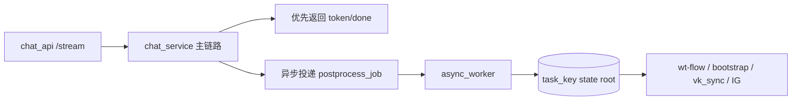

# 多任务并行 Worktree 命名空间与异步收口实施方案

> 文档日期：2026-03-03  
> 文档定位：在保持 `jjk-*` 既有串行收口语义的前提下，完成“并行隔离 + 主链路异步收口 + 状态一致性”落地  
> 执行模式：`serial`（卡片级单活），任务级并行由 `task_key` 命名空间隔离实现

---

## 0. 输入来源清单

1. `docs/plans/2026-03-03-parallel-task-worktree-namespace-design.md`
2. `docs/内部参考/迭代需求/多任务并行Worktree命名空间与异步收口_requirements.md`
3. `.cursor/commands/jjk-cardrun.md`
4. `.cursor/commands/jjk-vkplan.md`
5. `.cursor/commands/jjk-vktodo.md`
6. `scripts/coder4/wt-flow.sh`
7. `scripts/coder4/coder4_bootstrap_kernel.py`
8. `scripts/coder4/coder4_vk_sync.py`
9. `scripts/coder4/check_integration_gate.py`
10. `scripts/coder4/coder4_scope_guard.py`
11. `app/services/chat_service.py`

---

## 0.1 设计审批门禁

设计审批已满足：

- 设计文档：`docs/plans/2026-03-03-parallel-task-worktree-namespace-design.md`
- 审批记录：`design_approved: true`
- 审批时间：`2026-03-03 19:00`
- 审批轮次：`用户指令 $jjk-plan（v0.2）`

`DESIGN_APPROVAL_FALLBACK_ACK`: false

---

## 0.2 执行意图门禁

- 本轮用户指令为 `$jjk-plan`，目标是输出详细需求与计划。
- 本文遵循 `plan-only`：只产出 WHAT + HOW + 机读契约。
- 不自动触发 `$jjk-vkplan`、`$jjk-vktodo`、`$jjk-imp`。

`PLAN_EXECUTION_INTENT_REQUIRED`: true

---

## 0.3 Superpowers 产物桥接

桥接状态：`SUPERPOWERS_ARTIFACT_UNALIGNED = false`

桥接映射：

1. `docs/plans` 设计结论（命名空间隔离 + 异步收口）映射到本实施计划的 `feature_id/task_id`。
2. 本文输出的 `planning_contract` 将作为后续 `$jjk-vkplan` 唯一上游契约。
3. 下游执行链不直接消费设计文档原文，避免双真理源。

---

## 0.5 Team 判定快照

| 指标 | 数值 | 说明 |
|---|---:|---|
| module_count | 5 | `wt-flow`、读侧脚本、scope_guard、chat_service、docs/commands |
| boundary_count | 3 | workflow/scripts、runtime API、文档契约 |
| uncertainty_count | 3 | 命名空间迁移、异步幂等、legacy 兼容 |
| estimated_file_count | 10+ | 脚本+服务+文档+测试 |

判定结果：命中条件 >=2，按规则采用 Team 视角并行分析后汇总单一主计划。

---

## 1. 架构影响与约束

### 1.1 模块边界

1. `scripts/coder4/wt-flow.sh`：只负责 worktree 生命周期与卡片状态推进，不承载业务语义。
2. `coder4_*` 脚本：只消费本地状态真理源，不自行推导跨任务全局状态。
3. `chat_service`：主链路优先输出用户可见响应，后台收口动作异步执行。
4. `jjk-*` 命令文档：只声明契约，不承载脚本实现细节。

### 1.2 状态契约

1. active 索引：`docs/内部参考/任务拆解/<task_split_dir>/_active_task.json`
2. 任务级状态根：`docs/内部参考/任务拆解/<task_split_dir>/.state/<task_key>/`
3. 卡片状态：`docs/内部参考/任务拆解/<task_split_dir>/.state/<task_key>/task-runner-state.json`
4. 会话状态：`docs/内部参考/任务拆解/<task_split_dir>/.state/<task_key>/wt-flow-state.json`
5. 证据目录：`docs/内部参考/任务拆解/<task_split_dir>/.state/<task_key>/task-runner-state.json::gate_results/merge_results/<card_id>/`

### 1.3 路由闭环

1. 规划闭环：`$jjk-plan -> planning_contract`
2. 执行闭环：`$jjk-vkplan -> $jjk-vktodo -> $jjk-cardrun`
3. 回答闭环：`chat stream -> done -> async postprocess`

### 1.4 端到端链路一致性



### 1.5 可测试性要求

1. 并行隔离回归（同名卡并行）。
2. active 切换一致性回归。
3. 异步任务幂等与重试回归。
4. 主链路时延对比基线回归。

---

## 2. 方案对比

| 方案 | 优点 | 缺点 | 成本 | 推荐度 |
|---|---|---|---|---|
| A. 流程约束优先，不改代码 | 快速 | 风险无法收敛，依赖人工 | 低 | ⭐⭐ |
| B. 仅脚本命名空间改造 | 解决部分冲突 | 异步与读侧一致性问题仍在 | 中 | ⭐⭐⭐ |
| C. 全链路命名空间 + 异步收口 | 根因闭环，兼顾性能与稳定性 | 改动面更大 | 中高 | ⭐⭐⭐⭐⭐ |

结论：采用 **C**。

---

## 3. 功能机制包（Feature Packet）

### 3.1 功能机制包总表

| feature_id | card_id | 目标与边界 | 代码锚点 | 验证命令 | 回滚锚点 |
|---|---|---|---|---|---|
| P1-01 | C01 | 分支/worktree 命名空间隔离，兼容 legacy | `scripts/coder4/wt-flow.sh::cmd_create` `::_resolve_worktree_path_for_card` | `bash scripts/coder4/wt-flow.sh next --state-dir docs/内部参考/任务拆解/<task_split_dir>/.state/<task_key>`（双任务模拟） | 保留 legacy 分支解析分支 |
| P1-02 | C01 | 会话状态与卡片状态按 task_key 隔离 | `scripts/coder4/wt-flow.sh::_task_state_file` `::_read_state/_save_state` | `bash scripts/coder4/wt-flow.sh list --state-dir docs/内部参考/任务拆解/<task_split_dir>/.state/<task_key>` | 回退到全局 state 文件路径 |
| P1-03 | C02 | attempts 证据目录按 task_key 隔离 | `scripts/coder4/wt-flow.sh::_mark_card_done_after_merge` `cmd_verify` | `python3 scripts/coder4/check_integration_gate.py --task-split-dir <dir> --baseline master` | 回退旧 attempts 路径并保留兼容读取 |
| P2-01 | C03 | 读侧脚本默认路径统一到 task_key 状态根 | `scripts/coder4/coder4_bootstrap_kernel.py` `scripts/coder4/coder4_vk_sync.py` `scripts/coder4/check_integration_gate.py` | `python3 scripts/coder4/coder4_bootstrap_kernel.py --local-mode --active-task docs/内部参考/任务拆解/<task_split_dir>/_active_task.json` | 增加 fallback 到 legacy 路径 |
| P2-02 | C03 | scope_guard already_active 补齐 task_key 判定 | `scripts/coder4/coder4_scope_guard.py` | `python3 scripts/coder4/coder4_scope_guard.py --repo-root /Users/jijingkun/bojxAI/fastapi --task-split-dir <task_split_dir> --scope-request docs/内部参考/任务拆解/<task_split_dir>/.state/coder4_scope_request.json` | 回退到 split+project 判定 |
| P3-01 | C04 | 主链路优先返回，后台收口动作异步化 | `app/services/chat_service.py` | `venv/bin/python -m pytest -q tests/services/test_chat_service_async_postprocess.py` | 开关关闭异步路径，退回同步 |
| P3-02 | C04 | 异步任务幂等、重试、告警 | `app/services/chat_async_postprocess_service.py`（新增） | `venv/bin/python -m pytest -q tests/services/test_chat_async_postprocess_service.py` | 降级为仅日志不执行 |
| P3-03 | C05 | 主链路时延指标与异步任务观测 | `app/services/chat_service.py` `app/services/run_control_service.py` | `venv/bin/python -m pytest -q tests/services/test_chat_stream_latency_metrics.py` | 关闭新增 metrics，不影响主流程 |
| P4-01 | C06 | 文档/命令口径同步，避免旧示例误导 | `.cursor/commands/jjk-cardrun.md` `docs/开发文档/工作流/开发工作流.md` `docs/SUMMARY.md` | `python3 scripts/docs_guard.py --strict` | 回退文档改动 |
| G-1 | G01 | 串行闭环与作用域门禁校验 | `scripts/coder4/wt-flow.sh` `scripts/coder4/coder4_scope_guard.py` | `bash scripts/coder4/wt-flow.sh verify C01 --state-dir docs/内部参考/任务拆解/<task_split_dir>/.state/<task_key>` + `bash scripts/coder4/wt-flow.sh merge --state-dir docs/内部参考/任务拆解/<task_split_dir>/.state/<task_key>` | 失败时阻断推进 |
| IG-1 | IG01 | 集成门禁：主干可见与证据一致性 | `scripts/coder4/check_integration_gate.py` | `python3 scripts/coder4/check_integration_gate.py --task-split-dir <dir> --baseline master` | 回退并修复证据后重试 |

### 3.2 最小代码样例（每个 feature 至少 1 个）

#### P1-01 命名空间分支/工作区

```bash
# 伪代码：create 阶段按 task_key 组装路径
if [[ -n "$task_key" ]]; then
  branch="feature/${task_key}/${card_id}"
  wt_path="${WT_BASE}/${task_key}/${card_id}"
fi
```

#### P1-02 状态路径解析

```bash
_state_root() {
  local task_key="$(jq -r '.task_key // ""' "$ACTIVE_TASK_FILE")"
  [[ -n "$task_key" ]] && echo "${REPO_ROOT}/docs/内部参考/任务拆解/<task_split_dir>/.state/<task_key>/${task_key}" || echo "${REPO_ROOT}/docs/内部参考/任务拆解/<task_split_dir>/.state/<task_key>"
}
```

#### P1-03 attempts 目录隔离

```bash
result_field="task-runner-state.json::merge_results.${card_id}"
```

#### P2-01 读侧统一解析

```python
def resolve_state_file(active_task_path: Path) -> Path:
    task_key = load_json(active_task_path).get("task_key")
    if task_key:
        return Path("docs/内部参考/任务拆解/<task_split_dir>/.state/<task_key>") / task_key / "task-runner-state.json"
    return Path("docs/内部参考/任务拆解/<task_split_dir>/.state/<task_key>/task-runner-state.json")
```

#### P2-02 scope_guard 判定增强

```python
already_active = (
    current_split == task_split_dir
    and current_project == project_id
    and current_task_key == task_key
)
```

#### P3-01 主链路异步收口

```python
# 主链路：先返回 done
yield self._format_sse("done", done_payload)
# 后台：异步投递收口任务
async_postprocess.enqueue(job)
```

#### P3-02 幂等重试

```python
if idem_store.exists(job.idempotency_key):
    return
try:
    run_job(job)
except Exception:
    retry_with_backoff(job)
```

#### P3-03 观测

```python
latency_ms = int((time.time() - request_started_at) * 1000)
metrics.emit("chat_done_latency_ms", latency_ms)
```

#### P4-01 文档同步

```bash
python3 scripts/docs_guard.py --strict
```

---

## 4. 工单级任务包（Implementation Tasks）

```yaml
implementation_tasks:
  - task_id: T-01
    feature_id: P1-01
    pr_id: PR-01
    phase: Phase-1
    file_paths:
      - scripts/coder4/wt-flow.sh
    symbols:
      - cmd_create
      - _resolve_worktree_path_for_card
      - _mark_card_done_after_merge
    change_type: modify
    acceptance_cmds:
      - bash scripts/coder4/wt-flow.sh next --state-dir docs/内部参考/任务拆解/<task_split_dir>/.state/<task_key>
      - bash scripts/coder4/wt-flow.sh list --state-dir docs/内部参考/任务拆解/<task_split_dir>/.state/<task_key>
    rollback_point: 恢复 legacy 分支与 worktree 命名逻辑

  - task_id: T-02
    feature_id: P1-02
    pr_id: PR-01
    phase: Phase-1
    file_paths:
      - scripts/coder4/wt-flow.sh
    symbols:
      - _task_state_file
      - _read_state
      - _save_state
      - _clear_state
    change_type: modify
    acceptance_cmds:
      - bash scripts/coder4/wt-flow.sh list --state-dir docs/内部参考/任务拆解/<task_split_dir>/.state/<task_key>
      - bash scripts/coder4/wt-flow.sh verify C01 --state-dir docs/内部参考/任务拆解/<task_split_dir>/.state/<task_key>
    rollback_point: 切回全局 `docs/内部参考/任务拆解/<task_split_dir>/.state/<task_key>/wt-flow-state.json` 与 `docs/内部参考/任务拆解/<task_split_dir>/.state/<task_key>/task-runner-state.json`

  - task_id: T-03
    feature_id: P1-03
    pr_id: PR-02
    phase: Phase-1
    file_paths:
      - scripts/coder4/wt-flow.sh
      - scripts/coder4/check_integration_gate.py
    symbols:
      - _mark_card_done_after_merge
      - cmd_verify
      - run_check
    change_type: modify
    acceptance_cmds:
      - python3 scripts/coder4/check_integration_gate.py --task-split-dir 2026-03-01_知识库检索P2分阶段治理 --baseline master
    rollback_point: 保留 task_key 目录读取兼容并回退写入路径

  - task_id: T-04
    feature_id: P2-01
    pr_id: PR-03
    phase: Phase-2
    file_paths:
      - scripts/coder4/coder4_bootstrap_kernel.py
      - scripts/coder4/coder4_vk_sync.py
      - scripts/coder4/check_integration_gate.py
    symbols:
      - DEFAULT_STATE_FILE
      - parse_args
      - run_check
    change_type: modify
    acceptance_cmds:
      - python3 scripts/coder4/coder4_bootstrap_kernel.py --local-mode --active-task docs/内部参考/任务拆解/<task_split_dir>/_active_task.json
      - python3 scripts/coder4/coder4_vk_sync.py --active-task docs/内部参考/任务拆解/<task_split_dir>/_active_task.json --dry-run --output -
    rollback_point: 提供 legacy 路径 fallback 并保持参数可覆盖

  - task_id: T-05
    feature_id: P2-02
    pr_id: PR-03
    phase: Phase-2
    file_paths:
      - scripts/coder4/coder4_scope_guard.py
    symbols:
      - validate_split
      - already_active
    change_type: modify
    acceptance_cmds:
      - python3 scripts/coder4/coder4_scope_guard.py --repo-root /Users/jijingkun/bojxAI/fastapi --task-split-dir <task_split_dir> --scope-request docs/内部参考/任务拆解/<task_split_dir>/.state/coder4_scope_request.json
    rollback_point: 回退 task_key 判定并保留日志告警

  - task_id: T-06
    feature_id: P3-01
    pr_id: PR-04
    phase: Phase-3
    file_paths:
      - app/services/chat_service.py
      - app/api/v1/endpoints/chat_api.py
    symbols:
      - ChatService.stream
      - _build_done_payload
    change_type: modify
    acceptance_cmds:
      - venv/bin/python -m pytest -q tests/services/test_chat_service_async_postprocess.py
    rollback_point: 通过开关退回同步收口路径

  - task_id: T-07
    feature_id: P3-02
    pr_id: PR-04
    phase: Phase-3
    file_paths:
      - app/services/chat_async_postprocess_service.py
      - app/services/run_control_service.py
    symbols:
      - enqueue
      - run_once
      - retry_with_backoff
    change_type: add
    acceptance_cmds:
      - venv/bin/python -m pytest -q tests/services/test_chat_async_postprocess_service.py
    rollback_point: 异步服务降级为 no-op，仅记录日志

  - task_id: T-08
    feature_id: P3-03
    pr_id: PR-05
    phase: Phase-4
    file_paths:
      - app/services/chat_service.py
      - app/services/run_control_service.py
      - app/core/constants.py
    symbols:
      - stream
      - complete_run
    change_type: modify
    acceptance_cmds:
      - venv/bin/python -m pytest -q tests/services/test_chat_stream_latency_metrics.py
    rollback_point: 关闭新增 metrics 采集

  - task_id: T-09
    feature_id: P4-01
    pr_id: PR-05
    phase: Phase-4
    file_paths:
      - .cursor/commands/jjk-cardrun.md
      - .cursor/commands/jjk-vkplan.md
      - docs/开发文档/工作流/开发工作流.md
      - docs/SUMMARY.md
    symbols:
      - execution_mode
      - wt-flow-state
    change_type: modify
    acceptance_cmds:
      - python3 scripts/docs_guard.py --strict
    rollback_point: 文档回退到上个稳定版本

  - task_id: T-10
    feature_id: G-1
    pr_id: PR-06
    phase: Gate
    file_paths:
      - scripts/coder4/wt-flow.sh
      - scripts/coder4/coder4_scope_guard.py
    symbols:
      - cmd_verify
      - cmd_merge
    change_type: modify
    acceptance_cmds:
      - bash scripts/coder4/wt-flow.sh verify C01 --state-dir docs/内部参考/任务拆解/<task_split_dir>/.state/<task_key>
      - bash scripts/coder4/wt-flow.sh merge --state-dir docs/内部参考/任务拆解/<task_split_dir>/.state/<task_key>
    rollback_point: gate 阻断，不允许推进 IG

  - task_id: T-11
    feature_id: IG-1
    pr_id: PR-06
    phase: Integration-Gate
    file_paths:
      - scripts/coder4/check_integration_gate.py
    symbols:
      - run_check
    change_type: modify
    acceptance_cmds:
      - python3 scripts/coder4/check_integration_gate.py --task-split-dir 2026-03-01_知识库检索P2分阶段治理 --baseline master
    rollback_point: 失败阻断发布，回到对应 feature 修复
```

---

## 5. PR 映射契约（task_to_pr_mapping）

```yaml
task_to_pr_mapping:
  - task_id: T-01
    pr_id: PR-01
    pr_branch: codex/parallel-wt-namespace-pr-01
    pr_depends_on: []
    pr_subject: "wt-flow 命名空间改造：分支与 worktree"
    acceptance_cmds:
      - bash scripts/coder4/wt-flow.sh next --state-dir docs/内部参考/任务拆解/<task_split_dir>/.state/<task_key>
    rollback_point: 回退 create/path 相关改动

  - task_id: T-02
    pr_id: PR-01
    pr_branch: codex/parallel-wt-namespace-pr-01
    pr_depends_on: []
    pr_subject: "wt-flow 状态隔离：session/task state"
    acceptance_cmds:
      - bash scripts/coder4/wt-flow.sh list --state-dir docs/内部参考/任务拆解/<task_split_dir>/.state/<task_key>
    rollback_point: 回退 state 路径解析

  - task_id: T-03
    pr_id: PR-02
    pr_branch: codex/parallel-wt-attempts-pr-02
    pr_depends_on: [PR-01]
    pr_subject: "attempts 证据目录 task_key 隔离"
    acceptance_cmds:
      - python3 scripts/coder4/check_integration_gate.py --task-split-dir 2026-03-01_知识库检索P2分阶段治理 --baseline master
    rollback_point: 临时兼容旧 attempts 读取

  - task_id: T-04
    pr_id: PR-03
    pr_branch: codex/parallel-wt-readers-pr-03
    pr_depends_on: [PR-01, PR-02]
    pr_subject: "bootstrap/vk_sync/IG 读侧路径统一"
    acceptance_cmds:
      - python3 scripts/coder4/coder4_vk_sync.py --active-task docs/内部参考/任务拆解/<task_split_dir>/_active_task.json --dry-run --output -
    rollback_point: 回退默认路径并保留参数覆盖

  - task_id: T-05
    pr_id: PR-03
    pr_branch: codex/parallel-wt-readers-pr-03
    pr_depends_on: [PR-01, PR-02]
    pr_subject: "scope_guard already_active 增补 task_key"
    acceptance_cmds:
      - python3 scripts/coder4/coder4_scope_guard.py --repo-root /Users/jijingkun/bojxAI/fastapi --task-split-dir <task_split_dir> --scope-request docs/内部参考/任务拆解/<task_split_dir>/.state/coder4_scope_request.json
    rollback_point: 保持旧判定 + 追加告警

  - task_id: T-06
    pr_id: PR-04
    pr_branch: codex/chat-async-postprocess-pr-04
    pr_depends_on: [PR-03]
    pr_subject: "chat 主链路异步收口：先响应后后台"
    acceptance_cmds:
      - venv/bin/python -m pytest -q tests/services/test_chat_service_async_postprocess.py
    rollback_point: 开关切回同步收口

  - task_id: T-07
    pr_id: PR-04
    pr_branch: codex/chat-async-postprocess-pr-04
    pr_depends_on: [PR-03]
    pr_subject: "异步任务幂等与重试服务"
    acceptance_cmds:
      - venv/bin/python -m pytest -q tests/services/test_chat_async_postprocess_service.py
    rollback_point: 降级为 no-op worker

  - task_id: T-08
    pr_id: PR-05
    pr_branch: codex/chat-async-observability-pr-05
    pr_depends_on: [PR-04]
    pr_subject: "主链路时延与异步任务观测"
    acceptance_cmds:
      - venv/bin/python -m pytest -q tests/services/test_chat_stream_latency_metrics.py
    rollback_point: 停用 metrics 埋点

  - task_id: T-09
    pr_id: PR-05
    pr_branch: codex/chat-async-observability-pr-05
    pr_depends_on: [PR-04]
    pr_subject: "命令与流程文档同步"
    acceptance_cmds:
      - python3 scripts/docs_guard.py --strict
    rollback_point: 回退文档更新

  - task_id: T-10
    pr_id: PR-06
    pr_branch: codex/parallel-wt-gates-pr-06
    pr_depends_on: [PR-05]
    pr_subject: "G1 串行门禁收口验证"
    acceptance_cmds:
      - bash scripts/coder4/wt-flow.sh verify C01 --state-dir docs/内部参考/任务拆解/<task_split_dir>/.state/<task_key>
      - bash scripts/coder4/wt-flow.sh merge --state-dir docs/内部参考/任务拆解/<task_split_dir>/.state/<task_key>
    rollback_point: 阻断进入 IG，回滚上游 PR

  - task_id: T-11
    pr_id: PR-06
    pr_branch: codex/parallel-wt-gates-pr-06
    pr_depends_on: [PR-05]
    pr_subject: "IG1 集成门禁与主干可见性校验"
    acceptance_cmds:
      - python3 scripts/coder4/check_integration_gate.py --task-split-dir 2026-03-01_知识库检索P2分阶段治理 --baseline master
    rollback_point: 集成门禁失败即停止发布
```

---

## 6. planning_contract（供 `$jjk-vkplan` 直接消费）

```yaml
planning_contract:
  task_key: PP-20260303-WT-NAMESPACE-ASYNC-CLOSEOUT
  execution_mode: serial
  strict_single_active_card: true
  auto_done_policy:
    implementation-card: hard_gate
    inspection/question-card: policy_gate
  gate_contract:
    mode: as_cards
    gate_ids: [G01, IG01]
    depends_on:
      G01: [C06]
      IG01: [G01]
  card_order: [C01, C02, C03, C04, C05, C06, G01, IG01]
  cards:
    - card_id: C01
      wave: P1
      feature_ids: [P1-01, P1-02]
      depends_on: []
      task_mode: implementation-card
      merge_required: true
      done_gate:
        - 命名空间分支与 worktree 创建通过
        - task_key 状态路径可解析
      acceptance_checks:
        - bash scripts/coder4/wt-flow.sh next --state-dir docs/内部参考/任务拆解/<task_split_dir>/.state/<task_key>
        - bash scripts/coder4/wt-flow.sh list --state-dir docs/内部参考/任务拆解/<task_split_dir>/.state/<task_key>
      evidence_entry: docs/内部参考/迭代需求/多任务并行Worktree命名空间与异步收口_implementation_plan.md

    - card_id: C02
      wave: P1
      feature_ids: [P1-03]
      depends_on: [C01]
      task_mode: implementation-card
      merge_required: true
      done_gate:
        - attempts 目录按 task_key 隔离
      acceptance_checks:
        - python3 scripts/coder4/check_integration_gate.py --task-split-dir 2026-03-01_知识库检索P2分阶段治理 --baseline master
      evidence_entry: docs/内部参考/迭代需求/多任务并行Worktree命名空间与异步收口_implementation_plan.md

    - card_id: C03
      wave: P2
      feature_ids: [P2-01, P2-02]
      depends_on: [C02]
      task_mode: implementation-card
      merge_required: true
      done_gate:
        - 读侧脚本默认路径与 active task_key 对齐
      acceptance_checks:
        - python3 scripts/coder4/coder4_bootstrap_kernel.py --local-mode --active-task docs/内部参考/任务拆解/<task_split_dir>/_active_task.json
        - python3 scripts/coder4/coder4_vk_sync.py --active-task docs/内部参考/任务拆解/<task_split_dir>/_active_task.json --dry-run --output -
      evidence_entry: docs/内部参考/迭代需求/多任务并行Worktree命名空间与异步收口_implementation_plan.md

    - card_id: C04
      wave: P3
      feature_ids: [P3-01, P3-02]
      depends_on: [C03]
      task_mode: implementation-card
      merge_required: true
      done_gate:
        - 主链路先返回 done
        - 后台收口任务异步投递并可重试
      acceptance_checks:
        - venv/bin/python -m pytest -q tests/services/test_chat_service_async_postprocess.py
        - venv/bin/python -m pytest -q tests/services/test_chat_async_postprocess_service.py
      evidence_entry: docs/内部参考/迭代需求/多任务并行Worktree命名空间与异步收口_implementation_plan.md

    - card_id: C05
      wave: P3
      feature_ids: [P3-03]
      depends_on: [C04]
      task_mode: implementation-card
      merge_required: true
      done_gate:
        - 主链路时延指标接入
        - 异步任务失败观测可追踪
      acceptance_checks:
        - venv/bin/python -m pytest -q tests/services/test_chat_stream_latency_metrics.py
      evidence_entry: docs/内部参考/迭代需求/多任务并行Worktree命名空间与异步收口_implementation_plan.md

    - card_id: C06
      wave: P4
      feature_ids: [P4-01]
      depends_on: [C05]
      task_mode: implementation-card
      merge_required: true
      done_gate:
        - 文档口径统一
        - docs_guard 严格校验通过
      acceptance_checks:
        - python3 scripts/docs_guard.py --strict
      evidence_entry: docs/内部参考/迭代需求/多任务并行Worktree命名空间与异步收口_implementation_plan.md

    - card_id: G01
      wave: Gate
      feature_ids: [G-1]
      depends_on: [C06]
      task_mode: inspection-card
      merge_required: false
      done_gate:
        - verify -> merge -> done 串行闭环通过
      acceptance_checks:
        - bash scripts/coder4/wt-flow.sh verify C01 --state-dir docs/内部参考/任务拆解/<task_split_dir>/.state/<task_key>
        - bash scripts/coder4/wt-flow.sh merge --state-dir docs/内部参考/任务拆解/<task_split_dir>/.state/<task_key>
      evidence_entry: docs/内部参考/迭代需求/多任务并行Worktree命名空间与异步收口_implementation_plan.md

    - card_id: IG01
      wave: Integration-Gate
      feature_ids: [IG-1]
      depends_on: [G01]
      task_mode: inspection-card
      merge_required: false
      done_gate:
        - 集成门禁通过且主干可见
      acceptance_checks:
        - python3 scripts/coder4/check_integration_gate.py --task-split-dir 2026-03-01_知识库检索P2分阶段治理 --baseline master
      evidence_entry: docs/内部参考/迭代需求/多任务并行Worktree命名空间与异步收口_implementation_plan.md

  task_to_pr_mapping:
    - task_id: T-01
      pr_id: PR-01
      pr_branch: codex/parallel-wt-namespace-pr-01
      pr_depends_on: []
      pr_subject: "wt-flow 命名空间改造：分支与 worktree"
      acceptance_cmds:
        - bash scripts/coder4/wt-flow.sh next --state-dir docs/内部参考/任务拆解/<task_split_dir>/.state/<task_key>
      rollback_point: 回退 create/path 命名空间改造

    - task_id: T-02
      pr_id: PR-01
      pr_branch: codex/parallel-wt-namespace-pr-01
      pr_depends_on: []
      pr_subject: "wt-flow 状态隔离：session + task state"
      acceptance_cmds:
        - bash scripts/coder4/wt-flow.sh list --state-dir docs/内部参考/任务拆解/<task_split_dir>/.state/<task_key>
      rollback_point: 回退状态路径改造

    - task_id: T-03
      pr_id: PR-02
      pr_branch: codex/parallel-wt-attempts-pr-02
      pr_depends_on: [PR-01]
      pr_subject: "attempts 证据目录 task_key 隔离"
      acceptance_cmds:
        - python3 scripts/coder4/check_integration_gate.py --task-split-dir 2026-03-01_知识库检索P2分阶段治理 --baseline master
      rollback_point: 兼容读取旧证据路径

    - task_id: T-04
      pr_id: PR-03
      pr_branch: codex/parallel-wt-readers-pr-03
      pr_depends_on: [PR-01, PR-02]
      pr_subject: "读侧路径统一（bootstrap/vk_sync/IG）"
      acceptance_cmds:
        - python3 scripts/coder4/coder4_vk_sync.py --active-task docs/内部参考/任务拆解/<task_split_dir>/_active_task.json --dry-run --output -
      rollback_point: 回退默认路径，保留参数化

    - task_id: T-05
      pr_id: PR-03
      pr_branch: codex/parallel-wt-readers-pr-03
      pr_depends_on: [PR-01, PR-02]
      pr_subject: "scope_guard already_active 增补 task_key"
      acceptance_cmds:
        - python3 scripts/coder4/coder4_scope_guard.py --repo-root /Users/jijingkun/bojxAI/fastapi --task-split-dir <task_split_dir> --scope-request docs/内部参考/任务拆解/<task_split_dir>/.state/coder4_scope_request.json
      rollback_point: 回退到 split+project 判定

    - task_id: T-06
      pr_id: PR-04
      pr_branch: codex/chat-async-postprocess-pr-04
      pr_depends_on: [PR-03]
      pr_subject: "聊天主链路异步收口（先回答后处理）"
      acceptance_cmds:
        - venv/bin/python -m pytest -q tests/services/test_chat_service_async_postprocess.py
      rollback_point: 开关退回同步收口

    - task_id: T-07
      pr_id: PR-04
      pr_branch: codex/chat-async-postprocess-pr-04
      pr_depends_on: [PR-03]
      pr_subject: "异步任务幂等与重试"
      acceptance_cmds:
        - venv/bin/python -m pytest -q tests/services/test_chat_async_postprocess_service.py
      rollback_point: 异步服务降级 no-op

    - task_id: T-08
      pr_id: PR-05
      pr_branch: codex/chat-async-observability-pr-05
      pr_depends_on: [PR-04]
      pr_subject: "主链路时延与异步任务可观测"
      acceptance_cmds:
        - venv/bin/python -m pytest -q tests/services/test_chat_stream_latency_metrics.py
      rollback_point: 关闭新增监控项

    - task_id: T-09
      pr_id: PR-05
      pr_branch: codex/chat-async-observability-pr-05
      pr_depends_on: [PR-04]
      pr_subject: "命令与工作流文档同步"
      acceptance_cmds:
        - python3 scripts/docs_guard.py --strict
      rollback_point: 文档回退

    - task_id: T-10
      pr_id: PR-06
      pr_branch: codex/parallel-wt-gates-pr-06
      pr_depends_on: [PR-05]
      pr_subject: "G1 串行门禁收口"
      acceptance_cmds:
        - bash scripts/coder4/wt-flow.sh verify C01 --state-dir docs/内部参考/任务拆解/<task_split_dir>/.state/<task_key>
        - bash scripts/coder4/wt-flow.sh merge --state-dir docs/内部参考/任务拆解/<task_split_dir>/.state/<task_key>
      rollback_point: gate 失败即阻断

    - task_id: T-11
      pr_id: PR-06
      pr_branch: codex/parallel-wt-gates-pr-06
      pr_depends_on: [PR-05]
      pr_subject: "IG1 集成门禁与主干可见性"
      acceptance_cmds:
        - python3 scripts/coder4/check_integration_gate.py --task-split-dir 2026-03-01_知识库检索P2分阶段治理 --baseline master
      rollback_point: 集成门禁失败回退至对应功能卡
```

---

## 7. execution_contract（执行契约）

```yaml
execution_contract:
  delivery_mode: one_shot
  execution_unit: all_tasks
  commit_policy: single_commit
  stop_boundary: none
  stop_on_blocked: true
```

约束校验：

1. `delivery_mode=one_shot` 与 `stop_boundary=none` 对齐。
2. `commit_policy=single_commit` 与 `one_shot` 对齐。
3. 命中阻塞时必须停止，禁止跳卡。

---

## 8. 测试策略（TDD 前置）

```yaml
test_strategy:
  - feature_id: P1-01
    test_cases:
      - TC-WT-01-01: 两个 task_key 同名 C01 可并行创建分支
      - TC-WT-01-02: worktree 路径按 task_key 隔离
    test_first: true

  - feature_id: P1-03
    test_cases:
      - TC-WT-03-01: merge_result 写入 task_key 作用域 attempts
      - TC-WT-03-02: gate_result 写入 task_key 作用域 attempts
    test_first: true

  - feature_id: P2-01
    test_cases:
      - TC-STATE-01: bootstrap 默认读取当前 active task_key 状态文件
      - TC-STATE-02: vk_sync 默认读取当前 active task_key 状态文件
    test_first: true

  - feature_id: P3-01
    test_cases:
      - TC-ASYNC-01: done 事件先于后台收口完成返回
      - TC-ASYNC-02: 后台收口失败不影响用户响应
    test_first: true

  - feature_id: P3-02
    test_cases:
      - TC-ASYNC-03: 相同 idempotency key 不重复执行
      - TC-ASYNC-04: 失败任务按退避重试
    test_first: true
```

---

## 9. 风险评估与缓解

| 风险 | 影响 | 概率 | 缓解措施 |
|---|---|---|---|
| 仅改写路径未改读侧 | 高 | 高 | P2-01 作为强制卡，不通过不进 C04 |
| 异步任务丢失或重复 | 高 | 中 | 幂等键 + 重试 + 失败告警 + 可回放日志 |
| legacy 兼容导致逻辑分叉 | 中 | 中 | 统一解析函数 + 分阶段迁移窗口 |
| 文档口径与脚本实现漂移 | 中 | 中 | C06 强制 docs_guard + 命令文档同步 |

---

## 10. 首周 P0 最小执行清单（可并行）

### 10.1 目标与原则

1. 只做 P0 根因项：命名空间冲突、读写漂移、主链路同步收口阻塞。
2. 严禁“边改边扩需求”：首周不做体验增强，只做稳定性与时延保护。
3. 所有改动必须满足“用户回答优先”原则：先发 `done`，后做后台收口。

### 10.2 并行分工（建议 4 路 AI）

| 工作包 | 负责人建议 | 文件边界 | 依赖 | 预估 | 完成标志 |
|---|---|---|---|---|---|
| WP-A：`wt-flow` 命名空间改造 | AI-1 | `scripts/coder4/wt-flow.sh` | 无 | 1.5 天 | 分支/worktree/state/gate_results/merge_results 均可按 `task_key` 隔离 |
| WP-B：读侧路径统一 | AI-2 | `scripts/coder4/coder4_bootstrap_kernel.py`、`scripts/coder4/coder4_vk_sync.py`、`scripts/coder4/check_integration_gate.py`、`scripts/coder4/coder4_scope_guard.py` | WP-A 部分函数契约 | 1.5 天 | active task 切换后读写一致，不再命中全局旧路径 |
| WP-C：主链路异步收口 | AI-3 | `app/services/chat_service.py` + 新增异步收口服务文件 | 无（可并行） | 2 天 | 用户响应关键路径不再等待后台收口 |
| WP-D：测试与文档门禁 | AI-4 | `tests/**`、`.cursor/commands/**`、`docs/开发文档/工作流/**`、`docs/SUMMARY.md` | 依赖 A/B/C 输出 | 1 天 | 回归用例+文档口径统一+docs_guard 通过 |

### 10.3 每日节奏（5 天）

1. D1：冻结接口与路径契约（`task_key state_root` 统一函数签名），并完成 WP-A 50%。
2. D2：完成 WP-A，WP-B 启动并打通 `bootstrap/vk_sync` 路径。
3. D3：完成 WP-B；WP-C 完成“先 `done` 后收口”的最小闭环与开关。
4. D4：WP-C 补幂等与重试；WP-D 开始集成回归与文档同步。
5. D5：执行 G1/IG1 门禁，整理证据，冻结首周发布包。

### 10.4 首周硬门禁（必须全部满足）

1. **并行隔离门禁**：同名 `C01` 在两任务并行下不发生分支/worktree/state/gate_results/merge_results 冲突。
2. **一致性门禁**：`_active_task.json.task_key` 与 `task-runner-state.json.task_key` 一致。
3. **异步时延门禁**：主链路 `done` 事件不等待 flush/rebuild/sync 等后台动作。
4. **失败隔离门禁**：后台收口失败仅告警，不影响本次回答返回。
5. **文档门禁**：`python3 scripts/docs_guard.py --strict` 通过。

### 10.5 首周验收命令（建议顺序）

```bash
# 1) 文档与索引
python3 scripts/docs_guard.py --strict

# 2) 并行隔离与状态一致性
bash scripts/coder4/wt-flow.sh next --state-dir docs/内部参考/任务拆解/<task_split_dir>/.state/<task_key>
bash scripts/coder4/wt-flow.sh list --state-dir docs/内部参考/任务拆解/<task_split_dir>/.state/<task_key>
python3 scripts/coder4/coder4_bootstrap_kernel.py --local-mode --active-task docs/内部参考/任务拆解/<task_split_dir>/_active_task.json
python3 scripts/coder4/coder4_vk_sync.py --active-task docs/内部参考/任务拆解/<task_split_dir>/_active_task.json --dry-run --output -

# 3) 串行门禁与集成门禁
bash scripts/coder4/wt-flow.sh verify C01 --state-dir docs/内部参考/任务拆解/<task_split_dir>/.state/<task_key>
bash scripts/coder4/wt-flow.sh merge --state-dir docs/内部参考/任务拆解/<task_split_dir>/.state/<task_key>
python3 scripts/coder4/check_integration_gate.py --task-split-dir 2026-03-01_知识库检索P2分阶段治理 --baseline master

# 4) 异步主链路回归（需新增测试文件）
venv/bin/python -m pytest -q tests/services/test_chat_service_async_postprocess.py
venv/bin/python -m pytest -q tests/services/test_chat_async_postprocess_service.py
venv/bin/python -m pytest -q tests/services/test_chat_stream_latency_metrics.py
```

---

## 11. implementation_readiness（机读结论）

```yaml
implementation_readiness:
  implementation_ready: true
  blocked_by: []
  next_step: /jjk-vkplan
  execution_contract_ready: true
```

补充：当前轮仍为 `plan-only`，如需进入执行链请显式指令 `$jjk-vkplan`。
