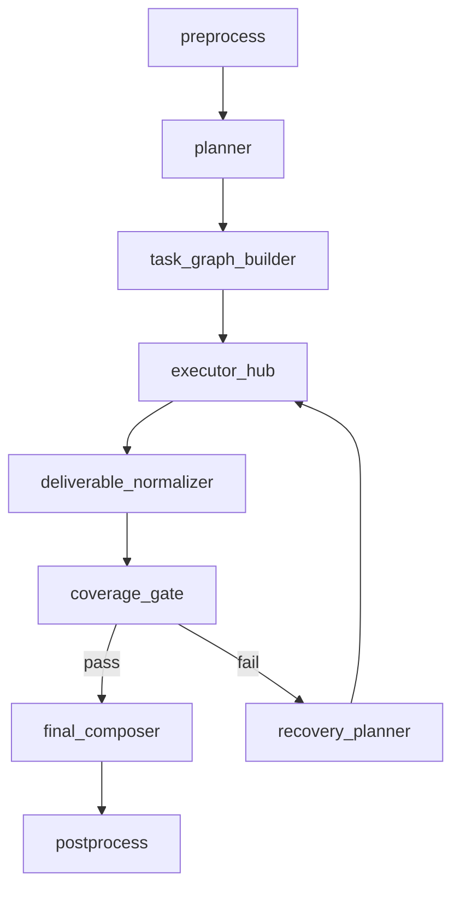

# 多智能体完整交付架构重构 — 实施方案

> 日期：2026-02-27  
> 需求基线：`docs/内部参考/迭代需求/多智能体完整交付架构重构_requirements.md`  
> 执行模式：`serial`（全局架构重构，单活推进）  
> 对标参考：`/Users/jijingkun/bojxAI/bot/openclaw/docs/pi.md`

---

## 0. 输入来源清单（深度分析证据）

### 0.1 代码来源

1. `app/ai/workflow/multi_agent_graph.py`
2. `app/ai/workflow/todo_graph.py`
3. `app/ai/workflow/data_graph.py`
4. `app/services/chat_service.py`
5. `app/ai/events.py`
6. `app/ai/protocol.py`
7. `web/src/hooks/useSSEStream.ts`
8. `web/src/components/chat/messages/ai.tsx`
9. `app/repositories/chat_repo.py`
10. `app/db/session.py`

### 0.2 测试来源

1. `tests/unit/test_multi_intent_queue_flow.py`
2. `tests/unit/test_multi_agent_streaming_helpers.py`
3. `tests/unit/test_todo_handoff_observation.py`
4. `tests/unit/test_chat_service_done_payload.py`
5. `tests/unit/test_chat_service_turn_slice.py`

### 0.3 文档来源

1. `docs/开发文档/架构设计/AI模块设计.md`
2. `docs/API文档/接口文档.md`
3. `docs/内部参考/迭代需求/openclaw迁移重建基线_implementation_plan.md`
4. `docs/内部参考/迭代需求/迁移执行波次_implementation_plan.md`
5. `docs/内部参考/迭代需求/streaming_wrapper简化_implementation_plan.md`

### 0.4 外部框架参考（LangGraph API）

1. Context7 `/websites/langchain_oss_python_langgraph`：
   - `StateGraph + conditional edges` 路由工作流
   - `interrupt + checkpointer + Command(resume=...)` 人机中断闭环
   - `stream_mode="custom"` 节点自定义事件流

---

## 1. 架构影响与约束（必查项）

### 1.1 模块边界

1. 编排层：新增“交付导向”节点（Planner / TaskGraph / CoverageGate / Composer）。
2. 执行层：保留 `todo_expert` / `data_expert` / Supervisor 工具能力，但改为静默 worker 语义。
3. 协议层：SSE 增量扩展，不破坏 `token/result/done/interrupt` 现有消费。
4. 展示层：前端区分“过程事件”和“最终答案事件”。

### 1.2 状态契约

引入四个核心契约对象并定义生命周期：

1. `intent_plan`：由 Planner 创建，仅当前轮有效。
2. `deliverables`：由 worker 追加，当前轮可回放。
3. `coverage_report`：由 Gate 计算，决定是否允许收口。
4. `final_answer`：仅 Composer 可写，作为用户最终可见正文。

### 1.3 路由闭环

目标闭环：

`preprocess -> planner -> execute(task graph) -> coverage_gate -> (pass -> composer -> postprocess | fail -> recovery_planner -> execute)`

禁止路径：

1. worker 直接结束整轮。
2. 无 coverage 校验直接进入 done。

### 1.4 端到端链路一致性

1. `current_todo_id` 从 API 入参到 state 注入保持同轮可见。
2. 当前轮范围定义由 `turn_id` 统一，避免跨轮读取历史 deliverables。
3. 数据持久化按 `thread_id + run_id + turn_id` 严格关联。

### 1.5 可测试性

1. 每个 `feature_id` 至少 1 个单测锚点。
2. 关键链路（复合请求完整覆盖）必须具备集成与 E2E 双层验证。
3. 关键协议事件需有 contract test（字段冻结与兼容校验）。

---

## 2. OpenClaw 对标差异（先说明差异）

### 2.1 对齐点

1. 工具执行经统一管线治理（policy filtering / safe fallback）。
2. 流式事件采用统一 writer 发射，前后端按事件协议消费。
3. 会话与状态要有可恢复与防错机制（checkpoint/guard）。

### 2.2 差异点

1. OpenClaw 以“单 Agent Loop + 工具管线”为主；本项目是 Supervisor + 专家子图。
2. 本项目现阶段最大问题是“答复完整性交付”，而非工具接线能力缺失。
3. 因此本次设计在 OpenClaw 对齐基础上新增“Coverage Gate + Single Composer”层。

### 2.3 结论

1. 不移除 subagent 执行边界。
2. 移除 subagent 对外表达权。
3. 统一由 Composer 生成用户最终答复。

---

## 3. 目标架构（全量重构）



### 3.1 设计原则

1. 计划与执行分离：先产 `intent_plan`，后跑 `task_graph`。
2. 执行与交付分离：worker 只产结构化结果，不直接成文。
3. 交付与展示分离：最终只由 Composer 产用户正文。
4. 质量先于结束：Coverage Gate 不通过不得 done。

### 3.2 状态机新增字段（MultiAgentState）

| 字段 | 类型 | 说明 |
|---|---|---|
| `turn_id` | str | 当前轮唯一 ID（跨节点一致） |
| `intent_plan` | dict | 用户问题合同（goals 有序） |
| `task_graph` | dict | 可执行任务图（nodes/edges） |
| `task_runs` | list | 任务执行记录（状态/重试/耗时） |
| `deliverables` | list | 结构化交付物（按 goal_id） |
| `coverage_report` | dict | 覆盖率校验结果 |
| `final_answer` | str | 唯一最终答复文本 |
| `delivery_meta` | dict | 去重/时效/排序统计信息 |

状态优先级：`current_turn > handoff > persisted_state > default`。

---

## 4. API / SSE 协议设计

### 4.1 后端 API 维持

1. 仍使用 `POST /api/v1/chat/stream` 与 `POST /api/v1/chat/resume`。
2. 不引入新主入口，保持现网调用兼容。

### 4.2 SSE 事件增量扩展（V2）

新增事件（增量，不替代旧事件）：

1. `plan_ready`：输出 `intent_plan` 摘要（仅调试视图可见）。
2. `task_started` / `task_finished`：任务执行进度。
3. `coverage_check`：输出覆盖率结果（pass/missing/failed）。
4. `final_answer`：最终答案事件（用户正文唯一信源）。

兼容策略：

1. 保留 `token/result/done/interrupt/stopped`。
2. `done` 仅作为生命周期结束，不再承载最终业务正文。
3. 前端默认优先渲染 `final_answer`；无该事件时回退旧逻辑。

### 4.3 契约冻结（SSE）

1. `done`：必含 `thread_id/run_id/message_id`。
2. `result`：必含 `type/content/meta`（兼容现有冻结规则）。
3. `interrupt`：必含 `reason/message/thread_id/interrupt_id/recoverable`。

---

## 5. 数据模型与双库约束

### 5.1 chat_db（新增表）

新增（建议）表：

1. `t_turn_plan`：存储每轮 intent_plan。
2. `t_turn_task`：存储 task_graph 与 task_runs。
3. `t_turn_deliverable`：存储结构化交付物。
4. `t_turn_coverage`：存储 coverage_report 与 gate 结论。

统一主键关联：`thread_id + run_id + turn_id`。

### 5.2 data_db（保持只读）

1. `fdmdata.*` / `sdmdata.*` 只读查询路径保持不变。
2. 不在 data_db 增加任何写入表或审计表。

### 5.3 迁移策略

1. 先落库结构，再以 feature flag 启用写入。
2. 灰度期双写（新 ledger + 旧消息保存）并比对一致性。

---

## 6. 功能机制包总表（Feature Packet）

| feature_id | 目标与边界 | 触发与状态流转 | 代码锚点 | 回滚锚点 | 验证命令 | 来源证据 |
|---|---|---|---|---|---|---|
| P1-01 | 引入 Intent Planner 合同层；不改现有专家业务能力 | preprocess 后进入 planner，写入 goals | `app/ai/workflow/multi_agent_graph.py`（拆分后 planner 节点） | `ENABLE_DELIVERY_ORCHESTRATOR_V2=false` | `PYTHONPATH=. pytest tests/unit/test_delivery_planner.py` | `multi_agent_graph` 当前仅基于 handoff 无显式问题合同 |
| P1-02 | 引入 Task Graph Builder 与调度器；不暴露给用户 | planner->task_graph->executor | `app/ai/workflow/multi_agent_graph.py`、`app/ai/state.py` | 同上 | `PYTHONPATH=. pytest tests/unit/test_delivery_task_graph.py` | 当前 `handoff_queue` 仅线性，不支持合同化任务依赖 |
| P1-03 | Worker 输出统一为 Deliverable Envelope；不允许自由文本作为最终结果 | worker 完成后 normalize | `app/ai/workflow/todo_graph.py`、`app/ai/workflow/data_graph.py`、`app/ai/protocol.py` | `ENABLE_DELIVERABLE_ENVELOPE_V2=false` | `PYTHONPATH=. pytest tests/unit/test_delivery_envelope.py` | `todo_graph._execute_query` 结构化能力已存在但汇总未消费 |
| P1-04 | 覆盖率门禁（Coverage Gate）；不做 UI 展示策略 | normalize 后 coverage_check，fail 则 recovery | `app/ai/workflow/multi_agent_graph.py` | `ENABLE_COVERAGE_GATE_V2=false` | `PYTHONPATH=. pytest tests/unit/test_coverage_gate.py` | 当前 `_evaluate_handoff_progress` 不校验 must_answer 覆盖 |
| P2-01 | 单一最终答复节点 Composer；不允许 worker 直出终态 | coverage pass -> composer -> postprocess | `app/ai/workflow/multi_agent_graph.py`、`app/ai/protocol.py` | `ENABLE_SINGLE_COMPOSER_V2=false` | `PYTHONPATH=. pytest tests/unit/test_final_composer.py` | 当前 `_build_multi_intent_summary_content` 暴露内部执行痕迹 |
| P2-02 | SSE V2 事件层（plan/task/coverage/final）；不破坏旧字段 | graph custom event -> chat_service -> frontend | `app/ai/events.py`、`app/services/chat_service.py`、`web/src/lib/backend.ts` | `ENABLE_SSE_DELIVERY_EVENTS_V2=false` | `PYTHONPATH=. pytest tests/unit/test_chat_service_delivery_events.py` | 当前仅 token/result，缺 final_answer 语义 |
| P2-03 | 前端渲染分层：过程事件与最终正文解耦 | SSE 消费 final_answer 优先 | `web/src/hooks/useSSEStream.ts`、`web/src/components/chat/messages/ai.tsx` | `ENABLE_FRONTEND_FINAL_ANSWER_V2=false` | `cd web && pnpm test -- useSSEStream.delivery` | 当前过程文本与最终正文混写 |
| P3-01 | 交付账本持久化（plan/task/deliverable/coverage） | postprocess 写入 ledger | `app/repositories/chat_repo.py`、新增 repository/model | `ENABLE_DELIVERY_LEDGER_V2=false` | `PYTHONPATH=. pytest tests/unit/test_delivery_ledger_repo.py` | 当前仅 `t_chat_message.metadata`，缺可回放链路 |
| P3-02 | 回放与离线评测框架（完整率/顺序/去重） | 每日回放样本并产指标 | `tests/scenarios/`、`scripts/`、`docs/开发文档/测试管理` | `ENABLE_DELIVERY_REPLAY_EVAL=false` | `PYTHONPATH=. pytest tests/scenarios/test_delivery_full_answer_flow.py` | 现有测试未覆盖“完整交付率” |
| P4-01 | 兼容迁移与灰度回滚（双栈） | 旧链路与新链路可切换 | `app/services/chat_service.py`、`app/ai/workflow/__init__.py` | `ENABLE_DELIVERY_ORCHESTRATOR_V2=false` | `PYTHONPATH=. pytest tests/integration/test_delivery_v2_compat.py` | 全局重构必须可一键回退 |
| P4-02 | 观测与告警指标（coverage/internal leak/重复率） | 运行时埋点 + 管理端可视化 | `app/services/runtime_request_metrics.py`、admin API/UI | `ENABLE_DELIVERY_METRICS_V2=false` | `PYTHONPATH=. pytest tests/unit/test_delivery_metrics.py` | 当前缺“答复完整度”指标 |

---

## 7. 功能机制包明细（每项含最小代码样例）

### 7.1 P1-01 Intent Planner 合同层

1. 目标与边界：
   - 做：把用户输入拆成有序 `goals`，每个 goal 含 `must_answer`、`slots`。
   - 不做：不在 Planner 节点执行真实工具。
2. 触发条件与状态流转：`preprocess -> planner -> intent_plan.ready`。
3. 代码锚点：
   - 新增：`app/ai/contracts/delivery_contracts.py`
   - 新增：`app/ai/workflow/nodes/planner_node.py`
4. 关键契约字段：`goal_id/order/kind/must_answer/slots`。
5. 回滚锚点：`ENABLE_DELIVERY_ORCHESTRATOR_V2=false`。
6. 验证命令：`PYTHONPATH=. pytest tests/unit/test_delivery_planner.py`。
7. 来源证据：当前链路无显式 goal 合同，导致“是否答全”无法机读。
8. 最小代码样例：

```python
class Goal(BaseModel):
    goal_id: str
    order: int
    kind: str
    must_answer: bool = True
    slots: dict[str, Any] = {}
```

### 7.2 P1-02 Task Graph Builder + Scheduler

1. 目标与边界：
   - 做：从 `intent_plan` 生成可执行 task DAG，支持并行与依赖。
   - 不做：不更改 todo/data 内部业务算法。
2. 触发条件与状态流转：`intent_plan.ready -> task_graph.ready -> tasks.running`。
3. 代码锚点：
   - 新增：`app/ai/workflow/nodes/task_graph_builder.py`
   - 新增：`app/ai/workflow/nodes/executor_hub.py`
4. 关键契约字段：`task_id/goal_id/capability/depends_on/retry_policy`。
5. 回滚锚点：`ENABLE_DELIVERY_ORCHESTRATOR_V2=false`。
6. 验证命令：`PYTHONPATH=. pytest tests/unit/test_delivery_task_graph.py`。
7. 来源证据：当前 `handoff_queue` 仅串行，无法表达显式依赖与幂等键。
8. 最小代码样例：

```python
def schedule_ready_tasks(task_graph, task_runs):
    return [t for t in task_graph["tasks"] if all(dep in done_ids(task_runs) for dep in t["depends_on"])]
```

### 7.3 P1-03 Deliverable Envelope 统一输出

1. 目标与边界：
   - 做：worker 完成后输出 `deliverable envelope`（不直接面向用户文本）。
   - 不做：删除现有 `result` 事件。
2. 触发条件与状态流转：`task.finished -> deliverable.normalized`。
3. 代码锚点：
   - `app/ai/protocol.py`
   - `app/ai/workflow/todo_graph.py`
   - `app/ai/workflow/data_graph.py`
4. 关键契约字段：`goal_id/kind/status/payload/evidence`。
5. 回滚锚点：`ENABLE_DELIVERABLE_ENVELOPE_V2=false`。
6. 验证命令：`PYTHONPATH=. pytest tests/unit/test_delivery_envelope.py`。
7. 来源证据：当前 todo/data 已有 `additional_kwargs`，但缺统一 envelope 层。
8. 最小代码样例：

```python
return {
  "goal_id": goal_id,
  "kind": "todo.query",
  "status": "success",
  "payload": {"total": len(todos), "items": todos[:20]},
  "evidence": {"source": "todo_repo", "ts": now_iso()},
}
```

### 7.4 P1-04 Coverage Gate

1. 目标与边界：
   - 做：校验 `must_answer` 目标是否全部满足。
   - 不做：直接改写用户最终答案。
2. 触发条件与状态流转：`deliverables.ready -> coverage_report(pass|fail)`。
3. 代码锚点：
   - 新增：`app/ai/workflow/nodes/coverage_gate_node.py`
4. 关键契约字段：`missing_goals/failed_goals/order_respected/dedupe_pass/freshness_pass`。
5. 回滚锚点：`ENABLE_COVERAGE_GATE_V2=false`。
6. 验证命令：`PYTHONPATH=. pytest tests/unit/test_coverage_gate.py`。
7. 来源证据：当前 `_evaluate_handoff_progress` 只看流程是否可继续，不看合同覆盖率。
8. 最小代码样例：

```python
missing = [g["goal_id"] for g in goals if g["must_answer"] and g["goal_id"] not in delivered_goal_ids]
pass_flag = len(missing) == 0 and len(failed) == 0
```

### 7.5 P2-01 Final Composer（唯一对外出口）

1. 目标与边界：
   - 做：仅基于 `intent_plan + deliverables + coverage_report` 生成最终答复。
   - 不做：展示内部 task_description / target_agent。
2. 触发条件与状态流转：`coverage.pass -> final_answer.ready`。
3. 代码锚点：
   - 新增：`app/ai/workflow/nodes/final_composer_node.py`
   - 调整：`app/ai/workflow/multi_agent_graph.py`（替换 summarize）
4. 关键契约字段：`final_answer`、`final_answer_meta(order_used, source_count)`。
5. 回滚锚点：`ENABLE_SINGLE_COMPOSER_V2=false`。
6. 验证命令：`PYTHONPATH=. pytest tests/unit/test_final_composer.py`。
7. 来源证据：当前 summarize 直接拼 trace，存在内部语义泄露。
8. 最小代码样例：

```python
answer_sections = [render_goal_answer(goal, deliverable_map[goal["goal_id"]]) for goal in sorted_goals]
final_answer = "\n".join(answer_sections)
```

### 7.6 P2-02 SSE Delivery Events V2

1. 目标与边界：
   - 做：新增 `plan_ready/task_started/task_finished/coverage_check/final_answer`。
   - 不做：破坏旧事件字段。
2. 触发条件与状态流转：节点 emit -> chat_service 转发 -> frontend 消费。
3. 代码锚点：
   - `app/ai/events.py`
   - `app/services/chat_service.py`
   - `web/src/lib/backend.ts`
4. 关键契约字段：`type/data/node/version`。
5. 回滚锚点：`ENABLE_SSE_DELIVERY_EVENTS_V2=false`。
6. 验证命令：`PYTHONPATH=. pytest tests/unit/test_chat_service_delivery_events.py`。
7. 来源证据：当前缺 final_answer 事件，过程文本与最终文本混写。
8. 最小代码样例：

```python
emit_custom(writer, event_type="final_answer", data={"content": final_answer, "turn_id": turn_id})
```

### 7.7 P2-03 前端渲染分层

1. 目标与边界：
   - 做：过程事件显示到进度区，最终正文仅由 `final_answer` 驱动。
   - 不做：移除现有 TodoListCard/SqlResultCard 组件能力。
2. 触发条件与状态流转：接收到 `final_answer` 后封板当前轮正文。
3. 代码锚点：
   - `web/src/hooks/useSSEStream.ts`
   - `web/src/components/chat/messages/ai.tsx`
4. 关键契约字段：`message.phase=progress|final`、`final_source=final_answer|fallback_token`。
5. 回滚锚点：`ENABLE_FRONTEND_FINAL_ANSWER_V2=false`。
6. 验证命令：`cd web && pnpm test -- useSSEStream.delivery`。
7. 来源证据：当前 `appendToAiMessage` 与 `storeStructuredResultToMessage` 并写同一正文消息。
8. 最小代码样例：

```ts
if (event.type === "final_answer") {
  finalizeMessage(aiId, event.data.content);
}
```

### 7.8 P3-01 Delivery Ledger（chat_db）

1. 目标与边界：
   - 做：持久化 plan/task/deliverable/coverage。
   - 不做：向 data_db 写入。
2. 触发条件与状态流转：`postprocess` 阶段写账本。
3. 代码锚点：
   - 新增模型：`app/models/delivery_*.py`
   - 新增仓储：`app/repositories/delivery_*.py`
4. 关键契约字段：`thread_id/run_id/turn_id/goal_id/task_id/status/payload_json`。
5. 回滚锚点：`ENABLE_DELIVERY_LEDGER_V2=false`。
6. 验证命令：`PYTHONPATH=. pytest tests/unit/test_delivery_ledger_repo.py`。
7. 来源证据：`t_chat_message.metadata` 无法表达完整任务链路回放。
8. 最小代码样例：

```python
delivery_repo.save_deliverable(db, thread_id, run_id, turn_id, goal_id, payload)
```

### 7.9 P3-02 回放与离线评测

1. 目标与边界：
   - 做：建立“完整率/顺序/去重/泄露率”离线评测。
   - 不做：替代线上监控。
2. 触发条件与状态流转：每日样本回放 -> 输出评测报告。
3. 代码锚点：
   - 新增：`tests/scenarios/test_delivery_full_answer_flow.py`
   - 新增：`scripts/eval_delivery_quality.py`
4. 关键契约字段：`coverage_rate/order_match_rate/internal_leak_rate/dedupe_violation_rate`。
5. 回滚锚点：`ENABLE_DELIVERY_REPLAY_EVAL=false`。
6. 验证命令：`PYTHONPATH=. pytest tests/scenarios/test_delivery_full_answer_flow.py`。
7. 来源证据：现有测试缺“最终交付质量”指标。
8. 最小代码样例：

```python
assert report["coverage_rate"] >= 0.98
```

### 7.10 P4-01 兼容迁移与灰度回滚

1. 目标与边界：
   - 做：双栈并存，可按线程/用户/模型灰度。
   - 不做：一次性移除旧 summarize 代码路径。
2. 触发条件与状态流转：灰度命中 -> 走 V2；否则走旧链路。
3. 代码锚点：
   - `app/services/chat_service.py`
   - `app/ai/workflow/__init__.py`
4. 关键契约字段：`delivery_mode=v1|v2`、`fallback_route`。
5. 回滚锚点：`ENABLE_DELIVERY_ORCHESTRATOR_V2=false`。
6. 验证命令：`PYTHONPATH=. pytest tests/integration/test_delivery_v2_compat.py`。
7. 来源证据：全局重构不能中断现网链路。
8. 最小代码样例：

```python
if not ConfigResolver.get_bool("feature.enable_delivery_orchestrator_v2", False):
    return legacy_multi_agent_flow(state)
```

### 7.11 P4-02 观测与告警

1. 目标与边界：
   - 做：线上采集完整交付质量指标并告警。
   - 不做：替代业务日志。
2. 触发条件与状态流转：每轮 postprocess -> 指标落库/打点 -> 管理端展示。
3. 代码锚点：
   - `app/services/runtime_request_metrics.py`
   - 管理端 overview API/UI
4. 关键契约字段：`answer_coverage_rate/order_match_rate/internal_leak_rate/p95_latency`。
5. 回滚锚点：`ENABLE_DELIVERY_METRICS_V2=false`。
6. 验证命令：`PYTHONPATH=. pytest tests/unit/test_delivery_metrics.py`。
7. 来源证据：当前无“完整回答质量”观测。
8. 最小代码样例：

```python
metrics.record("answer_coverage_rate", coverage_rate, tags={"mode": "v2"})
```

---

## 8. 分阶段路线图（全局改造必填）

### Phase 0：契约冻结与基线门禁

1. 冻结 `intent_plan/deliverable/coverage/final_answer` schema。
2. 冻结 SSE 增量字段与兼容策略。
3. 建立 C00 基线回归（旧链路不退化）。

### Phase 1：Planner + Task Graph + Envelope

1. 落地 P1-01/P1-02/P1-03。
2. worker 输出统一 envelope。
3. 保留旧 summarize，仅在内部旁路验证。

### Phase 2：Coverage Gate + Composer

1. 落地 P1-04/P2-01。
2. 在灰度流量启用最终交付门禁。
3. 针对复合请求做回放比对。

### Phase 3：SSE/前端分层 + Ledger

1. 落地 P2-02/P2-03/P3-01。
2. 建立可回放账本与链路一致性校验。

### Phase 4：评测、观测、双栈收口

1. 落地 P3-02/P4-01/P4-02。
2. Gate 全通过后移除旧 summarize 主链。

---

## 9. 跨模块依赖矩阵（全局改造必填）

| 模块 | 依赖输入 | 输出对象 | 下游依赖 |
|---|---|---|---|
| Planner | preprocess state + user query | intent_plan | task_graph_builder |
| TaskGraph Builder | intent_plan | task_graph | executor_hub |
| Executor Hub | task_graph + workers | raw results | deliverable_normalizer |
| Deliverable Normalizer | raw results | deliverables | coverage_gate |
| Coverage Gate | intent_plan + deliverables | coverage_report | composer/recovery |
| Composer | intent_plan + deliverables + coverage_report | final_answer | postprocess + SSE |
| ChatService | graph custom events | SSE events | frontend stream consumer |
| Frontend Stream | SSE events | progress UI + final message | 用户可见对话 |
| Ledger Repository | turn artifacts | persistent records | replay evaluator + admin |

---

## 10. 风险评估

| 风险 | 级别 | 描述 | 缓解 |
|---|---|---|---|
| R-01 兼容性回归 | 高 | 旧客户端依赖 token/result 混合行为 | 事件增量 + 双栈开关 + contract test |
| R-02 过度门禁 | 中 | Coverage 过严导致可答问题被拦截 | 可配置阈值 + fail-open 灰度策略 |
| R-03 性能抖动 | 中 | 新增节点增加延迟 | planner/coverage 轻量化 + 并行执行 |
| R-04 数据膨胀 | 中 | 新账本表写入量上升 | TTL/归档策略 + 批量写入 |
| R-05 前端体验割裂 | 中 | 过程事件与最终正文并存导致重复显示 | final_answer 优先渲染策略 + UI 分层 |

---

## 11. 回滚与观测方案（全局改造必填）

### 11.1 回滚开关矩阵

1. `ENABLE_DELIVERY_ORCHESTRATOR_V2`
2. `ENABLE_DELIVERABLE_ENVELOPE_V2`
3. `ENABLE_COVERAGE_GATE_V2`
4. `ENABLE_SINGLE_COMPOSER_V2`
5. `ENABLE_SSE_DELIVERY_EVENTS_V2`
6. `ENABLE_FRONTEND_FINAL_ANSWER_V2`
7. `ENABLE_DELIVERY_LEDGER_V2`
8. `ENABLE_DELIVERY_METRICS_V2`

### 11.2 观测指标

1. `answer_coverage_rate`
2. `answer_order_match_rate`
3. `internal_leak_rate`
4. `dedupe_violation_rate`
5. `final_answer_latency_p95`
6. `coverage_gate_fail_rate`

### 11.3 回滚演练要求

1. 关闭 `ENABLE_DELIVERY_ORCHESTRATOR_V2` 后系统 5 分钟内恢复旧路径稳定运行。
2. 关闭 `ENABLE_SSE_DELIVERY_EVENTS_V2` 后前端仍可消费旧事件。
3. 回滚不影响 run cancel、interrupt 与 done 基本链路。

---

## 12. 测试策略（TDD 前置）

显式 TC 覆盖补齐：`TC-FULL-E2E-002`、`TC-FULL-IT-002`、`TC-FULL-IT-003`。

```yaml
test_strategy:
  - feature_id: P1-01
    test_cases:
      - TC-FULL-UT-001: 复合请求生成有序 goal 合同
      - TC-FULL-UT-002: must_answer 标记正确
    test_first: true
  - feature_id: P1-04
    test_cases:
      - TC-FULL-UT-003: missing goal 时 coverage_report.pass=false
      - TC-FULL-UT-004: 全覆盖时 coverage_report.pass=true
    test_first: true
  - feature_id: P2-01
    test_cases:
      - TC-FULL-UT-005: 输出顺序遵循 goal.order
      - TC-FULL-UT-006: 输出不含内部术语
    test_first: true
  - feature_id: P2-02
    test_cases:
      - TC-FULL-E2E-001: SSE 新旧事件兼容
      - TC-FULL-E2E-003: cancel 后无 final_answer 漏发
    test_first: false
  - feature_id: P3-01
    test_cases:
      - TC-FULL-IT-004: 当前轮 ledger 不混入历史轮数据
    test_first: false
  - feature_id: P4-01
    test_cases:
      - TC-FULL-IT-001: v2/v1 双栈切换无中断
    test_first: false
```

---

## 13. 与 `/jjk-vkplan` 的机读契约

```yaml
planning_contract:
  execution_mode: serial
  card_order: [C00, C01, C02, C03, C04, C05, C06, G01, G02, G03, G04]
  strict_single_active_card: true
  auto_done_policy:
    implementation-card: hard_gate
    inspection/question-card: policy_gate
  gate_contract:
    mode: as_cards
    gate_ids: [G01, G02, G03, G04]
    depends_on:
      G01: [C06]
      G02: [G01]
      G03: [G02]
      G04: [G03]
  cards:
    - card_id: C00
      wave: P0
      feature_ids: [P1-01, P1-02]
      depends_on: []
      done_gate:
        - delivery contracts(schema) 冻结
        - LangGraph 节点拆分设计评审通过
      acceptance_checks:
        - python3 scripts/docs_guard.py --strict
      evidence_entry: docs/内部参考/迭代需求/多智能体完整交付架构重构_implementation_plan.md
    - card_id: C01
      wave: P1
      feature_ids: [P1-01]
      depends_on: [C00]
      done_gate:
        - planner node 接线完成
        - intent_plan 结构化输出通过单测
      acceptance_checks:
        - PYTHONPATH=. pytest tests/unit/test_delivery_planner.py
      evidence_entry: tests/unit/test_delivery_planner.py
    - card_id: C02
      wave: P1
      feature_ids: [P1-02, P1-03]
      depends_on: [C01]
      done_gate:
        - task graph 调度与 deliverable envelope 完成
        - worker 输出无自由文本终态依赖
      acceptance_checks:
        - PYTHONPATH=. pytest tests/unit/test_delivery_task_graph.py
        - PYTHONPATH=. pytest tests/unit/test_delivery_envelope.py
      evidence_entry: app/ai/workflow/multi_agent_graph.py
    - card_id: C03
      wave: P1
      feature_ids: [P1-04]
      depends_on: [C02]
      done_gate:
        - coverage gate 生效
        - must_answer 未覆盖时阻止终态
      acceptance_checks:
        - PYTHONPATH=. pytest tests/unit/test_coverage_gate.py
      evidence_entry: app/ai/workflow/nodes/coverage_gate_node.py
    - card_id: C04
      wave: P2
      feature_ids: [P2-01]
      depends_on: [C03]
      done_gate:
        - 单一 composer 出口接管
        - 无内部术语泄露
      acceptance_checks:
        - PYTHONPATH=. pytest tests/unit/test_final_composer.py
      evidence_entry: app/ai/workflow/nodes/final_composer_node.py
    - card_id: C05
      wave: P2
      feature_ids: [P2-02, P2-03]
      depends_on: [C04]
      done_gate:
        - SSE V2 与前端分层接线完成
        - final_answer 事件优先展示生效
      acceptance_checks:
        - PYTHONPATH=. pytest tests/unit/test_chat_service_delivery_events.py
        - cd web && pnpm test -- useSSEStream.delivery
      evidence_entry: web/src/hooks/useSSEStream.ts
    - card_id: C06
      wave: P3
      feature_ids: [P3-01, P3-02, P4-01, P4-02]
      depends_on: [C05]
      done_gate:
        - delivery ledger 落库与回放评测完成
        - 双栈灰度与回滚演练通过
      acceptance_checks:
        - PYTHONPATH=. pytest tests/integration/test_delivery_v2_compat.py
        - PYTHONPATH=. pytest tests/scenarios/test_delivery_full_answer_flow.py
      evidence_entry: tests/scenarios/test_delivery_full_answer_flow.py
    - card_id: G01
      wave: GATE
      feature_ids: [G-1]
      depends_on: [C06]
      done_gate:
        - 复合请求完整覆盖率 >= 98%
      acceptance_checks:
        - PYTHONPATH=. pytest tests/scenarios/test_delivery_full_answer_flow.py -k coverage
      evidence_entry: output/delivery_eval/coverage_report.json
    - card_id: G02
      wave: GATE
      feature_ids: [G-2]
      depends_on: [G01]
      done_gate:
        - SSE 契约一致性通过
      acceptance_checks:
        - PYTHONPATH=. pytest tests/unit/test_chat_service_done_payload.py
      evidence_entry: docs/API文档/接口文档.md
    - card_id: G03
      wave: GATE
      feature_ids: [G-3]
      depends_on: [G02]
      done_gate:
        - 回滚开关演练通过
      acceptance_checks:
        - PYTHONPATH=. pytest tests/integration/test_delivery_v2_compat.py -k rollback
      evidence_entry: output/delivery_eval/rollback_drill.md
    - card_id: G04
      wave: GATE
      feature_ids: [G-4]
      depends_on: [G03]
      done_gate:
        - 文档索引与治理校验全部通过
      acceptance_checks:
        - python3 scripts/docs_guard.py --strict
      evidence_entry: docs/SUMMARY.md
```

