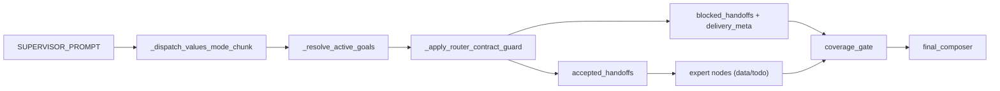

# 意图优化实施方案（decomposed_goals 路由合同收敛）

> 文档日期：2026-03-04  
> 文档定位：将“意图优化”需求基线拆解为工单级 HOW 与并行拆解种子（`-p`）  
> 执行模式：`parallel`（本轮 `plan-only`，不自动进入实现）

---

## 0. 输入来源清单

1. 设计文档：`docs/plans/意图优化.design.md`
2. 需求基线：`docs/内部参考/迭代需求/意图优化_requirements.md`
3. 现状代码锚点：
   - `app/ai/prompts/agent_prompts.py`
   - `app/ai/workflow/multi_agent_graph.py`
   - `app/ai/contracts/delivery_contracts.py`
   - `app/ai/contracts/delivery_contract_validators.py`
   - `app/ai/state.py`
4. 测试锚点：
   - `tests/unit/test_intent_layer_boundary.py`
   - `tests/unit/test_intent_plan_model_primary.py`
   - `tests/unit/test_multi_agent_streaming_helpers.py`
   - `tests/unit/test_observability.py`
   - `tests/integration/test_intent_shadow_metrics.py`
5. 对标参考（架构理念）：`/Users/jijingkun/bojxAI/bot/openclaw`

---

## 0.1 设计审批门禁

- 设计文档：`docs/plans/意图优化.design.md`
- 审批记录：`design_approved: true`
- 审批时间：`2026-03-04 18:40 CST`
- 审批轮次：`round-1`

`DESIGN_APPROVAL_REQUIRED`: false

---

## 0.2 执行意图门禁

- 用户本轮诉求：`根据文档产出需求和计划`
- 本文模式：`plan-only`
- 本轮不自动触发：`/jjk-vkplan`、`/jjk-vktodo`、`/jjk-imp`

`PLAN_EXECUTION_INTENT_REQUIRED`: false

---

## 0.3 Superpowers 产物桥接

- 桥接状态：`SUPERPOWERS_ARTIFACT_UNALIGNED: false`
- 映射关系：
  1. design 最终决策 -> 本文 `feature_id/task_id/planning_contract`
  2. requirements WHAT -> 本文工单级 HOW
  3. 本文机读契约 -> 后续 `/jjk-vkplan` 输入

---

## 0.4 并行拆解模式信息（`-p`）

- `task_key`: `PP-20260304-意图优化`
- 输出类型：`requirements + implementation_plan + card_seed`
- 并行口径：按 `planning_contract.execution_mode` 生效

---

## 1. 架构影响与约束

### 1.1 模块边界

1. Prompt 层：只负责意图提示约束，不承担门禁判定逻辑。
2. Workflow 层：负责目标归一、门禁筛选、覆盖率收口。
3. Contract 层：负责合同模型与验证元数据，不直接改变路由策略。
4. 文档层：保证函数名、字段名、路由口径与代码一致。

### 1.2 状态契约

1. 运行时目标源：`MultiAgentState.decomposed_goals`。
2. handoff 协议字段：`pending_handoff.target_agent`。
3. 门禁阻塞输出：`blocked_handoffs[].reason/goal_id/target_agent`。
4. `allowed_agents` 仅允许现有专家：`data_expert`、`todo_expert`。

### 1.3 路由闭环

1. Supervisor 决策 -> `decompose_goals`（复合目标）-> handoff。
2. Router Gate -> 合法 handoff 执行，不合法写阻塞原因。
3. Coverage Gate -> `must_answer` 覆盖检查 -> Final Composer 收口。

### 1.4 端到端链路一致性



### 1.5 可测试性要求

1. Prompt 识别测试：元信息/记忆请求不触发 `assign_to_data_expert`。
2. Router Gate 合同测试：`target_agent` 字段和 reason code 必测。
3. Streaming values 分支测试：无 `intent_plan` 读取仍可启门禁。
4. 集成测试：复合请求拆解与收口行为不退化。

---

## 2. 功能机制包总表（Feature Packet）

| feature_id | 目标与边界 | 触发条件与状态流转 | 代码锚点 | 关键契约字段 | 回滚锚点 | 验证命令 | 来源证据 |
|---|---|---|---|---|---|---|---|
| P1-01 | Prompt 增强元信息/记忆识别，避免误派发数据专家 | Supervisor 解析用户输入 -> 命中元信息/记忆分支 -> 直接答复或澄清 | `app/ai/prompts/agent_prompts.py` `SUPERVISOR_PROMPT` | `decomposed_goals.kind`, `pending_handoff.target_agent` | 回退 Prompt 增量片段 | `PYTHONPATH=. pytest tests/unit/test_supervisor_intent_prompt.py -q` | design §3.2/§5.4 |
| P1-02 | kind/allowed_agents 归一到真实专家集合 | `kind` 归一后进入 `_normalize_goal_allowed_agents` | `app/ai/workflow/multi_agent_graph.py` `_normalize_model_goal_kind` `_default_allowed_agents_for_goal_kind` | `kind`, `allowed_agents` | 回退 helper 变更 | `PYTHONPATH=. pytest tests/unit/test_router_contract_guard.py -q` | design §3.2/§3.3 |
| P1-03 | Router Gate 单轨门禁（`target_agent`） | Supervisor handoff 批次 -> 合同校验 -> accepted/blocked | `app/ai/workflow/multi_agent_graph.py` `_apply_router_contract_guard` | `target_agent`, `goal_id`, `reason` | `ENABLE_ROUTER_CONTRACT_GUARD=false`（默认 true） | `PYTHONPATH=. pytest tests/unit/test_router_contract_guard.py -q` | design §3.3/§5.2 |
| P1-04 | values 分支运行时口径收敛 | values 模式 supervisor 分支只用 `extracted_goals/runtime_goals` 判定门禁启用 | `app/ai/workflow/multi_agent_graph.py` `_dispatch_values_mode_chunk` | `has_explicit_router_contract` | 回退该分支改动 | `PYTHONPATH=. pytest tests/unit/test_multi_agent_streaming_helpers.py -q` | design §5.3 |
| P1-05 | 路由阻塞与覆盖率事件可观测 | block/coverage 时输出结构化事件 | `app/ai/workflow/multi_agent_graph.py` `app/ai/contracts/delivery_contract_validators.py` | `router_handoff_blocked.*`, `coverage_result.*` | 回退事件字段扩展 | `PYTHONPATH=. pytest tests/unit/test_observability.py -q` | design §6.2/§11.2 |
| P1-06 | 测试与文档闭环 | 单测+集成+架构文档同步 | `tests/unit/*` `tests/integration/*` `docs/开发文档/架构设计/AI模块设计.md` | `TC/FR/Task` 追溯一致 | 回退新增用例与文档入口 | `PYTHONPATH=. pytest tests/integration/test_intent_routing.py -q` + `python3 scripts/docs_guard.py --strict` | requirements FR-06 |

---

## 3. 最小代码样例（每个 Feature 至少一个）

### P1-01（Prompt 增强）

```python
# app/ai/prompts/agent_prompts.py (SUPERVISOR_PROMPT 局部增量)
"""
├─ 查询系统能力/元信息/记忆内容？
│       └─ 是 → 直接回复或澄清，不调用 assign_to_data_expert
"""
```

### P1-02（kind/allowed_agents 归一）

```python
# app/ai/workflow/multi_agent_graph.py
if compact in {"meta.query", "memory.query"}:
    return "general.reply"  # 运行时等价为非专家委派目标
```

### P1-03（Router Gate 合同）

```python
# app/ai/workflow/multi_agent_graph.py::_apply_router_contract_guard
target_agent = str(handoff.get("target_agent") or "").strip()
if target_agent not in allowed_agents:
    blocked.append(_build_router_blocked_entry(..., reason="target_not_in_allowed_agents"))
```

### P1-04（values 分支收敛）

```python
# app/ai/workflow/multi_agent_graph.py::_dispatch_values_mode_chunk
has_explicit_router_contract = bool(
    extracted_goals
    or (isinstance(raw_runtime_goals, list) and raw_runtime_goals)
)
```

### P1-05（可观测事件）

```python
logger.warning(
    "router_handoff_blocked",
    extra={"event": "router_handoff_blocked", "goal_id": goal_id, "target_agent": target_agent, "reason": reason},
)
```

### P1-06（测试闭环）

```python
def test_memory_query_not_routed_to_data_expert():
    assert "data_expert" not in route_trace
```

---

## 4. 测试策略（test_strategy）

```yaml
test_strategy:
  - feature_id: P1-01
    test_cases:
      - TC-IO-01: 记忆查询不触发 assign_to_data_expert
      - TC-IO-02: 能力查询不触发 assign_to_data_expert
    test_first: true
  - feature_id: P1-03
    test_cases:
      - TC-IO-04: handoff 缺 target_agent 被阻塞
      - TC-IO-05: target_not_in_allowed_agents 拦截生效
    test_first: true
  - feature_id: P1-02
    test_cases:
      - TC-IO-03: meta/memory/external 目标的 allowed_agents 归一正确
    test_first: true
  - feature_id: P1-04
    test_cases:
      - TC-IO-06: values 分支无 intent_plan 读取仍可启门禁
    test_first: true
  - feature_id: P1-05
    test_cases:
      - TC-IO-07: router_handoff_blocked 与 coverage_result 事件字段完整
    test_first: true
  - feature_id: P1-06
    test_cases:
      - TC-IO-08: 数据查询路径不退化
      - TC-IO-09: 复合问题两目标覆盖
    test_first: false
```

---

## 5. 工单级任务包（implementation_tasks）

```yaml
implementation_tasks:
  - task_id: T-01
    feature_id: P1-01
    pr_id: PR-01
    phase: Phase-1
    file_paths:
      - app/ai/prompts/agent_prompts.py
      - tests/unit/test_supervisor_intent_prompt.py
    symbols:
      - SUPERVISOR_PROMPT
      - test_memory_query_not_routed_to_data_expert
    change_type: modify
    acceptance_cmds:
      - PYTHONPATH=. pytest tests/unit/test_supervisor_intent_prompt.py -q
    rollback_point: 回退 SUPERVISOR_PROMPT 元信息分支增量

  - task_id: T-02
    feature_id: P1-02
    pr_id: PR-02
    phase: Phase-1
    file_paths:
      - app/ai/workflow/multi_agent_graph.py
      - tests/unit/test_router_contract_guard.py
    symbols:
      - _normalize_model_goal_kind
      - _default_allowed_agents_for_goal_kind
      - _normalize_goal_allowed_agents
    change_type: modify
    acceptance_cmds:
      - PYTHONPATH=. pytest tests/unit/test_router_contract_guard.py -q
    rollback_point: 回退 kind/allowed_agents 归一 helper 变更

  - task_id: T-03
    feature_id: P1-03
    pr_id: PR-03
    phase: Phase-2
    file_paths:
      - app/ai/workflow/multi_agent_graph.py
      - tests/unit/test_router_contract_guard.py
    symbols:
      - _apply_router_contract_guard
      - _build_router_blocked_entry
    change_type: modify
    acceptance_cmds:
      - PYTHONPATH=. pytest tests/unit/test_router_contract_guard.py -q
    rollback_point: ENABLE_ROUTER_CONTRACT_GUARD=false（默认 true）

  - task_id: T-04
    feature_id: P1-04
    pr_id: PR-04
    phase: Phase-2
    file_paths:
      - app/ai/workflow/multi_agent_graph.py
      - tests/unit/test_multi_agent_streaming_helpers.py
    symbols:
      - _dispatch_values_mode_chunk
      - has_explicit_router_contract
    change_type: modify
    acceptance_cmds:
      - PYTHONPATH=. pytest tests/unit/test_multi_agent_streaming_helpers.py -q
    rollback_point: 回退 values 分支的 runtime contract 判定变更

  - task_id: T-05
    feature_id: P1-05
    pr_id: PR-05
    phase: Phase-2
    file_paths:
      - app/ai/workflow/multi_agent_graph.py
      - app/ai/contracts/delivery_contract_validators.py
      - tests/unit/test_observability.py
    symbols:
      - _build_router_blocked_entry
      - build_contract_validation_meta
    change_type: modify
    acceptance_cmds:
      - PYTHONPATH=. pytest tests/unit/test_observability.py -q
    rollback_point: 回退 router_handoff_blocked/coverage_result 事件字段扩展

  - task_id: T-06
    feature_id: P1-06
    pr_id: PR-06
    phase: Phase-3
    file_paths:
      - tests/unit/test_router_contract_guard.py
      - tests/unit/test_supervisor_intent_prompt.py
      - tests/unit/test_intent_layer_boundary.py
    symbols:
      - test_router_guard_blocks_unexpected_target_agent
      - test_supervisor_memory_meta_query_not_delegate_data
    change_type: add
    acceptance_cmds:
      - PYTHONPATH=. pytest tests/unit/test_router_contract_guard.py -q
      - PYTHONPATH=. pytest tests/unit/test_supervisor_intent_prompt.py -q
    rollback_point: 回退新增单测并恢复原回归用例口径

  - task_id: T-07
    feature_id: P1-06
    pr_id: PR-07
    phase: Phase-3
    file_paths:
      - tests/integration/test_intent_routing.py
      - tests/integration/test_intent_shadow_metrics.py
    symbols:
      - test_memory_query_not_routed_to_data_expert
      - test_compound_query_goal_coverage
    change_type: add
    acceptance_cmds:
      - PYTHONPATH=. pytest tests/integration/test_intent_routing.py -q
    rollback_point: 回退新增集成测试并保留 shadow 指标回归

  - task_id: T-08
    feature_id: P1-06
    pr_id: PR-08
    phase: Phase-3
    file_paths:
      - docs/开发文档/架构设计/AI模块设计.md
      - docs/plans/意图优化.design.md
      - docs/内部参考/迭代需求/意图优化_requirements.md
      - docs/内部参考/迭代需求/意图优化_implementation_plan.md
      - docs/SUMMARY.md
    symbols:
      - 目标状态管理章节
      - 迭代需求目录索引
    change_type: modify
    acceptance_cmds:
      - python3 scripts/docs_guard.py --strict
    rollback_point: 回退文档改动并恢复 SUMMARY 入口
```

---

## 6. Task -> PR 映射契约（task_to_pr_mapping）

```yaml
task_to_pr_mapping:
  - task_id: T-01
    pr_id: PR-01
    pr_branch: codex/intent-opt-pr-01
    pr_subject: "Supervisor 元信息/记忆识别分支增强"
    pr_depends_on: []
    acceptance_cmds:
      - PYTHONPATH=. pytest tests/unit/test_supervisor_intent_prompt.py -q
    rollback_point: 回退 Prompt 增量片段

  - task_id: T-02
    pr_id: PR-02
    pr_branch: codex/intent-opt-pr-02
    pr_subject: "kind 与 allowed_agents 归一收敛"
    pr_depends_on: [PR-01]
    acceptance_cmds:
      - PYTHONPATH=. pytest tests/unit/test_router_contract_guard.py -q
    rollback_point: 回退目标归一 helper 变更

  - task_id: T-03
    pr_id: PR-03
    pr_branch: codex/intent-opt-pr-03
    pr_subject: "Router Contract Guard 单轨化"
    pr_depends_on: [PR-02]
    acceptance_cmds:
      - PYTHONPATH=. pytest tests/unit/test_router_contract_guard.py -q
    rollback_point: ENABLE_ROUTER_CONTRACT_GUARD=false（默认 true）

  - task_id: T-04
    pr_id: PR-04
    pr_branch: codex/intent-opt-pr-04
    pr_subject: "values 分支运行时口径收敛"
    pr_depends_on: [PR-03]
    acceptance_cmds:
      - PYTHONPATH=. pytest tests/unit/test_multi_agent_streaming_helpers.py -q
    rollback_point: 回退 _dispatch_values_mode_chunk 改动

  - task_id: T-05
    pr_id: PR-05
    pr_branch: codex/intent-opt-pr-05
    pr_subject: "路由阻塞与覆盖率事件可观测增强"
    pr_depends_on: [PR-03, PR-04]
    acceptance_cmds:
      - PYTHONPATH=. pytest tests/unit/test_observability.py -q
    rollback_point: 回退事件字段扩展

  - task_id: T-06
    pr_id: PR-06
    pr_branch: codex/intent-opt-pr-06
    pr_subject: "Router/Prompt 单测补齐"
    pr_depends_on: [PR-05]
    acceptance_cmds:
      - PYTHONPATH=. pytest tests/unit/test_router_contract_guard.py -q
      - PYTHONPATH=. pytest tests/unit/test_supervisor_intent_prompt.py -q
    rollback_point: 回退新增单测

  - task_id: T-07
    pr_id: PR-07
    pr_branch: codex/intent-opt-pr-07
    pr_subject: "意图路由集成测试补齐"
    pr_depends_on: [PR-06]
    acceptance_cmds:
      - PYTHONPATH=. pytest tests/integration/test_intent_routing.py -q
    rollback_point: 回退新增集成测试

  - task_id: T-08
    pr_id: PR-08
    pr_branch: codex/intent-opt-pr-08
    pr_subject: "架构文档与索引同步"
    pr_depends_on: [PR-07]
    acceptance_cmds:
      - python3 scripts/docs_guard.py --strict
    rollback_point: 回退文档与 SUMMARY 索引变更
```

---

## 7. 并行拆解种子（card_seed）

```yaml
task_key: PP-20260304-意图优化
card_seed:
  - card_id: C01
    title: Prompt与目标归一收敛
    feature_ids: [P1-01, P1-02]
    hard_depends_on: []
    soft_depends_on: []
    file_scope:
      - app/ai/prompts/agent_prompts.py
      - app/ai/workflow/multi_agent_graph.py
    owner_fields: [ai-workflow]
    check_cmd:
      - PYTHONPATH=. pytest tests/unit/test_supervisor_intent_prompt.py -q
      - PYTHONPATH=. pytest tests/unit/test_router_contract_guard.py -q
    done_gate:
      - 元信息/记忆请求不委派 data_expert
      - kind 与 allowed_agents 归一正确

  - card_id: C02
    title: Router Gate单轨与可观测收敛
    feature_ids: [P1-03, P1-04, P1-05]
    hard_depends_on: [C01]
    soft_depends_on: []
    file_scope:
      - app/ai/workflow/multi_agent_graph.py
      - app/ai/contracts/delivery_contract_validators.py
    owner_fields: [ai-workflow, observability]
    check_cmd:
      - PYTHONPATH=. pytest tests/unit/test_multi_agent_streaming_helpers.py -q
      - PYTHONPATH=. pytest tests/unit/test_observability.py -q
    done_gate:
      - Router Gate 不再读取 runtime intent_plan
      - blocked reason 可观测

  - card_id: C03
    title: 测试与文档同步
    feature_ids: [P1-06]
    hard_depends_on: [C01, C02]
    soft_depends_on: []
    file_scope:
      - tests/unit
      - tests/integration
      - docs/开发文档/架构设计/AI模块设计.md
      - docs/SUMMARY.md
    owner_fields: [qa, docs]
    check_cmd:
      - PYTHONPATH=. pytest tests/integration/test_intent_routing.py -q
      - python3 scripts/docs_guard.py --strict
    done_gate:
      - 测试追溯矩阵闭环
      - 文档索引通过 docs_guard

  - card_id: G01
    title: 发布前门禁检查
    feature_ids: [G-1]
    hard_depends_on: [C03]
    soft_depends_on: []
    file_scope:
      - docs/内部参考/迭代需求/意图优化_implementation_plan.md
    owner_fields: [release-gate]
    check_cmd:
      - python3 scripts/docs_guard.py --strict
    done_gate:
      - 文档、契约、测试门禁全部通过
```

---

## 8. planning_contract（供 `/jjk-vkplan` 机读）

```yaml
planning_contract:
  execution_mode: parallel
  card_order: [C01, C02, C03, G01]
  strict_single_active_card: false
  auto_done_policy:
    implementation-card: hard_gate
    inspection-card: policy_gate
    question-card: policy_gate
  gate_contract:
    mode: as_cards
    gate_ids: [G01]
    depends_on:
      G01: [C03]
  cards:
    - card_id: C01
      wave: P1
      feature_ids: [P1-01, P1-02]
      depends_on: []
      task_mode: implementation-card
      merge_required: true
      done_gate:
        - Prompt 分支与目标归一通过
      acceptance_checks:
        - PYTHONPATH=. pytest tests/unit/test_supervisor_intent_prompt.py -q
        - PYTHONPATH=. pytest tests/unit/test_router_contract_guard.py -q
      evidence_entry: docs/内部参考/迭代需求/意图优化_implementation_plan.md

    - card_id: C02
      wave: P1
      feature_ids: [P1-03, P1-04, P1-05]
      depends_on: [C01]
      task_mode: implementation-card
      merge_required: true
      done_gate:
        - Router Gate 单轨门禁与事件可观测通过
      acceptance_checks:
        - PYTHONPATH=. pytest tests/unit/test_multi_agent_streaming_helpers.py -q
        - PYTHONPATH=. pytest tests/unit/test_observability.py -q
      evidence_entry: docs/内部参考/迭代需求/意图优化_implementation_plan.md

    - card_id: C03
      wave: P2
      feature_ids: [P1-06]
      depends_on: [C01, C02]
      task_mode: implementation-card
      merge_required: true
      done_gate:
        - 单测/集成测试与文档同步完成
      acceptance_checks:
        - PYTHONPATH=. pytest tests/integration/test_intent_routing.py -q
        - python3 scripts/docs_guard.py --strict
      evidence_entry: docs/内部参考/迭代需求/意图优化_implementation_plan.md

    - card_id: G01
      wave: Gate
      feature_ids: [G-1]
      depends_on: [C03]
      task_mode: inspection-card
      merge_required: false
      done_gate:
        - 契约字段、测试与文档门禁全部通过
      acceptance_checks:
        - python3 scripts/docs_guard.py --strict
      evidence_entry: docs/内部参考/迭代需求/意图优化_implementation_plan.md

  task_to_pr_mapping:
    - task_id: T-01
      pr_id: PR-01
      pr_branch: codex/intent-opt-pr-01
      pr_depends_on: []
      pr_subject: "Supervisor 元信息/记忆识别分支增强"
      acceptance_cmds:
        - PYTHONPATH=. pytest tests/unit/test_supervisor_intent_prompt.py -q
      rollback_point: 回退 Prompt 增量片段

    - task_id: T-02
      pr_id: PR-02
      pr_branch: codex/intent-opt-pr-02
      pr_depends_on: [PR-01]
      pr_subject: "kind 与 allowed_agents 归一收敛"
      acceptance_cmds:
        - PYTHONPATH=. pytest tests/unit/test_router_contract_guard.py -q
      rollback_point: 回退目标归一 helper 变更

    - task_id: T-03
      pr_id: PR-03
      pr_branch: codex/intent-opt-pr-03
      pr_depends_on: [PR-02]
      pr_subject: "Router Contract Guard 单轨化"
      acceptance_cmds:
        - PYTHONPATH=. pytest tests/unit/test_router_contract_guard.py -q
      rollback_point: ENABLE_ROUTER_CONTRACT_GUARD=false

    - task_id: T-04
      pr_id: PR-04
      pr_branch: codex/intent-opt-pr-04
      pr_depends_on: [PR-03]
      pr_subject: "values 分支运行时口径收敛"
      acceptance_cmds:
        - PYTHONPATH=. pytest tests/unit/test_multi_agent_streaming_helpers.py -q
      rollback_point: 回退 values 分支改动

    - task_id: T-05
      pr_id: PR-05
      pr_branch: codex/intent-opt-pr-05
      pr_depends_on: [PR-03, PR-04]
      pr_subject: "路由阻塞与覆盖率事件可观测增强"
      acceptance_cmds:
        - PYTHONPATH=. pytest tests/unit/test_observability.py -q
      rollback_point: 回退事件字段扩展

    - task_id: T-06
      pr_id: PR-06
      pr_branch: codex/intent-opt-pr-06
      pr_depends_on: [PR-05]
      pr_subject: "Prompt/Router 单测补齐"
      acceptance_cmds:
        - PYTHONPATH=. pytest tests/unit/test_supervisor_intent_prompt.py -q
        - PYTHONPATH=. pytest tests/unit/test_router_contract_guard.py -q
      rollback_point: 回退新增单测

    - task_id: T-07
      pr_id: PR-07
      pr_branch: codex/intent-opt-pr-07
      pr_depends_on: [PR-06]
      pr_subject: "意图路由集成测试补齐"
      acceptance_cmds:
        - PYTHONPATH=. pytest tests/integration/test_intent_routing.py -q
      rollback_point: 回退新增集成测试

    - task_id: T-08
      pr_id: PR-08
      pr_branch: codex/intent-opt-pr-08
      pr_depends_on: [PR-07]
      pr_subject: "文档与索引同步"
      acceptance_cmds:
        - python3 scripts/docs_guard.py --strict
      rollback_point: 回退文档与索引更新
```

---

## 9. execution_contract（执行粒度契约）

```yaml
execution_contract:
  delivery_mode: staged
  execution_unit: per_pr
  commit_policy: per_pr
  stop_boundary: per_pr
  stop_on_blocked: true
```

---

## 10. implementation_readiness（机读结论）

```yaml
implementation_readiness:
  implementation_ready: true
  blocked_by: []
  next_step: /jjk-plan
  execution_contract_ready: true
```

---

## 11. 执行备注

```yaml
execution_notes:
  mode: plan-only
  plan_execution_intent_required: false
  suggested_next_commands:
    - /jjk-vkplan
    - /jjk-vktodo
    - /jjk-imp
  template:
    global: /Users/jijingkun/.codex/engineering/templates/jjk_plan_templates.md
    project_override: docs/内部参考/迭代需求/_templates/jjk_plan_templates.md
    missing: false
  fallback:
    team: false
    degrade_reason: ""
```

---
