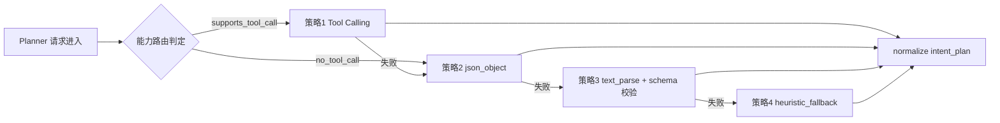

# 意图目标分解治理实施方案

> 文档日期：2026-02-28  
> 文档定位：将“planner 主判定、规则仅兜底”落地为可灰度、可回滚、可审计的实现路径  
> 执行模式：`serial`

---

## 0. 输入来源清单

1. `docs/内部参考/迭代需求/意图目标分解治理_requirements.md`
2. `docs/内部参考/迭代需求/openclaw迁移重建基线_requirements.md`
3. `docs/内部参考/迭代需求/openclaw特性迁移完善_implementation_plan.md`
4. 代码现状：
   - `app/ai/workflow/multi_agent_graph.py`
   - `app/ai/prompts/agent_prompts.py`
   - `app/services/chat_service.py`
5. OpenClaw 对标证据（行为基线）：
   - `../bot/openclaw/docs/pi.md`
   - `../bot/openclaw/src/agents/pi-embedded-runner/run/attempt.ts`
   - `../bot/openclaw/src/auto-reply/command-detection.ts`
   - `../bot/openclaw/docs/concepts/queue.md`

---

## 1. 架构影响与约束

### 1.1 模块边界

1. 控制面（命令/队列/权限）归属：`chat_service.py` + 路由层上下文注入，不直接定义业务目标。
2. 语义面（意图与目标分解）归属：`multi_agent_graph.py` 的 planner/evaluate/coverage 流程。
3. Prompt 约束归属：`agent_prompts.py`，用于结构化输出格式与兜底规则触发条件。
4. 前端展示语义归属：SSE 事件契约层；只读消费 `intent_plan/coverage`，不在前端二次猜测目标。

### 1.2 状态契约

1. `intent_plan`：统一目标合同，字段冻结为 `version/source/goals[]/fallback_meta`。
2. `goal`：冻结字段 `goal_id/order/kind/title/must_answer/confidence/status`。
3. `coverage_report`：冻结字段 `pass/missing_goals/covered_goals/evidence`。
4. `intent_mode`：`model_primary | heuristic_fallback | shadow_compare`。
5. 兼容要求：新增字段只增不删，旧消费方忽略未知字段。

### 1.3 路由闭环

1. preprocess 组装上下文 -> planner 产出结构化目标 -> supervisor/handoff 执行 -> coverage_gate 对账 -> final_composer 输出。
2. 当 planner 输出异常时进入 fallback_gate，再交由执行阶段完成闭环。
3. 缺失目标通过 recovery hint 补齐后再次收敛，避免“同一追问循环”。

### 1.4 端到端链路

1. 请求入站：携带 `thread_id/run_id/current_todo_id`。
2. 运行态：SSE 发出 `plan_ready/task_started/task_finished/coverage_check/final_answer`。
3. 展示层：前端读取“初判目标数 + 已确认目标数”，以 `coverage_report` 作为最终口径。
4. 取消与恢复：`cancel/resume` 不应破坏 `intent_mode` 与目标状态一致性。

### 1.5 可测试性缺口

1. 当前缺少 planner 非法输出降级测试。
2. 当前缺少“泛词误判（查询）”抑制回归测试。
3. 当前缺少 SSE 新字段兼容测试（旧消费方不崩溃）。
4. 当前缺少 shadow 指标对账测试（模型与规则差异统计）。

---

## 2. 契约冻结（SSE 与跨端字段）

本轮冻结字段清单：

1. `plan_ready`：新增 `intent_mode`、`goal_count_initial`（可选）。
2. `coverage_check`：新增 `goal_count_confirmed`、`missing_goal_count`（可选）。
3. `final_answer`：`meta.coverage_pass/meta.goal_count/meta.missing_goals` 保持兼容。
4. `done/result/interrupt/stopped` 维持既有语义，不在本专题修改主契约。

---

## 3. 功能机制包总表（Feature Packet）

| feature_id | card_id | 目标摘要 | 主要代码锚点 | 验证命令 |
|---|---|---|---|---|
| P1-01 | C01 | 控制面与语义面分层契约落地 | `multi_agent_graph.py` / `chat_service.py` | `pytest -q tests/unit/test_intent_layer_boundary.py` |
| P1-02 | C01 | planner 模型主判定结构化输出 | `multi_agent_graph.py` / `agent_prompts.py` | `pytest -q tests/unit/test_intent_plan_model_primary.py` |
| P1-03 | C02 | fallback 触发网关与规则兜底收敛 | `multi_agent_graph.py` | `pytest -q tests/unit/test_intent_fallback_gate.py` |
| P1-04 | C03 | 运行时证据对账与覆盖率收敛 | `multi_agent_graph.py` | `pytest -q tests/unit/test_multi_intent_coverage_reconcile.py` |
| P1-05 | C04 | SSE 展示口径升级（初判 vs 已确认） | `multi_agent_graph.py` / `chat_service.py` | `pytest -q tests/api/test_chat_sse_intent_goal_status.py` |
| P1-06 | C05 | 观测指标、灰度与回滚开关 | `config_resolver.py` / `multi_agent_graph.py` | `pytest -q tests/integration/test_intent_shadow_metrics.py` |
| G-1 | G01 | 契约一致性门禁 | `tests/*` + `scripts/docs_guard.py` | `python3 scripts/docs_guard.py --strict` |
| G-2 | G02 | 灰度稳定性门禁 | `tests/*` + 运行指标 | `pytest -q tests/integration/test_intent_shadow_metrics.py` |

---

## 4. Feature Packet 详情

### 4.1 P1-01 控制面与语义面分层契约落地

1. 目标与边界：
   - 做：将命令/队列控制逻辑与目标语义判定拆层，避免跨层污染。
   - 不做：重写全部执行图节点。
2. 触发条件与状态流转：入站消息解析 -> 控制面决策 -> 语义面目标分解。
3. 代码锚点：
   - `app/ai/workflow/multi_agent_graph.py`
   - `app/services/chat_service.py`
4. 关键字段：`intent_mode`、`control_flags`、`semantic_payload`。
5. 回滚锚点：`ENABLE_INTENT_LAYERING=false`。
6. 验证命令：
   - `cd /Users/jijingkun/bojxAI/fastapi && venv/bin/python -m pytest -q tests/unit/test_intent_layer_boundary.py`
7. 来源证据：
   - OpenClaw 控制面强调命令授权与普通对话解耦：`../bot/openclaw/src/auto-reply/command-detection.ts`
8. 最小代码样例：

```python
if control_decision.is_command_only:
    return handle_control_plane(control_decision)
return run_semantic_planner(state)
```

---

### 4.2 P1-02 planner 模型主判定结构化输出

1. 目标与边界：
   - 做：planner 默认走模型结构化输出，关键词不再作为主入口。
   - 不做：删除现有 heuristic 代码（仅降级路径保留）。
2. 触发条件与状态流转：`model_primary -> parse_ok -> intent_plan`；失败进入 `fallback_gate`。
3. 代码锚点：
   - `app/ai/workflow/multi_agent_graph.py`
   - `app/ai/prompts/agent_prompts.py`
4. 关键字段：`intent_plan.source`、`goal.confidence`、`planner_error`。
5. 回滚锚点：`INTENT_MODE=heuristic_only`。
6. 验证命令：
   - `cd /Users/jijingkun/bojxAI/fastapi && venv/bin/python -m pytest -q tests/unit/test_intent_plan_model_primary.py`
7. 来源证据：
   - OpenClaw 主路径由 `session.prompt(...)` 驱动 agent loop：`../bot/openclaw/docs/pi.md`、`../bot/openclaw/src/agents/pi-embedded-runner/run/attempt.ts`
8. 最小代码样例：

```python
plan = planner_llm.invoke(structured_prompt)
if not is_valid_intent_plan(plan):
    raise PlannerOutputError("invalid_intent_plan")
return normalize_intent_plan(plan, source="model_primary")
```

---

### 4.3 P1-03 fallback 触发网关与规则兜底收敛

1. 目标与边界：
   - 做：规则仅在模型失败、超时、非法输出时触发。
   - 不做：扩展关键词词典规模。
2. 触发条件与状态流转：`planner_error -> fallback_gate -> heuristic_plan`。
3. 代码锚点：
   - `app/ai/workflow/multi_agent_graph.py`
4. 关键字段：`fallback_reason`、`fallback_rule_id`、`intent_plan.source=heuristic_fallback`。
5. 回滚锚点：`ENABLE_INTENT_FALLBACK_GATE=false`（退回旧行为）。
6. 验证命令：
   - `cd /Users/jijingkun/bojxAI/fastapi && venv/bin/python -m pytest -q tests/unit/test_intent_fallback_gate.py`
7. 来源证据：
   - 当前误判根因在关键词泛化命中：`app/ai/workflow/multi_agent_graph.py`
8. 最小代码样例：

```python
if planner_failed:
    return build_heuristic_plan(user_text, reason=planner_error_code)
return planner_plan
```

---

### 4.4 P1-04 运行时证据对账与覆盖率收敛

1. 目标与边界：
   - 做：用 handoff/tool 证据校验并收敛目标状态。
   - 不做：改写专家内部执行实现。
2. 触发条件与状态流转：执行完成 -> 构建 deliverables -> 计算 coverage -> 缺口补齐。
3. 代码锚点：
   - `app/ai/workflow/multi_agent_graph.py`
4. 关键字段：`handoff_execution_trace`、`deliverables`、`coverage_report`。
5. 回滚锚点：`ENABLE_COVERAGE_RECONCILE=false`。
6. 验证命令：
   - `cd /Users/jijingkun/bojxAI/fastapi && venv/bin/python -m pytest -q tests/unit/test_multi_intent_coverage_reconcile.py`
7. 来源证据：
   - OpenClaw 强调执行循环与生命周期事件作为真实执行依据：`../bot/openclaw/docs/concepts/agent-loop.md`
8. 最小代码样例：

```python
coverage = compute_coverage(intent_plan, deliverables)
if coverage.has_missing:
    return request_recovery(coverage.missing_goals)
return coverage
```

---

### 4.5 P1-05 SSE 展示口径升级（初判 vs 已确认）

1. 目标与边界：
   - 做：升级状态事件字段，区分“初判目标数”与“已确认目标数”。
   - 不做：重构前端页面布局。
2. 触发条件与状态流转：`plan_ready` 发初判 -> `coverage_check` 发确认 -> `final_answer` 收口。
3. 代码锚点：
   - `app/ai/workflow/multi_agent_graph.py`
   - `app/services/chat_service.py`
4. 关键字段：`goal_count_initial`、`goal_count_confirmed`、`missing_goal_count`。
5. 回滚锚点：`ENABLE_SSE_INTENT_GOAL_STATUS_V2=false`。
6. 验证命令：
   - `cd /Users/jijingkun/bojxAI/fastapi && venv/bin/python -m pytest -q tests/api/test_chat_sse_intent_goal_status.py`
7. 来源证据：
   - 当前展示口径直接取 goals 长度，容易提前放大误判：`app/ai/workflow/multi_agent_graph.py`
8. 最小代码样例：

```python
emit_plan_ready(writer, plan, meta={"goal_count_initial": len(plan["goals"])})
emit_coverage_check(writer, coverage, meta={"goal_count_confirmed": coverage.covered_count})
```

---

### 4.6 P1-06 观测指标、灰度与回滚开关

1. 目标与边界：
   - 做：增加 shadow 对账指标与模式切换开关，支持灰度放量。
   - 不做：引入新监控系统（沿用现有日志与指标采集）。
2. 触发条件与状态流转：`shadow_compare` -> 指标评估 -> `model_primary` 全量。
3. 代码锚点：
   - `app/services/config_resolver.py`
   - `app/ai/workflow/multi_agent_graph.py`
4. 关键字段：`intent_shadow_enabled`、`intent_diff_rate`、`fallback_hit_rate`。
5. 回滚锚点：
   - `INTENT_MODE=heuristic_only`
   - `ENABLE_INTENT_SHADOW_COMPARE=false`
6. 验证命令：
   - `cd /Users/jijingkun/bojxAI/fastapi && venv/bin/python -m pytest -q tests/integration/test_intent_shadow_metrics.py`
7. 来源证据：
   - OpenClaw 队列/控制策略与语义执行分离，便于独立观测与收敛：`../bot/openclaw/docs/concepts/queue.md`
8. 最小代码样例：

```python
if cfg.intent_shadow_enabled:
    diff = compare_plan(model_plan, heuristic_plan)
    metrics.emit("intent.diff_rate", diff.rate)
```

---

## 5. 分阶段路线图

1. 阶段 A（D1-D2）：P1-01 + P1-02（分层边界与模型主判定）。
2. 阶段 B（D3）：P1-03（fallback 网关收敛）。
3. 阶段 C（D4）：P1-04（运行时对账收敛）。
4. 阶段 D（D5）：P1-05（SSE 展示口径升级）。
5. 阶段 E（D6-D7）：P1-06 + G-1 + G-2（灰度、门禁、回滚演练）。

---

## 6. 跨模块依赖矩阵

| 模块 | 依赖上游 | 输出给下游 |
|---|---|---|
| `multi_agent_graph` | 配置开关、planner prompt | `intent_plan`、`coverage_report`、SSE 事件 |
| `agent_prompts` | 结构化 schema 定义 | planner 输出稳定性 |
| `chat_service` | 编排层输出 | SSE 兼容输出与终态收口 |
| `config_resolver` | DB/ENV 配置中心 | `intent_mode` 与灰度策略 |
| `tests` | 新契约字段与路径 | 自动验收证据与门禁结果 |

---

## 7. 观测与告警方案

1. 指标：`intent_goal_diff_rate`、`fallback_hit_rate`、`coverage_missing_rate`、`goal_count_mismatch_rate`。
2. 维度：`agent_type/user_id/thread_id/intent_mode`。
3. 告警阈值（建议）：
   - `goal_count_mismatch_rate > 5%` 持续 10 分钟告警。
   - `fallback_hit_rate > 20%` 持续 30 分钟告警。
4. 观测证据：每次灰度窗口输出日报（通过日志聚合或脚本导出）。

---

## 8. 风险评估与回滚策略

1. 模型输出漂移导致目标漏判：保留 heuristic fallback 并降级开关一键切回。
2. SSE 新字段影响旧前端：字段只新增且可选，消费失败时回退旧展示逻辑。
3. 对账逻辑过严导致过度补问：设定最大补齐轮次与超时退化路径。
4. 灰度期指标抖动：先 shadow 观察，不直接切主路径。

---

## 9. 测试策略（TDD 前置）

```yaml
test_strategy:
  - feature_id: P1-01
    test_cases: [TC-IMG-01]
    test_first: true
  - feature_id: P1-02
    test_cases: [TC-IMG-02, TC-IMG-03]
    test_first: true
  - feature_id: P1-03
    test_cases: [TC-IMG-04]
    test_first: true
  - feature_id: P1-04
    test_cases: [TC-IMG-05, TC-IMG-07]
    test_first: true
  - feature_id: P1-05
    test_cases: [TC-IMG-06]
    test_first: true
  - feature_id: P1-06
    test_cases: [TC-IMG-08]
    test_first: false
```

---

## 10. 偏差修复清单

1. 旧口径“待答目标数=planner goals 长度”调整为“双口径展示 + 执行收口口径”。
2. 旧逻辑“规则默认参与主判定”调整为“仅在失败时触发兜底”。
3. 旧观测缺口“无模型/规则差异指标”补齐为 shadow 差异指标集。

---

## 11. planning_contract（供 /jjk-vkplan 消费）

```yaml
planning_contract:
  execution_mode: serial
  card_order: [C01, C02, C03, C04, C05, G01, G02]
  strict_single_active_card: true
  auto_done_policy:
    implementation-card: hard_gate
    inspection/question-card: policy_gate
  gate_contract:
    mode: as_cards
    gate_ids: [G01, G02]
    depends_on:
      G01: [C05]
      G02: [G01]
  cards:
    - card_id: C01
      wave: P1
      feature_ids: [P1-01, P1-02]
      depends_on: []
      done_gate:
        - intent layer boundary tests green
        - model primary planner tests green
      acceptance_checks:
        - "cd /Users/jijingkun/bojxAI/fastapi && venv/bin/python -m pytest -q tests/unit/test_intent_layer_boundary.py tests/unit/test_intent_plan_model_primary.py"
      evidence_entry: "intent layering + model primary planner test logs"

    - card_id: C02
      wave: P2
      feature_ids: [P1-03]
      depends_on: [C01]
      done_gate:
        - fallback gate enabled and explainable
      acceptance_checks:
        - "cd /Users/jijingkun/bojxAI/fastapi && venv/bin/python -m pytest -q tests/unit/test_intent_fallback_gate.py"
      evidence_entry: "fallback reason/rule id assertion logs"

    - card_id: C03
      wave: P3
      feature_ids: [P1-04]
      depends_on: [C02]
      done_gate:
        - coverage reconcile tests green
        - missing goals recovery path verified
      acceptance_checks:
        - "cd /Users/jijingkun/bojxAI/fastapi && venv/bin/python -m pytest -q tests/unit/test_multi_intent_coverage_reconcile.py"
      evidence_entry: "coverage report reconciliation logs"

    - card_id: C04
      wave: P4
      feature_ids: [P1-05]
      depends_on: [C03]
      done_gate:
        - sse goal status compatibility tests green
      acceptance_checks:
        - "cd /Users/jijingkun/bojxAI/fastapi && venv/bin/python -m pytest -q tests/api/test_chat_sse_intent_goal_status.py"
      evidence_entry: "sse schema compatibility test logs"

    - card_id: C05
      wave: P5
      feature_ids: [P1-06]
      depends_on: [C04]
      done_gate:
        - shadow metrics tests green
        - rollback switch validated
      acceptance_checks:
        - "cd /Users/jijingkun/bojxAI/fastapi && venv/bin/python -m pytest -q tests/integration/test_intent_shadow_metrics.py"
      evidence_entry: "shadow compare metrics report"

    - card_id: G01
      wave: G-1
      feature_ids: [G-1]
      depends_on: [C05]
      done_gate:
        - docs index updated
        - docs guard strict pass
      acceptance_checks:
        - "cd /Users/jijingkun/bojxAI/fastapi && python3 scripts/docs_guard.py --strict"
      evidence_entry: "docs_guard strict output"

    - card_id: G02
      wave: G-2
      feature_ids: [G-2]
      depends_on: [G01]
      done_gate:
        - shadow window metrics within threshold
        - rollback drill completed
      acceptance_checks:
        - "cd /Users/jijingkun/bojxAI/fastapi && venv/bin/python -m pytest -q tests/integration/test_intent_shadow_metrics.py"
      evidence_entry: "gray rollout metrics and rollback drill record"
```

---

## 12. D+B 统一执行增补（2026-02-28）

> 目标：将 planner 结构化输出从“单路径依赖”升级为“能力路由 + Tool Calling 主路径 + 分级降级链”。  
> 标记：`DESIGN_APPROVAL_FALLBACK_ACK=true`（本轮基于会话内设计确认继续，无 `docs/plans/*-design.md` 审批文档）。

### 12.1 执行链路（统一口径）



### 12.2 功能机制包（P2）

| feature_id | card_id | 目标摘要 | 代码锚点 | 验证命令 |
|---|---|---|---|---|
| P2-01 | C06 | 引入 planner 策略路由器与能力判定 | `app/ai/workflow/multi_agent_graph.py` `app/ai/llm_util.py` | `cd /Users/jijingkun/bojxAI/fastapi && venv/bin/python -m pytest -q tests/unit/test_planner_strategy_router.py` |
| P2-02 | C06 | Tool Calling 作为结构化主路径 | `app/ai/workflow/multi_agent_graph.py` | `cd /Users/jijingkun/bojxAI/fastapi && venv/bin/python -m pytest -q tests/unit/test_planner_tool_call_primary.py` |
| P2-03 | C07 | json_object 作为二级路径 | `app/ai/workflow/multi_agent_graph.py` | `cd /Users/jijingkun/bojxAI/fastapi && venv/bin/python -m pytest -q tests/unit/test_planner_json_object_fallback.py` |
| P2-04 | C07 | text_parse 作为三级路径并做 schema 校验 | `app/ai/workflow/multi_agent_graph.py` | `cd /Users/jijingkun/bojxAI/fastapi && venv/bin/python -m pytest -q tests/unit/test_planner_text_parse_fallback.py` |
| P2-05 | C08 | fallback reason_code 标准化与观测字段统一 | `app/ai/workflow/multi_agent_graph.py` `app/services/chat_service.py` | `cd /Users/jijingkun/bojxAI/fastapi && venv/bin/python -m pytest -q tests/unit/test_planner_reason_codes.py` |
| P2-06 | G03 | 文档、契约、索引门禁收口 | `docs/开发文档/架构设计/AI模块设计.md` `docs/开发文档/架构设计/防屎山记录手册.md` | `cd /Users/jijingkun/bojxAI/fastapi && python3 scripts/docs_guard.py --strict` |

### 12.3 工单级任务包（implementation_tasks）

```yaml
implementation_tasks:
  - task_id: T-09
    feature_id: P2-06
    phase: Phase-0
    file_paths:
      - docs/开发文档/架构设计/AI模块设计.md
      - docs/开发文档/架构设计/防屎山记录手册.md
    symbols:
      - planner structured compatibility chain
      - fallback reason_code contract
    change_type: modify
    acceptance_cmds:
      - cd /Users/jijingkun/bojxAI/fastapi && python3 scripts/docs_guard.py --strict
    rollback_point: revert D+B doc section commit

  - task_id: T-10
    feature_id: P2-01
    phase: Phase-1
    file_paths:
      - app/ai/workflow/multi_agent_graph.py
      - app/ai/llm_util.py
    symbols:
      - _build_planner_intent_plan
      - planner strategy router
    change_type: modify
    acceptance_cmds:
      - cd /Users/jijingkun/bojxAI/fastapi && venv/bin/python -m pytest -q tests/unit/test_planner_strategy_router.py
    rollback_point: PLANNER_STRUCTURED_STRATEGY=legacy_json_object

  - task_id: T-11
    feature_id: P2-02
    phase: Phase-1
    file_paths:
      - app/ai/workflow/multi_agent_graph.py
    symbols:
      - _infer_model_intent_plan_via_tool_call
    change_type: add
    acceptance_cmds:
      - cd /Users/jijingkun/bojxAI/fastapi && venv/bin/python -m pytest -q tests/unit/test_planner_tool_call_primary.py
    rollback_point: PLANNER_DISABLE_TOOL_CALL=true

  - task_id: T-12
    feature_id: P2-03
    phase: Phase-2
    file_paths:
      - app/ai/workflow/multi_agent_graph.py
    symbols:
      - _infer_model_intent_plan_via_json_object
    change_type: modify
    acceptance_cmds:
      - cd /Users/jijingkun/bojxAI/fastapi && venv/bin/python -m pytest -q tests/unit/test_planner_json_object_fallback.py
    rollback_point: PLANNER_DISABLE_JSON_OBJECT=true

  - task_id: T-13
    feature_id: P2-04
    phase: Phase-2
    file_paths:
      - app/ai/workflow/multi_agent_graph.py
    symbols:
      - _infer_model_intent_plan_via_text_parse
      - _IntentPlanModel
    change_type: add
    acceptance_cmds:
      - cd /Users/jijingkun/bojxAI/fastapi && venv/bin/python -m pytest -q tests/unit/test_planner_text_parse_fallback.py
    rollback_point: PLANNER_DISABLE_TEXT_PARSE=true

  - task_id: T-14
    feature_id: P2-05
    phase: Phase-3
    file_paths:
      - app/ai/workflow/multi_agent_graph.py
      - app/services/chat_service.py
    symbols:
      - fallback_meta.reason
      - planner_reason_code
    change_type: modify
    acceptance_cmds:
      - cd /Users/jijingkun/bojxAI/fastapi && venv/bin/python -m pytest -q tests/unit/test_planner_reason_codes.py
    rollback_point: PLANNER_REASON_CODE_VERBOSE=false
```

### 12.4 planning_contract（D+B 覆盖版）

```yaml
planning_contract:
  execution_mode: serial
  card_order: [C01, C02, C03, C04, C05, C06, C07, C08, G01, G02, G03]
  strict_single_active_card: true
  auto_done_policy:
    implementation-card: hard_gate
    inspection/question-card: policy_gate
  gate_contract:
    mode: as_cards
    gate_ids: [G01, G02, G03]
    depends_on:
      G01: [C05]
      G02: [G01]
      G03: [C08]
  cards:
    - card_id: C06
      wave: P2
      feature_ids: [P2-01, P2-02]
      depends_on: [C05]
      task_mode: implementation-card
      merge_required: true
      done_gate:
        - strategy router pass
        - tool call primary pass
      acceptance_checks:
        - "cd /Users/jijingkun/bojxAI/fastapi && venv/bin/python -m pytest -q tests/unit/test_planner_strategy_router.py"
        - "cd /Users/jijingkun/bojxAI/fastapi && venv/bin/python -m pytest -q tests/unit/test_planner_tool_call_primary.py"
      evidence_entry: "planner strategy + tool_call test evidence"

    - card_id: C07
      wave: P2
      feature_ids: [P2-03, P2-04]
      depends_on: [C06]
      task_mode: implementation-card
      merge_required: true
      done_gate:
        - json_object fallback pass
        - text_parse fallback pass
      acceptance_checks:
        - "cd /Users/jijingkun/bojxAI/fastapi && venv/bin/python -m pytest -q tests/unit/test_planner_json_object_fallback.py"
        - "cd /Users/jijingkun/bojxAI/fastapi && venv/bin/python -m pytest -q tests/unit/test_planner_text_parse_fallback.py"
      evidence_entry: "planner fallback-chain test evidence"

    - card_id: C08
      wave: P2
      feature_ids: [P2-05]
      depends_on: [C07]
      task_mode: implementation-card
      merge_required: true
      done_gate:
        - reason_code normalization pass
      acceptance_checks:
        - "cd /Users/jijingkun/bojxAI/fastapi && venv/bin/python -m pytest -q tests/unit/test_planner_reason_codes.py"
      evidence_entry: "reason_code contract evidence"

    - card_id: G03
      wave: G-3
      feature_ids: [P2-06]
      depends_on: [C08]
      task_mode: inspection-card
      merge_required: false
      done_gate:
        - docs sync and guard pass
      acceptance_checks:
        - "cd /Users/jijingkun/bojxAI/fastapi && python3 scripts/docs_guard.py --strict"
      evidence_entry: "D+B docs and guard output"
```

### 12.5 implementation_readiness

```yaml
implementation_readiness:
  implementation_ready: true
  blocked_by: []
  next_step: /jjk-vkplan
```
