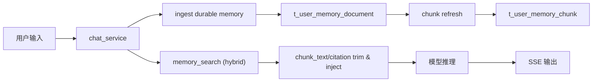

# 文档化永久记忆实施方案（两表）

> 文档日期：2026-02-28  
> 文档定位：以“两表方案”落地数据库文档化永久记忆，并与现有 KV 体系安全迁移  
> 执行模式：`serial`（先收敛正确性，再推进灰度）

---

## 0. 输入来源清单

1. `docs/内部参考/迭代需求/文档化永久记忆_requirements.md`
2. `docs/内部参考/迭代需求/用户资产_superpowers_omx融合参考报告_20260228.md`
3. OpenClaw 参考实现与文档：
   - `/Users/jijingkun/bojxAI/bot/openclaw/docs/concepts/memory.md`
   - `/Users/jijingkun/bojxAI/bot/openclaw/src/memory/manager.ts`
   - `/Users/jijingkun/bojxAI/bot/openclaw/src/memory/search-manager.ts`
   - `/Users/jijingkun/bojxAI/bot/openclaw/src/agents/tools/memory-tool.ts`
   - `/Users/jijingkun/bojxAI/bot/openclaw/src/auto-reply/reply/memory-flush.ts`
4. 本仓现状代码：
   - `app/models/user_memory.py`
   - `app/services/chat_service.py`
   - `app/services/user_preference_memory_service.py`
   - `app/core/config_contract.py`
   - `install/sql/init_postgres.sql`

---

## 1. 架构影响与约束

### 1.1 模块边界

1. **数据层**：新增文档记忆模型与仓储，职责仅限“存储/检索”。
2. **服务层**：新增文档记忆服务，负责写入策略、召回策略、去重、预算控制。
3. **编排入口**：`chat_service` 只负责接线（注入与降级），不承载记忆策略细节。
4. **控制层 KV**：`t_user_memory` 仅保留受控偏好（语言/风格/人设）语义。
5. **配置层**：统一由 `config_contract + ConfigResolver` 管理开关与阈值。

### 1.2 状态契约

1. **文档主契约**：`user_id/doc_kind/doc_key/content_md/revision/status`。
2. **分块契约**：`user_id/doc_id/chunk_no/chunk_text/embedding/source`。
3. **召回契约**：`query -> snippets[] -> citation -> direct inject`。
4. **迁移契约**：`KV(control) + Document(knowledge)` 双层共存。

### 1.3 路由闭环

1. 写入闭环：`chat_service -> document_memory_service.ingest -> repo -> chunk refresh`。
2. 召回闭环：`chat_service -> memory_search -> chunk_text/citation trim -> system message inject`。
3. 失败闭环：文档链路异常时回退 KV 控制层，不阻断主流程。

### 1.4 端到端链路



### 1.5 可测试性

1. 必须覆盖“跨用户隔离”与“回退路径”用例。
2. 必须覆盖“写入幂等 + 分块刷新 + 注入预算”用例。
3. 必须覆盖“KV 控制层仍生效”的兼容用例。

---

## 2. 方案决策（两表）

| 方案 | 优点 | 缺点 | 成本 | 推荐度 |
|---|---|---|---|---|
| 单表（仅文档） | 结构最少 | 检索粒度差，难做高质量 recall | 低 | ⭐⭐ |
| 两表（文档 + chunk） | 结构简洁且支持 `search -> get`，满足本轮目标 | 需要维护分块索引更新 | 中 | ⭐⭐⭐⭐⭐ |
| 三表及以上 | 可观测增强 | 早期维护负担偏高 | 中高 | ⭐⭐⭐ |

结论：采用两表，日志/事件表延后到下一轮按需补齐。

---

## 3. 数据模型与索引

### 3.1 `t_user_memory_document`（主表）

用途：承载“文档化永久记忆”主真相源。

核心字段：

1. `id` BIGSERIAL PK
2. `user_id` INT NOT NULL
3. `doc_kind` VARCHAR(32) NOT NULL（`long_term` / `daily` / `session`）
4. `doc_key` VARCHAR(128) NOT NULL（如 `MEMORY`、`2026-02-28`、`thread:<id>`）
5. `title` VARCHAR(255) NULL
6. `content_md` TEXT NOT NULL
7. `summary_md` TEXT NULL
8. `source` VARCHAR(32) NOT NULL DEFAULT `memory`
9. `scope` VARCHAR(32) NOT NULL DEFAULT `private`
10. `scope_ref` VARCHAR(128) NULL
11. `status` VARCHAR(16) NOT NULL DEFAULT `active`
12. `revision` INT NOT NULL DEFAULT 1
13. `content_hash` VARCHAR(64) NOT NULL
14. `source_thread_id` VARCHAR(100) NULL
15. `source_message_id` BIGINT NULL
16. `create_time` TIMESTAMP NOT NULL DEFAULT CURRENT_TIMESTAMP
17. `update_time` TIMESTAMP NOT NULL DEFAULT CURRENT_TIMESTAMP

关键索引：

1. `UNIQUE(user_id, doc_kind, doc_key) WHERE status='active'`
2. `INDEX(user_id, update_time DESC)`
3. `INDEX(user_id, source, scope, status)`

### 3.2 `t_user_memory_chunk`（检索层）

用途：承载 `memory_search` 所需分块检索索引。

核心字段：

1. `id` BIGSERIAL PK
2. `doc_id` BIGINT NOT NULL（FK -> document.id）
3. `user_id` INT NOT NULL
4. `chunk_no` INT NOT NULL
5. `start_line` INT NOT NULL
6. `end_line` INT NOT NULL
7. `chunk_text` TEXT NOT NULL
8. `chunk_hash` VARCHAR(64) NOT NULL
9. `chunk_tsv` TSVECTOR NOT NULL
10. `embedding` VECTOR(1536) NULL
11. `embedding_model` VARCHAR(128) NULL
12. `source` VARCHAR(32) NOT NULL DEFAULT `memory`
13. `create_time` TIMESTAMP NOT NULL DEFAULT CURRENT_TIMESTAMP
14. `update_time` TIMESTAMP NOT NULL DEFAULT CURRENT_TIMESTAMP

关键索引：

1. `UNIQUE(user_id, doc_id, chunk_hash)`
2. `INDEX(user_id, doc_id, chunk_no)`
3. `GIN(chunk_tsv)`
4. `IVFFLAT/HNSW(embedding)`（按部署策略择一）

---

## 4. 写入与召回策略

### 4.1 写入策略（ingest）

1. 显式触发（“记住/以后都/长期”）优先写入 `long_term` 文档。
2. 普通会话内容按规则提炼写入 `daily` 文档（按日期归档）。
3. 预压缩前静默 flush：在上下文预算逼近阈值时触发，默认不对用户可见。
4. 文档写入成功后，异步刷新该文档 chunk 索引。

### 4.2 召回策略（recall）

1. `memory_search`：hybrid 检索返回 `chunk_text + score + citation`。
2. `recall`：直接基于 `chunk_text + citation` 注入上下文，禁止再走整文或局部全文读取。
3. 注入前执行预算裁剪（字符/片段/token 预算）。
4. 召回顺序：文档记忆优先；未命中或失败时回退 KV 控制层。

### 4.3 去重策略

1. 文档级去重：`content_hash` 相同则仅刷新 `update_time`。
2. 分块级去重：`chunk_hash` + `UNIQUE(user_id, doc_id, chunk_hash)` 保证幂等。
3. 召回去重：同 `doc_id` 限制返回片段数，避免上下文重复。

### 4.4 预算控制

1. 写入预算：每轮最大新增文档长度、最大新增 chunk 数可配置。
2. 召回预算：`max_results`、`max_snippet_chars`、`max_injected_chars` 可配置。
3. 超预算处理：先裁剪低分片段，再降级为摘要片段。

### 4.5 引用策略

1. 统一引用：`memory://user/{user_id}/{doc_kind}/{doc_key}#L{start}-L{end}`。
2. `memory_search` 直接输出 `chunk_text + citation`，注入链路不再维护独立 `memory_get`。
3. 可通过开关决定是否在用户可见回复中显式展示引用文本。

---

## 5. 与现有 KV 体系迁移策略

### 5.1 迁移原则

1. `t_user_memory` 不直接删除，降级为“控制层偏好”。
2. 文档层成为“长期知识主存储”，KV 不再承载自由知识。
3. 全程支持灰度与快速回退。

### 5.2 阶段方案

1. Phase A：建表与只写文档（不读文档）。
2. Phase B：双读影子（文档召回只打日志，不注入）。
3. Phase C：小流量注入（按 `user_id hash` 分桶）。
4. Phase D：全量切换文档召回，KV 仅保留控制层。

### 5.3 灰度与回滚开关（新增）

1. `feature.enable_document_memory`
2. `feature.enable_document_memory_recall`
3. `feature.enable_document_memory_flush`
4. `memory.document.max_results`
5. `memory.document.max_injected_chars`
6. `memory.document.hybrid.vector_weight`
7. `memory.document.hybrid.text_weight`

---

## 6. 功能机制包总表（Feature Packet）

| feature_id | card_id | 目标摘要 | 代码锚点（文件+函数/类） | 验证命令 | 来源证据 |
|---|---|---|---|---|---|
| P1-01 | C01 | 新增两表 DDL 与索引 | `install/sql/init_postgres.sql`、`install/scripts/init_postgres.sql/*` | `venv/bin/python -m pytest -q tests/unit/test_document_memory_schema.py` | OpenClaw memory 索引分层 |
| P1-02 | C01 | 新增 ORM 模型与仓储接口 | `app/models/`、`app/repositories/` | `venv/bin/python -m pytest -q tests/unit/test_document_memory_repo.py` | 当前仓储模式约束 |
| P2-01 | C02 | 文档 ingest 与分块刷新 | `app/services/document_memory_service.py` | `venv/bin/python -m pytest -q tests/unit/test_document_memory_ingest.py` | OpenClaw pre-compaction flush 思路 |
| P2-02 | C02 | 去重与冲突折叠策略 | `app/services/document_memory_service.py` | `venv/bin/python -m pytest -q tests/unit/test_document_memory_dedupe.py` | OpenClaw MMR/去冗余策略 |
| P3-01 | C03 | memory_search（hybrid） | `app/services/document_memory_recall_service.py` | `venv/bin/python -m pytest -q tests/unit/test_document_memory_search.py` | OpenClaw hybrid search |
| P3-02 | C03 | chunk_text/citation 直接注入与元数据清洗 | `app/services/document_memory_service.py` | `venv/bin/python -m pytest -q tests/unit/test_document_memory_service_hybrid.py` | 当前 recall 注入链路 |
| P4-01 | C04 | chat_service 注入预算与降级 | `app/services/chat_service.py` | `venv/bin/python -m pytest -q tests/unit/test_chat_service_document_memory.py` | 当前 chat_service 注入链路 |
| P4-02 | C04 | 配置契约与动态解析 | `app/core/config_contract.py`、`app/services/config_resolver.py` | `venv/bin/python -m pytest -q tests/unit/test_document_memory_flags.py` | 现有 feature 开关治理 |
| P5-01 | C05 | KV 控制层迁移与双轨兼容 | `app/services/user_preference_memory_service.py`、迁移脚本 | `venv/bin/python -m pytest -q tests/integration/test_document_memory_migration.py` | 现有 KV 服务逻辑 |
| P6-01 | C06 | 灰度、回滚、文档收口 | `docs/SUMMARY.md`、`scripts/docs_guard.py` | `python3 scripts/docs_guard.py --strict` | jjk-plan 索引门禁 |

---

## 7. Feature Packet 详情（含最小代码样例）

### 7.1 P1-01 两表 DDL 与索引

1. 目标与边界：
   - 做：创建 `document + chunk` 两表与核心索引。
   - 不做：外部向量库接入。
2. 触发条件：数据库迁移执行。
3. 关键字段：`user_id/doc_kind/doc_key/chunk_hash/embedding`。
4. 回滚锚点：`feature.enable_document_memory=false`。
5. 最小代码样例：

```sql
CREATE UNIQUE INDEX IF NOT EXISTS idx_doc_active_unique
ON t_user_memory_document(user_id, doc_kind, doc_key)
WHERE status = 'active';
```

### 7.2 P1-02 ORM 与仓储

1. 目标与边界：
   - 做：补齐模型、仓储、基础 CRUD 与按用户查询接口。
   - 不做：业务策略判断。
2. 代码锚点：
   - `app/models/document_memory.py`
   - `app/repositories/document_memory_repo.py`
3. 最小代码样例：

```python
def list_doc_chunks(db: Session, *, user_id: int, doc_id: int) -> list[MemoryChunk]:
    return db.query(MemoryChunk).filter(
        MemoryChunk.user_id == user_id,
        MemoryChunk.doc_id == doc_id,
    ).order_by(MemoryChunk.chunk_no.asc()).all()
```

### 7.3 P2-01 ingest 与分块刷新

1. 目标与边界：
   - 做：写入文档后刷新 chunk，保证检索可见。
   - 不做：复杂知识抽取模型训练。
2. 关键状态流转：`raw_text -> normalized -> upsert doc -> reindex chunks`。
3. 最小代码样例：

```python
doc = document_repo.upsert_document(...)
chunks = chunker.split(doc.content_md, target_tokens=400, overlap=80)
chunk_repo.replace_doc_chunks(user_id=user_id, doc_id=doc.id, chunks=chunks)
```

### 7.4 P2-02 去重与冲突折叠

1. 目标与边界：
   - 做：避免重复文档、重复 chunk、冲突条目污染。
   - 不做：跨主题自动知识图谱构建。
2. 最小代码样例：

```python
if doc.content_hash == new_hash:
    return doc  # 幂等跳过
```

### 7.5 P3-01 memory_search

1. 目标与边界：
   - 做：支持 FTS + Vector 的混合检索，并按 `user_id/source/scope` 过滤。
   - 不做：跨用户跨租户检索。
2. 最小代码样例：

```python
score = vector_weight * vector_score + text_weight * text_score
```

### 7.6 P3-02 chunk_text/citation 直接注入

1. 目标与边界：
   - 做：直接使用检索返回的 `chunk_text + citation` 生成上下文，并控制注入体积。
   - 不做：整文原样返回或额外局部全文读取。
2. 最小代码样例：

```python
line = f"- {snippet}\\n  引用: {citation}"
```

### 7.7 P4-01 chat 注入预算与降级

1. 目标与边界：
   - 做：在 chat 流程接入文档记忆召回，失败时回退 KV。
   - 不做：改变 SSE 协议。
2. 最小代码样例：

```python
if doc_memory_context:
    input_messages.insert(0, SystemMessage(content=doc_memory_context))
elif kv_context:
    input_messages.insert(0, SystemMessage(content=kv_context))
```

### 7.8 P4-02 配置契约

1. 目标与边界：
   - 做：把新开关纳入 `config_contract`。
   - 不做：新增第二套配置读取机制。
2. 最小代码样例：

```python
enabled = ConfigResolver.get_bool("feature.enable_document_memory", False)
```

### 7.9 P5-01 KV 兼容迁移

1. 目标与边界：
   - 做：将 KV 定位收敛为控制层，新增迁移脚本把可迁移内容写入文档层。
   - 不做：立即清空旧表。
2. 最小代码样例：

```python
if memory_key in CONTROL_KEYS:
    keep_in_kv(memory_key, memory_value)
else:
    ingest_to_document(memory_value)
```

### 7.10 P6-01 灰度与收口

1. 目标与边界：
   - 做：按用户分桶灰度，形成回滚手册与验收证据。
   - 不做：一次性全量强切。
2. 最小代码样例：

```python
bucket = user_id % 100
enabled = bucket < rollout_percent
```

---

## 8. 分阶段路线图

1. 阶段 A（D1-D2）：P1（建模与仓储）
2. 阶段 B（D3-D4）：P2（写入管线与去重）
3. 阶段 C（D5）：P3（检索与精读）
4. 阶段 D（D6）：P4（chat 接线与配置治理）
5. 阶段 E（D7）：P5（迁移兼容）
6. 阶段 F（D8）：P6（灰度与回滚演练）

---

## 9. 跨模块依赖矩阵

| 模块 | 依赖上游 | 输出给下游 |
|---|---|---|
| document_memory_repo | SQL 模型与索引 | ingest/recall 服务 |
| document_memory_service | repo + chunker + embedding | chat_service 写入链路 |
| document_memory_recall_service | chunk 检索与引用读取 | chat_service 注入链路 |
| chat_service | recall/flush 开关 + 记忆服务 | 模型输入上下文 |
| config_contract | DB 配置中心 | 运行期灰度与回滚 |

---

## 10. 风险评估与回滚策略

1. **检索质量不稳**：先启 FTS，再灰度启 vector 权重；必要时降级 FTS-only。
2. **注入过长影响回答**：启用严格预算并保留摘要兜底。
3. **跨用户越界风险**：所有 repo 查询强制 `user_id` 条件，并加测试门禁。
4. **迁移误伤旧偏好**：KV 控制层白名单保留，不做一次性删除。
5. **上线风险**：开关按阶段推进，支持秒级回退。

---

## 11. 测试策略（TDD 前置）

```yaml
test_strategy:
  - feature_id: P1-01
    test_cases: [TC-DMEM-01]
    test_first: true
  - feature_id: P1-02
    test_cases: [TC-DMEM-02]
    test_first: true
  - feature_id: P2-01
    test_cases: [TC-DMEM-03]
    test_first: true
  - feature_id: P2-02
    test_cases: [TC-DMEM-02, TC-DMEM-07]
    test_first: true
  - feature_id: P3-01
    test_cases: [TC-DMEM-04, TC-DMEM-06]
    test_first: true
  - feature_id: P3-02
    test_cases: [TC-DMEM-05]
    test_first: true
  - feature_id: P4-01
    test_cases: [TC-DMEM-07, TC-DMEM-08]
    test_first: true
  - feature_id: P4-02
    test_cases: [TC-DMEM-09]
    test_first: true
  - feature_id: P5-01
    test_cases: [TC-DMEM-08]
    test_first: false
  - feature_id: P6-01
    test_cases: [TC-DMEM-09]
    test_first: false
```

---

## 12. planning_contract（供 /jjk-vkplan 消费）

```yaml
planning_contract:
  execution_mode: serial
  card_order: [C01, C02, C03, C04, C05, C06, G01, G02, G03, G04]
  strict_single_active_card: true
  auto_done_policy:
    implementation-card: hard_gate
    inspection/question-card: policy_gate
  gate_contract:
    mode: as_cards
    gate_ids: [G01, G02, G03, G04]
    depends_on:
      G01: [C06]
      G02: [G01]
      G03: [G02]
      G04: [G03]
  cards:
    - card_id: C01
      wave: P1
      feature_ids: [P1-01, P1-02]
      depends_on: []
      done_gate:
        - two-table schema migrated
        - repo contract tests green
      acceptance_checks:
        - "venv/bin/python -m pytest -q tests/unit/test_document_memory_schema.py tests/unit/test_document_memory_repo.py"
      evidence_entry: "schema and repo tests"

    - card_id: C02
      wave: P2
      feature_ids: [P2-01, P2-02]
      depends_on: [C01]
      done_gate:
        - ingest and dedupe stable
      acceptance_checks:
        - "venv/bin/python -m pytest -q tests/unit/test_document_memory_ingest.py tests/unit/test_document_memory_dedupe.py"
      evidence_entry: "ingest and dedupe tests"

    - card_id: C03
      wave: P3
      feature_ids: [P3-01, P3-02]
      depends_on: [C02]
      done_gate:
        - search and get available
      acceptance_checks:
        - "venv/bin/python -m pytest -q tests/unit/test_document_memory_search.py tests/unit/test_document_memory_service_hybrid.py"
      evidence_entry: "search and get tests"

    - card_id: C04
      wave: P4
      feature_ids: [P4-01, P4-02]
      depends_on: [C03]
      done_gate:
        - chat injection budget and fallback validated
      acceptance_checks:
        - "venv/bin/python -m pytest -q tests/unit/test_chat_service_document_memory.py tests/unit/test_document_memory_flags.py"
      evidence_entry: "chat integration tests"

    - card_id: C05
      wave: P5
      feature_ids: [P5-01]
      depends_on: [C04]
      done_gate:
        - KV compatibility migration completed
      acceptance_checks:
        - "venv/bin/python -m pytest -q tests/integration/test_document_memory_migration.py"
      evidence_entry: "migration compatibility tests"

    - card_id: C06
      wave: P6
      feature_ids: [P6-01]
      depends_on: [C05]
      done_gate:
        - rollout and rollback drills completed
      acceptance_checks:
        - "venv/bin/python -m pytest -q tests/unit/test_document_memory_flags.py tests/unit/test_chat_service_document_memory.py"
      evidence_entry: "rollout drill report"

    - card_id: G01
      wave: G
      feature_ids: [G-1]
      depends_on: [C06]
      done_gate:
        - user isolation checks pass
      acceptance_checks:
        - "venv/bin/python -m pytest -q tests/unit/test_document_memory_search.py -k isolation"
      evidence_entry: "isolation gate report"

    - card_id: G02
      wave: G
      feature_ids: [G-2]
      depends_on: [G01]
      done_gate:
        - fallback behavior pass
      acceptance_checks:
        - "venv/bin/python -m pytest -q tests/unit/test_chat_service_document_memory.py -k fallback"
      evidence_entry: "fallback gate report"

    - card_id: G03
      wave: G
      feature_ids: [G-3]
      depends_on: [G02]
      done_gate:
        - index quality and budget checks pass
      acceptance_checks:
        - "venv/bin/python -m pytest -q tests/unit/test_document_memory_search.py tests/unit/test_chat_service_document_memory.py -k budget"
      evidence_entry: "quality gate report"

    - card_id: G04
      wave: G
      feature_ids: [G-4]
      depends_on: [G03]
      done_gate:
        - docs and index guard pass
      acceptance_checks:
        - "python3 scripts/docs_guard.py --strict"
      evidence_entry: "docs guard report"
```
