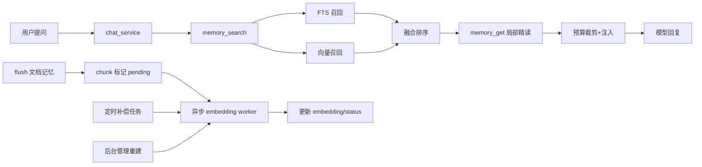

# 文档记忆混合检索实施方案（FTS + 向量）

> 文档日期：2026-02-28  
> 文档定位：在两表文档记忆方案上补齐“可执行、可灰度、可回滚”的混合检索能力  
> 执行模式：`serial`（先稳定上线，再扩大灰度）

---

## 0. 输入来源清单

1. `docs/内部参考/迭代需求/文档记忆混合检索_requirements.md`
2. `docs/内部参考/迭代需求/文档化永久记忆_requirements.md`
3. `docs/内部参考/迭代需求/文档化永久记忆_implementation_plan.md`
4. `docs/内部参考/迭代需求/用户资产_superpowers_omx融合参考报告_20260228.md`
5. OpenClaw 参考：
   - `/Users/jijingkun/bojxAI/bot/openclaw/docs/concepts/memory.md`
   - `/Users/jijingkun/bojxAI/bot/openclaw/src/memory/search-manager.ts`
   - `/Users/jijingkun/bojxAI/bot/openclaw/src/agents/tools/memory-tool.ts`
6. 本仓现状：
   - `app/services/document_memory_service.py`
   - `app/repositories/document_memory_repo.py`
   - `app/services/chat_service.py`
   - `app/ai/utils/embedding_util.py`
   - `app/api/v1/endpoints/skill_admin_api.py`

---

## 0.1 设计审批门禁

- `DESIGN_APPROVAL_FALLBACK_ACK`：未发现 `docs/plans/YYYY-MM-DD-文档记忆混合检索-design.md` 审批记录；本轮按用户明确指令继续规划，后续落地前需补齐 design 审批档。

---

## 1. 架构影响与约束

### 1.1 模块边界

1. **仓储层**：只负责查询与持久化（FTS、向量检索 SQL、状态更新）。
2. **服务层**：负责混合评分、预算裁剪、降级策略与任务编排。
3. **调度层**：负责 embedding 异步任务与定时补偿，不侵入对话主路径。
4. **管理入口**：仅提供重建/重试/状态查询，不直接承载检索策略。

### 1.2 状态契约

在 `t_user_memory_chunk` 新增（或补齐）状态字段：

1. `embedding_status`：`pending|ready|failed`
2. `embedding_retry_count`：重试次数
3. `embedding_error`：最近错误摘要
4. `embedding_updated_time`：最近向量更新时间

状态流转：`pending -> ready`；失败时 `pending -> failed`；人工或补偿任务触发 `failed -> pending`。

### 1.3 路由闭环

1. 对话召回：`chat_service -> memory_search(hybrid) -> memory_get -> 注入`
2. 写入闭环：`flush -> replace_chunks -> mark pending -> async embedding`
3. 失败闭环：向量不可用时自动回退纯 FTS，主对话不失败。

### 1.4 端到端链路



### 1.5 可测试性

1. 必须覆盖文本分 + 向量分 + 融合分计算。
2. 必须覆盖 `pending/failed/ready` 状态流转。
3. 必须覆盖向量降级与多用户隔离。
4. 必须覆盖开关回滚（hybrid off -> FTS only）。

---

## 2. 方案决策

| 方案 | 优点 | 缺点 | 成本 | 推荐度 |
|---|---|---|---|---|
| 纯 FTS | 快速、稳定、低成本 | 语义召回弱 | 低 | ⭐⭐⭐ |
| 纯向量 | 语义能力强 | 可解释性弱、运维复杂 | 中 | ⭐⭐⭐ |
| 混合检索（FTS+向量） | 精确匹配 + 语义召回兼顾，可灰度优化 | 需要补齐异步与运维链路 | 中 | ⭐⭐⭐⭐⭐ |

结论：采用混合检索；向量失败自动降级为纯 FTS。

---

## 3. 数据与检索设计

### 3.1 数据结构（保持两表主结构）

1. 继续使用 `t_user_memory_document` + `t_user_memory_chunk`。
2. `t_user_memory_chunk` 增加 embedding 状态治理字段（见 1.2）。
3. 向量 ANN 索引暂不启用（`VECTOR(2048)` 超出 pgvector `ivfflat/hnsw` 的 2000 维上限），先走 `user_id` 过滤后的精确向量计算，后续可通过降维或 halfvec 再引入 ANN。

### 3.2 混合评分公式

1. `text_score`：`ts_rank(chunk_tsv, query)`
2. `vector_score`：`1 - (embedding <=> query_embedding)`（余弦距离转相似度）
3. `final_score`：`text_weight * text_score + vector_weight * vector_score`
4. 当 `embedding is null` 或向量查询失败：`final_score = text_score`

### 3.3 异步 embedding 策略

1. flush 后 chunk 默认 `pending`。
2. Worker 批量取 `pending` chunk 生成向量并写回 `ready`。
3. 失败写 `failed`，累计重试计数；定时任务按阈值补偿。

### 3.4 管理入口策略

1. 提供最小管理 API：重建任务、状态查询、失败重试。
2. 复用现有模型路由管理，embedding 模型由后台可配置。

---

## 4. 功能机制包总表（Feature Packet）

| feature_id | card_id | 目标摘要 | 代码锚点（文件+函数/类） | 验证命令 | 来源证据 |
|---|---|---|---|---|---|
| P1-01 | C01 | 混合检索 SQL 与评分融合 | `app/repositories/document_memory_repo.py` `search_chunks_hybrid` | `venv/bin/python -m pytest -q tests/unit/test_document_memory_repo_hybrid_search.py` | OpenClaw `search-manager.ts` + 本仓 `document_memory_repo.py` |
| P1-02 | C01 | 检索降级（vector -> FTS） | `app/services/document_memory_service.py` `memory_search` | `venv/bin/python -m pytest -q tests/unit/test_document_memory_service_hybrid.py -k downgrade` | OpenClaw 检索后端降级策略 |
| P2-01 | C02 | embedding 异步写回与状态流转 | `app/services/document_memory_embedding_service.py` `process_pending_chunks` | `venv/bin/python -m pytest -q tests/unit/test_document_memory_embedding_service.py` | 本仓 `embedding_util.py` |
| P2-02 | C02 | 定时补偿与重试上限 | `scripts/memory/rebuild_document_embeddings.py` | `venv/bin/python -m pytest -q tests/integration/test_document_memory_embedding_compensation.py` | 本仓技能向量后台任务实现 |
| P3-01 | C03 | 管理入口：重建与进度查询 | `app/api/v1/endpoints/memory_admin_api.py` | `venv/bin/python -m pytest -q tests/api/test_memory_admin_api.py` | 本仓 `skill_admin_api.py` 任务模式 |
| P4-01 | C04 | chat_service 混合召回接线与预算控制 | `app/services/chat_service.py` | `venv/bin/python -m pytest -q tests/unit/test_chat_service_document_memory_hybrid.py` | 现有 recall 注入链路 |
| P5-01 | C05 | 配置契约与灰度回滚 | `app/core/config_contract.py` `app/core/config.py` | `venv/bin/python -m pytest -q tests/unit/test_document_memory_hybrid_flags.py` | 现有 feature 开关治理 |

---

## 5. Feature Packet 详情（含最小代码样例）

### 5.1 P1-01 混合检索 SQL

1. **目标与边界**：新增混合查询，不改动文档写入协议。
2. **触发条件与状态流转**：当 query_embedding 可用时启用向量分，否则纯 FTS。
3. **代码锚点**：`app/repositories/document_memory_repo.py`
4. **关键契约字段**：`text_score`、`vector_score`、`final_score`
5. **回滚锚点**：关闭 `feature.enable_document_memory_hybrid_search`
6. **验证命令**：`venv/bin/python -m pytest -q tests/unit/test_document_memory_repo_hybrid_search.py`
7. **来源证据**：OpenClaw `search-manager.ts`
8. **最小代码样例**：

```sql
SELECT
  c.doc_id,
  ts_rank(c.chunk_tsv, plainto_tsquery('simple', :q)) AS text_score,
  CASE
    WHEN c.embedding IS NULL OR :query_embedding IS NULL THEN 0
    ELSE 1 - (c.embedding <=> CAST(:query_embedding AS vector))
  END AS vector_score
FROM t_user_memory_chunk c
WHERE c.user_id = :user_id;
```

### 5.2 P2-01 异步 embedding 写回

1. **目标与边界**：embedding 生成异步化，不阻塞 chat 请求。
2. **触发条件与状态流转**：`pending -> ready/failed`。
3. **代码锚点**：`app/services/document_memory_embedding_service.py`
4. **关键契约字段**：`embedding_status`、`embedding_retry_count`、`embedding_error`
5. **回滚锚点**：关闭 `feature.enable_document_memory_embedding_worker`
6. **验证命令**：`venv/bin/python -m pytest -q tests/unit/test_document_memory_embedding_service.py`
7. **来源证据**：`app/ai/utils/embedding_util.py`
8. **最小代码样例**：

```python
for chunk in pending_chunks:
    vec = get_embedding(chunk.chunk_text)
    if vec:
        repo.mark_chunk_embedding_ready(chunk.id, vec, model_code)
    else:
        repo.mark_chunk_embedding_failed(chunk.id, "embedding_empty")
```

### 5.3 P2-02 定时补偿

1. **目标与边界**：清理历史 pending/failed，保证最终一致。
2. **触发条件与状态流转**：定时扫描 + 按重试阈值重排。
3. **代码锚点**：`scripts/memory/rebuild_document_embeddings.py`
4. **关键契约字段**：`embedding_retry_count <= max_retry`
5. **回滚锚点**：停掉 cron/任务调度即回退。
6. **验证命令**：`venv/bin/python -m pytest -q tests/integration/test_document_memory_embedding_compensation.py`
7. **来源证据**：`app/api/v1/endpoints/skill_admin_api.py` 后台任务模式。
8. **最小代码样例**：

```bash
venv/bin/python scripts/memory/rebuild_document_embeddings.py --limit 200 --only failed,pending
```

### 5.4 P3-01 管理入口

1. **目标与边界**：提供最小运维闭环，不扩展复杂 UI。
2. **触发条件与状态流转**：管理员触发重建或重试失败分片。
3. **代码锚点**：`app/api/v1/endpoints/memory_admin_api.py`
4. **关键契约字段**：`job_id`、`total`、`processed`、`failed`
5. **回滚锚点**：关闭 `feature.enable_document_memory_admin_api`
6. **验证命令**：`venv/bin/python -m pytest -q tests/api/test_memory_admin_api.py`
7. **来源证据**：`skill_admin_api.py` 的 `BackgroundTasks` 方案。
8. **最小代码样例**：

```python
@router.post("/document-memory/rebuild-embeddings")
def rebuild_embeddings(request: RebuildRequest, background_tasks: BackgroundTasks):
    background_tasks.add_task(run_rebuild_job, request.user_id, request.doc_id)
    return {"status": "processing"}
```

### 5.5 P4-01 chat 注入与降级

1. **目标与边界**：对话主路径稳定优先，检索失败可降级。
2. **触发条件与状态流转**：hybrid on -> mixed；异常 -> text_only。
3. **代码锚点**：`app/services/chat_service.py`
4. **关键契约字段**：`max_results`、`max_injected_chars`、`hybrid weights`
5. **回滚锚点**：关闭 `feature.enable_document_memory_hybrid_search`
6. **验证命令**：`venv/bin/python -m pytest -q tests/unit/test_chat_service_document_memory_hybrid.py`
7. **来源证据**：现有 `document_memory_context` 注入链路。
8. **最小代码样例**：

```python
if hybrid_enabled:
    context = recall_document_memory(..., vector_weight=vw, text_weight=tw)
else:
    context = recall_document_memory(..., vector_weight=0.0, text_weight=1.0)
```

---

## 6. 工单级任务包（Implementation Tasks）

```yaml
implementation_tasks:
  - task_id: T-01
    feature_id: P1-01
    phase: Phase-1
    file_paths:
      - app/repositories/document_memory_repo.py
    symbols:
      - search_chunks_hybrid
      - _build_vector_sql_clause
    change_type: modify
    acceptance_cmds:
      - venv/bin/python -m pytest -q tests/unit/test_document_memory_repo_hybrid_search.py
    rollback_point: 切回 search_chunks 纯 FTS 查询函数

  - task_id: T-02
    feature_id: P1-02
    phase: Phase-1
    file_paths:
      - app/services/document_memory_service.py
    symbols:
      - memory_search
      - _merge_weights
    change_type: modify
    acceptance_cmds:
      - venv/bin/python -m pytest -q tests/unit/test_document_memory_service_hybrid.py
    rollback_point: 强制 vector_weight=0, text_weight=1

  - task_id: T-03
    feature_id: P2-01
    phase: Phase-2
    file_paths:
      - app/services/document_memory_embedding_service.py
      - app/repositories/document_memory_repo.py
      - app/models/document_memory.py
      - alembic/versions/20260301_0018_document_memory_embedding_status.py
    symbols:
      - process_pending_chunks
      - mark_chunk_embedding_ready
      - mark_chunk_embedding_failed
    change_type: add
    acceptance_cmds:
      - venv/bin/python -m pytest -q tests/unit/test_document_memory_embedding_service.py
      - venv/bin/alembic upgrade head
    rollback_point: 关闭 feature.enable_document_memory_embedding_worker

  - task_id: T-04
    feature_id: P2-02
    phase: Phase-2
    file_paths:
      - scripts/memory/rebuild_document_embeddings.py
      - scripts/cron/document_memory_embedding_compensation.sh
    symbols:
      - run_rebuild
    change_type: add
    acceptance_cmds:
      - venv/bin/python -m pytest -q tests/integration/test_document_memory_embedding_compensation.py
    rollback_point: 停止 cron/调度任务并保留手工重建脚本

  - task_id: T-05
    feature_id: P3-01
    phase: Phase-3
    file_paths:
      - app/api/v1/endpoints/memory_admin_api.py
      - app/api/v1/router.py
      - app/schemas/memory_admin.py
    symbols:
      - rebuild_embeddings
      - get_embedding_job_status
      - retry_failed_embeddings
    change_type: add
    acceptance_cmds:
      - venv/bin/python -m pytest -q tests/api/test_memory_admin_api.py
    rollback_point: 下线路由前缀 /api/v1/admin/memory

  - task_id: T-06
    feature_id: P4-01
    phase: Phase-3
    file_paths:
      - app/services/chat_service.py
      - tests/unit/test_chat_service_document_memory_hybrid.py
    symbols:
      - stream_chat
      - _get_document_memory_weights
    change_type: modify
    acceptance_cmds:
      - venv/bin/python -m pytest -q tests/unit/test_chat_service_document_memory_hybrid.py
    rollback_point: 关闭 feature.enable_document_memory_hybrid_search

  - task_id: T-07
    feature_id: P5-01
    phase: Phase-4
    file_paths:
      - app/core/config_contract.py
      - app/core/config.py
      - install/sql/init_postgres.sql
      - install/scripts/init_postgres.sql/031_enable_document_memory_hybrid_search.sql
    symbols:
      - CONFIG_SPECS
    change_type: modify
    acceptance_cmds:
      - venv/bin/python -m pytest -q tests/unit/test_document_memory_hybrid_flags.py
      - python3 scripts/docs_guard.py --strict
    rollback_point: 配置回退为 feature.enable_document_memory_hybrid_search=false
```

---

## 7. 测试策略（TDD 前置）

```yaml
test_strategy:
  - feature_id: P1-01
    test_cases:
      - TC-HYB-01-01: 同 query 下 final_score 随权重变化符合预期
      - TC-HYB-01-02: embedding 缺失时自动退化为 text_score
    test_first: true

  - feature_id: P2-01
    test_cases:
      - TC-HYB-02-01: pending chunk 成功写回后置为 ready
      - TC-HYB-02-02: embedding 异常后写 failed 并增加 retry_count
    test_first: true

  - feature_id: P3-01
    test_cases:
      - TC-HYB-03-01: 后台触发重建返回 processing
      - TC-HYB-03-02: 无权限调用返回 403
    test_first: false

  - feature_id: P4-01
    test_cases:
      - TC-HYB-04-01: hybrid 开启时调用混合检索
      - TC-HYB-04-02: hybrid 关闭时仅走 FTS
    test_first: true
```

---

## 8. 与 `/jjk-vkplan` 的机读契约

```yaml
planning_contract:
  execution_mode: serial
  card_order: [C01, C02, C03, C04, C05, G01]
  strict_single_active_card: true
  auto_done_policy:
    implementation-card: hard_gate
    inspection-card: policy_gate
  gate_contract:
    mode: as_cards
    gate_ids: [G01]
    depends_on:
      G01: [C05]
  cards:
    - card_id: C01
      wave: P1
      feature_ids: [P1-01, P1-02]
      depends_on: []
      task_mode: implementation-card
      merge_required: true
      done_gate:
        - hybrid query + downgrade tests green
      acceptance_checks:
        - venv/bin/python -m pytest -q tests/unit/test_document_memory_repo_hybrid_search.py
        - venv/bin/python -m pytest -q tests/unit/test_document_memory_service_hybrid.py
      evidence_entry: docs/内部参考/迭代需求/文档记忆混合检索_implementation_plan.md

    - card_id: C02
      wave: P2
      feature_ids: [P2-01, P2-02]
      depends_on: [C01]
      task_mode: implementation-card
      merge_required: true
      done_gate:
        - embedding worker + compensation available
      acceptance_checks:
        - venv/bin/python -m pytest -q tests/unit/test_document_memory_embedding_service.py
        - venv/bin/python -m pytest -q tests/integration/test_document_memory_embedding_compensation.py
      evidence_entry: docs/内部参考/迭代需求/文档记忆混合检索_implementation_plan.md

    - card_id: C03
      wave: P3
      feature_ids: [P3-01]
      depends_on: [C02]
      task_mode: implementation-card
      merge_required: true
      done_gate:
        - admin endpoints available
      acceptance_checks:
        - venv/bin/python -m pytest -q tests/api/test_memory_admin_api.py
      evidence_entry: docs/内部参考/迭代需求/文档记忆混合检索_implementation_plan.md

    - card_id: C04
      wave: P4
      feature_ids: [P4-01]
      depends_on: [C01, C02]
      task_mode: implementation-card
      merge_required: true
      done_gate:
        - chat recall hybrid path stable
      acceptance_checks:
        - venv/bin/python -m pytest -q tests/unit/test_chat_service_document_memory_hybrid.py
      evidence_entry: docs/内部参考/迭代需求/文档记忆混合检索_implementation_plan.md

    - card_id: C05
      wave: P5
      feature_ids: [P5-01]
      depends_on: [C03, C04]
      task_mode: implementation-card
      merge_required: true
      done_gate:
        - config + migration + docs aligned
      acceptance_checks:
        - venv/bin/alembic upgrade head
        - python3 scripts/docs_guard.py --strict
      evidence_entry: docs/内部参考/迭代需求/文档记忆混合检索_implementation_plan.md

    - card_id: G01
      wave: Gate
      feature_ids: [G-1]
      depends_on: [C05]
      task_mode: inspection-card
      merge_required: false
      done_gate:
        - all acceptance checks passed
      acceptance_checks:
        - venv/bin/python -m pytest -q tests/unit/test_document_memory_service_hybrid.py tests/unit/test_chat_service_document_memory_hybrid.py
        - python3 scripts/docs_guard.py --strict
      evidence_entry: docs/内部参考/迭代需求/文档记忆混合检索_implementation_plan.md
```

---

## 9. 实施就绪结论

```yaml
implementation_readiness:
  implementation_ready: true
  blocked_by: []
  next_step: /jjk-imp
```
