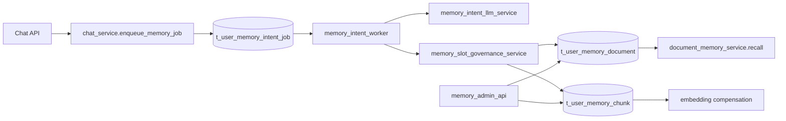

# 用户个性化永久记忆与管理能力实施方案（LLM 异步判定版）

> 文档日期：2026-03-04  
> 文档定位：把“用户个性化永久记忆”需求基线落地为可直接执行的工单级 HOW 计划  
> 执行模式：`core`（`plan-only`，本轮不自动进入实现）

---

## 0. 输入来源清单

1. `docs/plans/2026-03-03-user-personalized-memory-llm-async-design.md`
2. `docs/内部参考/迭代需求/用户个性化永久记忆与管理能力_requirements.md`
3. OpenClaw 参考：
   - `/Users/jijingkun/bojxAI/bot/openclaw/docs/concepts/memory.md`
   - `/Users/jijingkun/bojxAI/bot/openclaw/src/agents/tools/memory-tool.ts`
   - `/Users/jijingkun/bojxAI/bot/openclaw/src/memory/search-manager.ts`
   - `/Users/jijingkun/bojxAI/bot/openclaw/src/auto-reply/reply/memory-flush.ts`
4. 现状代码锚点：
   - `app/services/chat_service.py`
   - `app/services/document_memory_service.py`
   - `app/services/document_memory_embedding_service.py`
   - `app/services/memory_admin_service.py`
   - `app/api/v1/endpoints/memory_admin_api.py`
   - `app/repositories/document_memory_repo.py`
   - `app/models/document_memory.py`
   - `app/core/config_contract.py`

---

## 0.1 设计审批门禁

- 设计文档：`docs/plans/2026-03-03-user-personalized-memory-llm-async-design.md`
- 审批记录：`design_approved: true`
- 审批时间：`2026-03-04 10:41 CST`
- 审批轮次：`round-2`

`DESIGN_APPROVAL_REQUIRED`: false

---

## 0.2 执行意图门禁

- 用户本轮意图：仅要求“生成需求和计划”。
- 本文输出模式：`plan-only`。
- 本轮不会自动触发：`/jjk-vkplan`、`/jjk-vktodo`、`/jjk-imp`。

`PLAN_EXECUTION_INTENT_REQUIRED`: false

---

## 0.3 Superpowers 产物桥接

- 桥接状态：`SUPERPOWERS_ARTIFACT_UNALIGNED: false`
- 对齐关系：
  1. design 的最终方案 -> 本文 feature/task/pr 契约。
  2. 本文 `planning_contract` -> 后续 `/jjk-vkplan` 或 `/jjk-imp` 统一输入。

---

## 1. 架构影响与约束

### 1.1 模块边界

1. `chat_service` 只负责消息落库与任务入队，不承担记忆判定。
2. `memory intent worker` 负责判定、冲突治理、持久化编排。
3. `document_memory_service/repo` 负责文档写入、分块与检索注入。
4. `memory_admin_api/service` 负责后台查询治理，不反向污染主对话链路。

### 1.2 状态契约

1. 任务状态：`pending/processing/succeeded/failed/dead_letter`。
2. 判定分层：`permanent/daily/none`。
3. 分类集合：`ai_persona/user_preference/important_knowledge/profile_fact/interaction_policy`。
4. 文档状态：`active/archived`。
5. 向量状态：`pending/ready/failed`。

### 1.3 路由闭环

1. 对话闭环：`chat -> enqueue -> worker -> document/chunk -> recall`。
2. 管理闭环：`admin -> list/detail/debug/archive/delete/rebuild -> audit`。
3. 失败闭环：`failed -> retry -> dead_letter -> replay`。

### 1.4 端到端链路一致性



### 1.5 可测试性要求

1. Worker 合同测试：判定解析、阈值、容错、幂等。
2. Repo 测试：队列抢占、乱序保护、覆盖归档。
3. API 测试：后台查询治理、权限、错误码。
4. 集成测试：异步任务到召回可见的端到端链路。

---

## 2. 数据与接口落地方案

### 2.1 数据模型变更

1. 新增任务表：`t_user_memory_intent_job`。
2. 扩展文档表：增加并发与乱序保护字段（`revision`, `last_event_time`）。
3. 复用现有：`t_user_memory_document`, `t_user_memory_chunk`。
4. 审计复用：`t_user_memory_admin_audit`，新增 memory-intent 事件类型。

### 2.2 配置与开关

1. 统一单总开关：`memory.document_enabled`（已有）。
2. 新增异步子开关：`memory.intent_async_enabled`。
3. 新增治理开关：`memory.intent_admin_enabled`。

### 2.3 API 契约增量

1. 后台查询：保留 `/memory-admin/*`，统一“记忆”语义字段。
2. 管理动作新增参数：支持按 `slot_key/category/level/status` 过滤与治理。
3. 调试接口返回：`score/citation/source_span/final_status`。

---

## 3. 功能机制包总表（Feature Packet）

| feature_id | 目标与边界 | 触发与状态流转 | 代码锚点 | 关键契约字段 | 回滚锚点 | 验证命令 | 来源证据 |
|---|---|---|---|---|---|---|---|
| P1-01 | 主链路只入队，不判定 | chat 消息写入后创建任务 | `app/services/chat_service.py` | `dedupe_key,event_time,status` | 关闭 `memory.intent_async_enabled` | `venv/bin/python -m pytest tests/unit/test_chat_service_memory_flags.py -q` | design 4.1/4.7 |
| P1-02 | Worker 抢占与状态机 | `pending->processing->succeeded/failed/dead_letter` | `app/core/memory_intent_runtime.py` `app/main.py` `app/services/memory_intent_worker_service.py` | `attempt_count,lease_until,next_retry_time` | 停 worker，回到只检索 | `venv/bin/python -m pytest tests/unit/test_memory_intent_worker_service.py tests/unit/test_memory_intent_runtime.py -q` | design 4.1/4.7/4.8 |
| P1-03 | LLM 合同解析与阈值 | 合同校验后分流 permanent/daily/none | `app/services/memory_intent_llm_service.py`（新增） | `level,category,slot_key,canonical_text,confidence` | 开关降级为 none-only | `venv/bin/python -m pytest tests/unit/test_memory_intent_llm_service.py -q` | design 4.5/4.6 |
| P1-04 | 槽位治理与冲突覆盖 | 同槽位新值覆盖旧值归档 | `app/services/memory_slot_governance_service.py`（新增） | `slot_key,revision,last_event_time,operation` | 关闭覆盖逻辑，保留写入日志 | `venv/bin/python -m pytest tests/unit/test_memory_slot_governance_service.py -q` | design 4.4/4.8 |
| P1-05 | 反向指令与敏感信息拦截 | reverse_intent 可定位才 archive；高敏命中拒绝入库 | `app/services/memory_intent_llm_service.py` + `app/services/memory_sensitive_guard_service.py`（新增） | `reverse_intent,sensitive_hit,reason` | 关闭自动 archive，仅记录审计 | `venv/bin/python -m pytest tests/unit/test_memory_sensitive_guard_service.py -q` | design 4.9/4.10 |
| P1-06 | 文档落库与 embedding 补偿闭环 | 写 doc/chunk 后置 pending，异步补偿向量 | `app/services/document_memory_service.py` `app/services/document_memory_embedding_service.py` | `doc_kind,chunk_text,embedding_status` | 回退到仅 FTS | `venv/bin/python -m pytest tests/integration/test_document_memory_embedding_compensation.py -q` | design 4.11/4.12 |
| P1-07 | 混合检索与注入口径统一 | recall 使用 chunk_text + citation 注入 | `app/services/document_memory_service.py` `app/repositories/document_memory_repo.py` | `chunk_tsv,embedding,score,citation` | 回退到文本检索通路 | `venv/bin/python -m pytest tests/unit/test_document_memory_service_hybrid.py -q` | design 4.11 |
| P1-08 | 后台查询与治理能力补齐 | list/detail/debug/archive/delete/rebuild/retry | `app/api/v1/endpoints/memory_admin_api.py` `app/services/memory_admin_service.py` | `user_id,doc_kind,status,action,audit` | 关闭 admin 开关 | `venv/bin/python -m pytest tests/api/test_memory_admin_api.py -q` | requirements FR-07 |
| P1-09 | 背压、熔断与观测门禁 | 队列 L1/L2/L3 分级与告警 | `app/services/memory_intent_worker_service.py` `app/core/config_contract.py` | `queue_len,dead_letter_rate,p95_latency` | 触发全局熔断 | `venv/bin/python -m pytest tests/unit/test_memory_intent_backpressure.py -q` | design 4.13/4.17 |

---

## 3.1 最小代码样例（按 feature）

### P1-01（主链路入队）

```python
# app/services/chat_service.py
if config.memory.intent_async_enabled:
    memory_intent_job_repo.enqueue(
        user_id=user_id,
        source_message_id=message.id,
        dedupe_key=f"{user_id}:{message.id}",
        payload_json=build_memory_payload(...),
    )
```

### P1-03（LLM 合同容错）

```python
# app/services/memory_intent_llm_service.py
decision = parse_contract(llm_output)
if not decision.has_required_fields():
    return Decision.none(reason="contract_missing_required")
if decision.confidence < 0.85:
    return Decision.none(reason="low_confidence")
```

### P1-04（覆盖归档）

```python
# app/services/memory_slot_governance_service.py
with transaction():
    current = repo.get_active_slot(user_id, slot_key, for_update=True)
    if current and current.last_event_time > incoming.event_time:
        return SkipResult("out_of_order")
    repo.archive_slot(current.id)
    repo.upsert_slot(..., revision=current.revision + 1)
```

### P1-09（背压熔断）

```python
# app/services/memory_intent_worker_service.py
queue_len = job_repo.count_pending()
if queue_len >= 10000:
    return WorkerMode.CIRCUIT_OPEN
if queue_len >= 5000:
    batch_size = min(batch_size, 10)
```

---

## 4. 测试策略（test_strategy）

显式 TC 覆盖补齐：`TC-UPM-06`、`TC-UPM-09`。

```yaml
test_strategy:
  - feature_id: P1-01
    test_cases:
      - TC-UPM-01: chat 主链路只入队不阻塞
    test_first: true
  - feature_id: P1-02
    test_cases:
      - TC-UPM-02: 任务状态机与重试退避正确
    test_first: true
  - feature_id: P1-03
    test_cases:
      - TC-UPM-03: 合同校验与阈值分流正确
    test_first: true
  - feature_id: P1-04
    test_cases:
      - TC-UPM-04: 同槽位覆盖与归档一致
    test_first: true
  - feature_id: P1-05
    test_cases:
      - TC-UPM-05: 反向指令与敏感信息拦截正确
    test_first: true
  - feature_id: P1-06
    test_cases:
      - TC-UPM-07: embedding 失败降级仍可检索
    test_first: false
  - feature_id: P1-08
    test_cases:
      - TC-UPM-08: 后台列表/详情/治理闭环
    test_first: false
  - feature_id: P1-09
    test_cases:
      - TC-UPM-10: L1/L2/L3 背压生效
    test_first: true
```

---

## 5. 工单级任务包（implementation_tasks）

```yaml
implementation_tasks:
  - task_id: T-01
    feature_id: P1-01
    pr_id: PR-01
    phase: Phase-1
    file_paths:
      - app/services/chat_service.py
      - app/repositories/user_memory_intent_job_repo.py
      - app/models/user_memory_intent_job.py
    symbols:
      - enqueue_memory_intent_job
      - UserMemoryIntentJob
      - MemoryIntentJobRepository.enqueue
    change_type: add
    acceptance_cmds:
      - venv/bin/python -m pytest tests/unit/test_chat_service_memory_flags.py -q
    rollback_point: 关闭 memory.intent_async_enabled 并移除入队调用

  - task_id: T-02
    feature_id: P1-02
    pr_id: PR-02
    phase: Phase-1
    file_paths:
      - app/services/memory_intent_worker_service.py
      - app/repositories/user_memory_intent_job_repo.py
      - app/core/config_contract.py
    symbols:
      - MemoryIntentWorkerService.run_once
      - MemoryIntentJobRepository.claim_pending
      - MEMORY_INTENT_WORKER_CONFIG
    change_type: add
    acceptance_cmds:
      - venv/bin/python -m pytest tests/unit/test_memory_intent_worker_service.py -q
    rollback_point: 停用 worker 调度入口并将任务保留 pending

  - task_id: T-03
    feature_id: P1-03
    pr_id: PR-03
    phase: Phase-2
    file_paths:
      - app/services/memory_intent_llm_service.py
      - app/ai/prompts/agent_prompts.py
      - app/core/config_contract.py
    symbols:
      - MemoryIntentLLMService.decide
      - MEMORY_INTENT_DECISION_PROMPT
      - MEMORY_INTENT_CONFIDENCE_THRESHOLD
    change_type: add
    acceptance_cmds:
      - venv/bin/python -m pytest tests/unit/test_memory_intent_llm_service.py -q
    rollback_point: 将判定器降级为返回 none（不写库）

  - task_id: T-04
    feature_id: P1-04
    pr_id: PR-04
    phase: Phase-2
    file_paths:
      - app/services/memory_slot_governance_service.py
      - app/repositories/document_memory_repo.py
      - app/models/document_memory.py
      - install/scripts/init_postgres.sql/030_user_memory_slot_governance.sql
    symbols:
      - MemorySlotGovernanceService.upsert_slot
      - DocumentMemoryRepository.archive_slot
      - UserMemoryDocument.revision
    change_type: modify
    acceptance_cmds:
      - venv/bin/python -m pytest tests/unit/test_memory_slot_governance_service.py -q
    rollback_point: 关闭 slot_governance_enabled 开关，保持 append-only

  - task_id: T-05
    feature_id: P1-05
    pr_id: PR-05
    phase: Phase-2
    file_paths:
      - app/services/memory_sensitive_guard_service.py
      - app/services/memory_intent_llm_service.py
      - app/services/memory_admin_service.py
    symbols:
      - MemorySensitiveGuardService.detect
      - MemoryIntentLLMService.apply_reverse_intent
      - MemoryAdminService.archive_memory_by_slot
    change_type: add
    acceptance_cmds:
      - venv/bin/python -m pytest tests/unit/test_memory_sensitive_guard_service.py -q
    rollback_point: 关闭 reverse_intent_enabled，仅审计不执行 archive

  - task_id: T-06
    feature_id: P1-06
    pr_id: PR-06
    phase: Phase-3
    file_paths:
      - app/services/document_memory_service.py
      - app/repositories/document_memory_repo.py
      - app/services/document_memory_embedding_service.py
    symbols:
      - flush_canonical_memory
      - replace_document_chunks
      - compensate_pending_embeddings
    change_type: modify
    acceptance_cmds:
      - venv/bin/python -m pytest tests/integration/test_document_memory_embedding_compensation.py -q
    rollback_point: 回退到原 flush 路径并保留 chunk pending 状态

  - task_id: T-07
    feature_id: P1-07
    pr_id: PR-07
    phase: Phase-3
    file_paths:
      - app/services/document_memory_service.py
      - app/repositories/document_memory_repo.py
      - tests/unit/test_document_memory_service_hybrid.py
      - tests/unit/test_document_memory_repo_hybrid_search.py
    symbols:
      - recall
      - search_chunks
      - build_memory_citation
    change_type: modify
    acceptance_cmds:
      - venv/bin/python -m pytest tests/unit/test_document_memory_service_hybrid.py -q
      - venv/bin/python -m pytest tests/unit/test_document_memory_repo_hybrid_search.py -q
    rollback_point: 回退到 text-only 检索权重配置

  - task_id: T-08
    feature_id: P1-08
    pr_id: PR-08
    phase: Phase-4
    file_paths:
      - app/api/v1/endpoints/memory_admin_api.py
      - app/services/memory_admin_service.py
      - app/schemas/memory_admin.py
      - tests/api/test_memory_admin_api.py
    symbols:
      - list_memories
      - get_memory_detail
      - archive_memory
      - rebuild_memory_embeddings
    change_type: modify
    acceptance_cmds:
      - venv/bin/python -m pytest tests/api/test_memory_admin_api.py -q
    rollback_point: 关闭 memory.intent_admin_enabled 并回退新增路由

  - task_id: T-09
    feature_id: P1-09
    pr_id: PR-09
    phase: Phase-4
    file_paths:
      - app/services/memory_intent_worker_service.py
      - app/core/config_contract.py
      - tests/unit/test_memory_intent_backpressure.py
      - scripts/memory/rebuild_document_embeddings.py
    symbols:
      - evaluate_backpressure_level
      - MEMORY_INTENT_BACKPRESSURE_THRESHOLDS
      - emit_memory_intent_metrics
    change_type: add
    acceptance_cmds:
      - venv/bin/python -m pytest tests/unit/test_memory_intent_backpressure.py -q
      - python3 scripts/docs_guard.py --strict
    rollback_point: 将 backpressure_mode 置为 disabled
```

---

## 6. Task -> PR 映射契约（task_to_pr_mapping）

```yaml
task_to_pr_mapping:
  - task_id: T-01
    pr_id: PR-01
    pr_branch: codex/user-memory-async-pr-01
    pr_subject: "主链路入队与任务模型"
    pr_depends_on: []
    acceptance_cmds:
      - venv/bin/python -m pytest tests/unit/test_chat_service_memory_flags.py -q
    rollback_point: 关闭 memory.intent_async_enabled

  - task_id: T-02
    pr_id: PR-02
    pr_branch: codex/user-memory-async-pr-02
    pr_subject: "worker 抢占与状态机"
    pr_depends_on: [PR-01]
    acceptance_cmds:
      - venv/bin/python -m pytest tests/unit/test_memory_intent_worker_service.py -q
    rollback_point: 停用 worker 入口

  - task_id: T-03
    pr_id: PR-03
    pr_branch: codex/user-memory-async-pr-03
    pr_subject: "LLM 合同判定与容错"
    pr_depends_on: [PR-02]
    acceptance_cmds:
      - venv/bin/python -m pytest tests/unit/test_memory_intent_llm_service.py -q
    rollback_point: 判定器降级 none-only

  - task_id: T-04
    pr_id: PR-04
    pr_branch: codex/user-memory-async-pr-04
    pr_subject: "slot_key 治理与冲突覆盖"
    pr_depends_on: [PR-03]
    acceptance_cmds:
      - venv/bin/python -m pytest tests/unit/test_memory_slot_governance_service.py -q
    rollback_point: 关闭 slot_governance_enabled

  - task_id: T-05
    pr_id: PR-05
    pr_branch: codex/user-memory-async-pr-05
    pr_subject: "反向指令与敏感信息拦截"
    pr_depends_on: [PR-03]
    acceptance_cmds:
      - venv/bin/python -m pytest tests/unit/test_memory_sensitive_guard_service.py -q
    rollback_point: 关闭 reverse_intent_enabled

  - task_id: T-06
    pr_id: PR-06
    pr_branch: codex/user-memory-async-pr-06
    pr_subject: "文档落库与 embedding 补偿对齐"
    pr_depends_on: [PR-04, PR-05]
    acceptance_cmds:
      - venv/bin/python -m pytest tests/integration/test_document_memory_embedding_compensation.py -q
    rollback_point: 回退 flush_canonical_memory 调用链

  - task_id: T-07
    pr_id: PR-07
    pr_branch: codex/user-memory-async-pr-07
    pr_subject: "混合检索注入口径统一"
    pr_depends_on: [PR-06]
    acceptance_cmds:
      - venv/bin/python -m pytest tests/unit/test_document_memory_service_hybrid.py -q
      - venv/bin/python -m pytest tests/unit/test_document_memory_repo_hybrid_search.py -q
    rollback_point: 检索权重回退 text-only

  - task_id: T-08
    pr_id: PR-08
    pr_branch: codex/user-memory-async-pr-08
    pr_subject: "后台查询治理能力补齐"
    pr_depends_on: [PR-06]
    acceptance_cmds:
      - venv/bin/python -m pytest tests/api/test_memory_admin_api.py -q
    rollback_point: 关闭 memory.intent_admin_enabled

  - task_id: T-09
    pr_id: PR-09
    pr_branch: codex/user-memory-async-pr-09
    pr_subject: "背压熔断与观测门禁"
    pr_depends_on: [PR-02, PR-07, PR-08]
    acceptance_cmds:
      - venv/bin/python -m pytest tests/unit/test_memory_intent_backpressure.py -q
      - python3 scripts/docs_guard.py --strict
    rollback_point: backpressure_mode=disabled
```

---

## 7. planning_contract（供下游命令机读）

```yaml
planning_contract:
  execution_mode: serial
  card_order: [C01, C02, C03, C04, C05, C06, C07, C08, C09, G01]
  strict_single_active_card: true
  auto_done_policy:
    implementation-card: hard_gate
    inspection-card: policy_gate
    question-card: policy_gate
  gate_contract:
    mode: as_cards
    gate_ids: [G01]
    depends_on:
      G01: [C09]
  cards:
    - card_id: C01
      wave: P1
      feature_ids: [P1-01]
      depends_on: []
      task_mode: implementation-card
      merge_required: true
      done_gate:
        - 主链路入队稳定
      acceptance_checks:
        - venv/bin/python -m pytest tests/unit/test_chat_service_memory_flags.py -q
      evidence_entry: docs/内部参考/迭代需求/用户个性化永久记忆与管理能力_implementation_plan.md

    - card_id: C02
      wave: P1
      feature_ids: [P1-02]
      depends_on: [C01]
      task_mode: implementation-card
      merge_required: true
      done_gate:
        - worker 抢占与状态机稳定
      acceptance_checks:
        - venv/bin/python -m pytest tests/unit/test_memory_intent_worker_service.py -q
      evidence_entry: docs/内部参考/迭代需求/用户个性化永久记忆与管理能力_implementation_plan.md

    - card_id: C03
      wave: P1
      feature_ids: [P1-03]
      depends_on: [C02]
      task_mode: implementation-card
      merge_required: true
      done_gate:
        - 合同解析与阈值策略通过
      acceptance_checks:
        - venv/bin/python -m pytest tests/unit/test_memory_intent_llm_service.py -q
      evidence_entry: docs/内部参考/迭代需求/用户个性化永久记忆与管理能力_implementation_plan.md

    - card_id: C04
      wave: P1
      feature_ids: [P1-04]
      depends_on: [C03]
      task_mode: implementation-card
      merge_required: true
      done_gate:
        - slot 覆盖归档一致
      acceptance_checks:
        - venv/bin/python -m pytest tests/unit/test_memory_slot_governance_service.py -q
      evidence_entry: docs/内部参考/迭代需求/用户个性化永久记忆与管理能力_implementation_plan.md

    - card_id: C05
      wave: P1
      feature_ids: [P1-05]
      depends_on: [C03]
      task_mode: implementation-card
      merge_required: true
      done_gate:
        - 反向指令与敏感拦截生效
      acceptance_checks:
        - venv/bin/python -m pytest tests/unit/test_memory_sensitive_guard_service.py -q
      evidence_entry: docs/内部参考/迭代需求/用户个性化永久记忆与管理能力_implementation_plan.md

    - card_id: C06
      wave: P2
      feature_ids: [P1-06]
      depends_on: [C04, C05]
      task_mode: implementation-card
      merge_required: true
      done_gate:
        - 文档写入与向量补偿闭环可用
      acceptance_checks:
        - venv/bin/python -m pytest tests/integration/test_document_memory_embedding_compensation.py -q
      evidence_entry: docs/内部参考/迭代需求/用户个性化永久记忆与管理能力_implementation_plan.md

    - card_id: C07
      wave: P2
      feature_ids: [P1-07]
      depends_on: [C06]
      task_mode: implementation-card
      merge_required: true
      done_gate:
        - 混合检索与注入口径一致
      acceptance_checks:
        - venv/bin/python -m pytest tests/unit/test_document_memory_service_hybrid.py -q
        - venv/bin/python -m pytest tests/unit/test_document_memory_repo_hybrid_search.py -q
      evidence_entry: docs/内部参考/迭代需求/用户个性化永久记忆与管理能力_implementation_plan.md

    - card_id: C08
      wave: P2
      feature_ids: [P1-08]
      depends_on: [C06]
      task_mode: implementation-card
      merge_required: true
      done_gate:
        - 后台查询与治理动作闭环
      acceptance_checks:
        - venv/bin/python -m pytest tests/api/test_memory_admin_api.py -q
      evidence_entry: docs/内部参考/迭代需求/用户个性化永久记忆与管理能力_implementation_plan.md

    - card_id: C09
      wave: P2
      feature_ids: [P1-09]
      depends_on: [C02, C07, C08]
      task_mode: implementation-card
      merge_required: true
      done_gate:
        - 背压熔断与门禁指标链路打通
      acceptance_checks:
        - venv/bin/python -m pytest tests/unit/test_memory_intent_backpressure.py -q
      evidence_entry: docs/内部参考/迭代需求/用户个性化永久记忆与管理能力_implementation_plan.md

    - card_id: G01
      wave: Gate
      feature_ids: [G-1]
      depends_on: [C09]
      task_mode: inspection-card
      merge_required: false
      done_gate:
        - 全链路校验通过，文档索引与门禁达标
      acceptance_checks:
        - python3 scripts/docs_guard.py --strict
      evidence_entry: docs/内部参考/迭代需求/用户个性化永久记忆与管理能力_implementation_plan.md

  task_to_pr_mapping:
    - task_id: T-01
      pr_id: PR-01
      pr_branch: codex/user-memory-async-pr-01
      pr_depends_on: []
      pr_subject: "主链路入队与任务模型"
      acceptance_cmds:
        - venv/bin/python -m pytest tests/unit/test_chat_service_memory_flags.py -q
      rollback_point: 关闭 memory.intent_async_enabled

    - task_id: T-02
      pr_id: PR-02
      pr_branch: codex/user-memory-async-pr-02
      pr_depends_on: [PR-01]
      pr_subject: "worker 抢占与状态机"
      acceptance_cmds:
        - venv/bin/python -m pytest tests/unit/test_memory_intent_worker_service.py -q
      rollback_point: 停用 worker 入口

    - task_id: T-03
      pr_id: PR-03
      pr_branch: codex/user-memory-async-pr-03
      pr_depends_on: [PR-02]
      pr_subject: "LLM 合同判定与容错"
      acceptance_cmds:
        - venv/bin/python -m pytest tests/unit/test_memory_intent_llm_service.py -q
      rollback_point: 判定器降级 none-only

    - task_id: T-04
      pr_id: PR-04
      pr_branch: codex/user-memory-async-pr-04
      pr_depends_on: [PR-03]
      pr_subject: "slot_key 治理与冲突覆盖"
      acceptance_cmds:
        - venv/bin/python -m pytest tests/unit/test_memory_slot_governance_service.py -q
      rollback_point: 关闭 slot_governance_enabled

    - task_id: T-05
      pr_id: PR-05
      pr_branch: codex/user-memory-async-pr-05
      pr_depends_on: [PR-03]
      pr_subject: "反向指令与敏感信息拦截"
      acceptance_cmds:
        - venv/bin/python -m pytest tests/unit/test_memory_sensitive_guard_service.py -q
      rollback_point: 关闭 reverse_intent_enabled

    - task_id: T-06
      pr_id: PR-06
      pr_branch: codex/user-memory-async-pr-06
      pr_depends_on: [PR-04, PR-05]
      pr_subject: "文档落库与 embedding 补偿对齐"
      acceptance_cmds:
        - venv/bin/python -m pytest tests/integration/test_document_memory_embedding_compensation.py -q
      rollback_point: 回退 flush_canonical_memory 调用链

    - task_id: T-07
      pr_id: PR-07
      pr_branch: codex/user-memory-async-pr-07
      pr_depends_on: [PR-06]
      pr_subject: "混合检索注入口径统一"
      acceptance_cmds:
        - venv/bin/python -m pytest tests/unit/test_document_memory_service_hybrid.py -q
      rollback_point: 检索权重回退 text-only

    - task_id: T-08
      pr_id: PR-08
      pr_branch: codex/user-memory-async-pr-08
      pr_depends_on: [PR-06]
      pr_subject: "后台查询治理能力补齐"
      acceptance_cmds:
        - venv/bin/python -m pytest tests/api/test_memory_admin_api.py -q
      rollback_point: 关闭 memory.intent_admin_enabled

    - task_id: T-09
      pr_id: PR-09
      pr_branch: codex/user-memory-async-pr-09
      pr_depends_on: [PR-02, PR-07, PR-08]
      pr_subject: "背压熔断与观测门禁"
      acceptance_cmds:
        - venv/bin/python -m pytest tests/unit/test_memory_intent_backpressure.py -q
        - python3 scripts/docs_guard.py --strict
      rollback_point: backpressure_mode=disabled
```

---

## 8. execution_contract（执行粒度契约）

```yaml
execution_contract:
  delivery_mode: one_shot
  execution_unit: all_tasks
  commit_policy: single_commit
  stop_boundary: none
  stop_on_blocked: true
```

---

## 9. implementation_readiness（机读结论）

```yaml
implementation_readiness:
  implementation_ready: true
  blocked_by: []
  next_step: /jjk-imp
  execution_contract_ready: true
```

---

## 10. 执行备注

```yaml
execution_notes:
  fallback:
    brainstorming: false
    team: false
  template:
    missing: false
    source: "/Users/jijingkun/.codex/engineering/templates/jjk_plan_templates.md"
  degrade_reason: ""
  alternative_tool: ""
  verification: "planning_contract 与 implementation_tasks 已双向绑定"
```

---

## 11. 增量执行记录（2026-03-04）

```yaml
incremental_execution:
  - card_id: C01
    task_key: PP-20260304-USER-MEMORY-LLM-ASYNC
    feature_ids: [P1-01]
    pr_id: PR-01
    pr_branch: codex/user-memory-async-pr-01
    pr_subject: 主链路入队与任务模型
    mechanism_summary:
      - chat 主链路只做入队，不执行记忆判定
      - 任务幂等键使用 (user_id, source_message_id)
    rollback_anchors:
      - memory.intent_async_enabled=false
    acceptance_checks:
      - venv/bin/python -m pytest tests/unit/test_chat_service_memory_flags.py -q
  - card_id: C02
    task_key: PP-20260304-USER-MEMORY-LLM-ASYNC
    feature_ids: [P1-02]
    pr_id: PR-02
    pr_branch: codex/user-memory-async-pr-02
    pr_depends_on: [PR-01]
    pr_subject: worker 抢占与状态机
    mechanism_summary:
      - Worker 使用 SKIP LOCKED 抢占 pending 任务
      - failed 按退避重试并进入 dead_letter
    rollback_anchors:
      - 停止 worker 调度入口
    acceptance_checks:
      - venv/bin/python -m pytest tests/unit/test_memory_intent_worker_service.py -q
    verification:
      - "/Users/jijingkun/bojxAI/fastapi/venv/bin/python -m pytest tests/unit/test_memory_intent_worker_service.py -q -> 6 passed"
  - card_id: C03
    task_key: PP-20260304-USER-MEMORY-LLM-ASYNC
    feature_ids: [P1-03]
    pr_id: PR-03
    pr_branch: codex/user-memory-async-pr-03
    pr_depends_on: [PR-02]
    pr_subject: LLM 合同判定与容错
    mechanism_summary:
      - lightweight 模型输出结构化合同
      - 核心字段缺失按 none 丢弃并审计
    changed_files:
      - app/services/memory_intent_llm_service.py
      - app/ai/prompts/agent_prompts.py
      - tests/unit/test_memory_intent_llm_service.py
    rollback_anchors:
      - 判定器降级为 none-only
    acceptance_checks:
      - venv/bin/python -m pytest tests/unit/test_memory_intent_llm_service.py -q
    verification:
      - "/Users/jijingkun/bojxAI/fastapi/venv/bin/python -m pytest tests/unit/test_memory_intent_llm_service.py -q -> 8 passed"
  - card_id: C04
    task_key: PP-20260304-USER-MEMORY-LLM-ASYNC
    feature_ids: [P1-04]
    pr_id: PR-04
    pr_branch: codex/user-memory-async-pr-04
    pr_depends_on: [PR-03]
    pr_subject: slot_key 治理与冲突覆盖
    mechanism_summary:
      - slot_key 归一化后再写库
      - 同槽位新值覆盖旧值并归档审计
    changed_files:
      - app/services/memory_slot_governance_service.py
      - app/repositories/document_memory_repo.py
      - app/models/document_memory.py
      - app/core/config_contract.py
      - install/scripts/init_postgres.sql/030_user_memory_slot_governance.sql
      - install/scripts/init_system_config.py
      - tests/unit/test_memory_slot_governance_service.py
    rollback_anchors:
      - slot_governance_enabled=false
    acceptance_checks:
      - venv/bin/python -m pytest tests/unit/test_memory_slot_governance_service.py -q
    verification:
      - "/Users/jijingkun/bojxAI/fastapi/venv/bin/python -m pytest tests/unit/test_memory_slot_governance_service.py -q -> 5 passed"
  - card_id: C05
    task_key: PP-20260304-USER-MEMORY-LLM-ASYNC
    feature_ids: [P1-05]
    pr_id: PR-05
    pr_branch: codex/user-memory-async-pr-05
    pr_depends_on: [PR-03]
    pr_subject: 反向指令与敏感信息拦截
    mechanism_summary:
      - reverse_intent 可定位 slot_key 时才执行 archive
      - 命中证件号/银行卡/密码/验证码等高敏信息直接拒绝沉淀
    changed_files:
      - app/services/memory_intent_llm_service.py
      - app/services/memory_sensitive_guard_service.py
      - tests/unit/test_memory_sensitive_guard_service.py
    rollback_anchors:
      - reverse_intent_enabled=false
    acceptance_checks:
      - venv/bin/python -m pytest tests/unit/test_memory_sensitive_guard_service.py -q
    verification:
      - "/Users/jijingkun/bojxAI/fastapi/venv/bin/python -m pytest tests/unit/test_memory_sensitive_guard_service.py -q -> 7 passed"
  - card_id: C06
    task_key: PP-20260304-USER-MEMORY-LLM-ASYNC
    feature_ids: [P1-06]
    pr_id: PR-06
    pr_branch: codex/user-memory-async-pr-06
    pr_depends_on: [PR-04, PR-05]
    pr_subject: 文档落库与 embedding 补偿对齐
    mechanism_summary:
      - canonical_text 进入 document/chunk 两表
      - chunk embedding_status=pending 走补偿链路
    changed_files:
      - app/services/document_memory_service.py
      - app/services/document_memory_embedding_service.py
      - tests/integration/test_document_memory_embedding_compensation.py
    rollback_anchors:
      - 回退到旧 flush 路径
    acceptance_checks:
      - venv/bin/python -m pytest tests/integration/test_document_memory_embedding_compensation.py -q
    verification:
      - "/Users/jijingkun/bojxAI/fastapi/venv/bin/python -m pytest tests/integration/test_document_memory_embedding_compensation.py -q -> 4 passed (coverage 30.08%)"
  - card_id: C07
    task_key: PP-20260304-USER-MEMORY-LLM-ASYNC
    feature_ids: [P1-07]
    pr_id: PR-07
    pr_branch: codex/user-memory-async-pr-07
    pr_depends_on: [PR-06]
    pr_subject: 混合检索注入口径统一
    mechanism_summary:
      - FTS 与向量分数按权重混合排序
      - 检索注入直接使用 chunk_text 与 citation，避免 recall 阶段二次回源导致口径漂移
    changed_files:
      - app/services/document_memory_service.py
      - tests/unit/test_document_memory_service_hybrid.py
    rollback_anchors:
      - 检索权重回退 text-only
    acceptance_checks:
      - venv/bin/python -m pytest tests/unit/test_document_memory_service_hybrid.py -q
      - venv/bin/python -m pytest tests/unit/test_document_memory_repo_hybrid_search.py -q
    verification:
      - "/Users/jijingkun/bojxAI/fastapi/venv/bin/python -m pytest tests/unit/test_document_memory_service_hybrid.py -q --no-cov -> 3 passed"
      - "/Users/jijingkun/bojxAI/fastapi/venv/bin/python -m pytest tests/unit/test_document_memory_repo_hybrid_search.py -q --no-cov -> 3 passed"
      - "/Users/jijingkun/bojxAI/fastapi/venv/bin/python -m pytest tests/unit/test_document_memory_service_hybrid.py -q -> 3 passed, coverage gate 29.91% < 30.00%"
      - "/Users/jijingkun/bojxAI/fastapi/venv/bin/python -m pytest tests/unit/test_document_memory_repo_hybrid_search.py -q -> 3 passed, coverage gate 29.62% < 30.00%"
  - card_id: C09
    task_key: PP-20260304-USER-MEMORY-LLM-ASYNC
    feature_ids: [P1-09]
    pr_id: PR-09
    pr_branch: codex/user-memory-async-pr-09
    pr_depends_on: [PR-02, PR-07, PR-08]
    pr_subject: 背压熔断与观测门禁
    mechanism_summary:
      - L1/L2/L3 背压分级
      - 队列与时延指标接入告警门禁
    changed_files:
      - app/services/memory_intent_worker_service.py
      - app/core/config_contract.py
      - tests/unit/test_memory_intent_backpressure.py
    rollback_anchors:
      - backpressure_mode=disabled
    acceptance_checks:
      - venv/bin/python -m pytest tests/unit/test_memory_intent_backpressure.py -q
    verification:
      - "/Users/jijingkun/bojxAI/fastapi/venv/bin/python -m pytest tests/unit/test_memory_intent_backpressure.py -q -> 11 passed, coverage 30.12%"
```
