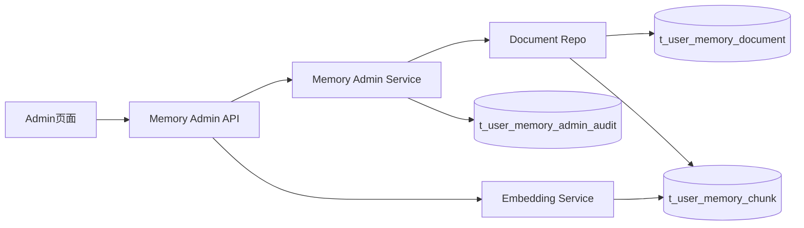

# 用户个性化永久记忆与管理能力实施方案

> 文档日期：2026-03-01  
> 文档定位：在现有两表永久记忆能力上补齐“后台查询 + 管理治理 + 审计闭环”  
> 执行模式：`serial`（先完成稳定闭环，再考虑并行扩展）

---

## 0. 输入来源清单

1. `docs/plans/2026-03-01-user-personalized-memory-management-design.md`
2. `docs/内部参考/迭代需求/用户个性化永久记忆与管理能力_requirements.md`
3. `docs/开发文档/架构设计/用户个性化永久记忆.md`
4. `docs/内部参考/迭代需求/文档化永久记忆_implementation_plan.md`
5. `docs/内部参考/迭代需求/文档记忆混合检索_implementation_plan.md`
6. 现状代码锚点：
   - `app/api/v1/endpoints/memory_admin_api.py`
   - `app/repositories/document_memory_repo.py`
   - `app/services/document_memory_service.py`
   - `app/services/document_memory_embedding_service.py`
   - `app/api/v1/router.py`
   - `web/src/app/admin/*`
   - `web/src/components/admin/*`

---

## 0.1 设计审批门禁

设计文档已通过审批：

- 设计文档：`docs/plans/2026-03-01-user-personalized-memory-management-design.md`
- 审批记录：`design_approved: true`
- 审批时间：`2026-03-01 15:23 CST`
- 审批轮次：`round-1`

`DESIGN_APPROVAL_FALLBACK_ACK`: false

---

## 0.2 执行意图门禁

本轮用户明确要求：`/jjk-plan` 且“需要非常详细”。

- 本轮输出保持 `plan-only`。
- 不自动进入 `/jjk-imp`。
- 下游建议由用户显式指令触发。

---

## 0.3 Superpowers 产物桥接

桥接结论：`SUPERPOWERS_ARTIFACT_UNALIGNED` = false

桥接映射：

1. `docs/plans/*.md` 中已审批设计 -> 本文 `implementation_plan`。
2. 设计中的 FR/AC -> `feature_id` 与 `task_id`。
3. 后续 `/jjk-vkplan` 仅消费本文件，不直接消费 design 原文。

---

## 1. 架构影响与约束

### 1.1 模块边界

1. **Repo 层**：只负责 document/chunk 的查询与状态更新，不承载权限逻辑。  
2. **Service 层**：承载管理动作编排（归档/删除/调试/重建）与审计写入。  
3. **API 层**：仅做参数校验、权限校验、响应协议，不下沉业务策略。  
4. **Web Admin 层**：只调用管理 API，不直接拼装业务规则。  
5. **Chat 主链路**：保持只读调用 recall，不引入管理逻辑。

### 1.2 状态契约

1. 文档状态：`active | archived`（主视图默认只看 active）。
2. 向量状态：`pending | ready | failed`。
3. 管理动作状态：`accepted | processing | completed | failed`。
4. 审计动作类型：`list/detail/chunks/search_debug/archive/delete/rebuild/retry_failed`。

### 1.3 路由闭环

1. 查询闭环：Admin UI -> `/memory-admin/memories` -> Repo -> DB -> UI。  
2. 治理闭环：Admin UI -> archive/delete/rebuild -> Service -> Repo -> 审计 -> UI。  
3. 调试闭环：Admin UI query -> search-debug -> `memory_search` -> score/citation 返回。  
4. 降级闭环：embedding worker 关闭时，查询仍可用，重建返回明确 409。

### 1.4 端到端链路一致性



### 1.5 可测试性要求

1. API 合约测试：参数、分页、过滤、错误码。
2. 权限测试：管理员/非管理员路径。
3. Repo 单测：分页、筛选、排序、状态聚合。
4. 服务层测试：归档/删除/审计写入一致性。
5. 前端冒烟：列表加载、详情展开、动作反馈。

---

## 2. 方案决策

| 方案 | 优点 | 缺点 | 成本 | 推荐度 |
|---|---|---|---|---|
| A. 继续扩展现有 `/document/*` 运维接口 | 改动小 | 语义偏技术化，难覆盖完整管理流程 | 低 | ⭐⭐⭐ |
| B. 新增 `/memories/*` 语义化管理接口，兼容旧接口 | 语义清晰，对外一致，渐进迁移风险低 | 需维护双路由兼容期 | 中 | ⭐⭐⭐⭐⭐ |
| C. 一次性重构全部 memory admin 路由 | 长期最整洁 | 首期风险高、回归面大 | 高 | ⭐⭐⭐ |

结论：采用 **方案 B**。对外新增 `memories` 语义路由，旧 `/document/*` 保持兼容。

---

## 3. 数据与接口设计

### 3.1 数据结构变更

1. 复用主表：`t_user_memory_document`。
2. 复用分块表：`t_user_memory_chunk`。
3. 新增审计表：`t_user_memory_admin_audit`（记录管理动作与操作者）。

审计表建议字段：

- `id BIGSERIAL PK`
- `operator_user_id INT NOT NULL`
- `target_user_id INT NULL`
- `memory_id BIGINT NULL`
- `action VARCHAR(64) NOT NULL`
- `action_payload JSONB NULL`
- `result_status VARCHAR(16) NOT NULL`
- `error_message TEXT NULL`
- `create_time TIMESTAMP NOT NULL DEFAULT CURRENT_TIMESTAMP`

### 3.2 对外 API 语义（新增）

1. `GET /api/v1/memory-admin/memories`
2. `GET /api/v1/memory-admin/memories/{memory_id}`
3. `GET /api/v1/memory-admin/memories/{memory_id}/chunks`
4. `POST /api/v1/memory-admin/memories/{memory_id}/archive`
5. `DELETE /api/v1/memory-admin/memories/{memory_id}`
6. `POST /api/v1/memory-admin/memories/search-debug`

兼容保留：

- `POST /api/v1/memory-admin/document/rebuild-embeddings`
- `GET /api/v1/memory-admin/document/embedding-status`
- `POST /api/v1/memory-admin/document/retry-failed`

### 3.3 配置开关（新增/复用）

1. `feature.enable_document_memory_admin_api`（复用）
2. `feature.enable_document_memory_admin_web`（新增）
3. `feature.enable_document_memory_admin_audit`（新增）
4. `memory.document.admin.max_page_size`（新增）

---

## 4. 功能机制包总表（Feature Packet）

| feature_id | card_id | 目标摘要 | 代码锚点（文件+函数/类） | 验证命令 | 来源证据 |
|---|---|---|---|---|---|
| P1-01 | C01 | 记忆列表查询 API + 分页过滤 | `app/api/v1/endpoints/memory_admin_api.py` `list_memories`；`app/repositories/document_memory_repo.py` `list_documents` | `venv/bin/python -m pytest -q tests/api/test_memory_admin_api.py -k memories_list` | 设计文档 2/6 节 |
| P1-02 | C01 | 记忆详情与分块状态查询 | `memory_admin_api.py` `get_memory_detail/get_memory_chunks`；`document_memory_repo.py` `get_document_detail/list_document_chunks` | `venv/bin/python -m pytest -q tests/api/test_memory_admin_api.py -k memory_detail` | 设计文档 6 节 |
| P1-03 | C02 | 召回调试查询（分数+引用） | `memory_admin_api.py` `search_memory_debug`；`document_memory_service.py` `memory_search` | `venv/bin/python -m pytest -q tests/api/test_memory_admin_api.py -k search_debug` | 设计文档 5.3 |
| P2-01 | C02 | 记忆归档操作 | `memory_admin_api.py` `archive_memory`; `document_memory_repo.py` `archive_document` | `venv/bin/python -m pytest -q tests/api/test_memory_admin_api.py -k archive` | 需求 FR-06 |
| P2-02 | C02 | 记忆删除操作（安全校验+级联） | `memory_admin_api.py` `delete_memory`; `document_memory_repo.py` `delete_document` | `venv/bin/python -m pytest -q tests/api/test_memory_admin_api.py -k delete` | 需求 FR-07 |
| P3-01 | C03 | 管理动作审计落库 | `app/models/memory_admin_audit.py`; `app/services/memory_admin_service.py` `record_admin_audit` | `venv/bin/python -m pytest -q tests/unit/test_memory_admin_audit_service.py` | 安全需求 FR-17 |
| P4-01 | C04 | 向量状态查询增强（按用户/文档分页聚合） | `memory_admin_api.py` `get_document_embedding_status`; `document_memory_repo.py` `get_embedding_status_counts` | `venv/bin/python -m pytest -q tests/api/test_memory_admin_api.py -k embedding_status` | 现有运维能力增强 |
| P5-01 | C05 | 管理后台记忆列表页 | `web/src/app/admin/memory/page.tsx`; `web/src/components/admin/MemoryAdminPanel.tsx`; `web/src/lib/memory-admin-api.ts` | `cd web && npm run lint` | 设计文档 5.2 |
| P5-02 | C05 | 详情抽屉 + 治理动作按钮 | `MemoryAdminPanel.tsx` `MemoryDetailDrawer` | `cd web && npm run lint` | 需求 FR-12~FR-15 |
| P6-01 | C06 | 配置/迁移/文档收口 | `app/core/config_contract.py`; `install/sql/init_postgres.sql`; `docs/SUMMARY.md` | `python3 scripts/docs_guard.py --strict` | 平台治理要求 |

---

## 5. Feature Packet 详情（含最小代码样例）

### 5.1 P1-01 记忆列表查询

1. 目标与边界：提供只读列表能力，不包含正文全文回传。  
2. 触发条件：管理员进入页面或筛选条件变化。  
3. 关键契约字段：`items[]`, `total`, `page`, `page_size`。  
4. 回滚锚点：关闭 `feature.enable_document_memory_admin_api`。  
5. 最小代码样例：

```python
@router.get("/memories")
def list_memories(user_id: int | None = None, page: int = 1, page_size: int = 20):
    return memory_admin_service.list_memories(...)
```

### 5.2 P1-02 记忆详情与分块状态

1. 目标与边界：详情按需加载，避免列表超载。  
2. 触发条件：点击某条列表项。  
3. 关键契约字段：`content_md`, `revision`, `chunks[]`。  
4. 回滚锚点：保留旧详情接口只读 fallback。  
5. 最小代码样例：

```python
def get_memory_chunks(memory_id: int):
    return repo.list_document_chunks(doc_id=memory_id, include_embedding_status=True)
```

### 5.3 P1-03 召回调试查询

1. 目标与边界：只用于管理员诊断，不参与主对话路径。  
2. 触发条件：管理后台输入调试 query。  
3. 关键契约字段：`text_score`, `vector_score`, `final_score`, `citation`。  
4. 回滚锚点：关闭 `feature.enable_document_memory_admin_web` 后隐藏入口。  
5. 最小代码样例：

```python
results = memory_search(db, user_id=user_id, query_text=query, max_results=10)
return {"items": results}
```

### 5.4 P2-01 归档操作

1. 目标与边界：逻辑归档，不做物理删除。  
2. 状态流转：`active -> archived`。  
3. 关键契约字段：`status`, `updated_at`, `operator_id`。  
4. 回滚锚点：将状态回写 `active`。  
5. 最小代码样例：

```python
updated = repo.archive_document(user_id=target_user_id, doc_id=memory_id)
if updated:
    audit.record(action="archive", result_status="completed")
```

### 5.5 P2-02 删除操作

1. 目标与边界：硬删仅管理员可执行，需二次确认参数。  
2. 状态流转：`active/archived -> deleted(物理删除)`。  
3. 关键契约字段：`memory_id`, `confirm_token`, `deleted_chunks`。  
4. 回滚锚点：优先建议“先归档后删除”；硬删不可逆。  
5. 最小代码样例：

```python
repo.delete_document(user_id=target_user_id, doc_id=memory_id)
# ON DELETE CASCADE 清理 chunks
```

### 5.6 P3-01 管理审计落库

1. 目标与边界：记录关键管理动作，不记录敏感正文全文。  
2. 触发条件：每次管理接口调用结束（成功/失败均记录）。  
3. 关键契约字段：`action`, `result_status`, `action_payload`, `error_message`。  
4. 回滚锚点：异常时降级结构化日志，但不阻断主接口返回。  
5. 最小代码样例：

```python
audit_repo.insert(
    operator_user_id=admin_id,
    target_user_id=user_id,
    action="delete",
    result_status="failed",
    error_message=str(exc),
)
```

### 5.7 P4-01 向量状态增强

1. 目标与边界：增强可观测，不改 embedding 主处理逻辑。  
2. 触发条件：打开状态看板或筛选 user/doc。  
3. 关键契约字段：`pending`, `ready`, `failed`, `last_updated`。  
4. 回滚锚点：保留当前 `embedding-status` 统计格式兼容。  
5. 最小代码样例：

```sql
SELECT user_id,
       COUNT(*) FILTER (WHERE embedding_status='failed') AS failed
FROM t_user_memory_chunk
GROUP BY user_id;
```

### 5.8 P5-01 管理后台记忆页面

1. 目标与边界：提供 M MVP 页面，不做复杂报表。  
2. 触发条件：管理员进入 `/admin/memory`。  
3. 关键契约字段：`filters`, `list`, `detailDrawer`, `actionFeedback`。  
4. 回滚锚点：隐藏菜单项并保留后端 API。  
5. 最小代码样例：

```tsx
const { items, total } = await listMemories(params);
setTableData(items);
setTotal(total);
```

### 5.9 P6-01 配置与文档收口

1. 目标与边界：保证灰度、回滚、文档索引可用。  
2. 触发条件：发布前配置初始化与文档校验。  
3. 关键契约字段：`feature.enable_document_memory_admin_web` 等。  
4. 回滚锚点：配置一键关闭。  
5. 最小代码样例：

```sql
INSERT INTO t_system_config(config_key, config_value, value_type)
VALUES ('feature.enable_document_memory_admin_web', 'false', 'boolean')
ON CONFLICT (config_key) DO UPDATE SET config_value='false';
```

---

## 6. 工单级任务包（Implementation Tasks）

```yaml
implementation_tasks:
  - task_id: T-01
    feature_id: P1-01
    pr_id: PR-01
    phase: Phase-1
    file_paths:
      - app/repositories/document_memory_repo.py
      - app/services/memory_admin_service.py
      - app/api/v1/endpoints/memory_admin_api.py
      - app/schemas/memory_admin.py
    symbols:
      - list_documents
      - list_memories
      - MemoryListResponse
    change_type: modify
    acceptance_cmds:
      - venv/bin/python -m pytest -q tests/api/test_memory_admin_api.py -k memories_list
    rollback_point: 下线 /memories 列表路由，回退到仅 document/embedding-status

  - task_id: T-02
    feature_id: P1-02
    pr_id: PR-01
    phase: Phase-1
    file_paths:
      - app/repositories/document_memory_repo.py
      - app/services/memory_admin_service.py
      - app/api/v1/endpoints/memory_admin_api.py
      - app/schemas/memory_admin.py
    symbols:
      - get_document_detail
      - list_document_chunks
      - get_memory_detail
      - get_memory_chunks
    change_type: modify
    acceptance_cmds:
      - venv/bin/python -m pytest -q tests/api/test_memory_admin_api.py -k memory_detail
    rollback_point: 关闭详情接口，仅保留统计查询

  - task_id: T-03
    feature_id: P1-03
    pr_id: PR-02
    phase: Phase-2
    file_paths:
      - app/api/v1/endpoints/memory_admin_api.py
      - app/services/memory_admin_service.py
      - app/services/document_memory_service.py
      - app/schemas/memory_admin.py
    symbols:
      - search_memory_debug
      - run_memory_search_debug
      - memory_search
    change_type: add
    acceptance_cmds:
      - venv/bin/python -m pytest -q tests/api/test_memory_admin_api.py -k search_debug
    rollback_point: 删除 /memories/search-debug 路由

  - task_id: T-04
    feature_id: P2-01
    pr_id: PR-02
    phase: Phase-2
    file_paths:
      - app/repositories/document_memory_repo.py
      - app/services/memory_admin_service.py
      - app/api/v1/endpoints/memory_admin_api.py
    symbols:
      - archive_document
      - archive_memory
    change_type: add
    acceptance_cmds:
      - venv/bin/python -m pytest -q tests/api/test_memory_admin_api.py -k archive
    rollback_point: 禁用 archive 接口并恢复状态更新入口为只读

  - task_id: T-05
    feature_id: P2-02
    pr_id: PR-02
    phase: Phase-2
    file_paths:
      - app/repositories/document_memory_repo.py
      - app/services/memory_admin_service.py
      - app/api/v1/endpoints/memory_admin_api.py
    symbols:
      - delete_document
      - delete_memory
    change_type: add
    acceptance_cmds:
      - venv/bin/python -m pytest -q tests/api/test_memory_admin_api.py -k delete
    rollback_point: 关闭 delete 接口，仅允许 archive

  - task_id: T-06
    feature_id: P3-01
    pr_id: PR-03
    phase: Phase-3
    file_paths:
      - app/models/memory_admin_audit.py
      - app/repositories/memory_admin_audit_repo.py
      - app/services/memory_admin_service.py
      - install/sql/init_postgres.sql
      - install/scripts/init_postgres.sql/032_add_memory_admin_audit.sql
    symbols:
      - UserMemoryAdminAudit
      - create_audit_log
      - record_admin_audit
    change_type: add
    acceptance_cmds:
      - venv/bin/python -m pytest -q tests/unit/test_memory_admin_audit_service.py
      - venv/bin/alembic upgrade head
    rollback_point: 关闭 feature.enable_document_memory_admin_audit，降级为结构化日志

  - task_id: T-07
    feature_id: P3-01
    pr_id: PR-03
    phase: Phase-3
    file_paths:
      - app/api/v1/endpoints/memory_admin_api.py
      - tests/api/test_memory_admin_api.py
    symbols:
      - _record_admin_action
    change_type: modify
    acceptance_cmds:
      - venv/bin/python -m pytest -q tests/api/test_memory_admin_api.py -k admin_audit
    rollback_point: 移除强制审计写入，保留操作主流程

  - task_id: T-08
    feature_id: P4-01
    pr_id: PR-04
    phase: Phase-4
    file_paths:
      - app/repositories/document_memory_repo.py
      - app/services/document_memory_embedding_service.py
      - app/api/v1/endpoints/memory_admin_api.py
      - app/schemas/memory_admin.py
    symbols:
      - get_embedding_status_counts
      - get_embedding_status
      - get_document_embedding_status
    change_type: modify
    acceptance_cmds:
      - venv/bin/python -m pytest -q tests/api/test_memory_admin_api.py -k embedding_status
    rollback_point: 恢复旧版 embedding-status 响应结构

  - task_id: T-09
    feature_id: P4-01
    pr_id: PR-04
    phase: Phase-4
    file_paths:
      - app/api/v1/endpoints/memory_admin_api.py
      - app/schemas/memory_admin.py
      - tests/api/test_memory_admin_api.py
    symbols:
      - get_memory_overview
      - MemoryOverviewResponse
    change_type: add
    acceptance_cmds:
      - venv/bin/python -m pytest -q tests/api/test_memory_admin_api.py -k memory_overview
    rollback_point: 删除 memory-overview 路由

  - task_id: T-10
    feature_id: P5-01
    pr_id: PR-05
    phase: Phase-5
    file_paths:
      - web/src/lib/memory-admin-api.ts
      - web/src/types/memory-admin.ts
    symbols:
      - listMemories
      - getMemoryDetail
      - archiveMemory
      - deleteMemory
    change_type: add
    acceptance_cmds:
      - cd web && npm run lint
    rollback_point: 取消 memory-admin 前端 API 封装并隐藏页面入口

  - task_id: T-11
    feature_id: P5-01
    pr_id: PR-05
    phase: Phase-5
    file_paths:
      - web/src/app/admin/memory/page.tsx
      - web/src/components/admin/MemoryAdminPanel.tsx
      - web/src/components/admin/AdminSidebar.tsx
    symbols:
      - MemoryAdminPage
      - MemoryAdminPanel
      - AdminSidebar
    change_type: add
    acceptance_cmds:
      - cd web && npm run lint
    rollback_point: 从 AdminSidebar 移除 memory 菜单

  - task_id: T-12
    feature_id: P5-02
    pr_id: PR-05
    phase: Phase-5
    file_paths:
      - web/src/components/admin/MemoryAdminPanel.tsx
      - web/src/components/admin/memory/MemoryDetailDrawer.tsx
      - web/src/components/admin/memory/MemorySearchDebugPanel.tsx
    symbols:
      - MemoryDetailDrawer
      - MemorySearchDebugPanel
    change_type: add
    acceptance_cmds:
      - cd web && npm run lint
    rollback_point: 下线详情抽屉与调试面板，仅保留列表

  - task_id: T-13
    feature_id: P6-01
    pr_id: PR-06
    phase: Phase-6
    file_paths:
      - app/core/config_contract.py
      - app/core/config.py
      - install/sql/init_postgres.sql
      - install/scripts/init_postgres.sql/033_memory_admin_config_seed.sql
    symbols:
      - CONFIG_SPECS
      - ENABLE_DOCUMENT_MEMORY_ADMIN_WEB
      - ENABLE_DOCUMENT_MEMORY_ADMIN_AUDIT
    change_type: modify
    acceptance_cmds:
      - venv/bin/python -m pytest -q tests/unit/test_chat_service_memory_flags.py
    rollback_point: 所有 memory admin 新开关置为 false

  - task_id: T-14
    feature_id: P6-01
    pr_id: PR-06
    phase: Phase-6
    file_paths:
      - docs/内部参考/迭代需求/用户个性化永久记忆与管理能力_requirements.md
      - docs/内部参考/迭代需求/用户个性化永久记忆与管理能力_implementation_plan.md
      - docs/开发文档/架构设计/用户个性化永久记忆.md
      - docs/SUMMARY.md
    symbols:
      - 需求文档
      - 实施方案
      - 架构文档
      - 目录索引
    change_type: modify
    acceptance_cmds:
      - python3 scripts/docs_guard.py --strict
    rollback_point: 回退到前一版文档并重新运行 docs_guard

  - task_id: T-15
    feature_id: P6-01
    pr_id: PR-06
    phase: Phase-6
    file_paths:
      - tests/api/test_memory_admin_api.py
      - tests/unit/test_memory_admin_audit_service.py
      - tests/unit/test_document_memory_service_hybrid.py
      - tests/integration/test_document_memory_embedding_compensation.py
    symbols:
      - test_memory_admin_api
      - test_memory_admin_audit_service
    change_type: modify
    acceptance_cmds:
      - venv/bin/python -m pytest -q tests/api/test_memory_admin_api.py tests/unit/test_memory_admin_audit_service.py
    rollback_point: 保留现有测试集，撤销新增用例
```

---

## 7. PR 映射契约（Task -> PR）

```yaml
planning_contract:
  task_to_pr_mapping:
    - task_id: T-01
      pr_id: PR-01
      pr_branch: codex/user-memory-admin-pr-01
      pr_depends_on: []
      pr_subject: "P1 查询能力：记忆列表与详情接口"
      acceptance_cmds:
        - venv/bin/python -m pytest -q tests/api/test_memory_admin_api.py -k memories_list
        - venv/bin/python -m pytest -q tests/api/test_memory_admin_api.py -k memory_detail
      rollback_point: 下线 /memories 列表与详情接口

    - task_id: T-02
      pr_id: PR-01
      pr_branch: codex/user-memory-admin-pr-01
      pr_depends_on: []
      pr_subject: "P1 查询能力：分块状态查询"
      acceptance_cmds:
        - venv/bin/python -m pytest -q tests/api/test_memory_admin_api.py -k memory_detail
      rollback_point: 回退 chunk 详情查询路径

    - task_id: T-03
      pr_id: PR-02
      pr_branch: codex/user-memory-admin-pr-02
      pr_depends_on: [PR-01]
      pr_subject: "P2 管理能力：召回调试接口"
      acceptance_cmds:
        - venv/bin/python -m pytest -q tests/api/test_memory_admin_api.py -k search_debug
      rollback_point: 删除 search-debug 路由

    - task_id: T-04
      pr_id: PR-02
      pr_branch: codex/user-memory-admin-pr-02
      pr_depends_on: [PR-01]
      pr_subject: "P2 管理能力：归档接口"
      acceptance_cmds:
        - venv/bin/python -m pytest -q tests/api/test_memory_admin_api.py -k archive
      rollback_point: 关闭 archive 路由

    - task_id: T-05
      pr_id: PR-02
      pr_branch: codex/user-memory-admin-pr-02
      pr_depends_on: [PR-01]
      pr_subject: "P2 管理能力：删除接口"
      acceptance_cmds:
        - venv/bin/python -m pytest -q tests/api/test_memory_admin_api.py -k delete
      rollback_point: 关闭 delete 路由并回退到仅 archive

    - task_id: T-06
      pr_id: PR-03
      pr_branch: codex/user-memory-admin-pr-03
      pr_depends_on: [PR-02]
      pr_subject: "P3 安全治理：管理审计表与服务"
      acceptance_cmds:
        - venv/bin/python -m pytest -q tests/unit/test_memory_admin_audit_service.py
        - venv/bin/alembic upgrade head
      rollback_point: 关闭审计开关并回退迁移

    - task_id: T-07
      pr_id: PR-03
      pr_branch: codex/user-memory-admin-pr-03
      pr_depends_on: [PR-02]
      pr_subject: "P3 安全治理：关键操作审计接入"
      acceptance_cmds:
        - venv/bin/python -m pytest -q tests/api/test_memory_admin_api.py -k admin_audit
      rollback_point: 去除 API 强制审计钩子

    - task_id: T-08
      pr_id: PR-04
      pr_branch: codex/user-memory-admin-pr-04
      pr_depends_on: [PR-01]
      pr_subject: "P4 可观测：向量状态聚合增强"
      acceptance_cmds:
        - venv/bin/python -m pytest -q tests/api/test_memory_admin_api.py -k embedding_status
      rollback_point: 回退到旧 embedding-status 结构

    - task_id: T-09
      pr_id: PR-04
      pr_branch: codex/user-memory-admin-pr-04
      pr_depends_on: [PR-01]
      pr_subject: "P4 可观测：总览统计接口"
      acceptance_cmds:
        - venv/bin/python -m pytest -q tests/api/test_memory_admin_api.py -k memory_overview
      rollback_point: 删除 memory-overview 接口

    - task_id: T-10
      pr_id: PR-05
      pr_branch: codex/user-memory-admin-pr-05
      pr_depends_on: [PR-01, PR-02]
      pr_subject: "P5 前端：memory-admin API SDK"
      acceptance_cmds:
        - cd web && npm run lint
      rollback_point: 移除 memory-admin-api.ts 并隐藏页面

    - task_id: T-11
      pr_id: PR-05
      pr_branch: codex/user-memory-admin-pr-05
      pr_depends_on: [PR-01, PR-02]
      pr_subject: "P5 前端：管理页面入口与列表"
      acceptance_cmds:
        - cd web && npm run lint
      rollback_point: 下线 /admin/memory 页面路由

    - task_id: T-12
      pr_id: PR-05
      pr_branch: codex/user-memory-admin-pr-05
      pr_depends_on: [PR-01, PR-02]
      pr_subject: "P5 前端：详情抽屉与调试面板"
      acceptance_cmds:
        - cd web && npm run lint
      rollback_point: 移除详情与调试组件

    - task_id: T-13
      pr_id: PR-06
      pr_branch: codex/user-memory-admin-pr-06
      pr_depends_on: [PR-03, PR-04, PR-05]
      pr_subject: "P6 收口：配置与SQL种子"
      acceptance_cmds:
        - venv/bin/python -m pytest -q tests/unit/test_chat_service_memory_flags.py
      rollback_point: 回退新增配置键并默认关闭

    - task_id: T-14
      pr_id: PR-06
      pr_branch: codex/user-memory-admin-pr-06
      pr_depends_on: [PR-03, PR-04, PR-05]
      pr_subject: "P6 收口：文档与索引同步"
      acceptance_cmds:
        - python3 scripts/docs_guard.py --strict
      rollback_point: 回退文档改动并重新校验

    - task_id: T-15
      pr_id: PR-06
      pr_branch: codex/user-memory-admin-pr-06
      pr_depends_on: [PR-03, PR-04, PR-05]
      pr_subject: "P6 收口：测试集补齐"
      acceptance_cmds:
        - venv/bin/python -m pytest -q tests/api/test_memory_admin_api.py tests/unit/test_memory_admin_audit_service.py
      rollback_point: 回退新增测试并保留已有回归集
```

---

## 8. 测试策略（TDD 前置）

```yaml
test_strategy:
  - feature_id: P1-01
    test_cases:
      - TC-MEMADM-01: 列表过滤与分页返回正确
      - TC-MEMADM-12: 列表性能满足 P95 目标
    test_first: true

  - feature_id: P1-02
    test_cases:
      - TC-MEMADM-02: 详情返回 content/revision/source
      - TC-MEMADM-03: chunks 返回状态与行号
    test_first: true

  - feature_id: P1-03
    test_cases:
      - TC-MEMADM-04: search-debug 返回分数与引用
    test_first: true

  - feature_id: P2-01
    test_cases:
      - TC-MEMADM-05: 归档后默认列表不可见
    test_first: true

  - feature_id: P2-02
    test_cases:
      - TC-MEMADM-06: 删除不存在 memory 返回 404
    test_first: true

  - feature_id: P3-01
    test_cases:
      - TC-MEMADM-10: 审计日志完整写入
      - TC-MEMADM-09: 权限拦截正确
    test_first: false

  - feature_id: P4-01
    test_cases:
      - TC-MEMADM-07: 重建后 ready 数量增长
      - TC-MEMADM-08: worker 关闭返回 409
    test_first: false

  - feature_id: P5-01
    test_cases:
      - TC-MEMADM-UI-01: 列表页加载/筛选/分页交互正常
      - TC-MEMADM-UI-02: 详情抽屉展示与动作反馈正常
    test_first: false

  - feature_id: P6-01
    test_cases:
      - TC-MEMADM-DOC-01: docs_guard 严格模式通过
    test_first: false
```

---

## 9. 与 `/jjk-vkplan` 的机读契约

```yaml
planning_contract:
  execution_mode: serial
  card_order: [C01, C02, C03, C04, C05, C06, G01]
  strict_single_active_card: true
  auto_done_policy:
    implementation-card: hard_gate
    inspection-card: policy_gate
  gate_contract:
    mode: as_cards
    gate_ids: [G01]
    depends_on:
      G01: [C06]

  cards:
    - card_id: C01
      wave: P1
      feature_ids: [P1-01, P1-02]
      depends_on: []
      task_mode: implementation-card
      merge_required: true
      done_gate:
        - memories list/detail/chunks API 可用
      acceptance_checks:
        - venv/bin/python -m pytest -q tests/api/test_memory_admin_api.py -k "memories_list or memory_detail"
      evidence_entry: docs/内部参考/迭代需求/用户个性化永久记忆与管理能力_implementation_plan.md

    - card_id: C02
      wave: P2
      feature_ids: [P1-03, P2-01, P2-02]
      depends_on: [C01]
      task_mode: implementation-card
      merge_required: true
      done_gate:
        - search-debug/archive/delete 管理动作可用
      acceptance_checks:
        - venv/bin/python -m pytest -q tests/api/test_memory_admin_api.py -k "search_debug or archive or delete"
      evidence_entry: docs/内部参考/迭代需求/用户个性化永久记忆与管理能力_implementation_plan.md

    - card_id: C03
      wave: P3
      feature_ids: [P3-01]
      depends_on: [C02]
      task_mode: implementation-card
      merge_required: true
      done_gate:
        - 审计落库开启且关键操作写审计
      acceptance_checks:
        - venv/bin/python -m pytest -q tests/unit/test_memory_admin_audit_service.py
      evidence_entry: docs/内部参考/迭代需求/用户个性化永久记忆与管理能力_implementation_plan.md

    - card_id: C04
      wave: P4
      feature_ids: [P4-01]
      depends_on: [C01]
      task_mode: implementation-card
      merge_required: true
      done_gate:
        - embedding-status 增强与总览可用
      acceptance_checks:
        - venv/bin/python -m pytest -q tests/api/test_memory_admin_api.py -k "embedding_status or memory_overview"
      evidence_entry: docs/内部参考/迭代需求/用户个性化永久记忆与管理能力_implementation_plan.md

    - card_id: C05
      wave: P5
      feature_ids: [P5-01, P5-02]
      depends_on: [C01, C02]
      task_mode: implementation-card
      merge_required: true
      done_gate:
        - 后台页面完成查管闭环
      acceptance_checks:
        - cd web && npm run lint
      evidence_entry: docs/内部参考/迭代需求/用户个性化永久记忆与管理能力_implementation_plan.md

    - card_id: C06
      wave: P6
      feature_ids: [P6-01]
      depends_on: [C03, C04, C05]
      task_mode: implementation-card
      merge_required: true
      done_gate:
        - 配置、文档、测试收口完成
      acceptance_checks:
        - python3 scripts/docs_guard.py --strict
        - venv/bin/python -m pytest -q tests/api/test_memory_admin_api.py
      evidence_entry: docs/内部参考/迭代需求/用户个性化永久记忆与管理能力_implementation_plan.md

    - card_id: G01
      wave: Gate
      feature_ids: [G-1]
      depends_on: [C06]
      task_mode: inspection-card
      merge_required: false
      done_gate:
        - 前置卡 gate_result 全通过
        - active_task 作用域绑定正确
      acceptance_checks:
        - python3 scripts/coder4_scope_guard.py --repo-root /Users/jijingkun/bojxAI/fastapi --active-task docs/内部参考/任务拆解/_active_task.json --scope-request /Users/jijingkun/.openclaw/workspace-dev/state/coder4_scope_request.json
        - python3 -c "import json, pathlib; req=['C01','C02','C03','C04','C05','C06']; root=pathlib.Path('/Users/jijingkun/bojxAI/fastapi/.omc/state/attempts'); missing=[]; failed=[]; [((missing.append(c) if not (root/c/'gate_result.json').exists() else (failed.append(c) if not json.loads((root/c/'gate_result.json').read_text(encoding='utf-8')).get('passed', False) else None))) for c in req]; assert not missing and not failed, f'missing={missing},failed={failed}'"
      evidence_entry: docs/内部参考/迭代需求/用户个性化永久记忆与管理能力_implementation_plan.md

  task_to_pr_mapping:
    - task_id: T-01
      pr_id: PR-01
    - task_id: T-02
      pr_id: PR-01
    - task_id: T-03
      pr_id: PR-02
    - task_id: T-04
      pr_id: PR-02
    - task_id: T-05
      pr_id: PR-02
    - task_id: T-06
      pr_id: PR-03
    - task_id: T-07
      pr_id: PR-03
    - task_id: T-08
      pr_id: PR-04
    - task_id: T-09
      pr_id: PR-04
    - task_id: T-10
      pr_id: PR-05
    - task_id: T-11
      pr_id: PR-05
    - task_id: T-12
      pr_id: PR-05
    - task_id: T-13
      pr_id: PR-06
    - task_id: T-14
      pr_id: PR-06
    - task_id: T-15
      pr_id: PR-06
```

---

## 10. 实施就绪结论

```yaml
implementation_readiness:
  implementation_ready: true
  blocked_by: []
  next_step: /jjk-vkplan
```
