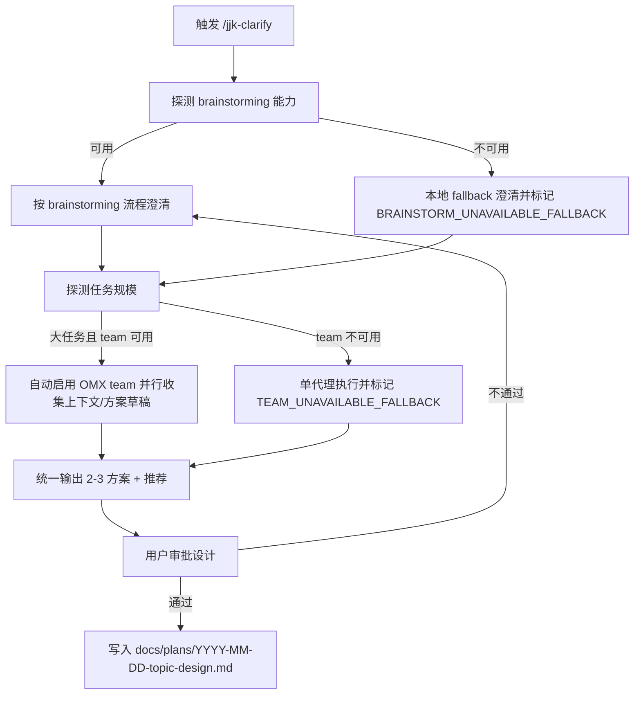

# 用户资产 + Superpowers + OMX 融合参考报告（v1）

> 目的：为后续规则与命令迭代提供统一参考，降低跨 IDE 漂移和重复维护成本。  
> 适用范围：`jjk-*` 命令体系、`.cursor/rules/*`、`.cursor/commands/*` 及其同步产物（CC/Codex）。

## 1. 本轮共识（可作为固定前提）

1. `jjk-clarify` 是澄清入口，不再维护独立 `/jjk-team-clarify`。
2. `jjk-clarify` 与 `brainstorming` 的关系是**复用与编排**，不是复制。
3. 统一产物路径与命名：`docs/plans/YYYY-MM-DD-<topic>-design.md`。
4. 设计未审批前，不进入实现阶段（硬门禁）。
5. 跨 IDE 必须可降级：某环境无 Superpowers 或 OMX 时，要显式 fallback，而非静默失败。

### 1.1 融合执行节奏（固定协议，新增）

后续每次优化 `jjk-*` 命令，统一按以下顺序执行，避免“直接改文件、缺少能力对照”：

1. **能力对照**：先对照“用户资产命令 vs Superpowers skills vs OMX 能力”。
2. **关系判定**：明确三类关系并输出清单：`冲突` / `重叠` / `互补`。
3. **最小改造方案**：只改命令契约与衔接点，不复制上游 skill 正文。
4. **落地改造**：修改命令 + 模板（全局/项目覆盖）+ 同步脚本（如需）。
5. **同步与回证**：执行 `scripts/sync_rules_to_cc.py --only commands` 并给出关键 diff 证据。

---

## 2. 三者定位（职责边界）

- 用户资产（`jjk-*` 规则/命令）: 你的业务约束、团队偏好、输出标准，属于“策略与契约层”。
- Superpowers（如 `brainstorming`）: 通用方法论与流程门禁，属于“方法层”。
- OMX（如 `team`/状态协作能力）: 并行执行与协同机制，属于“执行层”。

一句话：**用户资产定规则，Superpowers 定方法，OMX 定执行规模**。

---

## 2.1 你的命令与两个插件的关系模型（新增）

为避免“命令像插件别名”或“插件反客为主”，建议固定三层关系：

1. **主控层（`jjk-*` 命令）**：定义入口、产物、门禁、跨 IDE 调用与降级策略。
2. **方法层（Superpowers）**：提供阶段方法论（如澄清、写计划、调试、TDD），不直接替代主控层。
3. **执行层（OMX）**：提供并行与协作执行能力（team/状态流），按任务规模条件触发。

关系类型统一为四类：

1. **强依赖**：能力可用时必须调用（例如澄清阶段的 `brainstorming`）。
2. **条件依赖**：满足阈值才启用（例如大任务自动 `team`）。
3. **契约衔接**：通过机读字段/固定产物衔接（例如 `planning_contract` -> `vk_cards.json`）。
4. **可观测降级**：能力不可用时保留 fallback 并输出明确标记。

---

## 2.2 关键命令关系矩阵（当前态）

| 命令 | 与 Superpowers 的关系 | 与 OMX 的关系 | 当前状态 | 主要风险 | 融合建议 |
|---|---|---|---|---|---|
| `jjk-clarify` | 对 `brainstorming` 为强依赖（可用时必须遵循） | 对 `team` 为条件依赖（大任务自动升级） | 已完成第一阶段融合 | 上游 skill 更新后本地契约可能滞后 | 保持“最小契约 + 不复制正文” |
| `jjk-plan` | 与 `brainstorming`/`writing-plans` 为互补衔接；已增加 design 审批门禁与产物桥接 | 大任务自动启用 Team；`jjk-team-plan` 已退出主入口 | 融合完成（V1） | 上游 skill 升级时，审批记录格式可能漂移 | 固化审批记录字段与模板版本号，定期体检 |
| `jjk-pc` | 对 `systematic-debugging` 为强依赖（可用时必须遵循） | 对 `team` 为条件依赖（大范围问题自动升级） | 融合完成（V1） | 诊断产物若不含可执行修复路径，实施阶段会返工 | 固化 `fix_plan_<topic>.md` 模板与 2-3 方案强制对比 |
| `jjk-debug` | 与 `systematic-debugging`/`test-driven-development`/`verification-before-completion` 分段互补 | 对 `team` 为条件依赖（复杂故障自动升级） | 融合完成（V1） | 修复与计划偏离时可能引入结构性返工 | 固化根因证据链 + 最小修复 + 验证证据三件套 |
| `jjk-vkplan` | 基本不依赖 Superpowers，主要消费 `jjk-plan` 契约 | 与 OMX 自动执行链路强相关（落卡/状态真理源） | 半融合（执行侧强） | 若上游契约缺失，容易“可拆解但不可执行” | 继续强化契约硬拦截与双向覆盖校验 |
| `jjk-feature` | 与 `brainstorming`/`writing-plans`/`test-driven-development`/`verification-before-completion` 分段互补 | 对 `team` 为条件依赖（大任务自动升级） | 融合完成（V1） | 若阶段产物失配，可能出现链路中断 | 固化“按阶段编排 + readiness 前置 + 交付摘要” |
| `jjk-imp` / `jjk-imp-ws` | 与 `test-driven-development`、`verification-before-completion` 互补衔接 | 对 `team` 为条件依赖（大任务自动升级） | 融合完成（V1） | 输入计划粗粒度时仍可能返工 | 强制 `task_id` 粒度执行与 `implementation_ready` 前置校验 |
| `jjk-test` / `jjk-verify` / `jjk-review` | 方法可与 Superpowers 校验类技能互补，但非强依赖 | 可接 OMX 状态回填但非入口依赖 | 稳定 | 报告结构统一但与上游 feature 粒度可能脱节 | 统一引用 `feature_id` 作为验证追溯锚点 |

---

## 2.3 关系结论（对后续命令改造的约束）

1. **`jjk-*` 永远是编排入口**：插件负责能力，不负责夺权。
2. **Superpowers 主要负责“阶段方法”**：重点放在 `clarify` 与 `plan` 的上游门禁和任务粒度化。
3. **OMX 主要负责“规模升级”**：大任务自动 team，小任务保持单代理低开销路径。
4. **每个命令都要有“能力缺失可运行”的降级路径**：但必须可观测（显式 fallback 标记）。

---

## 3. 融合方案对比（用于后续规则设计选型）

| 方案 | 优点 | 缺点 | 成本 | 推荐度 |
|---|---|---|---|---|
| A. 用户资产主导，按需调用 Superpowers/OMX | 贴合现有 `jjk-*` 习惯；跨 IDE 可控；迁移平滑 | 需要维护能力探测与 fallback 规则 | 中 | ⭐⭐⭐⭐⭐ |
| B. Superpowers 主导，用户资产只做补充 | 流程规范统一，方法论强 | 容易“反客为主”，用户资产被稀释；跨 IDE 兼容性较弱 | 中高 | ⭐⭐⭐ |
| C. OMX 主导，所有命令统一 team 化 | 并行效率高，适合大任务 | 日常小任务过重；无 OMX 环境体验差 | 高 | ⭐⭐ |

**推荐：方案 A（用户资产主导）**  
原因：最符合你“多 IDE 公用 + 资产沉淀优先 + 工具可替换”的目标。

---

## 4. 冲突与重叠清单（已识别）

### 4.1 已识别冲突

1. **提问粒度冲突**  
   - `brainstorming` 默认“一次一个问题”。  
   - 你的诉求是提效。  
   - 统一策略：采用“单主题问题包”（单主题 + 最多 3 子项），既保留结构化澄清，也提升效率。

2. **入口冲突**  
   - 过去有 `/jjk-team-clarify` 独立入口。  
   - 统一策略：删除独立入口，在 `/jjk-clarify` 内做“大任务自动 team 升级”。

3. **产物命名冲突**  
   - 既有 `_context.md` / `*-clarify.md` 与 `brainstorming` 的 `*-design.md` 不一致。  
   - 统一策略：只保留 `docs/plans/...-design.md` 作为主产物。

### 4.2 已识别重叠

1. 澄清目标/边界/成功标准（两者都强调）。  
2. 多方案对比与推荐（两者都需要）。  
3. 先澄清后实现的阶段门禁（两者一致）。

### 4.3 合并原则

1. **单一真理源**：流程细节以 `brainstorming` 为准；`jjk-clarify` 只写“调用契约 + 本地增强 + fallback”。
2. **最小补丁原则**：不在 `jjk-clarify` 复制整段 `brainstorming` 正文，避免双份漂移。
3. **可观测降级**：能力缺失时必须打印 `BRAINSTORM_UNAVAILABLE_FALLBACK` / `TEAM_UNAVAILABLE_FALLBACK`。

---

## 5. 推荐执行流（命令级）

---

## 6. 命令模板（可复用到其它 `jjk-*`）

> 用法：后续新增命令时，按下面 6 段式骨架编写，减少命令风格漂移。

1. **定位段**：本命令负责什么，不负责什么（避免和上游 skill 重叠）。
2. **能力段**：依赖哪些外部能力（Superpowers/OMX），可用时必须调用。
3. **降级段**：不可用时的 fallback 路径 + 明确标记。
4. **门禁段**：哪些条件不满足时禁止进入下一阶段。
5. **产物段**：固定输出路径、命名、最小结构。
6. **跨 IDE 段**：Cursor / CC / Codex 的触发方式与差异说明。

---

## 7. 规则层建议（用于后续迭代，不是立即改动）

1. 在 `core.mdc` 保持“原则级约束”，不要塞入命令实现细节。
2. 在命令文件维护“可执行契约”，不要复制上游 skill 内容。
3. 在同步脚本维护“跨 IDE 编译规则”（如某命令不再生成 team bridge）。
4. 做一份“命令-能力映射表”（命令依赖哪些 skill/OMX 能力、缺失时如何降级）。
5. 模板资产采用“全局共享 + 项目覆盖”双层结构：共享模板放在工程化目录（如 `~/.codex/engineering/templates/`），项目覆盖统一放在 `docs/内部参考/迭代需求/_templates/`（仅保留差异字段）。

---

## 8. 风险与防漂移机制

### 8.1 主要风险

1. 上游 `brainstorming` 更新后，本地命令仍沿用旧约束。
2. 多 IDE 触发语法差异导致“命令存在但不可触发”。
3. 命令不断叠加后，出现“规则污染”（过长、重复、相互矛盾）。

### 8.2 防漂移建议

1. 每周一次“命令体检”：抽查 3 个高频命令的入口、fallback、产物路径是否一致。
2. 每次改动命令时，附带一段“对齐声明”：对齐了哪个上游 skill、删了哪些重复描述。
3. 统一保留“最小契约文档”，不要在多个文件复制流程正文。

---

## 9. 可直接复用的评审清单

在新增/修改任何 `jjk-*` 命令时，至少过以下 8 项：

1. 是否声明“本命令职责边界”？
2. 是否声明“可用时必须调用的上游 skill”？
3. 是否有显式 fallback 标记？
4. 是否定义了阶段门禁（何时禁止进入实现）？
5. 是否定义了唯一产物路径与命名？
6. 是否给出 2-3 方案并明确推荐（如果属于澄清/设计类命令）？
7. 是否写明 Cursor/CC/Codex 的调用差异？
8. 是否避免复制上游 skill 正文（避免双份维护）？

---

## 10. 结论

当前最稳妥的整合方向是：**`jjk-*` 做总线，Superpowers 做方法引擎，OMX 做规模化执行引擎**。  
这套模型能兼顾你“统一规则资产”与“多 IDE 异构能力”的现实约束，且便于持续迭代。

---

## 11. `jjk-plan` 融合补全（2026-02-28）

本轮已补齐两项关键缺口：

1. 增加“设计审批门禁”：
   - 未检测到审批记录时输出 `DESIGN_APPROVAL_REQUIRED` 并回退 `/jjk-clarify`。
   - fallback 场景需显式确认并标记 `DESIGN_APPROVAL_FALLBACK_ACK`。
2. 统一 Team 入口：
   - `jjk-plan` 内置大任务自动 Team 升级；
   - 同步脚本排除 `jjk-plan` 的 team bridge 自动生成，避免 `/jjk-team-plan` 与主入口并行漂移。

---

## 12. `jjk-pc` 融合补全（2026-02-28）

本轮补齐诊断链路与插件互补，目标是“诊断方法交给 Superpowers，规模化执行交给 OMX，命令契约仍归 `jjk-*`”。

### 12.1 已完成改造

1. `jjk-pc` 升级为互补编排入口：
   - 强依赖 `systematic-debugging`（可用时必须调用）；
   - 不可用时输出 `SYSTEMATIC_DEBUGGING_UNAVAILABLE_FALLBACK`。
2. 内置“大任务自动 Team 升级”：
   - 大范围跨模块/跨环境问题自动走 Team；
   - Team 不可用时输出 `TEAM_UNAVAILABLE_FALLBACK`。
3. 固化诊断产物契约：
   - 统一输出 `docs/内部参考/迭代需求/fix_plan_<topic>.md`；
   - 强制包含 2-3 修复方案对比 + 推荐方案。
4. 模板体系打通：
   - 全局模板：`/Users/jijingkun/.codex/engineering/templates/jjk_pc_templates.md`
   - 项目覆盖：`docs/内部参考/迭代需求/_templates/jjk_pc_templates.md`
5. 统一 Team 入口策略：
   - 同步脚本排除 `jjk-pc` 的 team bridge 自动生成；
   - 避免 `/jjk-team-pc` 与主入口并行漂移。

### 12.2 结果

`jjk-pc` 现在与 `jjk-clarify`、`jjk-plan` 达成同一融合模式：

1. 主入口单一：`jjk-*` 命令编排；
2. 方法层复用：Superpowers skill；
3. 执行层升级：OMX team 条件触发；
4. 能力缺失可观测：fallback 标记强制输出；
5. 产物可机读：模板优先级与路径统一。

---

## 13. `jjk-plan` 深度补强（WHAT + 工单级 HOW，2026-02-28）

针对“已有需求与方案，但落地前仍提示拆解不够细”的问题，本轮将 `jjk-plan` 的完成定义从“有文档”升级为“可执行”：

1. 保持单命令入口，不拆分新命令：
   - 继续使用 `/jjk-plan`；
   - 不新增 `/jjk-plan-how` 等分叉命令，避免复杂化。
2. 强制双层产物：
   - WHAT：`<topic>_requirements.md`
   - HOW：`<topic>_implementation_plan.md`（必须为工单级）
3. 新增工单级 HOW 最低标准：
   - 每个 `feature_id` 至少绑定 1 条 `task_id`；
   - 每条任务必须含 `phase/file_paths/symbols/change_type/acceptance_cmds/rollback_point`。
4. 新增不可执行标记：
   - 若只到架构叙述、未到任务级拆解，必须输出 `HOW_NOT_ACTIONABLE`；
   - 不得宣称“可直接实施”。
5. 新增机读 readiness 结论：
   - `implementation_ready: true|false`
   - `blocked_by: []`
   - `next_step: /jjk-imp | /jjk-vkplan | /jjk-plan`

配套模板：

1. 全局：`/Users/jijingkun/.codex/engineering/templates/jjk_plan_templates.md`  
   （新增 `implementation_tasks` 与 `implementation_readiness` 模板）
2. 项目覆盖：`docs/内部参考/迭代需求/_templates/jjk_plan_templates.md`  
   （新增对应差异字段占位）

---

## 14. `jjk-imp` 融合补全（2026-02-28）

本轮把实现阶段统一为“按计划执行”，避免 `/jjk-imp` 退化为自由编码入口。

### 14.1 已完成改造

1. `/jjk-imp` 重构为实现编排入口：
   - 强调只消费计划产物，不改需求语义；
   - 明确跨 IDE 触发方式与模板优先级。
2. 与 Superpowers 的互补边界明确：
   - 可用时优先走 `test-driven-development` 与 `verification-before-completion`；
   - 不可用时输出 `TDD_UNAVAILABLE_FALLBACK` / `VERIFY_BEFORE_COMPLETION_UNAVAILABLE_FALLBACK`。
3. 输入可执行性硬约束：
   - 若 `implementation_ready=false`，输出 `IMPLEMENTATION_NOT_READY` 并回退 `/jjk-plan`；
   - 若缺少工单级字段（`task_id/file_paths/symbols/acceptance_cmds`），输出 `IMP_INPUT_TOO_COARSE`。
4. 大任务自动 Team 升级：
   - 在 `/jjk-imp` 内按规模自动启用 Team；
   - 无 Team 能力时标记 `TEAM_UNAVAILABLE_FALLBACK`。
5. 模板体系补齐：
   - 全局模板：`/Users/jijingkun/.codex/engineering/templates/jjk_imp_templates.md`
   - 项目覆盖：`docs/内部参考/迭代需求/_templates/jjk_imp_templates.md`

### 14.2 结果

`jjk-imp` 与前序命令形成闭环：

1. `/jjk-clarify` 给出澄清与设计；
2. `/jjk-plan` 给出 WHAT + 工单级 HOW；
3. `/jjk-imp` 严格按任务级 HOW 落地，并给出命令证据；
4. `/jjk-verify` 做统一验收。

---

## 15. `jjk-feature` 融合补全（2026-02-28）

本轮把 `jjk-feature` 从“全流程口号命令”升级为“阶段编排总线”，确保不会绕过 `clarify/plan/imp/verify` 的强约束。

### 15.1 已完成改造

1. 明确分工边界：
   - `brainstorming` 负责澄清与设计审批；
   - `writing-plans` 负责细粒度规划方法；
   - `test-driven-development` 与 `verification-before-completion` 负责实现与收口质量；
   - `/jjk-feature` 只负责编排与门禁，不复制技能正文。
2. 固化阶段顺序：
   - `clarify -> plan -> imp -> review(条件触发) -> verify`。
3. 新增关键门禁：
   - 缺少审批设计输出 `FEATURE_NEEDS_CLARIFY`；
   - `implementation_ready=false` 输出 `FEATURE_NEEDS_PLAN_REFINEMENT`；
   - 计划-实现偏移输出 `FEATURE_PLAN_DRIFT_DETECTED`。
4. 内置大任务 Team 自动升级：
   - team 可用并命中阈值时并行编排；
   - 不可用时输出 `TEAM_UNAVAILABLE_FALLBACK`。
5. 交付产物统一：
   - 新增 `docs/内部参考/迭代需求/<topic>_feature_delivery.md`，记录阶段轨迹、产物路径、验证证据、阻塞与下一步。
6. 模板体系补齐：
   - 全局模板：`/Users/jijingkun/.codex/engineering/templates/jjk_feature_templates.md`
   - 项目覆盖：`docs/内部参考/迭代需求/_templates/jjk_feature_templates.md`

### 15.2 结果

`jjk-feature` 现在是“串联命令”，不再是“绕过命令”：

1. 入口仍是单命令体验；
2. 实际执行遵循分阶段强契约；
3. 上游产物与下游实现保持可追溯；
4. 多 IDE 场景仍可降级并可观测。

---

## 16. 命令-能力映射表（2026-02-28）

| 命令 | Superpowers 依赖 | OMX 依赖策略 | 能力缺失标记 | 标准产物 | 当前状态 |
|---|---|---|---|---|---|
| `jjk-clarify` | `brainstorming`（可用时强依赖） | 大任务自动 Team | `BRAINSTORM_UNAVAILABLE_FALLBACK`、`TEAM_UNAVAILABLE_FALLBACK` | `docs/plans/YYYY-MM-DD-<topic>-design.md` | 已落地 |
| `jjk-plan` | `writing-plans`（拆解方法层） | 大任务自动 Team | `DESIGN_APPROVAL_REQUIRED`、`DESIGN_APPROVAL_FALLBACK_ACK`、`TEAM_UNAVAILABLE_FALLBACK` | `<topic>_requirements.md` + `<topic>_implementation_plan.md` | 已落地 |
| `jjk-imp` | `test-driven-development`、`verification-before-completion` | 大任务自动 Team | `TDD_UNAVAILABLE_FALLBACK`、`VERIFY_BEFORE_COMPLETION_UNAVAILABLE_FALLBACK`、`TEAM_UNAVAILABLE_FALLBACK` | 实施证据 + 验收命令结果 | 已落地 |
| `jjk-debug` | `systematic-debugging`、`test-driven-development`、`verification-before-completion` | 大任务自动 Team | `SYSTEMATIC_DEBUGGING_UNAVAILABLE_FALLBACK`、`TDD_UNAVAILABLE_FALLBACK`、`VERIFY_BEFORE_COMPLETION_UNAVAILABLE_FALLBACK`、`TEAM_UNAVAILABLE_FALLBACK` | `debug_report_<topic>.md` + 验证命令证据 | 已落地 |
| `jjk-pc` | `systematic-debugging`（诊断方法层） | 大任务自动 Team | `SYSTEMATIC_DEBUGGING_UNAVAILABLE_FALLBACK`、`TEAM_UNAVAILABLE_FALLBACK` | `docs/内部参考/迭代需求/fix_plan_<topic>.md` | 已落地 |
| `jjk-vkplan` | 无强依赖（消费主计划契约） | 与 OMX 落卡链路强耦合 | `FAIL_FAST`（缺字段/缺 gate 契约即阻断） | `parallel_plan.md` + `workstreams/WS-*.md` + `vk_cards.json` | 已落地 |

---

## 17. 每周命令体检记录（2026-02-28）

本周按“入口一致性 + fallback 可观测 + 产物路径确定”抽查 3 个高频命令：

| 抽检命令 | 入口与职责 | fallback 标记 | 产物路径 | 结论 |
|---|---|---|---|---|
| `jjk-clarify` | 澄清主入口，复用 `brainstorming`，不复制正文 | `BRAINSTORM_UNAVAILABLE_FALLBACK`、`TEAM_UNAVAILABLE_FALLBACK` 明确 | `docs/plans/YYYY-MM-DD-<topic>-design.md` | PASS |
| `jjk-plan` | 计划主入口，含设计审批门禁与 Team 升级 | `DESIGN_APPROVAL_REQUIRED`、`DESIGN_APPROVAL_FALLBACK_ACK`、`TEAM_UNAVAILABLE_FALLBACK` 明确 | requirements + implementation_plan + readiness 字段 | PASS |
| `jjk-imp` | 实现主入口，强制消费可执行 HOW | `IMPLEMENTATION_NOT_READY`、`IMP_INPUT_TOO_COARSE`、`TDD_UNAVAILABLE_FALLBACK`、`VERIFY_BEFORE_COMPLETION_UNAVAILABLE_FALLBACK` 明确 | 代码改动 + 命令证据 | PASS |

抽检结论：本周 3/3 通过，未发现“入口分叉”或“fallback 不可观测”问题；下周延续同样口径并轮换抽检 `jjk-vkplan`、`jjk-vktodo`、`jjk-verify`。

---

## 18. `jjk-debug` 融合补全（2026-02-28）

本轮把 `jjk-debug` 从“通用排查说明”升级为“可执行修复编排入口”，并与 `jjk-pc` 明确分工：

1. `/jjk-pc` 仅诊断，不改码；
2. `/jjk-debug` 可改码修复，但必须先根因调查再实施。

### 18.1 已完成改造

1. 分工边界明确：
   - 与 `systematic-debugging` 对齐根因调查；
   - 与 `test-driven-development` 对齐回归测试先行；
   - 与 `verification-before-completion` 对齐证据收口。
2. 阶段顺序固定：
   - 上下文探索 -> 根因调查 -> 回归测试先行 -> 最小修复 -> 验证证据 -> 文档回填。
3. 新增关键标记：
   - `SYSTEMATIC_DEBUGGING_UNAVAILABLE_FALLBACK`
   - `TDD_UNAVAILABLE_FALLBACK`
   - `VERIFY_BEFORE_COMPLETION_UNAVAILABLE_FALLBACK`
   - `REPRO_NOT_STABLE`
   - `DEBUG_ARCH_RISK_DETECTED`
4. 内置大任务 Team 自动升级：
   - 命中复杂故障阈值时自动 Team 并行；
   - 无 Team 能力时输出 `TEAM_UNAVAILABLE_FALLBACK`。
5. 交付产物统一：
   - `docs/内部参考/迭代需求/debug_report_<topic>.md`。
6. 模板体系补齐：
   - 全局模板：`/Users/jijingkun/.codex/engineering/templates/jjk_debug_templates.md`
   - 项目覆盖：`docs/内部参考/迭代需求/_templates/jjk_debug_templates.md`

### 18.2 结果

`jjk-debug` 现在与 `jjk-pc`、`jjk-imp` 的关系清晰：

1. `jjk-pc`：诊断计划；
2. `jjk-debug`：问题修复；
3. `jjk-imp`：按计划实施。
