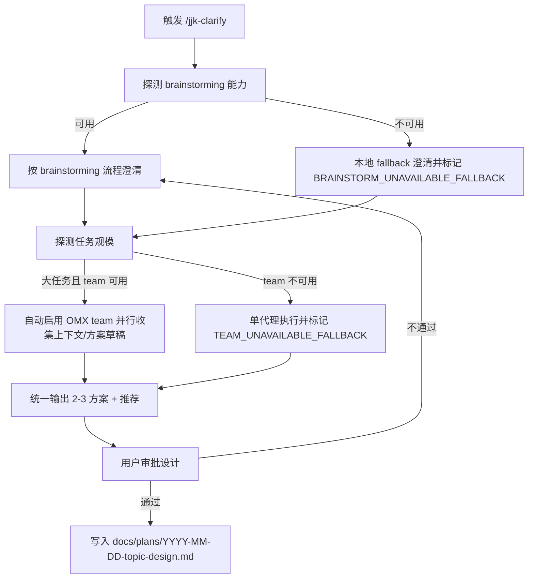

# 用户资产 + Superpowers + OMX 融合参考报告（v1）

> 目的：为后续规则与命令迭代提供统一参考，降低跨 IDE 漂移和重复维护成本。  
> 适用范围：`jjk-*` 命令体系、`.cursor/rules/*`、`.cursor/commands/*` 及其同步产物（CC/Codex）。

## 1. 本轮共识（可作为固定前提）

1. `jjk-clarify` 是澄清入口，不再维护独立 `/jjk-team-clarify`。
2. `jjk-clarify` 与 `brainstorming` 的关系是**复用与编排**，不是复制。
3. 统一产物路径与命名：`docs/plans/YYYY-MM-DD-<topic>-design.md`。
4. 设计未审批前，不进入实现阶段（硬门禁）。
5. 跨 IDE 必须可降级：某环境无 Superpowers 或 OMX 时，要显式 fallback，而非静默失败。

---

## 2. 三者定位（职责边界）

- 用户资产（`jjk-*` 规则/命令）: 你的业务约束、团队偏好、输出标准，属于“策略与契约层”。
- Superpowers（如 `brainstorming`）: 通用方法论与流程门禁，属于“方法层”。
- OMX（如 `team`/状态协作能力）: 并行执行与协同机制，属于“执行层”。

一句话：**用户资产定规则，Superpowers 定方法，OMX 定执行规模**。

---

## 2.1 你的命令与两个插件的关系模型（新增）

为避免“命令像插件别名”或“插件反客为主”，建议固定三层关系：

1. **主控层（`jjk-*` 命令）**：定义入口、产物、门禁、跨 IDE 调用与降级策略。
2. **方法层（Superpowers）**：提供阶段方法论（如澄清、写计划、调试、TDD），不直接替代主控层。
3. **执行层（OMX）**：提供并行与协作执行能力（team/状态流），按任务规模条件触发。

关系类型统一为四类：

1. **强依赖**：能力可用时必须调用（例如澄清阶段的 `brainstorming`）。
2. **条件依赖**：满足阈值才启用（例如大任务自动 `team`）。
3. **契约衔接**：通过机读字段/固定产物衔接（例如 `planning_contract` -> `vk_cards.json`）。
4. **可观测降级**：能力不可用时保留 fallback 并输出明确标记。

---

## 2.2 关键命令关系矩阵（当前态）

| 命令 | 与 Superpowers 的关系 | 与 OMX 的关系 | 当前状态 | 主要风险 | 融合建议 |
|---|---|---|---|---|---|
| `jjk-clarify` | 对 `brainstorming` 为强依赖（可用时必须遵循） | 对 `team` 为条件依赖（大任务自动升级） | 已完成第一阶段融合 | 上游 skill 更新后本地契约可能滞后 | 保持“最小契约 + 不复制正文” |
| `jjk-plan` | 目前未显式绑定 `writing-plans`；与上游 design 审批门禁耦合偏弱 | 主要通过独立 `jjk-team-plan` 间接接入 | 半融合（偏本地化） | 入口分叉（普通 vs team）、与上游流程边界不清 | 把 team 升级逻辑内收进 `jjk-plan`，并补能力探测与 fallback |
| `jjk-vkplan` | 基本不依赖 Superpowers，主要消费 `jjk-plan` 契约 | 与 OMX 自动执行链路强相关（落卡/状态真理源） | 半融合（执行侧强） | 若上游契约缺失，容易“可拆解但不可执行” | 继续强化契约硬拦截与双向覆盖校验 |
| `jjk-feature` | 组合命令，隐式覆盖 plan/imp/review/verify 阶段 | 未内建 team 条件升级 | 偏本地工作流 | 可能绕过澄清门禁，直接进入实现链 | 增加“无 design 审批则回退 clarify”的前置门禁 |
| `jjk-imp` / `jjk-imp-ws` | 依赖上游计划文档；与 Superpowers 仅弱关联 | `imp-ws` 与并行拆解生态存在间接关联 | 稳定 | 计划质量不足时实现阶段补洞成本高 | 强制消费 `feature_id/card_id` 映射，减少语义漂移 |
| `jjk-test` / `jjk-verify` / `jjk-review` | 方法可与 Superpowers 校验类技能互补，但非强依赖 | 可接 OMX 状态回填但非入口依赖 | 稳定 | 报告结构统一但与上游 feature 粒度可能脱节 | 统一引用 `feature_id` 作为验证追溯锚点 |

---

## 2.3 关系结论（对后续命令改造的约束）

1. **`jjk-*` 永远是编排入口**：插件负责能力，不负责夺权。
2. **Superpowers 主要负责“阶段方法”**：重点放在 `clarify` 与 `plan` 的上游门禁和任务粒度化。
3. **OMX 主要负责“规模升级”**：大任务自动 team，小任务保持单代理低开销路径。
4. **每个命令都要有“能力缺失可运行”的降级路径**：但必须可观测（显式 fallback 标记）。

---

## 3. 融合方案对比（用于后续规则设计选型）

| 方案 | 优点 | 缺点 | 成本 | 推荐度 |
|---|---|---|---|---|
| A. 用户资产主导，按需调用 Superpowers/OMX | 贴合现有 `jjk-*` 习惯；跨 IDE 可控；迁移平滑 | 需要维护能力探测与 fallback 规则 | 中 | ⭐⭐⭐⭐⭐ |
| B. Superpowers 主导，用户资产只做补充 | 流程规范统一，方法论强 | 容易“反客为主”，用户资产被稀释；跨 IDE 兼容性较弱 | 中高 | ⭐⭐⭐ |
| C. OMX 主导，所有命令统一 team 化 | 并行效率高，适合大任务 | 日常小任务过重；无 OMX 环境体验差 | 高 | ⭐⭐ |

**推荐：方案 A（用户资产主导）**  
原因：最符合你“多 IDE 公用 + 资产沉淀优先 + 工具可替换”的目标。

---

## 4. 冲突与重叠清单（已识别）

### 4.1 已识别冲突

1. **提问粒度冲突**  
   - `brainstorming` 默认“一次一个问题”。  
   - 你的诉求是提效。  
   - 统一策略：采用“单主题问题包”（单主题 + 最多 3 子项），既保留结构化澄清，也提升效率。

2. **入口冲突**  
   - 过去有 `/jjk-team-clarify` 独立入口。  
   - 统一策略：删除独立入口，在 `/jjk-clarify` 内做“大任务自动 team 升级”。

3. **产物命名冲突**  
   - 既有 `_context.md` / `*-clarify.md` 与 `brainstorming` 的 `*-design.md` 不一致。  
   - 统一策略：只保留 `docs/plans/...-design.md` 作为主产物。

### 4.2 已识别重叠

1. 澄清目标/边界/成功标准（两者都强调）。  
2. 多方案对比与推荐（两者都需要）。  
3. 先澄清后实现的阶段门禁（两者一致）。

### 4.3 合并原则

1. **单一真理源**：流程细节以 `brainstorming` 为准；`jjk-clarify` 只写“调用契约 + 本地增强 + fallback”。
2. **最小补丁原则**：不在 `jjk-clarify` 复制整段 `brainstorming` 正文，避免双份漂移。
3. **可观测降级**：能力缺失时必须打印 `BRAINSTORM_UNAVAILABLE_FALLBACK` / `TEAM_UNAVAILABLE_FALLBACK`。

---

## 5. 推荐执行流（命令级）

---

## 6. 命令模板（可复用到其它 `jjk-*`）

> 用法：后续新增命令时，按下面 6 段式骨架编写，减少命令风格漂移。

1. **定位段**：本命令负责什么，不负责什么（避免和上游 skill 重叠）。
2. **能力段**：依赖哪些外部能力（Superpowers/OMX），可用时必须调用。
3. **降级段**：不可用时的 fallback 路径 + 明确标记。
4. **门禁段**：哪些条件不满足时禁止进入下一阶段。
5. **产物段**：固定输出路径、命名、最小结构。
6. **跨 IDE 段**：Cursor / CC / Codex 的触发方式与差异说明。

---

## 7. 规则层建议（用于后续迭代，不是立即改动）

1. 在 `core.mdc` 保持“原则级约束”，不要塞入命令实现细节。
2. 在命令文件维护“可执行契约”，不要复制上游 skill 内容。
3. 在同步脚本维护“跨 IDE 编译规则”（如某命令不再生成 team bridge）。
4. 做一份“命令-能力映射表”（命令依赖哪些 skill/OMX 能力、缺失时如何降级）。

---

## 8. 风险与防漂移机制

### 8.1 主要风险

1. 上游 `brainstorming` 更新后，本地命令仍沿用旧约束。
2. 多 IDE 触发语法差异导致“命令存在但不可触发”。
3. 命令不断叠加后，出现“规则污染”（过长、重复、相互矛盾）。

### 8.2 防漂移建议

1. 每周一次“命令体检”：抽查 3 个高频命令的入口、fallback、产物路径是否一致。
2. 每次改动命令时，附带一段“对齐声明”：对齐了哪个上游 skill、删了哪些重复描述。
3. 统一保留“最小契约文档”，不要在多个文件复制流程正文。

---

## 9. 可直接复用的评审清单

在新增/修改任何 `jjk-*` 命令时，至少过以下 8 项：

1. 是否声明“本命令职责边界”？
2. 是否声明“可用时必须调用的上游 skill”？
3. 是否有显式 fallback 标记？
4. 是否定义了阶段门禁（何时禁止进入实现）？
5. 是否定义了唯一产物路径与命名？
6. 是否给出 2-3 方案并明确推荐（如果属于澄清/设计类命令）？
7. 是否写明 Cursor/CC/Codex 的调用差异？
8. 是否避免复制上游 skill 正文（避免双份维护）？

---

## 10. 结论

当前最稳妥的整合方向是：**`jjk-*` 做总线，Superpowers 做方法引擎，OMX 做规模化执行引擎**。  
这套模型能兼顾你“统一规则资产”与“多 IDE 异构能力”的现实约束，且便于持续迭代。
