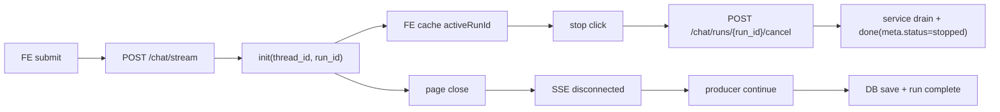

# 实施方案（聊天断页续跑与强停止）

> 对齐来源（Superpowers Bridge）
> - Design 输入：`/Users/jijingkun/bojxAI/fastapi/docs/plans/2026-03-01-chat-session-continuation-design.md`
> - 审批状态：`design_approved: true`（2026-03-01 17:04）
> - 本文为项目主产物（下游仅消费本文件，不直接消费 design 原文）

---

## 0. 输入来源清单（强制桥接）

1. 设计主文档：`docs/plans/2026-03-01-chat-session-continuation-design.md`
2. 现有聊天链路代码锚点：
   - `app/services/chat_service.py`
   - `app/api/v1/endpoints/chat_api.py`
   - `web/src/hooks/useSSEStream.ts`
   - `web/src/lib/backend.ts`
   - `web/src/components/auth/LoginCard.tsx`
3. 配置基线：`ENABLE_RUN_CONTROL` / `ENABLE_SSE_STOPPED_EVENT`

若上述输入缺失，本计划应标记 `SUPERPOWERS_ARTIFACT_UNALIGNED` 并阻断实施。

---

## 1. 目标与范围

### 1.1 目标

1. 页面断连不等于取消：后端可继续执行并最终落库。
2. 停止按钮升级为强停止：点击即取消服务端 run。
3. 登录后自动回到最近会话，提高续接效率。

### 1.2 范围

1. 后端：`/chat/stream` 生命周期与 run 取消语义。
2. 前端：`init` 事件 run_id 消费、停止动作、最近会话自动定位。
3. 测试与文档：新增/更新单测、E2E 与索引。

### 1.3 非范围

1. 不做事件重放（重新连接继续实时 token）。
2. 不调整 AI 业务策略与数据库表结构。

---

## 2. 架构影响与约束（必查）

### 2.1 模块边界

1. 取消语义归属：`run_control + chat_api + chat_service`，前端仅负责触发，不承担状态裁决。
2. 最近会话归属：`chat_repo/chat_api` 提供查询，前端仅消费。
3. 禁止把“连接断开即取消”硬编码到多处节点，避免跨层重复策略。

### 2.2 状态契约

1. 关键字段：`thread_id`、`run_id`、`status`。
2. `run_id` 来源：后端 `init` 事件；前端需缓存当前活跃 run。
3. 生命周期：`running -> stopping/stopped | completed | failed`。

### 2.3 路由闭环

1. 停止按钮只走取消 API，不再仅依赖本地 abort 语义。
2. 页面关闭不走取消 API，由后端自行收口。
3. `resume` 流程继续复用既有 run 语义，不新增旁路。

### 2.4 端到端链路



### 2.5 可测试性

1. 断连继续、强停止、最近会话回显分别有独立测试入口。
2. 每个 `feature_id` 均绑定任务、命令和回滚锚点。

---

## 3. 功能机制包（Feature Packet）

| feature_id | 目标与边界 | 触发条件与状态流转 | 代码锚点 | 关键契约字段 | 回滚锚点 | 验证命令 | 来源证据 |
|---|---|---|---|---|---|---|---|
| P1-01 | 前端接收并维护 `run_id`，不改业务 payload 语义 | `init` 到达后缓存 `activeRunId`；无 run_id 时强停止降级 | `web/src/lib/backend.ts` `dispatchSSEEvent`; `web/src/hooks/useSSEStream.ts` | `run_id`, `thread_id` | 回退 `init` 扩展处理，恢复仅 thread_id | `cd web && pnpm exec eslint src/lib/backend.ts src/hooks/useSSEStream.ts` | design §4.5 |
| P1-02 | 停止按钮实现强停止（取消 run + 本地收口） | 点击停止 -> cancel API -> 成功/失败分支 -> UI 收口 | `web/src/hooks/useSSEStream.ts` `stop`; `web/src/lib/backend.ts` 新增 `cancelRun` | `run_id`, `reason`, `cancel_mode` | 回退到“仅本地 abort”并保留告警提示 | `cd web && pnpm exec playwright test e2e/test_feedback_stop.spec.cjs --project=chromium` | design §4.5 |
| P1-03 | 后端区分 disconnect 与 cancel，保证断页续跑 | SSE 断连时停止写流，不主动 cancel；自然完成仍落库 | `app/services/chat_service.py` 流执行环；`app/api/v1/endpoints/chat_api.py` | `run_id`, `status`, `cancel_reason` | 开关回退 `ENABLE_RUN_CONTROL=false` | `venv/bin/python -m pytest tests/unit/test_chat_service_disconnect_continue.py -q` | design §4.1/4.2 |
| P1-04 | 最近会话回显链路 | 登录/进入聊天页时无 threadId -> 查询最近会话 -> 自动定位 | `app/api/v1/endpoints/chat_api.py`; `app/repositories/chat_repo.py`; `web/src/components/auth/LoginCard.tsx`; `web/src/hooks/useSSEStream.ts` | `thread_id`, `updated_at` | 回退到固定 `/chat` 与手动选择历史 | `venv/bin/python -m pytest tests/api/test_chat_api.py -k latest_thread -q` | design §4.3 |
| P1-05 | 失败降级与可观测性收口 | cancel 失败重试 1 次；失败 toast；日志可追踪 | `web/src/hooks/useSSEStream.ts`; `app/services/chat_service.py` | `trace_id`, `run_id` | 关闭重试分支，仅提示失败 | `venv/bin/python -m pytest tests/unit/test_chat_stop_cancel_semantics.py -q` | design §4.4/4.5 |

最小代码样例（约束形态）：

```python
# chat_service.py (示意)
try:
    async for event in producer_stream:
        if client_disconnected:
            continue  # 停止发送，不停止执行
        yield format_sse(event)
finally:
    finalize_run_status(run_id)
```

```ts
// useSSEStream.ts (示意)
async function strongStop() {
  if (activeRunId) {
    await cancelRunWithRetry(activeRunId);
  }
  localAbort();
}
```

---

## 4. 测试策略（推荐，TDD 前置）

```yaml
test_strategy:
  - feature_id: P1-01
    test_cases:
      - CHAT-RUN-TC-001: init 事件含 run_id 时前端缓存成功
      - CHAT-RUN-TC-001B: init 无 run_id 时进入降级路径
    test_first: true
  - feature_id: P1-02
    test_cases:
      - CHAT-RUN-TC-002: 点击停止触发取消接口并阻断后续 token
      - CHAT-RUN-TC-003: 取消失败重试 1 次并提示
    test_first: true
  - feature_id: P1-03
    test_cases:
      - CHAT-RUN-TC-004: 断连后 run 继续直至 completed/failed
    test_first: true
  - feature_id: P1-04
    test_cases:
      - CHAT-RUN-TC-005: 登录后自动打开最近会话
      - CHAT-RUN-TC-006: 无历史会话保持空白
    test_first: false
```

---

## 5. 工单级任务包（Implementation Tasks）

```yaml
implementation_tasks:
  - task_id: T-01
    feature_id: P1-01
    pr_id: PR-01
    phase: Phase-1-Contract
    file_paths:
      - web/src/types/message.ts
      - web/src/lib/backend.ts
    symbols:
      - InitEventData
      - dispatchSSEEvent
    change_type: modify
    acceptance_cmds:
      - cd web && pnpm exec eslint src/types/message.ts src/lib/backend.ts
    rollback_point: 回退 InitEventData 扩展与 run_id 解析逻辑

  - task_id: T-02
    feature_id: P1-02
    pr_id: PR-01
    phase: Phase-1-Contract
    file_paths:
      - web/src/lib/backend.ts
    symbols:
      - cancelRun
      - streamLLM
    change_type: add
    acceptance_cmds:
      - cd web && pnpm exec eslint src/lib/backend.ts
    rollback_point: 删除 cancelRun 新接口封装并恢复旧导出

  - task_id: T-03
    feature_id: P1-02
    pr_id: PR-02
    phase: Phase-2-Frontend
    file_paths:
      - web/src/hooks/useSSEStream.ts
      - web/src/components/chat/ChatInput.tsx
    symbols:
      - stop
      - submit
    change_type: modify
    acceptance_cmds:
      - cd web && pnpm exec playwright test e2e/test_feedback_stop.spec.cjs --project=chromium
    rollback_point: stop 回退为仅本地 AbortController.abort

  - task_id: T-04
    feature_id: P1-03
    pr_id: PR-02
    phase: Phase-2-Backend
    file_paths:
      - app/services/chat_service.py
    symbols:
      - ChatService.stream
      - sse_stream
    change_type: modify
    acceptance_cmds:
      - venv/bin/python -m pytest tests/unit/test_chat_service_disconnect_continue.py -q
    rollback_point: 恢复旧 streaming 生命周期并通过开关禁用断连继续

  - task_id: T-05
    feature_id: P1-04
    pr_id: PR-03
    phase: Phase-2-Backend
    file_paths:
      - app/repositories/chat_repo.py
      - app/api/v1/endpoints/chat_api.py
    symbols:
      - get_threads_by_user
      - list_threads
      - get_latest_thread_by_user
    change_type: add
    acceptance_cmds:
      - venv/bin/python -m pytest tests/api/test_chat_api.py -k latest_thread -q
    rollback_point: 删除 latest thread 查询入口并维持原有列表接口行为

  - task_id: T-06
    feature_id: P1-04
    pr_id: PR-03
    phase: Phase-3-Frontend
    file_paths:
      - web/src/components/auth/LoginCard.tsx
      - web/src/hooks/useSSEStream.ts
    symbols:
      - onLogin
      - loadThreadMessages
    change_type: modify
    acceptance_cmds:
      - cd web && pnpm exec playwright test e2e/test_reopen_latest_thread.spec.cjs --project=chromium
    rollback_point: 登录流程回退为固定 router.push('/chat')

  - task_id: T-07
    feature_id: P1-05
    pr_id: PR-03
    phase: Phase-3-Validation
    file_paths:
      - docs/SUMMARY.md
      - tests/unit/test_chat_stop_cancel_semantics.py
      - tests/unit/test_chat_service_disconnect_continue.py
    symbols:
      - strict docs index
      - cancel retry semantics
    change_type: modify
    acceptance_cmds:
      - venv/bin/python -m pytest tests/unit/test_chat_stop_cancel_semantics.py tests/unit/test_chat_service_disconnect_continue.py -q
      - python3 scripts/docs_guard.py --strict
    rollback_point: 回退新增测试与索引条目，恢复旧验证基线
```

---

## 6. PR 映射契约（Task -> PR）

```yaml
task_to_pr_mapping:
  - task_id: T-01
    pr_id: PR-01
    pr_branch: codex/chat-run-stop-pr-01
    pr_subject: "P1 合同升级：run_id 事件契约与前端解析"
    pr_depends_on: []
    acceptance_cmds:
      - cd web && pnpm exec eslint src/types/message.ts src/lib/backend.ts
    rollback_point: 回退 run_id 事件契约改动

  - task_id: T-02
    pr_id: PR-01
    pr_branch: codex/chat-run-stop-pr-01
    pr_subject: "P1 合同升级：前端 cancelRun API 封装"
    pr_depends_on: []
    acceptance_cmds:
      - cd web && pnpm exec eslint src/lib/backend.ts
    rollback_point: 删除 cancelRun API 封装

  - task_id: T-03
    pr_id: PR-02
    pr_branch: codex/chat-run-stop-pr-02
    pr_subject: "P2 前端强停止：stop 按钮改造与失败重试"
    pr_depends_on: [PR-01]
    acceptance_cmds:
      - cd web && pnpm exec playwright test e2e/test_feedback_stop.spec.cjs --project=chromium
    rollback_point: 恢复 stop 仅本地 abort

  - task_id: T-04
    pr_id: PR-02
    pr_branch: codex/chat-run-stop-pr-02
    pr_subject: "P2 后端断连语义：disconnect 与 cancel 解耦"
    pr_depends_on: [PR-01]
    acceptance_cmds:
      - venv/bin/python -m pytest tests/unit/test_chat_service_disconnect_continue.py -q
    rollback_point: 恢复旧 stream 生命周期处理

  - task_id: T-05
    pr_id: PR-03
    pr_branch: codex/chat-run-stop-pr-03
    pr_subject: "P3 最近会话：后端 latest thread 查询"
    pr_depends_on: [PR-02]
    acceptance_cmds:
      - venv/bin/python -m pytest tests/api/test_chat_api.py -k latest_thread -q
    rollback_point: 删除 latest thread 查询接口

  - task_id: T-06
    pr_id: PR-03
    pr_branch: codex/chat-run-stop-pr-03
    pr_subject: "P3 最近会话：登录自动回显与初始定位"
    pr_depends_on: [PR-02]
    acceptance_cmds:
      - cd web && pnpm exec playwright test e2e/test_reopen_latest_thread.spec.cjs --project=chromium
    rollback_point: 登录流程回退固定 /chat

  - task_id: T-07
    pr_id: PR-03
    pr_branch: codex/chat-run-stop-pr-03
    pr_subject: "P3 验收收口：测试补齐与 docs 索引同步"
    pr_depends_on: [PR-02]
    acceptance_cmds:
      - python3 scripts/docs_guard.py --strict
      - venv/bin/python -m pytest tests/unit/test_chat_stop_cancel_semantics.py tests/unit/test_chat_service_disconnect_continue.py -q
    rollback_point: 回退新增测试与索引变更
```

---

## 7. planning_contract（供下游消费）

```yaml
planning_contract:
  execution_mode: serial
  strict_single_active_card: true
  card_order: [C01, C02, C03, G01]
  auto_done_policy:
    implementation-card: hard_gate
    inspection-card: policy_gate
  gate_contract:
    mode: as_cards
    gate_ids: [G01]
    depends_on:
      G01: [C03]
  cards:
    - card_id: C01
      wave: P1
      feature_ids: [P1-01, P1-02]
      depends_on: []
      task_mode: implementation-card
      merge_required: true
      done_gate:
        - init run_id 契约打通
        - cancelRun API 封装可用
      acceptance_checks:
        - cd web && pnpm exec eslint src/types/message.ts src/lib/backend.ts
      evidence_entry: docs/内部参考/迭代需求/聊天断页续跑与强停止_implementation_plan.md

    - card_id: C02
      wave: P2
      feature_ids: [P1-02, P1-03]
      depends_on: [C01]
      task_mode: implementation-card
      merge_required: true
      done_gate:
        - 停止按钮改为强停止
        - 断连继续语义通过单测
      acceptance_checks:
        - cd web && pnpm exec playwright test e2e/test_feedback_stop.spec.cjs --project=chromium
        - venv/bin/python -m pytest tests/unit/test_chat_service_disconnect_continue.py -q
      evidence_entry: docs/内部参考/迭代需求/聊天断页续跑与强停止_implementation_plan.md

    - card_id: C03
      wave: P3
      feature_ids: [P1-04, P1-05]
      depends_on: [C02]
      task_mode: implementation-card
      merge_required: true
      done_gate:
        - 登录自动回显最近会话
        - 失败重试与提示可观测
      acceptance_checks:
        - venv/bin/python -m pytest tests/api/test_chat_api.py -k latest_thread -q
        - cd web && pnpm exec playwright test e2e/test_reopen_latest_thread.spec.cjs --project=chromium
      evidence_entry: docs/内部参考/迭代需求/聊天断页续跑与强停止_implementation_plan.md

    - card_id: G01
      wave: Gate
      feature_ids: [G-1]
      depends_on: [C03]
      task_mode: inspection-card
      merge_required: false
      done_gate:
        - 文档索引与关键验收命令全绿
      acceptance_checks:
        - python3 scripts/docs_guard.py --strict
        - venv/bin/python -m pytest tests/unit/test_chat_stop_cancel_semantics.py tests/unit/test_chat_service_disconnect_continue.py -q
      evidence_entry: docs/内部参考/迭代需求/聊天断页续跑与强停止_implementation_plan.md

  task_to_pr_mapping:
    - task_id: T-01
      pr_id: PR-01
      pr_branch: codex/chat-run-stop-pr-01
      pr_depends_on: []
      pr_subject: "P1 合同升级：run_id 事件契约"
      acceptance_cmds:
        - cd web && pnpm exec eslint src/types/message.ts src/lib/backend.ts
      rollback_point: 回退 run_id 合同升级
    - task_id: T-02
      pr_id: PR-01
      pr_branch: codex/chat-run-stop-pr-01
      pr_depends_on: []
      pr_subject: "P1 合同升级：cancelRun API"
      acceptance_cmds:
        - cd web && pnpm exec eslint src/lib/backend.ts
      rollback_point: 删除 cancelRun API
    - task_id: T-03
      pr_id: PR-02
      pr_branch: codex/chat-run-stop-pr-02
      pr_depends_on: [PR-01]
      pr_subject: "P2 前端强停止与重试"
      acceptance_cmds:
        - cd web && pnpm exec playwright test e2e/test_feedback_stop.spec.cjs --project=chromium
      rollback_point: 回退 stop 强停止逻辑
    - task_id: T-04
      pr_id: PR-02
      pr_branch: codex/chat-run-stop-pr-02
      pr_depends_on: [PR-01]
      pr_subject: "P2 后端断连语义解耦"
      acceptance_cmds:
        - venv/bin/python -m pytest tests/unit/test_chat_service_disconnect_continue.py -q
      rollback_point: 回退断连语义改造
    - task_id: T-05
      pr_id: PR-03
      pr_branch: codex/chat-run-stop-pr-03
      pr_depends_on: [PR-02]
      pr_subject: "P3 后端最近会话查询"
      acceptance_cmds:
        - venv/bin/python -m pytest tests/api/test_chat_api.py -k latest_thread -q
      rollback_point: 删除最近会话查询接口
    - task_id: T-06
      pr_id: PR-03
      pr_branch: codex/chat-run-stop-pr-03
      pr_depends_on: [PR-02]
      pr_subject: "P3 前端自动回显最近会话"
      acceptance_cmds:
        - cd web && pnpm exec playwright test e2e/test_reopen_latest_thread.spec.cjs --project=chromium
      rollback_point: 回退登录跳转与初始定位
    - task_id: T-07
      pr_id: PR-03
      pr_branch: codex/chat-run-stop-pr-03
      pr_depends_on: [PR-02]
      pr_subject: "P3 验收收口与索引同步"
      acceptance_cmds:
        - python3 scripts/docs_guard.py --strict
      rollback_point: 回退新增测试与索引项
```

---

## 8. 实施就绪机读结论

```yaml
implementation_readiness:
  implementation_ready: true
  blocked_by: []
  next_step: $jjk-imp
```
