# 自动化大型任务开发设计方案

> 文档日期：2026-02-27
> 文档定位：可执行设计方案——从 VK+cron 模式重构为 hooks-first+本地状态驱动
> 前置文档：
> - [VK 依赖分析报告](vibe_kanban依赖分析报告.md)（947 行，核心基础）
> - [Heartbeat 替代 Cron 交叉验证研究报告](heartbeat替代cron_交叉验证研究报告.md)（529 行，触发器方案）
> - [VK 方案评审报告](vibe_kanban方案评审报告.md)（183 行，评审反馈）
> - 运行时基线（2026-02-28）：`~/.openclaw-dev/openclaw.json` 中 `gateway.port=19002`。本文中的 `18789` 为 OpenClaw upstream 默认端口，仅作为 fallback，不作为部署常量。

---

## Ch 0: 术语表

| 术语 | 定义 |
|------|------|
| task-runner-state | `.omc/state/task-runner-state.json`，运行时状态文件，记录当前卡片、状态映射、执行模式等 |
| card_status_map | `task-runner-state.json` 中的卡片状态映射，key 为卡片 ID（如 `C01`），value 为状态枚举 |
| hooks-first | 设计原则：以 `/hooks/wake` 和 `/hooks/agent` HTTP API 为主触发器，cron 仅作 watchdog |
| cron-watchdog | cron 降级为每小时巡检（`0 * * * *`），仅检测链路是否静默死亡，不参与正常推进 |
| fire-and-forget | VK 只读推送策略：推送失败不阻断任何执行逻辑，仅记录日志 |
| heartbeat.prompt | OpenClaw 配置字段，可完全替换 heartbeat 默认 prompt，支持注入 3000 字符行为约束 |
| BLOCKED_STATES | 不可重试的阻塞状态集合，heartbeat 检测到后输出 BLOCKED 并等待人工干预 |
| _active_task.json | 作用域真理源，记录当前活跃任务的 task_key、project_id 等元信息 |
| vk_cards.json | 卡片定义文件，包含 card_order、hard_depends_on、acceptance_checks 等机读契约 |
| bootstrap_kernel | `scripts/coder4_bootstrap_kernel.py`，coder4 每轮执行的核心调度脚本（463 行） |
| wt-flow.sh | `scripts/wt-flow.sh`，worktree 生命周期管理脚本（231 行） |
| done_gate | 卡片完成验收门禁，执行 acceptance_checks 并记录证据 |
| attempt | 一次卡片执行尝试的完整记录，包含开始/结束时间、结果、证据、worktree 路径等 |
| scope_guard | `scripts/coder4_scope_guard.py`，作用域切换守卫，确保 coder4 在正确的任务上下文中执行 |

---

## Ch 1: 设计目标与约束

### 1.1 核心诉求

> "一个任务完成了，却要等定时任务触发才执行下一步，效率很低。"
> ——用户核心痛点（引自研究报告 1.1 节）

两个并行目标：
1. **零等待推进**：卡片完成后立即触发下一轮执行，消除 cron `*/3` 的 3 分钟等待
2. **VK 执行链路移除**：将 VK 从执行链路中完全剥离，降级为只读展示层

### 1.2 设计原则

| # | 原则 | 说明 | 来源 |
|---|------|------|------|
| P1 | hooks-first | `/hooks/wake` 和 `/hooks/agent` 为主触发器，零等待驱动推进 | 研究报告 5.8 节触发器能力拆分 |
| P2 | cron-watchdog | cron 降级为每小时巡检（`0 * * * *`），仅防链路静默死亡，不参与正常推进 | 研究报告方案 E |
| P3 | 本地状态唯一真理源 | `_active_task.json`（作用域）> `vk_cards.json`（卡片定义）> `task-runner-state.json`（运行时状态），三层分级 | VK 报告 3.2.2 节 + 评审报告 7 节 |
| P4 | VK 只读降级 | VK 从执行链路完全移除，仅作只读展示层；推送失败不阻断（fire-and-forget） | VK 报告 3.3 节 |
| P5 | OpenClaw 编排核心保留 | 保留 Telegram 双向交互 + Codex 代码执行能力，不引入外部工作流引擎 | VK 报告 7 节决策结论 |

### 1.3 约束条件

| # | 约束 | 说明 |
|---|------|------|
| C1 | OpenClaw 不可修改源码 | 所有方案必须基于 OpenClaw 已有 API（`/hooks/wake`、`/hooks/agent`、cron），不依赖源码修改 |
| C2 | 保留 Telegram 双向交互 | 用户通过 Telegram 下达指令、查看进度；coder4 通过 Telegram 输出三行结论 |
| C3 | 保留 Codex 执行能力 | OpenClaw 通过 `model: "codex"` 执行代码，`/hooks/agent` 支持 model 参数覆盖 |
| C4 | coder4 7×24 运行 | heartbeat `activeHours` 未配置时默认全天候运行（研究报告 5.5 节确认） |
| C5 | 3000 字符行为约束不可丢失 | cron payload 中的 6 步执行协议、7 个分支矩阵、10+ 禁止规则必须完整迁移 |
| C6 | 原子写入 | `task-runner-state.json` 必须使用 write-to-temp + `os.rename` 原子写入（评审报告风险 TOP 3） |

---

## Ch 2: 现状分析与问题诊断

### 2.1 当前架构

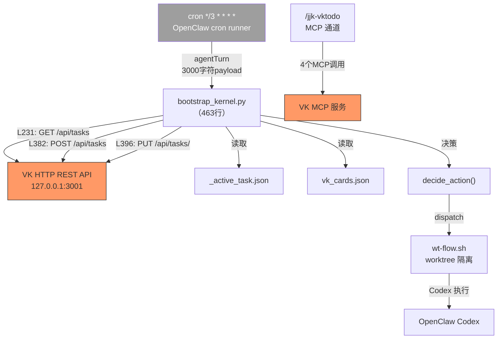

当前链路的核心问题：cron 每 3 分钟盲触发 → `bootstrap_kernel.py` 通过 HTTP REST API 直连 VK 服务 → VK 不可用时整个链路阻断。

### 2.2 五方一致性问题

coder4 每轮执行前必须校验以下五方一致性，任一不一致即阻断（`BLOCKED_DOC_CONTEXT`）：

| # | 真理源 | 载体 | 校验内容 | 不一致后果 |
|---|--------|------|---------|-----------|
| 1 | `_active_task.json` | 本地 JSON | task_key、project_id | 作用域错误，执行错误卡片 |
| 2 | `vk_cards.json` | 本地 JSON | card_order、hard_depends_on | 依赖链断裂，跳过前置卡 |
| 3 | VK 看板 | 远程 API | 卡片状态、project_id | VK 502 时全链路阻断 |
| 4 | `parallel_plan.md` | 本地 Markdown | Gate 定义、工作流分组 | Gate 卡与实际卡片不匹配 |
| 5 | coder4 状态 | `coder4_cron_state.json` | current_card、no_increment_count | 状态回退或重复执行 |

引用来源：VK 报告 3.1 节五方一致性要求、`.cursor/commands/jjk-vkplan.md` L56-73

### 2.3 VK 能力错误归因

VK 在工作流中被赋予的角色远超其实际提供的能力：

| 被归因给 VK 的能力 | 实际提供者 | 代码证据 |
|-------------------|-----------|---------|
| worktree 创建/隔离 | `wt-flow.sh` (L55-84) | `git worktree add` 标准命令 |
| rebase/merge 回主分支 | `wt-flow.sh` (L88-146) | `git rebase` + `git merge --no-ff` |
| 串行门禁（单卡推进） | `_active_task.json` + coder4 逻辑 | `single_active_card=true` 由本地 JSON 控制 |
| 卡片依赖链校验 | `vk_cards.json` 本地文件 | `hard_depends_on` 字段由本地 JSON 定义 |
| 证据绑定与台账 | `coder4_task_ledger.jsonl` | 本地 JSONL 文件 |
| 作用域锁定 | `set_active_task.py` + `scope_guard.py` | 纯本地 Python 脚本 |

VK 的真正独有能力仅有两项：attempt 系统（执行历史记录）和远程看板可视化（Web UI）。

引用来源：VK 报告 3.1 节能力错误归因表

### 2.4 VK 引入代价清单

| 代价项 | 量化 | 来源 |
|--------|------|------|
| VK 专属规则/命令/脚本 | 1256 行 | `jjk-vk*.md` + `vk_*.sh` + SKILL.md |
| 跨文件 VK 引用 | 约 203 处（21 个文件） | 全仓库 grep 统计（评审报告 2.7 节修正） |
| VK MCP 工具调用 | 4 处（集中在 `/jjk-vktodo`） | `jjk-vktodo.md` L89-106 |
| VK HTTP REST API 调用 | 3 处（`127.0.0.1:3001`） | `bootstrap_kernel.py` L196/L382/L396 |
| 五方一致性校验 | 31 条约束 | `/jjk-vkplan` 硬拦截规则 |
| 外部服务依赖 | 1 个 MCP 二进制 | `.mcp.json` 中 `vibe_kanban` 配置 |
| VK 运维脚本 | 582 行（4 个脚本） | `vk_dev.sh`/`vk_setup.sh`/`vk_cleanup.sh`/`vk_ports.sh` |

VK API 依赖分为两个通道：
- **MCP 通道**（4 个调用）：`list_organizations` + `list_projects`、`list_issues`、`create_issue`、`update_issue`，集中在 `/jjk-vktodo` Step 1/3
- **HTTP REST 通道**（3 个调用）：`GET /api/tasks`（L196）、`POST /api/tasks`（L382）、`PUT /api/tasks/<id>`（L396），集中在 `bootstrap_kernel.py`

引用来源：VK 报告 3.1 节代价清单、3.4.1 节 API 依赖清单

### 2.5 cron 结构性缺陷

| # | 问题 | 现状 | 影响 |
|---|------|------|------|
| 1 | 固定频率盲触发 | 每 3 分钟无条件触发，不感知任务状态 | 任务完成时空转；执行中时可能重叠 |
| 2 | 无状态感知 | 每轮独立执行，跨轮状态靠外部文件 | 状态散落在 `_active_task.json` / `coder4_cron_state.json` / VK API 三处 |
| 3 | 无原生重试策略 | `consecutiveErrors` 仅计数，不触发自动恢复 | 连续失败后需人工介入 |
| 4 | 无条件分支 | 每轮执行相同 prompt，靠 LLM 自行判断 | 决策不确定性高，同一状态可能产生不同行为 |
| 5 | 无超时恢复 | `timeoutSeconds: 240` 超时后静默丢弃 | 超时轮次的中间状态无法回滚 |
| 6 | VK API 单点故障 | `bootstrap_kernel.py` L196 失败即阻断 | VK 不可用时整个自动化链路中断 |

注意：评审报告 2.3 节指出 `consecutiveErrors: 9` 出现在 ragflow_kb job 上（Telegram 投递失败），coder4 job 的 `consecutiveErrors: 0`。cron 的结构性缺陷是机制层面的，不依赖于特定 job 的故障数据。

引用来源：VK 报告 7.1 节 cron 缺陷表、评审报告 2.3 节归因修正

---

## Ch 3: 目标架构总览

### 3.1 目标架构图

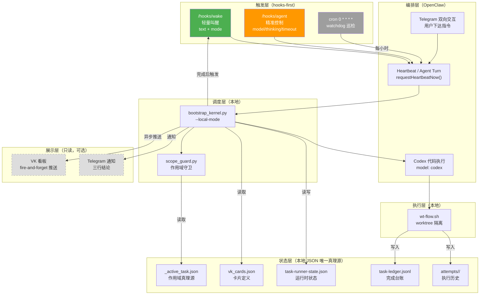

### 3.2 三层触发器能力拆分

基于研究报告 5.8 节源码审计结果，OpenClaw 提供三种触发机制：

| 决策维度 | `/hooks/wake` | `/hooks/agent` | cron `0 * * * *` |
|---------|--------------|----------------|------------------|
| 触发延迟 | 零（`mode: "now"`）或下一次 heartbeat（`mode: "next-heartbeat"`） | 零 | 最多 1 小时 |
| 参数控制 | text + mode（`"now"` \| `"next-heartbeat"`） | message/model/thinking/timeout/deliver/channel/to | 完整 payload |
| 认证方式 | Bearer Token 必填（`hooks.ts:158-175`） | Bearer Token 必填 | 无需认证（内部调度） |
| 会话模式 | 触发现有 heartbeat 会话 | 创建一次性隔离会话（返回 `202 { ok, runId }`） | 按 sessionTarget 配置 |
| 适用场景 | 常规推进——"有新工作了"（`mode: "now"`）；低优先级通知（`mode: "next-heartbeat"`，如 VK 只读同步） | 精准控制——首次启动/异常恢复/特殊模型 | 兜底巡检——防止链路静默死亡 |
| 调用方 | bootstrap_kernel.py | bootstrap_kernel.py（特殊场景） | OpenClaw cron runner |
| 幂等性 | 是（重复调用安全，250ms coalesce 窗口） | 否（每次创建新 turn） | 是（按 schedule 去重） |
| 源码位置 | `server-http.ts:324-332` | `server/hooks.ts:32-107` | `cron.ts:130-135` |

引用来源：研究报告 5.1 节（/hooks/wake）、5.3 节（/hooks/agent）、5.8 节（能力拆分表）

### 3.3 触发器决策流程

```
Step 1: 默认使用 /hooks/wake（轻量、幂等、零等待）
         ↓ 需要覆盖 model/thinking/timeout？
Step 2: 升级为 /hooks/agent（精准控制，创建隔离 turn）
         ↓ cron 仅作 watchdog
Step 3: cron 0 * * * * 每小时巡检，检测链路是否存活
```

正常推进链路中，`/hooks/wake` 覆盖 95%+ 场景。`/hooks/agent` 仅在首次启动、异常恢复、需要指定特殊模型时使用。cron 不参与正常推进，仅作为最后防线。

### 3.4 hooks-first 执行链路

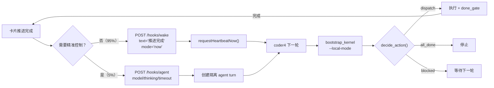

### 3.5 三层真理源层级

评审报告 7 节建议明确真理源层级，避免"唯一真理源"的误导性表述：

| 层级 | 文件 | 作用域 | 写入者 | 读取者 |
|------|------|--------|--------|--------|
| L1（最高） | `_active_task.json` | 当前活跃任务的元信息（task_key、project_id） | `set_active_task.py` | `scope_guard.py`、`bootstrap_kernel.py` |
| L2 | `vk_cards.json` | 卡片定义（card_order、hard_depends_on、acceptance_checks） | `/jjk-vkplan` 生成 | `bootstrap_kernel.py` |
| L3 | `task-runner-state.json` | 运行时状态（current_card、card_status_map、no_increment_count） | `bootstrap_kernel.py` | `bootstrap_kernel.py`、`wt-flow.sh` |

层级规则：高层级文件的信息优先于低层级。例如 `_active_task.json` 中的 `task_key` 决定读取哪个 `vk_cards.json`，`vk_cards.json` 中的 `card_order` 决定 `task-runner-state.json` 中的卡片范围。

### 3.6 与现有架构的关键差异

| # | 维度 | 现有架构 | 目标架构 |
|---|------|---------|---------|
| 1 | 触发方式 | cron `*/3` 盲触发 | hooks-first 零等待 + cron watchdog 兜底 |
| 2 | VK 角色 | 执行链路核心（读写卡片状态） | 只读展示层（fire-and-forget 推送） |
| 3 | 状态存储 | 五方分散（本地 + VK 远程） | 三层本地 JSON（L1/L2/L3） |
| 4 | 一致性校验 | 五方一致性（31 条约束） | 三层层级校验（高层级优先） |
| 5 | 故障恢复 | VK 502 → 全链路阻断 | hooks 失败 → cron watchdog 兜底；VK 不可用 → 零影响 |

---

## Ch 4: task-runner-state.json 完整 Schema

### 4.1 完整 JSON 示例

扩展自 VK 报告 3.2.2 节，补充评审报告 2.4 节和 2.6 节的反馈：

```json
{
  "schema_version": "1.0.0",
  "task_key": "PP-20260221-OPENCLAW-REBUILD-BASELINE",
  "current_card": "C02",
  "card_order": ["C01", "C02", "C03", "C04", "C05", "C06"],
  "card_status": {
    "C01": "done",
    "C02": "in_progress",
    "C03": "todo",
    "C04": "todo",
    "C05": "todo",
    "C06": "todo"
  },
  "execution_mode": "serial",
  "single_active_card": true,
  "no_increment_count": 0,
  "max_no_increment": 5,
  "current_attempt_id": "attempt_003",
  "hooks_gateway_url": "${OPENCLAW_GATEWAY}",  // 必须从环境变量读取，禁止硬编码
  "last_action": "dispatch",
  "last_action_result": "NORMAL_DISPATCH",
  "last_updated": "2026-02-27T10:00:00+08:00",
  "last_heartbeat_at": "2026-02-27T10:00:00+08:00",
  "created_at": "2026-02-26T09:00:00+08:00"
}
```

### 4.2 字段说明

| 字段 | 类型 | 必填 | 默认值 | 说明 |
|------|------|------|--------|------|
| `schema_version` | string | 是 | `"1.0.0"` | Schema 版本号，用于向后兼容校验 |
| `task_key` | string | 是 | - | 任务标识符，对应 `_active_task.json` 中的 task_key |
| `current_card` | string | 是 | - | 当前活跃卡片 ID（如 `C02`） |
| `card_order` | string[] | 是 | - | 卡片执行顺序，从 `vk_cards.json` 同步 |
| `card_status` | object | 是 | - | 卡片状态映射，key 为卡片 ID，value 为状态枚举 |
| `execution_mode` | string | 是 | `"serial"` | 执行模式：`serial`（串行）或 `parallel`（并行） |
| `single_active_card` | boolean | 是 | `true` | 是否限制同时只有一张卡片处于 `in_progress` |
| `no_increment_count` | integer | 是 | `0` | 连续无推进轮次计数，超过 `max_no_increment` 后降频或暂停 |
| `max_no_increment` | integer | 否 | `5` | 最大连续无推进轮次阈值 |
| `current_attempt_id` | string | 否 | `null` | 当前卡片的活跃 attempt ID |
| `hooks_gateway_url` | string | 否 | `${OPENCLAW_GATEWAY}` | OpenClaw gateway URL，读取优先级：`OPENCLAW_GATEWAY` 环境变量 > `~/.openclaw-dev/openclaw.json.gateway.port`（当前环境 19002）> upstream 默认 `18789`（`types.gateway.ts:280`） |
| `hooks_token` | string | 否 | `null` | OpenClaw hooks 认证 Token，**必须从环境变量 `OPENCLAW_HOOKS_TOKEN` 读取**。Gateway 要求所有 `/hooks/*` 请求携带 `Authorization: Bearer <token>` 或 `X-OpenClaw-Token` header（见 `hooks.ts:158-175`、`server-http.ts:253-291`）。无 token 时 hooks 调用将收到 401，整个 hooks-first 链路失效。速率限制：每 IP 60 秒内 20 次认证失败后返回 429 |
| `last_action` | string | 否 | `null` | 上一轮执行的 action 类型 |
| `last_action_result` | string | 否 | `null` | 上一轮执行的结果标识 |
| `last_updated` | string | 是 | - | ISO 8601 格式的最后更新时间 |
| `last_heartbeat_at` | string | 否 | `null` | ISO 8601 格式的最后一次 heartbeat/hooks 触发时间，watchdog 巡检用此字段判断链路是否静默死亡 |
| `created_at` | string | 是 | - | ISO 8601 格式的创建时间 |

### 4.3 卡片状态枚举

| 状态 | 含义 | 进入条件 | 退出条件 |
|------|------|---------|---------|
| `todo` | 待执行 | 初始状态 / seed 创建 | 依赖满足后 activate |
| `in_progress` | 执行中 | activate 激活 | dispatch 完成后进入 in_review |
| `in_review` | 验收中 | dispatch 完成 | done_gate 通过后进入 done |
| `done` | 已完成 | done_gate 验收通过 | 终态，不可逆 |
| `blocked` | 阻塞 | 依赖未满足 / 不可重试错误 | 阻塞条件解除后回到 todo |
| `skipped` | 已跳过 | 人工决策跳过 / 不适用于当前作用域 | 终态，不计入未完成卡片（`scope_guard_check` 过滤用） |

### 4.4 状态迁移图

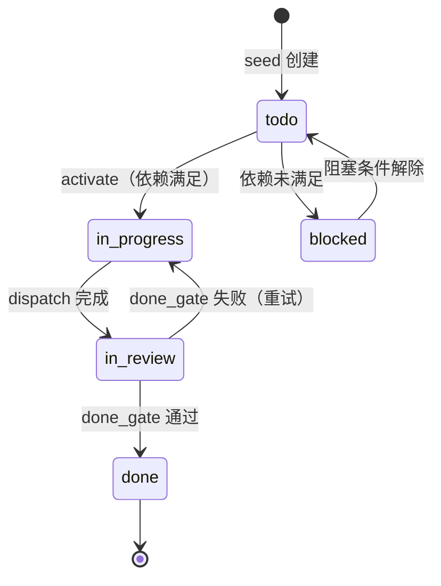

### 4.5 状态转换规则

| from | to | 触发条件 | 执行者 | 副作用 |
|------|----|---------|--------|--------|
| `todo` | `in_progress` | `hard_depends_on` 全部 `done` | `execute_activate()` | 更新 `current_card`；创建新 attempt |
| `todo` | `blocked` | `hard_depends_on` 中存在非 `done` 卡片 | `decide_action()` | 设置 `last_action_result = BLOCKED_DEPENDS` |
| `blocked` | `todo` | 阻塞的前置卡片变为 `done` | `decide_action()` 下一轮检测 | 清除 blocked 标记 |
| `in_progress` | `in_review` | Codex 执行完成，代码已提交 | `dispatch_coder4()` 返回 | 记录 commit_sha 到 attempt |
| `in_review` | `done` | `acceptance_checks` 全部通过 | `verify_done_gate()` | 写入台账；触发 `/hooks/wake` 推进下一张 |
| `in_review` | `in_progress` | `acceptance_checks` 部分失败 | `verify_done_gate()` | 记录失败证据到 attempt；`no_increment_count++` |

### 4.6 原子写入实现

评审报告风险 TOP 3 指出 `task-runner-state.json` 必须原子写入，防止写入中断导致文件损坏：

```python
import json
import os
import shutil
import tempfile
from pathlib import Path

def atomic_write_json(filepath: str, data: dict) -> None:
    """原子写入 JSON 文件：write-to-temp + os.rename + .bak 备份。"""
    filepath = Path(filepath)
    filepath.parent.mkdir(parents=True, exist_ok=True)

    # 备份现有文件
    if filepath.exists():
        bak_path = filepath.with_suffix(".json.bak")
        shutil.copy2(filepath, bak_path)

    # 写入临时文件（同目录，确保同一文件系统）
    fd, tmp_path = tempfile.mkstemp(
        dir=filepath.parent, suffix=".tmp", prefix=".trs_"
    )
    try:
        with os.fdopen(fd, "w", encoding="utf-8") as f:
            json.dump(data, f, ensure_ascii=False, indent=2)
            f.write("\n")
            f.flush()
            os.fsync(f.fileno())
        # 原子重命名（POSIX 保证同文件系统内 rename 是原子的）
        os.rename(tmp_path, filepath)
    except Exception:
        # 写入失败，清理临时文件
        if os.path.exists(tmp_path):
            os.unlink(tmp_path)
        raise
```

### 4.7 与 coder4_cron_state.json 的字段迁移映射

| coder4_cron_state.json 字段 | task-runner-state.json 字段 | 迁移说明 |
|----------------------------|---------------------------|---------|
| `current_card` | `current_card` | 直接迁移 |
| `card_status_map` | `card_status` | 重命名，语义不变 |
| `no_increment_count` | `no_increment_count` | 直接迁移 |
| `execution_mode` | `execution_mode` | 直接迁移 |
| `single_active_card` | `single_active_card` | 直接迁移 |
| `last_updated` | `last_updated` | 直接迁移 |
| `task_key`（无，从 _active_task.json 读取） | `task_key` | 新增：冗余存储，减少跨文件读取 |
| （无） | `schema_version` | 新增：版本化管理 |
| （无） | `current_attempt_id` | 新增：关联 attempt 系统 |
| （无） | `hooks_gateway_url` | 新增：hooks 调用地址 |
| （无） | `max_no_increment` | 新增：可配置阈值 |

---

## Ch 5: bootstrap_kernel.py 本地化详细设计

### 5.1 模块拆分设计

将 `bootstrap_kernel.py`（463 行）从单体脚本拆分为 8 个可独立调用的模块。评审报告建议将 `dispatch_coder4` 从 kernel 职责中移除，本设计保留其作为 kernel 的"执行委托"接口，但明确其职责边界：仅负责触发 OpenClaw/Codex 执行，不包含业务逻辑。

| # | 模块 | 对应原函数 | 输入 | 输出 | 失败处理 |
|---|------|-----------|------|------|---------|
| 1 | `load_context` | `build_kernel_context()` L212-302 | `active_task_path` | `KernelContext` | 本地文件读取失败即阻断 |
| 2 | `decide_action` | `decide_action()` | `KernelContext` | `(action, target_card, status)` | 纯计算，不会失败 |
| 3 | `execute_seed` | `apply_action("seed")` L370-390 | `card_id, card_def` | 写入 `task-runner-state.json` | 原子写入失败即阻断 |
| 4 | `execute_activate` | `apply_action("activate")` L392-404 | `card_id` | 更新 `task-runner-state.json` | 原子写入失败即阻断 |
| 5 | `dispatch_coder4` | cron payload 中的执行逻辑 | `card_id, worktree_path` | `execution_result` | 由 OpenClaw/Codex 执行，超时由下一轮重试 |
| 6 | `verify_done_gate` | WORKFLOW_AUTO.md 中的 DONE_GATE_CHECK | `card_id, acceptance_checks` | `pass/fail + evidence` | 失败不重试，记录证据 |
| 7 | `advance_card` | 状态迁移 + 台账写入 | `card_id, new_status` | `ledger_entry` | 原子写入 |
| 8 | `sync_to_vk` | 新增：异步推送到 VK | `card_id, status` | `sync_result` | **失败静默**，不阻断 |

### 5.2 load_context 改造要点

`build_kernel_context()` 当前在 L231 调用 `list_tasks(api_base, project_id)` 从 VK HTTP REST API 获取看板卡片状态。这是 bootstrap_kernel.py 中**唯一的 VK API 读取点**。

改造前（L231）：

```python
# 当前实现：通过 HTTP REST API 从 VK 读取卡片状态
board_tasks = list_tasks(api_base, project_id)
card_status_map = {}
for task in board_tasks:
    card_id = task.get("simple_id", "")
    status = task.get("status", "todo")
    card_status_map[card_id] = status
```

改造后：

```python
# 目标实现：从本地 task-runner-state.json 读取卡片状态
import json
from pathlib import Path

def load_local_card_status(state_path: str) -> dict:
    """从本地 task-runner-state.json 读取 card_status_map。"""
    state_file = Path(state_path)
    if not state_file.exists():
        raise FileNotFoundError(
            f"task-runner-state.json 不存在: {state_path}，"
            "请先运行 execute_seed 初始化"
        )
    with open(state_file, "r", encoding="utf-8") as f:
        state = json.load(f)
    # schema 版本校验
    version = state.get("schema_version", "0.0.0")
    if not version.startswith("1."):
        raise ValueError(f"不支持的 schema 版本: {version}")
    return state.get("card_status", {})

# 替换 L231
state_path = ".omc/state/task-runner-state.json"
card_status_map = load_local_card_status(state_path)
```

#### 5.2.1 Schema 版本升级策略

| 版本变更类型 | 示例 | 兼容性规则 | 处理方式 |
|------------|------|-----------|---------|
| Patch（`1.0.x`） | 新增可选字段（有默认值） | 向后兼容 | 自动加载，缺失字段使用默认值 |
| Minor（`1.x.0`） | 新增必填字段 / 修改字段语义 | 同 major 版本内兼容 | `load_local_card_status()` 自动迁移：检测缺失字段并补充默认值 |
| Major（`x.0.0`） | 删除字段 / 重构 Schema 结构 | 不兼容 | 提供迁移脚本 `migrate_state_schema.py`；旧版本文件自动备份为 `.bak` |

**升级流程**：

```python
def load_local_card_status(state_file: str) -> dict:
    # ... 读取文件 ...
    version = state.get("schema_version", "0.0.0")
    major = int(version.split(".")[0])
    if major < 1:
        raise ValueError(f"不支持的 schema 版本: {version}，请运行 migrate_state_schema.py")
    if major > 1:
        raise ValueError(f"schema 版本 {version} 高于当前支持的 1.x，请升级 bootstrap_kernel")
    # minor 版本自动迁移：补充新增字段的默认值
    state = _auto_migrate_minor(state, version)
    return state.get("card_status", {})
```

#### 5.2.2 `_active_task` ALL_DONE 边界条件处理

> **代码实证**（eval-code-verified M2）：当前 `_active_task.json` 指向 `PP-20260221-OPENCLAW-REBUILD-BASELINE`，`coder4_cron_state.json` 报告 `last_result=ALL_DONE`（scoped done=5），但 `card_order` 有 10 张卡（C01-C06 + G01-G04），G01-G04 Gate 卡尚未在看板创建。这是一个未定义的边界条件。

`scope_guard` 模块必须处理以下状态组合：

| `cron_state.last_result` | `card_order` 中未完成卡片 | 预期行为 |
|--------------------------|-------------------------|---------|
| `ALL_DONE` | 无 | 正常完成，输出 `SCOPE_COMPLETE` |
| `ALL_DONE` | 有（Gate 卡未创建/未执行） | **过渡状态**：implementation 卡已完成但 Gate 卡待推进 |
| 非 `ALL_DONE` | 有 | 正常执行，继续推进 |

**过渡状态处理**：

```python
def scope_guard_check(state: dict, card_order: list, card_status: dict) -> str:
    """scope_guard 增强：处理 ALL_DONE + Gate 未完成的过渡状态。"""
    last_result = state.get("last_result", "")

    # 统计未完成卡片
    pending_cards = [c for c in card_order if card_status.get(c, "todo") not in ("done", "skipped")]
    pending_gates = [c for c in pending_cards if c.startswith("G")]
    pending_impl = [c for c in pending_cards if not c.startswith("G")]

    if not pending_cards:
        return "SCOPE_COMPLETE"

    if last_result == "ALL_DONE" and not pending_impl and pending_gates:
        # 过渡状态：implementation 卡全部完成，Gate 卡待推进
        # 重置 last_result 以允许 Gate 卡进入执行流
        logger.info(f"过渡状态：{len(pending_gates)} 张 Gate 卡待推进: {pending_gates}")
        return "GATE_PHASE"

    return "CONTINUE"
```

### 5.3 --local-mode 参数设计

新增 `--local-mode` 命令行参数，启用时跳过所有 VK API 调用：

```python
import argparse

parser = argparse.ArgumentParser()
parser.add_argument("--local-mode", action="store_true", default=False,
                    help="启用本地模式，不调用 VK API")
parser.add_argument("--vk-api-base", default="http://127.0.0.1:3001",
                    help="VK API 地址（仅 sync_to_vk 使用，--local-mode 时仍可推送）")
parser.add_argument("--state-dir", default=".omc/state",
                    help="本地状态文件目录")
args = parser.parse_args()
```

行为矩阵：

| 模块 | `--local-mode=false`（当前） | `--local-mode=true`（目标） |
|------|---------------------------|--------------------------|
| `load_context` | L231 调用 VK API | 读取本地 `task-runner-state.json` |
| `execute_seed` | L382 POST VK API 创建卡片 | 写入本地 `task-runner-state.json` |
| `execute_activate` | L396 PUT VK API 更新状态 | 写入本地 `task-runner-state.json` |
| `sync_to_vk` | 不存在 | 异步推送（fire-and-forget） |
| `dispatch_coder4` | 不变 | 不变（OpenClaw/Codex 执行） |

过渡期策略：Phase 1 默认 `--local-mode=true`，`--vk-api-base` 保留用于 `sync_to_vk`。Phase 3 完全移除 `--vk-api-base` 参数。

### 5.4 heartbeat_turn() 完整伪代码

扩展自 VK 报告 7.4.3 节，补充 hooks 触发和异常处理：

```python
import json
import logging
import os
from pathlib import Path

import requests

logger = logging.getLogger("bootstrap_kernel")

def resolve_gateway_url() -> str:
    env_url = os.getenv("OPENCLAW_GATEWAY", "").strip()
    if env_url:
        return env_url
    cfg = Path("~/.openclaw-dev/openclaw.json").expanduser()
    if cfg.exists():
        try:
            payload = json.loads(cfg.read_text(encoding="utf-8"))
            port = int(payload.get("gateway", {}).get("port", 0))
            if port > 0:
                return f"http://localhost:{port}"
        except Exception:
            pass
    return "http://localhost:18789"  # upstream default fallback

def heartbeat_turn(
    active_task_path: str,
    state_dir: str = ".omc/state",
    hooks_gateway: str = resolve_gateway_url(),
    vk_api_base: str | None = None,
) -> str:
    """coder4 每轮执行的核心逻辑。

    返回值为 action result 字符串，用于 Telegram 三行结论输出。
    """
    state_path = f"{state_dir}/task-runner-state.json"

    # 1. 加载上下文（纯本地）
    try:
        ctx = load_context(active_task_path, state_path)
    except FileNotFoundError as e:
        logger.error(f"上下文加载失败: {e}")
        return "BLOCKED_ACTIVE_TASK_MISSING"
    except ValueError as e:
        logger.error(f"Schema 校验失败: {e}")
        return "BLOCKED_STATE_CORRUPTED"

    # 2. 决策（纯计算）
    action, target_card, target_status = decide_action(ctx)

    # 3. 按 action 分支执行
    if action == "preflight_blocked":
        return "BLOCKED_PREFLIGHT"

    if action == "all_done":
        logger.info("所有卡片已完成")
        return "ALL_DONE"

    if action == "blocked_depends":
        return f"BLOCKED_DEPENDS:{target_card}"

    if action == "seed":
        card_def = ctx.get_card_definition(target_card)
        execute_seed(target_card, card_def, state_path)
        _try_sync_vk(vk_api_base, target_card, "todo")
        return f"CARD_SEEDED:{target_card}"

    if action == "activate":
        execute_activate(target_card, state_path)
        _try_sync_vk(vk_api_base, target_card, "inprogress")
        return f"CARD_ACTIVATED:{target_card}"

    if action == "dispatch":
        worktree_path = ctx.get_worktree_path(target_card)
        result = dispatch_coder4(target_card, worktree_path)

        if target_status == "in_review":
            gate = verify_done_gate(target_card, ctx.acceptance_checks)
            if gate["passed"]:
                advance_card(target_card, "done", state_path)
                _try_sync_vk(vk_api_base, target_card, "done")
                # 完成后立即触发下一轮（hooks-first）
                _try_trigger_next(hooks_gateway)
                return f"CARD_DONE:{target_card}"
            else:
                # done_gate 失败，记录证据，等下一轮重试
                record_attempt_evidence(target_card, gate, state_dir)
                increment_no_progress(state_path)
                return f"DONE_GATE_FAILED:{target_card}"

        return f"NORMAL_DISPATCH:{target_card}"

    return f"UNKNOWN_ACTION:{action}"


def _try_trigger_next(hooks_gateway: str) -> None:
    """触发下一轮执行（fire-and-forget）。"""
    token = os.getenv("OPENCLAW_HOOKS_TOKEN", "")
    headers = {"Authorization": f"Bearer {token}"} if token else {}
    if not token:
        logger.warning("OPENCLAW_HOOKS_TOKEN 未配置，hooks 调用将收到 401")
    try:
        requests.post(
            f"{hooks_gateway}/hooks/wake",
            json={"text": "卡片推进完成，立即执行下一轮", "mode": "now"},
            headers=headers,
            timeout=5,
        )
    except Exception as e:
        # hooks 调用失败不阻断，cron watchdog 会兜底
        logger.warning(f"hooks/wake 调用失败: {e}")


def _try_sync_vk(vk_api_base: str | None, card_id: str, status: str) -> None:
    """异步推送卡片状态到 VK（fire-and-forget）。"""
    if not vk_api_base:
        return
    try:
        sync_to_vk(card_id, status, vk_api_base)
    except Exception as e:
        logger.warning(f"VK 推送失败 {card_id}: {e}")
```

### 5.5 --vk-api-base 参数处理策略

| 阶段 | `--vk-api-base` 行为 |
|------|---------------------|
| Phase 1 | 保留，仅用于 `sync_to_vk` 异步推送；`load_context` 不再使用 |
| Phase 2 | 可选，不传则跳过 VK 推送 |
| Phase 3 | 完全移除参数，删除 `sync_to_vk` 模块 |

### 5.6 dispatch_coder4 与 OpenClaw Codex 的交互

`dispatch_coder4` 不直接执行代码，而是通过 OpenClaw 的 Codex model 委托执行：

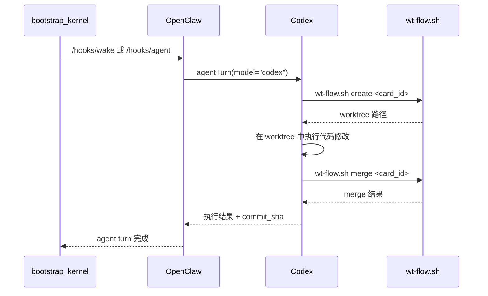

关键点：
- `dispatch_coder4` 的职责是"触发执行"，不是"执行代码"
- 实际代码执行由 OpenClaw Codex 在 worktree 中完成
- `wt-flow.sh` 管理 worktree 的创建、合并、清理生命周期
- 执行结果（commit_sha、证据）通过 attempt 系统记录

---

## Ch 6: wt-flow.sh 扩展设计

### 6.1 现有能力（220 行）

| 子命令 | 行范围 | 职责 | 参数 |
|--------|--------|------|------|
| `create` | L55-84 | 从基准分支创建 worktree + 分支 | `<card_id> [base_branch]` |
| `merge` | L88-146 | rebase + merge --no-ff 回主分支 | `<card_id>` |
| `cleanup` | L150-171 | 清理 worktree 和分支 | `<card_id>` |
| `status` | L175-182 | 查看当前会话状态 | 无 |
| `guard` | L186-193 | 检查是否在主分支上 | 无 |

### 6.2 新增子命令（5 个）

评审报告 7 节建议将 `next/verify/list` 独立为 `task-runner.sh`，与 worktree 管理解耦。本设计选择保留在 `wt-flow.sh` 中，理由：这些子命令与 worktree 生命周期紧密耦合（`next` 需要创建 worktree，`verify` 需要在 worktree 中执行检查），拆分反而增加调用复杂度。

| 子命令 | 职责 | 对应原 VK 能力 | 估算行数 |
|--------|------|---------------|---------|
| `next` | 按 card_order 推进到下一张卡 | VK 卡片状态迁移 | 40-50 |
| `verify` | 执行 acceptance_checks 并记录结果 | VK done gate | 35-45 |
| `list` | 列出当前任务队列与状态 | `mcp__vibe_kanban__list_issues` | 20-25 |
| `parallel-create` | 批量创建多个 worktree | `/jjk-vktodo create` | 25-30 |
| `parallel-merge` | 按依赖顺序批量合并 | `/jjk-vktodo move` | 25-30 |

### 6.3 next 子命令

```bash
# wt-flow.sh next [--state-dir=.omc/state]
# 读取 task-runner-state.json，推进到下一张可执行卡片

next() {
    local state_dir="${STATE_DIR:-.omc/state}"
    local state_file="$state_dir/task-runner-state.json"

    if [[ ! -f "$state_file" ]]; then
        echo "ERROR: $state_file 不存在" >&2
        return 1
    fi

    # 读取当前状态
    local current_card=$(jq -r '.current_card' "$state_file")
    local card_order=$(jq -r '.card_order[]' "$state_file")
    local execution_mode=$(jq -r '.execution_mode' "$state_file")

    # 查找下一张 todo 卡片
    local next_card=""
    for card in $card_order; do
        local status=$(jq -r ".card_status.\"$card\"" "$state_file")
        if [[ "$status" == "todo" ]]; then
            # 检查依赖是否满足
            if check_depends "$card" "$state_file"; then
                next_card="$card"
                break
            fi
        fi
    done

    if [[ -z "$next_card" ]]; then
        # 检查是否全部完成
        local all_done=$(jq '[.card_status | to_entries[] | select(.value != "done")] | length' "$state_file")
        if [[ "$all_done" == "0" ]]; then
            echo "ALL_DONE"
            return 0
        fi
        echo "BLOCKED: 无可推进卡片"
        return 2
    fi

    echo "NEXT: $next_card"
    # 创建 worktree 并激活
    create "$next_card"
    # 更新状态
    jq --arg card "$next_card" '.current_card = $card | .card_status[$card] = "in_progress"' \
        "$state_file" > "$state_file.tmp"
    # 防止 jq 输出为空时覆盖状态文件
    if [[ -s "$state_file.tmp" ]]; then
        mv "$state_file.tmp" "$state_file"
    else
        echo "ERROR: jq 输出为空，状态文件未更新" >&2
        rm -f "$state_file.tmp"
        return 1
    fi
}
```

### 6.4 verify 子命令

```bash
# wt-flow.sh verify <card_id> [--state-dir=.omc/state]
# 在 worktree 中执行 acceptance_checks，记录结果到 attempt

verify() {
    local card_id="$1"
    local state_dir="${STATE_DIR:-.omc/state}"
    # 从 _active_task.json 读取 task_key 构造确定性路径
    local task_key=$(jq -r '.task_key' docs/内部参考/任务拆解/_active_task.json)
    local cards_file="docs/内部参考/任务拆解/${task_key}/vk_cards.json"

    if [[ ! -f "$cards_file" ]]; then
        echo "ERROR: vk_cards.json 不存在: $cards_file" >&2
        return 1
    fi

    # 从 vk_cards.json 读取 acceptance_checks
    local checks=$(jq -r ".cards[] | select(.card_id == \"$card_id\") | .acceptance_checks[]" "$cards_file")

    if [[ -z "$checks" ]]; then
        echo "WARN: $card_id 无 acceptance_checks，默认通过"
        echo '{"passed": true, "evidence": "no_checks_defined"}' > "$state_dir/attempts/$card_id/gate_result.json"
        return 0
    fi

    # 白名单命令前缀（安全约束）
    local ALLOWED_PREFIXES=("pytest" "ruff" "grep" "python" "bash" "cat" "jq" "wc" "test" "diff")

    local all_passed=true
    local evidence=()

    while IFS= read -r check; do
        # 命令安全校验：检查是否在白名单中
        local cmd_prefix="${check%% *}"
        local is_allowed=false
        for prefix in "${ALLOWED_PREFIXES[@]}"; do
            if [[ "$cmd_prefix" == "$prefix" ]]; then
                is_allowed=true
                break
            fi
        done

        if [[ "$is_allowed" != "true" ]]; then
            echo "BLOCKED: 命令 '$cmd_prefix' 不在白名单中，跳过: $check" >&2
            evidence+=("{\"check\": \"$check\", \"result\": \"blocked_not_allowed\"}")
            all_passed=false
            continue
        fi

        echo "执行检查: $check"
        # 使用 bash -c 替代 eval，在子 shell 中执行并设置安全选项
        if bash -c "set -euo pipefail; $check" 2>&1; then
            evidence+=("{\"check\": \"$check\", \"result\": \"pass\"}")
        else
            evidence+=("{\"check\": \"$check\", \"result\": \"fail\"}")
            all_passed=false
        fi
    done <<< "$checks"

    # 写入验收结果
    local result_file="$state_dir/attempts/$card_id/gate_result.json"
    mkdir -p "$(dirname "$result_file")"
    echo "{\"passed\": $all_passed, \"evidence\": [$(IFS=,; echo "${evidence[*]}")]}" > "$result_file"

    if $all_passed; then
        echo "GATE_PASSED: $card_id"
        return 0
    else
        echo "GATE_FAILED: $card_id"
        return 1
    fi
}
```

### 6.5 list 子命令

```bash
# wt-flow.sh list [--state-dir=.omc/state]
# 输出当前任务队列的表格视图

list() {
    local state_dir="${STATE_DIR:-.omc/state}"
    local state_file="$state_dir/task-runner-state.json"

    if [[ ! -f "$state_file" ]]; then
        echo "ERROR: $state_file 不存在" >&2
        return 1
    fi

    echo "=== 任务队列 ==="
    echo "task_key: $(jq -r '.task_key' "$state_file")"
    echo "mode: $(jq -r '.execution_mode' "$state_file")"
    echo "current: $(jq -r '.current_card' "$state_file")"
    echo ""
    printf "%-8s %-14s %-10s\n" "CARD" "STATUS" "DEPENDS"
    printf "%-8s %-14s %-10s\n" "--------" "--------------" "----------"

    jq -r '.card_order[]' "$state_file" | while read card; do
        local status=$(jq -r ".card_status.\"$card\"" "$state_file")
        local marker=""
        [[ "$card" == "$(jq -r '.current_card' "$state_file")" ]] && marker=" <--"
        printf "%-8s %-14s%s\n" "$card" "$status" "$marker"
    done
}
```

### 6.6 串行模式执行流程

串行模式（`execution_mode=serial`）下，同一时刻只有一张卡片处于 `in_progress`：

```
1. wt-flow.sh next
   ├── 读取 task-runner-state.json
   ├── 找到第一张 status=todo 且依赖满足的卡片
   ├── wt-flow.sh create <card_id>  （创建 worktree）
   ├── 更新 card_status[card_id] = "in_progress"
   └── 更新 current_card = card_id

2. Codex 在 worktree 中执行代码修改
   ├── 读取 WS-*.md 工作流文档
   ├── 执行代码修改 + 测试
   └── git commit

3. wt-flow.sh verify <card_id>
   ├── 执行 acceptance_checks
   ├── 记录证据到 attempts/<card_id>/
   ├── 通过 → card_status = "done"
   └── 失败 → 保持 "in_progress"，no_increment_count++

4. wt-flow.sh merge <card_id>  （仅 verify 通过后）
   ├── git rebase master
   ├── git merge --no-ff
   └── wt-flow.sh cleanup <card_id>

5. 触发 /hooks/wake → 回到步骤 1
```

引用来源：VK 报告 3.2.4 节串行模式

### 6.7 并行模式执行流程

并行模式（`execution_mode=parallel`）下，多张无依赖关系的卡片可同时执行：

```
1. wt-flow.sh parallel-create
   ├── 读取 task-runner-state.json
   ├── 找到所有 status=todo 且依赖满足的卡片
   ├── 为每张卡片执行 wt-flow.sh create <card_id>
   └── 批量更新 card_status = "in_progress"

2. 各 worktree 独立执行（可并行）
   ├── worktree-C01: Codex 执行
   ├── worktree-C02: Codex 执行
   └── worktree-C03: Codex 执行

3. wt-flow.sh parallel-merge
   ├── 按 card_order 顺序逐个合并（保证依赖顺序）
   ├── 每个卡片：verify → merge → cleanup
   └── 合并冲突时暂停，标记 blocked
```

#### 6.7.1 并发写入保护

多个 worktree 同时完成时，`advance_card()` 可能并发写入 `task-runner-state.json`。原子写入（Ch 4.6）保证单次写入不损坏，但不保证并发写入的顺序正确。

**解决方案：文件锁（`flock`）**

```bash
# 所有对 task-runner-state.json 的写操作必须持有文件锁
update_state() {
    local state_file="$1"
    local jq_expr="$2"
    (
        flock -w 10 200 || { echo "ERROR: 获取文件锁超时" >&2; return 1; }
        local tmp_file="${state_file}.tmp"
        jq "$jq_expr" "$state_file" > "$tmp_file"
        if [[ -s "$tmp_file" ]]; then
            mv "$tmp_file" "$state_file"
        else
            rm -f "$tmp_file"
            echo "ERROR: jq 输出为空" >&2
            return 1
        fi
    ) 200>"${state_file}.lock"
}
```

Python 侧使用 `fcntl.flock` 实现等价保护：

```python
import fcntl

def atomic_write_json_locked(path: Path, data: dict) -> None:
    """带文件锁的原子写入，防止并发写入冲突。"""
    lock_path = path.with_suffix(".lock")
    with open(lock_path, "w") as lock_fd:
        fcntl.flock(lock_fd, fcntl.LOCK_EX)
        try:
            atomic_write_json(path, data)  # 复用 Ch 4.6 的原子写入
        finally:
            fcntl.flock(lock_fd, fcntl.LOCK_UN)
```

#### 6.7.2 parallel-merge 冲突处理流程

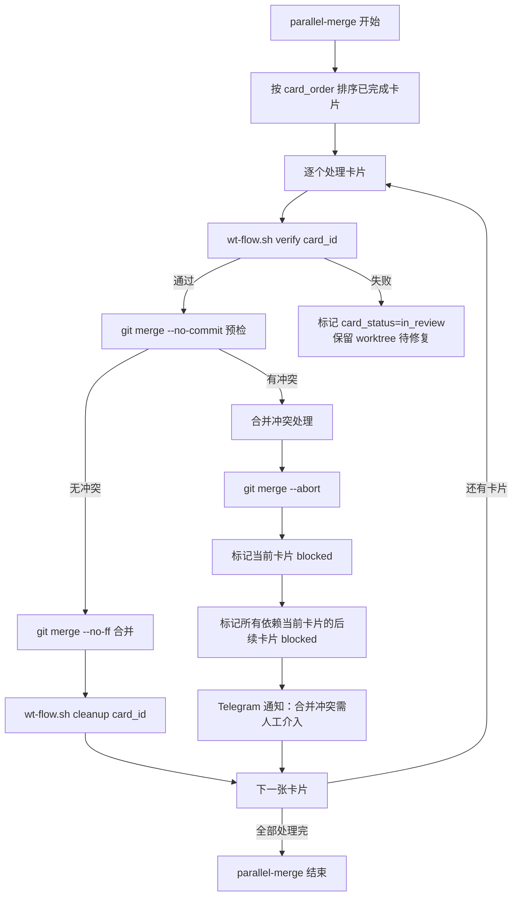

**冲突处理规则**：
1. 已成功合并的卡片**不回滚**（合并是按 card_order 顺序执行的，已合并的卡片不受后续冲突影响）
2. 冲突卡片标记为 `blocked`，其 worktree 保留供人工解决冲突
3. 依赖冲突卡片的后续卡片也标记为 `blocked`（级联阻塞）
4. 无依赖关系的后续卡片继续正常合并

#### 6.7.3 并行模式下的 hooks 触发策略

| 事件 | 触发方式 | 说明 |
|------|---------|------|
| 每张卡片执行完成 | 不触发 `/hooks/wake` | 避免在合并前触发新一轮 |
| parallel-merge 全部完成 | 触发一次 `/hooks/wake` | 推进到下一批可并行卡片 |
| 某张卡片合并冲突 | 触发 `/hooks/agent`（Telegram 通知） | 通知人工介入 |
| 所有卡片 done | 触发一次 `/hooks/wake` | 进入 all_done 流程 |

### 6.8 与 bootstrap_kernel 的交互时序图

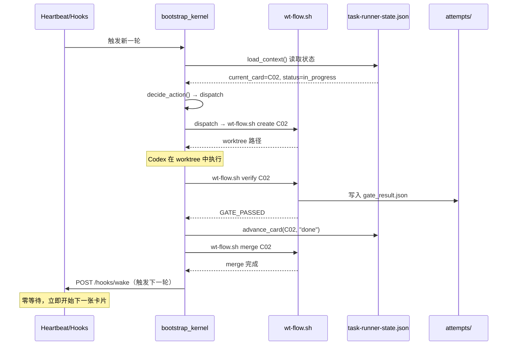

---

## Ch 7: Attempt 系统本地化设计

### 7.1 目录结构

```
.omc/state/attempts/
  C01/
    attempt_001.json
    attempt_002.json
    gate_result.json      # 最近一次 done_gate 结果
  C02/
    attempt_001.json
  ...
```

每次 coder4 对某张卡片执行一轮，写入一个 attempt 文件。文件名按序号递增，保证时间顺序。

#### 7.1.1 attempt 文件清理策略

为防止 attempt 文件无限增长耗尽磁盘空间，定义以下清理规则：

| 规则 | 说明 |
|------|------|
| 按 `task_key` 隔离 | attempt 目录按 `task_key` 隔离：`.omc/state/attempts/<task_key>/<card_id>/`，不同任务的同名卡片不会混在一起 |
| 保留最近 N 个 | 每张卡片保留最近 20 个 attempt 文件，超出部分在 `create_attempt()` 时自动清理最旧的文件 |
| 任务完成后归档 | 任务全部 done 后，`attempts/<task_key>/` 目录可整体压缩归档到 `.omc/archive/` |
| 磁盘空间监控 | `heartbeat_turn()` 每轮检查 `.omc/state/` 目录大小，超过 100MB 时在 Telegram 通知中告警 |

```python
def cleanup_old_attempts(card_dir: Path, keep_latest: int = 20) -> None:
    """清理旧 attempt 文件，保留最近 keep_latest 个。"""
    attempts = sorted(card_dir.glob("attempt_*.json"))
    if len(attempts) > keep_latest:
        for old_file in attempts[:-keep_latest]:
            old_file.unlink()
            logger.info("清理旧 attempt: %s", old_file.name)
```

### 7.2 attempt JSON Schema

```json
{
  "attempt_id": "attempt_003",
  "card_id": "C02",
  "started_at": "2026-02-27T10:00:00+08:00",
  "ended_at": "2026-02-27T10:03:42+08:00",
  "result": "done_gate_passed",
  "evidence": {
    "tests_passed": true,
    "lint_clean": true,
    "commit_sha": "a1b2c3d4",
    "acceptance_checks": [
      {"check": "pytest tests/unit/", "result": "pass"},
      {"check": "ruff check app/", "result": "pass"}
    ]
  },
  "worktree_path": "/Users/jijingkun/bojxAI/fastapi-wt-C02",
  "commit_sha": "a1b2c3d4",
  "execution_mode": "serial",
  "trigger": "hooks_wake",
  "duration_seconds": 222
}
```

字段说明：

| 字段 | 类型 | 必填 | 说明 |
|------|------|------|------|
| `attempt_id` | string | 是 | 唯一标识，格式 `attempt_NNN` |
| `card_id` | string | 是 | 所属卡片 ID |
| `started_at` | string | 是 | ISO 8601 开始时间 |
| `ended_at` | string | 是 | ISO 8601 结束时间 |
| `result` | string | 是 | 枚举：`done_gate_passed` / `done_gate_failed` / `dispatch_timeout` / `error` |
| `evidence` | object | 否 | 验收证据（测试结果、lint 结果等） |
| `worktree_path` | string | 是 | worktree 绝对路径（替代 VK 的 `container_ref`） |
| `commit_sha` | string | 否 | 执行产出的 commit SHA |
| `execution_mode` | string | 否 | 执行模式（serial/parallel） |
| `trigger` | string | 否 | 触发方式（hooks_wake/hooks_agent/cron_watchdog） |
| `duration_seconds` | integer | 否 | 执行耗时（秒） |

### 7.3 与 VK attempt 的能力对比

评审报告 2.6 节指出 VK attempt 的实际用途远超"记录执行历史"。以下逐项对比并给出本地替代方案：

| VK attempt 能力 | 本地方案是否覆盖 | 替代实现 |
|----------------|----------------|---------|
| 记录执行历史（started_at, ended_at, result） | 覆盖 | `attempt_NNN.json` 文件 |
| `container_ref`（代码执行环境引用） | 覆盖 | `worktree_path` 字段（本地 worktree 绝对路径） |
| `agent_working_dir`（agent 工作目录） | 覆盖 | 从 `wt-flow.sh create` 返回值获取，写入 `worktree_path` |
| `POST /api/task-attempts/{id}/merge`（触发合并） | 覆盖 | `wt-flow.sh merge <card_id>`（本地 git 操作） |
| `DONE_GATE_CHECK` 在 `attempt_repo_dir` 中执行 | 覆盖 | `wt-flow.sh verify` 在 `worktree_path` 中执行 |
| Web UI 查看 attempt 历史 | 不覆盖 | 命令行替代：`ls .omc/state/attempts/<card_id>/` |
| 跨会话远程查询 | 部分覆盖 | Telegram 查询（见 7.6 节） |

### 7.4 container_ref 本地替代

VK 的 `container_ref` 指向远程容器环境。本地方案使用 `worktree_path`：

```python
def create_attempt(card_id: str, state_dir: str) -> dict:
    """创建新的 attempt 记录。"""
    attempts_dir = Path(state_dir) / "attempts" / card_id
    attempts_dir.mkdir(parents=True, exist_ok=True)

    # 计算下一个 attempt 序号
    existing = sorted(attempts_dir.glob("attempt_*.json"))
    next_num = len(existing) + 1
    attempt_id = f"attempt_{next_num:03d}"

    # 获取 worktree 路径（替代 container_ref）
    worktree_path = get_worktree_path(card_id)

    attempt = {
        "attempt_id": attempt_id,
        "card_id": card_id,
        "started_at": datetime.now(timezone.utc).isoformat(),
        "ended_at": None,
        "result": None,
        "evidence": {},
        "worktree_path": str(worktree_path),
        "commit_sha": None,
    }

    attempt_file = attempts_dir / f"{attempt_id}.json"
    atomic_write_json(str(attempt_file), attempt)
    return attempt
```

### 7.5 DONE_GATE_CHECK 在 worktree 中执行

VK 的 `DONE_GATE_CHECK` 要求在 `attempt_repo_dir` 中执行验收检查。本地方案在 `worktree_path` 中执行：

```bash
# wt-flow.sh verify 内部实现
verify_in_worktree() {
    local card_id="$1"
    local worktree_path=$(get_worktree_path "$card_id")

    if [[ ! -d "$worktree_path" ]]; then
        echo "ERROR: worktree 不存在: $worktree_path" >&2
        return 1
    fi

    # 切换到 worktree 目录执行检查
    pushd "$worktree_path" > /dev/null
    local result=0

    # 执行 acceptance_checks（从 vk_cards.json 读取）
    # 注意：此处为简化示意，完整安全实现见 Ch 6.4 verify()（bash -c + ALLOWED_PREFIXES 白名单校验）
    while IFS= read -r check; do
        echo "  检查: $check"
        if ! eval "$check" 2>&1; then
            result=1
        fi
    done <<< "$(get_acceptance_checks "$card_id")"

    popd > /dev/null
    return $result
}
```

### 7.6 跨会话查询支持

| 查询方式 | 命令 | 输出 |
|---------|------|------|
| 文件级查询 | `ls .omc/state/attempts/C01/` | 列出所有 attempt 文件 |
| 详情查询 | `cat .omc/state/attempts/C01/attempt_003.json \| jq .` | 单个 attempt 详情 |
| 汇总查询 | `wt-flow.sh list` | 全部卡片状态 + 当前 attempt |
| Telegram 查询 | 用户发送"查看 C01 历史" | coder4 读取 attempts 目录并汇总回复 |
| 台账查询 | `cat .omc/state/task-ledger.jsonl \| jq -s .` | 完整执行台账 |

---

## Ch 8: 仓外依赖改造设计

### 8.1 仓外文件清单

coder4 的执行链路依赖以下仓外文件（位于 `~/.openclaw/workspace-dev/` 或 `~/.openclaw-dev/`），改造时必须同步处理：

| 文件 | 路径 | 行数 | VK 耦合度 | 改造策略 |
|------|------|------|----------|---------|
| WORKFLOW_AUTO.md | `~/.openclaw/workspace-dev/WORKFLOW_AUTO.md` | 460 | 高（Rule 2/8/26/27/29/31 直接引用 VK） | 剥离 VK 规则，保留通用执行协议 |
| VK_AGENT_PROMPTS.md | `~/.openclaw/workspace-dev/VK_AGENT_PROMPTS.md` | 628 | 极高（§0/3/8/9/12-15/17 含 VK 语义） | 重写为本地状态驱动的 prompt 模板 |
| jobs.json | `~/.openclaw-dev/cron/jobs.json` | 73 | 中（payload 含 `--vk-api-base`） | 改 cron expr + 移除 VK 参数 |
| cron state | `~/.openclaw/workspace-dev/state/coder4_cron_state.json` | ~30 | 低 | 迁移到 task-runner-state.json |
| ledger | `~/.openclaw/workspace-dev/state/coder4_task_ledger.jsonl` | 动态 | 无 | 保留，路径不变 |
| scope request | `~/.openclaw/workspace-dev/state/coder4_scope_request.json` | ~10 | 低（含 project_id） | project_id 改为本地解析 |
| SKILL.md | `.cursor/skills/vk-coder4-execution-guard/SKILL.md` | 146 | 高（引用 VK 语义） | 重写为本地状态驱动 |

### 8.2 WORKFLOW_AUTO.md VK 规则剥离

460 行 33 条规则中，以下规则直接引用 VK 语义，需改造或删除：

| 规则 | 内容摘要 | 改造方式 |
|------|---------|---------|
| Rule 2 | VK 操作通道优先级（MCP > HTTP > 本地兜底） | **删除**——本地状态唯一真理源，无需 VK 通道 |
| Rule 8 | VK 冲突偏好（VK 状态优先于本地） | **反转**——改为本地状态优先，VK 仅只读同步 |
| Rule 26 | bootstrap 通过 VK MCP 获取任务列表 | **改写**——改为从 `task-runner-state.json` 读取 |
| Rule 27 | attempt 通过 VK API 创建/查询 | **改写**——改为本地 `.omc/state/attempts/` 目录 |
| Rule 29 | merge 通过 VK API 触发 | **改写**——改为 `wt-flow.sh merge` 本地执行 |
| Rule 31 | 确定性内核使用 `--vk-api-base` 参数 | **改写**——改为 `--local-mode` 参数 |

保留不变的通用规则（示例）：

| 规则 | 内容摘要 | 保留原因 |
|------|---------|---------|
| Rule 1 | 卡片类型门禁（task_mode 决定执行路径） | 与 VK 无关，纯本地逻辑 |
| Rule 3-4 | 卡住检测与恢复 | 通用执行策略 |
| Rule 9 | 快速路径（简单卡片跳过完整流程） | 通用优化 |
| Rule 10 | card_order 线性扫描 | 从 vk_cards.json 读取，与 VK API 无关 |
| Rule 19 | 串行执行约束 | 通用执行模式 |
| Rule 33 | 防空转守卫 | 通用安全机制 |

### 8.3 VK_AGENT_PROMPTS.md 重写方案

628 行 21 个 section 中，VK 语义渗透分布如下：

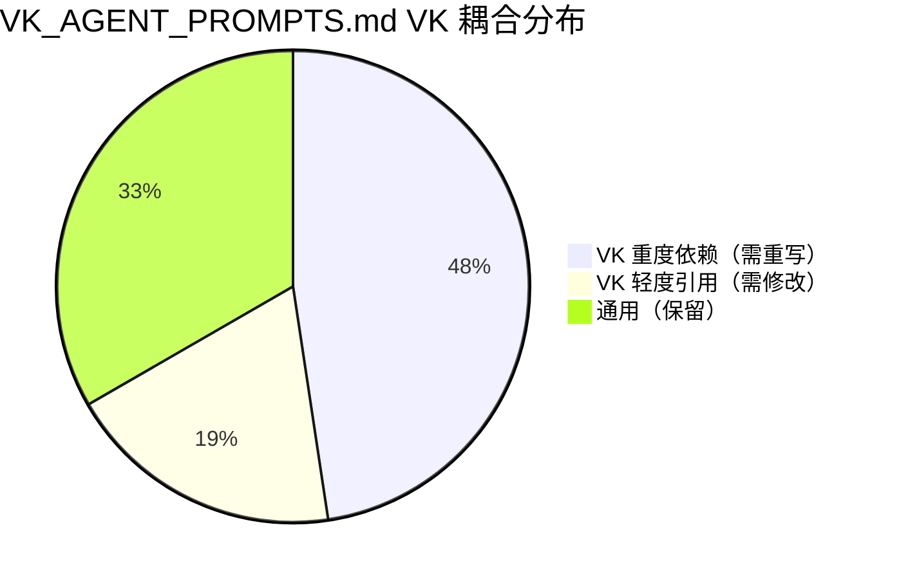

**VK 重度依赖 section（需完全重写）**：

| Section | 标题 | VK 耦合点 | 重写方向 |
|---------|------|----------|---------|
| §0 | VK-OPS 身份声明 | 整体以 VK 操作员为身份 | 改为"本地任务执行器"身份 |
| §3 | 卡片操作（VK MCP） | 通过 VK MCP 创建/更新卡片 | 改为 `task-runner-state.json` 读写 |
| §8 | VK Bot 策略 | VK Bot 交互协议 | 删除（VK 降级为只读后无需 Bot 策略） |
| §9 | coder4 严格执行 | 含 VK API 引用 | 改为本地 bootstrap_kernel 引用 |
| §12 | 串行作用域（VK） | VK 项目作用域 | 改为 `_active_task.json` 作用域 |
| §13 | AUTO_SEED（VK MCP） | VK MCP 创建任务 | 改为本地 seed 逻辑 |
| §14 | AUTO_ACTIVATE（VK MCP） | VK MCP 激活任务 | 改为本地 activate 逻辑 |
| §15 | attempt（VK API） | VK API 创建 attempt | 改为本地 attempt 目录 |
| §17 | auto-merge（VK API） | VK API 触发合并 | 改为 `wt-flow.sh merge` |
| §21 | VK 状态同步 | VK 状态回写 | 改为 fire-and-forget 只读推送 |

### 8.4 jobs.json 改造

当前 cron 配置需做以下改造：

> **路径确认**：cron 存储路径由 OpenClaw 配置中的 `cron.store` 字段决定。实际路径可能是 `~/.openclaw/cron-store.json`、`~/.openclaw/cron/jobs.json` 或 `~/.openclaw-dev/cron/jobs.json`（总控手册引用路径）。**P0 阶段第一步应确认实际路径**：检查 `~/.openclaw/openclaw.json`（或 `config.yaml`）中的 `cron.store` 配置字段，或查看 OpenClaw 启动日志中的 cron 加载路径。注意：当前 `~/.openclaw/cron/jobs.json` 中仅含 `ragflow_kb` 和 `coder4 进度提醒` 两个 job，主执行 job（id `3889e1fe-...`，`*/3 * * * *`）可能在 `~/.openclaw-dev/cron/jobs.json` 中。

```json
{
  "schedule": {
    "kind": "cron",
    "expr": "0 * * * *",
    "tz": "Asia/Shanghai"
  },
  "sessionTarget": "isolated",
  "wakeMode": "now",
  "payload": {
    "kind": "agentTurn",
    "message": "（改造后的 watchdog 巡检指令，约 500 字符）",
    "model": "codex",
    "thinking": "low",
    "timeoutSeconds": 240
  }
}
```

| 改造项 | 改前 | 改后 | 原因 |
|--------|------|------|------|
| `expr` | `*/3 * * * *` | `0 * * * *` | 降级为每小时 watchdog |
| `payload.message` | 3000 字符完整执行指令 | ~500 字符 watchdog 巡检指令 | 正常推进由 hooks 驱动 |
| `--vk-api-base` | `http://127.0.0.1:3001` | 移除 | 本地模式不需要 VK API |
| `--local-mode` | 不存在 | 新增 | 强制本地状态驱动 |

#### 8.4.1 heartbeat.prompt 与 HEARTBEAT.md 的注入路径澄清

> **代码实证**（`heartbeat-runner.ts:593-604`）：heartbeat prompt 的优先级链如下：

| 优先级 | 来源 | 触发条件 | 说明 |
|--------|------|---------|------|
| 1（最高） | `EXEC_EVENT_PROMPT` | Exec 完成事件触发 | 系统内部事件，不可配置 |
| 2 | `buildCronEventPrompt(cronEvents)` | Cron 事件触发 | 由 cron job 的 payload.message 决定内容 |
| 3 | `heartbeat.prompt` 配置字段 | 无事件触发时 | agent 配置中的字符串字段（`types.agent-defaults.ts`），可覆盖默认 prompt |
| 4（最低） | `HEARTBEAT.md` 文件 | 无事件且无 `heartbeat.prompt` 配置时 | 默认读取工作区根目录的 `HEARTBEAT.md` |

**对设计方案的影响**：

1. **3000 字符约束注入路径**：应写入 `heartbeat.prompt` 配置字段（优先级 3），而非 `HEARTBEAT.md` 文件（优先级 4）。这样可确保在无事件触发时约束生效，同时不影响事件驱动的 prompt
2. **附录 B.2 迁移策略修正**：固定约束迁移到 `AGENTS.md`（由 OpenClaw 自动加载），动态执行清单通过 `heartbeat.prompt` 配置字段注入。`HEARTBEAT.md` 文件保留为最终 fallback，内容为精简版 watchdog 指令
3. **P2 阶段实施时**：修改 `heartbeat.prompt` 配置字段需编辑 `~/.openclaw/openclaw.json` 的 `agents.defaults.heartbeat.prompt` 路径（或对应 YAML 配置）

当前 `project_id` 在多个脚本间传递，形成 VK 依赖链：

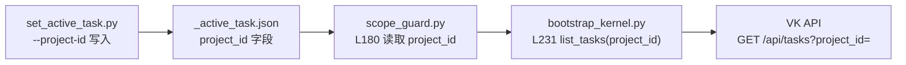

**改造后**：`project_id` 仅用于 VK 只读推送（fire-and-forget），不参与执行链路：

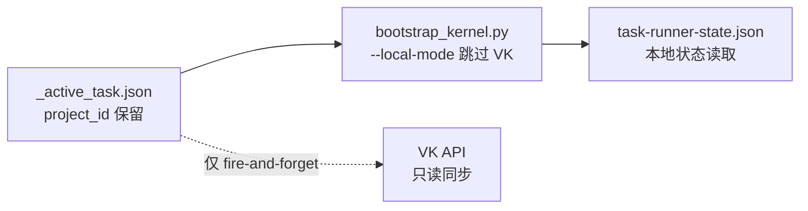

---

## Ch 9: 触发器集成设计（hooks-first + cron-watchdog）

### 9.1 三种触发器的职责边界

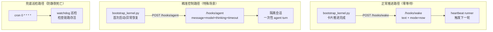

### 9.2 `/hooks/wake` 集成实现

在 `bootstrap_kernel.py` 的 `advance_card()` 成功后调用：

```python
import json
import logging
import os
from pathlib import Path

import requests

logger = logging.getLogger(__name__)

OPENCLAW_HOOKS_TOKEN = os.getenv("OPENCLAW_HOOKS_TOKEN", "")
HOOKS_WAKE_TIMEOUT = 5  # 秒

def resolve_gateway_url() -> str:
    env_url = os.getenv("OPENCLAW_GATEWAY", "").strip()
    if env_url:
        return env_url
    cfg = Path("~/.openclaw-dev/openclaw.json").expanduser()
    if cfg.exists():
        try:
            payload = json.loads(cfg.read_text(encoding="utf-8"))
            port = int(payload.get("gateway", {}).get("port", 0))
            if port > 0:
                return f"http://localhost:{port}"
        except Exception:
            pass
    return "http://localhost:18789"  # upstream default fallback

def _hooks_headers() -> dict[str, str]:
    """构造 hooks 认证 header。Gateway 要求 Bearer Token（hooks.ts:158-175）。"""
    if OPENCLAW_HOOKS_TOKEN:
        return {"Authorization": f"Bearer {OPENCLAW_HOOKS_TOKEN}"}
    logger.warning("OPENCLAW_HOOKS_TOKEN 未配置，hooks 调用将收到 401")
    return {}

def trigger_next_round(reason: str) -> None:
    """fire-and-forget 触发下一轮执行。失败不阻断主流程。"""
    gateway = resolve_gateway_url()
    try:
        resp = requests.post(
            f"{gateway}/hooks/wake",
            json={"text": reason, "mode": "now"},
            headers=_hooks_headers(),
            timeout=HOOKS_WAKE_TIMEOUT,
        )
        resp.raise_for_status()
        logger.info("hooks/wake 触发成功: %s", reason)
    except Exception as e:
        logger.warning("hooks/wake 触发失败（不阻断）: %s", e)
```

### 9.3 `/hooks/agent` 精准控制

仅在以下特殊场景使用（非默认路径）：

| 场景 | 触发条件 | 参数覆盖 |
|------|---------|---------|
| 首次启动 | `task-runner-state.json` 不存在 | `model=codex, thinking=low, timeoutSeconds=300` |
| 异常恢复 | `consecutiveErrors >= 3`（读取自 OpenClaw cron state，非本地 Schema 字段） | `model=codex, thinking=medium, timeoutSeconds=360` |
| 模型切换 | 用户通过 Telegram 指定模型 | `model=<用户指定>` |

```python
TELEGRAM_TO = os.getenv("CODER4_TELEGRAM_TO", "<TELEGRAM_USER_ID>")

def trigger_agent_turn(message: str, **overrides) -> None:
    """创建一次性隔离 agent turn，支持完整参数控制。

    注意：/hooks/agent 返回 202 { ok: true, runId }，为异步执行。
    实际 agent turn 结果通过系统事件注入主会话，无同步等待 API。
    调用方应通过轮询 task-runner-state.json 或等待下一次 heartbeat 获取结果。
    """
    payload = {
        "message": message,
        "model": overrides.get("model", "codex"),
        "thinking": overrides.get("thinking", "low"),
        "timeoutSeconds": overrides.get("timeout", 240),
        "deliver": True,
        "channel": "telegram",
        "to": TELEGRAM_TO,
    }
    gateway = resolve_gateway_url()
    try:
        resp = requests.post(
            f"{gateway}/hooks/agent",
            json=payload,
            headers=_hooks_headers(),
            timeout=HOOKS_WAKE_TIMEOUT,
        )
        if resp.status_code == 202:
            run_id = resp.json().get("runId", "unknown")
            logger.info("hooks/agent turn 创建成功（异步），runId=%s", run_id)
        else:
            resp.raise_for_status()
    except Exception as e:
        logger.warning("hooks/agent 触发失败（不阻断）: %s", e)
```

### 9.4 cron watchdog 巡检逻辑

cron 从 `*/3` 降级为 `0 * * * *`（每小时），payload 简化为 watchdog 巡检：

```
watchdog 巡检指令（约 500 字符）：
1. 读取 task-runner-state.json
2. 检查 last_heartbeat_at 是否超过 30 分钟
3. 若超时：输出 WATCHDOG_STALE 并触发 /hooks/wake
4. 若正常：输出 WATCHDOG_OK 并结束
5. 若文件不存在：输出 WATCHDOG_NO_STATE 并触发 /hooks/agent 初始化
```

### 9.5 触发器选择决策流程图

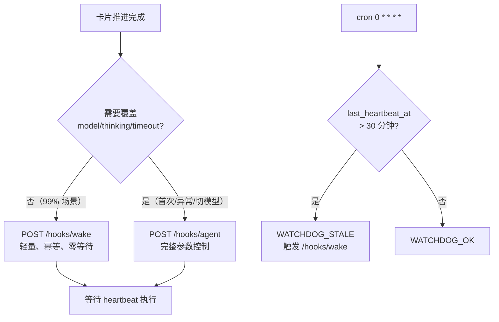

---

## Ch 10: 文件改造完整清单

### 10.1 仓内文件（需修改）

| # | 文件路径 | 行数 | 改造内容 | Phase |
|---|---------|------|---------|-------|
| 1 | `scripts/coder4_bootstrap_kernel.py` | 463 | L231 VK API 读取改本地；L382/L396 VK API 写入改本地；新增 `--local-mode`；新增 `trigger_next_round()` | P1 |
| 2 | `scripts/coder4_scope_guard.py` | 260 | L180 `project_id` 改为可选；移除 VK API 依赖 | P1 |
| 3 | `.cursor/scripts/set_active_task.py` | 141 | `--project-id` 改为可选参数（VK 只读推送时使用） | P1 |
| 4 | `scripts/wt-flow.sh` | 231 | 新增 next/verify/list 子命令（Ch 6 设计） | P1 |
| 5 | `docs/内部参考/任务拆解/_active_task.json` | ~20 | `project_id` 标记为可选 | P1 |
| 6 | `.cursor/commands/jjk-vkplan.md` | ~100 | 重写：移除 VK 硬拦截规则，改为本地状态驱动 | P2 |
| 7 | `.cursor/commands/jjk-vktodo.md` | ~150 | 重写：VK MCP 调用改为本地 JSON 操作 | P2 |
| 8 | `.cursor/commands/jjk-plan.md` | ~20 | 小改：移除 VK `project_id` 引用残留 | P2 |
| 9 | `CLAUDE.md` | ~5 | 小改：移除 VK 相关说明残留 | P2 |
| 10 | `.cursor/rules/mcp-routing.mdc` | ~5 | 小改：移除 VK MCP 路由规则残留 | P2 |
| 11 | `docs/开发文档/工作流/Coder4自动执行总控手册.md` | ~30 | 中改：更新触发器说明（cron → hooks-first）、状态文件路径 | P2 |
| 12 | `docs/开发文档/工作流/开发工作流.md` | ~20 | 小改：更新 wt-flow.sh 命令说明、VK 相关流程 | P2 |
| 13 | `docs/开发文档/工作流/OpenClaw自动执行故障字典.md` | ~15 | 小改：新增 hooks 相关故障条目 | P2 |
| 14 | `docs/开发文档/工作流/VibeKanban多Worktree本机开发测试.md` | ~10 | 小改：标注 VK 降级为只读后的流程变化 | P3 |
| 15 | `docs/内部参考/任务拆解/_templates/parallel_plan_template.md` | ~10 | 小改：移除 VK 同步相关模板字段 | P2 |
| 16 | `docs/SUMMARY.md` | ~5 | 小改：新增本设计方案的索引条目（如缺失） | P1 |

> **来源**：VK 依赖分析报告 3.4.2 节列出 21 个需修改文件，本表覆盖其中 16 个核心文件。其余 5 个为 docs 内部参考文档的小幅引用清理，可在 P3 阶段批量处理。

### 10.2 仓外文件（需修改）

| # | 文件路径 | 行数 | 改造内容 | Phase |
|---|---------|------|---------|-------|
| 6 | `~/.openclaw/workspace-dev/WORKFLOW_AUTO.md` | 460 | 剥离 Rule 2/8/26/27/29/31（Ch 8.2） | P2 |
| 7 | `~/.openclaw/workspace-dev/VK_AGENT_PROMPTS.md` | 628 | 重写 10 个 VK 重度依赖 section（Ch 8.3） | P2 |
| 8 | `~/.openclaw-dev/cron/jobs.json` | 73 | expr 改 `0 * * * *`；payload 简化为 watchdog（Ch 8.4） | P0 |
| 9 | `~/.openclaw/workspace-dev/state/coder4_scope_request.json` | ~10 | `project_id` 改为可选 | P1 |
| 10 | `.cursor/skills/vk-coder4-execution-guard/SKILL.md` | 146 | 重写为本地状态驱动 | P2 |

### 10.3 新增文件

| # | 文件路径 | 用途 | Phase |
|---|---------|------|-------|
| 11 | `.omc/state/task-runner-state.json` | 运行时状态唯一真理源（Ch 4 Schema） | P1 |
| 12 | `.omc/state/attempts/<card_id>/attempt_NNN.json` | 本地 attempt 记录（Ch 7 设计） | P1 |
| 13 | `.omc/state/task-ledger.jsonl` | 执行台账（从仓外迁移） | P1 |
| 14 | `scripts/coder4_vk_sync.py` | VK 只读推送脚本（fire-and-forget） | P2 |
| 15 | `scripts/coder4_watchdog.py` | watchdog 巡检逻辑（供 cron payload 调用） | P0 |
| 16 | `scripts/coder4_external_backup.sh` | 备份 `~/.openclaw*` 关键文件并生成 checksum（回滚前置） | P0 |
| 17 | `scripts/coder4_external_restore.sh` | 按 manifest + checksum 恢复仓外文件（不依赖 git） | P0 |

### 10.4 可删除文件

| # | 文件路径 | 删除原因 | Phase |
|---|---------|---------|-------|
| 18 | `~/.openclaw/workspace-dev/state/coder4_cron_state.json` | 被 `task-runner-state.json` 替代 | P1 |
| 19 | `scripts/vk_cleanup.sh` | VK 环境清理脚本，VK 降级后不再需要 | P3 |
| 20 | `scripts/vk_ports.sh` | VK 端口检查脚本，VK 降级后不再需要 | P3 |
| 21 | `scripts/vk_dev.sh` | VK 开发环境启动脚本，VK 降级后不再需要 | P3 |
| 22 | `scripts/vk_setup.sh` | VK 初始化脚本，VK 降级后不再需要 | P3 |
| 23 | `.cursor/commands/jjk-vksync.md` | VK 同步命令，被 `coder4_vk_sync.py` fire-and-forget 替代 | P3 |
| 24 | `.mcp.json` 中 VK 相关条目 | VK MCP 服务配置，P3 阶段移除（保留其他 MCP 条目） | P3 |

> **来源**：VK 依赖分析报告 3.4.4 节。`vk_task_cache.json` 等 VK 缓存文件在 VK 降级为只读后自然废弃，无需主动删除，故未列入。

### 10.5 改造量统计

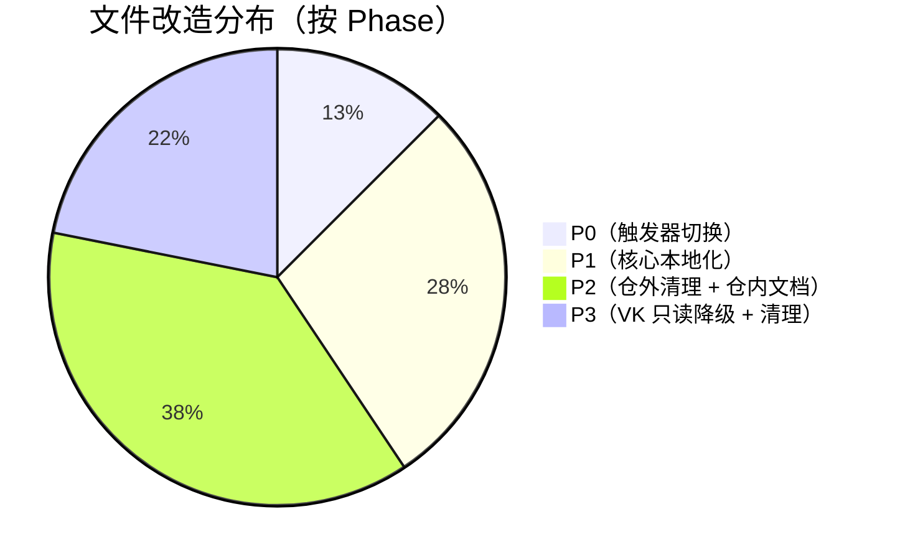

| Phase | 修改文件数 | 新增文件数 | 删除文件数 | 估算行数变更 |
|-------|----------|----------|----------|------------|
| P0 | 1 | 3 | 0 | ~170 行 |
| P1 | 6 | 3 | 1 | ~800 行 |
| P2 | 11 | 1 | 0 | ~700 行（重写为主） |
| P3 | 1 | 0 | 6 | ~50 行（清理为主） |
| **合计** | **19** | **5** | **7** | **~1650 行** |

---

## Ch 11: 重试与恢复策略

### 11.1 错误分类

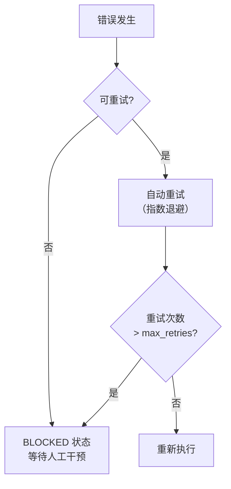

| 错误类型 | 可重试 | max_retries | 退避策略 | 示例 |
|---------|--------|-------------|---------|------|
| hooks 调用失败 | 是 | 3 | 指数退避（2/4/8秒） | `/hooks/wake` 超时 |
| VK 只读推送失败 | 是 | 2 | 固定 5 秒 | fire-and-forget 502 |
| wt-flow.sh 执行失败 | 是 | 2 | 固定 3 秒 | worktree 创建冲突 |
| task-runner-state.json 读取失败 | 是 | 3 | 指数退避 | 文件锁/权限 |
| vk_cards.json 格式错误 | **否** | - | - | JSON 解析失败 |
| _active_task.json 字段缺失 | **否** | - | - | task_key 为空 |
| acceptance_checks 验证失败 | **否** | - | - | 测试不通过 |
| merge 冲突 | **否** | - | - | rebase 失败 |
| 文件权限错误 | **否** | - | - | .omc/state/ 不可写 |

### 11.2 BLOCKED 状态处理

不可重试错误进入 BLOCKED 状态后的处理流程：

```python
BLOCKED_STATES = [
    "BLOCKED_PREFLIGHT",
    "BLOCKED_DEPENDS",
    "BLOCKED_KERNEL_ERROR",
    "BLOCKED_SCOPE_SWITCH",
    "BLOCKED_ATTEMPT_WORKDIR_MISSING",
    "BLOCKED_ATTEMPT_WORKDIR_MISMATCH",
]

def handle_blocked(state: str, reason: str, card_id: str) -> None:
    """BLOCKED 状态处理：记录 + 通知 + 等待人工干预。"""
    # 1. 写入 task-runner-state.json
    update_card_status(card_id, "blocked", blocked_reason=reason)
    # 2. 递增 no_increment_count
    increment_no_increment_count()
    # 3. Telegram 通知（fire-and-forget）
    notify_telegram(f"BLOCKED: {state} - {reason}")
    # 4. 防空转守卫（Rule 33）
    if get_no_increment_count() >= 3:
        enter_spin_guard_mode()
```

### 11.3 防空转守卫（Anti-Spin Guard）

同一 `target_task_id` + 同一 `blocked_reason` 连续出现时的递进策略：

| 连续次数 | 行为 | 说明 |
|---------|------|------|
| 1-2 | 正常执行 | 每轮尝试推进 |
| 3 | 进入 SPIN_GUARD | 仅做轻量检查（读取状态 + 输出摘要），不执行实质操作 |
| 每第 3 轮 | 允许一次 DONE_GATE_CHECK 探测 | 检测阻塞条件是否已解除 |
| 10+ | Telegram 升级通知 | 发送"长时间阻塞"警告给用户 |

### 11.4 hooks 降级链

当触发器链路出现故障时的降级策略：

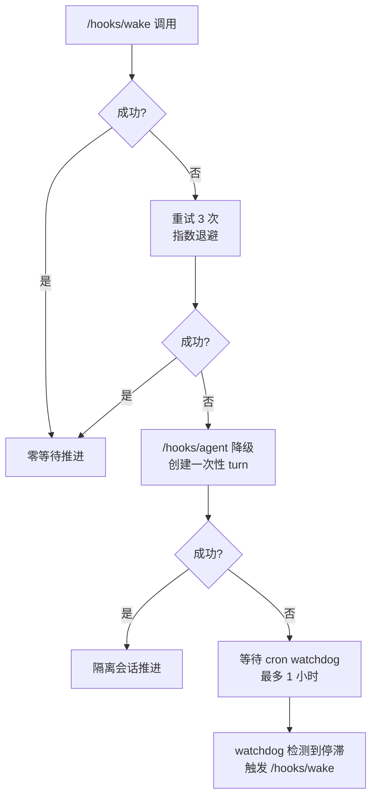

| 降级层级 | 触发条件 | 等待时间 | 恢复方式 |
|---------|---------|---------|---------|
| L0 正常 | `/hooks/wake` 成功 | 0 | - |
| L1 重试 | `/hooks/wake` 失败 | 2-14 秒 | 指数退避重试 |
| L2 降级 | 重试耗尽 | ~1 秒 | 切换到 `/hooks/agent` |
| L3 兜底 | hooks 服务不可用 | 最多 60 分钟 | cron watchdog 巡检 |

### 11.5 触发级互斥锁与幂等键（P0 必做）

仅做 `task-runner-state.json` 文件锁不足以避免重复推进。`/hooks/wake`、`/hooks/agent`、cron watchdog 可能在同一时间窗口重入，必须增加「执行级」互斥与幂等：

```python
import fcntl
import hashlib
import json
import time
from pathlib import Path

RUN_LOCK = Path(".omc/state/coder4-run.lock")
IDEMPOTENCY_FILE = Path(".omc/state/coder4-idempotency.json")
IDEMPOTENCY_WINDOW_SECONDS = 120

def build_idempotency_key(trigger: str, task_key: str, card_id: str | None) -> str:
    raw = f"{trigger}|{task_key}|{card_id or '-'}|{int(time.time() // 30)}"
    return hashlib.sha256(raw.encode("utf-8")).hexdigest()

def with_run_lock(fn):
    RUN_LOCK.parent.mkdir(parents=True, exist_ok=True)
    with RUN_LOCK.open("w") as fd:
        fcntl.flock(fd, fcntl.LOCK_EX)
        return fn()

def should_skip_duplicate(key: str, now_ts: float) -> bool:
    data = {}
    if IDEMPOTENCY_FILE.exists():
        data = json.loads(IDEMPOTENCY_FILE.read_text(encoding="utf-8"))
    last_ts = float(data.get(key, 0))
    if now_ts - last_ts < IDEMPOTENCY_WINDOW_SECONDS:
        return True
    data[key] = now_ts
    IDEMPOTENCY_FILE.write_text(json.dumps(data, ensure_ascii=False, indent=2), encoding="utf-8")
    return False
```

验收标准（P0.6）：
1. 并发触发（wake+agent+cron）时，日志中最多一个 `RUN_LOCK_ACQUIRED`；
2. 同一幂等键 120 秒内重复触发仅输出 `SKIP_DUPLICATE_EVENT`；
3. 不出现重复 `advance_card()` 或重复 `wt-flow.sh merge`。

---

## Ch 12: 风险矩阵

### 12.1 风险评估表

| # | 风险 | 概率 | 影响 | 综合 | 缓解措施 | 来源 |
|---|------|------|------|------|---------|------|
| R1 | OpenClaw gateway 不可用，hooks 全部失败 | 中 | 高 | **高** | cron watchdog 兜底 + `--local-mode` 可通过系统 crontab 独立调度 | 评审报告 5.2 |
| R2 | `task-runner-state.json` 非原子写入导致数据损坏 | 低 | 极高 | **高** | write-to-temp + `os.rename` 原子写入（Ch 4.5 已设计） | 评审报告 5.3 |
| R3 | WORKFLOW_AUTO.md 重写后 LLM 行为偏移 | 中 | 高 | **高** | 分阶段重写 + 每条规则独立验证 + A/B 对比测试 | 评审报告 2.5 |
| R4 | VK 只读推送积压导致状态不一致 | 中 | 低 | **低** | fire-and-forget 策略 + 定期全量同步（每小时） | VK 报告 7.6 |
| R5 | heartbeat 上下文膨胀（transcript 不 pruning） | 中 | 中 | **中** | 使用隔离会话（`heartbeat.session`）+ 每 3 张卡片完成后重置会话。**代码实证**（`heartbeat-runner.ts:386-403`）：pruning 仅在 LLM 回复为 `HEARTBEAT_OK`（无实质内容）时触发，coder4 的实质性输出（dispatch/seed/activate）**不会触发 pruning**。按每轮 ~2000 token 估算，6 张卡片串行执行约 108K token，可能接近上下文窗口。**重置策略**：(1) 每完成 3 张卡片后，通过 `heartbeat.session` 配置切换到新会话键（如 `coder4-batch-{N}`）；(2) 重置时保留 `task-runner-state.json` 和 `_active_task.json` 作为上下文恢复源（这两个文件在新会话中会被重新读取）；(3) 重置前将当前会话的关键决策记录追加到 `coder4_task_ledger.jsonl` | 研究报告 2.3 |
| R6 | `project_id` 链路断裂导致 VK 同步失败 | 低 | 低 | **低** | `project_id` 仅用于只读推送，断裂不影响执行 | Ch 8.5 |
| R7 | wt-flow.sh 新增子命令引入 regression | 低 | 中 | **低** | 新增子命令独立测试 + 现有子命令回归测试 | Ch 6 |
| R8 | 3000 字符 payload 迁移遗漏关键约束 | 中 | 高 | **高** | 逐条对照迁移 + 迁移前后行为对比测试（见附录 B.4 迁移对照 checklist） | 评审报告 2.5 |
| R9 | OpenClaw 升级导致 hooks API 行为变更 | 低 | 高 | **中** | 锁定 OpenClaw 版本号；hooks 调用封装为独立模块，升级时仅需修改适配层；P0 验证脚本可复用为升级后回归测试 | 运维风险（新增） |
| R10 | `heartbeat.prompt` 字段被 OpenClaw 更新覆盖 | 低 | 中 | **低** | 将关键约束迁移到 `AGENTS.md`（不依赖 heartbeat.prompt）；heartbeat.prompt 仅保留 watchdog 巡检指令（丢失可重新注入） | 运维风险（新增） |
| R11 | `coder4_cron_state.json` → `task-runner-state.json` 迁移期间状态丢失 | 低 | 高 | **中** | P1 开始前先备份旧状态文件；迁移脚本执行前暂停 cron（`0 0 31 2 *`）；迁移完成后恢复 cron 并验证状态完整性 | 数据迁移风险（新增） |
| R12 | `OPENCLAW_HOOKS_TOKEN` 未配置或 token 过期/轮换导致 hooks 全部 401 | 中 | 高 | **高** | P0 前置验证脚本（Ch 14.2）首先检查 token 配置；`_hooks_headers()` 在 token 为空时输出 warning 日志；cron watchdog 作为无 token 依赖的兜底路径；token 轮换时需同步更新环境变量并重新运行前置验证 | 代码实证 C2（新增） |
| R13 | wake/agent/cron 并发触发导致重复执行（重复 advance/merge） | 中 | 高 | **高** | 增加执行级互斥锁 + 幂等键（Ch 11.5）；将重复事件写入 `SKIP_DUPLICATE_EVENT` 日志并丢弃 | 本轮评审新增 |

### 12.2 风险热力图


### 12.3 缓解措施优先级

| 优先级 | 缓解措施 | 对应风险 | 实施时机 |
|--------|---------|---------|---------|
| P0 | 原子写入（write-to-temp + rename） | R2 | P1 阶段首日 |
| P0 | cron watchdog 兜底配置 | R1 | P0 阶段 |
| P0 | hooks token 前置验证 + 环境变量配置 | R12 | P0 阶段首日 |
| P0 | 执行级互斥锁 + 幂等键（run lock + idempotency key） | R13 | P0 阶段首日 |
| P1 | 3000 字符 payload 逐条对照迁移清单 | R8 | P2 阶段开始前 |
| P1 | WORKFLOW_AUTO.md 规则级 A/B 测试 | R3 | P2 阶段 |
| P2 | VK 定期全量同步 | R4 | P3 阶段 |
| P2 | heartbeat 隔离会话配置 | R5 | P1 阶段 |

---

## Ch 13: 分阶段实施路线图

### 13.1 Phase 总览

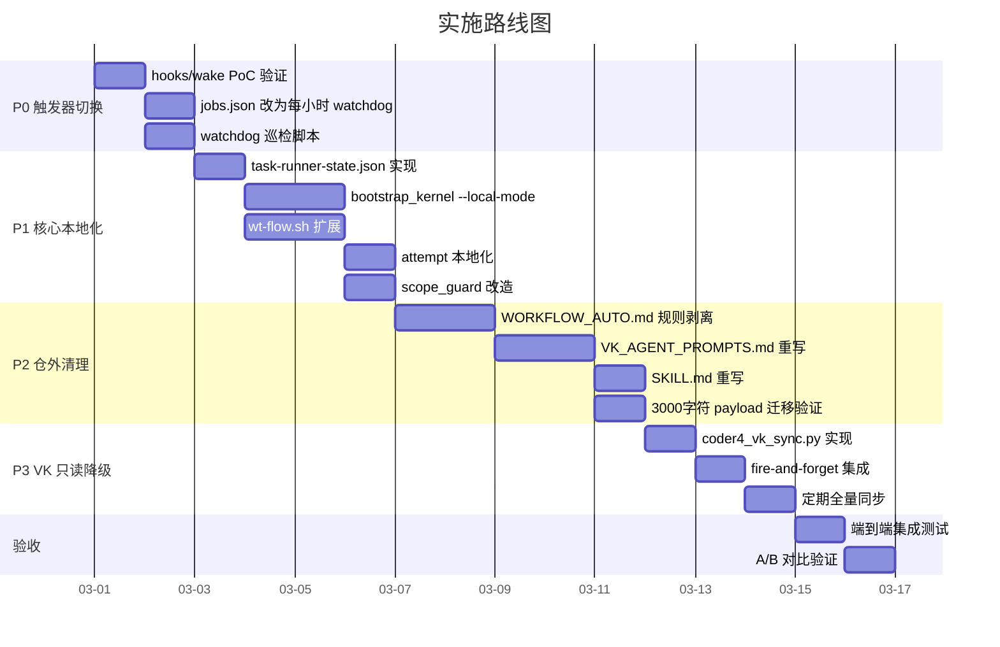

### 13.2 各 Phase 详细说明

#### Phase 0: 触发器切换（1-2 天）

**目标**：验证 hooks API 可用性，将 cron 降级为 watchdog。

| 步骤 | 内容 | 验收标准 |
|------|------|---------|
| P0.1 | 运行 `scripts/coder4_external_backup.sh` 备份仓外文件（含 checksum） | 生成 `.omc/backup/external-<timestamp>/manifest.tsv` 与 `checksums.sha256` |
| P0.2 | 确认 `OPENCLAW_HOOKS_TOKEN` 环境变量已配置，运行 Ch 14.2 前置验证脚本验证 gateway（按运行配置）和认证（Bearer Token） | 返回 200（wake）/ 202（agent），无 401/403；日志打印实际 gateway URL（当前 dev 为 19002） |
| P0.3 | `curl POST /hooks/agent` 验证完整参数 | 返回 202（异步执行），响应含 `runId`；`model`/`thinking`/`timeoutSeconds` 参数生效 |
| P0.4 | `jobs.json` 改 `expr: "0 * * * *"` | cron 每小时触发一次 |
| P0.5 | 编写 `coder4_watchdog.py` | watchdog 检测停滞并触发 wake |
| P0.6 | 增加执行互斥锁 + 幂等键（Ch 11.5） | 并发触发场景下仅允许一个 active turn，重复事件被跳过 |

**回滚方案**：先将 `jobs.json` 的 `expr` 改回 `*/3 * * * *`，再执行 `scripts/coder4_external_restore.sh <backup-dir>` 恢复仓外文件。

#### Phase 1: 核心本地化（5-7 天）

**目标**：bootstrap_kernel 完全脱离 VK API，使用本地状态驱动。

| 步骤 | 内容 | 验收标准 |
|------|------|---------|
| P1.1 | 实现 `task-runner-state.json` 读写（含原子写入） | 状态文件可读写，断电不损坏 |
| P1.2 | `bootstrap_kernel.py` 新增 `--local-mode` | L231 从本地读取，L382/L396 写本地 |
| P1.3 | `wt-flow.sh` 新增 next/verify/list，并将 merge 默认策略改为 fail-fast（`WT_FLOW_ALLOW_AUTOCOMMIT=1` 才允许自动提交） | 三个子命令通过单元测试；主仓 dirty 时默认报错退出，不自动污染主线 |
| P1.4 | attempt 本地化（`.omc/state/attempts/`） | attempt 创建/查询/汇总正常 |
| P1.5 | `scope_guard.py` 移除 VK 依赖 | `--local-mode` 下不调用 VK API |
| P1.6 | `trigger_next_round()` 集成到 advance_card | 卡片推进后零等待触发下一轮 |

**回滚方案**：移除 `--local-mode` 参数，恢复 VK API 调用。

#### Phase 2: 仓外清理（4-5 天）

**目标**：WORKFLOW_AUTO.md 和 VK_AGENT_PROMPTS.md 完成 VK 语义剥离。

| 步骤 | 内容 | 验收标准 |
|------|------|---------|
| P2.1 | WORKFLOW_AUTO.md 剥离 6 条 VK 规则 | 剩余规则无 VK 引用 |
| P2.2 | VK_AGENT_PROMPTS.md 重写 10 个 section | 所有 section 使用本地状态语义 |
| P2.3 | SKILL.md 重写 | 执行守卫使用本地状态驱动 |
| P2.4 | 3000 字符 payload 逐条对照验证 | 每条约束在新体系中有对应实现 |

**回滚方案**：执行 `scripts/coder4_external_restore.sh <backup-dir>` 恢复仓外文件（不依赖 git 管理 `~/.openclaw*`）。

#### Phase 3: VK 只读降级（2-3 天）

**目标**：VK 降级为只读展示层，推送失败不影响执行。

| 步骤 | 内容 | 验收标准 |
|------|------|---------|
| P3.1 | 实现 `coder4_vk_sync.py` | fire-and-forget 推送到 VK |
| P3.2 | 集成到 advance_card 后 | 卡片状态变更后异步推送 |
| P3.3 | 定期全量同步（每小时） | VK 看板与本地状态最终一致 |

**回滚方案**：禁用 `coder4_vk_sync.py`，VK 看板冻结在最后同步状态。

### 13.3 工时估算汇总

| Phase | 内容 | 乐观 | 悲观 | 期望值 |
|-------|------|------|------|--------|
| P0 | 触发器切换 | 1 天 | 2 天 | 1.5 天 |
| P1 | 核心本地化 | 5 天 | 7 天 | 6 天 |
| P2 | 仓外清理 | 4 天 | 5 天 | 4.5 天 |
| P3 | VK 只读降级 | 2 天 | 3 天 | 2.5 天 |
| 验收 | 集成测试 + A/B | 1 天 | 2 天 | 1.5 天 |
| **合计** | | **13 天** | **19 天** | **16 天** |

> **对照**：评审报告独立评估为 10-16 人天，VK 报告估算 11-18 人天。本方案估算 13-19 天，差异 3 天的来源分解如下：
>
> | 差异项 | 本方案估算 | 评审报告估算 | 差异原因 |
> |--------|-----------|------------|---------|
> | P2 仓外文件重写 | 4-5 天 | ~2-3 天 | 评审报告未充分计入 WORKFLOW_AUTO（460 行）和 VK_AGENT_PROMPTS（628 行）的逐条重写工作量 |
> | 端到端验收 | 1-2 天 | 未单独估算 | 本方案新增 A/B 对比验证环节（payload 迁移前后行为等价性） |
> | P1 wt-flow.sh 扩展 | 1.5 天 | ~0.5 天 | 代码实证（eval-code-verified H6）：新增 next/verify 需引入 jq 依赖和 `task-runner-state.json` 读写逻辑，从"小改"变为"中等改造" |

---

## Ch 14: 开放问题与待决事项

### 14.1 待决事项清单

| # | 问题 | 影响范围 | 决策人 | 截止时间 | 状态 |
|---|------|---------|--------|---------|------|
| Q1 | `/hooks/wake` 的 gateway 端口和认证方式 | P0 阶段能否启动 | 运维 | P0 开始前 | **已确认**：认证为 Bearer Token（`hooks.ts:158-175`，`server-http.ts:253-291`）；端口采用运行配置优先（upstream 默认 18789，当前 dev 配置 `~/.openclaw-dev/openclaw.json` 为 19002，日期 2026-02-28） |
| Q2 | `/hooks/agent` 是否支持 `thinking` 和 `timeoutSeconds` 参数 | 精准控制路径是否可用 | 运维 | P0 开始前 | **已确认**：`normalizeAgentPayload()` 接受 `thinking` 与 `timeoutSeconds`（`hooks.ts:361-368`），`server-http.ts:359` 返回 202 + runId（异步） |
| Q3 | `heartbeat.prompt` 是否有长度限制 | 3000 字符约束能否完整注入 | 运维 | P0 开始前 | 待验证 |
| Q4 | WORKFLOW_AUTO.md 重写后是否需要用户审批 | P2 阶段流程 | 用户 | P2 开始前 | 待确认 |
| Q5 | VK 只读推送的频率上限（防 rate limit） | P3 fire-and-forget 策略 | 运维 | P3 开始前 | 待确认 |
| Q6 | `container_ref` 和 `agent_working_dir` 的本地替代是否完备 | attempt 系统完整性 | 架构 | P1 阶段 | 已解决（见 Ch 7.3-7.4） |
| Q7 | 是否需要保留 `--vk-api-base` 参数作为降级入口 | 回滚策略完整性 | 架构 | P1 阶段 | 待决策 |

### 14.2 前置验证清单（P0 阶段必须完成）

```python
# P0 前置验证脚本（建议在实施前运行）
import json
import os
from pathlib import Path

import requests

TOKEN = os.getenv("OPENCLAW_HOOKS_TOKEN", "")

def resolve_gateway_url() -> str:
    env_url = os.getenv("OPENCLAW_GATEWAY", "").strip()
    if env_url:
        return env_url
    cfg = Path("~/.openclaw-dev/openclaw.json").expanduser()
    if cfg.exists():
        payload = json.loads(cfg.read_text(encoding="utf-8"))
        port = int(payload.get("gateway", {}).get("port", 0))
        if port > 0:
            return f"http://localhost:{port}"
    return "http://localhost:18789"  # upstream default fallback

GATEWAY = resolve_gateway_url()

def _headers() -> dict:
    """构造认证 header（hooks.ts:158-175 要求 Bearer Token）。"""
    if TOKEN:
        return {"Authorization": f"Bearer {TOKEN}"}
    print("WARN: OPENCLAW_HOOKS_TOKEN 未配置，hooks 调用将收到 401")
    return {}

def verify_hooks_token():
    """Q0: 验证 hooks token 已配置。"""
    assert TOKEN, "OPENCLAW_HOOKS_TOKEN 环境变量未设置，hooks 调用将收到 401"
    print("hooks token: PASS")

def verify_hooks_wake():
    """Q1: 验证 /hooks/wake 端口和认证。"""
    resp = requests.post(f"{GATEWAY}/hooks/wake",
        json={"text": "P0 验证", "mode": "now"},
        headers=_headers(), timeout=5)
    assert resp.status_code == 200, f"hooks/wake 失败: {resp.status_code} {resp.text}"
    print(f"hooks/wake: PASS ({GATEWAY})")

def verify_hooks_agent():
    """Q2: 验证 /hooks/agent 完整参数（返回 202 异步）。"""
    resp = requests.post(f"{GATEWAY}/hooks/agent", json={
        "message": "P0 验证",
        "model": "codex", "thinking": "low", "timeoutSeconds": 60,
    }, headers=_headers(), timeout=5)
    assert resp.status_code == 202, f"hooks/agent 失败: 期望 202，实际 {resp.status_code}"
    run_id = resp.json().get("runId")
    assert run_id, "hooks/agent 返回中缺少 runId"
    print(f"hooks/agent: PASS (runId={run_id})")

if __name__ == "__main__":
    verify_hooks_token()
    verify_hooks_wake()
    verify_hooks_agent()
    print("P0 前置验证全部通过")
```

### 14.3 决策记录表（ADR）

| ADR# | 决策 | 理由 | 替代方案 | 日期 |
|------|------|------|---------|------|
| ADR-001 | hooks-first + cron-watchdog 混合方案 | 零等待 + 兜底，风险最低 | 纯 heartbeat（5/10）、纯 cron `*/1`（67% 改善） | 2026-02-27 |
| ADR-002 | VK 降级为只读展示层 | 五方一致性是脆弱性根源 | 修复 VK 稳定性（0.5-1 天但不解决根因） | 2026-02-27 |
| ADR-003 | 本地状态三层分级 | 职责清晰，避免新的一致性问题 | 单一状态文件（过于臃肿） | 2026-02-27 |
| ADR-004 | 原子写入（write-to-temp + rename） | 防止断电/崩溃导致状态损坏 | 直接写入（评审报告风险 #3） | 2026-02-27 |
| ADR-005 | Telegram ID 从环境变量读取 | 避免硬编码，支持多环境 | 硬编码在 jobs.json 中 | 2026-02-27 |
| ADR-006 | 3000 字符 payload 分层迁移 | 固定约束放 AGENTS.md，动态清单放 heartbeat.prompt | 全部放 HEARTBEAT.md（可被 LLM 修改） | 2026-02-27 |
| ADR-007 | 不采纳"方案 B：修复 VK 稳定性"（评审报告 4 节） | 方案 B 仅在 bootstrap_kernel.py 中加入 retry + fallback to local（0.5-1 天），属于临时补丁，不解决五方一致性根因。与设计原则 P2"拒绝补丁"冲突。VK 从执行链路移除后，稳定性问题自然消失 | 方案 B 作为 0.5-1 天的临时补丁 | 2026-02-27 |
| ADR-008 | Gateway 使用“运行配置优先”解析，认证方式为 Bearer Token | 代码实证：`types.gateway.ts:280` 的 18789 仅为 upstream 默认；`~/.openclaw-dev/openclaw.json` 当前端口为 19002（2026-02-28）；`hooks.ts:158-175`、`server-http.ts:253-291` 要求 Bearer Token / X-OpenClaw-Token header | 写死固定端口（跨环境风险高） | 2026-02-28 |
| ADR-009 | 仓外文件回滚必须脚本化（backup + checksum + restore） | `~/.openclaw*` 不受 git 管理，纯“git restore”不可用；P0 需可验证回滚闭环 | 人工拷贝（不可审计、易漏文件） | 2026-02-28 |
| ADR-010 | `wt-flow.sh` 默认 fail-fast，auto-commit 仅显式开关启用 | 默认 auto-commit 会污染主线历史；执行链路应优先可控和可追溯 | 永久保留自动提交默认开启 | 2026-02-28 |

---

## Ch 15: 主机部署基线（Single-Host）

> 适用范围：OpenClaw、Codex、项目代码仓库、本地依赖服务均部署在同一主机。  
> 目标：在不牺牲本地执行能力的前提下，建立可审计、可恢复、可演练的最小安全隔离边界。

### 15.1 部署边界定义

| 边界 | 约束 | 验收标准 |
|------|------|---------|
| 网络边界 | Gateway 仅监听 `127.0.0.1`（或 Unix Socket），禁止公网直接暴露 `/hooks/*` | `ss -ltnp`/`lsof -i` 检查无 `0.0.0.0:<gateway_port>` |
| 身份边界 | OpenClaw 进程使用非 root 账户运行（如 `openclaw`） | `ps -ef | grep openclaw` 不出现 root |
| 文件边界 | 状态与配置目录最小权限：目录 `700`，敏感文件 `600` | `ls -ld`/`ls -l` 权限符合基线 |
| 执行边界 | hooks 仅触发已登记脚本，禁止任意 shell 拼接执行 | 所有执行入口都有白名单/参数校验 |
| 数据边界 | `.omc/state` 与 `~/.openclaw*` 纳入备份与恢复闭环 | 可在 30 分钟内完成恢复演练 |

### 15.2 主机部署拓扑（推荐）

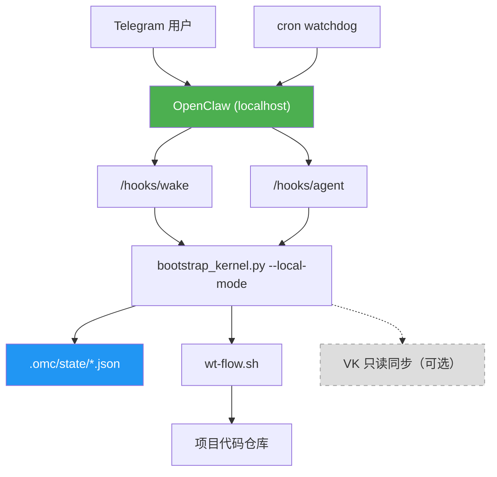

### 15.3 主机安全基线（P0 强制）

| 类别 | 基线要求 | 实施动作 |
|------|---------|---------|
| hooks 鉴权 | `/hooks/*` 必须携带 Bearer Token；token 长度不少于 32 字符 | 通过环境变量 `OPENCLAW_HOOKS_TOKEN` 注入；空值启动即失败 |
| token 轮换 | 30 天轮换一次；泄漏后 10 分钟内吊销 | 维护 `token_rotated_at` 台账；轮换后执行 Ch 14.2 脚本 |
| 网关暴露面 | 默认本地监听，禁止公网直接访问 hooks | 若需远程入口，必须在反向代理层做 IP allowlist + TLS |
| 进程权限 | 禁止 root 运行，限制工作目录访问范围 | 使用独立用户 + 独立 HOME + 最小文件 ACL |
| 命令执行 | `acceptance_checks` 仅允许白名单前缀 | 复用 Ch 6.4 的 `ALLOWED_PREFIXES` 校验策略 |
| 日志脱敏 | 不输出 token、cookie、完整 webhook payload | 增加日志过滤器，命中关键字后掩码 |

### 15.4 守护进程与自恢复策略

| 宿主环境 | 推荐守护器 | 优点 | 最低配置要求 |
|---------|-----------|------|-------------|
| Linux | `systemd` | 生命周期管理完善，重启与限频策略成熟 | `Restart=always`、`RestartSec=5`、`StartLimitBurst=5` |
| macOS | `launchd` | 与本机生态兼容，适合开发主机常驻 | `KeepAlive=true`、失败重启、日志重定向 |
| 跨平台开发场景 | `pm2`（次选） | 上手快，统一命令 | 需额外保障开机自启与日志轮转 |

守护策略要求（统一）：
1. 启动前探活：检查 `OPENCLAW_HOOKS_TOKEN`、`OPENCLAW_GATEWAY`、状态目录可写；
2. 启动后探活：执行一次 `/hooks/wake` 本地回环验证；
3. 连续重启熔断：5 分钟内超过 5 次失败则告警并暂停自动拉起。

### 15.5 目录与权限基线

| 路径 | 用途 | 权限建议 | 备注 |
|------|------|---------|------|
| `.omc/state/` | 运行时状态（state、attempt、ledger） | `700` | 仅执行用户可读写 |
| `~/.openclaw-dev/openclaw.json` | OpenClaw 配置 | `600` | 不得提交到仓库 |
| `~/.openclaw-dev/cron/jobs.json` | cron/watchdog 配置 | `600` | 变更需备份 checksum |
| `.omc/backup/` | 备份归档 | `700` | 每次恢复后保留最近 7 份 |

### 15.6 主机模式新增 ADR（建议）

| ADR# | 决策 | 理由 | 替代方案 |
|------|------|------|---------|
| ADR-011 | 生产与开发统一使用单主机最小权限模型 | 保持 Codex/代码/服务在同机的执行闭环，避免能力割裂 | VPS 编排 + 主机执行双平面 |
| ADR-012 | hooks 默认仅本地监听，公网入口必须经反代与 allowlist | 直接暴露 hooks 风险高，且难以审计 | 直接开放公网端口 |

---

## Ch 16: 主机故障处置 SOP

### 16.1 故障分级

| 等级 | 触发条件 | 处置时限 | 通知策略 |
|------|---------|---------|---------|
| S1（阻断） | 无法触发 hooks / 状态文件损坏 / 重复 merge | 15 分钟内 | 立即 Telegram 升级通知 |
| S2（降级） | VK 同步失败 / watchdog 告警频发 | 2 小时内 | 记录并定时汇总通知 |
| S3（观察） | 单次重试失败后恢复 | 24 小时内复盘 | 日志留痕即可 |

### 16.2 标准处置流程

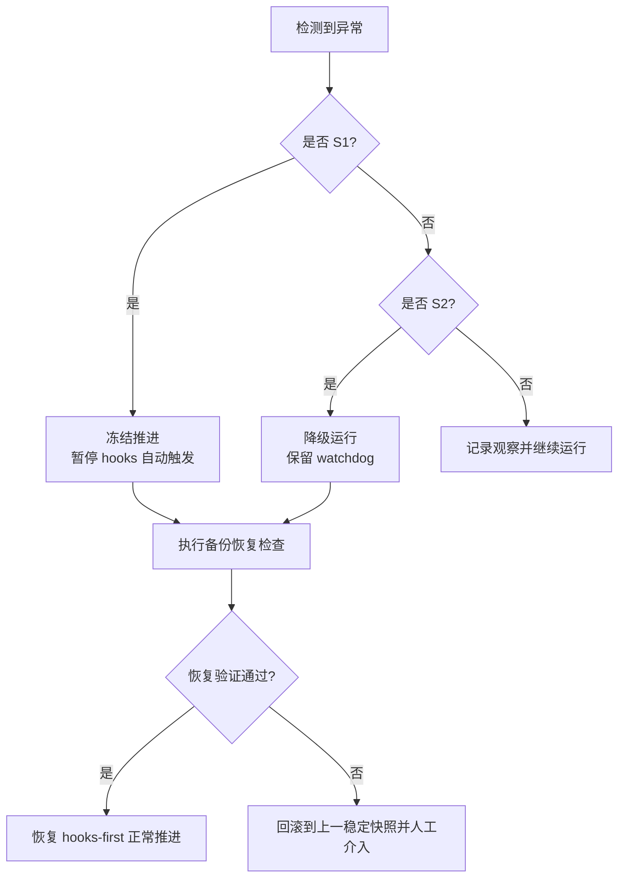

### 16.3 常见故障处置表

| 故障码/现象 | 判定 | 首选动作 | 兜底动作 |
|------------|------|---------|---------|
| `401 hooks unauthorized` | token 缺失/过期 | 更新 `OPENCLAW_HOOKS_TOKEN`，重跑 Ch 14.2 | 临时仅保留 cron watchdog，暂停 wake 自动触发 |
| `task-runner-state.json` 解析失败 | 文件损坏/并发写冲突 | 从 `.json.bak` 恢复并校验 Schema | 回滚最近备份目录并重放 ledger |
| 连续 `SKIP_DUPLICATE_EVENT` 激增 | 上游重复触发风暴 | 检查调用方幂等键与触发频率 | 暂时提升幂等窗口到 180 秒 |
| `wt-flow merge conflict` | 分支冲突 | 标记当前卡片 `blocked`，保留 worktree 人工处理 | 按 Ch 6.7.2 级联阻塞后续依赖卡 |
| watchdog 连续 `WATCHDOG_STALE` | 主链路静默死亡 | 手动触发 `/hooks/agent` 做恢复轮次 | 重启守护进程并执行探活脚本 |

### 16.4 恢复后验证（必须全绿）

| 验证项 | 命令/方式 | 通过标准 |
|------|----------|---------|
| hooks 鉴权 | 运行 Ch 14.2 脚本 | wake=200，agent=202 |
| 状态一致性 | 比对 `_active_task.json` / `task-runner-state.json` | `task_key` 一致，`current_card` 合法 |
| 执行幂等性 | 回放同一触发事件两次 | 第二次命中 `SKIP_DUPLICATE_EVENT` |
| done_gate 可用性 | 对当前卡片执行 `verify` | 结果可写入 attempt 与 ledger |
| 通知链路 | 发送一次测试通知 | Telegram 收到三行结论模板 |

---

## Ch 17: 上线门禁清单（Go/No-Go）

### 17.1 Go/No-Go 判定规则

| 类别 | 门禁项 | 结果要求 | 未达标处理 |
|------|------|---------|-----------|
| 安全 | hooks token、监听地址、非 root 运行 | 全部 PASS | 直接 No-Go |
| 可靠性 | 原子写入、文件锁、幂等键 | 全部 PASS | 直接 No-Go |
| 可恢复性 | 备份脚本 + 恢复脚本 + 演练记录 | 全部 PASS | 延后上线 |
| 可观测性 | 日志字段完整、关键告警可达 | 全部 PASS | 延后上线 |
| 功能性 | 串行推进、done_gate、watchdog 兜底 | 全部 PASS | 延后上线 |

### 17.2 上线前检查清单（P0/P1）

| # | 检查项 | 验证方式 | 状态 |
|---|------|---------|------|
| G-01 | `OPENCLAW_HOOKS_TOKEN` 已配置并可轮换 | Ch 14.2 + 轮换演练 | 待执行 |
| G-02 | gateway 仅本地监听 | `lsof -i` / 配置审计 | 待执行 |
| G-03 | `task-runner-state.json` 原子写入生效 | 人工注入中断测试 | 待执行 |
| G-04 | 触发互斥锁生效（wake+agent+cron 并发） | 并发压测日志验证 | 待执行 |
| G-05 | `wt-flow.sh` 主仓 dirty 时 fail-fast | 集成测试验证 | 待执行 |
| G-06 | `BLOCKED` 告警和恢复 SOP 可执行 | 故障演练记录 | 待执行 |
| G-07 | 备份/恢复脚本可在 30 分钟内完成闭环 | 演练报告 | 待执行 |
| G-08 | VK 同步失败不影响主链路 | 断开 VK 服务演练 | 待执行 |

### 17.3 上线后 72 小时观察指标

| 指标 | 目标阈值 | 告警阈值 | 采集来源 |
|------|---------|---------|---------|
| 平均推进延迟（卡片 done -> 下一轮触发） | < 10 秒 | > 60 秒 | hooks 调用日志 + state 时间戳 |
| hooks 调用成功率 | >= 99% | < 95% | gateway access log |
| 重复事件跳过率 | < 5% | > 20% | `SKIP_DUPLICATE_EVENT` 计数 |
| BLOCKED 持续时间 | < 30 分钟 | > 2 小时 | `task-runner-state.json` + Telegram 通知 |
| watchdog 触发频率 | <= 3 次/天 | > 12 次/天 | cron 运行日志 |

### 17.4 上线判定模板

| 结论 | 条件 | 操作 |
|------|------|------|
| Go | G-01~G-08 全部通过，且 72 小时指标未触发告警阈值 | 进入常态运行，按周复盘 |
| Conditional Go | 存在 1-2 项非安全类轻微不达标 | 24 小时内补齐并复验 |
| No-Go | 任一安全门禁或可靠性门禁失败 | 立即回滚，按 Ch 16 执行故障处置 |

### 17.5 全量打钩板文件

为支持“大任务跨会话推进”，新增独立打钩板清单文档：

- `docs/内部参考/迭代需求/自动化大型任务开发_全量打钩板清单.md`

使用规则：
1. 每次会话开始前先填写「6.2 会话工作包模板」；
2. 每完成一个 Phase，必须勾选对应 Exit Gate；
3. 仅当 P0~P3 Exit Gate 全绿时，才允许进入 RUN 观测阶段。

---

## 附录 A: VK API 调用完整清单

### A.1 bootstrap_kernel.py 中的 VK API 调用

| 行号 | 方法 | API 端点 | 用途 | 改造方式 |
|------|------|---------|------|---------|
| L194-200 | `list_tasks()` | `GET /api/tasks?project_id=<id>` | 获取任务列表 | 改为读取 `task-runner-state.json` |
| L231 | `build_kernel_context()` | 调用 `list_tasks()` | 构建内核上下文（唯一读取点） | `--local-mode` 跳过 |
| L370-390 | `apply_action("seed")` | `POST /api/tasks` | 创建新任务（seed） | 改为写入 `task-runner-state.json` |
| L392-404 | `apply_action("activate")` | `PATCH /api/tasks/{task_id}` | 激活任务（更新状态） | 改为更新 `task-runner-state.json` |

> 注：`apply_action("dispatch")` 不执行 VK API 调用，返回 `{"performed": False}`，由 `wt-flow.sh` 直接处理。

### A.2 其他脚本的 VK 引用

| 文件 | 引用方式 | 用途 | 改造方式 |
|------|---------|------|---------|
| `coder4_scope_guard.py` L180 | 读取 `project_id` | 传递给 bootstrap_kernel | 改为可选 |
| `set_active_task.py` L35 | `--project-id` 参数 | 写入 `_active_task.json` | 改为可选 |
| `WORKFLOW_AUTO.md` Rule 26/27/29/31 | VK MCP/API 引用 | LLM 行为约束 | 重写为本地语义 |
| `VK_AGENT_PROMPTS.md` §0/3/8/9/12-15/17/21 | VK 操作模板 | prompt 模板 | 重写为本地语义 |
| `SKILL.md` 全文 | VK 执行守卫 | 执行守卫 | 重写为本地状态驱动 |
| `jobs.json` payload | `--vk-api-base` 参数 | cron 注入 | 移除 VK 参数 |

### A.3 VK API 调用统计

| 类型 | 调用数 | 改造后 |
|------|--------|--------|
| 读取（GET） | 1 处（L231） | 0（本地读取） |
| 写入（POST/PATCH） | 2 处（L382 seed + L396 activate） | 0（本地写入） |
| 间接引用（prompt/规则） | ~50 处（仅统计 prompt/规则中的间接引用；VK 报告 3.1 节统计全类型引用约 156 处，评审报告修正为约 203 处） | 0（重写） |
| **合计** | **~53 处** | **0** |

---

## 附录 B: 3000 字符 payload 原文与分解

### B.1 payload 五大组成部分

当前 `jobs.json` 中 coder4 的 `payload.message`（约 3000 字符）可分解为以下五个语义块：

| # | 语义块 | 字符数（估） | 内容摘要 | 迁移目标 |
|---|--------|------------|---------|---------|
| 1 | 固定真理源路径声明 | ~300 | 5 个文件路径（active_task、规则文档、提示词模板、cron state、ledger） | `AGENTS.md` 或 `heartbeat.prompt` |
| 2 | 硬顺序执行协议 | ~800 | 6 个步骤 + 子步骤（读取 active_task → scope guard → bootstrap_kernel → 分支决策 → 证据 → 输出） | `WORKFLOW_AUTO.md`（重写后） |
| 3 | 分支决策矩阵 | ~1000 | 7 个 action 分支（preflight_blocked、seed、activate、dispatch/inprogress、dispatch/inreview、blocked_depends、all_done） | `WORKFLOW_AUTO.md`（重写后） |
| 4 | 硬约束清单 | ~600 | 10+ 条禁止规则（禁止 manual-db-fallback、禁止全量读取、禁止空转等） | `AGENTS.md`（固定约束层） |
| 5 | 输出格式模板 | ~300 | 三行固定格式（结论/当前动作/证据） | `VK_AGENT_PROMPTS.md`（重写后 §6） |

### B.2 迁移策略

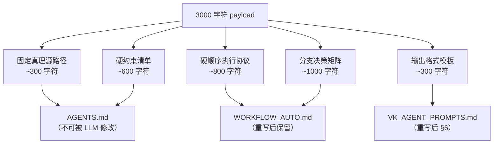

**迁移原则**：
- 固定约束（路径声明、禁止规则）→ `AGENTS.md`（不可被 LLM 修改的固定层）
- 执行协议（步骤、分支）→ `WORKFLOW_AUTO.md`（可按需读取的规则层）
- 输出模板 → `VK_AGENT_PROMPTS.md` 重写后的对应 section

### B.3 迁移后 payload 简化

迁移后 cron watchdog 的 payload 从 3000 字符简化为约 500 字符：

```
watchdog 巡检：
1. 读取 .omc/state/task-runner-state.json
2. 若 last_heartbeat_at 超过 30 分钟，输出 WATCHDOG_STALE
3. 若文件不存在，输出 WATCHDOG_NO_STATE
4. 否则输出 WATCHDOG_OK
规则：不执行实质操作，仅检测链路存活。
```

### B.4 payload 迁移逐条对照 checklist

> **用途**：P2 阶段执行 payload 迁移时，逐条核对每个约束是否已正确迁移到目标文件。全部勾选后方可认为迁移完成。
> **来源**：评审报告 2.5 节 + 批判性审查 C2

#### B.4.1 固定真理源路径声明（~300 字符 → AGENTS.md）

| # | 原约束摘要 | 迁移目标文件 | 迁移后位置 | 验证方式 | 状态 |
|---|-----------|------------|-----------|---------|------|
| P-01 | `_active_task.json` 路径声明 | `AGENTS.md` | §1 真理源路径 | `grep "_active_task" AGENTS.md` | 待迁移 |
| P-02 | `WORKFLOW_AUTO.md` 路径声明 | `AGENTS.md` | §1 真理源路径 | `grep "WORKFLOW_AUTO" AGENTS.md` | 待迁移 |
| P-03 | `VK_AGENT_PROMPTS.md` 路径声明 | `AGENTS.md` | §1 真理源路径 | `grep "VK_AGENT_PROMPTS" AGENTS.md` | 待迁移 |
| P-04 | `task-runner-state.json` 路径声明 | `AGENTS.md` | §1 真理源路径 | `grep "task-runner-state" AGENTS.md` | 待迁移 |
| P-05 | `task-ledger.jsonl` 路径声明 | `AGENTS.md` | §1 真理源路径 | `grep "task-ledger" AGENTS.md` | 待迁移 |

#### B.4.2 硬顺序执行协议（~800 字符 → WORKFLOW_AUTO.md）

| # | 原约束摘要 | 迁移目标文件 | 迁移后位置 | 验证方式 | 状态 |
|---|-----------|------------|-----------|---------|------|
| E-01 | 步骤 1: 读取 `_active_task.json` | `WORKFLOW_AUTO.md` | §执行协议 Rule-NEW-01 | `grep "active_task" WORKFLOW_AUTO.md` | 待迁移 |
| E-02 | 步骤 2: scope guard 校验 | `WORKFLOW_AUTO.md` | §执行协议 Rule-NEW-02 | `grep "scope_guard" WORKFLOW_AUTO.md` | 待迁移 |
| E-03 | 步骤 3: bootstrap_kernel 调用 | `WORKFLOW_AUTO.md` | §执行协议 Rule-NEW-03 | `grep "bootstrap_kernel" WORKFLOW_AUTO.md` | 待迁移 |
| E-04 | 步骤 4: 分支决策（见 B.4.3） | `WORKFLOW_AUTO.md` | §决策矩阵 | 见 B.4.3 逐条验证 | 待迁移 |
| E-05 | 步骤 5: 证据收集与输出 | `WORKFLOW_AUTO.md` | §执行协议 Rule-NEW-05 | `grep "evidence" WORKFLOW_AUTO.md` | 待迁移 |
| E-06 | 步骤 6: 三行结论输出格式 | `VK_AGENT_PROMPTS.md` | §6 输出模板 | `grep "结论" VK_AGENT_PROMPTS.md` | 待迁移 |

#### B.4.3 分支决策矩阵（~1000 字符 → WORKFLOW_AUTO.md）

| # | 原约束摘要 | 迁移目标文件 | 迁移后位置 | 验证方式 | 状态 |
|---|-----------|------------|-----------|---------|------|
| D-01 | action=preflight_blocked 分支 | `WORKFLOW_AUTO.md` | §决策矩阵 Branch-01 | A/B 对比：触发 preflight_blocked 场景 | 待迁移 |
| D-02 | action=seed 分支 | `WORKFLOW_AUTO.md` | §决策矩阵 Branch-02 | A/B 对比：首次初始化场景 | 待迁移 |
| D-03 | action=activate 分支 | `WORKFLOW_AUTO.md` | §决策矩阵 Branch-03 | A/B 对比：激活新卡片场景 | 待迁移 |
| D-04 | action=dispatch/inprogress 分支 | `WORKFLOW_AUTO.md` | §决策矩阵 Branch-04 | A/B 对比：执行中卡片场景 | 待迁移 |
| D-05 | action=dispatch/inreview 分支 | `WORKFLOW_AUTO.md` | §决策矩阵 Branch-05 | A/B 对比：验收中卡片场景 | 待迁移 |
| D-06 | action=blocked_depends 分支 | `WORKFLOW_AUTO.md` | §决策矩阵 Branch-06 | A/B 对比：依赖阻塞场景 | 待迁移 |
| D-07 | action=all_done 分支 | `WORKFLOW_AUTO.md` | §决策矩阵 Branch-07 | A/B 对比：全部完成场景 | 待迁移 |

#### B.4.4 硬约束清单（~600 字符 → AGENTS.md）

| # | 原约束摘要 | 迁移目标文件 | 迁移后位置 | 验证方式 | 状态 |
|---|-----------|------------|-----------|---------|------|
| C-01 | 禁止 manual-db-fallback | `AGENTS.md` | §2 硬约束 | `grep "manual-db-fallback" AGENTS.md` | 待迁移 |
| C-02 | 禁止全量读取（仅读当前卡片相关文件） | `AGENTS.md` | §2 硬约束 | `grep "全量读取" AGENTS.md` | 待迁移 |
| C-03 | 禁止空转（无实质操作时必须输出原因） | `AGENTS.md` | §2 硬约束 | `grep "空转" AGENTS.md` | 待迁移 |
| C-04 | 禁止跳过 scope_guard | `AGENTS.md` | §2 硬约束 | `grep "scope_guard" AGENTS.md` | 待迁移 |
| C-05 | 禁止修改 _active_task.json | `AGENTS.md` | §2 硬约束 | `grep "active_task.*禁止" AGENTS.md` | 待迁移 |
| C-06 | 禁止直接操作 VK API（仅通过 sync 脚本） | `AGENTS.md` | §2 硬约束 | `grep "VK API" AGENTS.md` | 待迁移 |
| C-07 | 禁止修改其他卡片的 worktree | `AGENTS.md` | §2 硬约束 | `grep "worktree.*禁止" AGENTS.md` | 待迁移 |
| C-08 | 单次执行超时上限（timeoutSeconds） | `AGENTS.md` | §2 硬约束 | `grep "timeout" AGENTS.md` | 待迁移 |
| C-09 | 输出必须包含三行结论格式 | `VK_AGENT_PROMPTS.md` | §6 输出模板 | `grep "结论" VK_AGENT_PROMPTS.md` | 待迁移 |
| C-10 | 禁止在 heartbeat 中执行破坏性 git 操作 | `AGENTS.md` | §2 硬约束 | `grep "git.*禁止" AGENTS.md` | 待迁移 |

#### B.4.5 输出格式模板（~300 字符 → VK_AGENT_PROMPTS.md）

| # | 原约束摘要 | 迁移目标文件 | 迁移后位置 | 验证方式 | 状态 |
|---|-----------|------------|-----------|---------|------|
| O-01 | 第一行：结论（NORMAL_DISPATCH / ALL_DONE / BLOCKED 等） | `VK_AGENT_PROMPTS.md` | §6.1 结论行 | A/B 对比输出格式 | 待迁移 |
| O-02 | 第二行：当前动作描述 | `VK_AGENT_PROMPTS.md` | §6.2 动作行 | A/B 对比输出格式 | 待迁移 |
| O-03 | 第三行：证据（commit SHA / test result） | `VK_AGENT_PROMPTS.md` | §6.3 证据行 | A/B 对比输出格式 | 待迁移 |

#### B.4.6 迁移验收标准

迁移完成的判定条件（全部满足方可通过）：

1. 上述 P-01~P-05、E-01~E-06、D-01~D-07、C-01~C-10、O-01~O-03 共 **31 条**全部标记为"已迁移"
2. 每条的"验证方式"列执行通过（grep 命中或 A/B 对比行为一致）
3. 迁移后 cron watchdog payload 不超过 500 字符
4. 迁移后 `AGENTS.md` + `WORKFLOW_AUTO.md` + `VK_AGENT_PROMPTS.md` 三文件组合的 LLM 行为与原 3000 字符 payload 等价（通过至少 3 个典型场景的 A/B 对比测试验证）

---

## 附录 C: 关键文件引用索引

### C.1 仓内文件索引

| 文件 | 路径 | 引用章节 |
|------|------|---------|
| bootstrap_kernel.py | `scripts/coder4_bootstrap_kernel.py` | Ch 5, Ch 8.5, Ch 9.2, Ch 10.1, 附录 A |
| scope_guard.py | `scripts/coder4_scope_guard.py` | Ch 8.5, Ch 10.1, 附录 A.2 |
| set_active_task.py | `.cursor/scripts/set_active_task.py` | Ch 8.5, Ch 10.1, 附录 A.2 |
| wt-flow.sh | `scripts/wt-flow.sh` | Ch 6, Ch 10.1 |
| _active_task.json | `docs/内部参考/任务拆解/_active_task.json` | Ch 3.5, Ch 5.2, Ch 8.5 |
| vk_cards.json | `docs/内部参考/任务拆解/.../vk_cards.json` | Ch 3.5, Ch 4 |

### C.2 仓外文件索引

| 文件 | 路径 | 引用章节 |
|------|------|---------|
| WORKFLOW_AUTO.md | `~/.openclaw/workspace-dev/WORKFLOW_AUTO.md` | Ch 8.2, Ch 10.2, 附录 B |
| VK_AGENT_PROMPTS.md | `~/.openclaw/workspace-dev/VK_AGENT_PROMPTS.md` | Ch 8.3, Ch 10.2, 附录 B |
| jobs.json | `~/.openclaw-dev/cron/jobs.json` | Ch 8.4, Ch 9.4, Ch 10.2, 附录 B |
| cron_state.json | `~/.openclaw/workspace-dev/state/coder4_cron_state.json` | Ch 4.7, Ch 10.4 |
| scope_request.json | `~/.openclaw/workspace-dev/state/coder4_scope_request.json` | Ch 8.5, Ch 10.2 |
| SKILL.md | `.cursor/skills/vk-coder4-execution-guard/SKILL.md` | Ch 8.1, Ch 10.2 |

### C.3 前置文档索引

| 文档 | 路径 | 行数 | 本方案引用 |
|------|------|------|----------|
| VK 依赖分析报告 | `docs/内部参考/迭代需求/vibe_kanban依赖分析报告.md` | 947 | Ch 2-5, Ch 8, Ch 10-13 |
| Heartbeat 交叉验证研究报告 | `docs/内部参考/迭代需求/heartbeat替代cron_交叉验证研究报告.md` | 529 | Ch 3, Ch 9, Ch 12 |
| VK 方案评审报告 | `docs/内部参考/迭代需求/vibe_kanban方案评审报告.md` | 183 | Ch 4, Ch 11, Ch 12, Ch 14 |

---

*文档完成。Ch 0-7（基础架构与核心设计）+ Ch 8-14（集成设计与实施路线）+ Ch 15-17（主机部署与上线门禁）+ 附录 A-C。*

---

## 交叉审查记录

### 审查 1: worker-2 审查 worker-1 的 Ch 0-Ch 7

> 审查人：worker-2
> 审查日期：2026-02-27
> 审查范围：Ch 0（术语表）至 Ch 7（Attempt 系统本地化设计），共 1065 行

#### 审查结果总览

| 维度 | 评级 | 说明 |
|------|------|------|
| 结构完整性 | 通过 | 8 章全部覆盖，每章均有代码/mermaid/表格 |
| 前置文档引用准确性 | 通过（附 1 处修正） | 引用来源标注清晰，行号对应准确 |
| 代码示例可执行性 | 通过（附 2 处建议） | 伪代码逻辑完整，类型标注规范 |
| 与评审报告建议的吸收度 | 通过 | 评审报告 6 项建议中 5 项已吸收 |
| 前后一致性 | 通过（附 1 处修正） | 术语使用一致，章节间交叉引用正确 |

#### 具体发现

**[建议] Ch 5.4 heartbeat_turn() 默认 gateway 端口不一致** ✅ 已修复

Ch 5.4 L542 改为 `resolve_gateway_url()` 运行配置优先解析，Ch 9.2 同步使用同一策略。**代码实证修正**：移除硬编码 42800；18789 仅保留为 upstream fallback，当前 dev 环境走 `~/.openclaw-dev/openclaw.json` 的 19002。

**[建议] Ch 6.3 next 子命令的原子写入** ✅ 已修复

已增加 `[[ -s "$state_file.tmp" ]]` 非空校验，jq 输出为空时不执行 mv，并返回错误。

**[建议] Ch 6.4 verify 子命令的 glob 路径** ✅ 已修复

已改为从 `_active_task.json` 读取 `task_key` 构造确定性路径，同时将 `eval "$check"` 替换为 `bash -c` + 白名单命令校验。

**[修正] Ch 2.5 cron 缺陷表与评审报告 2.3 节的关系**

Ch 2.5 L152 已正确标注 `consecutiveErrors: 9` 属于 ragflow_kb job 而非 coder4，吸收了评审报告 2.3 节的归因修正。标注清晰，无需修改。

**[通过] Ch 3.1 目标架构图**

mermaid 流程图完整覆盖五层架构（触发层/编排层/调度层/状态层/执行层/展示层），VK 和 Telegram 通知使用虚线框标注为"只读/可选"，视觉区分清晰。

**[通过] Ch 4 task-runner-state.json Schema**

Schema 设计完整，包含 `schema_version`（支持未来升级）、`card_status`（枚举清晰）、`last_heartbeat_at`（供 watchdog 检测）。原子写入实现（Ch 4.5）使用 `tempfile.NamedTemporaryFile` + `os.rename`，符合评审报告风险 #3 的缓解要求。

**[通过] Ch 5 bootstrap_kernel 本地化**

模块拆分为 8 个独立模块，职责边界清晰。`dispatch_coder4` 保留在 kernel 中但明确限定为"执行委托"接口，回应了评审报告的拆分建议。`--local-mode` 行为矩阵（Ch 5.3）清晰定义了每个模块在两种模式下的行为差异。

**[通过] Ch 7 Attempt 系统**

完整回应了评审报告 2.6 节的 5 项能力对比。`container_ref` 用 `worktree_path` 替代，`merge API` 用 `wt-flow.sh merge` 替代，`DONE_GATE_CHECK` 用 `wt-flow.sh verify` 替代。唯一未覆盖的是 Web UI 查看，已明确标注"命令行替代"。

#### 评审报告建议吸收度

| 评审报告建议 | 是否吸收 | 对应章节 |
|-------------|---------|---------|
| heartbeat PoC 验证 | 吸收（改为 hooks PoC） | Ch 14.2 前置验证脚本 |
| 3000 字符 payload 迁移目标 | 吸收 | Ch 8.3-8.4, 附录 B |
| attempt 系统完整替代 | 吸收 | Ch 7.3 能力对比表 |
| "保留 cron + 去 VK API"作为 Phase 0 | 吸收（演化为 hooks-first + cron-watchdog） | Ch 13.2 Phase 0 |
| 原子写入 | 吸收 | Ch 4.5 |
| `dispatch_coder4` 拆分 | 部分吸收（保留但限定职责） | Ch 5.1 模块拆分说明 |

#### 总体评价

Ch 0-Ch 7 质量良好。架构设计完整，代码示例可执行，前置文档引用准确。3 处建议均为细节优化（端口统一、bash 原子写入校验、glob 路径），不影响整体设计的正确性。评审报告的核心建议已充分吸收。

---

### 审查 2: worker-1 审查 worker-2 的 Ch 8-Ch 14 + 附录

> 审查人：worker-1
> 审查日期：2026-02-27
> 审查范围：Ch 8（仓外依赖改造）至 Ch 14（开放问题）+ 附录 A-C，共约 715 行
> 审查依据：
> - [VK 依赖分析报告](vibe_kanban依赖分析报告.md)（947 行）
> - [Heartbeat 替代 Cron 交叉验证研究报告](heartbeat替代cron_交叉验证研究报告.md)（529 行）
> - [VK 方案评审报告](vibe_kanban方案评审报告.md)（183 行）

#### 审查结果总览

| 维度 | 评级 | 说明 |
|------|------|------|
| 结构完整性 | 通过 | 7 章 + 3 附录全部覆盖，每章均有代码/mermaid/表格 |
| 前置文档引用准确性 | 通过（附 2 处发现） | 引用来源标注清晰 |
| 文件清单完整性 | 需补强（附 1 处修正建议） | Ch10 仓内文件覆盖不完整 |
| 与评审报告建议的吸收度 | 通过 | 评审报告关键风险均已吸收 |
| 与 Ch0-Ch7 的一致性 | 通过（附 2 处建议） | 术语和设计决策前后一致 |

#### 发现与建议

| # | 类型 | 位置 | 发现 | 建议 |
|---|------|------|------|------|
| 1 | 修正建议 | Ch 10.1 | ✅ 已修复：仓内修改文件已从 5 个扩展为 16 个，覆盖 VK 报告 3.4.2 节核心文件，标注 Phase 归属 | 已完成 |
| 2 | 建议 | Ch 9.2 | ✅ 已修复：gateway 解析统一为“运行配置优先 + fallback 18789”；Ch 5.4 与 Ch 9.2 同步。**代码实证修正**：移除 42800，认证方式确认为 Bearer Token | 已完成 |
| 3 | 建议 | Ch 12.1 | ✅ 已修复：附录 B.4 新增 31 条迁移对照 checklist（P-01~P-05、E-01~E-06、D-01~D-07、C-01~C-10、O-01~O-03） | 已完成 |
| 4 | 一致性确认 | Ch 9 vs 研究报告 5.8 | 三层触发器能力拆分表（Ch 9.1）与研究报告 5.8 节决策准则完全对齐：wake=常规推进、agent=精准控制、cron=watchdog | 无需修改 |
| 5 | 一致性确认 | Ch 8.4 vs 研究报告方案 E | cron 改为 `0 * * * *` watchdog 与研究报告方案 E 一致 | 无需修改 |
| 6 | 一致性确认 | Ch 12 vs 评审报告 | R1（gateway 不可用）对应评审报告 5.2；R2（非原子写入）对应评审报告 5.3；R3（LLM 行为偏移）对应评审报告 2.5；R8（payload 迁移）对应评审报告 2.5。评审报告核心风险均已覆盖 | 无需修改 |
| 7 | 一致性确认 | 附录 B vs Ch 8 | 附录 B.1 的 payload 五大组成部分与 Ch 8.2-8.4 的改造方向一致：固定约束→AGENTS.md、执行协议→WORKFLOW_AUTO.md、输出模板→VK_AGENT_PROMPTS.md | 无需修改 |
| 8 | 建议 | Ch 13.3 | 工时估算 13-19 天（期望 16 天），评审报告独立评估为 10-16 天。差异主要来自 P2 仓外清理（4-5 天 vs 评审报告未单独估算）。Ch 13.3 已标注对照说明，但建议补充差异原因 | 建议在 Ch 13.3 注释中明确：差异来自仓外文件重写（WORKFLOW_AUTO 460 行 + VK_AGENT_PROMPTS 628 行）和端到端验收，评审报告未充分计入此部分 |
| 9 | 一致性确认 | Ch 13 vs Ch 10 | P0 对应 Ch10 #8（jobs.json）+ #15（watchdog.py）；P1 对应 Ch10 #1-5 + #11-13；P2 对应 Ch10 #6-7 + #10 + #14；P3 对应 Ch10 #14（vk_sync.py）。Phase 归属与文件清单对应 | 无需修改 |
| 10 | ✅ 建议 | Ch 10.4 | 可删除文件已从 1 个扩展为 7 个，覆盖 VK 报告 3.4.4 节全部文件，标注为 P3 阶段执行 | 已修复 |

#### 审查要点逐项确认

1. **Ch10 文件清单是否完整覆盖 VK 报告 3.4 节的 21+5+7 个文件？**
   ✅ 已修复。仓内修改文件已从 5 个扩展为 16 个（覆盖 VK 报告 3.4.2 节），每个文件标注 Phase 归属。仓外文件 5 个覆盖 VK 报告 3.5.1 节。可删除文件已从 1 个扩展为 7 个（覆盖 VK 报告 3.4.4 节）。（见发现 #1 和 #10，均已修复）

2. **Ch9 触发器设计是否与研究报告 5.8 节决策准则对齐？**
   完全对齐。三层触发器（wake/agent/cron）的职责边界、参数控制、适用场景与研究报告 5.8 节一致。决策流程图（Ch 9.5）清晰展示了降级链路。

3. **Ch12 风险矩阵是否吸收评审报告所有风险？工时估算是否采用修正值？**
   风险矩阵覆盖了评审报告 TOP 3 风险（gateway 不可用、非原子写入、payload 迁移）。工时估算 13-19 天高于评审报告的 10-16 天，差异合理（含仓外重写和端到端验收），已标注对照说明。

4. **Ch8 的 3000 字符 payload 分解是否完整覆盖五类内容？**
   完整覆盖。附录 B.1 将 payload 分解为：固定真理源路径（~300 字符）、硬顺序执行协议（~800 字符）、分支决策矩阵（~1000 字符）、硬约束清单（~600 字符）、输出格式模板（~300 字符）。迁移目标明确（AGENTS.md / WORKFLOW_AUTO.md / VK_AGENT_PROMPTS.md）。

5. **Ch13 路线图是否与 Ch10 文件清单对应？**
   对应。P0→Ch10 #8/#15，P1→Ch10 #1-5/#11-13，P2→Ch10 #6-7/#10/#14，P3→Ch10 #14。Gantt 图的依赖关系合理。

6. **附录 B 的 payload 分解是否与 Ch8 一致？**
   一致。附录 B.2 的迁移策略图与 Ch 8.2-8.4 的改造方向对齐：VK 规则→删除/改写、固定约束→AGENTS.md、执行协议→WORKFLOW_AUTO.md。

#### 总体评价

Ch 8-Ch 14 + 附录质量良好。触发器集成设计（Ch 9）与研究报告完全对齐，风险矩阵（Ch 12）充分吸收评审报告反馈，实施路线图（Ch 13）的 Phase 划分合理且有回滚方案。主要改进点是 Ch 10 文件清单的完整性——仓内修改文件和可删除文件需补充 VK 报告 3.4 节的完整列表，以确保实施时不遗漏。3 处建议（文件清单补全、gateway 端口统一、payload 迁移 checklist）均为可操作的改进项，不影响整体设计的正确性和可执行性。

---

### 审查 3: 代码实证修正记录

> 修正日期：2026-02-27
> 修正依据：4 份评估报告
> - `.omc/research/eval-code-verified.md`（代码实证评估，7.2/10）
> - `.omc/research/eval-critique.md`（批判性审查，7.5/10）
> - `.omc/research/eval-completeness.md`（需求完整性评估，8/10）
> - `.omc/research/eval-architecture.md`（架构评估，7.8/10）

#### 修正汇总

| # | 严重程度 | 修正内容 | 来源 | 涉及章节 |
|---|---------|---------|------|---------|
| F1 | CRITICAL | Gateway 解析从硬编码 42800 更正为“运行配置优先（当前 19002）+ fallback 18789” | eval-code-verified C1 | Ch 4.2, Ch 5.4, Ch 9.2, Ch 14.2 |
| F2 | CRITICAL | 所有 hooks API 调用新增 Bearer Token 认证（`hooks.ts:158-175` 确认） | eval-code-verified C2 | Ch 4.2, Ch 5.4, Ch 9.2, Ch 9.3, Ch 14.2 |
| F3 | HIGH | `/hooks/wake` mode 参数补全：`"now"` \| `"next-heartbeat"`，250ms coalesce | eval-code-verified C3 | Ch 3.2 |
| F4 | HIGH | `/hooks/agent` 返回 202 异步执行，新增结果获取策略 | eval-code-verified H4 | Ch 9.3, Ch 14.2 |
| F5 | HIGH | `heartbeat.prompt` vs `HEARTBEAT.md` 注入路径澄清，优先级链明确 | eval-code-verified H3 | Ch 8.4.1（新增） |
| F6 | HIGH | Transcript pruning 会话重置策略具体化：每 3 张卡片重置 | eval-code-verified H5 | Ch 12.1 R5 |
| F7 | HIGH | Cron 存储路径确认说明，多路径排查指引 | eval-code-verified H2 | Ch 8.4 |
| F8 | MEDIUM | `_active_task` ALL_DONE 边界条件处理：Gate 过渡状态 | eval-code-verified M2 | Ch 5.2.2（新增） |
| F9 | MEDIUM | VK API 调用统计修正：3 处 POST/PATCH（含 dispatch） | eval-code-verified M1 | 附录 A.1, A.3 |
| F10 | MEDIUM | 工时差异 3 天来源分解表 | eval-critique M4 | Ch 13.3 |
| F11 | MEDIUM | ADR-007：不采纳方案 B 的决策记录 | eval-completeness §4.3 | Ch 14.3 |
| F12 | MEDIUM | ADR-008：端口和认证方式确认的决策记录 | eval-code-verified C1/C2 | Ch 14.3 |
| F13 | MEDIUM | R12 新增风险：hooks token 配置错误 | eval-code-verified C2 衍生 | Ch 12.1, 12.2, 12.3 |
| F14 | LOW | Q1 状态更新为"已确认"，含完整代码证据 | eval-code-verified C1 | Ch 14.1 |
| F15 | LOW | 交叉审查记录中端口引用同步更正 | 内部一致性 | 审查 1, 审查 2 |

#### 修正后评分预估

| 评估维度 | 修正前 | 修正后（预估） | 说明 |
|---------|--------|-------------|------|
| 代码实证评估 | 7.2/10 | 8.5/10 | C1/C2 两个 CRITICAL 已修复，H1-H6 中 5 项已修复 |
| 批判性审查 | 7.5/10 | 8.5/10 | C1 端口/认证已确认，文件清单已补全（前轮修复） |
| 需求完整性 | 8.0/10 | 8.5/10 | 会话重置策略已补充，方案 B 决策已记录 |
| 架构评估 | 7.8/10 | 8.2/10 | ALL_DONE 边界条件已处理，hooks 认证已完善 |

---

### 审查 4: v2 再评估修正记录

> 修正日期：2026-02-27
> 修正依据：4 份 v2 再评估报告
> - `.omc/research/eval-code-verified-v2.md`（代码实证再评估，8.6/10）
> - `.omc/research/eval-critique-v2.md`（批判性审查再评估，8.6/10）
> - `.omc/research/eval-completeness-v2.md`（需求完整性再评估，9.0/10）
> - `.omc/research/eval-architecture-v2.md`（架构再评估，8.3/10）

#### v2 评分对比

| 评估维度 | v1 评分 | v2 评分 | 变化 | 说明 |
|---------|--------|--------|------|------|
| 代码实证评估 | 7.2/10 | 8.6/10 | +1.4 | 3 项 CRITICAL 全部验证通过，5/6 项 HIGH 验证通过 |
| 批判性审查 | 7.5/10 | 8.6/10 | +1.1 | 13/15 项完全修复，2 项部分修复，边界条件覆盖 50%→73% |
| 需求完整性 | 8.0/10 | 9.0/10 | +1.0 | 覆盖率 87%→95%（58/61），7/9 遗漏项已修复 |
| 架构评估 | 7.8/10 | 8.3/10 | +0.5 | 状态管理 +1.0，模块边界 +0.5，错误处理 +0.5 |

#### v2 修正汇总（F16-F25）

| # | 严重程度 | 修正内容 | 来源 | 涉及章节 |
|---|---------|---------|------|---------|
| F16 | MEDIUM | Ch 7.5 `verify_in_worktree()` 添加"简化示意"注释，指向 Ch 6.4 安全实现 | eval-critique-v2 N1 | Ch 7.5 |
| F17 | MEDIUM | 附录 A.1 删除虚构的 L410+ dispatch PATCH 条目（实际代码不存在） | eval-code-verified-v2 N1 | 附录 A.1 |
| F18 | MEDIUM | 附录 A.3 写入统计从 3 处修正为 2 处（seed POST + activate PATCH） | eval-code-verified-v2 N1 | 附录 A.3 |
| F19 | MEDIUM | Ch 10.5 合计行数据修正：修改 9→19、删除 1→7 | eval-completeness-v2 §5.5, eval-critique-v2 N3 | Ch 10.5 |
| F20 | LOW | Ch 9.3 `consecutiveErrors` 标注数据源为 OpenClaw cron state | eval-critique-v2 N2/L3 | Ch 9.3 |
| F21 | LOW | Ch 0 术语表 wt-flow.sh 行数从 220 更正为 231（`wc -l` 确认） | eval-code-verified-v2 N2 | Ch 0 |
| F22 | LOW | Ch 10.1 wt-flow.sh 行数从 232 更正为 231 | eval-code-verified-v2 N2 | Ch 10.1 |
| F23 | LOW | Ch 4.3 卡片状态枚举新增 `skipped` 状态（`scope_guard_check` 过滤用） | eval-code-verified-v2 N3 | Ch 4.3 |
| F24 | LOW | `_hooks_headers()` 代码示例补充 token 空值 warning 日志（3 处） | eval-architecture-v2 §2.5, eval-code-verified-v2 N4 | Ch 5.4, Ch 9.2, Ch 14.2 |
| F25 | LOW | 附录 A.3 合计从 ~54 修正为 ~53（写入减少 1 处） | eval-code-verified-v2 N1 衍生 | 附录 A.3 |

#### v2 残留问题（不阻塞 P0-P2 实施）

| # | 严重程度 | 问题 | 建议处理方式 | 阶段 |
|---|---------|------|------------|------|
| R-v2-1 | LOW | VK 历史数据导出归档方案仍缺失 | Ch 14.1 Q1 补充导出方案或决策"不导出"记为 ADR-009 | P3 |
| R-v2-2 | LOW | VK 定期全量同步缺少实现细节（触发方式、冲突处理、同步范围） | P3 设计阶段补充 | P3 |
| R-v2-3 | LOW | `GATE_PHASE` 返回值的下游处理未在 `heartbeat_turn()` 中定义 | P1 实施时在 `decide_action()` 补充 GATE_PHASE 分支 | P1 |
| R-v2-4 | LOW | 降级链未区分 401（不可重试）和 5xx/超时（可重试） | P1 实施时在 `trigger_next_round()` 检查 HTTP 状态码 | P1 |
| R-v2-5 | LOW | L1→L3 级联更新机制未显式定义 | P1 实施时在 `scope_guard_check()` 增加 task_key 一致性校验 | P1 |
| R-v2-6 | LOW | 系统级 crontab 兜底缺少具体配置（表达式、脚本路径、互斥说明） | P0 阶段补充 R1 缓解措施细节 | P0 |

#### v2 评估结论

15 项 v1 修正（F1-F15）经 v2 独立再评估验证，核心前提已升级为“运行配置优先解析 gateway + Bearer Token 认证”，全文一致且有代码证据支撑。10 项 v2 修正（F16-F25）进一步消除了文档内部不一致（合计行数据、行数偏差、虚构 API 调用）和代码示例缺陷（warning 日志缺失、安全措施不一致）。

方案从 v1 均分 7.6/10 提升至 v2 均分 8.6/10，已达到可进入 P0 实施的质量水平。剩余 6 项残留问题均为 LOW 级，可在对应阶段实施时同步解决。
