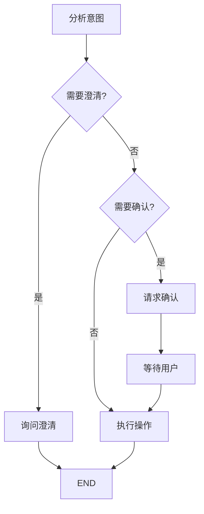

# 待办助手

本文档介绍待办助手的功能和工作流程。

## 功能概述

待办助手是一个专门处理待办事项的 AI Agent，支持：

- 自然语言创建待办
- 智能时间解析
- 冲突检测
- 任务拆解
- 确认流程

---

## 支持的操作

| 操作 | 示例 |
|------|------|
| 创建 | "帮我添加一个明天下午3点的会议" |
| 查询 | "我有哪些待办" |
| 更新 | "把明天的会议改到周五" |
| 完成 | "标记会议为已完成" |
| 删除 | "删除那个会议" |

---

## 工作流程

---

## 智能特性

### 时间解析

支持自然语言时间：
- "明天下午3点"
- "下周一上午10点"
- "三天后"

### 冲突检测

自动检测时间冲突：
- "你已经有一个14:00的会议"
- 提供解决建议

### 模糊匹配

支持模糊标题匹配：
- 用户说"那个会议" → 自动匹配最近的会议

---

## 确认流程

危险操作需要用户确认：

1. AI 发送确认请求
2. 用户选择确认/拒绝/编辑
3. AI 继续执行或取消
