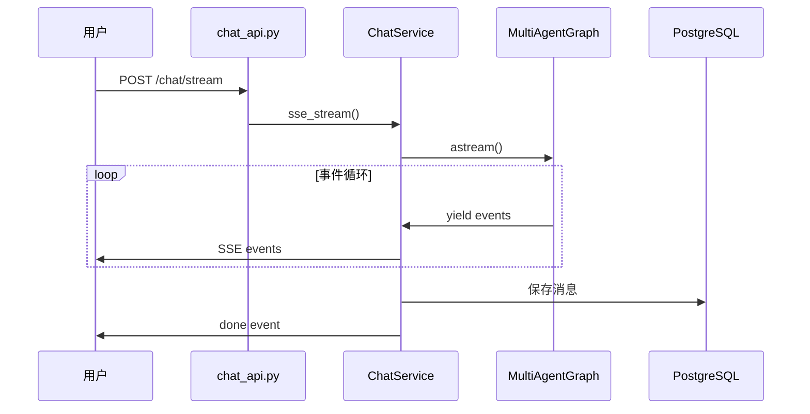

# 聊天系统

本文档介绍聊天系统的完整工作流程。

## 概述

聊天系统基于 LangGraph 实现，支持：
- 流式响应
- 多智能体协作
- 工具调用
- 对话历史

---

## 工作流程

---

## 对话管理

### 新建对话

不传 `thread_id` 时自动创建新对话。

### 继续对话

传入已有 `thread_id` 继续历史对话。

### 历史恢复

从数据库加载消息，恢复 LangGraph 状态。

---

## 消息存储

消息存储在 `t_chat_message` 表：

| 字段 | 说明 |
|------|------|
| `role` | human / ai |
| `content` | 消息内容 |
| `metadata` | 工具调用等扩展信息 |
