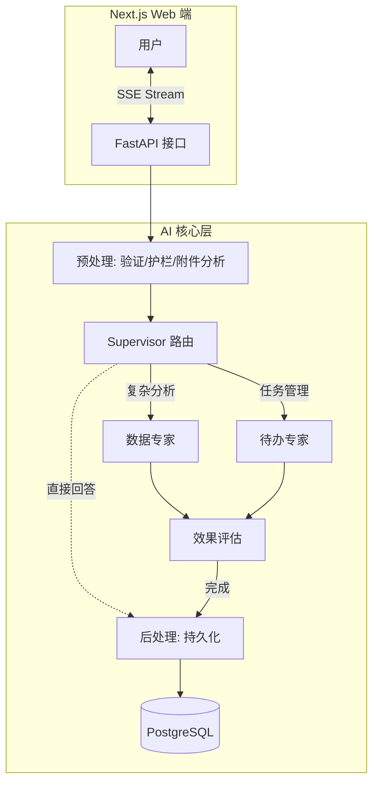
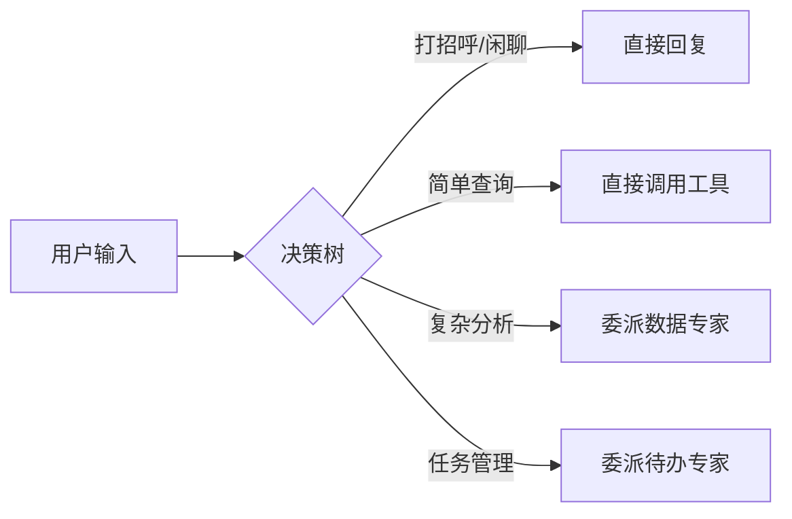
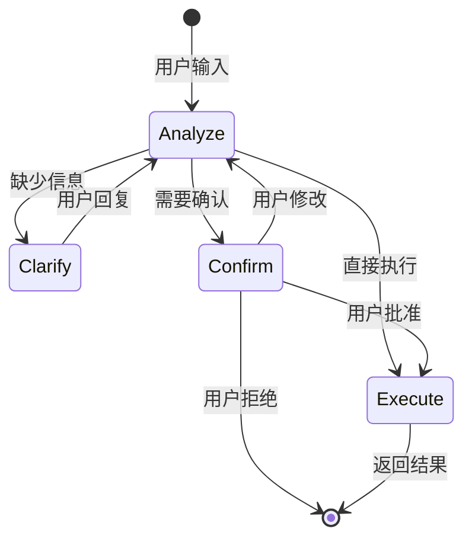
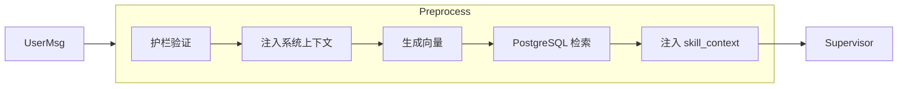

# 多智能体工作流

> 本文档整合多智能体系统的架构设计和实现细节，是理解 AI 核心模块的入口文档。

---

## 1. 系统架构

### 1.1 Supervisor 模式

本系统基于 **LangGraph Supervisor 模式** 构建，是一个具备路由分发、专业分工、人机协作能力的多智能体对话系统。

**核心设计理念**:
1. **Supervisor 为核心**: 中央调度器负责意图理解与任务分发
2. **专家即插即用**: 数据分析、待办管理、知识问答作为独立模块
3. **流式优先**: 全链路支持 SSE 流式输出
4. **安全护栏**: 所有输入输出经过 Guardrails 层验证

### 1.2 高层架构图



---

## 2. 核心工作流

**代码入口**: `app/ai/workflow/multi_agent_graph.py`

### 2.1 状态定义

```python
class MultiAgentState(TypedDict):
    messages: Annotated[list, add_messages]  # 自动合并消息
    user_id: Optional[int]
    thread_id: Optional[str]
    enable_thinking: Optional[bool]
    model_id: Optional[str]
    detected_intent: Optional[str]           # 意图识别结果
    skill_context: Optional[str]             # Skills RAG 上下文
    system_context: Optional[str]            # 系统上下文
```

### 2.2 节点流程

| 节点 | 函数 | 职责 |
|------|------|------|
| `preprocess` | `_preprocess_multimodal` | 验证消息、分析附件、护栏验证、技能检索 |
| `supervisor` | Supervisor Agent | 理解意图、路由决策、直接处理简单任务 |
| `data_expert` | Data Agent | 复杂多步骤数据分析 |
| `todo_expert` | Todo Agent | 待办事项管理（需要确认流程） |
| `evaluate` | `_evaluate_expert_work` | 评估任务完成度 |
| `postprocess` | `_postprocess` | 保存对话、清理缓存 |

### 2.3 图构建

```python
def create_multi_agent_graph():
    builder = StateGraph(MultiAgentState)
    
    # 添加节点
    builder.add_node("preprocess", _preprocess)
    builder.add_node("supervisor", supervisor_agent)
    builder.add_node("data_expert", data_agent)
    builder.add_node("todo_expert", todo_agent)
    builder.add_node("postprocess", _postprocess)
    
    # 设置入口
    builder.set_entry_point("preprocess")
    
    # 添加边
    builder.add_edge("preprocess", "supervisor")
    builder.add_conditional_edges("supervisor", route_supervisor)
    builder.add_edge("data_expert", "postprocess")
    builder.add_edge("todo_expert", "postprocess")
    
    return builder.compile()
```

---

## 3. Supervisor 决策逻辑

Supervisor 通过 **Handoff Tools** 进行路由：



### 3.1 Handoff 协议

**文件**: `app/ai/protocol.py`

```python
class HandoffResult(BaseModel):
    """标准 Handoff 结果模型"""
    action: str = Field(default="handoff")
    target_agent: str = Field(..., description="目标专家 Agent 名称")
    task_description: str = Field(..., description="任务描述与上下文")
```

---

## 4. 子智能体

### 4.1 数据专家 (Data Expert)

- **文件**: `app/ai/agents/data_agent.py`
- **职责**: 复杂多步骤数据分析
- **核心工具**:
  - `sql_inter`: 数据库查询
  - `fig_inter`: 图表生成
  - `python_inter`: 代码执行

### 4.2 待办专家 (Todo Expert)

- **文件**: `app/ai/workflow/todo_graph.py`
- **职责**: 智能任务管理
- **特性**:
  - 多轮澄清对话
  - Human-in-the-loop 确认
  - NLP 时间解析

**待办专家状态机**:



---

## 5. Agent 包装器

每个 Agent 被包装以支持流式事件：

**文件**: `app/ai/workflow/multi_agent_graph.py`

```python
async def streaming_wrapper(state, config):
    writer = get_stream_writer()
    
    async for event in agent.astream_events(state, config, version="v2"):
        event_kind = event.get("event", "")
        
        # LLM Token 流
        if event_kind == "on_chat_model_stream":
            chunk = event["data"].get("chunk")
            if content := getattr(chunk, "content", ""):
                writer(AgentEvent.token(content, node=name).to_stream_dict())
        
        # 工具调用
        elif event_kind == "on_tool_start":
            tool_name = event.get("name")
            writer(AgentEvent.tool_start(tool_name, ...).to_stream_dict())
```

---

## 6. Skills RAG

在进入 Supervisor 之前，预处理节点会检索相关技能：



---

## 7. 性能优化

### 7.1 Context Pruning

使用 `trim_messages` 限制传递给 Agent 的消息数量：

```python
pruned_messages = trim_messages(
    original_messages,
    max_tokens=15,
    strategy="last",
    start_on="human",
    include_system=True,
)
```

**优化效果**:
- Token 节省: 40-60%
- 延迟降低: 20-30%

### 7.2 Structured Output

使用 Pydantic 模型替代 JSON 解析：

```python
class AnalysisResult(BaseModel):
    intent: Literal["clarify", "query", "create", ...]
    extracted_info: Dict[str, Any] = Field(default_factory=dict)

structured_llm = llm.with_structured_output(AnalysisResult)
response = structured_llm.invoke(messages)
```

---

## 8. 扩展指南

### 添加新专家 Agent

1. 在 `app/ai/agents/` 创建 `new_agent.py`
2. 在 `AgentType` 枚举中添加类型
3. 在 `AGENT_DESCRIPTIONS` 中添加描述
4. 在 `create_multi_agent_graph()` 中注册节点

### 添加新工具

1. 在 `app/ai/tools/` 创建工具文件
2. 定义 Pydantic Input Schema
3. 使用 `@tool(args_schema=...)` 装饰器
4. 在相应 Agent 的工具列表中注册

---

## 相关文档

- [AI模块设计](../架构设计/AI模块设计.md) - 完整 AI 模块详解
- [SSE事件协议](SSE事件协议.md) - 流式通信协议
- [待办图](待办图.md) - 待办 Agent 详细实现
- [流式通信与状态同步设计](流式通信与状态同步设计.md) - 双写架构详解
