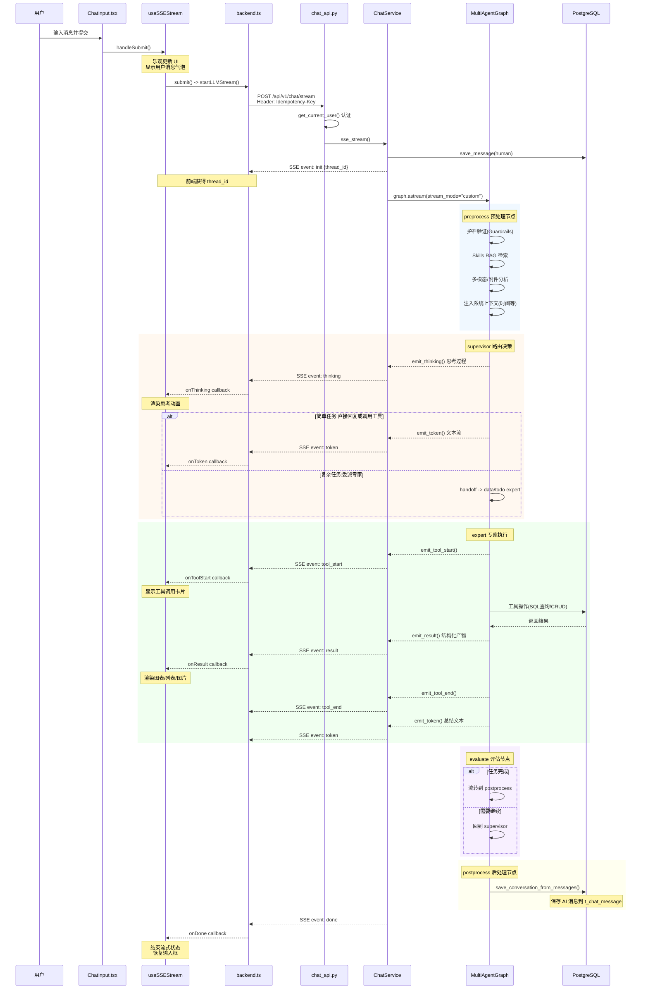
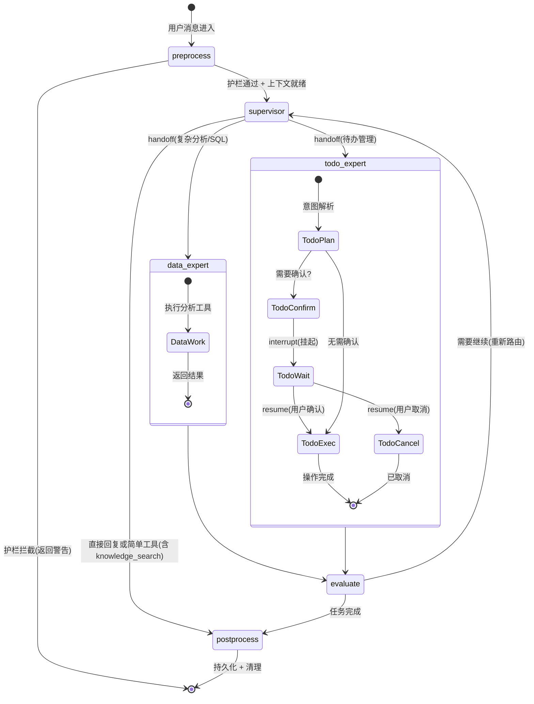
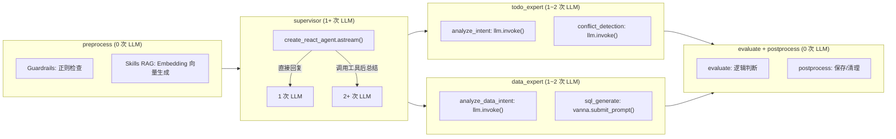
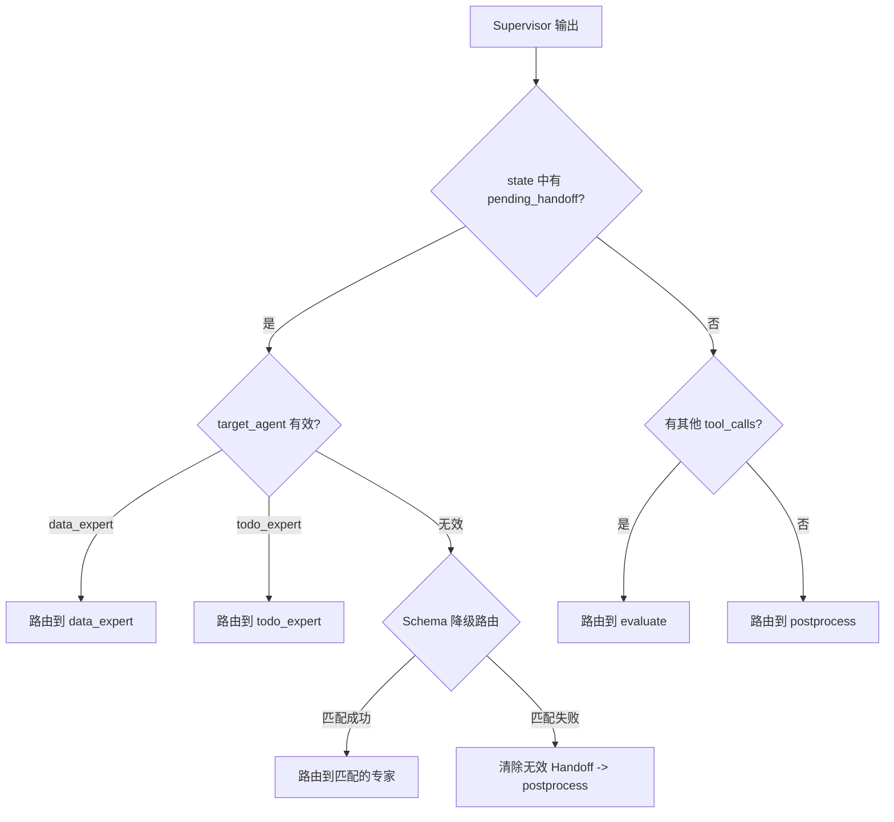
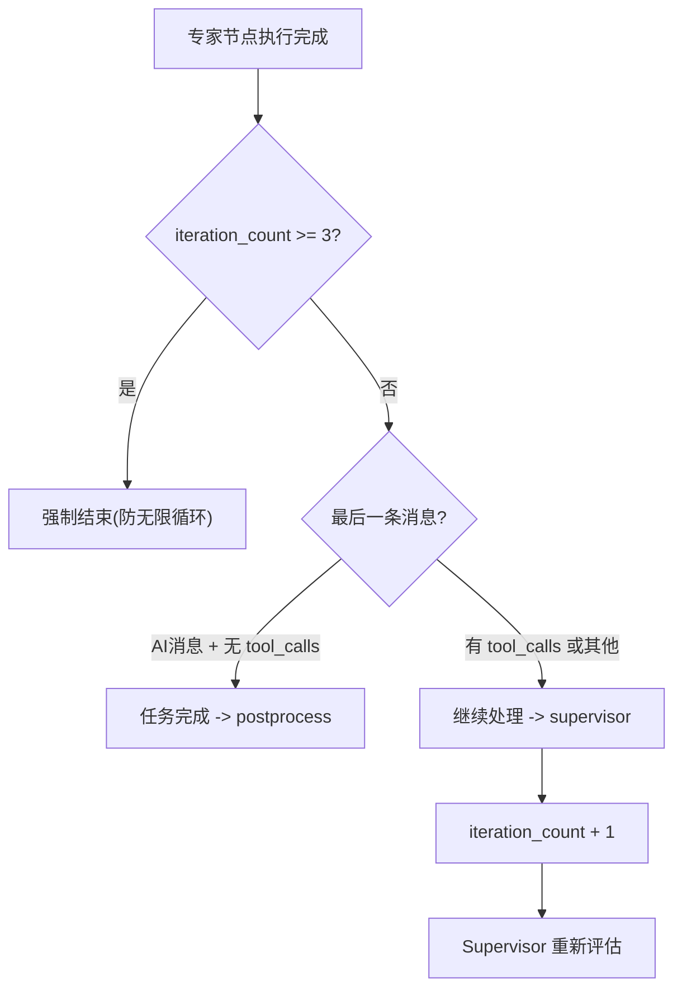
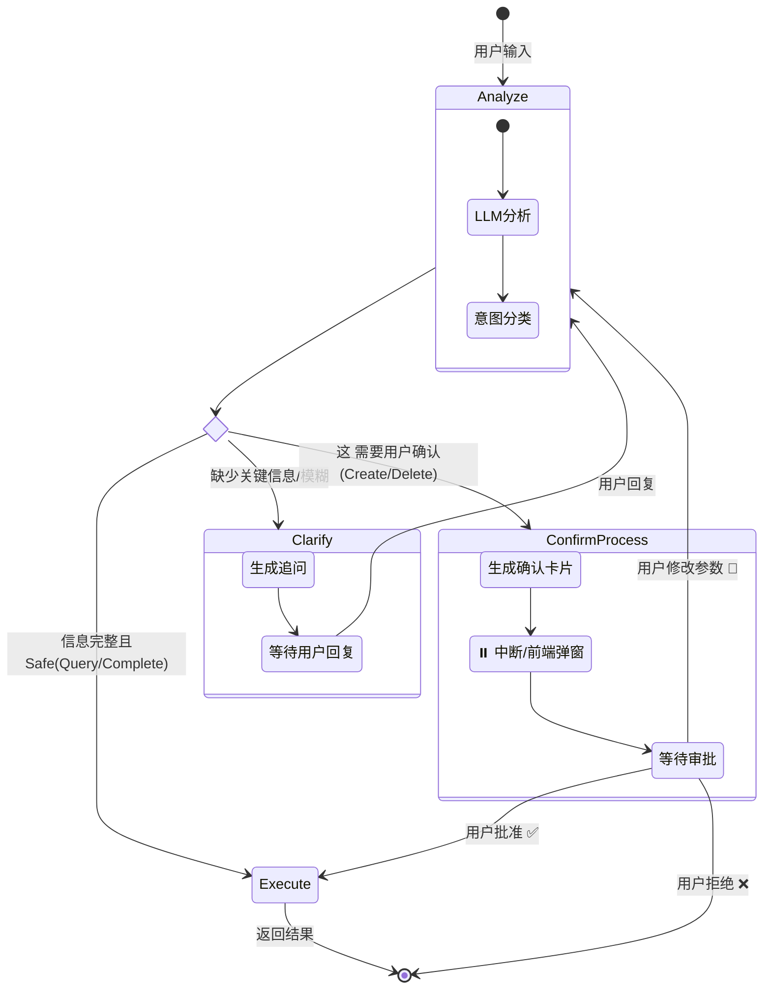
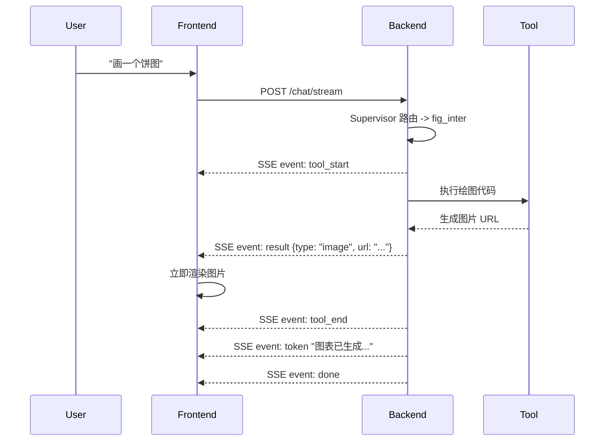

# 多智能体系统详解：运行链路与实现落点

> **文档版本**: v1.1  
> **最后更新**: 2026-02-14  
> **适用对象**: 架构师、开发者、维护人员  
> **文档角色**: 代码解读辅助源（实现走读/调用链分析）  
> **权威源入口**: [AI模块设计](../架构设计/AI模块设计.md)  
> **使用方式**: 先阅读权威设计，再使用本文定位实现与调试路径

---

## 0. 端到端全景图

> 本章将用户发送一条消息到收到完整回复的全链路串联在一张图中，覆盖前端组件、HTTP 通信、后端服务、LangGraph 工作流、SSE 事件回传、数据库持久化六个层面。

### 0.1 完整请求-响应时序图



### 0.2 LangGraph 工作流状态机



### 0.3 SSE 事件类型速查表

| 事件类型 | 触发源 | 数据格式 | 前端回调 | 说明 |
| :--- | :--- | :--- | :--- | :--- |
| `init` | ChatService | `{thread_id}` | onInit | 流开始，返回对话 ID |
| `token` | LLM/Agent | `{content: "..."}` | onToken | 实时文本流 |
| `thinking` | LLM | `{content: "..."}` | onThinking | 深度思考过程 (DeepSeek-R1) |
| `status` | Graph Node | `{message: "..."}` | onStatus | 状态提示 (如"正在查询...") |
| `tool_start` | Agent | `{name, input}` | onToolStart | 工具调用开始 |
| `tool_end` | Agent | `{output}` | onToolEnd | 工具执行完成 |
| `result` | Tool | `{data_type, data, message}` | onResult | 结构化产物 (图表/列表/图片) |
| `interrupt` | Graph | `{interrupt_id, value}` | onInterrupt | 需要人工干预 (确认/取消) |
| `done` | ChatService | `{}` | onDone | 流结束 |

### 0.4 关键代码文件索引

| 层级 | 文件 | 关键函数/类 | 职责 |
| :--- | :--- | :--- | :--- |
| 前端 UI | `web/src/components/chat/ChatInput.tsx` | `ChatInput` | 消息输入与提交 |
| 前端逻辑 | `web/src/components/chat/index.tsx` | `Thread.handleSubmit()` | 组装消息、调用 submit |
| 前端 Hook | `web/src/hooks/useSSEStream.ts` | `useSSEStream().submit()` | 乐观更新、流状态管理 |
| 前端 API | `web/src/lib/backend.ts` | `startLLMStream()`, `streamLLM()` | HTTP 请求、SSE 解析 |
| 后端路由 | `app/api/v1/endpoints/chat_api.py` | `chat_stream()` | 认证、StreamingResponse |
| 后端服务 | `app/services/chat_service.py` | `ChatService.stream()`, `sse_stream()` | 业务编排、SSE 格式化 |
| 事件协议 | `app/ai/events.py` | `emit_token()`, `emit_result()` 等 | 强类型事件发送 |
| 工作流图 | `app/ai/workflow/multi_agent_graph.py` | `create_multi_agent_graph()` | Supervisor 模式主图 |
| 数据专家 | `app/ai/workflow/data_graph.py` | 数据分析子图 | SQL/图表/分析 |
| 待办专家 | `app/ai/workflow/todo_graph.py` | 待办管理子图 | CRUD + 确认流 |
| 数据访问 | `app/repositories/chat_repo.py` | `save_message()`, `save_conversation_from_messages()` | 消息持久化 |
| 数据模型 | `app/models/chat_message.py` | `ChatMessage` | ORM 表定义 |

### 0.5 LLM 调用链路

一次用户消息处理过程中，LLM 被调用的次数取决于路由路径。以下按节点标注所有可能的 LLM 调用点：



**典型场景的 LLM 调用次数**：

| 场景 | 路径 | LLM 推理次数 | Embedding 次数 | 说明 |
| :--- | :--- | :--- | :--- | :--- |
| 简单问候 "你好" | supervisor 直接回复 | **1** | 1 | Supervisor 一次推理即完成 |
| 知识库查询 "差旅报销规定" | supervisor 调用 knowledge_search | **2** | 1+N | Supervisor 推理 + 工具调用后总结回复 |
| 待办创建 "帮我记一个待办" | supervisor -> todo_expert | **2~3** | 1 | Supervisor 路由(1) + todo analyze_intent(1) + 可能的冲突检测(1) |
| 复杂分析 "按分行统计贷款余额并画图" | supervisor -> data_expert | **3~4** | 1+N | Supervisor 路由(1) + data 意图分析(1) + SQL 生成(1) + 可能的重试(1) |
| SQL 查询 "查贷款余额" | supervisor 直接调用 sql_inter | **2** | 1 | Supervisor 推理(1) + 工具调用后总结(1) |

> **区分**：Embedding 向量生成（Skills RAG、Vanna 检索）不计入 LLM 推理次数，因其使用的是 Embedding 模型而非 Chat 模型。

**LLM 调用详细索引**：

| 调用点 | 文件 | 调用方式 | 模型来源 |
| :--- | :--- | :--- | :--- |
| Supervisor 推理 | `multi_agent_graph.py` | `agent.astream()` (流式) | `get_llm()` |
| 待办意图分析 | `todo_graph.py` | `llm.invoke()` | `get_llm(internal=True)` |
| 待办冲突检测 | `todo_enhanced_nodes.py` | `llm.invoke()` | `get_llm(internal=True)` |
| 数据意图分析 | `data_graph.py` | `llm.invoke()` | `get_llm(internal=True)` |
| SQL 生成 | `vanna_client.py` | `client.chat.completions.create()` | `LLMConfigService.get_model_by_type("chat")` |
| Skills RAG | `skill_service.py` | `get_embedding()` | Embedding 模型 |

> 各局部流程的深度讲解见后续章节，以及 [流式通信与状态同步设计](流式通信与状态同步设计.md)。

---

## 1. 运行时结构快照（实现视角）

本节从代码执行视角解释多智能体流程，架构决策、模块边界与契约定义请以 [AI模块设计](../架构设计/AI模块设计.md) 为准。

### 1.1 运行时观察要点

1.  **Supervisor 为核心**: 中央调度器负责意图理解与任务分发。
2.  **专家委派收敛**: 复杂分析委派 `data_expert`，待办任务委派 `todo_expert`。
3.  **知识问答直调工具**: 知识检索由 Supervisor 直接调用 `knowledge_search`，不再走独立 `knowledge_expert` 节点。
4.  **流式优先**: 全链路使用 SSE 输出状态、工具事件与文本流。

### 1.2 高层架构图

```mermaid
graph TD
    subgraph Frontend [Next.js Web 端]
        User[用户] <--> |SSE Stream| API[FastAPI 接口]
        API <--> |ChatService| Graph[LangGraph 引擎]
    end

    subgraph Core [AI 核心层]
        Graph --> Preprocess[预处理: 验证/护栏/多模态分析]
        Preprocess --> Supervisor[👮 Supervisor 路由]
        
        Supervisor -.-> |直接回答/简单工具(含知识检索)| Postprocess
        Supervisor --> |复杂任务| DataExpert[📊 问数/分析专家]
        Supervisor --> |任务管理| TodoExpert[✅ 待办专家]
        
        DataExpert --> Evaluate[⚖️ 效果评估]
        TodoExpert --> Evaluate
        
        Evaluate --> |需要继续| Supervisor
        Evaluate --> |完成任务| Postprocess[后处理: 持久化/清理]
        
        Postprocess --> DB[(PostgreSQL)]
    end
```

---

## 2. 🔄 核心工作流详解

### 2.1 主控制流 (Main Loop)

代码入口: `app/ai/workflow/multi_agent_graph.py`

整个系统运行在一个有向循环图 (Cyclic Graph) 中：

1.  **START -> Preprocess**: 
    - **消息验证**: 修复 DeepSeek `reasoning_content`，清理无效 Tool Calls。
    - **护栏检查**: `guardrail_runner.validate_input` 拦截恶意输入。
    - **附件分析**: 识别图片/文件 URL，调用 Vision Tool 分析内容并注入 Context。

2.  **Preprocess -> Supervisor**:
    - Supervisor 接收预处理后的 State。
    - 根据 System Prompt 中的 **决策树** 判断：
        - 是简单聊天？ -> 直接回复。
        - 是简单查询？ -> 直接调用 `tavily_search`, `knowledge_search` 等。
        - 是复杂任务？ -> 调用 `handoff` 工具委派给专家。

3.  **Supervisor -> Experts (Handoff)**:
    - 使用 `Send()` 原语将特定任务描述发送给目标 Agent。
    - 关键工具: `assign_to_data_expert`, `assign_to_todo_expert`。

4.  **Experts -> Evaluate**:
    - 专家执行完毕后（可能包含多轮 ReAct 循环）。
    - 进入 Evaluate 节点评估任务是否真正完成。
    - 如果专家需要其他专家协助（极少情况），Evaluate 可将控制权交回 Supervisor。

5.  **Evaluate/Supervisor -> Postprocess -> END**:
    - 保存对话历史到 `t_chat_message`。
    - 清理临时数据（如 DataFrame 缓存）。

### 2.2 Supervisor 深度解读

Supervisor 是多智能体系统的中央调度器，负责意图理解、工具调用与任务委派。本节从设计演进、决策逻辑、Handoff 协议、流式包装、评估控制五个维度展开。

#### 2.2.1 设计演进

Supervisor 的架构经历了三个关键决策（详见 [决策记录](../../内部参考/决策记录.md)）：

| 阶段 | 决策 | 变化 |
| :--- | :--- | :--- |
| **初始设计** (ADR-001) | 采用 Supervisor 多智能体架构 | Supervisor 仅做路由，所有任务均委派给专家（data/knowledge/todo） |
| **架构简化** (ADR-006) | Supervisor 直接绑定简单工具 | 移除 `knowledge_expert`，Supervisor 自身可调用 `sql_inter`、`fig_inter`、`knowledge_search` 等简单工具；仅多步骤任务才委派 |
| **Prompt 保护** (ADR-008) | 决策树属于核心架构 | 禁止在调试过程中随意修改 `SUPERVISOR_PROMPT` 的决策树结构，修改需走评审流程 |

**当前架构**（简化后）：

```
Supervisor（含简单工具）→ 仅委派 [data_expert, todo_expert]
```

判断标准：**需要多步推理才委派，单工具能解决的直接处理**。

#### 2.2.2 决策树与 Prompt

> **源文件**: `app/ai/prompts/agent_prompts.py` 中的 `SUPERVISOR_PROMPT`

**决策树流程**：

```
用户请求
    |
    +-- 简单问候/闲聊？（你好/谢谢/再见）
    |       -> 直接回复，不调用任何工具
    |
    +-- 需要联网实时信息？（天气/新闻/股价/汇率）
    |       -> 调用 tavily_search
    |
    +-- 查询业务数据？（余额/金额/数量/统计等数字类）
    |       -> 委派给 data_expert
    |       示例: "贷款余额"、"上月存款"、"分行统计"
    |
    +-- 知识库内容？（规定/文档/流程等文档类）
    |       -> 调用 knowledge_search
    |       示例: "差旅报销规定"、"请假流程"
    |
    +-- 绘制图表？（折线图/柱状图/饼图/几何图形）
    |       -> 调用 fig_inter
    |
    +-- 分析图片？
    |       -> 调用 analyze_image
    |
    +-- 读取上传文件？
    |       -> 调用 read_uploaded_file
    |
    +-- 复杂数据分析？（文件处理 + 清洗 + 统计 + 可视化）
    |       -> 委派给 data_expert
    |
    +-- 待办事项管理？（创建/查询/更新/完成/删除）
    |       -> 委派给 todo_expert
    |
    +-- 待办确认/补充？（短回复 + 上条AI消息含待办关键词）
    |       -> 委派给 todo_expert（需携带完整对话上下文）
    |
    +-- 意图不明确？
            -> 直接询问用户澄清，不猜测
```

**知识库 vs 数据查询区分**：

| 类型 | 特征 | 示例 |
| :--- | :--- | :--- |
| 知识库 | 问"是什么/怎么规定/什么流程"，查文档内容 | "差旅规定"、"请假流程" |
| 数据查询 | 问"是多少/有多少"，查数字/统计数据 | "贷款余额"、"客户数量" |

**执行原则**：
1. **单工具优先**：能用一个工具解决的直接调用，不委派
2. **意图澄清**：无法判断时直接询问用户，不猜测
3. **静默委派**：调用 `assign_to_*` 工具时禁止输出文字，直接调用让专家处理
4. **图片占位符**：`knowledge_search` 返回的 `[IMG-N]` 占位符必须原样保留

**工具清单**：

| 工具 | 用途 | 直接/委派 |
| :--- | :--- | :--- |
| `tavily_search` | 联网搜索 | 直接 |
| `knowledge_search` | 知识库检索 | 直接 |
| `sql_inter` | SQL 查询 | 直接 |
| `fig_inter` | 图表绘制 | 直接 |
| `analyze_image` | 图片分析 | 直接 |
| `read_uploaded_file` | 文件读取 | 直接 |
| `assign_to_data_expert` | 复杂数据分析 | 委派 |
| `assign_to_todo_expert` | 待办管理 | 委派 |

#### 2.2.3 Handoff 协议与路由机制

Supervisor 通过 Handoff 协议将任务委派给专家，涉及三个关键组件：

**1) HandoffResult 模型**（`app/ai/protocol.py`）

```python
class HandoffResult(BaseModel):
    action: str = Field(default="handoff")
    target_agent: str = Field(..., description="目标专家 Agent 名称")
    task_description: str = Field(..., description="任务描述与上下文")
```

**2) Handoff 工具创建**（`multi_agent_graph.py` `_create_task_handoff_tool()`）

每个专家对应一个 `assign_to_{agent_name}` 工具。Supervisor 调用该工具时，LLM 需提供 `task_description` 参数（包含完整上下文）。工具返回 JSON 格式的委派指令，而非 LangGraph Command 对象，以避免 ToolNode 序列化问题。

**3) 条件路由函数**（`multi_agent_graph.py` `supervisor_should_continue()`）



路由优先级：`pending_handoff` > 其他 `tool_calls` > 直接回复（postprocess）。无效的 Handoff 目标会触发 `HandoffValidationError`，记录错误后直接进入 postprocess 避免无限循环。

#### 2.2.4 流式输出包装

> **源函数**: `multi_agent_graph.py` `_create_streaming_agent_wrapper()`

LangGraph 的 `create_react_agent` 默认将完整的 AI 消息写入 State，但不会逐 token 推送到 Custom Stream。为实现实时流式输出，系统为 Supervisor 和每个专家节点都包装了一层流式拦截器：

**核心机制**：

```
agent.astream(state)
    |
    +-- AIMessageChunk 事件
    |       -> emit_token(writer, content)     # 实时文本流
    |       -> emit_thinking(writer, content)   # 思考过程(DeepSeek-R1)
    |
    +-- tool_calls 检测
    |       -> emit_tool_start(writer, name, input)  # 工具调用开始
    |       -> (等待工具执行)
    |       -> emit_tool_end(writer, output)          # 工具执行完成
    |
    +-- 最终 AIMessage
            -> 写入 State（双写模式的持久化侧）
```

**为什么需要双写**：
- 只写 Custom Stream：刷新页面后消息丢失
- 只写 State：流式响应中前端收不到数据，界面卡顿
- 双写：既保证实时体验，又保证数据一致性

详见 [流式通信与状态同步设计](流式通信与状态同步设计.md)。

#### 2.2.5 评估与迭代控制

> **源函数**: `multi_agent_graph.py` `_evaluate_expert_work()`

专家执行完成后，Evaluate 节点判断是否需要继续：



| 判断条件 | 结果 | 说明 |
| :--- | :--- | :--- |
| `iteration_count >= 3` | `complete` | 防止无限循环的安全阀 |
| 最后消息是 AI 且无 `tool_calls` | `complete` | 专家已输出最终回复 |
| 其他情况 | `continue` | 递增迭代计数，回到 Supervisor |

---

## 3. 🤖 子智能体深度解析

### 3.1 📊 Data Expert (数据/问数专家)

- **职责**: 处理复杂的多步骤数据分析任务。
- **文件**: `app/ai/workflow/data_graph.py`
- **架构**: 独立的子图 (SubGraph)，包含错误自愈机制。
- **核心流程**:
    1. **意图分析** (`analyze`): 识别查询类型（指标查询/自由查询/可视化）
    2. **指标匹配** (`metric`): 匹配预定义指标，使用 SQL 模板
    3. **Schema 检索** (`schema`): Vanna RAG 检索相关 DDL 和文档
    4. **SQL 生成** (`generate`): 基于 RAG 上下文生成 SQL
    5. **安全检查** (`safety`): SQL 安全校验 + 自动添加 LIMIT
    6. **执行** (`execute`): 执行 SQL，失败时触发错误自愈（最多 3 次重试）
- **核心工具**:
    - **SQL 查询**: `sql_inter` 直接查询数据库
    - **语义查询**: `semantic_query` Vanna RAG 语义 SQL 生成
    - **数据清洗**: `extract_data` 处理上传的文件
    - **代码执行**: `python_inter` 运行 Python 代码进行高级分析
    - **可视化**: `fig_inter` 生成 ECharts 图表

### 3.2 📚 Knowledge Expert (知识库专家)

- **职责**: 企业私有知识检索。
- **文件**: `app/ai/agents/knowledge_agent.py`
- **集成**: 对接 RAGFlow 系统。
- **关键机制 - 图片透传**:
    - RAGFlow 返回的文档片段中可能包含 Markdown 图片 ``。
    - 专家被 Prompt 强制要求 **保留这些图片链接**。
    - 后端通过 `emit_result` 和 Markdown 渲染双重机制确保图片在前端展示。

### 3.3 ✅ Todo Expert (待办专家) - 最复杂的 Agent

- **职责**: 智能任务管理，支持多轮澄清与确认。
- **文件**: `app/ai/workflow/todo_graph.py`
- **架构**: 独立的子图 (SubGraph)，拥有自己的状态机。

#### 待办专家状态机



#### 关键特性
1.  **NLP 时间解析**: 自动将 "下周三下午" 解析为 ISO 时间。
2.  **智能冲突检测**: 如果新任务与已有任务时间重叠，Prompt 会标记风险。
3.  **Human-in-the-loop**: 
    - 危险操作（删除、批量修改）触发 `interrupt`。
    - 前端收到 `interrupt` 事件弹出确认卡片。
    - 用户点击确认后，调用 `/chat/resume` 恢复执行。

---

## 4. 📡 通信与协议 (SSE & Events)

系统使用 **Server-Sent Events (SSE)** 实现全双工流式通信。

### 4.1 事件全景图

| 事件类型 | 触发源 | 说明 | 数据载体 |
| :--- | :--- | :--- | :--- |
| `token` | LLM | 实时文本流 | `{content: "..."}` |
| `thinking` | LLM | 深度思考过程 (DeepSeek-R1) | `{content: "..."}` |
| `status` | Graph Node | 状态更新 (如"正在查询...") | `{message: "..."}` |
| `tool_start` | Agent | 工具调用开始 | `{name: "sql_inter", input: {...}}` |
| `tool_end` | Agent | 工具执行完成 | `{output: "..."}` |
| `result` | Tool | **结构化产物** (图表/图片/列表) | `{data_type: "image", data: {url: "..."}}` |
| `interrupt` | Graph | **需要人工干预** | `{interrupt_id: "...", value: {...}}` |

### 4.2 前后端交互时序 (以画图为例)



---

## 5. 🛠️ 开发与扩展指南

### 5.1 如何添加一个新的专家 Agent？

1.  **定义 Agent**: 在 `app/ai/agents/` 下创建新文件（如 `hr_agent.py`）。
2.  **编写 Prompt**: 定义 System Prompt，描述其专业能力。
3.  **注册枚举**: 在 `multi_agent_graph.py` 的 `AgentType` 和 `AGENT_DESCRIPTIONS` 中注册。
4.  **创建 Handoff**: 系统会自动根据描述生成 `assign_to_hr_expert` 工具。
5.  **加入图**: 在 `create_multi_agent_graph` 中添加节点 `workflow.add_node("hr_expert", ...)` 并连接边。

### 5.2 如何调试？

- **日志**: 后端日志详细记录了 `[多智能体-消息列表]` 和 `意图路由` 过程。
- **LangSmith**: 如果配置了 LangSmith，可以查看完整的 Trace 链路。
- **前端状态**: AI 回复框下方的 "Status Indicator" (脉冲小圆点) 会实时显示后端 `emit_status` 推送的当前步骤。

---

## 6. ⚠️ 常见问题速查

- **Q: 为什么 DeepSeek 模型有时会报错？**
    - A: DeepSeek R1 的 API 限制历史消息必须包含 `reasoning_content`。我们在 `preprocess` 节点有自动修复逻辑 (`fix_deepseek_reasoning`)。
- **Q: 图片为什么不显示？**
    - A: 检查 `fig_inter` 或 `ragflow_tool` 是否正确发出了 `emit_result("image", ...)` 事件。
- **Q: 任务一直卡在"正在思考"？**
    - A: 可能是死循环。`evaluate` 节点有 `MAX_ITERATIONS=3` 的强制熔断保护。

---

## 7. 🧩 代码级实现细节 (Code-Level Implementation)

### 7.1 Supervisor 图片保留规则 (必读)

为了解决 RAG 检索结果中图片丢失的问题，我们在 Supervisor 的 System Prompt 中增加了强制规则：

> **⚠️ 图片处理规则（必须遵守）**
> 
> knowledge_search 检索结果中包含的图片 Markdown **必须完整保留在回答中**！
> - **逐字复制**：不要修改 URL，不要尝试下载。
> - **位置要求**：放在相关文字说明之后。
> - **覆盖范围**：每个检索结果块的图片都要保留。

这确保了当知识库返回 `` 时，LLM 不会将其过滤掉。

### 7.2 RAGFlow 工具实现

文件: `app/ai/tools/ragflow_tool.py`

工具实现了 RAGFlow 检索结果的格式化与图片提取：

1.  **Chunk 截断**: 强制限制 `MAX_CHUNKS = 30`，防止上下文溢出。
2.  **图片 URL 构造**: 将 RAGFlow 的 `image_id` 转换为本地代理 URL:
    ```python
    image_url = f"/api/v1/assets/proxy/ragflow/{image_id}"
    result_text += f"\n   "
    ```
3.  **调试日志**: 详细记录了检索到的 Chunk 数量及提取的图片数量，便于排查。

### 7.3 SSE 核心数据结构

前端 `useSSEStream.ts` 处理的关键事件结构：

#### `result` (结构化产物)
```json
{
  "type": "result",
  "data": {
    "data_type": "image", // 或 'chart', 'todo_list'
    "data": {
      "url": "/api/v1/assets/proxy/ragflow/..."
    },
    "message": "图片描述 optional"
  }
}
```

#### `tool_start` (工具调用)
```json
{
  "type": "tool_start",
  "data": {
    "name": "knowledge_search",
    "input": {
      "query": "企业年金政策"
    }
  }
}
```

### 7.4 调试技巧：日志追踪

我们在 `multi_agent_graph.py` 中增加了详细的 `DEBUG` 日志：
- **输入监控**: `[AgentName] LLM 输入消息` —— 打印最后 3 条消息，统计包含的图片数量。
- **输出监控**: `[AgentName] LLM 输出统计` —— 统计生成的 Token 数及保留的图片数量。

通过搜索日志关键字 `📸 包含图片数量` 可以快速定位图片丢失发生在哪个环节（是输入没给进去，还是输出被吞了）。

---

## 8. 🏗️ 架构重构 (Phase 1-3)

\u003e **更新时间**: 2026-01-18  
\u003e **核心目标**: 提升协议标准化程度，增强系统健壮性，解决 400 错误与状态丢失问题。

### 8.1 协议层抽象 (Protocol Abstraction)

#### 核心模块: `app/ai/protocol.py`
为了解耦 Agent 与具体的解析逻辑，我们引入了统一的协议处理层：

- **`AgentOutputParser`**: 统一处理隐式通信协议（Handoff, KB Images, JSON 等）。
  - 支持 `<!--HANDOFF:{...}-->` 正则解析。
  - 支持纯 JSON 格式自动识别。
  - 集中管理敏感字段过滤逻辑 (`should_filter_content`)。

- **`MessageFilter` (关键安全组件)**:
  - **问题背景**: 之前 `data_expert` 的 SQL 工具调用会泄漏到 `todo_expert`，由于 `todo_expert` 不认识该工具，导致 LLM 产生幻觉或抛出 "400 Orphan Tool" 错误。
  - **解决方案**: 在进入每个 Agent 节点前，使用 `filter_for_tool_whitelist` 强制清洗消息历史，仅保留该 Agent 允许使用的工具记录。

### 8.2 Handoff 标准化 (Standardization)

为了规范 Supervisor 与 Expert 之间的任务委派，我们引入了 `HandoffResult` Pydantic 模型：

```python
class HandoffResult(BaseModel):
    action: str = Field(default="handoff", description="操作类型")
    target_agent: str = Field(..., description="目标专家 Agent 名称")
    task_description: str = Field(..., description="任务描述与上下文")
```

Supervisor 现在只需产生符合 schema 的工具调用，不再依赖脆弱的 Prompt 字符串拼接。

### 8.3 状态持久化与副作用治理 (State Persistence)

- **统一状态模型**: 合并分散的 State，确立 `MultiAgentState` 为全局唯一事实来源 (Source of Truth)。
- **持久化修复**: 移除了 `_recover_todo_from_messages` 等临时补丁，所有关键状态（如 `active_projects`, `todo_queue`）必须在 Agent 退出时显式回写到 State 中。
- **副作用隔离**: 明确了 Agent 只能通过 State 传递信息，禁止修改全局变量。

---

## 9. 🚀 性能优化 (Phase 4)

\u003e **更新时间**: 2026-01-19  
\u003e **优化目标**: 降低 Token 消耗，提升响应速度，优化成本

### 8.1 Context Pruning (上下文精简)

#### 实现位置
`app/ai/workflow/multi_agent_graph.py` - `_create_streaming_agent_wrapper` 函数

#### 核心逻辑
使用 LangChain 的 `trim_messages` 工具限制传递给每个 Agent 的消息数量：

```python
from langchain_core.messages import trim_messages

pruned_messages = trim_messages(
    original_messages,
    max_tokens=15,           # 限制为 15 条消息
    token_counter=len,       # 使用消息数量作为计数器
    strategy="last",         # 保留最新消息
    start_on="human",        # 确保以用户消息开始
    include_system=True,     # 保留系统提示
    allow_partial=False,     # 不允许部分消息
)
```

#### 优化效果
- **Token 节省**: 对于长对话，减少 40-60% 的输入 Token
- **延迟降低**: LLM 处理时间减少约 20-30%
- **成本优化**: 按 Token 计费的模型（如 GPT-4）成本显著降低

#### 适用场景
- ✅ Supervisor 路由决策（只需最近上下文）
- ✅ DataExpert 数据分析（历史分析任务无关）
- ⚠️ TodoExpert 已在 `analyze_intent` 中实施独立裁剪（保留 5 条）

### 8.2 Prompt Optimization (提示词优化)

#### 实现位置
`app/ai/workflow/todo_graph.py` - `analyze_intent` 节点

#### 变更内容

**旧方案 (手动 JSON 解析)**:
```python
# Prompt 包含大量 JSON 示例
ANALYZE_PROMPT = """
### 1. clarify (需要澄清)
**输出**:
```json
{
  "intent": "clarify",
  "needs_clarification": true,
  "missing_info": ["具体任务", "时间范围"],
  ...
}
\u0060\u0060\u0060
...
只返回JSON,不要其他内容。
"""

# 代码中手动解析
result_text = response.content
analysis = json.loads(result_text)
```

**新方案 (Structured Output)**:
```python
# Pydantic 模型定义
class AnalysisResult(BaseModel):
    intent: Literal["clarify", "query", "create", ...]
    extracted_info: Dict[str, Any] = Field(default_factory=dict)
    is_complex: bool = False
    conflict_risk: str = "none"
    # ...

# Prompt 简化（移除 JSON 示例）
ANALYZE_PROMPT = """
### 1. clarify (需要澄清)
**提取**: 将缺失信息填入 `missing_info`，项目填入 `projects`...
请严格基于 Schema 输出结构化数据。
"""

# 使用 with_structured_output
structured_llm = llm.with_structured_output(AnalysisResult)
response = structured_llm.invoke(analysis_messages)
analysis = response.model_dump()
```

#### 优化效果
- **Prompt 瘦身**: ANALYZE_PROMPT 从 ~3000 字符减少到 ~1200 字符
- **稳定性提升**: Pydantic 校验确保输出格式严格符合预期
- **容错能力**: 无需处理 JSON 解析异常（如多余逗号、换行）
- **Token 节省**: 每次 `analyze_intent` 调用节省 ~600 Token

### 8.3 验证清单

在测试环境验证以下场景：

| 测试场景 | 验证点 | 预期结果 |
|---------|--------|----------|
| 长多轮对话（\u003e20 轮） | 检查日志 `Context Pruning: 25 -\u003e 15 msgs` | ✅ 只传递 15 条消息 |
| "明天早上9点开会有PPT" | 意图识别准确性 | ✅ intent="create" |
| "帮我记录3个待办" | 多任务输入澄清 | ✅ 提示单次只能创建一个任务（批量已废弃） |
| DeepSeek Reasoner 模型 | 无 400 错误 | ✅ reasoning_content 正常处理 |

### 8.4 性能监控指标

建议在生产环境添加以下监控：

```python
# 在 _create_streaming_agent_wrapper 中
import time
start_time = time.time()
...
elapsed = time.time() - start_time
logger.info(f"[{name}] 执行耗时: {elapsed:.2f}s, Token节省: {len(original_messages) - len(pruned_messages)}")
```

---

## 9. 🔮 未来优化方向

- **并行执行**: 允许 Supervisor 同时触发多个 Agent（如同时查库 + 查知识库）
- **智能缓存**: 对重复查询结果进行缓存（如 SQL 查询、RAG 检索）
- **动态 Pruning**: 根据任务复杂度自适应调整保留消息数量

