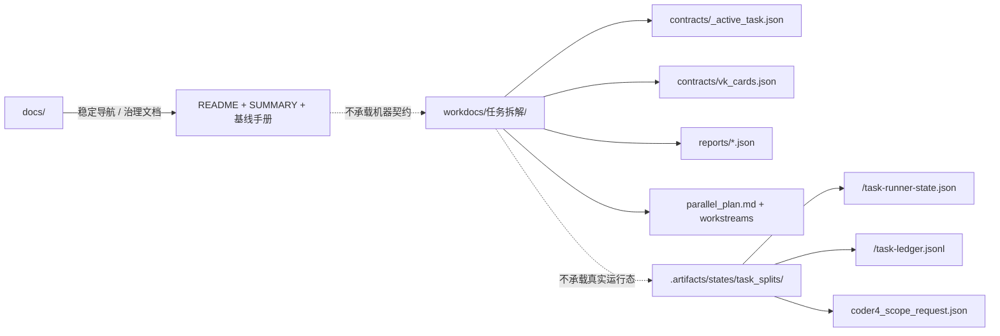
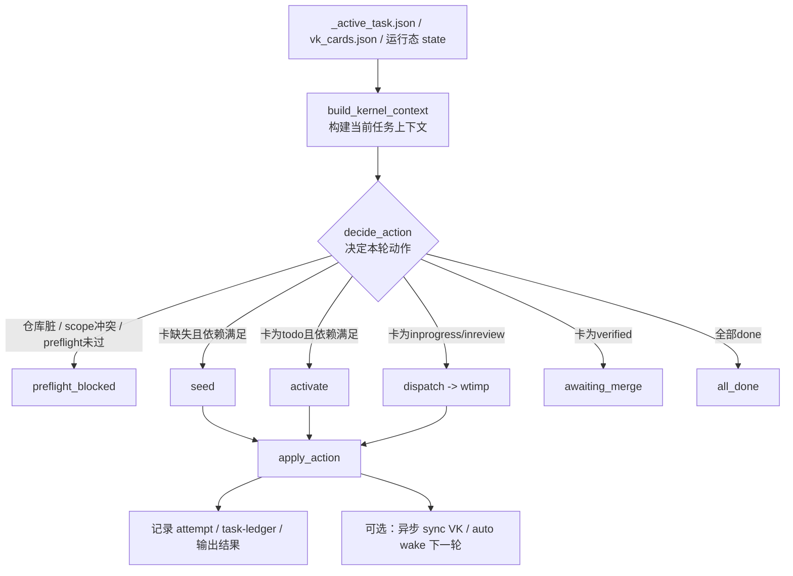

# Coder4自动执行总控手册

> 适用对象：需要让 `jjk_coder4_bot` 自动推进 VK 卡片的人  
> 更新日期：2026-03-08

## 1. 这份手册解决什么问题

本手册回答三个核心问题：

1. coder4 当前是如何自动工作的（不是抽象描述，而是落到文件、状态、门禁）。
2. 为什么它有时会 `RECONCILE_ONLY / NO_INCREMENT`，以及这些状态各自意味着什么。
3. 要让它稳定跑整夜，你的任务文档、看板、定时任务要满足哪些硬条件。

---

## 2. 架构总览（你当前环境）

### 2.1 运行入口

- 定时任务文件：`/Users/jijingkun/.openclaw-dev/cron/jobs.json`
- coder4 任务 ID：`3889e1fe-ff85-4e49-adad-4c99a542743e`
- 调度频率：`*/3 * * * *`（每 3 分钟）
- 投递通道：Telegram `6358651433`

### 2.2 真理源与执行链

coder4 每轮执行前会读取并校验以下链路（缺一会阻断）：

1. `workdocs/任务拆解/<task_split_dir>/contracts/_active_task.json`（任务级作用域真理源）
2. `workdocs/任务拆解/<task_split_dir>/contracts/vk_cards.json`
3. `workdocs/任务拆解/<task_split_dir>/parallel_plan.md`
4. `workdocs/任务拆解/<task_split_dir>/workstreams/WS-*.md`
5. `workdocs/任务拆解/<task_split_dir>/contracts/implementation_plan.md`

### 2.2.1 Phase 2 分层图



### 2.3 `bootstrap_kernel` 是什么

这里的 `bootstrap_kernel` 指的是：

- 主实现：`scripts/coder4/coder4_bootstrap_kernel.py`
- 兼容入口：`scripts/coder4_bootstrap_kernel.py`（仅做薄转发）

它不是“真正写业务代码的执行器”，而是 **coder4 / cardrun 每轮推进时的核心调度内核**：

1. 读取当前任务作用域与卡片契约；
2. 判断本轮下一步应该做什么；
3. 在允许时执行 `seed / activate / dispatch`；
4. 把本轮证据写回状态文件与任务台账。

### 2.4 `bootstrap_kernel` 的职责边界

| 维度 | 结论 | 说明 |
|---|---|---|
| 模块边界 | 它是“轮次级调度内核”，不是业务实现器 | 负责判定与编排，不直接完成业务功能开发 |
| 依赖方向 | 依赖 `contracts/_active_task.json`、`contracts/vk_cards.json`、`.artifacts` 运行态 / VK 任务，再向下分派给 `wtimp` | 上游给它任务上下文，下游由它发起单卡执行 |
| 状态归属 | 任务真理源在 `contracts/_active_task.json`；卡片契约在 `contracts/vk_cards.json`；运行态在 `.artifacts/states/task_splits/<task_split_dir>/<task_key>/task-runner-state.json`；长期证据在 `.artifacts/states/task_splits/<task_split_dir>/<task_key>/task-ledger.jsonl` | 避免把“任务定义”“运行状态”“执行证据”混在一起 |
| 错误处理责任 | 它负责 fail-fast | 主仓 dirty、作用域冲突、依赖未满足、缺少 commit 证据、重复触发等都在这里阻断 |

### 2.5 `bootstrap_kernel` 的每轮决策图



### 2.6 动作语义速查

| 动作 | 触发条件 | 实际含义 | 是否会真正落状态 |
|---|---|---|---|
| `preflight_blocked` | 主仓 dirty / scope 冲突 / preflight 未通过 | 本轮不允许推进 | 否 |
| `seed` | 卡还不存在，且依赖满足 | 创建卡并进入 `todo` | `--apply-bootstrap` 时会 |
| `activate` | 卡是 `todo`，且依赖满足 | 推进到 `inprogress` | `--apply-bootstrap` 时会 |
| `dispatch` | 卡是 `inprogress` / `inreview` | 分派给 `wtimp` 在隔离 worktree 中执行 | `--apply-bootstrap` 时会 |
| `blocked_depends` | 上游依赖未完成 | 记录阻断并等待 | 否 |
| `awaiting_merge` | 卡已 `verified` | 等待 `verify -> merge -> done` 主路径收口 | 否 |
| `all_done` | 当前卡链全部完成 | 当前任务无下一步 | 否 |

补充约束：

- `dispatch` 只负责把实现工作派给 `wtimp`，**不会**直接把卡标记为 `done`。
- `verify -> merge -> done` 仍由 `cardrun / wt-flow` 主路径收口，避免出现双重 merge 主路径。
- `dispatch` 阶段必须回填结构化证据（如 `subagent_id / ws_file / commit_sha / merge_sha`）；缺少 `commit_sha` 必须阻断。

---

## 3. `_active_task.json` 是什么

`contracts/_active_task.json` 采用任务级单一真理源：

- 任务级真理源：`workdocs/任务拆解/<task_split_dir>/contracts/_active_task.json`
- 根索引：`workdocs/任务拆解/_active_task.json`（只做默认入口指针，不是第二真理源）

任务级文件用于保存每个任务的独立作用域，避免多任务互相覆盖。

当前字段定义（最小必填）：

- `project_id`
- `task_split_dir`
- `task_key`
- `execution_mode`
- `single_active_card`
- `auto_done_policy`
- `preflight_required`

自动更新命令：

```bash
python3 scripts/coder4/set_active_task.py \
  --task-split-dir <YYYY-MM-DD_主题> \
  --project-id <VK_PROJECT_ID>
```

说明：

- 推荐通过脚本更新，不建议手改 JSON。
- 脚本会自动读取对应任务目录下的 `contracts/vk_cards.json`，同步 `task_key/execution_mode/preflight`。
- 自动执行建议固定为 `--local-mode`，并默认关闭执行过程中的 VK 同步；需要回写看板时再显式运行 `scripts/coder4/coder4_vk_sync.py`。
- `--local-mode` 与非 local-mode 都会读取 `status_source_of_truth` 作为 preflight 兜底判定（当 preflight 卡未落板或未在本地状态中出现时）。
- `status_source_of_truth` 指向的 `workdocs/任务拆解/<task_split_dir>/reports/preflight_status.json` 推荐使用标准字段：
  - `preflight_required: "C00"`
  - `passed: true`
  - 可选 `task_key/evidence/updated_at`
- 兼容字段 `status: "ready"` 仅作为过渡写法，建议逐步回收为 `passed: true`，避免门禁误判。

---

## 4. 每轮执行时序（真实逻辑）

coder4 每一轮按固定顺序执行：

1. 直接读取任务级 `_active_task.json`；缺失或字段不全 -> `BLOCKED_DOC_CONTEXT`。
2. 读取 `contracts/vk_cards.json`，校验 `task_key` 一致性，失败 -> `BLOCKED_DOC_CONTEXT`。
3. 构建当前轮的运行态上下文：
   - `--local-mode`：读取 `.artifacts/states/task_splits/<task_split_dir>/<task_key>/task-runner-state.json`
   - 非 `--local-mode`：读取 project 看板任务，并按当前 `task_key` 拆分 `scoped_tasks / unscoped_tasks`
4. 执行作用域门禁与前置门禁：
   - 主仓 clean-main gate：主仓 `git status --porcelain` 非空时直接阻断（`BLOCKED_MAIN_REPO_DIRTY`）。
   - `unscoped` 有活动卡 -> `RECONCILE_ONLY(scope_conflict)`
   - `single_active_card=true` 且 scoped 活动卡 > 1 -> `RECONCILE_ONLY(multi_active_scoped)`
   - preflight 卡未完成 -> `preflight_blocked`
5. 调度内核按 `card_order` 找到第一张未完成卡，并决定单步动作：`seed / activate / dispatch / blocked_depends / awaiting_merge / all_done`。
6. 仅当带 `--apply-bootstrap` 且动作为 `seed / activate / dispatch` 时，才会真正落状态或分派执行。
7. `dispatch` 时会把当前卡映射到对应 `WS-*.md` 和当前会话 worktree，并调用 `wtimp` 执行；若缺少 `commit_sha` 证据，必须阻断。
8. 本轮结束后写回 `task-runner-state.json`、`task-ledger.jsonl` 与结构化结果；`local-mode` 下可按需异步 `sync_vk` 或 `auto wake` 下一轮。

---

## 5. 状态机与门禁规则

### 5.1 允许的自动迁移

- `todo -> inprogress`
- `inprogress -> inreview`
- `inreview -> done`（仅当 `auto_done_policy=hard_gate` 且全部门禁通过）

### 5.2 `inreview -> done` 的 hard gate

实现卡（implementation-card）必须同时满足：

1. 证据绑定通过（`target_task_id == evidence_task_id`）。
2. 验收命令通过（`acceptance_checks`）。
3. 若 `merge_required=true`，`merge_commit` 可 git 验证且已在主线。
4. 写入 `coder4_task_ledger.jsonl` 成功。
5. 完成通知发送成功（Telegram）。
6. 成功执行一次 compact，并记录 `done_cleanup_at`。

任一失败都保持在 `inreview`，并返回 `BLOCKED_EVIDENCE_GAP`。

---

## 6. 稳定性机制（防卡死、防重复、防漂移）

### 6.1 签名去重

- 签名：`task_id|status|turn_id|process_id`
- 15 分钟内重复签名禁止重复派单，避免刷同一步。

### 6.1.1 定时任务不重复触发（配置层）

1. 同一执行器只允许一个启用中的 cron 任务（固定 `job_id` 做 update，不新建平行 job）。
2. 启停统一走 cron `update enabled=true/false`，不要反复 `create`。
3. 若发现多个同类 job 同时启用，先禁用旧 job，再保留当前主 job。

### 6.2 无增量熔断

- `no_increment_fuse=8`
- 连续 8 轮无增量后，进入“仅巡检+告警”模式，不再盲目推进。

### 6.3 会话轮换兜底

- 每 20 轮或 2 小时触发一次 rotate（兜底，不是主路径）。
- 轮换后先 precheck，不直接改代码。

### 6.4 卡死恢复

仅在以下情况触发一次恢复：

- 输出只有 `model:xxx`
- 或 process `running` 且 `summary_len=0`

恢复动作：`stop -> follow-up continue`。  
若恢复后仍无增量，标记 `BLOCKED_STALL`。

---

## 7. 证据与记忆落盘

### 7.1 状态文件（短期运行态）

`/Users/jijingkun/.openclaw/workspace-dev/state/coder4_cron_state.json`

用于保存最近一轮的签名、轮次、熔断计数、轮换信息、清理时间等。

### 7.2 任务台账（长期证据）

`/Users/jijingkun/.openclaw/workspace-dev/state/coder4_task_ledger.jsonl`

每次成功 DONE 会写一条记录，至少包含：

- `task_id`
- `turn_id`
- `process_id`
- `status`
- `target_task_id`
- `evidence_task_id`
- `merge_commit`
- `check_results`
- `docs_guard_result`
- `timestamp`

约束：

1. evidence 四元组 `task_id/turn_id/process_id/status` 必须完整。
2. 证据绑定必须满足 `target_task_id == evidence_task_id`，否则视为 `BLOCKED_EVIDENCE_GAP`。

### 7.3 短上下文清理

每次 DONE 后只清“短上下文”（compact）。  
长期证据（ledger/state/docs）不会被清掉。

---

## 8. 你日常怎么用（最短路径，尽量不手工）

### Step A：产出任务拆解（你做）

1. `/jjk-plan -p -h`
2. `/jjk-vkplan`（带 `project_id`）

建议输入优先使用合并报告：

- `output/全面代码审查报告_合并版_20260225.md`

### Step B：落卡到 VK（让 Bot 代办）

你不手工执行 `/jjk-vktodo`。  
直接让 `jjk_coder4_bot` 执行 create-only 落卡：

1. 调用 `/jjk-vktodo <task_split_dir> create`
2. 仅做幂等建卡，不做 move/review/done 推进
3. 建卡成功后把状态推进交给 `/jjk-cardrun <task_split_dir> loop`
4. 串行约束由 `/jjk-cardrun` 保证：`verify -> merge -> done` 后才进入下一卡

### Step C：更新自动作用域（让 Bot 代办）

你不手工跑脚本。  
让 `jjk_coder4_bot` 执行 scope guard（自动调用 `set_active_task.py`），并回报：

1. scope_guard action（`scope_switched|already_active|no_request`）
2. 任务级 `_active_task.json` 的 `task_key / task_split_dir / project_id`
3. 与当前 `contracts/vk_cards.json` 是否一致

### Step D：开启自动执行（Bot 运维）

1. 先 `cron list`（含禁用项）获取实时 `job_id`
2. 再对该 `job_id` 执行 `cron update enabled=true`
3. 禁止写死历史 `job_id`

### Step E：区分单轮与持续

1. 只发执行提示词 = 只跑单轮
2. `cron enabled=true` = 持续自动跑（`*/3 * * * *`）

### Step F：日常只做三件事

1. 让 Bot 回报 cron 开关状态
2. 让 Bot 回报最近 N 次 runs
3. 发现阻断码后，按第 9 节语义处理

---

## 9. 常见返回语义解释

- `RECONCILE_ONLY`：本轮只做对账/纠偏，不派单。
- `NO_INCREMENT`：本轮有检查但没有新增证据增量。
- `ALL_DONE`：当前作用域下已无可执行卡。
- `BLOCKED_DOC_CONTEXT`：文档链缺失或 task_key 不一致。
- `BLOCKED_EVIDENCE_GAP`：证据不足，不允许状态迁移。
- `BLOCKED_STALL`：触发一次 stop/continue 后仍卡住。

---

## 10. 当前状态快照（2026-02-24）

基于本地核对结果：

- coder4 cron：`enabled=false`（未启动自动跑）。
- 任务级 `_active_task.json`：当前任务 `task_key` 已正确绑定。
- 目标 project 当前 scoped 卡数量：`0`（尚未导入本任务 C01~C06）。
- 证据台账文件已存在，但记录数为 `0`。

这意味着：配置链已就绪，但运行链还未进入“可自动推进”状态。

---

## 11. 可复用提示词模板（精简版）

默认场景：你只和 `jjk_coder4_bot` 对话，不手工跑脚本。

### 11.1 `/jjk-plan -p -h`（短模板）

```text
/jjk-plan -p -h
主题：<主题名>
输入：output/全面代码审查报告_合并版_20260225.md
要求：
1) 产出 `workdocs/需求/<topic>/requirements.md` 与 `workdocs/任务拆解/<YYYY-MM-DD_主题>/contracts/implementation_plan.md`
2) implementation_plan 必须含 planning_contract（execution_mode=serial, strict_single_active_card=true）
3) 若 hydrate 映射不全，标注 BLOCKED 并给出 unmapped 清单
```

### 11.2 `/jjk-vkplan`（短模板）

```text
/jjk-vkplan
主题：<主题名>
project_id：<VK_PROJECT_ID>
要求：
1) 严格继承 planning_contract，不改 card_id/feature_id/depends_on
2) 生成 vk_cards.json + parallel_plan.md + WS 文档
3) gate_contract.mode=as_cards 时必须产出 G 卡并闭环依赖
4) 任一字段缺失或映射失败，直接 BLOCKED
```

### 11.3 让 Bot 代办“落卡 + 绑定作用域”（你不手工）

```text
请在 /Users/jijingkun/bojxAI/fastapi 执行以下任务并回报结果：
1) 执行 /jjk-vktodo <task_split_dir> create（create-only）落卡到 project_id=<VK_PROJECT_ID>
2) 严禁执行 /jjk-vktodo move/review/done，状态推进统一交给 /jjk-cardrun
3) 写入 .artifacts/states/task_splits/<task_split_dir>/coder4_scope_request.json：
   {"task_split_dir":"<task_split_dir>","project_id":"<VK_PROJECT_ID>","requested_by":"operator","requested_at":"<now>","applied":false}
4) 执行 python3 scripts/coder4/coder4_scope_guard.py --repo-root /Users/jijingkun/bojxAI/fastapi --task-split-dir <task_split_dir> --scope-request .artifacts/states/task_splits/<task_split_dir>/coder4_scope_request.json
5) 执行 /jjk-cardrun <task_split_dir> once（验证可启动）；持续执行使用 /jjk-cardrun <task_split_dir> loop
6) 回报：
   - 当前 scoped 卡总数与非 done 数
   - scope_guard action
   - cardrun 当前动作（card_id/action/result）
   - 任务级 `_active_task.json` 的 task_key/task_split_dir/project_id
   - 与 vk_cards.json 是否一致
```

### 11.4 让 Bot 代办“cron 启停与巡检”

```text
请做 coder4 cron 运维（先查后改）：
1) cron list（含 disabled）找到当前 coder4 job_id
2) cron update enabled=true（或 false）
3) cron runs 返回最近 5 次结果
注意：禁止 create 新 job，只能 update 现有 job。
```

### 11.5 一条消息版（推荐）

```text
请在 /Users/jijingkun/bojxAI/fastapi 按顺序一次完成以下动作，并在最后给出结构化回报：

[输入]
- task_split_dir=<YYYY-MM-DD_主题>
- project_id=<VK_PROJECT_ID>
- mode=<start|stop>  # start=开启自动持续，stop=仅停止 cron

[执行步骤]
1) 执行 /jjk-vktodo <task_split_dir> create（create-only 幂等建卡）
2) 写入 .artifacts/states/task_splits/<task_split_dir>/coder4_scope_request.json（task_split_dir/project_id/applied=false）
3) 执行 python3 scripts/coder4/coder4_scope_guard.py --repo-root /Users/jijingkun/bojxAI/fastapi --task-split-dir <task_split_dir> --scope-request .artifacts/states/task_splits/<task_split_dir>/coder4_scope_request.json
4) 校验任务级 `_active_task.json` 与 `contracts/vk_cards.json` 一致性（task_key/task_split_dir/project_id）
5) 若 mode=start：执行 /jjk-cardrun <task_split_dir> loop；若 mode=stop：停止当前 loop/cron
6) 调用 cron list（含 disabled）定位 coder4 job_id，并按 mode 更新 enabled
7) 调用 cron runs 返回最近 5 次结果

[输出格式]
- vktodo: create-only success/fail + created/skipped/failed
- scope_guard: action + reason_or_none
- cardrun: mode + current_card + action + result
- active_task: task_key / task_split_dir / project_id / preflight_required
- consistency: pass/fail + 差异项
- cron: job_id / enabled(before->after)
- runs: 最近5次（status + reason）
- final_status: READY_AUTORUN | READY_MANUAL | BLOCKED
```

### 11.6 最短开跑口令（你只说一句）

```text
开始执行 <task_split_dir> project_id=<VK_PROJECT_ID>
```

期望 Bot 内部动作：
1) `/jjk-vktodo <task_split_dir> create`（create-only 落卡）
2) 写入 `.artifacts/states/task_splits/<task_split_dir>/coder4_scope_request.json`
3) 执行 `python3 scripts/coder4/coder4_scope_guard.py ...`
4) `/jjk-cardrun <task_split_dir> loop`
5) `cron list` 找到 coder4 job，再 `cron update enabled=true`
