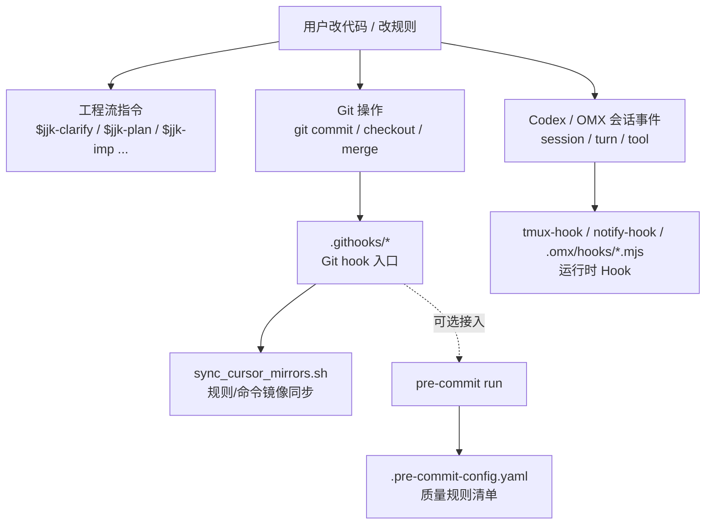
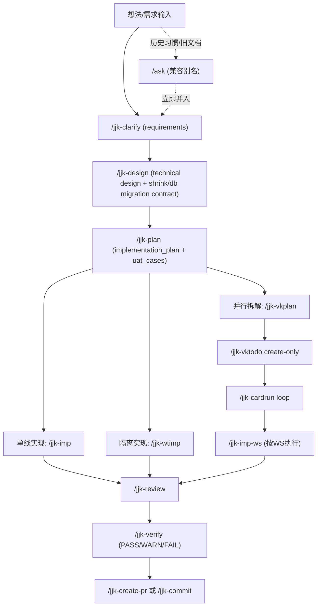
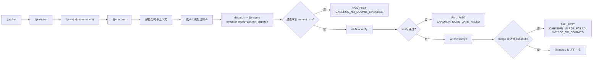
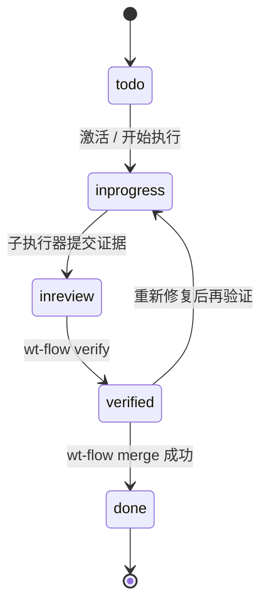
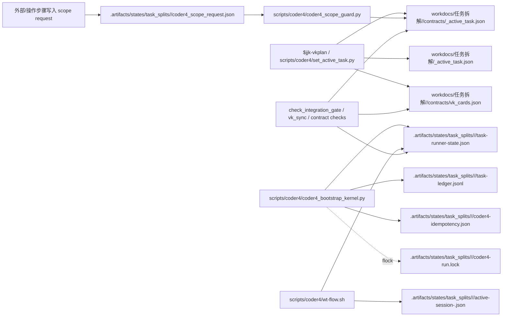
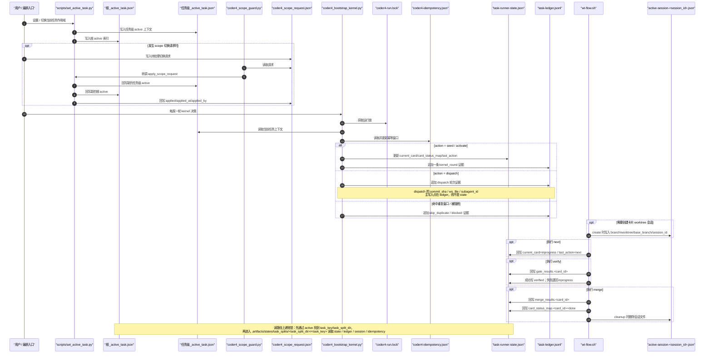

# 指令用法、实现方式与工程流全景手册

> 版本：`v1.7`
> 更新时间：`2026-03-11`
> 适用范围：本仓库 `jjk-*` 指令链 + 通用 `/plan /do` 指令（兼容历史 `/ask` 入口）。

---

## 0. 结论先行（给工程负责人）

1. 当前工程流已经形成“**发散 -> 冻结 -> 规划 -> 实施 -> 验收 -> 交付**”闭环，适合你现在“未上线、以设计合理性优先”的阶段。
2. 在你当前体系里，开发前的需求职责由 `requirements.md` 承担，技术方案职责由 `design.md` 承担；两层都必须审批通过后，才能进入 `/jjk-plan`。
3. 并行链路已具备可执行契约：`/jjk-vkplan -> /jjk-vktodo(create-only) -> /jjk-cardrun(loop) -> /jjk-wtimp(cardrun_dispatch)`，核心价值是可追溯、可回放、可阻断。
4. 所有关键命令都采用同一实现范式：`输入前置 -> FAIL_FAST -> 执行流程 -> 证据回填 -> 下一步分流`，可直接作为团队规范执行。

---

## 1. 权威源与实现边界

### 1.1 命令与文档权威源

| 项 | 权威源 | 说明 |
|---|---|---|
| 命令定义 | `.cursor/commands/*.md` | 命令语义、门禁、失败码、流程步骤的唯一权威源 |
| 运行镜像 | `.claude/commands/*.md`、`.agents/skills/jjk-*/SKILL.md` | 命令定义会同步生成跨 IDE 运行镜像；Codex 侧以 skills 形态消费，加前缀是为了不和ide自带指令冲突 |
| 项目覆盖模板 | `docs/内部参考/迭代需求/_templates/*.md` | 只放项目差异，不复制全量模板 |
| 全局模板 | `${CODEX_HOME:-$HOME/.codex}/engineering/templates/*.md` | `review/test/verify/refactor/wtimp/...` 报告模板首选 |

### 1.2 触发方式（跨 IDE）

| 环境 | 触发方式 |
|---|---|
| Claude Code / Cursor | 直接输入 `/jjk-xxx` |
| Codex | 使用 `$jjk-xxx`；`jjk-*` 指令会自动生成对应 skills，并以该形式触发 |

### 1.3 统一执行原则

1. **先门禁后执行**：任一前置缺失即 `FAIL_FAST`，禁止“先做再补”。
2. **可追溯优先**：`task_id/pr_id/card_id` 贯穿设计、计划、实现、审查、验收。
3. **证据优先**：无命令证据、无测试证据、无报告证据，不得宣称完成。
4. **边界优先**：WS 白名单、分支上下文、worktree 上下文必须一致。

### 1.4 Hook / 门禁分层（避免混淆）

**结论先行**：本仓库至少同时存在四套机制，职责完全不同，不能混用名词：

1. `jjk-*` / `/plan` / `/do` 是**工程流指令**，解决“需求怎么澄清、规划、实施、验收”。
2. `.githooks/*` 是 **Git hooks**，解决“`git commit` / `checkout` / `merge` 时自动触发什么”。
3. `.pre-commit-config.yaml` 是 **pre-commit 规则清单**，解决“提交前具体检查什么”。
4. `.omx/*`、`.omx/hooks/*.mjs`、`tmux-hook` / `notify-hook` 是 **Codex / OMX 运行时 hooks**，解决“代理会话/turn/tool 事件如何被监听、通知或注入”。



| 层 | 主要入口/文件 | 触发方式 | 解决的问题 | 当前仓库状态 |
|---|---|---|---|---|
| 工程流指令 | `.cursor/commands/*.md`、`.agents/skills/jjk-*/SKILL.md` | 手动触发 `$jjk-xxx` / `/plan` / `/do` | 设计冻结、规划、实施、验收 | 已建立主链 |
| Git hooks | `.githooks/pre-commit`、`.githooks/post-checkout`、`.githooks/post-merge`、`.githooks/post-rewrite` | Git 原生事件自动触发 | 提交/切分支/合并时执行脚本 | 已接线 |
| pre-commit 规则 | `.pre-commit-config.yaml` | 由 `pre-commit run` 或 `pre-commit install` 接入 Git hook 后触发 | 文档同步、YAML、尾随空格等质量门禁 | 已定义规则 |
| Codex / OMX hooks | `.omx/tmux-hook.json`、`.omx/hooks/*.mjs`、`notify-hook` | 会话/turn/tool 等运行时事件 | 通知、tmux 注入、插件扩展 | 基础设施存在 |

#### 1.4.1 当前仓库要点（直接回答常见混淆）

1. `.pre-commit-config.yaml` **不是** `jjk-*` 指令，也**不是** Git hook 文件本身；它只是 `pre-commit` 工具读取的**规则清单**。
2. 你记得的“改 `.cursor/rules` / `.cursor/commands` 后自动同步到 CC / Codex / skills”的链路，**属于 Git hook**：

   ```text
   .githooks/* -> sync_cursor_mirrors.sh -> scripts/sync_rules_to_cc.py
   ```

3. 当前仓库已经把 `core.hooksPath` 指到 `.githooks`，所以**规则镜像同步 hook 已经生效**。
4. 当前 `.githooks/pre-commit` 默认只负责**镜像同步**；`.pre-commit-config.yaml` 里的质量规则若要变成真实提交门禁，需要在这条链后面显式接入 `pre-commit run`。
5. `tmux-hook` / `notify-hook` / `.omx/hooks/*.mjs` 属于 **Codex / OMX 运行时 Hook**，和 Git 提交门禁不是同一层。
6. 仓库里另有 `scripts/auto_sync_rules.sh` 供 **Claude Code PostToolUse hook** 使用；它是“IDE/代理运行时镜像同步辅助脚本”，不等同于 Git 提交门禁。

#### 1.4.2 当前仓库的 Hook 实况（2026-03-08）

| 项 | 当前状态 | 说明 |
|---|---|---|
| Git 规则同步 hooks | 已接线 | `.githooks/*` 负责规则/命令镜像同步 |
| `.pre-commit-config.yaml` | 已存在 | 已定义 `doc-sync-check`、`check-yaml`、`end-of-file-fixer`、`trailing-whitespace` |
| `pre-commit` 质量门禁自动执行 | 默认未串入当前 `.githooks/pre-commit` 主路径 | 若要启用，应在保留镜像同步的前提下串接 `pre-commit run` |
| `tmux-hook` | 已启用 | 仅在允许的 mode 下执行注入 |
| `.omx/hooks/*.mjs` 自定义插件 | 当前未发现仓库内插件文件 | 说明扩展点存在，但本仓库暂未落自定义插件 |

---

## 2. 全量指令总览（19 条）

### 2.1 指令清单与职责

| 类别 | 命令 | 核心职责 | 关键输入 | 关键产出 |
|---|---|---|---|---|
| 兼容发散 | `/ask` | 历史兼容入口；收到后立即并入 `/jjk-clarify` | 用户显式输入 `/ask` / 旧文档链路 | 无独立权威产物 |
| 需求冻结 | `/jjk-clarify` | 输出纯需求合同 | 需求上下文 + 业务问答 | `requirements.md` |
| 方案冻结 | `/jjk-design` | 输出技术方案 + `shrink_contract` + `db_migration_contract` | 已审批 `requirements.md` | `design.md` |
| 架构门禁 | `/jjk-arch-gate` | 输出四段式架构结论并给出 GO/NO_GO 判定 | 改动意图 + 影响范围 + 上下文证据 | 架构门禁结论 + `next_step` |
| 规划 | `/jjk-plan` | 输出实施计划与 UAT 用例 | 已审批 `requirements.md` + `design.md` | `workdocs/任务拆解/<YYYY-MM-DD_主题>/contracts/implementation_plan.md` + `.../uat_cases.md` |
| 文档门禁 | `/jjk-api-doc-sync` | 命中接口变化时输出 API 文档同步清单 | 变更文件范围 / 契约变更说明 | 文档同步清单 + `sync_status` |
| 实现 | `/jjk-imp` | 按计划落码并回填证据 | `implementation_plan.md` + `uat_cases.md` | 代码 + `pr_ready_manifest` + `db_migration_evidence` |
| 隔离实现 | `/jjk-wtimp` | 独立 worktree 执行与合并 | `implementation_plan/manifest` | `workdocs/任务拆解/<YYYY-MM-DD_主题>/reports/wtimp_report.md` |
| 并行拆解 | `/jjk-vkplan` | 生成可落卡并行契约 | `implementation_plan.md` + `uat_cases.md` | `parallel_plan.md` + `WS-*.md` + `contracts/vk_cards.json` |
| 建卡 | `/jjk-vktodo` | create-only 幂等建卡 | `task_split_dir + vk_cards.json` | 建卡结果统计 |
| 串行调度 | `/jjk-cardrun` | 单活卡推进 + verify/merge 收口 | `vk_cards + parallel_plan + active_task` | 卡片执行证据 + 合并证据 |
| WS 实现 | `/jjk-imp-ws` | 单 WS 白名单实现与回填 | `WS-*.md + parallel_plan + vk_cards` | `pr_ready_manifest_ws` + WS 自检回填 |
| 审查 | `/jjk-review` | 审查需求/方案/计划/收口与迁移一致性 | PR/diff/manifest + 真理源 | `workdocs/任务拆解/<YYYY-MM-DD_主题>/reports/review_report.md` |
| 测试 | `/jjk-test` | 可追溯测试矩阵执行 | review/manifest/plan | `workdocs/任务拆解/<YYYY-MM-DD_主题>/reports/test_report.md` + 测试资产回填 |
| 验收 | `/jjk-verify` | 消费既有合同做最终验收 | requirements/design/plan/uat/evidence | `workdocs/任务拆解/<YYYY-MM-DD_主题>/reports/verify_report.md` |
| 交付 | `/jjk-create-pr` | 证据化创建/更新 PR | `pr_ready_manifest(_ws)` | PR 链接 + 交接摘要 |
| 本地交付收口 | `/jjk-commit` | 提交当前分支并通过 shared delivery engine 收口到 `master` | 验收证据 + commit message | `commit_sha` + delivery 状态 + `master` 新 HEAD |
| 生命周期清理 | `/jjk-deleteworktree` | 删除当前分支与当前附加 worktree | `/jjk-commit` 结果 / merge 证据 | 删除结果 + 残余风险 |
| 修复 | `/jjk-debug` | 先根因后修复 | 日志/报错/上下文 | `workdocs/任务拆解/<YYYY-MM-DD_主题>/reports/debug_report.md` |
| 重构 | `/jjk-refactor` | 按 shrink contract 做行为等价结构重构 | review/design 输入 | `refactor_report_<topic>.md` |
| 通用规划 | `/plan` | 轻量实施规划 | 设计文档 | `docs/plans/*-plan.md` |
| 通用执行 | `/do` | 按计划执行编码与测试 | 计划文档 | 修改结果 + 测试结果 + 完成报告 |
| 执行期瘦身门禁 | `lean-guard` | 热点文件禁止继续长胖 | 当前变更集 | 失败码 + 违规文件清单 |

### 2.2 推荐主链

```text
/jjk-clarify -> /jjk-design -> (/jjk-plan -> /jjk-imp | /jjk-plan -> /jjk-vkplan)
# 兼容旧习惯时，`/ask` 会在当前会话内立即并入 `/jjk-clarify`
 -> /jjk-review -> /jjk-verify -> (/jjk-create-pr | /jjk-commit)
```

治理前置补充：

1. 任何涉及模块边界、依赖方向、状态归属、错误处理责任的改动，都应在 `/jjk-design` 或 `/jjk-refactor` 前插入 `/jjk-arch-gate`。
2. 命中接口变化时，必须插入 `/jjk-api-doc-sync`；API 文档始终自动同步。
3. 命中 DB 结构变化时，`/jjk-design` 必须先冻结 `db_migration_contract`，`/jjk-plan` 必须拆出 migration task。

## 3. 工程流总图（图 + 路径）

### 3.1 全局流程图



### 3.2 主链不变量

| 阶段 | 真理源 | 不变量 |
|---|---|---|
| Clarify | `requirements.md` | 只定义做什么，不写怎么做 |
| Design | `design.md` | 必须包含 `change_map + shrink_contract + db_migration_contract` |
| Plan | `workdocs/任务拆解/<YYYY-MM-DD_主题>/contracts/implementation_plan.md` + `.../uat_cases.md` | 必须同时产出施工单与验收单 |
| Imp | 代码 + 执行证据 | 命中 DB 变化时默认自动执行 migration |
| Verify | `verify_report.md` | 只消费既有合同，不临场补 UAT |

### 3.3 并行链路中的硬收口点

| 收口点 | 必须动作 | 阻断条件 |
|---|---|---|
| `plan -> vkplan` | `implementation_plan + uat_cases` 完整 | task 缺口、UAT 缺口、migration 合同缺失 |
| `cardrun -> merge` | 每卡 `verify -> merge -> done` | 未 `verified`、无新提交、merge 失败 |
| `imp -> verify` | `acceptance_results + db_migration_evidence + doc sync` 齐全 | 证据缺失、迁移未证明、文档状态不一致 |

## 4. 指令“实现方式”统一模型（How）

### 4.1 每条命令的统一结构

绝大多数 `jjk-*` 命令采用相同骨架：

1. `输入前置（强制）`
2. `硬约束（FAIL_FAST 错误码）`
3. `执行流程（强制顺序）`
4. `输出模板（结论+证据）`
5. `禁止项（防漂移、防越权）`

### 4.2 失败即阻断（FAIL_FAST）

| 典型失败码 | 含义 |
|---|---|
| `CLARIFY_PRODUCT_CONTRACT_INCOMPLETE` | 冻结设计缺 PRD-Lite 关键字段 |
| `DESIGN_APPROVAL_REQUIRED` | 未审批设计直接进入规划 |
| `PLAN_CLARIFY_ALIGNMENT_FAILED` | 需求/方案/计划桥接校验失败 |
| `VKPLAN_CONSUMPTION_GAP` | 计划到卡片消费覆盖不完整 |
| `CARDRUN_DONE_GATE_FAILED` | 卡片完成门禁失败 |
| `IMP_WS_SCOPE_BROKEN` | WS 越界改动 |
| `REVIEW_BLOCKER_FOUND` | 审查阻断项未关闭 |
| `VERIFY_EVIDENCE_MISSING` | 验收证据不足 |
| `CREATE_PR_INPUT_INCOMPLETE` | PR 交付输入不完整 |

### 4.3 自动 Team 升级机制

多条命令内置“规模触发 Team”：

1. 文件数/模块数达到阈值；
2. 风险维度跨后端+前端+AI/DB；
3. 命令规模大（如大范围审查/测试/验收）。

不可用时要求输出降级标记（如 `TEAM_UNAVAILABLE_FALLBACK`），而不是静默退化。

### 4.4 证据化交付机制

| 阶段 | 证据要求 |
|---|---|
| 实现 | `acceptance_cmds` 执行结果 + changed_files + rollback_point |
| WS | `commit_sha` 必填（门禁/编排类可空提交但必须有理由） |
| 审查 | 发现分级 + 证据引用 + 结论类型 |
| 测试 | 命令、退出码、结果统计、缺陷清单 |
| 验收 | PASS/WARN/FAIL + UAT 结论 + 风险建议 |
| 交付 | PR 链接 + 任务映射 + 回滚说明 |

### 4.5 追溯主键体系（建议固定）

1. `task_id`：最小执行单元
2. `feature_id`：需求/能力聚合单元
3. `card_id`：并行卡片单元
4. `pr_id`：交付单元
5. `task_split_dir`：并行任务目录主键

### 4.6 文件编辑工具契约

1. 文件编辑以当前会话**实际暴露**的工具面为准。
2. 若没有独立 `apply_patch` 入口，禁止通过 `exec_command` 包装 `apply_patch`，并显式记录 `APPLY_PATCH_TOOL_UNAVAILABLE_FALLBACK`。
3. 该场景统一改用当前可用的直接写回方式；若环境随后真实暴露独立 `apply_patch` 工具，再切回真实工具。
4. 本约定只解决“工具面与指令文案冲突”，不得扩展为新的兼容层、隐藏副作用或静默补丁。

---

## 5. 逐条用法（详细版）

## 5.1 发散与冻结

### `/ask`

1. **何时用**：仅当用户显式输入 `/ask`，或沿用历史文档/习惯。
2. **核心动作**：在当前会话内立即并入 `/jjk-clarify`；如需求模糊，可先做探索轮，再冻结单一方案。
3. **强门禁**：禁止把 `/ask` 当作独立下游输入；若未收敛到 clarify 冻结门禁，输出 `ASK_DEPRECATED_REDIRECT_REQUIRED`。
4. **下游**：统一按 `/jjk-clarify -> /jjk-design` 进入，禁止维持独立 `/ask` 主链。

### `/jjk-clarify`

1. **何时用**：把讨论态需求冻结成可审批的 `requirements.md`。
2. **只做什么**：`problem_statement/target_users/core_scenarios/in_scope/out_of_scope/functional_requirements/non_functional_requirements/business_acceptance_criteria`。
3. **不做什么**：不写模块边界、不写文件路径、不写 task、不写 UAT。
4. **文档发布**：仅显式 `--doc` 时发布正式产品/需求文档；不带 `--doc` 也必须生成内部 `requirements.md`。
5. **下游**：审批通过后进入 `/jjk-design`。

### `/jjk-design`

1. **何时用**：已有已审批需求，需要冻结技术方案。
2. **必备输出**：`design.md` + 四段式架构结论 + `change_map` + `db_migration_contract` + `shrink_contract`。
3. **关键合同**：
   - `db_migration_required/db_migration_mode/release_migration_required/db_rollback_strategy`
   - `obsolete_paths/retained_paths/single_entry_owner/line_budget`
4. **文档发布**：仅显式 `--doc` 时发布正式设计/架构文档。
5. **下游**：进入 `/jjk-plan`；命中接口变化时先过 `/jjk-api-doc-sync`。

### `/jjk-plan`

1. **何时用**：已有已审批的 `requirements.md` 与 `design.md`，需要形成可执行计划。
2. **必备输出**：`workdocs/任务拆解/<YYYY-MM-DD_主题>/contracts/implementation_plan.md` + `.../uat_cases.md`。
3. **关键要求**：
   - 每个 task 都能回溯到需求与方案；
   - 命中 DB 变化时必须拆出 migration task；
   - 每条功能需求至少对应一条 UAT。
4. **DB 默认模板**：开发态使用 `bash scripts/db/run_dev_migration.sh`；若进入发布链路，再追加 Alembic。
5. **分流**：`next_step=/jjk-imp` 或 `next_step=/jjk-vkplan`。

### `/jjk-imp`

1. **何时用**：已有可执行 `implementation_plan` 与 `uat_cases`。
2. **执行核心**：严格按计划实现，不反向改需求或方案。
3. **DB migration**：命中 `db_migration_required=true` 时，默认自动执行 `bash scripts/db/run_dev_migration.sh`；若 `release_migration_required=true`，再补 `bash scripts/db/run_release_migration.sh --message "<message>"`。
4. **交接给验证**：必须回填 `acceptance_results`、`mandatory_evidence`、`db_migration_evidence`、文档同步状态。

### `/jjk-vkplan`

1. **何时用**：计划需要并行拆分、落卡执行。
2. **核心产物**：`parallel_plan.md` + `workstreams/WS-*.md` + `contracts/vk_cards.json`。
3. **强校验**：必须跑 `check_workflow_contract.py --mode plan_vk_coverage`，并确保 `clarify_plan_alignment.ok=true`。
4. **真理源写入**：`set_active_task.py` 写入并回读 `task_key/task_split_dir/project_id` 一致。

### `/jjk-vktodo`（create-only）

1. **何时用**：把 `contracts/vk_cards.json` 落到 Vibe Kanban。
2. **仅支持动作**：`create`，任何 `action!=create` 直接阻断。
3. **关键特性**：`task_key + card_id` 幂等去重，防重复建卡。
4. **重要边界**：不负责 move/review/done，不切换 active task。

### `/jjk-cardrun`

**结论先行**：`/jjk-cardrun` 不是“再来一个实现命令”，而是并行计划落卡后的**串行编排总控**。它的职责是把 `contracts/vk_cards.json` 中的卡片顺序、`_active_task.json` 中的活跃上下文、`/jjk-wtimp` 的单卡隔离执行能力，以及 `wt-flow.sh` 的 `verify/merge` 原子动作，收敛为一条唯一、可阻断、可回放、可审计的主链。

| 维度 | 说明 |
|---|---|
| 何时用 | 已完成 `/jjk-vkplan` 拆解并通过 `/jjk-vktodo` 建卡，准备进入“逐卡推进”阶段 |
| 主职责 | 单活卡调度、续跑恢复、执行器分派、`verify -> merge -> done` 收口 |
| 上游依赖 | `parallel_plan.md`、`workstreams/WS-*.md`、`contracts/vk_cards.json`、`_active_task.json` |
| 下游依赖 | `/jjk-wtimp(executor_mode=cardrun_dispatch)`、`scripts/coder4/wt-flow.sh` |
| 成功判据 | 当前卡有真实 `commit_sha` 证据、`verify` 通过、`merge` 成功、状态最终写为 `done` |
| 非职责 | 不负责拆卡、不负责直接写业务实现、不负责直接调用 VK API 改卡状态 |

1. **何时用**：已完成落卡，进入串行推进与收口。
2. **关键前提**：`execution_mode=serial` 且 `card_order` 非空。
3. **核心规则**：单活卡推进，必须 `verify -> merge -> done`。
4. **关键阻断**：无提交证据、merge 前未 `verified`、`ahead=0` 的空合并均阻断。

#### `/jjk-cardrun` 在整条工程流中的位置



#### 为什么需要 `cardrun`

| 设计问题 | `cardrun` 的回答 |
|---|---|
| 并行拆解后，如何避免多张卡同时乱跑？ | 用 `card_order` + 单活卡纪律控制，只允许一张卡处于主推进态 |
| 子执行器做完实现后，如何保证状态不是“口头完成”？ | 强制要求 `commit_sha`、`merge_sha` 等结构化证据回传 |
| 为什么不能让实现器直接把卡改成 done？ | `done` 是主干合并后的结果，不是“本地实现看起来完成”的主观判断 |
| 为什么 `wtimp` 不自己 merge？ | `cardrun` 要保证唯一收口路径，避免双 merge 主路径导致状态与证据分叉 |
| 为什么要强调 fail-fast？ | 卡片执行是主链动作，任何映射缺失、上下文错配、证据缺失都必须立刻阻断，而不是静默跳过 |

#### 输入、状态与输出真理源

| 类别 | 文件 / 字段 | 作用 | 状态归属 |
|---|---|---|---|
| 执行契约 | `workdocs/任务拆解/<task_split_dir>/contracts/vk_cards.json` | 定义 `execution_mode`、`card_order`、`cards`、`task_to_pr_mapping` | 并行计划产物，供 `cardrun` 只读消费 |
| 计划语义 | `parallel_plan.md` | 说明串行/并行阶段、依赖与总线策略 | `jjk-vkplan` 负责生成 |
| 单卡实现上下文 | `workstreams/WS-*.md` | 告诉下游执行器当前卡到底该做什么 | 对应 WS 文档自身 |
| 活跃任务索引 | `_active_task.json` | 提供 `task_split_dir/project_id/dispatch_executor` 等上下文 | 调度索引真理源 |
| 运行态状态 | `.artifacts/states/task_splits/<task_split_dir>/<task_key>/task-runner-state.json` | 记录当前卡、状态流转、执行尝试 | `kernel + wt-flow` 维护 |
| 执行证据 | `execution_evidence` / `commit_sha` / `merge_sha` | 证明“真执行过、真提交过、真合并过” | `wtimp` 回传，`cardrun`/ledger 收敛 |
| 用户输出 | `结论 / 当前动作 / 证据` 三行模板 | 用统一格式汇报每轮推进结果 | `cardrun` 对外责任 |

#### 实现机制：`cardrun` 怎么跑起来

| 阶段 | 机制 | 关键门禁 | 实现锚点 |
|---|---|---|---|
| 1. 合同预检 | 读取 `contracts/vk_cards.json` 校验 `execution_mode`、`card_order`、`cards`、`task_to_pr_mapping` 是否完整可解析 | 非 `serial`、空 `card_order`、卡片/PR 映射不完整直接阻断 | `scripts/coder4/coder4_bootstrap_kernel.py` |
| 2. 上下文校验 | 先采集 `pwd`、当前分支、`git worktree list`、干净度，确保自己站在正确仓库和正确会话里 | 错分支、错 state 目录、dirty worktree 阻断 | `.cursor/commands/jjk-cardrun.md` |
| 3. 选卡 / 续跑 | 优先恢复 `in_progress/in_review/verified` 卡；没有就调用 `wt-flow.sh next` 激活下一张卡 | 找不到可执行卡返回 `CARDRUN_ALL_DONE`，不会盲目新建动作 | `scripts/coder4/wt-flow.sh` |
| 4. Dispatch 子执行器 | 将当前卡对应 `WS-*.md` 全量交给 `/jjk-wtimp`，并固定使用 `executor_mode=cardrun_dispatch` | 子代理失败返回 `CARDRUN_SUBAGENT_FAILED`；没有 `commit_sha` 返回 `CARDRUN_NO_COMMIT_EVIDENCE` | `scripts/coder4/wtimp_dispatch_bridge.py` |
| 5. Done Gate | 先执行 `wt-flow.sh verify <card_id>`，对 acceptance 命令做白名单执行并收集证据 | `verify` 失败不允许进入 `done` | `scripts/coder4/wt-flow.sh` |
| 6. Merge 收口 | 校验“当前会话卡 == 当前激活卡”“状态已 verified”“分支 ahead>0”后再 merge | 未 verified、空合并、冲突或错卡一律阻断 | `scripts/coder4/wt-flow.sh` |
| 7. 循环推进 | `mode=loop` 时按 `max_cards` 控制推进轮数，一轮失败立刻停 | 禁止跳卡继续，避免把异常扩散到后续卡片 | `.cursor/commands/jjk-cardrun.md` |

#### 状态机：为什么必须 `verify -> merge -> done`



**要点**：

1. `verified` 是“验收门禁通过”，不是“已经并入主干”。
2. `done` 只能由 merge 成功写入，不能由实现器或人工口头判定。
3. 这条状态机把“实现完成”和“主干收口完成”明确拆开，避免把临时工作区状态误当最终交付状态。

#### 设计理念：它为什么这样设计

| 设计理念 | 含义 | 解决的问题 |
|---|---|---|
| 编排层与执行层分离 | `cardrun` 负责编排，`wtimp` 负责单卡实现，`wt-flow` 负责 git 原子动作 | 避免一个命令既调度又实现又合并，职责粘连 |
| 单活卡优先于吞吐量 | 一次只推进一张卡，先保证正确性和追溯性，再谈并行吞吐 | 防止跨卡污染、状态错写、主干误合并 |
| 证据先于状态 | 先有 `commit_sha` / `verify` / `merge` 证据，再允许状态推进 | 解决“看起来做了，但没有证据”的伪完成 |
| merge 主路径唯一 | `cardrun` 是唯一 merge 主路径，`wtimp(cardrun_dispatch)` 禁止重复 merge | 解决双重 merge、重复收口、状态竞争 |
| 契约优于猜测 | 优先读显式参数，其次 `_active_task.json`，再落到统一合同校验 | 防止不同入口各自猜测上下文导致跑偏 |
| 未上线阶段先修结构 | 默认追求链路闭环与设计合理性，而不是保留历史分叉兼容 | 消除 `imp-ws` 与 `wtimp` 并存造成的长期工程债务 |

#### `cardrun` 与相邻命令的边界

| 命令 / 组件 | 负责什么 | 不负责什么 |
|---|---|---|
| `/jjk-vkplan` | 把计划拆成 `parallel_plan.md`、`WS-*.md`、`contracts/vk_cards.json` | 不负责执行卡片 |
| `/jjk-vktodo` | 把 `contracts/vk_cards.json` 幂等落到 Vibe Kanban | 不负责推进状态、不负责串行执行 |
| `/jjk-cardrun` | 串行调度、单活卡推进、done gate、merge 收口 | 不直接写业务代码、不拆卡 |
| `/jjk-wtimp` | 在独立 worktree 内实现当前卡并回传结构化证据 | 在 `cardrun_dispatch` 模式下不负责 merge |
| `/jjk-imp-ws` | 作为单 WS 实现入口保留在体系内 | 不再是 `cardrun` 默认 dispatch 主链 |
| `wt-flow.sh` | 提供 `next/verify/merge/status` 等原子 git 生命周期动作 | 不理解业务语义，不决定卡片要做什么 |

#### 常见失败码与含义

| 错误码 | 触发条件 | 实际含义 |
|---|---|---|
| `CARDRUN_NOT_SERIAL` | `vk_cards.json.execution_mode != serial` | 当前拆解合同不是串行执行，不能用 `cardrun` |
| `CARDRUN_CARD_ORDER_EMPTY` | `card_order` 缺失或为空 | 没有明确顺序，编排器无法决定谁先做 |
| `CARDRUN_PR_MAPPING_MISSING` | `task_to_pr_mapping` 缺失或无效 | 卡片与交付单元无法建立追溯关系 |
| `CARDRUN_CONTEXT_INVALID` | 仓库/分支/worktree/state 上下文不一致 | 当前会话站错位置，继续执行会污染错误目标 |
| `CARDRUN_SUBAGENT_FAILED` | `wtimp` 执行失败或回执结构非法 | 子执行器未完成单卡实现闭环 |
| `CARDRUN_NO_COMMIT_EVIDENCE` | 子执行器未返回 `commit_sha` | 没有提交证据，不允许假装这张卡完成了 |
| `CARDRUN_DONE_GATE_FAILED` | `verify` 失败 | 验收门禁未通过，不能进入 merge |
| `CARDRUN_MERGE_FAILED` | merge 冲突或会话校验失败 | 主干收口失败，需先解决冲突或上下文错误 |
| `MERGE_NO_COMMITS` | 分支相对基线 `ahead=0` | 没有任何新提交，禁止“空合并后标 done” |

#### 维护者视角：看哪些文件最关键

| 文件 | 角色 |
|---|---|
| `.cursor/commands/jjk-cardrun.md` | `cardrun` 的命令契约、流程步骤、失败码定义 |
| `scripts/coder4/coder4_bootstrap_kernel.py` | 合同校验、上下文判定、dispatch 决策内核 |
| `scripts/coder4/wtimp_dispatch_bridge.py` | `cardrun -> wtimp` 的执行器桥接与结构化回执校验 |
| `scripts/coder4/wt-flow.sh` | `next / verify / merge` 的 worktree 生命周期原子动作 |
| `scripts/wt-flow.sh` | 仅 CLI wrapper；单一真理源仍是 `scripts/coder4/wt-flow.sh`，脱离仓库调试不要复制它 |
| `docs/plans/2026-03-06-cardrun-wtimp-executor-design.md` | `cardrun` 迁移到 `wtimp` 默认执行器的设计取舍说明 |
| `memory-bank.md` | `cardrun` 默认执行器与上下文防错相关长期决策记录 |

#### 一句话记忆

> `/jjk-cardrun` 的本质不是“执行一张卡”，而是“用唯一主链把一张卡从可执行状态推进到可合并、可追溯、可收口状态”。

### `/jjk-imp-ws`

1. **何时用**：执行某个具体 `WS-*.md`。
2. **核心约束**：只改 WS 白名单，跨 WS 必须阻断（`IMP_WS_SCOPE_BROKEN`）。
3. **门禁顺序**：并行层结束后再 `WS-G1`，最后 `WS-G2`。
4. **证据要求**：必须回填 `pr_ready_manifest_ws`，并提供 `commit_sha`。

## 5.4 审查、测试、验收、交付

### 命令执行拆分（2026-03-11）

1. 基础观测、期望比对、解释器解析、测试执行、统计汇总必须拆成独立命令，禁止为了省事拼成长 `&&` / `;` / 管道链。
2. 任一步失败只重跑当前步；长任务启动后只允许轮询或读取结果，禁止重复启动同一长任务。
3. 输出被截断时优先缩短当前步骤或分段读取，禁止为了拿尾部结果把整串命令再跑一遍。

### `/jjk-review`

1. **四维审查**：功能正确性、代码质量、安全稳定、测试文档一致性。
2. **结论级别**：`PASS` / `CONDITIONAL_PASS` / `BLOCKED`。
3. **产出**：`workdocs/任务拆解/<YYYY-MM-DD_主题>/reports/review_report.md`，附分级问题与证据。

### `/jjk-test`

1. **执行策略**：先建测试矩阵（AAA），再做 UI/API、数据层、系统层三层验证。
2. **关键规则**：只跑相关必要测试，不默认全量；失败必须记录退出码和责任归属。
3. **并行 Gate 场景**：需执行 `backfill_gate_status.py` 自动回填。

### `/jjk-verify`

1. **目标**：基于既有 `requirements/design/implementation_plan/uat_cases` 与实现证据给出最终判定。
2. **硬规则**：只判卷，不临场补 UAT、补需求或补方案。
3. **DB migration**：命中 DB 变化时，必须核对 `db_migration_evidence`；开发态至少证明 `bash scripts/db/run_dev_migration.sh` 已执行；发布态额外证明 Alembic 迁移文件与 `bash scripts/db/run_release_migration.sh --upgrade-only`。
4. **文档状态**：API 文档命中接口变化时必须已同步；正式产品/设计文档仅在发布标志开启时检查。
5. **结果**：输出 `PASS/WARN/FAIL` 与 `workdocs/任务拆解/<YYYY-MM-DD_主题>/reports/verify_report.md`。

### Lean Guard（热点文件瘦身门禁）

1. **目标**：把“热点文件禁止继续膨胀”变成自动阻断，而不是交付时口头解释。
2. **热点范围**：默认覆盖 `app/ai/workflow/**/*.py`、`app/services/**/*.py`、`scripts/**/*.py`。
3. **硬门禁**：超阈值文件继续净增长、继续新增私有 helper、继续新增嵌套函数时直接失败。
4. **执行入口**：`python3 scripts/ci/check_lean_budget.py --cached --strict`（本地），并在 `/jjk-imp`、`/jjk-debug`、`/jjk-refactor` 中作为完成前硬门禁。

### `/jjk-create-pr`

1. **输入源**：`pr_ready_manifest` 或 `pr_ready_manifest_ws`。
2. **硬门禁**：字段缺失、映射不一致、验收证据缺失、分支不一致均阻断。
3. **平台策略**：GitHub MCP 优先；不可用时输出 fallback 并停止，不默认 `gh` CLI。
4. **产出**：PR 链接 + 任务映射 + 验收证据 + 回滚方案。

### `/jjk-commit`

1. **目标**：把当前 worktree 上已验证的改动提交，并通过 shared delivery engine 收口到主工作区 `master`。
2. **硬门禁**：当前就在 `master`、缺少 commit message、缺少验证证据、当前 worktree 脏状态、delivery 恢复上下文缺失时直接阻断。
3. **合并策略**：命令层不再直接维护 `ff-only` 口径，而是委托 shared delivery engine 统一执行 `prepare-base / rebase / merge / abort / continue / status`。
4. **产出**：`commit_sha`、delivery 状态、合并后 `master` HEAD、验证证据摘要、是否建议执行 `/jjk-deleteworktree`。

### `/jjk-deleteworktree`

1. **目标**：在当前分支已并入 `master` 后，删除当前附加 worktree 与当前分支。
2. **硬门禁**：主工作区禁止删、未合并禁止删、worktree 脏状态禁止删、缺少交付证据禁止删。
3. **执行约束**：必须从安全目录执行删除，禁止在被删除目录内自删，也禁止顺手删除其他 worktree。
4. **产出**：删除结果、分支删除结果、合并依据、残余风险。

## 5.5 修复与治理

### `/jjk-arch-gate`

1. **目标**：任何改动前先输出“模块边界、依赖方向、状态归属、错误处理责任”四段式结论。
2. **默认判定**：未上线阶段只要问题落在结构/依赖/状态/错误责任层，默认走 `refactor`，而不是 `patch`。
3. **产出**：四段式架构门禁结论 + `GO/NO_GO` + `next_step`（`/jjk-plan`、`/jjk-imp`、`/jjk-refactor`）。

### `/jjk-api-doc-sync`

1. **目标**：命中路由 / schema / DTO / 接口语义变更时，先把必须同步的文档、测试资产与接口说明列清楚。
2. **默认判定**：代码-文档不同步、测试案例未回填、接口说明缺失时直接阻断。
3. **产出**：`Must Update / Should Review / Not In Scope` 三栏同步清单 + `sync_status`。

### `/jjk-debug`

1. **默认模式**：诊断+修复；`--diagnose-only`：只诊断不改码（产出 `workdocs/任务拆解/<YYYY-MM-DD_主题>/contracts/fix_plan.md`）。
2. **刚性原则**：先根因调查，再最小修复，再验证收口。
3. **目标产出**：`workdocs/任务拆解/<YYYY-MM-DD_主题>/reports/debug_report.md`，含“排除假设链”与修复证据链。

### `/jjk-refactor`

1. **目标**：行为等价前提下改善结构。
2. **步骤**：锁定等价约束 -> 切片设计 -> 守护测试 -> 质量对照 -> 报告交接。
3. **阻断**：无行为基线、证据缺失、行为漂移直接失败。

## 5.6 通用补充命令

### `/plan`

1. 轻量实施规划命令，产出 `docs/plans/YYYY-MM-DD-<topic>-plan.md`。
2. 适合非 `jjk-*` 领域化流程的中小任务。

### `/do`

1. 按已有计划执行编码、测试、审查。
2. 偏通用执行入口，不替代 `jjk-*` 的严谨门禁链。

---

## 6. 关键脚本与执行落点（实现层）

| 脚本 | 主要命令 | 作用 |
|---|---|---|
| `scripts/check_workflow_contract.py --mode clarify_plan` | `/jjk-plan` | 校验 requirements / design / implementation_plan 承接完整性 |
| `scripts/check_workflow_contract.py --mode plan_vk_coverage` | `/jjk-vkplan`、`/jjk-cardrun` | 校验计划到卡片消费覆盖 |
| `scripts/set_active_task.py` | `/jjk-vkplan` | 写入并回读任务级真理源 |
| `scripts/coder4/wt-flow.sh` | `/jjk-cardrun`、`/jjk-wtimp` | worktree 生命周期管理（next/verify/merge） |
| `scripts/backfill_gate_status.py` | `/jjk-imp-ws`、`/jjk-test` | Gate 卡自动回填，禁止手工改状态 |
| `scripts/vk_ports.sh` | `/jjk-verify`、`/jjk-test` | 分支/工作树端口与 URL 上下文计算 |
| `scripts/docs_guard.py` | `/jjk-plan` | 文档索引与完整性校验 |
| `scripts/coder4/coder4_scope_guard.py` | `/jjk-wtimp` | 执行范围守卫，防越界修改 |
| `.githooks/sync_cursor_mirrors.sh` | `git pre-commit` / `post-checkout` / `post-merge` / `post-rewrite` | 规则、命令与指南镜像同步入口 |
| `scripts/sync_rules_to_cc.py` | Git hooks / 手动执行 | 同步 `AGENTS`、rules、commands 到 Claude / Codex / skills 镜像 |
| `scripts/auto_sync_rules.sh` | Claude Code `PostToolUse` hook | 代理运行时镜像同步辅助，回退到 Git 状态探测 |


### 6.1 先说边界：本节统计哪些“状态文件”

**结论先行**：本节说的“状态文件”，只统计会被 `jjk-*` 主工程流脚本**直接读写**、并参与“选任务 / 选卡 / 去重 / 验证 / 合并 / 审计”的文件。`contracts/vk_cards.json`、`parallel_plan.md`、`WS-*.md` 这类**合同/计划文件**不算运行态状态文件；`review_report`、`pr_ready_manifest` 这类**交付工件**也不算。

| 类别 | 纳入本节 | 典型文件 | 原因 |
|---|---|---|---|
| 作用域与活跃索引 | 是 | `_active_task.json` | 决定“当前任务是谁” |
| 任务运行态 | 是 | `task-runner-state.json` | 决定“当前卡跑到哪一步” |
| 事件账本 | 是 | `task-ledger.jsonl` | 记录“每一轮到底发生了什么” |
| 会话控制 | 是 | `active-session-<session_id>.json` | 决定“当前 worktree 会话是谁” |
| 幂等/锁/恢复 | 是 | `coder4-idempotency.json`、`coder4-run.lock`、`task-runner-state.json.lock`、`task-runner-state.json.bak` | 保证运行安全，不保证业务语义 |
| 切换请求 | 条件纳入 | `coder4_scope_request.json` | 只在 scope 切换场景出现 |
| 合同文件 | 否 | `contracts/vk_cards.json`、`parallel_plan.md`、`WS-*.md` | 它们定义任务，不记录运行态 |
| 交付工件 | 否 | `review_report_*.md`、`pr_ready_manifest*` | 它们是输出物，不是运行状态真理源 |

### 6.2 当前实现的状态目录结构

```text
workdocs/任务拆解/
├── _active_task.json                                           # 根索引 active
└── <task_split_dir>/
    ├── contracts/
    │   ├── _active_task.json                                   # 任务级 active 真理源
    │   └── vk_cards.json                                       # 合同文件（非运行态）
    ├── reports/
    │   ├── preflight_status.json                               # 预检报告
    │   ├── consumption_report.json                             # 规划/拆卡报告
    │   ├── gate_contract_report.json                           # Gate 契约报告
    │   └── sync/
    │       ├── vktodo_create_result.json                       # 建卡报告
    │       └── vksync_status.json                              # 对账报告
    ├── parallel_plan.md
    └── workstreams/WS-*.md

.artifacts/states/task_splits/
└── <task_split_dir>/
    ├── coder4_scope_request.json                               # 可选：scope 切换请求
    └── <task_key>/
        ├── task-runner-state.json                              # 主运行态
        ├── task-ledger.jsonl                                   # 追加式事件账本
        ├── active-session-<session_id>.json                   # 当前 worktree 会话
        ├── coder4-idempotency.json                             # 幂等窗口记录
        ├── coder4-run.lock                                     # 运行锁
        ├── task-runner-state.json.lock                         # 状态文件锁
        └── task-runner-state.json.bak                          # 状态恢复备份
```



#### 6.2.1 状态文件写入时序图

**结论先行**：状态文件的写入不是“一次性全写完”，而是沿着 `active 锁定 -> kernel 轮次推进 -> wt-flow 会话与 gate/merge 收口` 逐步落盘。`_active_task.json` 先确定“当前任务是谁”，随后 `coder4_bootstrap_kernel.py` 写运行保护与轮次证据，最后 `wt-flow.sh` 写会话态和 `verify/merge` 收口结果。



**怎么读这张图**：

1. `set_active_task.py` 负责先把“当前任务是谁”写稳；
2. `coder4_bootstrap_kernel.py` 负责轮次级写入：运行锁、幂等窗口、ledger，以及部分 `task-runner-state.json`；
3. `wt-flow.sh` 负责会话级与收口级写入：`active-session`、`verify`、`merge`；
4. `task-ledger.jsonl` 更像“事件流水账”，`task-runner-state.json` 更像“当前快照”；
5. 真正决定一张卡是否完成的最终写入点，是 `wt-flow.sh merge -> task-runner-state.json.merge_results + card_status_map=done`。

#### 6.2.2 状态文件读取时序图

**结论先行**：读链路和写链路不同，它不是“先读某一个大文件就够了”，而是先定位 active，再据此推导 `task_split_dir / task_key`，随后才去解析 `contracts/vk_cards.json`、`task-runner-state.json`、`active-session-<session_id>.json` 等具体文件。不同脚本读的终点不同，但入口几乎都从 `_active_task.json` 开始。

```mermaid
sequenceDiagram
    autonumber
    participant U as "用户 / 命令入口"
    participant K as "coder4_bootstrap_kernel.py"
    participant W as "wt-flow.sh"
    participant V as "coder4_vk_sync.py"
    participant RootA as "根 _active_task.json"
    participant TaskA as "任务级 _active_task.json"
    participant VK as "vk_cards.json"
    participant State as "task-runner-state.json"
    participant Session as "active-session-<session_id>.json"
    participant IG as "check_integration_gate"

    alt kernel / vk_sync 读链
        U->>K: 触发 cardrun kernel 决策
        K->>TaskA: 优先读显式 --active-task；否则寻找唯一任务级 _active_task.json
        alt 传入的是根索引 active
            K->>RootA: 先读根索引
            RootA-->>K: 返回 active_task_path / task_split_dir
            K->>TaskA: 跳转到任务级 _active_task.json
        end
        TaskA-->>K: 返回 task_key/task_split_dir/project_id/execution_mode
        K->>VK: 解析并读取 vk_cards.json
        K->>State: 解析 .artifacts/states/task_splits/<task_split_dir>/<task_key>/task-runner-state.json
        K->>K: 构建 card_status_map / preflight / dispatch 上下文

        U->>V: 触发 vk sync
        V->>TaskA: 按同样规则定位 active
        TaskA-->>V: 返回 task_split_dir/task_key
        V->>VK: 读取 vk_cards.json
        V->>State: 读取 task-runner-state.json
        V->>V: 把本地状态映射为 VK 状态更新
    else wt-flow 读链
        U->>W: 执行 next / verify / merge / status
        W->>TaskA: 先读 WT_FLOW_ACTIVE_TASK_FILE；否则按 split_dir/候选自动定位
        TaskA-->>W: 返回 task_key/task_split_dir
        W->>State: 根据 task_key 读取 task-runner-state.json
        opt verify / merge / status 需要会话上下文
            W->>Session: 按 WT_FLOW_SESSION_ID 或唯一会话文件读取
            Session-->>W: 返回 branch/worktree/base_branch/session_id
        end
        W->>VK: 读取 vk_cards.json，校验 card_order / acceptance_checks / card 是否存在
    end

    U->>IG: 执行 integration gate
    IG->>State: 读取 task-runner-state.json
    State-->>IG: 返回 card_status_map / merge_results
    IG->>IG: 判定主干是否已真正可见

    Note over RootA,TaskA: 读侧的关键分叉点是：
是否直接拿到了任务级 _active_task.json。
如果没有，就必须先做 active 解析和作用域归一。
```

**怎么读这张图**：

1. 大多数脚本不是直接“盲读 `.artifacts` 运行态目录”，而是先通过 `_active_task.json` 找到 `task_key/task_split_dir`；
2. `coder4_bootstrap_kernel.py` 和 `coder4_vk_sync.py` 的读链最像：`active -> task-scoped active -> vk_cards -> state`；
3. `wt-flow.sh` 的读链更偏执行态：`active -> state -> session -> vk_cards`；
4. `check_integration_gate` 读得最“后置”，它主要盯 `task-runner-state.json` 里的 `merge_results` 与 `card_status_map`；
5. 真正容易出错的地方通常不是 state 本身，而是“active 指到了错误任务”或“session 文件和 current_card 对不上”。

### 6.3 状态文件总表（按当前实现）

| 文件 | 类型 | 核心作用 | 主要写入者 | 主要读取者 | 是否允许手工编辑 |
|---|---|---|---|---|---|
| `workdocs/任务拆解/_active_task.json` | 根索引 | 给脚本一个默认“当前任务指针” | `scripts/coder4/set_active_task.py` | `coder4_bootstrap_kernel.py`、`coder4_vk_sync.py`、其他默认解析逻辑 | 不建议 |
| `workdocs/任务拆解/<task_split_dir>/contracts/_active_task.json` | 任务级真理源 | 锁定当前任务的 `task_key/task_split_dir/project_id` 等上下文 | `scripts/set_active_task.py` | `jjk-vkplan`、`jjk-vktodo`、`jjk-cardrun`、`wt-flow.sh`、`coder4_bootstrap_kernel.py`、`coder4_vk_sync.py` | 禁止 |
| `.artifacts/states/task_splits/<task_split_dir>/<task_key>/task-runner-state.json` | 主运行态 | 记录卡片状态机、gate、merge 结果 | `coder4_bootstrap_kernel.py`、`wt-flow.sh` | `wt-flow.sh`、`check_integration_gate.py`、`coder4_bootstrap_kernel.py`、`coder4_vk_sync.py` | 禁止 |
| `.artifacts/states/task_splits/<task_split_dir>/<task_key>/task-ledger.jsonl` | 事件账本 | 追加记录每轮推进证据 | `coder4_bootstrap_kernel.py` | 审计/排障、`check_workflow_contract.py` 真理源识别 | 禁止 |
| `.artifacts/states/task_splits/<task_split_dir>/<task_key>/active-session-<session_id>.json` | 会话态 | 记录当前 worktree 会话位置 | `wt-flow.sh create` | `wt-flow.sh merge/status/cleanup`、会话解析逻辑 | 禁止 |
| `.artifacts/states/task_splits/<task_split_dir>/<task_key>/coder4-idempotency.json` | 运行控制 | 防止短时间重复触发同一轮 | `coder4_bootstrap_kernel.py` | `coder4_bootstrap_kernel.py` | 禁止 |
| `.artifacts/states/task_splits/<task_split_dir>/<task_key>/coder4-run.lock` | 运行控制 | 保证同一任务同一时刻只有一个 kernel 轮次持锁执行 | `coder4_bootstrap_kernel.py` | `coder4_bootstrap_kernel.py` | 禁止 |
| `.artifacts/states/task_splits/<task_split_dir>/coder4_scope_request.json` | 可选切换态 | 请求把 active scope 切到某个任务 | 外部编排器/操作步骤写入，`set_active_task.py` 回写 applied 字段 | `coder4_scope_guard.py`、`set_active_task.py` | 不建议 |
| `.artifacts/states/task_splits/<task_split_dir>/<task_key>/task-runner-state.json.lock` | 辅助锁文件 | `task-runner-state.json` 的文件锁副产物 | `coder4_bootstrap_kernel.py` | 锁机制自身、`check_workflow_contract.py` 识别 | 禁止 |
| `.artifacts/states/task_splits/<task_split_dir>/<task_key>/task-runner-state.json.bak` | 恢复文件 | 状态写入失败时用于恢复 | `coder4_bootstrap_kernel.py` | `load_local_state()` 恢复逻辑 | 禁止 |

### 6.4 两个 `_active_task.json`：名字一样，职责不一样

| 文件 | 本质 | 核心差异 |
|---|---|---|
| `workdocs/任务拆解/_active_task.json` | 根索引 | 是“默认入口指针”，方便脚本在未显式传路径时找到当前任务 |
| `workdocs/任务拆解/<task_split_dir>/contracts/_active_task.json` | 任务级真理源 | 是当前任务的正式上下文，真正决定 `task_key/task_split_dir/project_id` |

#### 6.4.1 任务级 `_active_task.json`

**作用**：回答“当前到底是哪一个任务在跑”。它是串起 `contracts/vk_cards.json`、`.artifacts/states/task_splits/<task_split_dir>/<task_key>`、`wt-flow.sh`、`coder4_bootstrap_kernel.py` 的桥梁文件。

**主要写入者**：

1. `scripts/set_active_task.py`：直接设置任务作用域；
2. `scripts/coder4/coder4_scope_guard.py`：自己不直接写，而是转调 `scripts/set_active_task.py` 应用 scope request。

**主要消费方**：

1. `/jjk-vkplan`：写入并回读作用域一致性；
2. `/jjk-vktodo`：校验 `task_key/task_split_dir` 与 `contracts/vk_cards.json` 一致；
3. `/jjk-cardrun` / `wt-flow.sh`：确定任务根目录与 task_key；
4. `coder4_bootstrap_kernel.py`：构建内核上下文；
5. `coder4_vk_sync.py`：把本地状态回写到 VK 时解析当前任务。

| 字段 | 含义 | 谁写入 | 谁消费 / 用途 |
|---|---|---|---|
| `project_id` | 当前任务对应的 VK 项目 ID | `set_active_task.py` | 给 `vktodo`、VK sync、kernel 找对项目 |
| `task_split_dir` | 任务拆解目录名 | `set_active_task.py` | 反向定位 `contracts/vk_cards.json`、`workstreams/`、`.artifacts/states/task_splits/<task_split_dir>/` |
| `task_key` | 任务主键 / 追溯主键 | `set_active_task.py`（从 `contracts/vk_cards.json.task_key` 提取） | 生成 `.artifacts/states/task_splits/<task_split_dir>/<task_key>` 路径、构建分支与会话名 |
| `execution_mode` | 执行模式，当前主链要求 `serial` | `set_active_task.py`（从 `contracts/vk_cards.json` 读取） | kernel/cardrun 判断是否允许串行推进 |
| `single_active_card` | 是否只允许单活卡 | `set_active_task.py` | scope guard / kernel 保证单卡推进纪律 |
| `auto_done_policy` | 自动完成策略 | `set_active_task.py`（优先 `contracts/vk_cards.json.auto_done_policy`） | 决定卡片完成策略口径 |
| `preflight_required` | 预检卡 ID，默认常见为 `C00` | `set_active_task.py`（优先 `contracts/vk_cards.json.preflight.card_id`） | kernel 判断是否允许进入正式推进 |
| `status_source_of_truth` | 预检状态来源文件路径 | `set_active_task.py` | kernel 在 preflight 阶段读取外部状态来源 |
| `updated_at` | 最近一次写入时间 | `set_active_task.py` | 诊断“当前 active 什么时候切换的” |
| `updated_by` | 最近一次写入者 | `set_active_task.py` / `coder4_scope_guard.py` 透传 | 诊断“是谁切了 active” |
| `dispatch_executor` | **可选扩展字段**；当前 dispatch 执行器 | 上游流程可扩展写入；缺省时 kernel 默认 `wtimp` | `coder4_bootstrap_kernel.py` 用它决定 dispatch 走谁 |
| `dispatch_executor_mode` | **可选扩展字段**；执行器模式 | 上游流程可扩展写入；缺省时默认 `cardrun_dispatch` | `coder4_bootstrap_kernel.py` 用它决定执行器运行模式 |

> 说明：`dispatch_executor` / `dispatch_executor_mode` 当前是“可安全扩展字段”。`set_active_task.py` 默认不主动生成它们，但内核会在存在时读取，不存在时回退到默认值。

#### 6.4.2 根索引 `_active_task.json`

**作用**：回答“如果脚本没拿到显式任务路径，默认应该去读哪个任务”。它不是新的真理源，本质上是**任务级 `_active_task.json` 的镜像索引**。

| 字段 | 含义 | 谁写入 | 谁消费 / 用途 |
|---|---|---|---|
| 与任务级 `_active_task.json` 相同的全部字段 | 镜像当前 active 任务上下文 | `set_active_task.py` | 供默认解析逻辑直接消费 |
| `active_task_path` | 指向真正的任务级 `_active_task.json` 的绝对路径 | `set_active_task.py` | 让 kernel / sync 脚本能从根索引跳转到任务级真理源 |

#### 6.4.3 `_active_task.json` 示例

**任务级 `_active_task.json` 示例**：

```json
{
  "project_id": "project-1",
  "task_split_dir": "2026-03-06_cardrun_wtimp_executor",
  "task_key": "PP-20260306-CARDRUN-WTIMP",
  "execution_mode": "serial",
  "single_active_card": true,
  "auto_done_policy": "hard_gate",
  "preflight_required": "C00",
  "status_source_of_truth": "/Users/jijingkun/bojxAI/fastapi/workdocs/任务拆解/2026-03-06_cardrun_wtimp_executor/reports/preflight_status.json",
  "updated_at": "2026-03-07T10:15:00+08:00",
  "updated_by": "scripts/set_active_task.py",
  "dispatch_executor": "wtimp",
  "dispatch_executor_mode": "cardrun_dispatch"
}
```

**根索引 `_active_task.json` 示例**：

```json
{
  "project_id": "project-1",
  "task_split_dir": "2026-03-06_cardrun_wtimp_executor",
  "task_key": "PP-20260306-CARDRUN-WTIMP",
  "execution_mode": "serial",
  "single_active_card": true,
  "auto_done_policy": "hard_gate",
  "preflight_required": "C00",
  "status_source_of_truth": "/Users/jijingkun/bojxAI/fastapi/workdocs/任务拆解/2026-03-06_cardrun_wtimp_executor/reports/preflight_status.json",
  "updated_at": "2026-03-07T10:15:00+08:00",
  "updated_by": "scripts/set_active_task.py",
  "dispatch_executor": "wtimp",
  "dispatch_executor_mode": "cardrun_dispatch",
  "active_task_path": "/Users/jijingkun/bojxAI/fastapi/workdocs/任务拆解/2026-03-06_cardrun_wtimp_executor/contracts/_active_task.json"
}
```

**怎么读这个示例**：

1. 任务级文件负责表达“当前任务上下文”；
2. 根索引只是镜像当前 active，额外多一个 `active_task_path`；
3. `dispatch_executor*` 是可选扩展字段，存在时覆盖默认 dispatch 配置，不存在时内核回退默认值。

### 6.5 `task-runner-state.json`：主运行态状态机

**作用**：回答“当前卡跑到哪一步、最近一次动作是什么、验证和合并结果如何”。这是工程流里最重要的运行态文件。

**主要写入者分工**：

| 写入者 | 负责写什么 |
|---|---|
| `coder4_bootstrap_kernel.py` | `seed/activate` 阶段的 `card_status_map/current_card/last_action/last_action_result/created_at/last_updated`，以及 `last_auto_wake_*` |
| `wt-flow.sh next` | 把下一张卡设为 `inprogress`，并回写 `last_action=next` |
| `wt-flow.sh verify` | 回写 `verified` 或退回 `inprogress`，并写 `gate_results` |
| `wt-flow.sh merge` | 回写 `done`，并写 `merge_results` |

**核心原则**：

1. 它记录**状态机结果**，不记录完整“事件流水”；
2. `dispatch` 的结构化证据主要写到 `task-ledger.jsonl`，而不是把所有过程都塞进 state；
3. `wt-flow verify -> merge` 是 `verified -> done` 的唯一收口路径；
4. 首次创建通常来自上游初始化或 kernel 的本地状态写入，`wt-flow.sh` 更偏向“更新既有状态”，不是负责无条件从零建全量 state。

#### 6.5.1 顶层字段

| 字段 | 含义 | 典型写入者 | 备注 |
|---|---|---|---|
| `schema_version` | 状态文件 schema 版本 | `coder4_bootstrap_kernel.py` | 当前常见为 `1.0.0` |
| `task_key` | 当前状态文件所属任务主键 | kernel / 上游初始化 | 用于确认 `.artifacts/states/task_splits/<task_split_dir>/<task_key>` 与 active 一致 |
| `card_order` | 卡片顺序 | kernel / 上游初始化 | `wt-flow`、kernel 都按它推进 |
| `card_status_map` | 当前卡片状态映射 | kernel、`wt-flow.sh` | 当前主读字段，状态值会被规范化成 `todo/inprogress/inreview/verified/done/missing` |
| `card_status` | `card_status_map` 的兼容镜像 | kernel、`wt-flow.sh` | 旧读侧兼容字段，不建议单独信任 |
| `current_card` | 当前激活卡 | kernel、`wt-flow.sh` | merge 会检查“当前会话卡 == current_card” |
| `execution_mode` | 执行模式 | 上游初始化时常见 | `wt-flow.sh` 读取，缺失时会按 `serial` 兜底 |
| `created_at` | 状态文件创建时间 | kernel 首次写入时 | 不是每次更新都改 |
| `last_updated` | 最近更新时间 | kernel、`wt-flow.sh` | 用于判断状态新鲜度 |
| `last_action` | 最近一次主动作 | kernel、`wt-flow.sh` | 常见值：`seed`、`activate`、`next`、`verify`、`merge` |
| `last_action_result` | 最近一次主动作结果 | kernel、`wt-flow.sh` | 常见值：`CARD_SEEDED:*`、`activated_by_wt_flow`、`done_gate_passed_waiting_merge`、`merged_to_base` |
| `gate_results` | 每张卡的验收门禁结果 | `wt-flow.sh verify` | 只有跑过 verify 才会出现 |
| `merge_results` | 每张卡的合并结果 | `wt-flow.sh merge` | 只有 merge 成功后才会出现 |
| `last_auto_wake_card` | 最近一次触发 auto wake 的卡 | kernel | 防止对同一张 done 卡重复 wake |
| `last_auto_wake_at` | 最近一次 auto wake 时间 | kernel | 与 `last_auto_wake_card` 成对出现 |
| `no_increment_count` | 连续未推进计数 | `wt-flow.sh verify` / merge 流程 | verify 失败会递增，成功 merge 会归零 |

#### 6.5.2 `card_status_map` 的状态含义

| 状态值 | 含义 | 常见写入者 |
|---|---|---|
| `missing` | 该卡在当前读侧看不到运行态记录 | kernel 读侧推导 |
| `todo` | 已建卡/已 seed，但未激活 | kernel `seed` |
| `inprogress` | 已激活，正在执行或 verify 失败后回退 | kernel `activate`、`wt-flow.sh next`、`wt-flow.sh verify(失败)` |
| `inreview` | 当前实现保留的中间态 | 上游/兼容态，当前主链较少直接写入 |
| `verified` | done gate 已通过，等待 merge | `wt-flow.sh verify(成功)` |
| `done` | 已完成 merge，主干已收口 | `wt-flow.sh merge` |

#### 6.5.3 `gate_results.<card_id>` 子结构

| 字段 | 含义 | 谁写入 |
|---|---|---|
| `passed` | 当前卡本次 verify 是否通过 | `wt-flow.sh verify` |
| `checked_at` | verify 时间 | `wt-flow.sh verify` |
| `worktree_path` | 当时跑检查的 worktree 路径 | `wt-flow.sh verify` |
| `evidence` | 验收命令逐条执行证据数组 | `wt-flow.sh verify` |

`evidence[]` 中常见字段：

| 字段 | 含义 |
|---|---|
| `check` | 原始 acceptance check |
| `normalized_check` | 规范化后的命令 |
| `run_check` | 实际执行命令 |
| `prefix` | 命令前缀，用于白名单校验 |
| `result` | `pass` / `fail` / `blocked_not_allowed` / `no_checks_defined` |
| `output` | 命令输出 |
| `exit_code` | 失败时的退出码 |

#### 6.5.4 `merge_results.<card_id>` 子结构

| 字段 | 含义 | 谁写入 |
|---|---|---|
| `merged` | 是否完成 merge | `wt-flow.sh merge` |
| `merged_at` | merge 时间 | `wt-flow.sh merge` |
| `branch` | 被合并的 feature 分支 | `wt-flow.sh merge` |
| `base_branch` | 合入的基线分支 | `wt-flow.sh merge` |
| `merge_commit` | merge 提交 SHA | `wt-flow.sh merge` |

#### 6.5.5 `task-runner-state.json` 示例

**一个已经完成 `verify -> merge` 的完整示例**：

```json
{
  "schema_version": "1.0.0",
  "task_key": "PP-20260307-VERIFIED-STATE",
  "execution_mode": "serial",
  "card_order": [
    "C01",
    "C02"
  ],
  "current_card": "C01",
  "card_status_map": {
    "C01": "done",
    "C02": "todo"
  },
  "card_status": {
    "C01": "done",
    "C02": "todo"
  },
  "gate_results": {
    "C01": {
      "passed": true,
      "checked_at": "2026-03-07T12:10:00Z",
      "worktree_path": "/Users/jijingkun/bojxAI/fastapi/.worktrees/PP-20260307-VERIFIED-STATE/C01/1741320600-abcd",
      "evidence": [
        {
          "check": "rg -n "fixture" README.md",
          "normalized_check": "rg -n "fixture" README.md",
          "run_check": "rg -n "fixture" README.md",
          "prefix": "rg",
          "result": "pass",
          "output": "1:fixture"
        }
      ]
    }
  },
  "merge_results": {
    "C01": {
      "merged": true,
      "merged_at": "2026-03-07T12:12:00Z",
      "branch": "feature/PP-20260307-VERIFIED-STATE/C01/1741320600-abcd",
      "base_branch": "master",
      "merge_commit": "abc123def456"
    }
  },
  "last_action": "merge",
  "last_action_result": "merged_to_base",
  "no_increment_count": 0,
  "created_at": "2026-03-07T12:00:00Z",
  "last_updated": "2026-03-07T12:12:00Z"
}
```

**怎么读这个示例**：

1. `card_status_map` 说明当前快照里 `C01` 已完成、`C02` 尚未推进；
2. `gate_results.C01` 说明 `C01` 曾通过 done gate，并保留了验收命令证据；
3. `merge_results.C01` 说明 `C01` 已真正合入基线；
4. `last_action=merge` + `last_action_result=merged_to_base` 说明最近一次推进成功收口在 merge。

### 6.6 `task-ledger.jsonl`：追加式事件账本

**作用**：回答“这张卡这轮到底做了什么、做没做、用了哪个执行器、有没有 commit/merge 证据”。如果说 `task-runner-state.json` 是**当前快照**，那么 `task-ledger.jsonl` 就是**过程流水账**。

**主要写入者**：`coder4_bootstrap_kernel.py::record_attempt_evidence()`。

**写入时机**：kernel 每轮结束时追加一行，不覆盖旧记录。

| 字段 | 含义 | 备注 |
|---|---|---|
| `ts` | 账本记录写入时间 | 一行一条 JSON |
| `event` | 事件类型 | 当前常见为 `kernel_round` |
| `task_key` | 所属任务主键 | 用于按任务聚合 |
| `card_id` | 所属卡片 ID | 会被规范化为大写 |
| `attempt_id` | 本轮尝试 ID | 每轮唯一 |
| `action` | 本轮动作 | 如 `seed` / `activate` / `dispatch` / `awaiting_merge` |
| `result` | 本轮结果 | 如 `dispatch_executed`、`verified_waiting_merge`、`idempotency_window` |
| `target_status` | 本轮目标状态 | 与 action 语义配套 |
| `trigger_source` | 触发来源 | `manual` / `hooks` 等 |
| `execution_mode` | 执行模式 | 当前主链常见 `serial` |
| `worktree_path` | 执行发生的工作目录/工作树 | 排障时非常关键 |
| `commit_sha` | 本轮提交证据 | `dispatch` 场景尤其关键 |
| `merge_sha` | 本轮合并证据 | 若已产生 merge 证据则记录 |
| `subagent_id` | 子执行器/子代理标识 | `wtimp` dispatch 场景使用 |
| `ws_file` | 当前卡绑定的 `WS-*.md` | 指向具体工作包 |
| `execution_evidence` | canonical 结构化执行证据 | 当前读旧写新的主结构 |
| `evidence` | 额外证据包 | 包含 `applied/auto_wake/blocked_details/idempotency_key` 等 |

#### 6.6.1 `execution_evidence` 子结构

| 字段 | 含义 |
|---|---|
| `executor_mode` | 执行器类型，如 `wtimp` |
| `subagent_id` | 子代理 ID |
| `ws_file` | 对应工作包文件 |
| `commit_sha` | 执行提交 SHA |
| `merge_sha` | 合并 SHA |

#### 6.6.2 `evidence` 子结构

| 字段 | 含义 |
|---|---|
| `target_status` | 这轮动作预期推进到的状态 |
| `applied` | 是否真正执行了状态推进/分派，以及附加细节 |
| `auto_wake` | 是否触发了 wake 钩子及其结果 |
| `blocked_details` | 被阻断时的明细原因 |
| `idempotency_key` | 幂等窗口使用的 key |

#### 6.6.3 `task-ledger.jsonl` 示例

**一行 ledger 记录示例**（注意：`jsonl` 是“一行一个 JSON”）：

```json
{"ts":"2026-03-07T12:08:03+00:00","event":"kernel_round","task_key":"PP-20260306-CARDRUN-WTIMP","card_id":"C01","attempt_id":"attempt_1741320483000000000","action":"dispatch","result":"dispatch_executed","target_status":"inprogress","trigger_source":"manual","execution_mode":"serial","worktree_path":"/Users/jijingkun/bojxAI/fastapi/.worktrees/PP-20260306-CARDRUN-WTIMP/C01/1741320480-a1b2","commit_sha":"abc123","merge_sha":null,"subagent_id":"agent-1","ws_file":"workstreams/WS-01.md","execution_evidence":{"executor_mode":"wtimp","subagent_id":"agent-1","ws_file":"workstreams/WS-01.md","commit_sha":"abc123","merge_sha":null},"evidence":{"target_status":"inprogress","applied":{"performed":true,"action":"dispatch","executor_mode":"wtimp","merge_owner":"wt_flow"},"auto_wake":{"attempted":false,"ok":false},"blocked_details":[],"idempotency_key":"a7c0e5b8c9f8f3d1c5f1b7e92a0d6c4b"}}
```

**怎么读这个示例**：

1. top-level 字段用于“这一轮发生了什么”；
2. `execution_evidence` 是当前 canonical 执行证据，重点看 `executor_mode / commit_sha / ws_file`；
3. `evidence.applied` 说明这轮动作是否真的执行过，而不是只算出一个 pending 结论。

### 6.7 `active-session-<session_id>.json`：worktree 会话态

**作用**：回答“当前这张卡对应哪个 worktree、哪个 feature 分支、哪个 session”。它不管卡片业务状态，只管**会话定位**。

**主要写入者**：`wt-flow.sh create`。

**主要消费方**：`wt-flow.sh merge/status/cleanup`、会话解析逻辑、`WT_FLOW_SESSION_ID` 恢复场景。

| 字段 | 含义 | 谁写入 |
|---|---|---|
| `branch` | worktree 对应 feature 分支名 | `wt-flow.sh create` |
| `worktree` | worktree 目录绝对路径 | `wt-flow.sh create` |
| `base_branch` | 基线分支，一般是 `master` | `wt-flow.sh create` |
| `task_key` | 所属任务主键 | `wt-flow.sh create` |
| `session_id` | 会话 ID | `wt-flow.sh create` |
| `created_at` | 会话创建时间 | `wt-flow.sh create` |

> 关键点：merge 前会用它反查“当前分支卡片是否就是 `task-runner-state.json.current_card`”，这是防误合并的重要门禁。

#### 6.7.1 `active-session-<session_id>.json` 示例

```json
{
  "branch": "feature/PP-20260307-VERIFIED-STATE/C01/1741320600-abcd",
  "worktree": "/Users/jijingkun/bojxAI/fastapi/.worktrees/PP-20260307-VERIFIED-STATE/C01/1741320600-abcd",
  "base_branch": "master",
  "task_key": "PP-20260307-VERIFIED-STATE",
  "session_id": "1741320600-abcd",
  "created_at": "2026-03-07T12:00:00Z"
}
```

**怎么读这个示例**：

1. `branch` 与 `worktree` 共同定位当前隔离开发会话；
2. `session_id` 是 `WT_FLOW_SESSION_ID` 恢复会话时的关键索引；
3. merge、cleanup、status 都会围绕这份文件找当前会话。

### 6.8 `coder4-idempotency.json`：幂等窗口状态

**作用**：回答“这个触发事件最近是不是已经处理过”。它不是业务状态，而是运行保护状态。

**主要写入者 / 读取者**：`coder4_bootstrap_kernel.py::should_skip_duplicate()`。

| 字段 / 结构 | 含义 |
|---|---|
| `<idempotency_key>: <unix_timestamp>` | 每个幂等 key 上次处理时间；key 通常是 `trigger_source + task_key + card_id + action + status` 哈希化后的结果 |

**特点**：

1. 这是一个“动态 key -> 时间戳”的 map，不是固定 schema；
2. 过期 key 会在下一次判断时被压缩清理；
3. 命中窗口时，kernel 会直接返回 `skip_duplicate_event`，并把原因写入结果与 ledger。

#### 6.8.1 `coder4-idempotency.json` 示例

```json
{
  "a7c0e5b8c9f8f3d1c5f1b7e92a0d6c4b": 1741320483.127,
  "e19abcb6d3455af2e2d6ce8170a1f613": 1741320529.441
}
```

**怎么读这个示例**：

1. key 不是可读业务字段，而是触发条件哈希；
2. value 是最近一次处理时间戳；
3. 如果当前事件算出来的 key 还在窗口内，kernel 就会跳过重复执行。

### 6.9 `coder4-run.lock`：运行锁文件

**作用**：保证同一 `task_key` 不会同时有两个 kernel 轮次并发写状态。

| 项 | 说明 |
|---|---|
| 路径 | `.artifacts/states/task_splits/<task_split_dir>/<task_key>/coder4-run.lock` |
| 写入方式 | `coder4_bootstrap_kernel.py::with_run_lock()` 打开文件并使用 `fcntl.flock()` 持锁 |
| 文件内容 | **没有稳定业务字段**；不要把它当 JSON 解析 |
| 主要价值 | 并发互斥，而不是业务表达 |

### 6.10 可选切换态：`coder4_scope_request.json`

**作用**：回答“我想把当前 active scope 切到哪个任务”。它不是长期真理源，而是一次性的**切换请求文件**。

**默认路径**：`.artifacts/states/task_splits/<task_split_dir>/coder4_scope_request.json`。

**典型最小结构**（来自当前工作流手册与 `set_active_task.py` 的消费要求）：

```json
{
  "task_split_dir": "<task_split_dir>",
  "project_id": "<VK_PROJECT_ID>",
  "requested_by": "operator",
  "requested_at": "<now>",
  "applied": false
}
```

| 字段 | 含义 | 谁写入 | 谁回写 |
|---|---|---|---|
| `task_split_dir` | 目标任务拆解目录 | 上游编排器 / 操作步骤 | 不回写 |
| `project_id` | 目标项目 ID | 上游编排器 / 操作步骤 | 不回写 |
| `requested_by` | 请求发起者 | 上游编排器 / 操作步骤 | 不回写 |
| `requested_at` | 请求时间 | 上游编排器 / 操作步骤 | 不回写 |
| `applied` | 是否已被应用 | `set_active_task.py` 初始读，应用后回写 | `set_active_task.py` |
| `applied_at` | 应用时间 | `set_active_task.py` | `set_active_task.py` |
| `applied_by` | 应用者 | `set_active_task.py` | `set_active_task.py` |
| `applied_action` | 应用结果，如 `scope_switched` / `already_active` | `set_active_task.py` | `set_active_task.py` |
| `applied_task_key` | 应用后的 task_key | `set_active_task.py` | `set_active_task.py` |

#### 6.10.1 `coder4_scope_request.json` 应用后示例

```json
{
  "task_split_dir": "2026-03-01_用户个性化永久记忆与管理能力",
  "project_id": "project-1",
  "requested_by": "operator",
  "requested_at": "2026-03-07T09:30:00+08:00",
  "applied": true,
  "applied_at": "2026-03-07T09:30:02+08:00",
  "applied_by": "scripts/coder4/coder4_scope_guard.py",
  "applied_action": "scope_switched",
  "applied_task_key": "PP-20260301-USER-MEMORY-ADMIN"
}
```

**怎么读这个示例**：

1. `applied=false` 代表“待处理请求”；
2. 一旦 scope guard 成功应用，请求文件会被回写成 `applied=true`；
3. `applied_action` 能快速区分“真的切换了”还是“其实已经是当前 active”。

### 6.11 辅助文件：锁与恢复副本

| 文件 | 作用 | 谁写入 | 备注 |
|---|---|---|---|
| `task-runner-state.json.lock` | `task-runner-state.json` 的文件锁副产物 | `coder4_bootstrap_kernel.py::with_file_lock()` | `check_workflow_contract.py` 会把它识别为真理源相关文件名之一 |
| `task-runner-state.json.bak` | 状态回写前的备份文件 | `coder4_bootstrap_kernel.py::atomic_write_json()` | 当主文件损坏时，`load_local_state()` 会尝试恢复 |
| `.artifacts/states/task_splits/<task_split_dir>/<task_key>/.session-state.lock` | 会话文件写入锁目录 | `wt-flow.sh` | 这是目录不是 JSON 文件，只负责会话互斥 |

### 6.12 一句话把这些状态文件串起来

| 你想知道什么 | 应该看哪个文件 |
|---|---|
| 当前任务是谁？ | `任务级 _active_task.json` |
| 默认 active 指向谁？ | `根 _active_task.json` |
| 当前卡跑到哪一步？ | `task-runner-state.json` |
| 这一轮具体发生了什么？ | `task-ledger.jsonl` |
| 当前 worktree 会话是谁？ | `active-session-<session_id>.json` |
| 为什么这一轮没执行、被判重复？ | `coder4-idempotency.json` + ledger |
| 为什么当前拿不到锁？ | `coder4-run.lock` |
| 为什么 active 被切走了？ | `coder4_scope_request.json` + `_active_task.json.updated_by` |

补充约定：执行 `scripts/coder4/wt-flow.sh status` 时，应优先把 `active_task_file / active_task_key / task_state_root` 与同 split_dir 下的 `STALE_STATE_CANDIDATES` 一并看出来；不要只盯某个历史 `.artifacts/states/task_splits/<task_split_dir>/<task_key>/` 目录做人肉判断。

---

## 7. 场景化 SOP（可直接执行）

## 7.1 新功能（单任务，最快稳态）

```text
/jjk-clarify -> /jjk-design -> /jjk-plan -> /jjk-imp -> /jjk-review -> /jjk-verify -> (/jjk-create-pr | /jjk-commit)
```

**完成定义**：

1. `requirements_approved=true`；
2. `design_approved=true`；
3. `implementation_plan.md + uat_cases.md` 完整；
4. 审查无阻断项；
5. 验收 `PASS/WARN`（无关键阻断）。

## 7.2 新功能（并行任务）

```text
/jjk-clarify -> /jjk-design -> /jjk-plan -> /jjk-vkplan -> /jjk-vktodo create -> /jjk-cardrun loop
 -> /jjk-review -> /jjk-verify -> (/jjk-create-pr | /jjk-commit)
```

**关键不变量**：

1. 单活卡串行推进（不跨卡并行）；
2. 每卡必须 `verify -> merge -> done`；
3. `uat_cases` 与 migration 证据不能在并行链中丢失。

## 7.3 缺陷修复

```text
/jjk-debug -> /jjk-review -> /jjk-verify -> (/jjk-create-pr | /jjk-commit)
```

**关键点**：

1. 若涉及需求口径变化，先回 `/jjk-clarify`；
2. 若涉及结构口径变化，先回 `/jjk-design`；
3. 命中 DB 变化时，不得跳过 migration 证据。

## 7.4 结构治理重构

```text
/jjk-review -> /jjk-refactor -> /jjk-review -> /jjk-verify -> /jjk-create-pr
```

**关键点**：

1. 先定义行为不变清单；
2. 先冻结 shrink contract；
3. 若命中 DB 结构变化，重构链也要走 migration 合同。

---

## 8. Go / No-Go 门禁清单

| 阶段 | GO 条件 | NO-GO 条件 |
|---|---|---|
| Clarify | `requirements_approved=true` | 需求不清、混入技术实现 |
| Design | 四段式结论 + `change_map` + `db_migration_contract` + `shrink_contract` 完整 | 边界不清、旧路径收口不清 |
| Plan | `implementation_plan.md` + `uat_cases.md` 完整 | 无 UAT、无 migration task（命中 DB 时） |
| Imp | `acceptance_cmds` 与 `mandatory_evidence` 完整 | 输入过粗、设计漂移、migration 缺失 |
| Review | 审查证据齐全 | 无映射、无证据、阻断项未处理 |
| Verify | PASS/WARN/FAIL 明确 + 报告完整 | 证据不足、DB migration 未证明、关键阻断未解 |
| Create-PR | manifest 完整 + 证据可复核 | 映射不一致、证据缺失、分支不一致 |

## 9. 高频用法速查（复制即用）

### 9.1 发散到冻结

```text
/jjk-clarify
# 历史 /ask 为兼容别名，触发后会立即并入 /jjk-clarify
```

### 9.2 冻结到规划

```text
/jjk-plan
/jjk-plan parallel
```

### 9.3 并行执行链

```text
/jjk-vkplan
/jjk-vktodo 2026-03-01_主题 create
/jjk-cardrun 2026-03-01_主题 loop
```

### 9.4 单线执行链

```text
/jjk-imp
/jjk-review
/jjk-test
/jjk-verify
/jjk-create-pr
/jjk-commit
/jjk-deleteworktree
```

### 9.5 修复与重构

```text
/jjk-debug
/jjk-debug --diagnose-only
/jjk-refactor
```

---

## 10. 你当前阶段（未上线）的执行建议

1. 把 `/jjk-clarify` 当作需求门禁、`/jjk-design` 当作技术方案门禁；需求未过不进 `/jjk-design`，方案未过不进 `/jjk-plan`。
2. 新功能默认走完整链路，不建议“跳命令短路”。
3. 并行任务才开启 `vkplan/cardrun`，单任务避免过度流程化。
4. 优先清晰契约和可追溯性，不优先兼容历史杂质（你当前阶段是合理策略）。

---

## 11. 维护约定

1. 当 `.cursor/commands/*.md` 发生新增/删除/语义变更时，本手册必须同步更新。
2. 发生冲突时，以 `.cursor/commands/*.md` 为准，本手册作为“执行解释层”。
3. 建议月度执行一次文档校准，避免“命令能力升级但百科未更新”。

---

## 附录 A. `ask + plan + do` 轻量链路（非主线）

> 这是一条**轻量工作链路**，用于快速澄清、轻量规划与直接执行；它**不属于本文 `jjk-*` 主工程流**，也不承担 `vkplan / vktodo / cardrun` 这类强契约编排职责。

| 环节 | 作用 | 适用场景 |
|---|---|---|
| `/ask` | 快速澄清问题与目标 | 需求还模糊，先把问题问清 |
| `/plan` | 生成轻量实施计划 | 任务不大，但希望先列步骤 |
| `/do` | 按计划直接执行 | 单任务、短链路、低并行场景 |

```text
/ask -> /plan -> /do
```

1. 适合单任务、轻交付、无需卡片拆解和复杂追溯的工作。
2. 一旦进入设计冻结、并行拆卡、证据化交付，建议切回 `jjk-*` 主链。
3. 在本仓库里，可以把它理解为“通用轻量模式”，不是正式交付主协议。
