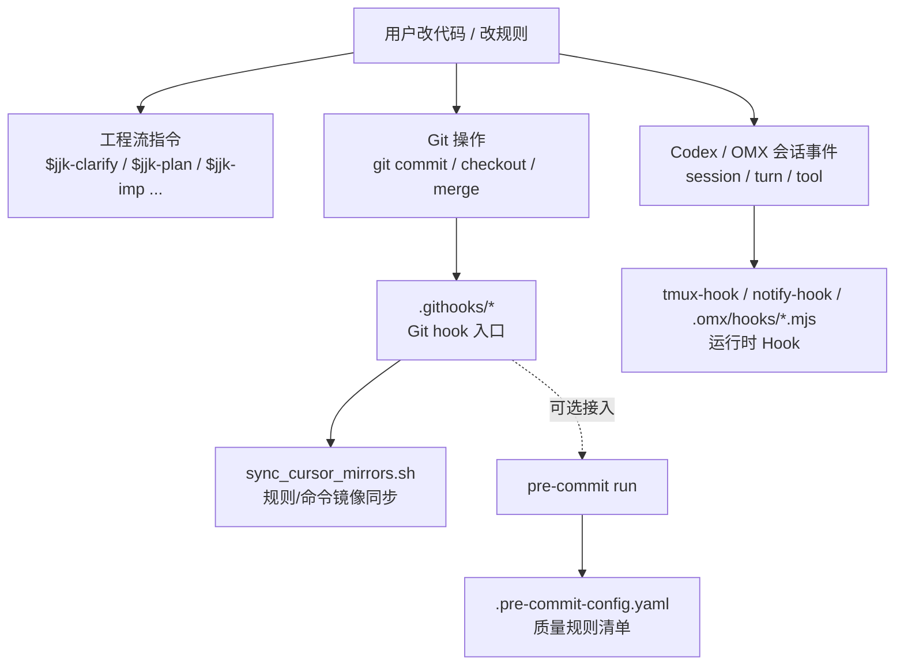
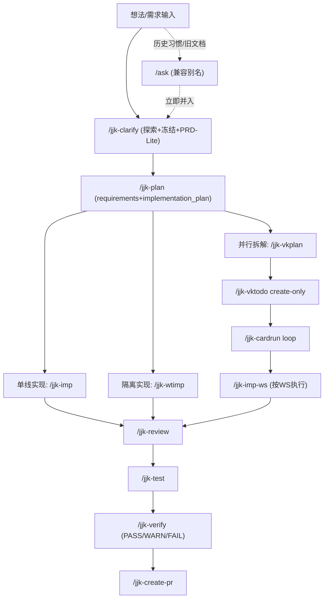

# 指令用法、实现方式与工程流全景手册

> 版本：`v1.6`
> 更新时间：`2026-03-08`
> 适用范围：本仓库 `jjk-*` 指令链 + 通用 `/plan /do` 指令（兼容历史 `/ask` 入口）。

---

## 0. 结论先行（给工程负责人）

1. 当前工程流已经形成“**发散 -> 冻结 -> 规划 -> 实施 -> 验收 -> 交付**”闭环，适合你现在“未上线、以设计合理性优先”的阶段。
2. 在你当前体系里，开发前的“PRD 职责”已由 `design.md.product_contract`（PRD-Lite）承担，且在 `/jjk-clarify` 和 `/jjk-plan` 有硬门禁，不是可选项。
3. 并行链路已具备可执行契约：`/jjk-vkplan -> /jjk-vktodo(create-only) -> /jjk-cardrun(loop) -> /jjk-wtimp(cardrun_dispatch)`，核心价值是可追溯、可回放、可阻断。
4. 所有关键命令都采用同一实现范式：`输入前置 -> FAIL_FAST -> 执行流程 -> 证据回填 -> 下一步分流`，可直接作为团队规范执行。

---

## 1. 权威源与实现边界

### 1.1 命令与文档权威源

| 项 | 权威源 | 说明 |
|---|---|---|
| 命令定义 | `.cursor/commands/*.md` | 命令语义、门禁、失败码、流程步骤的唯一权威源 |
| 运行镜像 | `.claude/commands/*.md`、`.agents/skills/jjk-*/SKILL.md` | 命令定义会同步生成跨 IDE 运行镜像；Codex 侧以 skills 形态消费，加前缀是为了不和ide自带指令冲突 |
| 项目覆盖模板 | `docs/内部参考/迭代需求/_templates/*.md` | 只放项目差异，不复制全量模板 |
| 全局模板 | `${CODEX_HOME:-$HOME/.codex}/engineering/templates/*.md` | `review/test/verify/refactor/wtimp/...` 报告模板首选 |

### 1.2 触发方式（跨 IDE）

| 环境 | 触发方式 |
|---|---|
| Claude Code / Cursor | 直接输入 `/jjk-xxx` |
| Codex | 使用 `$jjk-xxx`；`jjk-*` 指令会自动生成对应 skills，并以该形式触发 |

### 1.3 统一执行原则

1. **先门禁后执行**：任一前置缺失即 `FAIL_FAST`，禁止“先做再补”。
2. **可追溯优先**：`task_id/pr_id/card_id` 贯穿设计、计划、实现、审查、验收。
3. **证据优先**：无命令证据、无测试证据、无报告证据，不得宣称完成。
4. **边界优先**：WS 白名单、分支上下文、worktree 上下文必须一致。

### 1.4 Hook / 门禁分层（避免混淆）

**结论先行**：本仓库至少同时存在四套机制，职责完全不同，不能混用名词：

1. `jjk-*` / `/plan` / `/do` 是**工程流指令**，解决“需求怎么澄清、规划、实施、验收”。
2. `.githooks/*` 是 **Git hooks**，解决“`git commit` / `checkout` / `merge` 时自动触发什么”。
3. `.pre-commit-config.yaml` 是 **pre-commit 规则清单**，解决“提交前具体检查什么”。
4. `.omx/*`、`.omx/hooks/*.mjs`、`tmux-hook` / `notify-hook` 是 **Codex / OMX 运行时 hooks**，解决“代理会话/turn/tool 事件如何被监听、通知或注入”。



| 层 | 主要入口/文件 | 触发方式 | 解决的问题 | 当前仓库状态 |
|---|---|---|---|---|
| 工程流指令 | `.cursor/commands/*.md`、`.agents/skills/jjk-*/SKILL.md` | 手动触发 `$jjk-xxx` / `/plan` / `/do` | 设计冻结、规划、实施、验收 | 已建立主链 |
| Git hooks | `.githooks/pre-commit`、`.githooks/post-checkout`、`.githooks/post-merge`、`.githooks/post-rewrite` | Git 原生事件自动触发 | 提交/切分支/合并时执行脚本 | 已接线 |
| pre-commit 规则 | `.pre-commit-config.yaml` | 由 `pre-commit run` 或 `pre-commit install` 接入 Git hook 后触发 | 文档同步、YAML、尾随空格等质量门禁 | 已定义规则 |
| Codex / OMX hooks | `.omx/tmux-hook.json`、`.omx/hooks/*.mjs`、`notify-hook` | 会话/turn/tool 等运行时事件 | 通知、tmux 注入、插件扩展 | 基础设施存在 |

#### 1.4.1 当前仓库要点（直接回答常见混淆）

1. `.pre-commit-config.yaml` **不是** `jjk-*` 指令，也**不是** Git hook 文件本身；它只是 `pre-commit` 工具读取的**规则清单**。
2. 你记得的“改 `.cursor/rules` / `.cursor/commands` 后自动同步到 CC / Codex / skills”的链路，**属于 Git hook**：

   ```text
   .githooks/* -> sync_cursor_mirrors.sh -> scripts/sync_rules_to_cc.py
   ```

3. 当前仓库已经把 `core.hooksPath` 指到 `.githooks`，所以**规则镜像同步 hook 已经生效**。
4. 当前 `.githooks/pre-commit` 默认只负责**镜像同步**；`.pre-commit-config.yaml` 里的质量规则若要变成真实提交门禁，需要在这条链后面显式接入 `pre-commit run`。
5. `tmux-hook` / `notify-hook` / `.omx/hooks/*.mjs` 属于 **Codex / OMX 运行时 Hook**，和 Git 提交门禁不是同一层。
6. 仓库里另有 `scripts/auto_sync_rules.sh` 供 **Claude Code PostToolUse hook** 使用；它是“IDE/代理运行时镜像同步辅助脚本”，不等同于 Git 提交门禁。

#### 1.4.2 当前仓库的 Hook 实况（2026-03-08）

| 项 | 当前状态 | 说明 |
|---|---|---|
| Git 规则同步 hooks | 已接线 | `.githooks/*` 负责规则/命令镜像同步 |
| `.pre-commit-config.yaml` | 已存在 | 已定义 `doc-sync-check`、`check-yaml`、`end-of-file-fixer`、`trailing-whitespace` |
| `pre-commit` 质量门禁自动执行 | 默认未串入当前 `.githooks/pre-commit` 主路径 | 若要启用，应在保留镜像同步的前提下串接 `pre-commit run` |
| `tmux-hook` | 已启用 | 仅在允许的 mode 下执行注入 |
| `.omx/hooks/*.mjs` 自定义插件 | 当前未发现仓库内插件文件 | 说明扩展点存在，但本仓库暂未落自定义插件 |

---

## 2. 全量指令总览（17 条）

### 2.1 指令清单与职责

| 类别 | 命令 | 核心职责 | 关键输入 | 关键产出 |
|---|---|---|---|---|
| 兼容发散 | `/ask` | 历史兼容入口；收到后立即并入 `/jjk-clarify` | 用户显式输入 `/ask` / 旧文档链路 | 无独立权威产物 |
| 冻结 | `/jjk-clarify` | 设计冻结与 handoff 契约 | 需求上下文 + 设计问答 | `design.md` + `design_freeze_summary` + `clarify_handoff_contract` |
| 规划 | `/jjk-plan` | 输出 WHAT+HOW 双文档 | 已审批 `design.md` | `requirements.md` + `implementation_plan.md` |
| 实现 | `/jjk-imp` | 按计划落码并回填证据 | `implementation_plan` | 代码 + `pr_ready_manifest` |
| 隔离实现 | `/jjk-wtimp` | 独立 worktree 执行与合并 | `implementation_plan/manifest` | `wtimp_report_<topic>.md` |
| 并行拆解 | `/jjk-vkplan` | 生成可落卡并行契约 | requirements + implementation_plan | `parallel_plan.md` + `WS-*.md` + `vk_cards.json` |
| 建卡 | `/jjk-vktodo` | create-only 幂等建卡 | `task_split_dir + vk_cards.json` | 建卡结果统计（成功/跳过/失败） |
| 串行调度 | `/jjk-cardrun` | 单活卡推进 + verify/merge 收口 | `vk_cards + parallel_plan + active_task` | 卡片执行证据 + 合并证据 |
| WS 实现 | `/jjk-imp-ws` | 单 WS 白名单实现与回填 | `WS-*.md + parallel_plan + vk_cards` | `pr_ready_manifest_ws` + WS 自检回填 |
| 审查 | `/jjk-review` | 四维审查与风险分级 | PR/diff/manifest | `review_report_<topic>.md` |
| 测试 | `/jjk-test` | 可追溯测试矩阵执行 | review/manifest/plan | 测试报告 + 测试资产回填 |
| 验收 | `/jjk-verify` | 审查+测试+UAT 一体化结论 | review/pr/manifest 证据 | 验收报告（PASS/WARN/FAIL） |
| 交付 | `/jjk-create-pr` | 证据化创建/更新 PR | `pr_ready_manifest(_ws)` | PR 链接 + 交接摘要 |
| 修复 | `/jjk-debug` | 先根因后修复 | 日志/报错/上下文 | `debug_report_<topic>.md` |
| 重构 | `/jjk-refactor` | 行为等价结构重构 | review/plan 输入 | `refactor_report_<topic>.md` |
| 通用规划 | `/plan` | 轻量实施规划 | 设计文档 | `docs/plans/*-plan.md` |
| 通用执行 | `/do` | 按计划执行编码与测试 | 计划文档 | 修改结果 + 测试结果 + 完成报告 |

### 2.2 推荐主链

```text
/jjk-clarify -> /jjk-plan -> (/jjk-imp | /jjk-wtimp | /jjk-vkplan)
# 兼容旧习惯时，`/ask` 会在当前会话内立即并入 `/jjk-clarify`
 -> /jjk-review -> /jjk-test -> /jjk-verify -> /jjk-create-pr
```

---

## 3. 工程流总图（图 + 路径）

### 3.1 全局流程图



### 3.2 并行链路中的硬收口点

| 收口点 | 必须动作 | 阻断条件 |
|---|---|---|
| `vkplan -> cardrun` | `check_workflow_contract.py --mode plan_vk_coverage` 通过 | 合同缺口、task_id 缺失、execution_contract 不一致 |
| `cardrun -> merge` | 每卡 `verify -> merge -> done` | 未 `verified`、无新提交、merge 失败 |
| `WS-G1/G2` | `backfill_gate_status.py` 自动回填 | Gate 手工改写、基线不一致、命令失败 |

---

## 4. 指令“实现方式”统一模型（How）

### 4.1 每条命令的统一结构

绝大多数 `jjk-*` 命令采用相同骨架：

1. `输入前置（强制）`
2. `硬约束（FAIL_FAST 错误码）`
3. `执行流程（强制顺序）`
4. `输出模板（结论+证据）`
5. `禁止项（防漂移、防越权）`

### 4.2 失败即阻断（FAIL_FAST）

| 典型失败码 | 含义 |
|---|---|
| `CLARIFY_PRODUCT_CONTRACT_INCOMPLETE` | 冻结设计缺 PRD-Lite 关键字段 |
| `DESIGN_APPROVAL_REQUIRED` | 未审批设计直接进入规划 |
| `PLAN_CLARIFY_ALIGNMENT_FAILED` | Clarify/Plan 桥接校验失败 |
| `VKPLAN_CONSUMPTION_GAP` | 计划到卡片消费覆盖不完整 |
| `CARDRUN_DONE_GATE_FAILED` | 卡片完成门禁失败 |
| `IMP_WS_SCOPE_BROKEN` | WS 越界改动 |
| `REVIEW_BLOCKER_FOUND` | 审查阻断项未关闭 |
| `VERIFY_EVIDENCE_MISSING` | 验收证据不足 |
| `CREATE_PR_INPUT_INCOMPLETE` | PR 交付输入不完整 |

### 4.3 自动 Team 升级机制

多条命令内置“规模触发 Team”：

1. 文件数/模块数达到阈值；
2. 风险维度跨后端+前端+AI/DB；
3. 命令规模大（如大范围审查/测试/验收）。

不可用时要求输出降级标记（如 `TEAM_UNAVAILABLE_FALLBACK`），而不是静默退化。

### 4.4 证据化交付机制

| 阶段 | 证据要求 |
|---|---|
| 实现 | `acceptance_cmds` 执行结果 + changed_files + rollback_point |
| WS | `commit_sha` 必填（门禁/编排类可空提交但必须有理由） |
| 审查 | 发现分级 + 证据引用 + 结论类型 |
| 测试 | 命令、退出码、结果统计、缺陷清单 |
| 验收 | PASS/WARN/FAIL + UAT 结论 + 风险建议 |
| 交付 | PR 链接 + 任务映射 + 回滚说明 |

### 4.5 追溯主键体系（建议固定）

1. `task_id`：最小执行单元
2. `feature_id`：需求/能力聚合单元
3. `card_id`：并行卡片单元
4. `pr_id`：交付单元
5. `task_split_dir`：并行任务目录主键

### 4.6 文件编辑工具契约

1. 文件编辑以当前会话**实际暴露**的工具面为准。
2. 若没有独立 `apply_patch` 入口，禁止通过 `exec_command` 包装 `apply_patch`，并显式记录 `APPLY_PATCH_TOOL_UNAVAILABLE_FALLBACK`。
3. 该场景统一改用当前可用的直接写回方式；若环境随后真实暴露独立 `apply_patch` 工具，再切回真实工具。
4. 本约定只解决“工具面与指令文案冲突”，不得扩展为新的兼容层、隐藏副作用或静默补丁。

---

## 5. 逐条用法（详细版）

## 5.1 发散与冻结

### `/ask`

1. **何时用**：仅当用户显式输入 `/ask`，或沿用历史文档/习惯。
2. **核心动作**：在当前会话内立即并入 `/jjk-clarify`；如需求模糊，可先做探索轮，再冻结单一方案。
3. **强门禁**：禁止把 `/ask` 当作独立下游输入；若未收敛到 clarify 冻结门禁，输出 `ASK_DEPRECATED_REDIRECT_REQUIRED`。
4. **下游**：统一按 `/jjk-clarify -> /jjk-plan` 进入，禁止维持独立 `/ask` 主链。

### `/jjk-clarify`

1. **何时用**：把“讨论态需求”变成“可规划设计”。
2. **必备冻结块（7块）**：`scope_contract`、`product_contract`、`architecture_contract`、`requirement_seeds`、`implementation_seeds`、`execution_chain_seed`、`risk_rollback_contract`。
3. **工程附加门禁（6项）**：PRD-Lite 完整性、语义唯一化、契约源唯一化、handoff 对齐、并行依赖、回放 canonical 字段。
4. **核心输出**：`design_freeze_summary` + `clarify_handoff_contract`。
5. **审批规则**：门禁未过即使用户“确认”，仍是 `CONDITIONAL_APPROVAL_BLOCKED`，不得进入 `/jjk-plan`。

## 5.2 规划与单线实施

### `/jjk-plan`

1. **何时用**：已有审批通过的 `design.md`，需要形成可执行计划。
2. **模式**：`core`（默认）/ `parallel` / `hydrate`。
3. **必备输出**：`<topic>_requirements.md` + `<topic>_implementation_plan.md`。
4. **强校验**：必须运行 `scripts/check_workflow_contract.py --mode clarify_plan`，否则不得下游。
5. **分流**：`next_step=/jjk-imp` 或 `next_step=/jjk-vkplan`。

### `/jjk-imp`

1. **何时用**：已有可执行 `implementation_plan`，执行单任务实现。
2. **执行核心**：严格遵循 `execution_contract` 的 `delivery_mode/execution_unit/commit_policy/stop_boundary`。
3. **停点输出**：必须给 `IMP_STOP_REASON` + `IMP_STOP_CONTEXT`。
4. **产出要求**：`pr_ready_manifest`（`task_id/pr_id/card_id/changed_files/acceptance_cmds/rollback_point`）。
5. **文档同步**：命中 API/DB/配置/测试行为变更时必须回填对应文档。
6. **产品运行时 Skill 专项**：命中 `app/ai/skills/**`、`app/data/skills/**`、`skill_service.py`、`skill_admin_api.py`、`user_skill_api.py`、`agent_skill.py`、`import_skills.py` 等变更时，必须按 `.cursor/rules/doc_sync.mdc` 的“产品运行时 Skill 专项映射（强制）”同步产品/API/内部机制/配置/部署/测试文档，禁止只更测试报告或接口文档。

### `/jjk-wtimp`

1. **何时用**：任务较大或需要与主线隔离开发。
2. **流程**：`create worktree -> scope_guard -> implement -> verify -> merge`。
3. **硬阻断**：上下文不一致、`scope_guard` 失败、`wt-flow.sh` 失败、证据缺失均阻断。
4. **产出**：`wtimp_report_<topic>.md`，包含 `commit sha`、merge 结果、遗留风险。

## 5.3 并行拆解与卡片执行

### `/jjk-vkplan`

1. **何时用**：计划需要并行拆分、落卡执行。
2. **核心产物**：`parallel_plan.md` + `workstreams/WS-*.md` + `vk_cards.json`。
3. **强校验**：必须跑 `check_workflow_contract.py --mode plan_vk_coverage`，并确保 `clarify_plan_alignment.ok=true`。
4. **真理源写入**：`set_active_task.py` 写入并回读 `task_key/task_split_dir/project_id` 一致。

### `/jjk-vktodo`（create-only）

1. **何时用**：把 `vk_cards.json` 落到 Vibe Kanban。
2. **仅支持动作**：`create`，任何 `action!=create` 直接阻断。
3. **关键特性**：`task_key + card_id` 幂等去重，防重复建卡。
4. **重要边界**：不负责 move/review/done，不切换 active task。

### `/jjk-cardrun`

1. **何时用**：已完成落卡，进入串行推进与收口。
2. **关键前提**：`execution_mode=serial` 且 `card_order` 非空。
3. **核心规则**：单活卡推进，必须 `verify -> merge -> done`。
4. **关键阻断**：无提交证据、merge 前未 verified、`ahead=0` 的空合并均阻断。

### `/jjk-imp-ws`

1. **何时用**：执行某个具体 `WS-*.md`。
2. **核心约束**：只改 WS 白名单，跨 WS 必须阻断（`IMP_WS_SCOPE_BROKEN`）。
3. **门禁顺序**：并行层结束后再 `WS-G1`，最后 `WS-G2`。
4. **证据要求**：必须回填 `pr_ready_manifest_ws`，并提供 `commit_sha`。

## 5.4 审查、测试、验收、交付

### `/jjk-review`

1. **四维审查**：功能正确性、代码质量、安全稳定、测试文档一致性。
2. **结论级别**：`PASS` / `CONDITIONAL_PASS` / `BLOCKED`。
3. **产出**：`review_report_<topic>.md`，附分级问题与证据。

### `/jjk-test`

1. **执行策略**：先建测试矩阵（AAA），再做 UI/API、数据层、系统层三层验证。
2. **关键规则**：只跑相关必要测试，不默认全量；失败必须记录退出码和责任归属。
3. **并行 Gate 场景**：需执行 `backfill_gate_status.py` 自动回填。

### `/jjk-verify`

1. **目标**：给出最终验收判定 `PASS/WARN/FAIL`。
2. **硬规则**：无论结果如何必须输出“验证报告”。
3. **证据不足时**：才允许进入 1~3 条交互式 UAT 问题。
4. **Web/E2E 场景**：必须使用 `vk_ports.sh` 端口上下文，禁止硬编码 `3000/8000`。

### `/jjk-create-pr`

1. **输入源**：`pr_ready_manifest` 或 `pr_ready_manifest_ws`。
2. **硬门禁**：字段缺失、映射不一致、验收证据缺失、分支不一致均阻断。
3. **平台策略**：GitHub MCP 优先；不可用时输出 fallback 并停止，不默认 `gh` CLI。
4. **产出**：PR 链接 + 任务映射 + 验收证据 + 回滚方案。

## 5.5 修复与治理

### `/jjk-debug`

1. **默认模式**：诊断+修复；`--diagnose-only`：只诊断不改码（产出 `fix_plan_<topic>.md`）。
2. **刚性原则**：先根因调查，再最小修复，再验证收口。
3. **目标产出**：`debug_report_<topic>.md`，含“排除假设链”与修复证据链。

### `/jjk-refactor`

1. **目标**：行为等价前提下改善结构。
2. **步骤**：锁定等价约束 -> 切片设计 -> 守护测试 -> 质量对照 -> 报告交接。
3. **阻断**：无行为基线、证据缺失、行为漂移直接失败。

## 5.6 通用补充命令

### `/plan`

1. 轻量实施规划命令，产出 `docs/plans/YYYY-MM-DD-<topic>-plan.md`。
2. 适合非 `jjk-*` 领域化流程的中小任务。

### `/do`

1. 按已有计划执行编码、测试、审查。
2. 偏通用执行入口，不替代 `jjk-*` 的严谨门禁链。

---

## 6. 关键脚本与执行落点（实现层）

| 脚本 | 主要命令 | 作用 |
|---|---|---|
| `scripts/check_workflow_contract.py --mode clarify_plan` | `/jjk-plan` | 校验 Clarify -> Plan 桥接完整性 |
| `scripts/check_workflow_contract.py --mode plan_vk_coverage` | `/jjk-vkplan`、`/jjk-cardrun` | 校验计划到卡片消费覆盖 |
| `scripts/set_active_task.py` | `/jjk-vkplan` | 写入并回读任务级真理源 |
| `scripts/coder4/wt-flow.sh` | `/jjk-cardrun`、`/jjk-wtimp` | worktree 生命周期管理（next/verify/merge） |
| `scripts/backfill_gate_status.py` | `/jjk-imp-ws`、`/jjk-test` | Gate 卡自动回填，禁止手工改状态 |
| `scripts/vk_ports.sh` | `/jjk-verify`、`/jjk-test` | 分支/工作树端口与 URL 上下文计算 |
| `scripts/docs_guard.py` | `/jjk-plan` | 文档索引与完整性校验 |
| `scripts/coder4/coder4_scope_guard.py` | `/jjk-wtimp` | 执行范围守卫，防越界修改 |

---

## 7. 场景化 SOP（可直接执行）

## 7.1 新功能（单任务，最快稳态）

```text
/jjk-clarify -> /jjk-plan -> /jjk-imp -> /jjk-review -> /jjk-test -> /jjk-verify -> /jjk-create-pr
```

**完成定义**：

1. `design_approved=true`；
2. `implementation_ready=true`；
3. 审查无阻断项；
4. 验收 `PASS/WARN`（无关键阻断）；
5. PR 交付证据完整。

## 7.2 新功能（并行任务）

```text
/jjk-clarify -> /jjk-plan parallel -> /jjk-vkplan -> /jjk-vktodo create -> /jjk-cardrun loop
 -> /jjk-review -> /jjk-test -> /jjk-verify -> /jjk-create-pr
```

**关键不变量**：

1. 单活卡串行推进（不跨卡并行）。
2. 每卡必须 `verify -> merge -> done`。
3. Gate 卡必须自动回填，不允许手工改结果。

## 7.3 缺陷修复

```text
/jjk-debug -> /jjk-review -> /jjk-test -> /jjk-verify -> /jjk-create-pr
```

**关键点**：

1. 若先诊断：`/jjk-debug --diagnose-only` 产出 `fix_plan`。
2. 未定位根因不得改码。
3. 无回归证据不得宣称“修复完成”。

## 7.4 结构治理重构

```text
/jjk-review -> /jjk-refactor -> /jjk-review -> /jjk-verify -> /jjk-create-pr
```

**关键点**：

1. 先定义“行为不变清单”；
2. 小步切片 + 每步验收；
3. 有 `refactor_report` 才算收口。

---

## 8. Go / No-Go 门禁清单

| 阶段 | GO 条件 | NO-GO 条件 |
|---|---|---|
| Clarify | `design_actionable=true` 且 `product_contract_ready=true` | 缺冻结块、语义未冻结、handoff 未对齐 |
| Plan | `design_approved=true` + bridge 校验通过 | 无审批、无 `product_contract`、对齐校验失败 |
| Imp | `implementation_ready=true` + 输入可执行 | 输入过粗、缺 `execution_contract` |
| VKPlan | 覆盖校验通过 + 真理源一致 | task/pr 映射缺失、contract mismatch |
| CardRun | serial 单活 + 每卡验证通过 | 非 serial、无提交证据、merge 失败 |
| Review | 审查证据齐全 | 无映射、无证据、阻断项未处理 |
| Test | 测试矩阵完成 + 报告已产出 | 范围不清、门禁失败、无报告 |
| Verify | PASS/WARN/FAIL 明确 + 报告完整 | 证据不足、关键阻断未解 |
| Create-PR | manifest 完整 + 证据可复核 | 映射不一致、证据缺失、分支不一致 |

---

## 9. 高频用法速查（复制即用）

### 9.1 发散到冻结

```text
/jjk-clarify
# 历史 /ask 为兼容别名，触发后会立即并入 /jjk-clarify
```

### 9.2 冻结到规划

```text
/jjk-plan
/jjk-plan parallel
```

### 9.3 并行执行链

```text
/jjk-vkplan
/jjk-vktodo 2026-03-01_主题 create
/jjk-cardrun 2026-03-01_主题 loop
```

### 9.4 单线执行链

```text
/jjk-imp
/jjk-review
/jjk-test
/jjk-verify
/jjk-create-pr
```

### 9.5 修复与重构

```text
/jjk-debug
/jjk-debug --diagnose-only
/jjk-refactor
```

---

## 10. 你当前阶段（未上线）的执行建议

1. 把 `/jjk-clarify` 当作“开发前唯一设计门禁”，不通过不进 `/jjk-plan`。
2. 新功能默认走完整链路，不建议“跳命令短路”。
3. 并行任务才开启 `vkplan/cardrun`，单任务避免过度流程化。
4. 优先清晰契约和可追溯性，不优先兼容历史杂质（你当前阶段是合理策略）。

---

## 11. 维护约定

1. 当 `.cursor/commands/*.md` 发生新增/删除/语义变更时，本手册必须同步更新。
2. 发生冲突时，以 `.cursor/commands/*.md` 为准，本手册作为“执行解释层”。
3. 建议月度执行一次文档校准，避免“命令能力升级但百科未更新”。

---

## 附录 A. `ask + plan + do` 轻量链路（非主线）

> 这是一条**轻量工作链路**，用于快速澄清、轻量规划与直接执行；它**不属于本文 `jjk-*` 主工程流**，也不承担 `vkplan / vktodo / cardrun` 这类强契约编排职责。

| 环节 | 作用 | 适用场景 |
|---|---|---|
| `/ask` | 快速澄清问题与目标 | 需求还模糊，先把问题问清 |
| `/plan` | 生成轻量实施计划 | 任务不大，但希望先列步骤 |
| `/do` | 按计划直接执行 | 单任务、短链路、低并行场景 |

```text
/ask -> /plan -> /do
```

1. 适合单任务、轻交付、无需卡片拆解和复杂追溯的工作。
2. 一旦进入设计冻结、并行拆卡、证据化交付，建议切回 `jjk-*` 主链。
3. 在本仓库里，可以把它理解为“通用轻量模式”，不是正式交付主协议。
