# AI 模块详解

> **用途**: 深入理解 AI 模块的实现细节，帮助 AI 准确修改相关代码。

---

## 📂 目录结构

```
app/ai/
├── workflow/
│   ├── multi_agent_graph.py   # 多智能体 Supervisor 图
│   └── todo_graph.py          # 待办专用 StateGraph (2026-01 重构)
├── agents/
│   ├── data_agent.py          # 数据分析专家
│   ├── knowledge_agent.py     # 知识库专家
│   ├── todo_agent.py          # 待办事项专家 (Prompt 定义)
│   ├── todo_enhanced_nodes.py # 增强节点（澄清/冲突检测/任务拆解）
│   └── summarize_node.py      # 摘要节点
├── tools/
│   ├── todo_tools.py          # 待办工具集
│   ├── batch_todo_tools.py    # 批量待办工具
│   ├── chatTools.py           # MCP 数据库工具
│   ├── file_tools.py          # 文件读取工具
│   ├── vision_tool.py         # 图片分析工具
│   ├── ragflow_tool.py        # 知识库检索工具
│   └── embedding_util.py      # [New] 嵌入向量生成工具
├── data/
│   └── skills/                # [New] 技能知识库
│       ├── todo-intent/       # 待办意图识别
│       └── ...
├── prompts/                   # 渐进披露 Prompt 管理
│   ├── agent_prompts.py       # 核心 Prompt
│   ├── prompt_loader.py       # 参考文档加载器
│   └── references/            # 详细参考文档
│       ├── sql_guide.md
│       ├── chart_guide.md
│       └── knowledge_guide.md
├── utils/                      # 工具函数
│   ├── __init__.py
│   ├── state_helpers.py        # 状态辅助函数 (user_id/todo_id 统一获取)
│   ├── image_fixer.py          # 图片链接修复逻辑
│   ├── embedding_util.py       # 嵌入向量生成工具
│   ├── sql_parser.py           # [New] SQL 解析工具（sqlglot）
│   └── sql_safety.py           # [New] SQL 安全检查工具
├── mcp/                       # Model Context Protocol
├── events.py                  # SSE 事件协议
├── guardrails.py              # 护栏系统（输入/输出验证）
├── intent_classifier.py       # 意图识别器
├── parameter_extractor.py     # 参数提取器（借鉴 Flock）
├── llm_judge.py               # LLM as Judge 输出评估
├── llm_util.py                # LLM 实例管理
├── message_utils.py           # 消息处理工具
└── middleware.py              # AI 中间件
├── models/
│   └── agent_skill.py         # [New] 技能数据库模型
├── services/
│   └── skill_service.py       # [New] 技能检索服务
└── scripts/
    └── import_skills.py       # [New] 技能导入脚本
```

---

## 🔄 MultiAgentGraph 架构

### Skills RAG 与系统上下文增强 (2026-01)

在进入 Supervisor 之前，预处理节点会：
1. **注入系统上下文**：为所有 Agent 提供当前时间等系统信息
2. **检索相关技能**：根据用户消息动态检索业务技能

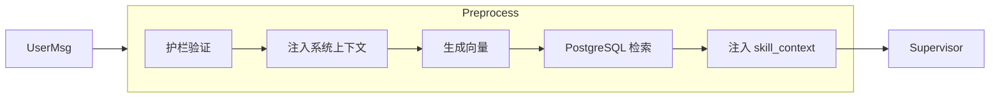

### 状态定义

**文件**: `app/ai/workflow/multi_agent_graph.py`

```python
class MultiAgentState(TypedDict):
    """多智能体状态定义。"""
    messages: Annotated[list, add_messages]  # 对话消息列表
    user_id: Optional[int]                    # 用户 ID
    thread_id: Optional[str]                  # 对话线程 ID
    enable_thinking: Optional[bool]           # 是否启用深度思考
    model_id: Optional[str]                   # 模型标识
    attachment_analysis: Optional[str]        # 附件分析结果
    evaluation: Optional[str]                 # 评估结果
    iteration_count: Optional[int]            # 迭代计数
    thinking_content: Optional[str]           # 思考内容
    # 🆕 意图识别字段（借鉴 Flock Intent Recognition）
    detected_intent: Optional[str]            # 识别到的意图类型
    intent_route: Optional[str]               # 意图路由目标
    pending_handoff: Optional[Dict]           # 待处理的委派指令
    # 🆕 Skills RAG 与系统上下文
    skill_context: Optional[str]              # 检索到的相关技能上下文
    system_context: Optional[str]             # 系统级上下文（当前时间、用户信息等）
```

### 核心节点（简化架构）

| 节点 | 函数 | 职责 |
|------|------|------|
| `preprocess` | `_preprocess_multimodal` | 验证消息、分析附件、护栏验证 |
| `intent_classify` | `_classify_intent` | 🆕 意图识别，决定路由目标 |
| `supervisor` | Supervisor Agent | 理解意图、路由决策、直接处理简单任务 |
| `data_expert` | Data Agent | 复杂多步骤数据分析 |
| `todo_expert` | Todo Agent | 待办事项管理（需要确认流程） |
| `evaluate` | `_evaluate_expert_work` | 评估任务完成度 |
| `postprocess` | `_postprocess` | 保存对话、清理缓存 |

### 路由机制 (2026-01 类型安全重构)

Supervisor 通过 **Handoff Tools** 进行路由，使用类型安全的 `HandoffResult` 协议：

**文件**: `app/ai/protocol.py`

```python
from pydantic import BaseModel, Field

class HandoffResult(BaseModel):
    """标准 Handoff 结果模型（Pydantic 验证）"""
    action: str = Field(default="handoff")
    target_agent: str = Field(..., description="目标专家 Agent 名称")
    task_description: str = Field(..., description="任务描述与上下文")
```

**文件**: `app/ai/workflow/multi_agent_graph.py`

```python
from app.ai.protocol import HandoffResult

def _create_task_handoff_tool(agent_name: str, description: str):
    """创建带任务描述的 Handoff 工具。"""
    
    @tool(name=f"assign_to_{agent_name}", description=description)
    def handoff_tool(
        task_description: Annotated[str, "详细描述下一个专家需要完成的任务"],
    ) -> str:
        """将任务委派给指定的专家 Agent。返回 JSON 格式的委派指令。"""
        result = HandoffResult(
            target_agent=agent_name,
            task_description=task_description
        )
        return result.model_dump_json(ensure_ascii=False)
    
    return handoff_tool
```

**Wrapper 层检测**（`streaming_wrapper` 中的 `on_tool_end` 处理）:

```python
from app.ai.protocol import AgentOutputParser

# 类型安全解析
handoff_result = AgentOutputParser.parse_handoff_typed(tool_output)
if handoff_result:
    # handoff_result 是 HandoffResult 类型，IDE 可直接提示字段
    return {"pending_handoff": handoff_result.model_dump()}
```

> [!NOTE]
> 2026-01 重构：从字符串协议 `<!--HANDOFF:{...}-->` 迁移到类型安全的 `HandoffResult` Pydantic 模型。

---

## 📋 Todo Graph 架构 (2026-01 重构)

**文件**: `app/ai/workflow/todo_graph.py`

### 节点流程

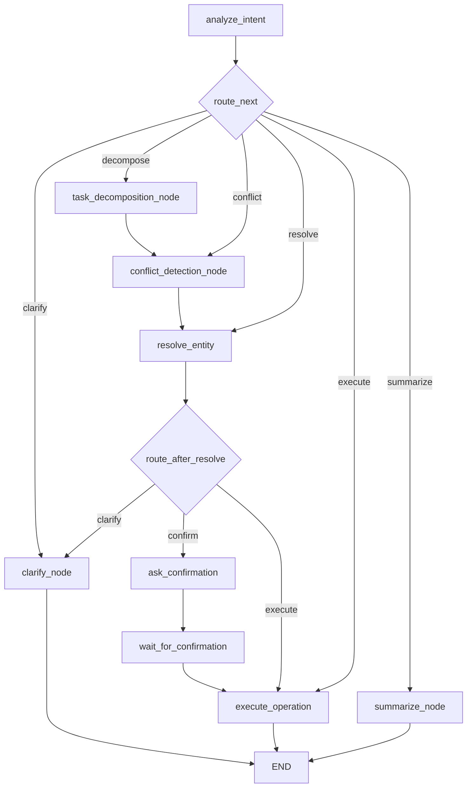

### 核心改动 (2026-01)

| 原设计 | 新设计 | 改进点 |
|--------|--------|--------|
| `request_confirmation` 单节点 | `ask_confirmation` + `wait_for_confirmation` | 分离消息发送与中断等待 |
| 正则解析 LLM 输出 | Pydantic `IntentResult` 模型 | 结构化验证 |
| 分散的 `user_id` 获取 | 统一 `state_helpers.py` | 集中管理 |
| 执行阶段模糊匹配 ID | **新增 `resolve_entity` 节点** | 在确认前解析 ID，避免歧义 |
| 文本确认消息 | **结构化 ConfirmationCard** | 前端渲染 Diff 视图 |

### resolve_entity 节点

**文件**: `app/ai/agents/resolve_node.py`

专门在确认前解析模糊的待办标识为具体 `todo_id`：

| 匹配结果 | 处理 |
|---------|------|
| 0 个匹配 | 路由到 `clarify`，提示找不到 |
| 1 个匹配 | 写入 `todo_id` 到 `pending_operation`，路由到 `confirm` |
| 多个匹配 | 路由到 `clarify`，列出选项供选择 |

### 状态辅助函数

**文件**: `app/ai/utils/state_helpers.py`

```python
from app.ai.utils.state_helpers import get_user_id, get_user_id_optional, get_current_todo_id

# 获取 user_id（抛异常版）
user_id = get_user_id(state, config)

# 获取 user_id（返回 None 版）
user_id = get_user_id_optional(state, config)

# 获取当前讨论的 todo_id
todo_id = get_current_todo_id(state, config)
```

### 渐进式提示词策略 (Progressive Prompting)

**文件**: `app/ai/prompts/todo_prompts.py`

为避免用户在多轮对话中陷入细节纠结，Todo Agent 实现了基于对话轮次的渐进式策略注入：

#### 策略定义

| 策略 | 触发条件 | 行为 |
|-----|---------|------|
| `PROGRESSIVE_STRATEGY_DECISIVE` | 轮次 > 2 且未确认 | 停止追问，直接给出默认方案 |
| `PROGRESSIVE_STRATEGY_RESET` | 轮次 > 5 | 礼貌询问是否重新开始 |
| `QUICK_MODE_KEYWORDS` | 用户说 "别问了"、"直接创建" 等 | 跳过确认，直接执行 |

#### 果断策略示例

```python
PROGRESSIVE_STRATEGY_DECISIVE = """
## 策略调整 (Progressive Override)
对话已进行多轮，用户似乎陷入了细节纠结。

**禁止**：继续反问用户细节。
**必须**：直接给出一个合理的默认方案。

**默认值规则**：
- 时间未知 → 默认"明天下午3点"
- 优先级未知 → 默认"🟡中"
- 分类未知 → 默认"工作"
"""
```

#### 实现机制

**位置**: `todo_graph.py` → `analyze_intent` 节点

```python
# 根据轮数注入策略
round_count = len(messages) // 2  # 每轮两条消息 (human + ai)

if round_count > 5:
    progressive_injection = PROGRESSIVE_STRATEGY_RESET
elif round_count > 2 and not user_confirmed and not quick_mode:
    progressive_injection = PROGRESSIVE_STRATEGY_DECISIVE

# 拼接到系统提示词
system_prompt = f"{TODO_INTENT_ANALYZE_PROMPT}{progressive_injection}..."
```

#### 快速模式关键词

```python
QUICK_MODE_KEYWORDS = [
    "别问了", "快点", "直接创建", "不要问那么多", 
    "先创建", "快速创建", "随便", "默认就行"
]
```

检测到这些关键词后，设置 `quick_mode=True`，跳过确认环节直接执行操作。

---

## 🛠️ Tools 详解

### Todo Tools

**文件**: `app/ai/tools/todo_tools.py`

| 工具 | 用途 | 关键参数 |
|------|------|----------|
| `add_todo` | 创建待办 | title, due_date, priority, category |
| `list_todos` | 查询待办 | status, category, keyword |
| `update_todo` | 更新待办 | todo_id, 各属性字段 |
| `update_progress` | 更新进度 | todo_id, progress (0-100) |
| `complete_todo` | 标记完成 | todo_id |
| `delete_todo` | 删除待办 | todo_id |

### 工具返回格式

所有工具返回字符串，格式如下：

```python
# 成功
"✅ 成功创建待办事项：「周一开会」\n  ID: 123\n  截止: 2024-01-15 09:00"

# 失败
"❌ 操作失败：未找到 ID 为 999 的待办事项"

# 列表
"📋 找到 3 条待办事项：\n\n1. [ID:101] 周一开会 ⏰ 01-15 09:00\n2. ..."
```

### 工具调用架构 (ADR-001)

**决策**: 不采用 LangGraph `ToolNode`，使用自定义 `execute_operation` 节点

**背景**: LangGraph 提供了预构建的 `ToolNode` 用于标准 ReAct Agent 模式，但我们的 Todo Agent 采用"意图驱动"架构。

**对比分析**:

| 维度 | ToolNode 模式 | 当前实现 |
|------|---------------|----------|
| 工具调用触发 | LLM 生成 `tool_calls` | `analyze_intent` 构造 `pending_operation` |
| 用户确认 | 无内置支持 | `ask_confirmation` + `wait_for_confirmation` |
| 结果格式 | 标准 `ToolMessage(content)` | 自定义 `ToolResult(data_type, data, message)` |
| SSE 事件 | 需在工具内部调用 | `execute_operation` 统一管理 |

**选择理由**:

1. **执行前干预** - 需要在工具执行前插入确认、冲突检测、参数补全等业务逻辑
2. **结果格式灵活** - 支持结构化数据用于前端卡片渲染
3. **关注点分离** - 工具只负责业务逻辑，SSE 事件由图节点统一处理

**实现位置**: `app/ai/workflow/todo_graph.py` → `execute_operation` 节点

```python
def execute_operation(state: TodoAgentState) -> Dict:
    """执行操作节点 - 手动调用工具函数。"""
    if action == "create":
        result = _execute_create(data, state)  # 调用 add_todo.func()
    # 统一发送 SSE 事件
    emit_result(writer, data_type=result["data_type"], data=result["data"], ...)
    return updates
```

---

## 📡 事件系统

### 事件发送方式

**文件**: `app/ai/events.py`

```python
from langgraph.config import get_stream_writer
from app.ai.events import emit_status, emit_result

def my_node(state):
    writer = get_stream_writer()
    
    # 发送状态更新
    emit_status(writer, "正在处理...")
    
    # 发送结构化结果
    emit_result(writer, "todo_list", {"todos": [...]}, "找到 3 条待办")
    
    return state
```

### 事件函数一览

| 函数 | 事件类型 | 用途 |
|------|----------|------|
| `emit_token` | `token` | AI 文本输出 |
| `emit_thinking` | `thinking` | 思考过程 |
| `emit_status` | `status` | 状态更新（如"正在查询..."） |
| `emit_result` | `result` | 结构化结果（卡片数据） |
| `emit_confirmation` | `confirmation` | 确认请求 |
| `emit_clarification` | `clarification` | 澄清问题 |
| `emit_error` | `error` | 错误信息 |
| `emit_done` | `done` | 流结束 |

### AgentEvent 模型 (2026-01 新增)

统一的事件模型，用于 `astream_events` 架构：

```python
from app.ai.events import AgentEvent, AgentEventType

# 创建事件
event = AgentEvent.token("你好", node="supervisor")
event = AgentEvent.tool_start("sql_inter", {"query": "..."}, node="data_expert")
event = AgentEvent.handoff("todo_expert", "处理待办任务")

# 转换为 stream 兼容格式
writer(event.to_stream_dict())  # {"type": "token", "data": {"content": "你好"}, "node": "supervisor"}
```

---

## 🔧 LLM 配置

### 获取 LLM 实例

**文件**: `app/ai/llm_util.py`

```python
from app.ai.llm_util import get_llm, get_llm_by_model_id

# 获取默认 LLM
llm = get_llm()

# 获取指定模型
llm = get_llm_by_model_id("deepseek-chat")

# 启用深度思考模式
llm = get_llm(enable_thinking=True)
```

### 支持的模型类型

| 提供商 | 模型代码 | 特性 |
|--------|----------|------|
| OpenAI | `gpt-4o` | 通用 |
| DeepSeek | `deepseek-chat` | 支持 reasoning_content |
| Qwen | `qwen-max` | 支持 thinking 模式 |

---

## 🔍 消息处理

### 消息验证

**文件**: `app/ai/message_utils.py`

```python
from app.ai.message_utils import validate_messages, remove_incomplete_tool_calls

# 验证消息完整性
messages = validate_messages(state["messages"])

# 移除不完整的 tool_calls
messages = remove_incomplete_tool_calls(messages)
```

### 常见消息问题

1. **Tool Call 没有对应的 Tool Message** → 自动补充空响应
2. **DeepSeek reasoning_content 丢失** → 修复 AIMessage 属性
3. **消息格式不一致** → 标准化为 LangChain 格式

---

## 📡 Custom 事件机制 (stream_mode="custom")

> [!TIP]
> 关于 Custom Mode 的核心设计哲学、**双写架构 (Dual Write)** 以及与 State 的关系，请参阅专题文档：[流式通信与状态同步设计](../架构设计/流式通信与状态同步设计.md)

### 核心概念

LangGraph 提供了 `stream_mode="custom"` 模式，允许图中的节点通过 `StreamWriter` 直接向前端发送自定义事件。这是实现实时推送（如图片、状态更新、工具调用）的核心机制。

### 工作原理 (2026-01 重构)

此次重构将原本分散的流式逻辑统一为标准化的事件驱动架构：

```mermaid
graph TD
    subgraph Agent Runtime
        LLM[LLM / Tool] --> |astream_events v2| Wrapper[Streaming Wrapper]
        Wrapper --> |封装| Event[AgentEvent]
        Event --> |to_stream_dict| Stream[StreamWriter]
    end
    
    subgraph Service Layer
        Stream --> |stream_mode=custom| ChatService[ChatService.stream]
        ChatService --> |收集| Collector[Message Collector (list)]
        ChatService --> |转发| SSE[SSE Response]
    end
    
    subgraph Persistence
        Collector --> |流结束/中断| DB_Save[保存到 PostgreSQL]
    end

    subgraph Frontend
        SSE --> |onToken/onTool| UI[UI 组件]
    end
```

### 完整事件类型列表

| 事件类型 | emit 函数 | AgentEvent 方法 | 用途 | 触发时机 |
|---------|----------|----------------|------|----------|
| `token` | `emit_token` | `AgentEvent.token()` | AI 文本输出 | LLM 生成 token 时 (on_chat_model_stream) |
| `thinking` | `emit_thinking` | `AgentEvent.thinking()` | 思考过程 | 深度思考模式下 |
| `tool_start` | `emit_tool_start` | `AgentEvent.tool_start()` | 工具调用开始 | 检测到 tool_calls 时 (on_tool_start) |
| `tool_end` | `emit_tool_end` | `AgentEvent.tool_end()` | 工具调用结束 | 检测到 ToolMessage 时 (on_tool_end) |
| `status` | `emit_status` | `AgentEvent.status()` | 状态更新 | 长时间操作时 |
| `result` | `emit_result` | - | 结构化结果 | 返回卡片数据时 |
| `confirmation` | `emit_confirmation` | - | 确认请求 | 需要用户确认时 |
| `clarification` | `emit_clarification` | - | 澄清问题 | 需要补充信息时 |
| `handoff` | - | `AgentEvent.handoff()` | 专家切换 | Supervisor 切换专家时 |
| `error` | `emit_error` | `AgentEvent.error()` | 错误 | 发生异常时 |
| `done` | `emit_done` | `AgentEvent.done()` | 流结束 | 处理完成时 |

### 关键组件

#### 1. 获取 StreamWriter

```python
from langgraph.config import get_stream_writer

def my_tool():
    writer = get_stream_writer()  # 获取当前流的 writer
    # 使用 writer 发送自定义事件
```

> [!IMPORTANT]  
> `get_stream_writer()` 只能在 LangGraph 流式执行上下文中调用。在普通函数或测试中调用会失败。

#### 2. 事件发送函数 (app/ai/events.py)

```python
# 文本输出
def emit_token(writer, content: str, node: str = ""):
    writer({"type": "token", "data": {"content": content}, "node": node})

# 思考过程
def emit_thinking(writer, content: str, node: str = ""):
    writer({"type": "thinking", "data": {"content": content}, "node": node})

# 状态更新
def emit_status(writer, message: str, node: str = ""):
    writer({"type": "status", "data": {"message": message}, "node": node})

# 工具调用开始
def emit_tool_start(writer, tool_name: str, tool_input: dict = None, node: str = ""):
    writer({"type": "tool_start", "data": {"name": tool_name, "input": tool_input or {}}, "node": node})

# 工具调用结束
def emit_tool_end(writer, tool_name: str, output: str = "", node: str = ""):
    writer({"type": "tool_end", "data": {"name": tool_name, "output": output}, "node": node})

# 结构化结果（图片、待办列表等）
def emit_result(writer, data_type: str, data: dict, message: str = "", node: str = ""):
    writer({
        "type": "result",
        "data": {"data_type": data_type, "data": data, "message": message},
        "node": node
    })
```

#### 3. 消息收集与持久化 (Service Layer)
 
`ChatService` 充当消息收集器 (Message Collector) 的角色。它不仅负责转发 SSE 事件，还负责聚合所有流式 token 以便持久化。
 
**关键逻辑** (`app/services/chat_service.py`):
 
```python
async for chunk in graph.astream(input_state, config, stream_mode="custom"):
    event_type = chunk.get("type")
    event_data = chunk.get("data")
    
    # 1️⃣ 消息收集 (Message Collector)
    if event_type == "token":
        content = event_data.get("content", "")
        full_answer.append(content)  # 聚合 token
    elif event_type == "thinking":
        thinking_content += event_data.get("content", "")
    elif event_type == "result" and event_data.get("message"):
        full_answer.append(event_data["message"])  # 聚合非 token 结果
    
    # 2️⃣ SSE 转发
    yield self._format_sse(event_type, event_data)

# 3️⃣ 最终持久化 (流结束)
# 当流正常结束或发生 Interrupt 时，将 full_answer 列表拼接为完整字符串保存
if full_answer:
    save_message_to_db(role="ai", content="".join(full_answer))
```
 
> [!NOTE]
> 这种设计避免了依赖 LangGraph 的 `values` 模式来获取最终状态（`values` 往往只包含整个消息历史，提取最新增量较复杂且容易出错）。
 
#### 4. 前端处理 (useSSEStream.ts)

```typescript
const callbacks: StreamCallbacks = {
  onToken: (token) => appendToAiMessage(aiId, token),
  onThinking: (content) => handleThinking(aiId, content),
  onToolStart: (name, input) => addToolCallToMessage(aiId, name, input),
  onToolEnd: (name, output) => console.debug(`工具 ${name} 执行完成`),
  onStatus: (message) => setCurrentStatus(message),  // 🆕 显示在 UI 中
  onResult: (data) => {
    if (data.data_type === 'image') {
      appendImageToAiMessage(aiId, data.data.url);
    }
    // 处理其他类型...
  },
  onDone: () => {
    setCurrentStatus(null);  // 清除状态
    setIsLoading(false);
  },
};
```

### Agent 包装器中的自动事件发送

**文件**: `app/ai/workflow/multi_agent_graph.py`

Agent 包装器 `_create_streaming_agent_wrapper` 使用 `astream_events(version="v2")` 统一捕获并发送事件：

```python
from app.ai.events import AgentEvent

async def streaming_wrapper(state, config):
    writer = get_stream_writer()
    
    async for event in agent.astream_events(state, config, version="v2"):
        event_kind = event.get("event", "")
        event_data = event.get("data", {})
        
        # 1️⃣ LLM Token 流（自动捕获）
        if event_kind == "on_chat_model_stream":
            chunk = event_data.get("chunk")
            if content := getattr(chunk, "content", ""):
                writer(AgentEvent.token(content, node=name).to_stream_dict())
            
            # 检测思考内容
            additional = getattr(chunk, "additional_kwargs", {})
            if reasoning := additional.get("reasoning_content"):
                writer(AgentEvent.thinking(reasoning, node=name).to_stream_dict())
        
        # 2️⃣ 工具调用开始
        elif event_kind == "on_tool_start":
            tool_name = event.get("name")
            tool_input = event_data.get("input", {})
            writer(AgentEvent.tool_start(tool_name, tool_input, node=name).to_stream_dict())
        
        # 3️⃣ 工具调用结束
        elif event_kind == "on_tool_end":
            tool_name = event.get("name")
            tool_output = str(event_data.get("output", ""))[:500]
            writer(AgentEvent.tool_end(tool_name, tool_output, node=name).to_stream_dict())
        
        # 4️⃣ 自定义事件（直接转发）
        elif event_kind == "on_custom_event":
            writer({"type": event.get("name"), "data": event_data, "node": name})
```

> [!NOTE]
> 2026-01 重构：从 `astream(stream_mode=["messages", "values"])` 迁移到 `astream_events(version="v2")`，代码从 ~260 行简化到 ~100 行。

### currentStatus UI 显示

**前端组件**: `web/src/components/chat/messages/ai.tsx`

当后端发送 `status` 事件时，前端会显示状态消息：

```tsx
// 获取当前处理状态
const currentStatus = thread.currentStatus;

if (isLoading) {
  return (
    <div className="flex flex-col gap-2">
      {/* 显示当前处理状态 */}
      {currentStatus && (
        <div className="flex items-center gap-2 text-xs text-gray-500 animate-pulse">
          <span className="inline-block h-1.5 w-1.5 rounded-full bg-blue-500 animate-ping"></span>
          {currentStatus}
        </div>
      )}
      {/* 工具调用和内容 */}
      {hasToolCalls && <ToolCalls toolCalls={message.tool_calls} />}
      <MarkdownText>{contentString}</MarkdownText>
    </div>
  )
}
```

### 典型使用场景

1. **图片推送** (`fig_inter`, `knowledge_search`)
   ```python
   emit_result(writer, "image", {"url": image_url})
   ```

2. **工具调用** (Agent 包装器自动发送)
   ```python
   emit_tool_start(writer, tool_name, tool_args, node=name)
   emit_tool_end(writer, tool_name, output[:200], node=name)
   ```

3. **状态更新** (长时间操作)
   ```python
   emit_status(writer, "正在分析数据...")
   ```

4. **确认请求** (`todo_tools`)
   ```python
   emit_confirmation(writer, operation_data, message)
   ```

---

## 🖼️ 图片流式传输机制

### 统一的双路径架构

**目标**: 确保所有图片来源（Agent 生成 / 知识库检索）在实时对话和历史加载中 URL 完全一致。

#### 图片来源统一处理

| 来源 | 工具 | 返回值 | 事件推送 |
|------|------|--------|---------|
| Agent 生成 | `fig_inter` | `{"image_url": proxy_url}` | `emit_result("image", {url})` |
| 知识库检索 | `knowledge_search` | 文本含 `` | `emit_result("image", {url})` |

两种来源使用**完全相同**的机制：
1. **实时显示**: `emit_result` 推送事件 → 前端 `appendImageToAiMessage`
2. **历史恢复**: 返回值包含 Markdown 图片 → 后端保存 → 前端渲染

#### 路径 1: 实时流式显示

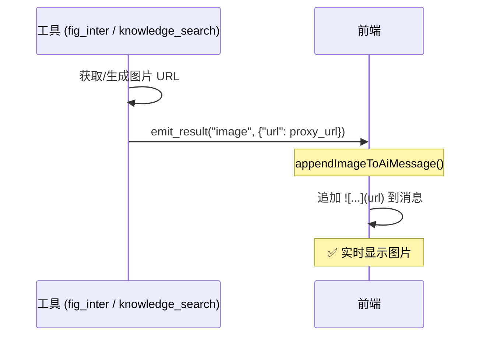

**实现**:
- 工具调用 `emit_result()` 发送 `result` 事件
- 前端 `onResult` 回调调用 `appendImageToAiMessage()` 追加图片
- URL 存储在 `additional_kwargs.displayedImages[]` 用于去重

#### 图片位置与时序

> [!IMPORTANT]
> `appendImageToAiMessage` 将图片追加到**当时内容的末尾**，但 LLM 后续输出会让图片被"包裹"在中间。

**fig_inter 时序**（图片被文字包裹）：
```
T0: LLM 输出 "好的，我来画圆形"  → content = "好的，我来画圆形"
T1: 工具执行，生成图片
T2: emit_result() 追加图片       → content = "好的..."
T3: LLM 继续输出 "完成！"        → content = "好的...完成！"
                                              ↑ 图片在中间
```

**knowledge_search 时序**（图片在最前面）：
```
T0: LLM 调用工具                → content = "" (空)
T1: 工具执行，检索知识库
T2: emit_result() 追加图片       → content = ""
T3: LLM 输出 "根据知识库..."     → content = "根据知识库..."
                                     ↑ 图片在最前面
```

**关键差异**：`emit_result` 触发时，LLM 是否已有输出。

#### 路径 2: 数据库持久化

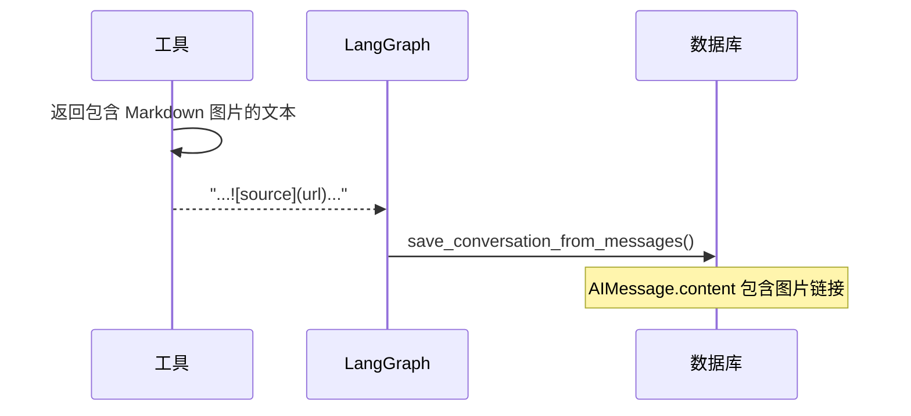

**实现**:
- `fig_inter`: 返回 `{"image_url": url}`, LLM 输出 Markdown 或 `image_fixer` 补充
- `knowledge_search`: 返回文本直接包含 ``
- `save_conversation_from_messages` 提取 Tool 消息中的图片 URL 并补充到 AI 回复

### 去重机制

**问题**: `emit_result` 和工具返回值都包含图片 URL，可能导致重复显示。

**解决**: 三重去重保护

1. **前端追加时检查** (`appendImageToAiMessage`)
   ```typescript
   if (displayedImages.includes(imageUrl)) return; // 已通过事件显示
   if (content.includes(imageUrl)) return; // LLM 已输出（竞态）
   ```

2. **前端 Token 过滤** (`appendToAiMessage`)
   ```typescript
   const imageRegex = /!\[.*?\]\(([^)]+)\)/g;
   if (displayedImages.includes(url)) {
       filteredToken = filteredToken.replace(match[0], ""); // 移除重复
   }
   ```

3. **后端数据库保存（差异化处理）** (`save_conversation_from_messages`)
   
   > [!IMPORTANT]
   > 图片保存策略因来源不同而异
   
   | 图片来源 | URL 特征 | 保存策略 |
   |---------|---------|---------|
   | `fig_inter` 图表 | 包含 `/charts/` | LLM 未引用时自动补充 |
   | `knowledge_search` 知识库 | 包含 `/proxy/ragflow/` | 只保存 LLM 引用的 |
   
   ```python
   # 只补充图表图片，不补充知识库图片
   if "/charts/" in url and url not in ai_content:
       missing_chart_images.append(url)
   ```

### 知识库图片特殊说明

**文件**: `app/ai/tools/ragflow_tool.py`

```python
def _format_retrieval_results(chunks: list) -> tuple[str, list[dict]]:
    """格式化检索结果，提取图片信息用于主动推送。"""
    images = []
    for chunk in chunks:
        if image_id := chunk.get("image_id"):
            image_url = f"/api/v1/assets/proxy/ragflow/{image_id}"
            images.append({"url": image_url, "source": source})
            # 返回文本直接包含 Markdown 图片
            result_text += f"\n   "
    return text, images

def _emit_images(images: list[dict]) -> None:
    """主动推送图片事件给前端。"""
    writer = get_stream_writer()
    for img in images:
        emit_result(writer, "image", {"url": img["url"]}, ...)
```

### 时序图（完整流程）

```mermaid
sequenceDiagram
    participant User as 用户
    participant Tool as 工具
    participant Frontend as 前端
    participant DB as 数据库
    
    User->>Tool: 请求（生成图表/搜索知识库）
    Tool->>Tool: 获取图片 URL
    
    par 实时路径
        Tool->>Frontend: emit_result("image", {url})
        Frontend->>Frontend: appendImageToAiMessage()
        Note over Frontend: 立即显示图片
    and 持久化路径
        Tool->>Tool: 返回包含 Markdown 的文本
        Tool->>DB: postprocess 保存
    end
    
    Note over User,DB: 刷新页面后
    User->>DB: 加载历史
    DB-->>Frontend: AIMessage.content (包含 )

---

## 📊 问数 Agent 语义层 (Semantic Layer)

本节说明问数 Agent 如何将业务指标定义转化为语义向量，支持自然语言检索。

### 0. 2026-01 架构改进

> [!NOTE]
> 2026-01 深度审查后的重大改进，对比 Vanna 官方和 SQL-Sentinel 项目。

#### 改进清单

| 改进项 | 修改文件 | 说明 |
|--------|----------|------|
| RAG 上下文传递 | `data_graph.py` | 检索结果显式注入 SQL 生成 prompt，避免双重检索 |
| 完整 DDL 检索 | `vanna_client.py` | 从 `t_meta_columns` 获取完整列信息，构建真实 CREATE TABLE |
| 统一 SQL 解析 | `sql_parser.py` (新) | 使用 sqlglot 替代分散的正则表达式 |
| 错误自愈机制 | `data_graph.py` | 执行失败时自动重试（最多 3 次），错误信息反馈给 LLM |
| 统一安全检查 | `sql_safety.py` (新) | 消除代码重复，集中管理危险关键词和敏感表黑名单 |
| 向量相似度搜索 | `metric_service.py` | 指标匹配优先使用 embedding 向量搜索 |

#### 多数据源架构

问数 Agent 采用**数据库隔离设计**，系统数据与业务分析数据严格分离：

```mermaid
flowchart TB
    subgraph system [系统层 - 禁止问数访问]
        ChatDB[(chat_db<br/>系统数据库)]
        Checkpoints[(checkpoints<br/>状态存储)]
    end
    
    subgraph analytics [分析层 - 问数专用]
        DataDB[(data_db)]
        FDM[fdmdata schema<br/>存贷款业务表]
        SDM[sdmdata schema<br/>维度数据表]
        PUB[public schema<br/>元数据表]
        DataDB --> FDM
        DataDB --> SDM
        DataDB --> PUB
    end
    
    subgraph agent [问数 Agent]
        Router[Schema 路由器]
        Vanna[Vanna RAG]
        Router --> FDM
        Router --> SDM
        Router --> PUB
    end
```

**数据库职责**：

| 数据库 | Schema | 用途 | 问数访问 |
|--------|--------|------|----------|
| `chat_db` | public | 系统数据（用户、聊天、待办） | ❌ 禁止 |
| `checkpoints` | - | LangGraph 状态持久化 | ❌ 禁止 |
| `data_db` | fdmdata | 存贷款等金融业务数据 | ✅ 允许 |
| `data_db` | sdmdata | 日期、机构等维度数据 | ✅ 允许 |
| `data_db` | public | 元数据表（t_meta_*） | ✅ 允许 |

**Schema 路由规则**：
1. **关键词匹配**：用户问题中包含 "存款"、"贷款" → `fdmdata`
2. **表名前缀**：`f_mid_*` → `fdmdata`，`s_ods_*` → `sdmdata`
3. **显式指定**：用户可通过 `@fdmdata` 显式指定 Schema
4. **默认回退**：无法识别时使用 `fdmdata` 作为默认 Schema

> 详细配置说明参见 [数据库设计](./数据库设计.md#多数据库架构)

#### 问数权限控制架构

基于 GitHub 开源项目（Cube.js 语义层、Vanna Tool Registry）的最佳实践，设计三层权限控制体系：

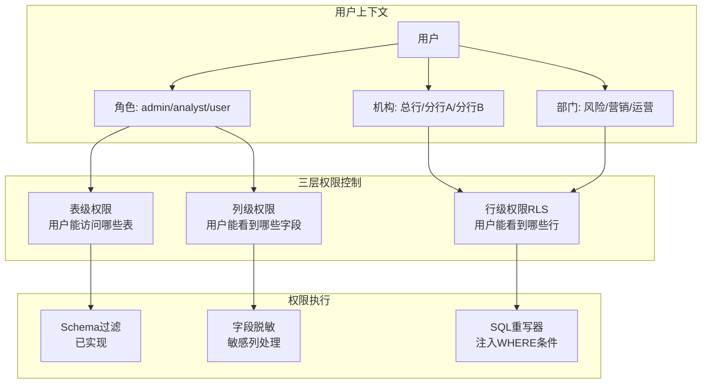

**三层权限模型**：

| 层级 | 控制维度 | 实现方式 | 配置表 |
|------|----------|----------|--------|
| 表级权限 | 用户能访问哪些表 | Schema 白名单 + 表白名单 | `t_data_permission_table` |
| 行级权限 (RLS) | 用户能看到哪些行 | SQL WHERE 条件注入 | `t_data_permission_row` |
| 列级权限 | 敏感字段脱敏 | SELECT 列替换 | `t_data_permission_column` |

**权限上下文**（新文件 `app/ai/utils/permission_context.py`）：

```python
@dataclass
class UserPermissionContext:
    user_id: int
    role: str                    # admin / analyst / user
    org_code: Optional[str]      # 机构代码
    dept_code: Optional[str]     # 部门代码
    allowed_schemas: List[str]   # 允许的 Schema
    allowed_tables: List[str]    # 允许的表（空=全部）
    row_filters: Dict[str, str]  # 行过滤规则 {table: "org_code = 'xxx'"}
    masked_columns: Dict[str, str]  # 脱敏规则 {table.column: "partial"}
```

**SQL 重写器**（新文件 `app/ai/utils/sql_rewriter.py`）：

```python
def rewrite_sql_with_permissions(
    sql: str, 
    user_context: UserPermissionContext
) -> Tuple[str, bool, Optional[str]]:
    """
    1. 检查表级权限（拒绝未授权表）
    2. 注入行级过滤条件（WHERE org_code = 'xxx'）
    3. 替换敏感列为脱敏表达式
    """
    pass
```

**集成到 Data Graph**（`execute_sql` 节点）：

```python
def execute_sql(state: DataAgentState) -> Dict:
    # 1. 获取用户权限上下文
    user_context = get_user_permission_context(state["user_id"])
    
    # 2. SQL 重写（注入权限过滤）
    sql = state["generated_sql"]
    rewritten_sql, is_allowed, error = rewrite_sql_with_permissions(sql, user_context)
    
    if not is_allowed:
        return {"last_error": error}
    
    # 3. 执行重写后的 SQL
    result = execute_query(rewritten_sql)
    return {"sql_result": result}
```

**与现有模块集成**：

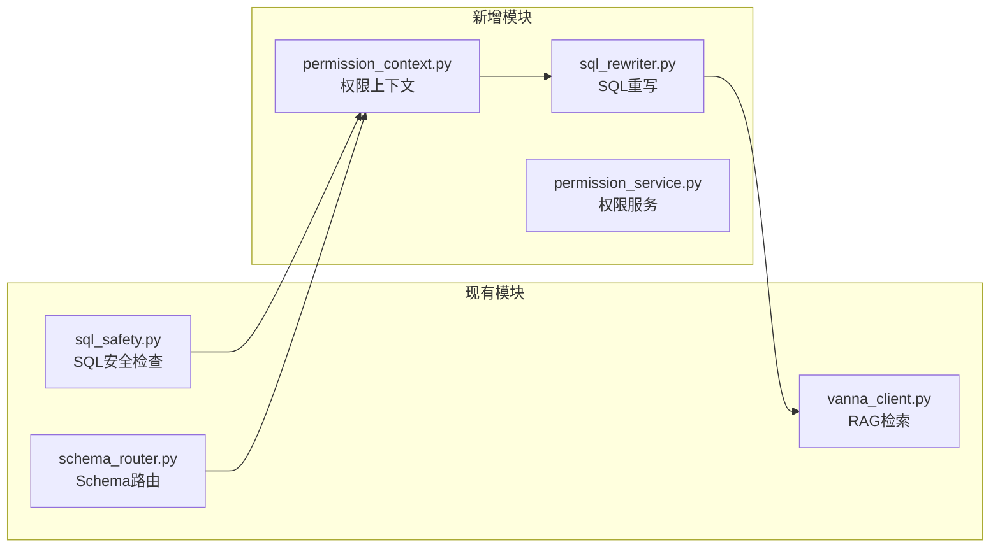

关键集成点：
- **sql_safety.py**：扩展 `SENSITIVE_TABLES` 为动态加载（基于用户角色）
- **schema_router.py**：扩展 `ANALYTICS_SCHEMAS` 为用户级别白名单
- **vanna_client.py**：`get_related_ddl()` 按用户权限过滤可见表

> 权限配置表结构详见 [数据库设计 - 问数权限控制表](./数据库设计.md#问数权限控制表)

#### 新增工具模块

```
app/ai/utils/
├── sql_parser.py      # SQL 解析工具（使用 sqlglot）
│   ├── extract_tables_from_sql()  # 提取表名
│   ├── validate_sql_syntax()      # 语法验证
│   ├── is_select_only()           # 只读检查
│   └── get_query_type()           # 语句类型
└── sql_safety.py      # SQL 安全检查工具
    ├── check_sql_safety()         # 综合安全检查
    ├── check_dangerous_keywords() # 危险操作检测
    ├── check_sensitive_tables()   # 敏感表检测
    ├── add_limit_if_missing()     # 自动添加 LIMIT
    └── sanitize_sql()             # 综合处理
```

#### 错误自愈机制

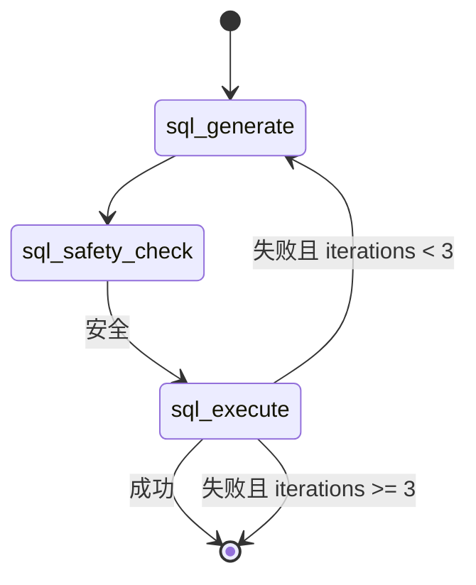

**关键状态字段**（`DataAgentState`）：
- `iterations`: 当前迭代次数
- `last_error`: 最后一次执行错误信息
- `sql_history`: SQL 生成历史 `[{"sql": str, "error": str}]`

#### 向量搜索匹配

```python
# metric_service.py
def match_metric(self, question: str):
    # 优先向量搜索（相似度阈值 0.6）
    result = self._match_metric_by_vector(question)
    if result:
        return result
    # 降级到关键词匹配
    return self._match_metric_by_keyword(question)
```

#### P2 改进：SQL 质量评估

**文件**: `app/ai/utils/sql_evaluator.py`

提供多维度的 SQL 质量评估：

```python
from app.ai.utils.sql_evaluator import evaluate_sql_quality, quick_evaluate

# 快速评估（不调用 LLM）
result = quick_evaluate(sql)
# {"is_valid": True, "warnings": ["缺少 LIMIT"], "complexity": "medium"}

# 完整评估（包含语义检查）
result = await evaluate_sql_quality(
    question="本月存款余额",
    sql="SELECT SUM(balance) FROM deposits",
    ddl_context=["CREATE TABLE deposits ..."]
)
# 返回 SQLEvaluationResult，包含 syntax/semantic/retrieval/performance 评估
```

#### P2 改进：错误提示优化

**文件**: `app/ai/utils/error_handler.py`

提供智能错误分类和用户友好的提示：

| 错误类型 | 用户提示 | 建议 |
|----------|----------|------|
| 表不存在 | 🔍 找不到数据表 | 检查表名、添加 schema 前缀 |
| 列不存在 | 🔍 找不到数据列 | 检查列名拼写 |
| 语法错误 | ⚠️ SQL 语法错误 | 自动重试修正 |
| 权限不足 | 🔒 权限不足 | 联系管理员 |
| 查询超时 | ⏱️ 查询超时 | 添加筛选条件 |

#### P2 改进：可观测性

**文件**: `app/ai/utils/observability.py`

支持多后端的追踪模块，**无需外部 API 也可使用**。

**三种工作模式**：

| 配置 | 使用的 Tracer | 说明 |
|------|---------------|------|
| `ENABLE_OBSERVABILITY=false`（默认） | `NoopTracer` | 零开销，不记录任何追踪 |
| `ENABLE_OBSERVABILITY=true` + 无 Langfuse | `LoggingTracer` | 追踪信息写入应用日志 |
| `ENABLE_OBSERVABILITY=true` + 配置 Langfuse | `LangfuseTracer` | 发送到 Langfuse 平台 |

**生产环境推荐**：使用 `LoggingTracer`（本地日志），无需外部依赖：

```bash
# .env
ENABLE_OBSERVABILITY=true
# 不配置 LANGFUSE_* 变量即可
```

**使用示例**：

```python
from app.ai.utils.observability import trace_node, trace_sql_execution

# 追踪节点执行
with trace_node("sql_generate"):
    # 节点逻辑
    ...

# 追踪 SQL 执行
trace_sql_execution(sql, success=True, duration_ms=150)
```

**完整配置**（如需使用 Langfuse）：

```bash
ENABLE_OBSERVABILITY=true
LANGFUSE_PUBLIC_KEY=pk-...
LANGFUSE_SECRET_KEY=sk-...
LANGFUSE_HOST=https://cloud.langfuse.com  # 可选
```

### 0.1 核心组件详解

#### Vanna RAG 架构

项目使用自定义的 `VannaPGVector` 类（继承 `VannaBase`），基于 PostgreSQL + PGVector 实现 RAG。

**文件**: `app/ai/semantic/vanna_client.py`

```
┌─────────────────────────────────────────────────────────────┐
│                    VannaPGVector                            │
├─────────────────────────────────────────────────────────────┤
│  generate_embedding()      → 使用项目统一 embedding 工具    │
│  get_related_ddl()         → t_meta_tables + t_meta_columns │
│  get_related_documentation()→ t_metric_definition (指标定义)│
│  get_related_question_sql() → t_data_query_log (训练数据)   │
│  submit_prompt()           → LLM 生成 SQL                   │
└─────────────────────────────────────────────────────────────┘
```

**三大检索方法**：

| 方法 | 数据源 | 用途 |
|------|--------|------|
| `get_related_ddl()` | `t_meta_tables` + `t_meta_columns` | 检索相关表结构（DDL），构建完整 CREATE TABLE |
| `get_related_documentation()` | `t_metric_definition` | 检索相关指标定义，提供业务语义 |
| `get_related_question_sql()` | `t_data_query_log` (trained=true) | 检索相似历史问答，Few-shot 示例 |

**DDL 检索流程**：

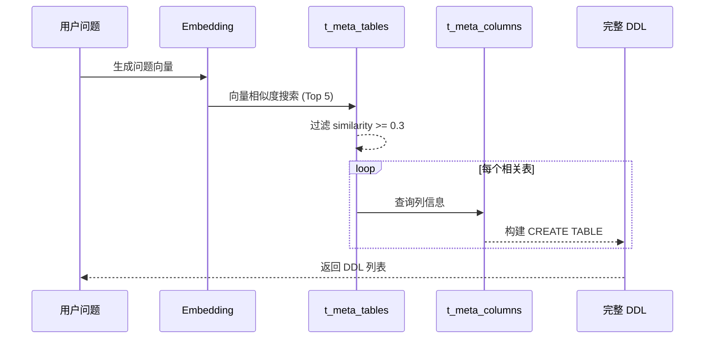

#### 指标体系 (`t_metric_definition`)

指标体系是问数 Agent 的核心知识库，存储业务指标的语义定义和 SQL 模板。

**表结构**：

| 字段 | 类型 | 说明 |
|------|------|------|
| `metric_code` | VARCHAR | 指标代码（主键） |
| `metric_name` | VARCHAR | 指标名称（如"存款余额"） |
| `tags` | VARCHAR | 别名/标签（逗号分隔） |
| `description` | TEXT | 指标定义说明 |
| `formula` | TEXT | SQL 模板（计算逻辑） |
| `category` | VARCHAR | 指标分类 |
| `unit` | VARCHAR | 计量单位 |
| `embedding` | VECTOR(1024) | 语义向量（智谱 embedding-3） |

**匹配策略**：

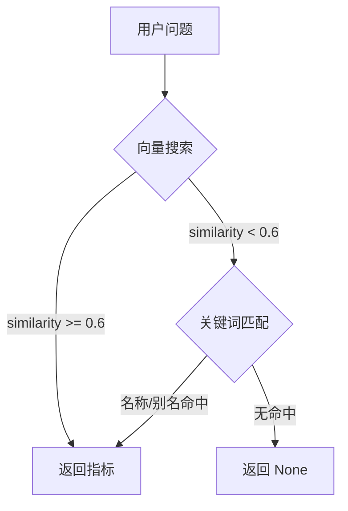

**使用示例**：

```python
from app.services.metric_service import get_metric_service

service = get_metric_service()

# 匹配指标（向量优先 → 关键词降级）
metric = service.match_metric("本月存款余额是多少？")

if metric:
    print(f"匹配到指标: {metric.metric_name}")
    print(f"SQL 模板: {metric.sql_template}")
```

#### 人工训练机制 (`t_data_query_log`)

训练数据表存储历史问答对，支持人工审核标记，用于 Few-shot 学习。

**表结构**：

| 字段 | 类型 | 说明 |
|------|------|------|
| `id` | SERIAL | 主键 |
| `question` | TEXT | 用户原始问题 |
| `generated_sql` | TEXT | 生成/修正后的 SQL |
| `trained` | BOOLEAN | 是否已审核（**人工标记**） |
| `question_embedding` | VECTOR(1024) | 问题向量 |
| `created_at` | TIMESTAMP | 创建时间 |
| `user_feedback` | VARCHAR | 用户反馈（good/bad） |

**训练闭环**：

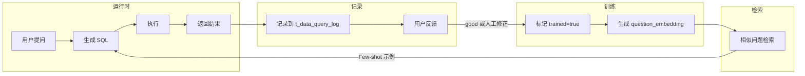

**Few-shot 检索**：

```python
# vanna_client.py
def get_related_question_sql(self, question: str) -> List[Dict]:
    """检索相似历史问答（仅 trained=true）"""
    embedding = self.generate_embedding(question)
    
    sql = """
        SELECT question, generated_sql 
        FROM t_data_query_log 
        WHERE trained = true 
        ORDER BY question_embedding <=> :embedding 
        LIMIT 3
    """
    # 返回 [{"question": "...", "sql": "..."}]
```

**训练数据来源**：

| 来源 | 说明 |
|------|------|
| 用户正向反馈 | 用户对结果满意，标记 `trained=true` |
| 管理员修正 | 管理员修改 SQL 后标记 |
| 批量导入 | 从业务系统导入已验证的问答对 |

### 1. 核心流程

**脚本**: `app/ai/semantic/schema_sync.py`

向量化用于支持 **语义检索 (Semantic Retrieval)**，即当用户提问（如"存款有多少"）时，系统能找到数据库中最相关的指标定义。

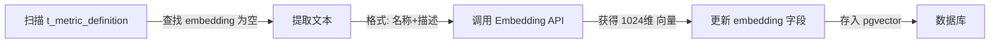

### 2. 向量化策略

- **源表**: `t_metric_definition` (在 chat_db 中)
- **目标字段**: `embedding` (VECTOR 类型, 1024维，适配 ZhipuAI/OpenAI)
- **文本构建**:
  ```python
  text_content = f"指标名称: {row.metric_name}\n定义: {row.description}"
  ```

### 3. 两层漏斗查询策略

Data Agent 采用两层漏斗模型处理用户查询：

```
用户问题 → 第一层：指标匹配 → 第二层：AI 自由生成
              │                    │
           成功 → sql_template   成功 → AI 生成 SQL
              │                    │
           表检查                表检查
              │                    │
           缺表 → 返回错误      缺表 → 返回错误
              │                    │
           执行 SQL             执行 SQL
```

#### 第一层：指标匹配

1. **用户提问**: "本月存款余额是多少？"
2. **关键词匹配**: 在 `t_metric_definition` 中搜索 `metric_name` 和 `aliases`
3. **匹配成功**: 获取指标的 `sql_template`
4. **表可用性检查**: 提取 SQL 中的表名，验证是否存在于 `data_db`
5. **执行或报错**: 表存在则执行，缺表则返回友好提示

#### 第二层：AI 自由生成

1. **无指标匹配**: 调用 Vanna 生成 SQL
2. **表可用性检查**: 同上
3. **执行或报错**: 同上

#### 相关模块

| 模块 | 路径 | 职责 |
|-----|------|------|
| `MetricService` | `app/services/metric_service.py` | 指标匹配、表检查 |
| `semantic_query` | `app/ai/tools/data_query_tools.py` | 两层漏斗入口 |
| `t_metric_definition` | `chat_db` | 指标定义表 |

### 4. 知识库优化 (人工反馈闭环)

为了不断提升 SQL 生成的准确率，系统设计了"人工反馈 + 持续训练"的闭环机制。

#### 优化流程

1.  **收集反馈**: 记录用户的查询及满意的 SQL（或管理员手动修正的 SQL）。
2.  **训练 (Train)**: 将 `(Question, SQL)` 对存入 Vanna 向量数据库。
    ```python
    # 核心 API
    vanna.train(question="...", sql="...")
    ```
3.  **生效**: Vanna 会自动计算 embedding 并存入 `chromadb`。下次遇到相似问题时，会优先召回这优化的 SQL 样本作为上下文（Few-shot Learning）。

#### 两种优化路径

| 场景 | 方法 | 适用性 |
|-----|------|-------|
| **特定长尾问题** | Vanna Training | 将该特例加入向量库，作为 Few-shot 样本。 |
| **高频核心指标** | 指标固化 | 将 SQL作为模板写入 `t_metric_definition`，通过第一层漏斗直接命中。 |

### 5. 维护说明

- **新增指标**: 插入 `t_metric_definition` 时保持 `embedding` 为 NULL。
- **运行同步**: 执行 `python app/ai/semantic/schema_sync.py` 自动补充向量。
```

---

## 📝 扩展指南

### 添加新专家 Agent

1. 在 `app/ai/agents/` 创建 `new_agent.py`
2. 在 `AgentType` 枚举中添加类型
3. 在 `AGENT_DESCRIPTIONS` 中添加描述
4. 在 `create_multi_agent_graph()` 中注册节点

### 添加新工具

1. 在 `app/ai/tools/` 创建或修改工具文件
2. 定义 Pydantic Input Schema
3. 使用 `@tool(args_schema=...)` 装饰器
4. 在相应 Agent 的工具列表中注册

### 添加新事件类型

1. 在 `app/ai/events.py` 的 `EventType` 中添加
2. 创建对应的 `emit_xxx` 函数
3. 在 `web/src/hooks/useSSEStream.ts` 中处理
4. 在 `web/src/lib/backend.ts` 的 `StreamCallbacks` 中添加回调
