# AI 模块详解

> **用途**: 深入理解 AI 模块的实现细节，帮助 AI 准确修改相关代码。

## 文档导航

- 全局架构入口：[系统总览](系统总览.md)
- AI 代码与节点设计（当前文档）：[AI模块设计](AI模块设计.md)
- 待办子图专项设计：[待办Agent设计](待办Agent设计.md)
- 问数子图专项设计：[问数引擎设计](问数引擎设计.md)
- 流式事件协议权威入口：[SSE事件协议](../代码解读/SSE事件协议.md)
- 接口与参数契约：[接口文档](../../API文档/接口文档.md)
- 需求来源总览：[系统需求](../../产品文档/系统需求.md)

---

## 📂 目录结构

```
app/ai/
├── workflow/
│   ├── multi_agent_graph.py   # 多智能体 Supervisor 图
│   ├── data_graph.py          # 问数专用 StateGraph (2026-02 升级)
│   └── todo_graph.py          # 待办专用 StateGraph (2026-01 重构)
├── agents/
│   ├── knowledge_agent.py     # 知识库专家
│   ├── todo_agent.py          # 待办事项专家 (Prompt 定义)
│   ├── todo_enhanced_nodes.py # 增强节点（澄清/冲突检测/任务拆解）
│   └── summarize_node.py      # 摘要节点
├── tools/
│   ├── todo_tools.py          # 待办工具集
│   ├── batch_todo_tools.py    # 批量待办工具
│   ├── chatTools.py           # MCP 数据库工具
│   ├── file_tools.py          # 文件读取工具
│   ├── vision_tool.py         # 图片分析工具
│   ├── ragflow_tool.py        # 知识库检索工具
│   └── embedding_util.py      # [New] 嵌入向量生成工具
├── skills/                    # 技能知识库（启动时自动同步到数据库）
│   ├── knowledge-search/      # 知识库检索
│   ├── sql-expert/            # SQL 专家
│   ├── fastapi-expert/        # FastAPI 专家
│   └── ...                    # 共 23 个技能
├── prompts/                   # 渐进披露 Prompt 管理
│   ├── agent_prompts.py       # 核心 Prompt
│   ├── prompt_loader.py       # 参考文档加载器
│   └── references/            # 详细参考文档
│       ├── sql_guide.md
│       ├── chart_guide.md
│       └── knowledge_guide.md
├── utils/                      # 工具函数
│   ├── __init__.py
│   ├── state_helpers.py        # 状态辅助函数 (user_id/todo_id 统一获取)
│   ├── image_fixer.py          # 图片链接修复逻辑
│   ├── embedding_util.py       # 嵌入向量生成工具
│   ├── sql_parser.py           # [New] SQL 解析工具（sqlglot）
│   └── sql_safety.py           # [New] SQL 安全检查工具
├── mcp/                       # Model Context Protocol
├── events.py                  # SSE 事件协议
├── guardrails.py              # 护栏系统（输入/输出验证）
├── intent_classifier.py       # 意图识别器
├── parameter_extractor.py     # 参数提取器（借鉴 Flock）
├── llm_judge.py               # LLM as Judge 输出评估
├── llm_util.py                # LLM 实例管理
├── message_utils.py           # 消息处理工具
└── middleware.py              # AI 中间件
├── models/
│   └── agent_skill.py         # [New] 技能数据库模型
├── services/
│   └── skill_service.py       # [New] 技能检索服务
└── scripts/
    └── import_skills.py       # [New] 技能导入脚本
```

---

## 🔄 MultiAgentGraph 架构

### Skills RAG 与系统上下文增强 (2026-01)

在进入 Supervisor 之前，预处理节点会：
1. **注入系统上下文**：为所有 Agent 提供当前时间等系统信息
2. **检索相关技能**：根据用户消息动态检索业务技能

**配置参数**：

| 参数 | 默认值 | 说明 |
|------|--------|------|
| `skill_similarity_threshold` | 0.55 | 相似度阈值，低于此值的技能不会被加载 |
| `top_k` | 2 | 最多返回的技能数量 |

> **调试日志**: 技能检索会输出候选技能及相似度分数，格式：`技能检索: 阈值=0.55, 候选=[skill(0.7), ...], 匹配=1个`

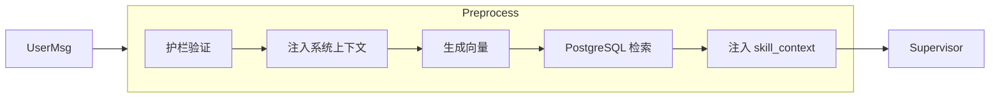

### 状态定义

**文件**: `app/ai/state.py`

```python
class BaseAgentState(TypedDict, total=False):
    """所有 Agent 共享状态。"""
    messages: Annotated[list, add_messages]  # 对话消息列表
    user_id: Optional[int]                    # 用户 ID
    thread_id: Optional[str]                  # 对话线程 ID
    enable_thinking: Optional[bool]           # 是否启用深度思考
    model_id: Optional[str]                   # 模型标识
    pending_handoff: Optional[Dict]           # 当前轮委派上下文（供专家子图消费）


class MultiAgentState(BaseAgentState, total=False):
    """多智能体 Supervisor 扩展状态。"""
    attachment_analysis: Optional[str]        # 附件分析结果
    evaluation: Optional[str]                 # 评估结果
    iteration_count: Optional[int]            # 迭代计数
    thinking_content: Optional[str]           # 思考内容
    detected_intent: Optional[str]            # 识别到的意图类型
    intent_route: Optional[str]               # 意图路由目标
    skill_context: Optional[str]              # 检索到的相关技能上下文
    system_context: Optional[str]             # 系统级上下文（当前时间、用户信息等）
```

说明：`pending_handoff` 放在 `BaseAgentState`，确保 `DataAgentState` / `TodoAgentState` 子图都能读取同一份委派上下文，避免补充轮次丢失历史语义。

### 状态生命周期管理 (2026-02)

> [!IMPORTANT]
> LangGraph checkpoint 会持久化所有状态字段。为避免跨轮次状态污染，需明确区分**持久化状态**和**瞬态状态**。

#### 状态分类

| 类型 | 字段 | 说明 |
|------|------|------|
| **持久化状态** | `messages`, `user_id`, `thread_id`, `model_id`, `enable_thinking` | 跨轮次保留，用于上下文连续性 |
| **瞬态状态** | `pending_handoff`, `pending_operation`, `evaluation`, `iteration_count`, `user_confirmed`, `quick_mode`, `detected_intent`, `intent_route`, `attachment_analysis`, `skill_context` | 仅在单轮有效，每轮结束时清理 |

#### 清理机制

**位置**: `_postprocess` 函数（Graph 唯一出口）

**设计原则**: 出口清理，符合"资源在哪里分配就在哪里释放"原则。

```python
def _postprocess(state: MultiAgentState) -> dict:
    # ... 保存对话、清理 DataFrame 缓存 ...
    
    # 统一清理临时状态字段，确保下一轮从干净状态开始
    return {
        # 委派控制
        "pending_handoff": None,
        # 操作状态
        "pending_operation": None,
        "user_confirmed": None,
        "quick_mode": None,
        # 评估状态
        "evaluation": None,
        "iteration_count": 0,
        # 意图识别
        "detected_intent": None,
        "intent_route": None,
        # 预处理结果
        "attachment_analysis": None,
        "skill_context": None,
    }
```

#### 为什么不用 LangGraph 原生方案

LangGraph 目前（2025 年）不支持将特定字段标记为"瞬态"（不持久化到 checkpoint）。社区讨论了以下替代方案，但各有局限：

| 方案 | 说明 | 局限 |
|------|------|------|
| 通过 `config` 传递 | 瞬态数据不放入 state | 需要改变所有节点的状态访问方式，改动巨大 |
| Input/Output 分离 | 定义不同的 input/output schema | checkpoint 仍会保存所有字段 |
| `entrypoint.final()` | 明确指定保存值 | 仅适用于 Functional API |

**当前方案**（postprocess 清理）是最务实的选择：改动小、效果等价、未来可平滑迁移。

> 更多背景：参考 LangGraph [Discussion #3192](https://github.com/langchain-ai/langgraph/discussions/3192)

### 核心节点（简化架构）

| 节点 | 函数 | 职责 |
|------|------|------|
| `preprocess` | `_preprocess_multimodal` | 验证消息、分析附件、护栏验证 |
| `intent_classify` | `_classify_intent` | 🆕 意图识别，决定路由目标 |
| `supervisor` | Supervisor Agent | 理解意图、路由决策、直接处理简单任务 |
| `data_expert` | Data Agent | 复杂多步骤数据分析 |
| `todo_expert` | Todo Agent | 待办事项管理（需要确认流程） |
| `evaluate` | `_evaluate_expert_work` | 评估任务完成度 |
| `postprocess` | `_postprocess` | 保存对话、清理缓存 |

### 路由机制 (2026-01 类型安全重构)

Supervisor 通过 **Handoff Tools** 进行路由，使用类型安全的 `HandoffResult` 协议：

**文件**: `app/ai/protocol.py`

```python
from pydantic import BaseModel, Field

class HandoffResult(BaseModel):
    """标准 Handoff 结果模型（Pydantic 验证）"""
    action: str = Field(default="handoff")
    target_agent: str = Field(..., description="目标专家 Agent 名称")
    task_description: str = Field(..., description="任务描述与上下文")
```

**文件**: `app/ai/workflow/multi_agent_graph.py`

```python
from app.ai.protocol import HandoffResult

def _create_task_handoff_tool(agent_name: str, description: str):
    """创建带任务描述的 Handoff 工具。"""
    
    @tool(name=f"assign_to_{agent_name}", description=description)
    def handoff_tool(
        task_description: Annotated[str, "详细描述下一个专家需要完成的任务"],
    ) -> str:
        """将任务委派给指定的专家 Agent。返回 JSON 格式的委派指令。"""
        result = HandoffResult(
            target_agent=agent_name,
            task_description=task_description
        )
        return result.model_dump_json(ensure_ascii=False)
    
    return handoff_tool
```

**Wrapper 层检测**（`streaming_wrapper` 中的 `on_tool_end` 处理）:

```python
from app.ai.protocol import AgentOutputParser

# 类型安全解析
handoff_result = AgentOutputParser.parse_handoff_typed(tool_output)
if handoff_result:
    # handoff_result 是 HandoffResult 类型，IDE 可直接提示字段
    return {"pending_handoff": handoff_result.model_dump()}
```

> [!NOTE]
> 2026-01 重构：从字符串协议 `<!--HANDOFF:{...}-->` 迁移到类型安全的 `HandoffResult` Pydantic 模型。

---

## 📋 Todo Graph 架构

> **详细设计文档**: [待办Agent设计](./待办Agent设计.md)

**文件**: `app/ai/workflow/todo_graph.py`

Todo Agent 是一个独立的 StateGraph，采用**意图驱动架构**，支持多轮对话、确认流程、冲突检测等特性。

### 核心节点

| 节点 | 职责 |
|-----|------|
| `analyze_intent` | LLM 分析用户意图，提取待办信息；接收 `config` 参数，当前端传入 `current_todo_id` 时注入选中待办上下文辅助意图判断；对超出待办能力范围的输入返回能力边界提示 |
| `clarify` | 信息不完整时生成追问 |
| `resolve` | 模糊标识 → 具体 todo_id |
| `confirm` + `wait_confirm` | 确认流程 (使用 `interrupt()`) |
| `execute` | 执行 CRUD 操作 |

### 节点流程图

```
analyze → route_next → [clarify|conflict|resolve|execute]
                              │
                        route_after_resolve
                              │
                    [clarify|confirm|execute]
                              │
                        wait_confirm → execute → END
```

### 节点函数 -> 事件契约（2026-02 严格切换）

#### Todo Graph（含增强节点与解析节点）

| 节点函数 | 应发事件（目标） | 说明 |
|-----|----------------|------|
| `analyze_intent` | 无（状态内决策） | 超范围输入只设置状态，不发送结构化事件 |
| `clarify_node` | `clarification` | 使用 `emit_clarification` 主动引导用户补充信息 |
| `conflict_detection_node` | 无（文本消息） | 冲突提示通过 AI 文本消息表达 |
| `resolve_entity` | 无（状态更新） | 仅做实体解析与路由状态变更 |
| `ask_confirmation` | 不发 `confirmation` | 沿用 `additional_kwargs.operation + interrupt` 的 HITL 流程 |
| `wait_for_confirmation` | `interrupt`（LangGraph 内建） | 通过 `interrupt()` 暂停并等待用户决策 |
| `execute_operation` | `result`（由 Supervisor 包装器统一发） | 节点返回 `AIMessage.additional_kwargs(data_type,data)`，由上层转为 `result` |

#### Data Graph

| 节点函数 | 应发事件（目标） | 说明 |
|-----|----------------|------|
| `analyze_data_intent` | 无 | 意图分析，非 UI 事件节点 |
| `metric_resolve` | 无 | 模板匹配，不直接发事件；若用户请求 TopN/排名/维度而模板仅支持总量聚合，自动降级到下一层 |
| `training_sql_resolve` | 无 | 检索训练 SQL；若命中 SQL 不满足 TopN/维度语义，跳过该候选并回退通用 RAG |
| `schema_retrieve` | 无 | 检索 schema |
| `sql_generate` | 无 | 生成 SQL |
| `sql_safety_check` | 无 | 安全校验 |
| `sql_execute` | `status` / `result` / `error` | 查询执行阶段负责结构化输出和状态反馈，`sql_result.data` 可选携带 `chart` 规格（前端图+表并存） |
| `clarify_node` | 无（文本消息） | 保持轻量，不扩展事件协议面 |

#### Supervisor（多智能体主图）

| 节点函数 | 应发事件（目标） | 说明 |
|-----|----------------|------|
| `_preprocess_multimodal` | `status` | 护栏、技能加载、图片分析状态 |
| `streaming_wrapper` | `token` / `thinking` / `tool_start` / `tool_end` / `result` / `kb_images` | 核心统一事件出口 |
| `_evaluate_expert_work` | `status` | 协调继续执行时的提示 |
| `_postprocess` | 无 | 仅负责持久化与清理 |
| `ChatService done` | `done`（仅生命周期） | 严禁携带结构化数据 |

#### Supervisor 模型异常降级策略（2026-02）

- 当 `supervisor` 在 `streaming_wrapper` 中遇到模型配额/订阅/权限类错误（如 `403`、`SUBSCRIPTION_NOT_FOUND`、`Insufficient Balance`）时，不再向用户透传 `[System Error: ...]`。
- 若最新用户输入命中待办语义（如“查询我的待办列表”），系统会构造 `pending_handoff` 并降级路由到 `todo_expert` 继续执行，优先保障待办链路可用性。
- 若不满足待办降级条件，则返回稳定的用户友好提示（如“模型服务当前不可用……”），避免暴露底层异常细节。

### 智能特性

| 特性 | 说明 |
|-----|------|
| 渐进式策略 | 多轮对话后自动给默认值 |
| 快速模式 | 检测关键词跳过确认 |
| 实体解析 | 模糊匹配用户指定的待办 |
| 指代消歧 | 用户仅输入"项目汇报那个"等无动作指代表达时，优先结合上下文自动判定；简单场景一次确认，复杂场景多轮消歧 |
| 取消后补充恢复 | 创建确认阶段若用户先拒绝，随后以补充轮继续输入细节（`SUPPLEMENT`/`CORRECTION`），在无目标待办 ID 且历史会话帧 `todo_action=create` 时系统优先恢复 `create` 并重新进入确认；恢复判定不依赖 handoff 文案中的“更新/创建”措辞，避免误入 `update` 的目标 ID 追问 |
| 提取字段归一化 | 统一将 `target_ref/target_title/new_due_date/new_priority/new_category/new_description` 映射为执行链路可消费的 canonical 字段 |
| 选中待办上下文 | 前端选中待办后，`analyze_intent` 从 DB 加载该待办完整信息注入 prompt，辅助 LLM 将用户消息关联到具体待办（支持 update/complete/delete），并自动注入 `todo_id` |
| 能力边界兜底 | 当输入明显属于天气/新闻/问数/知识库/绘图等非待办请求时，不触发待办查询，统一返回“超出待办能力范围”的引导文案 |

#### 指代消歧与自适应确认规则

- **无动作指代默认策略**：当输入只包含目标（如"项目汇报那个"）但未出现明确动作词时，系统先尝试匹配目标待办；唯一命中默认按 `update` 进入确认流程（用户可改口为完成/删除）。
- **多候选场景**：若命中多个待办，`resolve_entity` 返回候选列表，支持用户使用"第 X 个"、"ID 为 XX"或直接补充标题片段继续消歧。
- **不可判定场景**：若无法命中目标，进入澄清分支并要求补充动作或更完整标题，避免重复固定追问文案。

#### 提取字段归一化（Canonicalization）

`analyze_intent` 在路由前执行字段归一化，确保 `pending_operation.data` 稳定使用以下字段：

- `title`
- `due_date`
- `priority`
- `category`
- `description`

同时保留原始别名字段用于兼容历史日志与排障。

### 工具调用架构 (ADR-001)

**决策**: 不采用 LangGraph `ToolNode`，使用自定义 `execute_operation` 节点

| 维度 | ToolNode 模式 | 当前实现 |
|------|---------------|----------|
| 工具调用触发 | LLM 生成 `tool_calls` | `analyze_intent` 构造 `pending_operation` |
| 用户确认 | 无内置支持 | `ask_confirmation` + `wait_for_confirmation` |
| 结果格式 | 标准 `ToolMessage(content)` | 自定义 `ToolResult(data_type, data, message)` |

**选择理由**: 需要在工具执行前插入确认、冲突检测、参数补全等业务逻辑。

> 更多详情（状态定义、路由逻辑、配置管理、提示词策略等）请参阅 [待办Agent设计](./待办Agent设计.md)

---

## 🛠️ Tools 详解

### Todo Tools

> **详细说明**: [待办Agent设计 - 工具函数](./待办Agent设计.md#6-工具函数)

**文件**: `app/ai/tools/todo_tools.py`

| 工具 | 用途 |
|------|------|
| `add_todo` | 创建待办 |
| `list_todos` | 查询待办 (支持多维度过滤) |
| `update_todo` | 更新待办 |
| `update_progress` | 更新进度 (自动联动状态) |
| `complete_todo` | 标记完成 |
| `delete_todo` | 软删除 |

---

## 📡 事件系统

### 事件发送方式

**文件**: `app/ai/events.py`

```python
from langgraph.config import get_stream_writer
from app.ai.events import emit_status, emit_result

def my_node(state):
    writer = get_stream_writer()
    
    # 发送状态更新
    emit_status(writer, "正在处理...")
    
    # 发送结构化结果
    emit_result(writer, "todo_list", {"todos": [...]}, "找到 3 条待办")
    
    return state
```

### 事件函数一览

> [!IMPORTANT]
> 事件定义与载荷字段请以 `docs/开发文档/代码解读/SSE事件协议.md` 为准。本节只保留快速索引。

| 函数 | 事件类型 | 用途 |
|------|----------|------|
| `emit_token` | `token` | AI 文本输出 |
| `emit_thinking` | `thinking` | 思考过程 |
| `emit_status` | `status` | 状态更新（如"正在查询..."） |
| `emit_result` | `result` | 结构化结果（卡片数据） |
| `emit_confirmation` | `confirmation` | 确认请求 |
| `emit_clarification` | `clarification` | 澄清问题 |
| `emit_error` | `error` | 错误信息 |
| `emit_done` | `done` | 流结束 |

### AgentEvent 模型 (2026-01 新增)

统一的事件模型，用于 `astream_events` 架构：

```python
from app.ai.events import AgentEvent, AgentEventType

# 创建事件
event = AgentEvent.token("你好", node="supervisor")
event = AgentEvent.tool_start("sql_inter", {"query": "..."}, node="data_expert")
event = AgentEvent.handoff("todo_expert", "处理待办任务")

# 转换为 stream 兼容格式
writer(event.to_stream_dict())  # {"type": "token", "data": {"content": "你好"}, "node": "supervisor"}
```

---

## 🔧 LLM 配置

### 获取 LLM 实例

**文件**: `app/ai/llm_util.py`

```python
from app.ai.llm_util import get_llm

# 获取默认 LLM
llm = get_llm()

# 获取用户选择的模型（从 State 读取）
llm = get_llm(model_id=state.get("model_id"))

# 内部分析（禁用流式 + 添加 tag，跟随用户模型选择）
llm = get_llm(internal=True, model_id=state.get("model_id"))

# 启用深度思考模式
llm = get_llm(force_thinking=True, model_id=state.get("model_id"))
```

### LLM 调用规范

> **2026-02 架构修复**: 统一所有 chat 类 LLM 调用走 `get_llm()`。

**规则**:
1. **所有 chat 类 LLM 调用必须通过 `get_llm()`**，禁止自建 `OpenAI` 客户端
2. **model_id 从 State 读取**: `BaseAgentState` 已定义 `model_id` 和 `enable_thinking` 字段，由 `chat_service` 注入，所有节点可通过 `state.get("model_id")` 获取
3. **内部分析节点传 model_id 不传 thinking**: `get_llm(internal=True, model_id=...)` 确保模型一致但不消耗 thinking token
4. **合理例外**: embedding 和 vision 等非 chat 模型仍直接创建客户端（`get_llm()` 不支持这些类型）

### 中转供应商实验适配（仅开发/测试环境）

> **目标**：支持 OpenAI 兼容但实现不完全一致的中转供应商，同时保证生产链路性能和逻辑不受影响。

**启用条件（全部满足才生效）**：
1. `ENV != prod`
2. `feature.proxy_experiment_enabled=true`（数据库 `t_system_config`）
3. 当前模型 `provider_code` 命中 `feature.proxy_experiment_providers`（数据库白名单）

> 若数据库未配置上述配置项，分别回退 `ENABLE_PROXY_EXPERIMENT` / `PROXY_EXPERIMENT_PROVIDERS` 环境变量。

**配置入口**：
- `t_llm_model.extra_config`（模型级）
- `t_llm_provider.extra_config`（提供商级，可选）

**推荐配置键（示例）**：

```json
{
  "use_responses_api": true,
  "actual_model": "gpt-5.2",
  "send_x_api_key": true,
  "default_headers": {
    "User-Agent": "codex-cli/0.98.0"
  },
  "store": false,
  "reasoning_effort": "medium",
  "verbosity": "low"
}
```

**不影响生产的约束**：
- 生产环境默认不启用实验适配分支。
- 非实验 provider 继续走既有 `get_llm()` 逻辑，无额外协议分支。
- 实验逻辑仅在命中条件时读取 `extra_config` 并注入参数，避免全量路径开销。

### internal 调用输入兼容（2026-02-08）

> **背景**：中转链路接入 `gpt-5.2` 后，历史 `AIMessage.content` 可能为 Responses 风格的 block 列表，包含 `function_call` 块。
> 内部分析节点（`internal=True`）若将该列表直接透传给 Chat Completions 兼容端，可能触发 `400 invalid_value`。

**当前策略**：
- 在 `InternalLLMWrapper.invoke/ainvoke` 内统一执行 `_sanitize_internal_invoke_input`。
- 仅对 `content` 为列表的消息做兼容清洗：
  - 保留 `text` / `content` 文本块
  - 跳过 `function_call` / `tool_call` / `function_result` 块
- 清洗后仅用于本次 internal 调用，不修改原始消息对象。

**作用边界**：
- 仅作用于 `get_llm(internal=True, ...)` 的内部分析链路（意图分析、参数抽取等）。
- 不影响主对话流式输出、不影响 Tool Calling 主路径协议。

**生产建议**：
- 当前已提供独立开关 `ENABLE_INTERNAL_CONTENT_SANITIZE`（建议 prod 关闭，按需开启）。
- 当前版本通过“internal 作用域隔离”控制风险，属于兼容性兜底而非主链路能力。

**数据流**:

```
前端模型选择 → API enable_thinking / model_id
→ chat_service 注入 input_state
→ BaseAgentState.model_id / enable_thinking
→ 各节点 state.get("model_id") → get_llm()
```

### 模型分类路由表

> **2026-02 更新**: 不同场景使用不同模型，避免推理模型浪费 reasoning tokens。

#### 按场景分类

> **配置提示**: 
> 下表中的 `SQL 生成`、`内部分析`、`意图分类`、`参数提取`、`评估` 等场景的模型配置，现在均已支持在 **后台管理 -> LLM 配置 -> 模型路由** 页面进行可视化配置。
> `Embedding` 和 `Vision` 模型则通过在 **模型列表** 中设置对应类型的默认模型来生效。

| 场景 | 调用点 | 模型来源 | 配置项 | 推荐模型 |
|------|--------|----------|--------|----------|
| 主对话 | Supervisor / Agent 回复 | 用户前端选择 | State `model_id` | 用户自选 |
| SQL 生成 | `vanna_client.submit_prompt` | 固定配置 | `model_routing.sql_generation` | 非推理模型（qwen-plus） |
| 内部分析 | `analyze_data_intent` 等 `internal=True` 节点 | 固定配置 | `model_routing.sql_generation` | qwen-plus |
| 轻量任务（意图分类） | `intent_classifier.py` | 固定配置 | `model_routing.lightweight` | qwen-plus |
| 轻量任务（评估/提取） | `llm_judge.py`, `parameter_extractor.py` | 固定配置 | `model_routing.lightweight` | qwen-plus |
| Embedding | `embedding_util.py` | 数据库 `type=embedding` | `t_llm_model` | embedding-3 |
| Vision | `vision_tool.py` | 数据库 `type=vision` | `t_llm_model` | glm-4v-flash |

#### 按模型类型分类

| 模型类型 | 代表模型 | 特点 | 适合场景 | 不适合场景 |
|----------|----------|------|----------|------------|
| 非推理通用 | qwen-plus, deepseek-chat, deepseek-v3.2 | 无 reasoning tokens、响应快、成本低 | SQL 生成、意图分类、评估 | 需要深度推理的复杂问题 |
| 隐式推理 | glm-4.5-air | 自动消耗 reasoning tokens、不可控 | 复杂对话（需用户主动选择） | 内部分析、SQL 生成（浪费 token） |
| 显式推理 | qwen-flash, deepseek-r1, kimi-k2.5 | 可控的 thinking 模式（enable_thinking 开关） | 用户开启"思考"开关时 | 日常简单查询 |
| 深度推理 | kimi-k2-thinking | 仅思考模式、256K 上下文、强工具调用 | 复杂推理、编码、多步骤规划 | 简单查询（始终消耗 reasoning tokens） |
| 嵌入专用 | embedding-3 | 向量生成，非 chat | DDL/指标向量检索 | 不可用于对话 |
| 视觉专用 | glm-4v-flash, kimi-k2.5 | 图片/视频理解 | 图片分析、多模态任务 | 不可用于 SQL 生成 |

#### 配置项速查

| 配置项 | 对应路由 Key | 默认值 (环境变量) | 说明 |
|--------|------|--------|------|
| 数据库默认模型 | - | `qwen-plus` | 用户未选模型时的主力模型 |
| `INTENT_CLASSIFIER_MODEL` | `model_routing.lightweight` | `qwen-plus` | 意图分类/评估/参数提取 (轻量任务) |
| `SQL_GENERATION_MODEL` | `model_routing.sql_generation` | `qwen-plus` | Vanna SQL 生成 / 复杂意图分析 |
| `MODEL_NAME` | - | `glm-4.5-air` | 环境变量回退（数据库不可用时） |

---

## 🔍 消息处理

### 消息验证

**文件**: `app/ai/message_utils.py`

```python
from app.ai.message_utils import validate_messages, remove_incomplete_tool_calls

# 验证消息完整性
messages = validate_messages(state["messages"])

# 移除不完整的 tool_calls
messages = remove_incomplete_tool_calls(messages)
```

### 常见消息问题

1. **Tool Call 没有对应的 Tool Message** → 自动补充空响应
2. **DeepSeek reasoning_content 丢失** → 修复 AIMessage 属性
3. **消息格式不一致** → 标准化为 LangChain 格式

---

## 📡 Custom 事件机制 (stream_mode="custom")

> [!TIP]
> 关于 Custom Mode 的核心设计哲学、**双写架构 (Dual Write)** 以及与 State 的关系，请参阅专题文档：[流式通信与状态同步设计](../代码解读/流式通信与状态同步设计.md)

### 核心概念

LangGraph 提供了 `stream_mode="custom"` 模式，允许图中的节点通过 `StreamWriter` 直接向前端发送自定义事件。这是实现实时推送（如图片、状态更新、工具调用）的核心机制。

### 工作原理 (2026-01 重构)

此次重构将原本分散的流式逻辑统一为标准化的事件驱动架构：

```mermaid
graph TD
    subgraph Agent Runtime
        LLM[LLM / Tool] --> |astream_events v2| Wrapper[Streaming Wrapper]
        Wrapper --> |封装| Event[AgentEvent]
        Event --> |to_stream_dict| Stream[StreamWriter]
    end
    
    subgraph Service Layer
        Stream --> |stream_mode=custom| ChatService[ChatService.stream]
        ChatService --> |收集| Collector[Message Collector (list)]
        ChatService --> |转发| SSE[SSE Response]
    end
    
    subgraph Persistence
        Collector --> |流结束/中断| DB_Save[保存到 PostgreSQL]
    end

    subgraph Frontend
        SSE --> |onToken/onTool| UI[UI 组件]
    end
```

### 完整事件类型列表

> [!IMPORTANT]
> 本表用于理解发送链路；若与 `docs/开发文档/代码解读/SSE事件协议.md` 不一致，以协议文档为最终准绳。

| 事件类型 | emit 函数 | AgentEvent 方法 | 用途 | 触发时机 |
|---------|----------|----------------|------|----------|
| `token` | `emit_token` | `AgentEvent.token()` | AI 文本输出 | LLM 生成 token 时 (on_chat_model_stream) |
| `thinking` | `emit_thinking` | `AgentEvent.thinking()` | 思考过程 | 深度思考模式下 |
| `tool_start` | `emit_tool_start` | `AgentEvent.tool_start()` | 工具调用开始 | 检测到 tool_calls 时 (on_tool_start) |
| `tool_end` | `emit_tool_end` | `AgentEvent.tool_end()` | 工具调用结束 | 检测到 ToolMessage 时 (on_tool_end) |
| `status` | `emit_status` | `AgentEvent.status()` | 状态更新 | 长时间操作时 |
| `result` | `emit_result` | - | 结构化结果 | 返回卡片数据时 |
| `confirmation` | `emit_confirmation` | - | 确认请求 | 需要用户确认时 |
| `clarification` | `emit_clarification` | - | 澄清问题 | 需要补充信息时 |
| `handoff` | - | `AgentEvent.handoff()` | 专家切换 | Supervisor 切换专家时 |
| `error` | `emit_error` | `AgentEvent.error()` | 错误 | 发生异常时 |
| `done` | `emit_done` | `AgentEvent.done()` | 流结束（仅生命周期） | 处理完成时 |

> [!IMPORTANT]
> 协议约束（2026-02）：结构化数据仅允许通过 `result` 事件发送，`done` 不再承载 `additional_kwargs`。

### 关键组件

#### 1. 获取 StreamWriter

```python
from langgraph.config import get_stream_writer

def my_tool():
    writer = get_stream_writer()  # 获取当前流的 writer
    # 使用 writer 发送自定义事件
```

> [!IMPORTANT]  
> `get_stream_writer()` 只能在 LangGraph 流式执行上下文中调用。在普通函数或测试中调用会失败。

#### 2. 事件发送函数 (app/ai/events.py)

```python
# 文本输出
def emit_token(writer, content: str, node: str = ""):
    writer({"type": "token", "data": {"content": content}, "node": node})

# 思考过程
def emit_thinking(writer, content: str, node: str = ""):
    writer({"type": "thinking", "data": {"content": content}, "node": node})

# 状态更新
def emit_status(writer, message: str, node: str = ""):
    writer({"type": "status", "data": {"message": message}, "node": node})

# 工具调用开始
def emit_tool_start(writer, tool_name: str, tool_input: dict = None, node: str = ""):
    writer({"type": "tool_start", "data": {"name": tool_name, "input": tool_input or {}}, "node": node})

# 工具调用结束
def emit_tool_end(writer, tool_name: str, output: str = "", node: str = ""):
    writer({"type": "tool_end", "data": {"name": tool_name, "output": output}, "node": node})

# 结构化结果（图片、待办列表等）
def emit_result(writer, data_type: str, data: dict, message: str = "", node: str = ""):
    writer({
        "type": "result",
        "data": {"data_type": data_type, "data": data, "message": message},
        "node": node
    })
```

#### 3. 消息收集与持久化 (Service Layer)
 
`ChatService` 充当消息收集器 (Message Collector) 的角色。它不仅负责转发 SSE 事件，还负责聚合所有流式 token 以便持久化。
 
**关键逻辑** (`app/services/chat_service.py`):
 
```python
async for chunk in graph.astream(input_state, config, stream_mode="custom"):
    event_type = chunk.get("type")
    event_data = chunk.get("data")
    
    # 1️⃣ 消息收集 (Message Collector)
    if event_type == "token":
        content = event_data.get("content", "")
        full_answer.append(content)  # 聚合 token
    elif event_type == "thinking":
        thinking_content += event_data.get("content", "")
    elif event_type == "result" and event_data.get("message"):
        full_answer.append(event_data["message"])  # 聚合非 token 结果
    
    # 2️⃣ SSE 转发
    yield self._format_sse(event_type, event_data)

# 3️⃣ 最终持久化 (流结束)
# 当流正常结束或发生 Interrupt 时，将 full_answer 列表拼接为完整字符串保存
if full_answer:
    save_message_to_db(role="ai", content="".join(full_answer))
```
 
> [!NOTE]
> 这种设计避免了依赖 LangGraph 的 `values` 模式来获取最终状态（`values` 往往只包含整个消息历史，提取最新增量较复杂且容易出错）。
 
#### 4. 前端处理 (useSSEStream.ts)

```typescript
const callbacks: StreamCallbacks = {
  onToken: (token) => appendToAiMessage(aiId, token),
  onThinking: (content) => handleThinking(aiId, content),
  onToolStart: (name, input) => addToolCallToMessage(aiId, name, input),
  onToolEnd: (name, output) => console.debug(`工具 ${name} 执行完成`),
  onStatus: (message) => setCurrentStatus(message),  // 🆕 显示在 UI 中
  onResult: (data) => {
    if (data.data_type === 'image') {
      appendImageToAiMessage(aiId, data.data.url);
    }
    // 处理其他类型...
  },
  onDone: () => {
    setCurrentStatus(null);  // 清除状态
    setIsLoading(false);
  },
};
```

### Agent 包装器中的自动事件发送

**文件**: `app/ai/workflow/multi_agent_graph.py`

Agent 包装器 `_create_streaming_agent_wrapper` 使用 `astream_events(version="v2")` 统一捕获并发送事件：

```python
from app.ai.events import AgentEvent

async def streaming_wrapper(state, config):
    writer = get_stream_writer()
    
    async for event in agent.astream_events(state, config, version="v2"):
        event_kind = event.get("event", "")
        event_data = event.get("data", {})
        
        # 1️⃣ LLM Token 流（自动捕获）
        if event_kind == "on_chat_model_stream":
            chunk = event_data.get("chunk")
            if content := getattr(chunk, "content", ""):
                writer(AgentEvent.token(content, node=name).to_stream_dict())
            
            # 检测思考内容
            additional = getattr(chunk, "additional_kwargs", {})
            if reasoning := additional.get("reasoning_content"):
                writer(AgentEvent.thinking(reasoning, node=name).to_stream_dict())
        
        # 2️⃣ 工具调用开始
        elif event_kind == "on_tool_start":
            tool_name = event.get("name")
            tool_input = event_data.get("input", {})
            writer(AgentEvent.tool_start(tool_name, tool_input, node=name).to_stream_dict())
        
        # 3️⃣ 工具调用结束
        elif event_kind == "on_tool_end":
            tool_name = event.get("name")
            tool_output = str(event_data.get("output", ""))[:500]
            writer(AgentEvent.tool_end(tool_name, tool_output, node=name).to_stream_dict())
        
        # 4️⃣ 自定义事件（直接转发）
        elif event_kind == "on_custom_event":
            writer({"type": event.get("name"), "data": event_data, "node": name})
```

> [!NOTE]
> 2026-01 重构：从 `astream(stream_mode=["messages", "values"])` 迁移到 `astream_events(version="v2")`，代码从 ~260 行简化到 ~100 行。

### currentStatus UI 显示

**前端组件**: `web/src/components/chat/messages/ai.tsx`

当后端发送 `status` 事件时，前端会显示状态消息：

```tsx
// 获取当前处理状态
const currentStatus = thread.currentStatus;

if (isLoading) {
  return (
    <div className="flex flex-col gap-2">
      {/* 显示当前处理状态 */}
      {currentStatus && (
        <div className="flex items-center gap-2 text-xs text-gray-500 animate-pulse">
          <span className="inline-block h-1.5 w-1.5 rounded-full bg-blue-500 animate-ping"></span>
          {currentStatus}
        </div>
      )}
      {/* 工具调用和内容 */}
      {hasToolCalls && <ToolCalls toolCalls={message.tool_calls} />}
      <MarkdownText>{contentString}</MarkdownText>
    </div>
  )
}
```

### 典型使用场景

1. **图片推送** (`fig_inter`, `knowledge_search`)
   ```python
   emit_result(writer, "image", {"url": image_url})
   ```

2. **工具调用** (Agent 包装器自动发送)
   ```python
   emit_tool_start(writer, tool_name, tool_args, node=name)
   emit_tool_end(writer, tool_name, output[:200], node=name)
   ```

3. **状态更新** (长时间操作)
   ```python
   emit_status(writer, "正在分析数据...")
   ```

4. **确认请求** (`todo_tools`)
   ```python
   emit_confirmation(writer, operation_data, message)
   ```

---

## 🖼️ 图片流式传输机制

### 统一的双路径架构

**目标**: 确保所有图片来源（Agent 生成 / 知识库检索）在实时对话和历史加载中 URL 完全一致。

#### 图片来源统一处理

| 来源 | 工具 | 返回值 | 事件推送 |
|------|------|--------|---------|
| Agent 生成 | `fig_inter` | `{"image_url": proxy_url}` | `emit_result("image", {url})` |
| 知识库检索 | `knowledge_search` | 文本含 `` | `emit_result("image", {url})` |

两种来源使用**完全相同**的机制：
1. **实时显示**: `emit_result` 推送事件 → 前端 `appendImageToAiMessage`
2. **历史恢复**: 返回值包含 Markdown 图片 → 后端保存 → 前端渲染

#### 路径 1: 实时流式显示

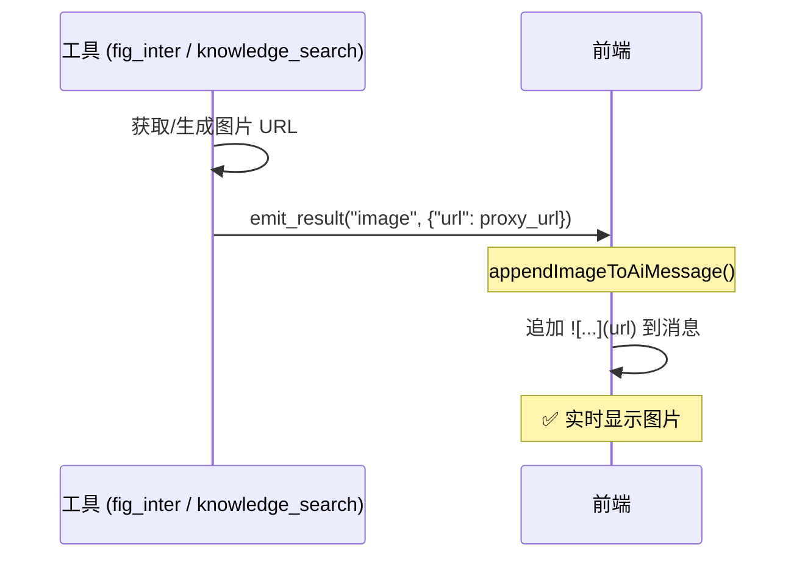

**实现**:
- 工具调用 `emit_result()` 发送 `result` 事件
- 前端 `onResult` 回调调用 `appendImageToAiMessage()` 追加图片
- URL 存储在 `additional_kwargs.displayedImages[]` 用于去重

#### 图片位置与时序

> [!IMPORTANT]
> `appendImageToAiMessage` 将图片追加到**当时内容的末尾**，但 LLM 后续输出会让图片被"包裹"在中间。

**fig_inter 时序**（图片被文字包裹）：
```
T0: LLM 输出 "好的，我来画圆形"  → content = "好的，我来画圆形"
T1: 工具执行，生成图片
T2: emit_result() 追加图片       → content = "好的..."
T3: LLM 继续输出 "完成！"        → content = "好的...完成！"
                                              ↑ 图片在中间
```

**knowledge_search 时序**（图片在最前面）：
```
T0: LLM 调用工具                → content = "" (空)
T1: 工具执行，检索知识库
T2: emit_result() 追加图片       → content = ""
T3: LLM 输出 "根据知识库..."     → content = "根据知识库..."
                                     ↑ 图片在最前面
```

**关键差异**：`emit_result` 触发时，LLM 是否已有输出。

#### 路径 2: 数据库持久化

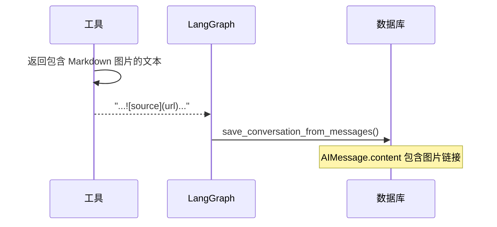

**实现**:
- `fig_inter`: 返回 `{"image_url": url}`, LLM 输出 Markdown 或 `image_fixer` 补充
- `knowledge_search`: 返回文本直接包含 ``
- `save_conversation_from_messages` 提取 Tool 消息中的图片 URL 并补充到 AI 回复

### 去重机制

**问题**: `emit_result` 和工具返回值都包含图片 URL，可能导致重复显示。

**解决**: 三重去重保护

1. **前端追加时检查** (`appendImageToAiMessage`)
   ```typescript
   if (displayedImages.includes(imageUrl)) return; // 已通过事件显示
   if (content.includes(imageUrl)) return; // LLM 已输出（竞态）
   ```

2. **前端 Token 过滤** (`appendToAiMessage`)
   ```typescript
   const imageRegex = /!\[.*?\]\(([^)]+)\)/g;
   if (displayedImages.includes(url)) {
       filteredToken = filteredToken.replace(match[0], ""); // 移除重复
   }
   ```

3. **后端数据库保存（差异化处理）** (`save_conversation_from_messages`)
   
   > [!IMPORTANT]
   > 图片保存策略因来源不同而异
   
   | 图片来源 | URL 特征 | 保存策略 |
   |---------|---------|---------|
   | `fig_inter` 图表 | 包含 `/charts/` | LLM 未引用时自动补充 |
   | `knowledge_search` 知识库 | 包含 `/proxy/ragflow/` | 只保存 LLM 引用的 |
   
   ```python
   # 只补充图表图片，不补充知识库图片
   if "/charts/" in url and url not in ai_content:
       missing_chart_images.append(url)
   ```

### 知识库图片特殊说明

**文件**: `app/ai/tools/ragflow_tool.py`

```python
def _format_retrieval_results(chunks: list) -> tuple[str, list[dict]]:
    """格式化检索结果，提取图片信息用于主动推送。"""
    images = []
    for chunk in chunks:
        if image_id := chunk.get("image_id"):
            image_url = f"/api/v1/assets/proxy/ragflow/{image_id}"
            images.append({"url": image_url, "source": source})
            # 返回文本直接包含 Markdown 图片
            result_text += f"\n   "
    return text, images

def _emit_images(images: list[dict]) -> None:
    """主动推送图片事件给前端。"""
    writer = get_stream_writer()
    for img in images:
        emit_result(writer, "image", {"url": img["url"]}, ...)
```

### 时序图（完整流程）

```mermaid
sequenceDiagram
    participant User as 用户
    participant Tool as 工具
    participant Frontend as 前端
    participant DB as 数据库
    
    User->>Tool: 请求（生成图表/搜索知识库）
    Tool->>Tool: 获取图片 URL
    
    par 实时路径
        Tool->>Frontend: emit_result("image", {url})
        Frontend->>Frontend: appendImageToAiMessage()
        Note over Frontend: 立即显示图片
    and 持久化路径
        Tool->>Tool: 返回包含 Markdown 的文本
        Tool->>DB: postprocess 保存
    end
    
    Note over User,DB: 刷新页面后
    User->>DB: 加载历史
    DB-->>Frontend: AIMessage.content (包含 )

---

## 📊 问数 Agent 语义层 (Semantic Layer)

本节说明问数 Agent 如何将业务指标定义转化为语义向量，支持自然语言检索。

### 0. 2026-01 架构改进

> [!NOTE]
> 2026-01 深度审查后的重大改进，对比 Vanna 官方和 SQL-Sentinel 项目。

#### 改进清单

| 改进项 | 修改文件 | 说明 |
|--------|----------|------|
| RAG 上下文传递 | `data_graph.py` | 检索结果显式注入 SQL 生成 prompt，避免双重检索 |
| 完整 DDL 检索 | `vanna_client.py` | 从 `t_meta_columns` 获取完整列信息，构建真实 CREATE TABLE |
| 统一 SQL 解析 | `sql_parser.py` (新) | 使用 sqlglot 替代分散的正则表达式 |
| 错误自愈机制 | `data_graph.py` | 执行失败时自动重试（最多 3 次），错误信息反馈给 LLM |
| 空结果表切换自愈 | `data_graph.py` | vanna_rag 结果为空且命中历史空表（如 `f_mid_loan_tb`）时，自动切换到有数表（如 `f_mid_loan_k_tb`）重试 |
| 统一安全检查 | `sql_safety.py` (新) | 消除代码重复，集中管理危险关键词和敏感表黑名单 |
| 向量相似度搜索 | `metric_service.py` | 指标匹配优先使用 embedding 向量搜索 |
| LLM Judge 评估 | `llm_judge.py` | SQL 生成后可选质量评估，需设置 `ENABLE_LLM_JUDGE=true` |
| Prompt 渐进披露 | `prompt_loader.py` | 复杂查询按需加载 sql_guide 参考文档，节省 Token |
| 指标可组合查询 | `data_graph.py` | 同一指标支持总量→维度→TopN 语义派生，保持过滤条件一致 |
| 规则驱动结果增强 | `data_graph.py` | 查询结果按规则链补齐展示字段（如客户号映射客户名称），避免场景硬编码 |

#### 同指标多轮追问策略（2026-02-08）

为避免"第一轮总量 + 第二轮TopN"返回重复答案，问数链路新增"指标可组合查询"策略：

1. **指标口径保持**：继续命中同一指标（如 `LOAN_001: 贷款余额`）
2. **形态识别**：从当前轮识别 `query_shape`（`total` / `dimension` / `top_n`）
3. **SQL 派生**：在指标模板的聚合表达式基础上派生 `GROUP BY`/`ORDER BY`/`LIMIT`
4. **条件继承**：继承同轮解析出的时间与筛选条件，避免用户重复输入
5. **安全回退**：无法可靠派生时回退到通用 RAG，避免返回错误或重复总量答案

> 当前默认客户维度映射：`客户 -> ecif_cust_no`（`f_mid_loan_k_tb`）。
> 查询执行后进入“结果增强规则链”，当前内置规则为 `ecif_cust_no -> 客户名称`（源表 `fdmdata.f_mid_dep_tb`），按 `data_dt + ecif_cust_no` 优先，失败时回退 `ecif_cust_no` 级别。

#### 查询结果展示增强（2026-02-08）

为提升业务可读性，`sql_execute` 在保持执行 SQL 语义不变的前提下，新增展示专用字段：

- `column_display_names`: 与 `columns` 索引对齐的表头显示名列表
- `display_sql`: SQL 折叠区展示字符串（可能包含中文别名）
- `chart`（可选）: 前端交互图规格（`type/x_key/y_key/data`），用于“图表补充回合”直出图形

设计原则：

1. `sql` 保持原可执行 SQL（用于日志、修正台、回放）。
2. `rows` 键名保持原字段名，不做改写。
3. 展示层改写失败时回退原值，不影响主链路。
4. `chart` 仅作为展示增强字段，可推导失败时降级为仅表格展示。

`chart` 生成约束（v1）：

- 仅在用户意图为 `visualization` 或已携带 `viz_type` 时尝试生成；
- 数据点上限 50（避免前端图表卡顿）；
- 优先“首个非数值列 + 首个数值列”作为 `x/y` 轴；标识列（如 `客户号/编号/id/no/code`）即使可解析为数值，也保留为维度候选；
- `pie` 仍使用同一组 `x/y` 字段，不新增协议类型；
- 无可用数值列时不输出 `chart`，保留 `sql_result` 表格输出。

维度唯一性约束（2026-02-13）：

- 当 `x_key` 存在重复值（典型场景：客户名称为空后统一为“未知”）时，后端会优先使用标识列补齐唯一后缀（如 `未知（2009001293）`）；
- 若无可用标识列，则使用稳定序号后缀兜底，保证图表图元数与 SQL 明细行数一致；
- 时间维度（日期/月份）不启用该唯一化后缀，避免趋势图标签噪音。

列名映射来源与策略：

- 来源：`chat_db.t_meta_columns.display_name`
- 优先：按 SQL 涉及表（`schema.table`）过滤映射
- 回退：同名列全局映射（按出现频次择一）

展示 SQL 生成策略：

- 仅对未起别名的直出列补 `AS 中文名`
- 已有别名（英文或中文）保持不变
- SQL 解析失败时回退原 `sql`

```mermaid
flowchart TD
    A[analyze_data_intent] --> B{命中指标?}
    B -- 否 --> RAG[schema_retrieve -> sql_generate]
    B -- 是 --> C[解析模板提取 measure/from/where]
    C --> D{query_shape}
    D -- total --> T[总量SQL]
    D -- dimension --> G[GROUP BY维度]
    D -- top_n --> N[GROUP BY + ORDER BY + LIMIT]
    T --> S[sql_safety_check]
    G --> S
    N --> S
    S --> E[sql_execute]
```

#### 多数据源架构

问数 Agent 采用**数据库隔离设计**，系统数据与业务分析数据严格分离：

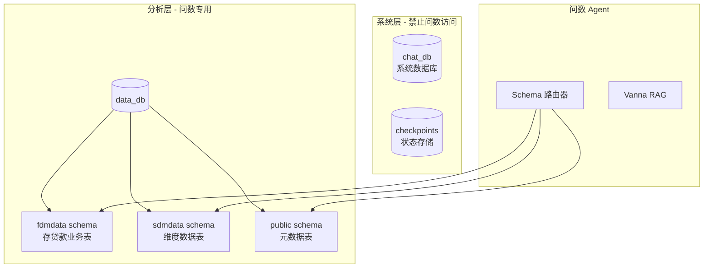

**数据库职责**：

| 数据库 | Schema | 用途 | 问数访问 |
|--------|--------|------|----------|
| `chat_db` | public | 系统数据（用户、聊天、待办） | ❌ 禁止 |
| `checkpoints` | - | LangGraph 状态持久化 | ❌ 禁止 |
| `data_db` | fdmdata | 存贷款等金融业务数据 | ✅ 允许 |
| `data_db` | sdmdata | 日期、机构等维度数据 | ✅ 允许 |
| `data_db` | public | 元数据表（t_meta_*） | ✅ 允许 |

**Schema 路由规则**：
1. **关键词匹配**：用户问题中包含 "存款"、"贷款" → `fdmdata`
2. **表名前缀**：`f_mid_*` → `fdmdata`，`s_ods_*` → `sdmdata`
3. **显式指定**：用户可通过 `@fdmdata` 显式指定 Schema
4. **默认回退**：无法识别时使用 `fdmdata` 作为默认 Schema

> 详细配置说明参见 [数据库设计](./数据库设计.md#多数据库架构)

#### 问数权限控制架构

基于 GitHub 开源项目（Cube.js 语义层、Vanna Tool Registry）的最佳实践，设计三层权限控制体系：

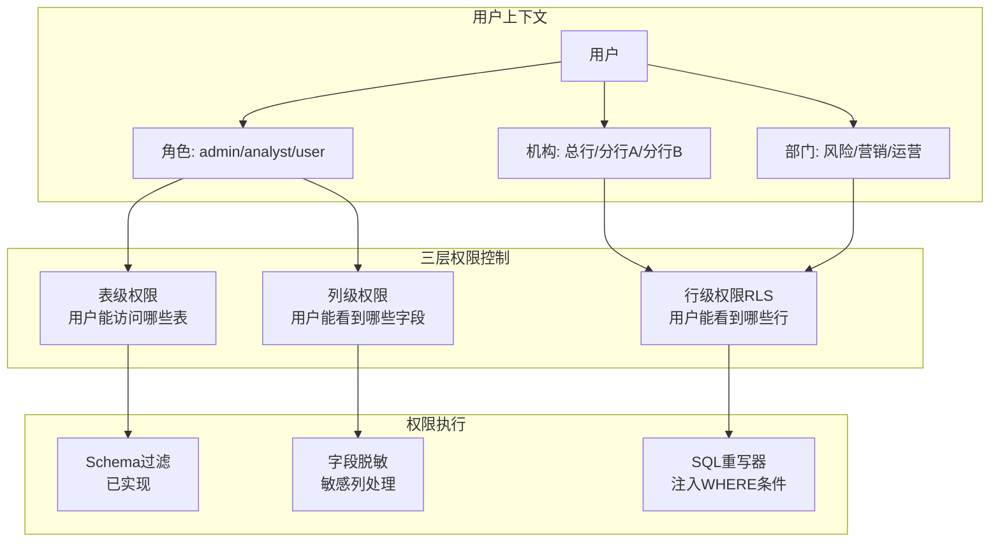

**三层权限模型**：

| 层级 | 控制维度 | 实现方式 | 配置表 |
|------|----------|----------|--------|
| 表级权限 | 用户能访问哪些表 | Schema 白名单 + 表白名单 | `t_data_permission_table` |
| 行级权限 (RLS) | 用户能看到哪些行 | SQL WHERE 条件注入 | `t_data_permission_row` |
| 列级权限 | 敏感字段脱敏 | SELECT 列替换 | `t_data_permission_column` |

**权限上下文**（新文件 `app/ai/utils/permission_context.py`）：

```python
@dataclass
class UserPermissionContext:
    user_id: int
    role: str                    # admin / analyst / user
    org_code: Optional[str]      # 机构代码
    dept_code: Optional[str]     # 部门代码
    allowed_schemas: List[str]   # 允许的 Schema
    allowed_tables: List[str]    # 允许的表（空=全部）
    row_filters: Dict[str, str]  # 行过滤规则 {table: "org_code = 'xxx'"}
    masked_columns: Dict[str, str]  # 脱敏规则 {table.column: "partial"}
```

**SQL 重写器**（新文件 `app/ai/utils/sql_rewriter.py`）：

```python
def rewrite_sql_with_permissions(
    sql: str, 
    user_context: UserPermissionContext
) -> Tuple[str, bool, Optional[str]]:
    """
    1. 检查表级权限（拒绝未授权表）
    2. 注入行级过滤条件（WHERE org_code = 'xxx'）
    3. 替换敏感列为脱敏表达式
    """
    pass
```

**集成到 Data Graph**（`execute_sql` 节点）：

```python
def execute_sql(state: DataAgentState) -> Dict:
    # 1. 获取用户权限上下文
    user_context = get_user_permission_context(state["user_id"])
    
    # 2. SQL 重写（注入权限过滤）
    sql = state["generated_sql"]
    rewritten_sql, is_allowed, error = rewrite_sql_with_permissions(sql, user_context)
    
    if not is_allowed:
        return {"last_error": error}
    
    # 3. 执行重写后的 SQL
    result = execute_query(rewritten_sql)
    return {"sql_result": result}
```

**与现有模块集成**：

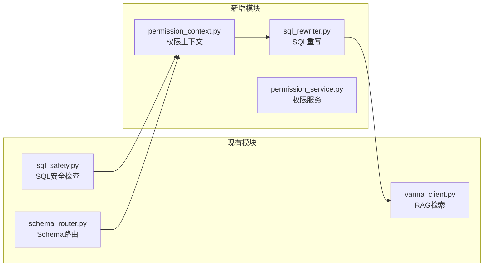

关键集成点：
- **sql_safety.py**：扩展 `SENSITIVE_TABLES` 为动态加载（基于用户角色）
- **schema_router.py**：扩展 `ANALYTICS_SCHEMAS` 为用户级别白名单
- **vanna_client.py**：`get_related_ddl()` 按用户权限过滤可见表

> 权限配置表结构详见 [数据库设计 - 问数权限控制表](./数据库设计.md#问数权限控制表)

#### 新增工具模块

```
app/ai/utils/
├── sql_parser.py      # SQL 解析工具（使用 sqlglot）
│   ├── extract_tables_from_sql()  # 提取表名
│   ├── validate_sql_syntax()      # 语法验证
│   ├── is_select_only()           # 只读检查
│   └── get_query_type()           # 语句类型
└── sql_safety.py      # SQL 安全检查工具
    ├── check_sql_safety()         # 综合安全检查
    ├── check_dangerous_keywords() # 危险操作检测
    ├── check_sensitive_tables()   # 敏感表检测
    ├── add_limit_if_missing()     # 自动添加 LIMIT
    └── sanitize_sql()             # 综合处理
```

#### 错误自愈机制

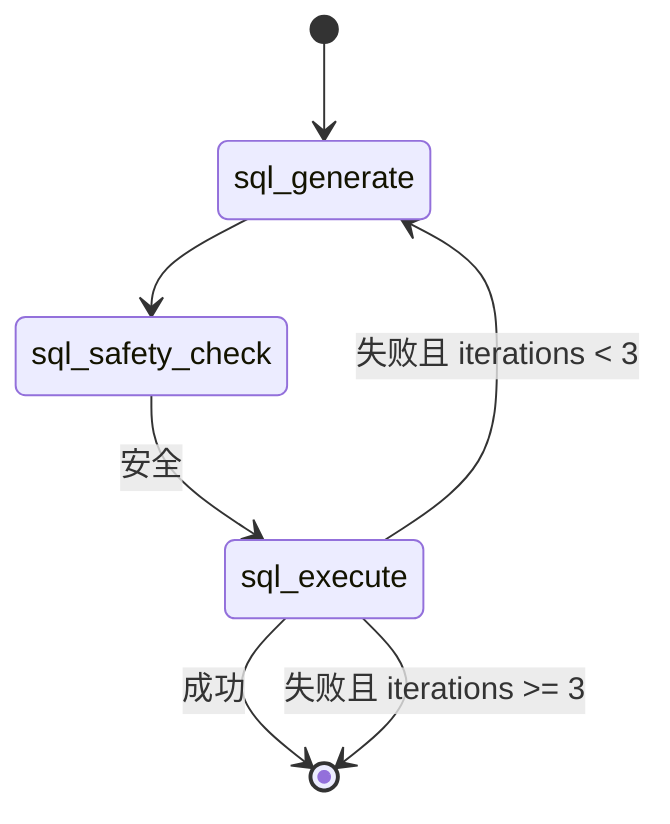

**关键状态字段**（`DataAgentState`）：
- `iterations`: 当前迭代次数
- `last_error`: 最后一次执行错误信息
- `sql_history`: SQL 生成历史 `[{"sql": str, "error": str}]`

#### 向量搜索匹配

```python
# metric_service.py
def match_metric(self, question: str):
    # 优先向量搜索（相似度阈值 0.6）
    result = self._match_metric_by_vector(question)
    if result:
        return result
    # 降级到关键词匹配
    return self._match_metric_by_keyword(question)
```

#### P2 改进：SQL 质量评估

**文件**: `app/ai/utils/sql_evaluator.py`

提供多维度的 SQL 质量评估：

```python
from app.ai.utils.sql_evaluator import evaluate_sql_quality, quick_evaluate

# 快速评估（不调用 LLM）
result = quick_evaluate(sql)
# {"is_valid": True, "warnings": ["缺少 LIMIT"], "complexity": "medium"}

# 完整评估（包含语义检查）
result = await evaluate_sql_quality(
    question="本月存款余额",
    sql="SELECT SUM(balance) FROM deposits",
    ddl_context=["CREATE TABLE deposits ..."]
)
# 返回 SQLEvaluationResult，包含 syntax/semantic/retrieval/performance 评估
```

#### P2 改进：错误提示优化

**文件**: `app/ai/utils/error_handler.py`

提供智能错误分类和用户友好的提示：

| 错误类型 | 用户提示 | 建议 |
|----------|----------|------|
| 表不存在 | 🔍 找不到数据表 | 检查表名、添加 schema 前缀 |
| 列不存在 | 🔍 找不到数据列 | 检查列名拼写 |
| 语法错误 | ⚠️ SQL 语法错误 | 自动重试修正 |
| 权限不足 | 🔒 权限不足 | 联系管理员 |
| 查询超时 | ⏱️ 查询超时 | 添加筛选条件 |

#### P2 改进：可观测性

**文件**: `app/ai/utils/observability.py`

支持多后端的追踪模块，**无需外部 API 也可使用**。

**三种工作模式**：

| 配置 | 使用的 Tracer | 说明 |
|------|---------------|------|
| `ENABLE_OBSERVABILITY=false`（默认） | `NoopTracer` | 零开销，不记录任何追踪 |
| `ENABLE_OBSERVABILITY=true` + 无 Langfuse | `LoggingTracer` | 追踪信息写入应用日志 |
| `ENABLE_OBSERVABILITY=true` + 配置 Langfuse | `LangfuseTracer` | 发送到 Langfuse 平台 |

**生产环境推荐**：使用 `LoggingTracer`（本地日志），无需外部依赖：

```bash
# .env
ENABLE_OBSERVABILITY=true
# 不配置 LANGFUSE_* 变量即可
```

**使用示例**：

```python
from app.ai.utils.observability import trace_node, trace_sql_execution

# 追踪节点执行
with trace_node("sql_generate"):
    # 节点逻辑
    ...

# 追踪 SQL 执行
trace_sql_execution(sql, success=True, duration_ms=150)
```

**完整配置**（如需使用 Langfuse）：

```bash
ENABLE_OBSERVABILITY=true
LANGFUSE_PUBLIC_KEY=pk-...
LANGFUSE_SECRET_KEY=sk-...
LANGFUSE_HOST=https://cloud.langfuse.com  # 可选
```

### 0.1 核心组件详解

#### Vanna RAG 架构

项目使用自定义的 `VannaPGVector` 类（继承 `VannaBase`），基于 PostgreSQL + PGVector 实现 RAG。

**文件**: `app/ai/semantic/vanna_client.py`

```
┌─────────────────────────────────────────────────────────────┐
│                    VannaPGVector                            │
├─────────────────────────────────────────────────────────────┤
│  generate_embedding()      → 使用项目统一 embedding 工具    │
│  get_related_ddl()         → t_meta_tables + t_meta_columns │
│  get_related_documentation()→ t_metric_definition (指标定义)│
│  get_related_question_sql() → t_data_query_log (训练数据)   │
│  submit_prompt()           → 通过 get_llm() 生成 SQL        │
│    接受 model_id / enable_thinking kwargs                    │
└─────────────────────────────────────────────────────────────┘
```

> **2026-02 修复**: `submit_prompt()` 已从自建 `OpenAI` 客户端改为统一使用 `get_llm()`，
> 自动跟随用户的模型选择和思考开关，解决推理模型 token 消耗问题。

**三大检索方法**：

| 方法 | 数据源 | 用途 |
|------|--------|------|
| `get_related_ddl()` | `t_meta_tables` + `t_meta_columns` | 检索相关表结构（DDL），构建完整 CREATE TABLE |
| `get_related_documentation()` | `t_metric_definition` | 检索相关指标定义，提供业务语义 |
| `get_related_question_sql()` | `t_data_query_log` (trained=true) | 检索相似历史问答，Few-shot 示例 |

**完整检索与训练流程**：

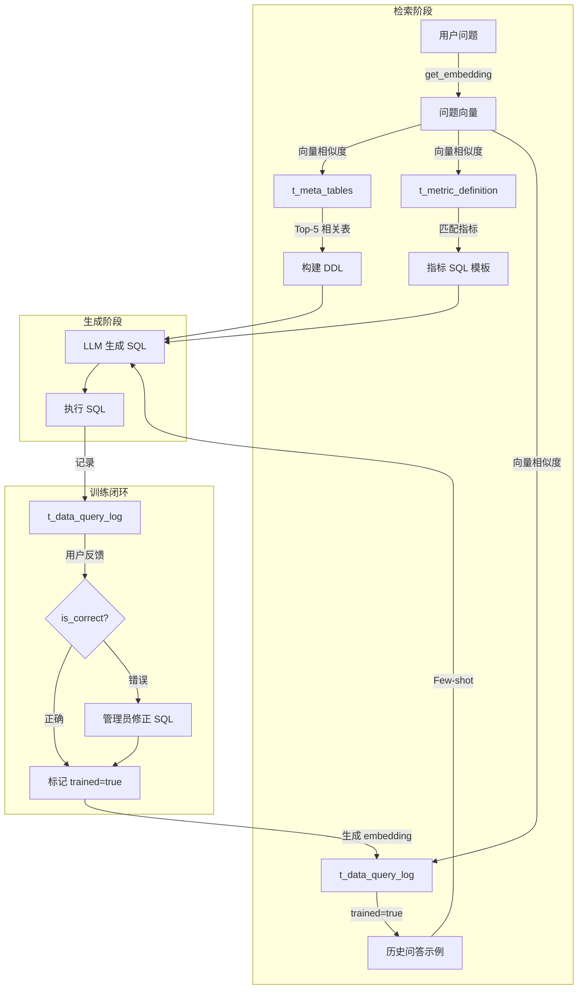

**代码位置**：`app/ai/workflow/data_graph.py` 第 213-219 行

```python
# 检索相关 DDL（传递 schema 参数，缩小检索范围）
ddl_list = vanna.get_related_ddl(question, schema=target_schema)

# 检索相关文档/指标
docs = vanna.get_related_documentation(question)

# 检索历史问答
similar_qs = vanna.get_related_question_sql(question)
```

**DDL 检索流程**：

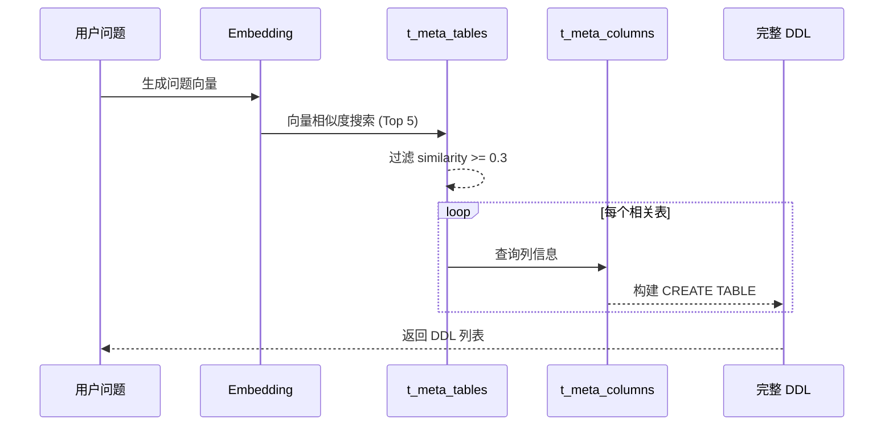

#### 指标体系 (`t_metric_definition`)

指标体系是问数 Agent 的核心知识库，存储业务指标的语义定义和 SQL 模板。

**表结构**：

| 字段 | 类型 | 说明 |
|------|------|------|
| `metric_code` | VARCHAR | 指标代码（主键） |
| `metric_name` | VARCHAR | 指标名称（如"存款余额"） |
| `tags` | VARCHAR | 别名/标签（逗号分隔） |
| `description` | TEXT | 指标定义说明 |
| `formula` | TEXT | SQL 模板（计算逻辑） |
| `category` | VARCHAR | 指标分类 |
| `unit` | VARCHAR | 计量单位 |
| `embedding` | VECTOR(1024) | 语义向量（智谱 embedding-3） |

**匹配策略**：

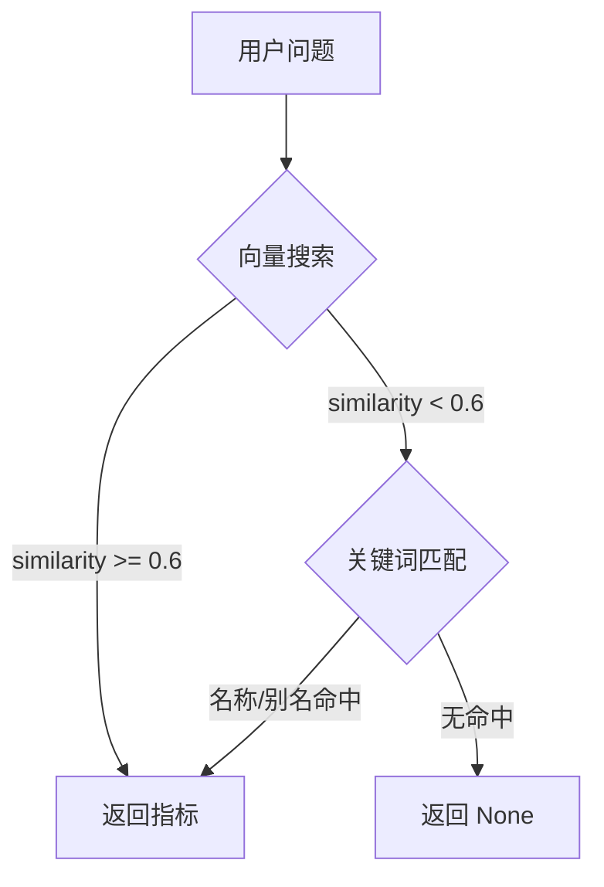

**使用示例**：

```python
from app.services.metric_service import get_metric_service

service = get_metric_service()

# 匹配指标（向量优先 → 关键词降级）
metric = service.match_metric("本月存款余额是多少？")

if metric:
    print(f"匹配到指标: {metric.metric_name}")
    print(f"SQL 模板: {metric.sql_template}")
```

#### 人工训练机制 (`t_data_query_log`)

训练数据表存储历史问答对，支持人工审核标记，用于 Few-shot 学习。

**表结构**：

| 字段 | 类型 | 说明 |
|------|------|------|
| `id` | SERIAL | 主键 |
| `question` | TEXT | 用户原始问题 |
| `generated_sql` | TEXT | 生成/修正后的 SQL |
| `trained` | BOOLEAN | 是否已审核（**人工标记**） |
| `question_embedding` | VECTOR(1024) | 问题向量 |
| `created_at` | TIMESTAMP | 创建时间 |
| `user_feedback` | VARCHAR | 用户反馈（good/bad） |

**训练闭环**：

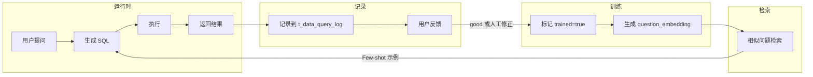

**Few-shot 检索**：

```python
# vanna_client.py
def get_related_question_sql(self, question: str) -> List[Dict]:
    """检索相似历史问答（仅 trained=true）"""
    embedding = self.generate_embedding(question)
    
    sql = """
        SELECT question, generated_sql 
        FROM t_data_query_log 
        WHERE trained = true 
        ORDER BY question_embedding <=> :embedding 
        LIMIT 3
    """
    # 返回 [{"question": "...", "sql": "..."}]
```

**训练数据来源**：

| 来源 | 说明 |
|------|------|
| 用户正向反馈 | 用户对结果满意，标记 `trained=true` |
| 管理员修正 | 管理员修改 SQL 后标记 |
| 批量导入 | 从业务系统导入已验证的问答对 |

### 1. 核心流程

**脚本**: `app/ai/semantic/schema_sync.py`

向量化用于支持 **语义检索 (Semantic Retrieval)**，系统通过向量相似度找到最相关的表结构和指标定义。

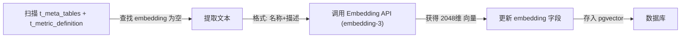

### 2. 向量化策略

- **源表**: `t_meta_tables`（表元数据）+ `t_metric_definition`（指标定义），均在 chat_db 中
- **目标字段**: `embedding` (VECTOR(2048) 类型, 智谱 embedding-3 模型)
- **文本构建**:
  ```python
  # t_meta_tables
  text_content = f"{row.display_name or row.table_name}: {row.description or ''}"
  # t_metric_definition
  text_content = f"指标名称: {row.metric_name}\n定义: {row.description}"
  ```

> **重要**: embedding 模型升级时（如 1024维 -> 2048维），需同步执行：
> 1. ALTER TABLE 修改 embedding 列维度
> 2. 清空旧向量 (`UPDATE ... SET embedding = NULL`)
> 3. 重新运行 `python -m app.ai.semantic.schema_sync`

### 3. 两层漏斗查询策略

Data Agent 采用两层漏斗模型处理用户查询：

```
用户问题 → 第一层：指标匹配 → 第二层：AI 自由生成
              │                    │
           成功 → sql_template   成功 → AI 生成 SQL
              │                    │
           表检查                表检查
              │                    │
           缺表 → 返回错误      缺表 → 返回错误
              │                    │
           执行 SQL             执行 SQL
```

#### 第一层：指标匹配

1. **用户提问**: "本月存款余额是多少？"
2. **关键词匹配**: 在 `t_metric_definition` 中搜索 `metric_name` 和 `aliases`
3. **匹配成功**: 获取指标的 `sql_template`
4. **表可用性检查**: 提取 SQL 中的表名，验证是否存在于 `data_db`
5. **执行或报错**: 表存在则执行，缺表则返回友好提示

#### 第二层：AI 自由生成

1. **无指标匹配**: 调用 Vanna 生成 SQL
2. **表可用性检查**: 同上
3. **执行或报错**: 同上

#### 相关模块

| 模块 | 路径 | 职责 |
|-----|------|------|
| `MetricService` | `app/services/metric_service.py` | 指标匹配、表检查 |
| `semantic_query` | `app/ai/tools/data_query_tools.py` | 两层漏斗入口 |
| `t_metric_definition` | `chat_db` | 指标定义表 |

### 4. 知识库优化 (人工反馈闭环)

为了不断提升 SQL 生成的准确率，系统设计了"人工反馈 + 持续训练"的闭环机制。

#### 优化流程

1.  **收集反馈**: 记录用户的查询及满意的 SQL（或管理员手动修正的 SQL）。
2.  **训练 (Train)**: 将 `(Question, SQL)` 对存入 Vanna 向量数据库。
    ```python
    # 核心 API
    vanna.train(question="...", sql="...")
    ```
3.  **生效**: Vanna 会自动计算 embedding 并存入 `chromadb`。下次遇到相似问题时，会优先召回这优化的 SQL 样本作为上下文（Few-shot Learning）。

#### 两种优化路径

| 场景 | 方法 | 适用性 |
|-----|------|-------|
| **特定长尾问题** | Vanna Training | 将该特例加入向量库，作为 Few-shot 样本。 |
| **高频核心指标** | 指标固化 | 将 SQL作为模板写入 `t_metric_definition`，通过第一层漏斗直接命中。 |

### 5. 维护说明

- **新增指标**: 插入 `t_metric_definition` 时保持 `embedding` 为 NULL。
- **新增表元数据**: 通过 `scripts/schema_sync.py` 从 Analytics DB 导入，或通过管理后台 API。
- **运行向量同步**: 执行 `python -m app.ai.semantic.schema_sync` 自动补充缺失向量。
- **更换 Embedding 模型**: 需同步修改列维度 + 清空旧向量 + 重新同步（详见部署文档）。
- **DDL 检索降级**: 当向量检索不可用时，`vanna_client.py` 会自动降级到关键词匹配。
```

---

## 📝 扩展指南

### 添加新专家 Agent

1. 在 `app/ai/agents/` 创建 `new_agent.py`
2. 在 `AgentType` 枚举中添加类型
3. 在 `AGENT_DESCRIPTIONS` 中添加描述
4. 在 `create_multi_agent_graph()` 中注册节点

### 添加新工具

1. 在 `app/ai/tools/` 创建或修改工具文件
2. 定义 Pydantic Input Schema
3. 使用 `@tool(args_schema=...)` 装饰器
4. 在相应 Agent 的工具列表中注册

### 添加新事件类型

1. 在 `app/ai/events.py` 的 `EventType` 中添加
2. 创建对应的 `emit_xxx` 函数
3. 在 `web/src/hooks/useSSEStream.ts` 中处理
4. 在 `web/src/lib/backend.ts` 的 `StreamCallbacks` 中添加回调

### 问数补充回复继承与少问策略（2026-02）

为解决“第二轮仅补充图表词却再次追问指标+时间”的体验问题，`app/ai/workflow/data_graph.py` 的 `analyze_data_intent` 已增加三层上下文融合与缺项驱动澄清策略：

1. **上下文融合优先级**：当前轮明确输入 > `pending_handoff.task_description` > 历史 state。  
2. **补充型短回复识别（收紧）**：基于“有历史上下文 + 输入长度 + 结构化信号（图表/层级/时间/维度）”综合判定 continuation；若识别到指标切换（如 `贷款余额 -> 存款户数`），强制视为新问题。  
3. **新问题上下文隔离**：命中“新问题信号”时，重置历史继承，避免旧时间/旧维度污染新问题。  
4. **缺项驱动澄清**：仅在关键槽位缺失时追问（指标、时间；图表分布场景补充机构层级）。  
5. **重复澄清保护**：上一轮已问展示方式后，本轮短回复补充不再回退追问“指标+时间”。  
6. **默认口径**：机构分布图表场景未指定层级时，默认按 `分行` 执行，并在 `query_context.used_default_org_level=true` 留痕。  
7. **策略可配置 + 缓存**：意图归一化/图表别名/指标同义词可通过 `t_system_config` 的 `data_graph.intent_policy`（JSON）配置；运行时带 60 秒本地缓存，降低重复读取开销。  
8. **日志增强**：新增 `continuation_reason/context_reset_for_new_query/intent_policy_source/intent_policy_cache_hit` 等排障字段。  

#### 相关状态字段（DataAgentState）

- `last_clarify_slot`: 上一轮澄清槽位（`metric/time_range/display_mode/org_level`）
- `clarify_count`: 当前任务内已澄清次数（用于重复澄清保护）
- `continuation_mode`: 当前轮是否识别为补充型短回复

---

## 问数结果增强规则加载链路（C 方案，2026-02）

### 目标

将 `data_graph.py` 中的结果增强规则由“代码常量主驱动”升级为“数据库配置主驱动 + 常量兜底”，减少新增/调整规则时的发版成本。

### 运行链路

1. `sql_execute` 得到 `rows/columns` 后进入 `_enrich_result_rows_if_needed`。
2. 通过 `ResultEnrichmentRuleService.get_active_rules()` 获取当前生效规则：
   - 优先读进程内缓存（TTL 默认 `120s`）。
   - 缓存过期后从 `chat_db.t_result_enrichment_rule` 刷新。
   - 刷新失败时优先使用旧缓存；若无缓存则回退 `_FALLBACK_RESULT_LOOKUP_ENRICHMENT_RULES`。
3. 逐条规则执行 `_apply_lookup_enrichment_rule`，按 key 列补齐 target 列。
4. 映射值查询始终走 `data_db`（`ANALYTICS_DATABASE_URL`）。
5. 任一规则失败仅记录日志并跳过（Fail-open），不影响主查询结果返回。

### 安全约束

- 规则中的 `source_table` 必须是 `schema.table` 形式。
- `schema` 必须落在 `ANALYTICS_SCHEMAS` 白名单。
- 动态标识符（表名/列名）均做正则校验（`^[a-zA-Z_][a-zA-Z0-9_]*$`）。
- 禁止配置任意 SQL 片段，仅允许“表 + 列”级别参数化。

### 配置开关

- `ENABLE_RESULT_ENRICHMENT`：全局开关，默认 `true`。
- `RESULT_ENRICHMENT_RULE_TTL_SECONDS`：规则缓存 TTL，默认 `120`。

## 跨 Agent 会话意图内核（已实现，2026-02）

> 适用范围：`multi_agent_graph.py`、`data_graph.py`、`todo_graph.py`。  
> 目标：治理“补充回复误判 + 上下文真值分裂 + 重复澄清”三类问题。

### 1. 现状痛点（结构性）

1. **真值源分裂**：同一轮决策同时依赖 `state`、`pending_handoff.task_description`、消息窗口，优先级在各节点实现不一致。
2. **行为判定分裂**：`data_expert` 与 `todo_expert` 各自维护补充/澄清规则，策略难以对齐。
3. **澄清策略分裂**：缺项驱动、重复保护、确认流程分别在不同节点实现，导致边界条件下反复追问。

### 2. 目标架构

#### 2.1 统一决策链

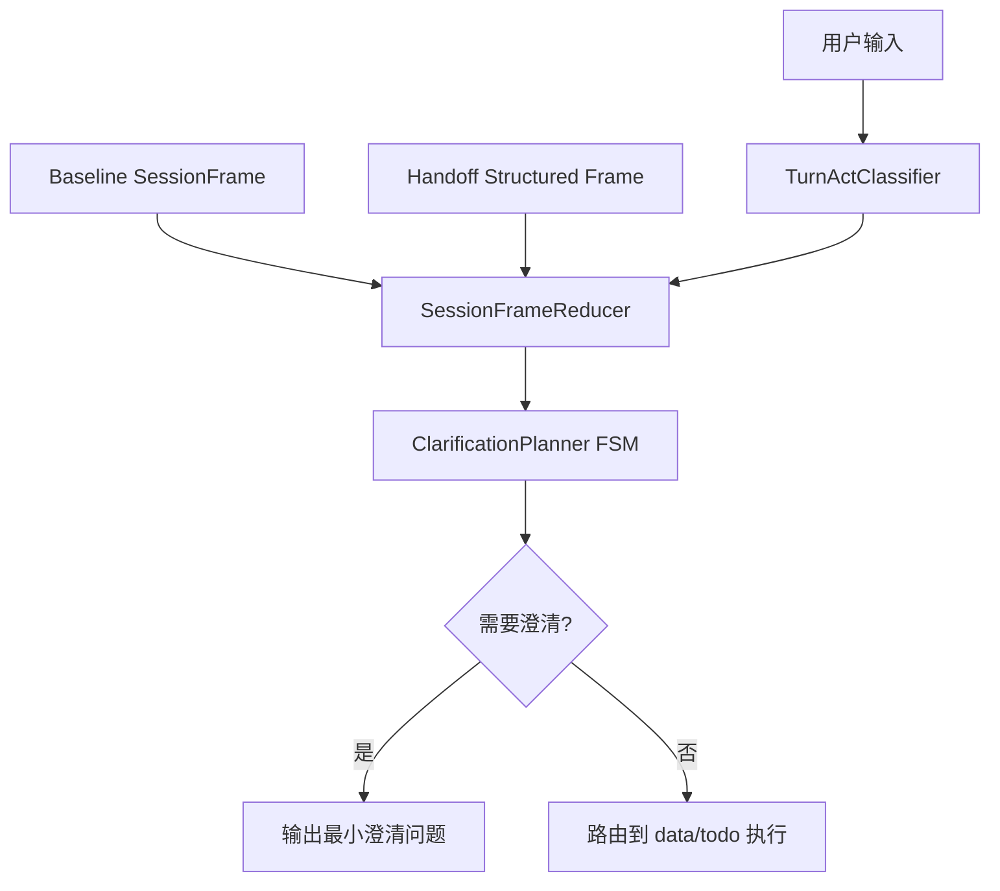

#### 2.2 核心组件职责

- **TurnActClassifier**：统一判断 `NEW_QUERY / SUPPLEMENT / CORRECTION / CONFIRM`。
- **SessionFrameReducer**：统一合并 `current + handoff + state`，输出唯一 `resolved_frame`。
- **ClarificationPlanner FSM**：按缺项驱动最小澄清，并维护防重复策略。

### 3. 状态模型（统一帧）

当前统一内部状态：

- `session_frame`: 当前任务统一帧（含 metric/time/dimensions/org_level/chart_type/todo_action/todo_fields）。
- `turn_act`: 当前轮行为分类。
- `clarify_fsm_state`: `idle | asked_metric | asked_time | asked_org | asked_target | asked_action | done`。
- `clarify_round`: 当前任务澄清轮次。
- `frame_source_map`: 每个槽位来源（current/handoff/state/default）。

### 4. 与现有字段兼容映射

| 现有字段 | 统一帧字段 | 迁移策略 |
|---|---|---|
| `matched_metric` | `session_frame.metric` | 双写一段时间，稳定后下线旧字段读取 |
| `time_range` | `session_frame.time_range` | 同上 |
| `dimensions` | `session_frame.dimensions` | 同上 |
| `viz_type` | `session_frame.chart_type` | 同上 |
| `pending_operation.action` | `session_frame.todo_action` | Todo 先接入 |
| `pending_operation.data` | `session_frame.todo_fields` | Todo 先接入 |
| `pending_handoff.task_description` | `handoff_structured_frame` | 先增量扩展，保留文本兼容 |

### 5. Handoff 协议演进（内部）

当前 `HandoffResult` 已兼容结构化扩展字段：

- 保留：`task_description`（兼容字段）
- 增加：`frame`（结构化槽位）
- 增加：`turn_act_hint`（可选，辅助专家侧判定）

原则：**先加字段，不改旧字段语义**，确保 supervisor 与专家图可以灰度切换。

### 6. 澄清状态机约束

- 仅对关键缺项发起澄清（问数：指标、时间；待办：目标任务、关键动作）。
- 同一任务同一槽位不得重复澄清。
- 当 `turn_act=SUPPLEMENT` 且补齐关键缺项后，禁止回退全量追问。
- 当 `turn_act=NEW_QUERY/CORRECTION` 时，必须清理不兼容继承字段。

### 7. 可观测性与回滚

统一日志字段（已落地/建议持续保留）：
- `turn_act`
- `frame_diff`
- `baseline_source`
- `clarify_reason`
- `clarify_fsm_state`
- `fallback_to_v1`

回滚策略（当前版本）：
- 默认值：会话意图内核 V2 在 `data_graph` 与 `todo_graph` 默认启用（当前无独立 `intent_kernel_v2_enabled` 运行时开关）。
- 运行时可调项：`data_graph.intent_policy`（`t_system_config`）用于策略微调（模式判定/确认词/延续词），读取入口为 `app/ai/workflow/data_graph.py` 的 `_load_data_graph_intent_policy()`。
- 轻量降级：Supervisor 仅透传 `task_description`，不传 `frame/turn_act_hint`，可快速回退到文本 handoff 主导模式（入口：`app/ai/workflow/multi_agent_graph.py` 的 `_create_task_handoff_tool`）。
- 全量回滚：发布层回退到上一稳定版本（恢复 V1 行为），推荐作为生产应急兜底。

### 8. 落地顺序（已执行）

1. 已在 `multi_agent` 层统一 handoff 结构化载荷（兼容旧文本）。
2. 已在 `data_graph` 接入 `SessionFrameReducer + ClarificationPlanner`。
3. 已在 `todo_graph` 接入同一内核，替换分散规则。
4. 已进入双写观测阶段，持续收敛旧 continuation/clarify 分支。


### 9. 实现进展（2026-02-08）

已完成首批代码接入，保持外部 API 不变（`/api/v1/chat/stream` 入参与响应结构不变）：

1. **会话意图内核落地**：新增 `app/ai/workflow/session_intent_kernel.py`，统一提供 `TurnActClassifier`、`SessionFrameReducer`、`Clarification FSM` 基础能力。
2. **Handoff 协议兼容扩展**：`HandoffResult` 新增可选字段 `frame`、`turn_act_hint`，保留 `task_description` 兼容旧链路。
3. **Supervisor 透传结构化上下文**：`multi_agent_graph` handoff 工具可携带 `frame/turn_act_hint`，减少专家侧纯文本解析损耗。
4. **问数 Agent 接入 V2 内核**：`data_graph.analyze_data_intent` 已接入 `turn_act + session_frame + frame_source_map + clarify_fsm_state + clarify_round`，并将 handoff frame 纳入基线判定。
5. **待办 Agent 接入与收敛**：`todo_graph.analyze_intent` 已接入同一内核，并清理重复定义，统一补充轮合并与澄清状态推进。
6. **Handoff 预提取增强**：`todo_intent_helpers.filter_messages_for_todo` 优先消费 `pending_handoff.frame`，`task_description` 仅作为回退。
7. **测试状态**：`tests/unit/test_todo_nodes.py`（含补充轮收敛用例）通过；`data_graph` 相关用例在当前环境受 `vanna.base` 依赖缺失影响，已通过语法编译和代码审查校验。
