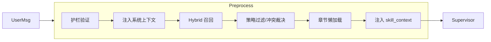

# AI 模块设计：多智能体与状态契约
> 更新时间：2026-03-13

> **用途**: 聚焦 Supervisor 主图、状态模型、路由与运行时 owner 边界。
> **入口说明**: 当前文档为 AI 架构权威源的专题正文；总览与阅读路径见 [AI模块设计](AI模块设计.md)。

## 文档导航
- 总览入口：[AI模块设计.md](AI模块设计.md)
- 多智能体与状态契约：[AI模块设计_多智能体与状态契约.md](AI模块设计_多智能体与状态契约.md)
- 待办协作契约：[AI模块设计_待办协作契约.md](AI模块设计_待办协作契约.md)
- 工具、事件与流式协议：[AI模块设计_工具事件与流式协议.md](AI模块设计_工具事件与流式协议.md)
- 问数语义层与结果增强：[AI模块设计_问数语义层与结果增强.md](AI模块设计_问数语义层与结果增强.md)
- 跨 Agent 意图与运行时契约：[AI模块设计_跨Agent意图与运行时契约.md](AI模块设计_跨Agent意图与运行时契约.md)

---

## 📂 目录结构

```
app/ai/
├── intent/
│   ├── __init__.py           # 运行态意图/goal 解析入口
│   └── goal_resolver.py      # 多意图原子 goal 与 handoff 判定
├── workflow/
│   ├── multi_agent_graph.py   # 多智能体 Supervisor 图
│   ├── exam_generation_workflow.py # AI 出题独立工作流（2026-03 新增）
│   ├── data_graph.py          # 问数专用 StateGraph (2026-02 升级)
│   └── todo_graph.py          # 待办专用 StateGraph (2026-01 重构)
├── agents/
│   ├── knowledge_agent.py     # 知识库专家
│   ├── todo_agent.py          # 待办事项专家 (Prompt 定义)
│   ├── todo_enhanced_nodes.py # 增强节点（澄清/冲突检测/任务拆解）
│   └── summarize_node.py      # 摘要节点
├── tools/
│   ├── todo_tools.py          # 待办工具集
│   ├── chatTools.py           # MCP 数据库工具
│   ├── data_query_tools.py    # 问数查询入口工具
│   ├── file_tools.py          # 文件读取工具（上传文件 + admin 本地 read）
│   ├── vision_tool.py         # 图片分析工具
│   ├── ragflow_tool.py        # 知识库检索工具
│   └── ...
├── skills/                    # 本地技能目录（历史遗留/已退役，非正式主路径）
│   ├── knowledge-search/      # 历史示例
│   ├── sql-expert/            # 历史示例
│   ├── fastapi-expert/        # 历史示例
│   └── ...                    # 仅供历史参考，不参与启动同步
├── prompts/                   # 渐进披露 Prompt 管理
│   ├── agent_prompts.py       # 核心 Prompt
│   ├── prompt_loader.py       # 参考文档加载器
│   └── references/            # 详细参考文档
│       ├── sql_guide.md
│       ├── chart_guide.md
│       └── knowledge_guide.md
├── utils/                      # 工具函数
│   ├── __init__.py
│   ├── state_helpers.py        # 状态辅助函数 (user_id/todo_id 统一获取)
│   ├── image_fixer.py          # 图片链接修复逻辑
│   ├── embedding_util.py       # 嵌入向量生成工具
│   ├── sql_parser.py           # [New] SQL 解析工具（sqlglot）
│   └── sql_safety.py           # [New] SQL 安全检查工具
├── mcp/                       # Model Context Protocol
├── events.py                  # SSE 事件协议
├── guardrails.py              # 护栏系统（输入/输出验证）
├── intent_classifier.py       # 意图识别器
├── parameter_extractor.py     # 参数提取器（借鉴 Flock）
├── llm_judge.py               # LLM as Judge 输出评估
├── llm_util.py                # LLM 实例管理
├── message_utils.py           # 消息处理工具
└── middleware.py              # AI 中间件
├── models/
│   └── agent_skill.py         # [New] 技能数据库模型
├── services/
│   └── skill_service.py       # [New] Skill DB-only 运行时与管理服务
└── scripts/
└── import_skills.py       # 已退役：本地 Skill 导入脚本
```

---

## 🔄 MultiAgentGraph 架构

### Skills RAG 与系统上下文增强 (2026-02)

在进入 Supervisor 之前，预处理节点会：
1. **注入系统上下文**：为所有 Agent 提供当前时间等系统信息。
2. **检索相关技能**：通过 `SkillService` 进行 Hybrid 检索（向量 + 关键词）。
3. **策略过滤与冲突裁决**：执行 `is_enabled/auto_enabled/scope/conflicts_with/priority`。
4. **章节级懒加载**：按查询相关性选择技能章节，控制注入预算。
5. **状态显式回写**：统一写入 `skill_candidates`、`selected_skill_ids`、`skill_context`、`skill_injection_meta`。

> **降级策略**：当 embedding 模型未配置或调用失败时，不阻断主链路，自动回退到关键词召回。

**配置参数（t_system_config）**：

| 参数 | 默认值 | 说明 |
|------|--------|------|
| `skill_similarity_threshold` | 0.55 | 向量基础阈值 |
| `skill.retrieval_mode` | hybrid | 检索模式：`vector/hybrid` |
| `skill.top_k` | 3 | 最多返回技能数量 |
| `skill.context_max_length` | 2400 | skill_context 最大字符预算 |
| `skill.section_max_count` | 2 | 单技能最多注入章节数 |
| `skill.hybrid.candidate_multiplier` | 3 | 候选放大倍数（用于混合召回融合） |
| `skill.hybrid.vector_weight` | 0.65 | Hybrid 向量分权重 |
| `skill.hybrid.lexical_weight` | 0.25 | Hybrid 关键词分权重 |
| `skill.hybrid.trigger_weight` | 0.10 | trigger phrase 加权 |

> **配置读取约定（2026-02）**：Skill 检索参数统一通过 `app/services/config_resolver.py` 读取，优先使用 `t_system_config`，缺失时按契约回退环境变量/默认值，避免业务代码散读环境变量。

> **调试日志**：检索日志会输出 mode/scope/候选分/淘汰原因，便于排查误召回与漏召回。



### 状态定义

**文件**: `app/ai/state.py`

```python
class BaseAgentState(TypedDict, total=False):
"""所有 Agent 共享的基础传输字段。"""
messages: Annotated[list, add_messages]
user_id: int
thread_id: str
enable_thinking: bool
model_id: str


class SupervisorConversationState(TypedDict, total=False):
"""由 supervisor 单写、workflow 只读投影的主会话状态。"""
session_frame: Dict
turn_act: Literal["NEW_QUERY", "SUPPLEMENT", "CORRECTION", "CONFIRM", "UNKNOWN"]
clarify_fsm_state: str
clarify_round: int
frame_source_map: Dict


class RoutingTransientState(TypedDict, total=False):
"""由 supervisor 维护的路由瞬态。"""
pending_handoff: Dict
handoff_queue: List[Dict]
completed_handoffs: List[Dict]
handoff_execution_trace: List[Dict]
multi_intent_mode: bool


class TodoAnchorState(TypedDict, total=False):
"""供 supervisor/todo 共享的待办锚点。"""
current_todo_id: int


class TodoWorkflowState(TypedDict, total=False):
"""仅由 todo workflow 维护的局部流程状态。"""
pending_operation: Dict
user_confirmed: bool
pending_clarifications: List[str]
draft_todos: List[Dict]


class DataWorkflowState(TypedDict, total=False):
"""仅由 data workflow 维护的局部分析状态。"""
query_context: Dict
generated_sql: str
pending_sql: str
sql_approved: bool
sql_history: List[Dict]
```

说明：
- `BaseAgentState` 只保留真正跨所有 Agent 的基础字段，不再承载带 owner 的业务状态。
- `SupervisorConversationState` 代表主会话真理源；`todo/data` 在当前阶段可读取其投影，但 owner 仍然是 `supervisor`。
- `RoutingTransientState` 单独抽出，表达“这是一份共享可读但由 supervisor 维护的运行中瞬态”，避免继续误判为 workflow local state。
- `TodoAnchorState` 只表达前端选中待办锚点，不把它继续混进通用基类。
- `TodoWorkflowState` / `DataWorkflowState` 只承载各自闭环所需局部状态，为后续 `contract-first` 收口留出明确落点。

### 状态生命周期管理 (2026-02)

> [!IMPORTANT]
> LangGraph checkpoint 会持久化所有状态字段。为避免跨轮次状态污染，需明确区分**持久化状态**和**瞬态状态**。

#### 状态分类

| 类型 | 字段 | 说明 |
|------|------|------|
| **基础持久化状态** | `messages`, `user_id`, `thread_id`, `model_id`, `enable_thinking` | 所有 Agent 共用的基础上下文 |
| **主会话状态（supervisor owner）** | `session_frame`, `turn_act`, `clarify_fsm_state`, `clarify_round`, `frame_source_map` | 主会话连续性真理源；workflow 当前可读但不可主导 |
| **路由瞬态（supervisor owner）** | `pending_handoff`, `handoff_queue`, `completed_handoffs`, `handoff_execution_trace`, `multi_intent_mode` | 单轮编排控制面状态，统一由 supervisor 维护与清理 |
| **todo 锚点与局部状态（todo owner）** | `current_todo_id`, `pending_operation`, `user_confirmed`, `quick_mode`, `pending_clarifications`, `draft_todos`, `response_message` | `current_todo_id` 作为待办锚点投影，其余字段只服务待办确认/澄清/执行闭环 |
| **data 局部状态（data owner）** | `query_context`, `generated_sql`, `pending_sql`, `sql_approved`, `clarification_needed`, `sql_history` | 仅服务问数澄清/生成/执行闭环 |
| **其余运行态瞬态** | `evaluation`, `evaluation_route`, `iteration_count`, `detected_intent`, `intent_route`, `attachment_manifest`, `lightweight_probe`, `attachment_planning`, `skill_context`, `loaded_skill_registry` 等 | 仅在当前轮有效，由出口统一清理 |

#### 清理机制

**位置**: `_postprocess` 函数（Graph 唯一出口）

**设计原则**: 出口清理，符合"资源在哪里分配就在哪里释放"原则。

```python
def _postprocess(state: MultiAgentState) -> dict:
# ... 保存对话、清理 DataFrame 缓存 ...

# 统一清理临时状态字段，确保下一轮从干净状态开始
return {
    # 委派控制
    "pending_handoff": None,
    "handoff_queue": [],
    "completed_handoffs": [],
    "handoff_execution_trace": [],
    "multi_intent_mode": False,
    # 操作状态
    "pending_operation": None,
    "user_confirmed": None,
    "quick_mode": None,
    # 评估状态
    "evaluation": None,
    "evaluation_route": "postprocess",
    "iteration_count": 0,
    # 意图识别
    "detected_intent": None,
    "intent_route": None,
    # 预处理结果
    "skill_candidates": [],
    "selected_skill_ids": [],
    "skill_context": None,
    "skill_injection_meta": None,
}
```

#### 为什么不用 LangGraph 原生方案

LangGraph 目前（2025 年）不支持将特定字段标记为"瞬态"（不持久化到 checkpoint）。社区讨论了以下替代方案，但各有局限：

| 方案 | 说明 | 局限 |
|------|------|------|
| 通过 `config` 传递 | 瞬态数据不放入 state | 需要改变所有节点的状态访问方式，改动巨大 |
| Input/Output 分离 | 定义不同的 input/output schema | checkpoint 仍会保存所有字段 |
| `entrypoint.final()` | 明确指定保存值 | 仅适用于 Functional API |

**当前方案**（postprocess 清理）是最务实的选择：改动小、效果等价、未来可平滑迁移。

> 更多背景：参考 LangGraph [Discussion #3192](https://github.com/langchain-ai/langgraph/discussions/3192)
>
> 补充约束（2026-03-10 / 2026-03-11）：`messages` 进入 checkpoint 前，必须先经过消息契约层清洗；对 `type=text/output_text/refusal` 且缺少可读正文的 assistant block 直接丢弃。若旧 checkpoint 已残留脏块，所有“真正进模型前”的恢复入口也必须再次调用同一清洗契约，因为 `add_messages` reducer 默认 append-only，不能靠 preprocess 的返回值删除历史坏块。

### 应用级运行时 owner 收口（2026-03-10）

1. `FastAPI lifespan` 现在只负责编排；应用级共享资源统一挂到 `AppRuntime + CacheRegistry`。
2. 已收口的共享 owner 包括：DB runtime、asset service、graph provider、permission service、result enrichment rule service、run control service、metric service。
3. `service` 层允许保留 `get_xxx_service()` 这类**薄入口**，但入口本身不能再持有模块级 singleton 状态。
4. `chat_service` / `chat_api` 的 run control 共享实例已改为按需通过 `get_run_control_service()` 获取；`data_query_tools` 的 `MetricService` 共享实例已改为按需通过 `get_metric_service()` 获取。
5. 当前仍属于 `Phase 4` 持续收口，不新开 `Phase 5/6`；下一批重点是 `postgres_checkpoint` 与 `observability tracer` 这两处“runtime 已编排、owner 仍在模块全局”的半收口项。

### 中断/终止/断流的会话语义（2026-03-07）

> [!IMPORTANT]
> 交互规则与按钮语义以《聊天系统需求》为准；本节仅保留会影响实现的底层约束。

1. **当前轮判定**：`messages` 属于 checkpoint 持久化状态；运行时只从最近一条 `HumanMessage` 开始切片，旧消息只作为上下文。
2. **中间消息语义**：`interrupt` 场景下，若已经产出部分 AI 内容，可保存为 `is_intermediate=true` 的中间消息；历史查询默认过滤，避免把半成品当最终答复。
3. **状态清理边界**：`pending_handoff`、`pending_operation`、`handoff_queue` 等瞬态状态仅在 `postprocess` 统一清理；因此 `interrupt` 后若跳过控制面直接发送新消息，存在把新输入解释为补充/确认的风险。
4. **控制面分离**：恢复旧流程只能通过 `/chat/resume`，终止旧流程只能通过 `/runs/{run_id}/cancel`；不要在工作流内部依赖自然语言“继续”来恢复旧 run。

### 核心节点（简化架构）

| 节点 | 函数 | 职责 |
|------|------|------|
| `preprocess` | `_preprocess_multimodal` | 验证消息、做附件 planning、护栏验证，并承接显式复合问题 fast lane（goals 预编译 / 事实预取 / 直达 `data_expert`） |
| `intent_classify` | `_classify_intent` | 🆕 意图识别，决定路由目标 |
| `supervisor` | Supervisor Agent | 理解意图、维护主会话状态、选择 `direct_tool/data_workflow/research_subagent/todo_workflow/mixed` |
| `data_expert` | Data Workflow Node | 承接 `data_workflow`，消费 supervisor 投影与 handoff contract，执行确定性数据分析闭环 |
| `todo_expert` | Todo Workflow Node | 承接 `todo_workflow`，消费 supervisor 投影与 handoff contract，执行待办确认闭环 |
| `evaluate` | `_evaluate_expert_work` | 评估任务完成度 |
| `postprocess` | `_postprocess` | 保存对话、清理缓存 |

### 能力分层（2026-03-10）

| 层级 | 当前落点 | 是否持有跨轮 state | 责任边界 |
|------|----------|-------------------|----------|
| `service` | `chat_service`、`skill_service` | 否 | 做 API/运行时装配与调用编排，不拥有会话语义 |
| `supervisor` | `multi_agent_graph.supervisor` | 是 | 主会话 `conversation_state` 唯一 owner，统一规划路由与用户可见错误 |
| `workflow` | `todo_workflow`、`data_workflow` | 仅局部 workflow state | 消费 `pending_handoff.frame + expert_input_contract` 完成闭环，不接管主会话 |
| `research_subagent` | `knowledge_research`、`web_research` | 否 | 处理单次研究任务，隔离 scratchpad，返回 `summary + evidence + insufficiency` |
| `tool` | `knowledge_search`、`search_tool`、`read_uploaded_file`、`analyze_image` | 否 | 提供原子能力，由 supervisor/workflow 直接调用 |

说明：
- `data_expert` / `todo_expert` 仍是图内节点名，但能力语义已经收口为 `workflow`，不是通用长生命周期 subagent。
- `mixed` 路由场景下，owner 仍然只能是 `supervisor`；workflow 与 research_subagent 只返回局部结果，不接管主会话。
- `router_result_v2.conversation_state` 是唯一 replay snapshot；禁止再并行维护第二套主会话快照字段。

### 路由机制 (2026-03 contract-first)

Supervisor 通过 **Handoff Tools** 进行路由，运行态统一使用类型安全的 `HandoffResult` 与最小 `expert_input_contract`：

**文件**: `app/ai/protocol.py`

```python
from pydantic import BaseModel, Field

class HandoffResult(BaseModel):
"""标准 Handoff 结果模型（Pydantic 验证）"""
action: str = Field(default="handoff")
target_agent: str = Field(..., description="目标专家 Agent 名称")
task_description: Optional[str] = Field(default=None, description="任务描述与上下文（非 data.query 必填）")
frame: Optional[Dict[str, Any]] = Field(default=None, description="结构化会话帧（可选）")
turn_act_hint: Optional[str] = Field(default=None, description="回合行为提示（可选）")
```

**文件**: `app/ai/workflow/multi_agent_graph.py`

```python
from app.ai.protocol import HandoffResult

def _create_task_handoff_tool(agent_name: str, description: str):
"""创建 Handoff 工具。"""

if agent_name == AgentType.DATA:
    @tool(name=f"assign_to_{agent_name}", description=description)
    def handoff_tool(
        frame: Annotated[Dict[str, Any], "data.query 结构化合同（必填）"],
        turn_act_hint: Annotated[Optional[str], "回合行为提示（可选）"] = None,
    ) -> str:
        result = HandoffResult(target_agent=agent_name, frame=frame, turn_act_hint=turn_act_hint)
        return result.model_dump_json(ensure_ascii=False, exclude_none=True)
    return handoff_tool

@tool(name=f"assign_to_{agent_name}", description=description)
def handoff_tool(
    task_description: Annotated[str, "详细描述下一个专家需要完成的任务"],
    frame: Annotated[Optional[Dict[str, Any]], "结构化上下文（可选）"] = None,
    turn_act_hint: Annotated[Optional[str], "回合行为提示（可选）"] = None,
) -> str:
    result = HandoffResult(
        target_agent=agent_name,
        task_description=task_description,
        frame=frame,
        turn_act_hint=turn_act_hint,
    )
    return result.model_dump_json(ensure_ascii=False, exclude_none=True)
```

**Wrapper 层检测**（`streaming_wrapper` 中的 `on_tool_end` 处理）:

```python
from app.ai.protocol import AgentOutputParser

handoff_result = AgentOutputParser.parse_handoff_typed(tool_output)
if handoff_result:
return {"pending_handoff": handoff_result.model_dump()}
```

> [!NOTE]
> 运行态已从“文本委派”收口为“frame + contract first”。其中 `task_description` 只保留给 todo/研究类任务做人类可读补充，`data.query` 一律以结构化 `frame` 为准。

---
