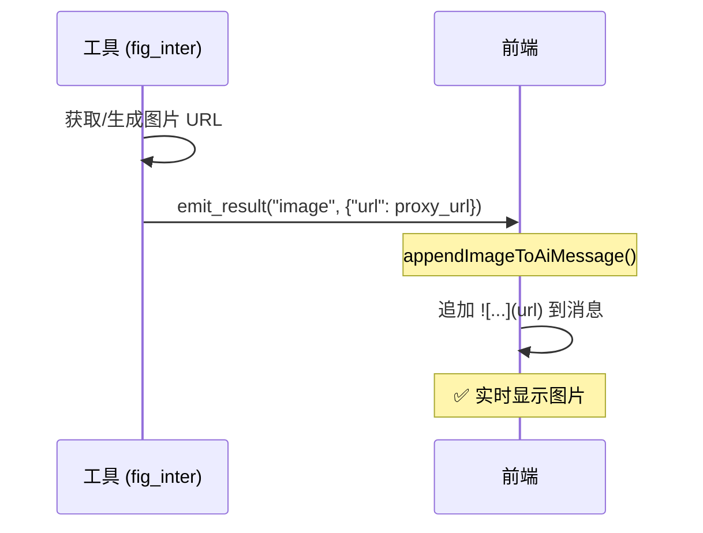
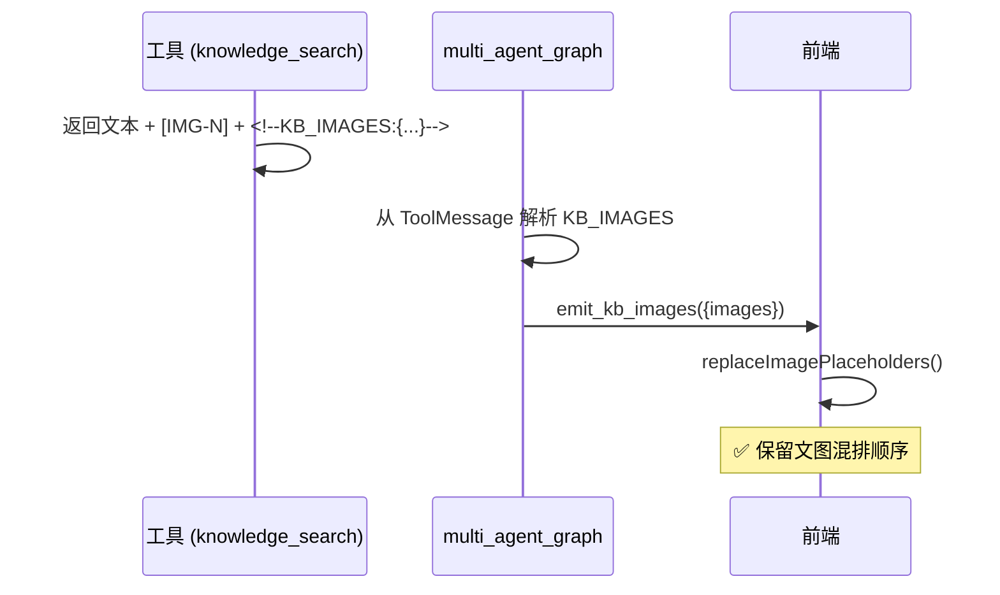
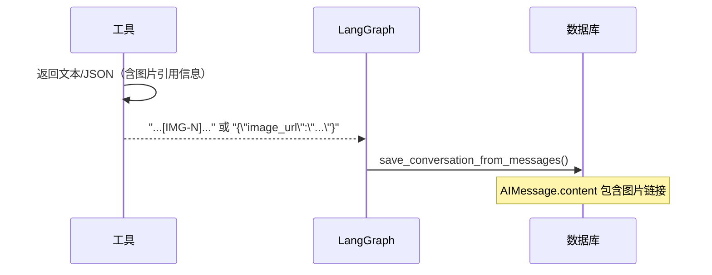

# AI 模块设计：工具、事件与流式协议
> 更新时间：2026-03-13

> **用途**: 聚焦工具体系、SSE/Custom 事件、消息处理、图片流式链路与相关 LLM 调用约定。
> **入口说明**: 当前文档为 AI 架构权威源的专题正文；总览与阅读路径见 [AI模块设计](AI模块设计.md)。

## 文档导航
- 总览入口：[AI模块设计.md](AI模块设计.md)
- 多智能体与状态契约：[AI模块设计_多智能体与状态契约.md](AI模块设计_多智能体与状态契约.md)
- 待办协作契约：[AI模块设计_待办协作契约.md](AI模块设计_待办协作契约.md)
- 工具、事件与流式协议：[AI模块设计_工具事件与流式协议.md](AI模块设计_工具事件与流式协议.md)
- 问数语义层与结果增强：[AI模块设计_问数语义层与结果增强.md](AI模块设计_问数语义层与结果增强.md)
- 跨 Agent 意图与运行时契约：[AI模块设计_跨Agent意图与运行时契约.md](AI模块设计_跨Agent意图与运行时契约.md)

---

## 🛠️ Tools 详解

### Todo Tools

> **详细说明**: [待办Agent设计 - 工具函数](./待办Agent设计.md#6-工具函数)

**文件**: `app/ai/tools/todo_tools.py`

| 工具 | 用途 |
|------|------|
| `add_todo` | 创建待办 |
| `list_todos` | 查询待办 (支持多维度过滤) |
| `update_todo` | 更新待办 |
| `update_progress` | 更新进度 (自动联动状态) |
| `complete_todo` | 标记完成 |
| `delete_todo` | 软删除 |

### File Tools（2026-02）

**文件**: `app/ai/tools/file_tools.py`

| 工具 | 用途 | 权限与约束 |
|------|------|------------|
| `read_uploaded_file` | 读取 MinIO 已上传附件（Excel/CSV/JSON/TXT/PDF） | 沿用既有行为，兼容历史流程 |
| `read` | 读取仓库内本地文本文件，支持 `path/file_path` + `offset/limit` 分页 | 仅 `admin` 可调用；通过 `RunnableConfig.configurable.user_id` 查询 `t_user.role` 判定 |

`read` 工具安全边界：
- 仅允许访问 FastAPI 仓库根目录内文件（防越界/路径穿越，含符号链接解析后的真实路径）。
- 默认按文本读取，二进制或不支持类型返回友好错误，不抛异常。
- 输出限制与 OpenClaw 风格对齐：最多 2000 行或 50KB（先到先截断），并返回 `next_offset` 用于续读。
- 已在 `multi_agent_graph._get_common_tools()` 注册，Supervisor 可直接调用。

### 工具治理运行时过滤（2026-02-27）

**代码锚点**：`app/ai/workflow/multi_agent_graph.py`

当前多智能体工具装配分两层：

1. 构建候选工具条目（工具对象 + 分组标签，如 `group:file` / `group:web`）。
2. 若 `tool_governance.enabled=true`，按 `ConfigResolver` 读取的策略执行过滤，再绑定到 `create_react_agent`。

策略来源：

- 全局策略：`tool_governance.policy.global`
- Agent 策略：`tool_governance.policy.agent.supervisor`（或其他 agent 名）
- 合并规则：全局 + Agent 递归合并（列表去重）

匹配规则：

- `allow` / `deny` 支持工具名与 `group:*`。
- `deny` 优先级高于 `allow`。
- 当 `allow` 为空时，默认行为由 `tool_governance.fail_mode` 决定：
  - `compat/allow`：默认放行；
  - `deny/minimal`：默认收紧，仅放行显式允许项。

---

## 📡 事件系统

### 事件发送方式

**文件**: `app/ai/events.py`

```python
from langgraph.config import get_stream_writer
from app.ai.events import emit_status, emit_result

def my_node(state):
writer = get_stream_writer()

# 发送状态更新
emit_status(writer, "正在处理...")

# 发送结构化结果
emit_result(writer, "todo_list", {"todos": [...]}, "找到 3 条待办")

return state
```

### 事件函数一览

> [!IMPORTANT]
> 事件定义与载荷字段请以 `docs/开发文档/代码解读/SSE事件协议.md` 为准。本节只保留快速索引。

| 函数 | 事件类型 | 用途 |
|------|----------|------|
| `emit_token` | `token` | AI 文本输出 |
| `emit_thinking` | `thinking` | 思考过程 |
| `emit_status` | `status` | 状态更新（`message + phase`，如 `processing/generating/done`） |
| `emit_result` | `result` | 结构化结果（卡片数据） |
| `emit_confirmation` | `confirmation` | 确认请求 |
| `emit_clarification` | `clarification` | 澄清问题 |
| `emit_error` | `error` | 错误信息 |
| `emit_done` | `done` | 流结束 |

### AgentEvent 模型 (2026-01 新增)

统一的事件模型，用于 `astream_events` 架构：

```python
from app.ai.events import AgentEvent, AgentEventType

# 创建事件
event = AgentEvent.token("你好", node="supervisor")
event = AgentEvent.tool_start("sql_inter", {"query": "..."}, node="data_expert")
event = AgentEvent.handoff("todo_expert", "处理待办任务")

# 转换为 stream 兼容格式
writer(event.to_stream_dict())  # {"type": "token", "data": {"content": "你好"}, "node": "supervisor"}
```

---

## 🔧 LLM 配置

### 获取 LLM 实例

**文件**: `app/ai/llm_util.py`

```python
from app.ai.llm_util import get_scene_llm

# 按调用点场景键获取模型（推荐）
llm = get_scene_llm(scene_key="app.ai.workflow.multi_agent_graph.create_multi_agent_graph")

# 内部分析（禁用流式 + 添加 tag）
llm = get_scene_llm(
scene_key="app.ai.workflow.todo_graph.analyze_intent",
internal=True,
)

# 受控覆盖（仅在明确需要指定模型时）
llm = get_scene_llm(
scene_key="app.ai.semantic.vanna_client.submit_prompt",
model_id=state.get("model_id"),
)
```

### LLM 调用规范

> **2026-02 架构更新**: 统一实行“模型管理与场景治理解耦”，业务侧只允许场景化调用。

**规则**:
1. **业务链路必须通过 `get_scene_llm(scene_key=...)` 调用**，禁止新增裸 `get_llm()` 默认分支。
2. **`scene_key` 必须使用 `模块.函数名`**，例如 `app.ai.workflow.data_graph.analyze_data_intent`。
3. **模型绑定按路由分组治理**：`t_llm_scene` 维护 `scene_key -> route_group`，`t_system_config` 维护 `route_group(config_key) -> model_id`。
4. **启动期强校验**：若任一必需调用点未配置 `t_llm_scene`，服务启动失败（Fail Fast）。
5. **类型兼容校验**：`scene_type` 与 `model_type` 必须满足兼容矩阵（如 text->chat/reasoning）。

### 数据流

```
代码调用点(scene_key)
  -> get_scene_llm(scene_key=...)
  -> LLMSceneService 读取 t_llm_scene 场景缓存
  -> 解析 route_group 对应 t_system_config(config_key) 的 model_id
  -> model_id -> model_code
  -> get_llm(model_id=...) 构建客户端
```

### 模型分类路由表

> **2026-02 更新**: 路由治理采用“调用点场景 + 路由分组 + 配置键”三层映射。

#### 按场景分类

| 场景类型 | 调用点示例（scene_key） | 默认模型来源 | 说明 |
|------|--------|----------|------|
| `text` | `app.ai.workflow.multi_agent_graph.create_multi_agent_graph` | `t_system_config(model_routing.default_chat/lightweight/sql_generation)` | 主对话/意图分析/SQL 生成等文本场景 |
| `vision` | `app.ai.tools.vision_tool.analyze_image` | `t_system_config(vision)` | 图像理解、多模态分析 |
| `video` | `app.ai.tools.video_tool.generate_video_summary` | `t_system_config` 路由键（预留） | 视频理解与摘要（预留） |
| `audio` | `app.ai.tools.audio_tool.transcribe_audio` | `t_system_config` 路由键（预留） | 语音理解与转写（预留） |
| `embedding` | `app.ai.utils.embedding_util.get_embedding` | `t_system_config(embedding)` | 向量化调用 |
| `rerank` | `app.ai.tools.rerank_tool.score_documents` | `t_system_config` 路由键（预留） | 检索重排 |
| `asr` | `app.ai.tools.audio_tool.asr` | `t_system_config` 路由键（预留） | 语音识别 |
| `tts` | `app.ai.tools.audio_tool.tts` | `t_system_config` 路由键（预留） | 语音合成 |

#### 调用场景注册表（开发规范）

**权威注册表**：`app/ai/scene_registry.py`

新增调用点标准步骤：

1. 在 `app/ai/scene_registry.py` 注册 `scene_key / scene_type / scene_name / route_group`。
2. 确认 `t_system_config` 中对应路由键已配置 `model_id`（后台模型路由页维护）。
3. 业务代码调用 `get_scene_llm(scene_key=..., model_id=...)`。
4. 补充单测（场景解析、启动校验、调用约束）并同步更新本文档。

### 中转供应商实验适配（仅开发/测试环境）

> **目标**：支持 OpenAI 兼容但实现不完全一致的中转供应商，同时保证生产链路性能和逻辑不受影响。

**启用条件（全部满足才生效）**：
1. `ENV != prod`
2. `feature.proxy_experiment_enabled=true`（数据库 `t_system_config`）
3. 当前模型 `provider_code` 命中 `feature.proxy_experiment_providers`（数据库白名单）

> 若数据库未配置上述配置项，分别回退 `ENABLE_PROXY_EXPERIMENT` / `PROXY_EXPERIMENT_PROVIDERS` 环境变量。

**配置入口**：
- `t_llm_model.extra_config`（模型级）
- `t_llm_provider.extra_config`（提供商级，可选）

**推荐配置键（示例）**：

```json
{
  "use_responses_api": true,
  "actual_model": "gpt-5.2",
  "send_x_api_key": true,
  "default_headers": {
"User-Agent": "codex-cli/0.98.0"
  },
  "store": false,
  "reasoning_effort": "medium",
  "verbosity": "low"
}
```

### 复合任务串行执行（2026-02-19）

`multi_agent_graph` 在不改现有 Supervisor + Expert 主架构前提下，新增最小串行多意图闭环：

1. Supervisor 当前轮识别到多个 `assign_to_*` 时，按出现顺序写入 `pending_handoff + handoff_queue`。
2. 若当前轮存在“`tavily_search`/`knowledge_search` 直连结果 + 至少一个 `assign_to_*`”，也需开启 `multi_intent_mode`，确保后续进入统一汇总而不是只返回专家末条回复。
3. `evaluate` 每轮消费一个专家结果并记录到 `handoff_execution_trace`，队列未空时直接路由下一个专家，避免提前 `complete`。
4. 队列清空且命中 `multi_intent_mode` 时进入 `summarize` 节点，统一输出天气/知识检索 + 专家执行结论。

**不影响生产的约束**：
- 生产环境默认不启用实验适配分支。
- 非实验 provider 继续走既有 `get_llm()` 逻辑，无额外协议分支。
- 实验逻辑仅在命中条件时读取 `extra_config` 并注入参数，避免全量路径开销。

### 显式复合问题快车道（2026-03-10）

1. 对编号列表、分行等显式多问题输入，`preprocess` 可直接生成 `decomposed_goals`，并优先发出 `plan_ready`，避免所有子问题都先等待 Supervisor 完整往返。
2. 若复合问题同时包含内部数据查询与公开事实查询，`preprocess` 可先预取已能直答的公开事实结果，并直接编译 canonical `pending_handoff` 路由到 `data_expert`。
3. 公开事实查询统一归入 `public_structured_fact` 能力层：它负责识别事实类型、抽取槽位（如地点/日期/指标）、选择对应事实源并返回统一 contract；天气只是其中一个实例，不再作为编排层专用特判继续扩散。
4. 编排层只消费 `decomposed_goals`、`pending_handoff` 与统一 tool payload 做路由和收口，不在 `chat_service`、router/controller 层追加“天气/汇率/股价”等关键词分支。
5. fast lane 只优化首事件与总耗时，不改变最终收口责任：最终用户可见正文仍由 `final_answer` 唯一收敛；若 fast lane 命中失败，回退既有 Supervisor 规划链路。

### 运行态 Goal Resolver 与原子交付（2026-03-12）

`multi_agent_graph` 当前把运行态语义识别收敛到 `app/ai/intent/goal_resolver.py`，避免继续在编排层堆叠关键词分支：

1. `split_composite_query`、`infer_primary_goal_kind`、`resolve_runtime_goal_specs` 负责把天气、知识库、图表、待办、问数拆成原子 goal；运行态交付、coverage 与最终答复统一按 `goal_id` 收口，不再按粗粒度 bucket 猜测“是否答全”。
2. direct tool 与 expert 结果必须一 goal 一 deliverable；`external.lookup` 的天气结果、`knowledge.lookup`、`chart.render`、`todo.query` 彼此独立，图表类 `result(image)` 与最终正文使用同一份 goal 结果，不允许只出卡片不进正文。
3. `todo.query` 默认不携带 Supervisor 的外部 observation；只有 handoff `task_description` 明确表达“结合/参考/汇总/回复用户”等组合语义时，才允许附带结构化 `tool_observations`，避免普通待办查询被天气/知识库摘要污染成 `out_of_scope`。
4. `data.query` handoff 的真理源仍是 `frame.query_text`；当 `frame` 缺失时，只允许从“自身就是 data query 的 `task_description`”补编译，不再从整句用户原问题回填，防止天气等外部子句重新污染问数子任务。

### 意图运行态契约收敛（v2，2026-03-07）

`multi_agent_graph` 已按“规划保留、运行剥离”收敛到单轨运行态合同：

1. **运行态目标源唯一化**：运行阶段只消费 `decomposed_goals`，不再读取 `state.intent_plan`。
2. **运行态委派字段唯一化**：Router Guard 统一以 `handoff.target_agent + frame/task_description` 为入口；其中 `data.query` 的真理源只允许是 canonical `frame.query_text`：已有 `frame.query_text` 时直接复用，缺失时只允许把 `task_description` / 当前轮问句作为编译输入补成 `frame`，禁止继续放行 `frame=null` 或让 `task_description` 与 `frame` 并行承担真理源。
3. **运行态结构化结果唯一化**：仅写入 `additional_kwargs.router_result_v2`（`version=v2`）；其中 `conversation_state` 是唯一 replay snapshot，固定挂在 `router_result_v2.conversation_state`，禁止再增加第二套顶层 replay 字段；历史字段（如 `route_decisions`）命中即 `legacy_field_detected` 并 fail-fast。
4. **planner 输入冻结**：`decompose_goals` 输入固定为 `user_query + recent_5_persisted_user_visible_chat_turns`；窗口仅含已落库 `user/assistant`，`tool/system/内部中间态` 不入窗。
5. **当前输入隔离**：当前轮用户输入仅作为 `user_query`；不计入 recent-5 历史窗口。
6. **异常语义统一**：运行态合同异常统一 `block -> supervisor_fallback`，禁止专家兜底；指代无法消解走 `clarify_needed -> supervisor`。

**当前口径（实现态）**：
- 路由判定：`decompose_goals -> router_guard -> dispatch/blocked`。
- 可观测字段：`event/turn_id/reason/goal_id/target_agent`，以及 `conversation_state.owner/turn_act/active_goal_ids/active_workflow/pending_user_action/session_frame_slots`（均承载于 `router_result_v2`）。
- 收口链路：`coverage_gate -> final_composer`，缺口优先回流 `supervisor`。

### internal 调用输入兼容（2026-02-08）

> **背景**：中转链路接入 `gpt-5.2` 后，历史 `AIMessage.content` 可能为 Responses 风格的 block 列表，包含 `function_call` 块。
> 内部分析节点（`internal=True`）若将该列表直接透传给 Chat Completions 兼容端，可能触发 `400 invalid_value`。

**当前策略**：
- 在 `InternalLLMWrapper.invoke/ainvoke` 内统一执行 `_sanitize_internal_invoke_input`。
- 仅对 `content` 为列表的消息做兼容清洗：
  - 保留 `text` / `content` 文本块
  - 跳过 `function_call` / `tool_call` / `tool_use` / `tool_result` / `function_result` 块
- 清洗后仅用于本次 internal 调用，不修改原始消息对象。

**作用边界**：
- 仅作用于 `get_llm(internal=True, ...)` 的内部分析链路（意图分析、参数抽取等）。
- 不影响主对话流式输出、不影响 Tool Calling 主路径协议。

**生产建议**：
- 当前已提供独立开关 `ENABLE_INTERNAL_CONTENT_SANITIZE`（建议 prod 关闭，按需开启）。
- 当前版本通过“internal 作用域隔离”控制风险，属于兼容性兜底而非主链路能力。

**数据流**:

```
前端模型选择 → API enable_thinking / model_id
→ chat_service 注入 input_state
→ 各节点通过 scene_key 调用 get_scene_llm(...)
→ get_llm(model_id=...) 构建最终客户端
```

### 记忆意图合同链路（2026-03-09）

当前聊天主链路中的记忆写入不再由 `chat_service` 直接使用关键词词表判断，而是统一走：

`chat_service -> memory_intent_resolver_service -> decision_contract -> response_policy_service / document_memory_service`

关键约束：

1. `chat_service` 只负责保存 human 消息、选择同步/异步分支、注入 `memory_context` 与 `response_guidance_contract`。  
2. 语义解析统一下沉到 `memory_intent_resolver_service`，删除/撤销类输入也必须先生成结构化 contract。  
3. 回复策略统一由 `response_policy_service` 渲染，避免数据库状态与回复文案漂移。  
4. `multi_agent_graph` 只消费结构化的 `response_guidance_contract` 与恢复提示，不再内置记忆删除语义词表。

这条链路的直接收益是：记忆识别、数据库状态、系统提示与流式输出口径保持单一真相源，减少 `chat_service` 与 graph 双侧补丁扩散。

---

## 🔍 消息处理

### 消息验证

**文件**: `app/ai/message_utils.py`

```python
from app.ai.message_utils import validate_messages, remove_incomplete_tool_calls

# 验证消息完整性
messages = validate_messages(state["messages"])

# 移除不完整的 tool_calls
messages = remove_incomplete_tool_calls(messages)
```

### 常见消息问题

1. **Tool Call 没有对应的 Tool Message** → 自动补充空响应
2. **DeepSeek reasoning_content 丢失** → 修复 AIMessage 属性
3. **消息格式不一致** → 标准化为 LangChain 格式

---

## 📡 Custom 事件机制 (stream_mode="custom")

> [!TIP]
> 关于 Custom Mode 的核心设计哲学、**双写架构 (Dual Write)** 以及与 State 的关系，请参阅专题文档：[流式通信与状态同步设计](../代码解读/流式通信与状态同步设计.md)

### 核心概念

LangGraph 提供了 `stream_mode="custom"` 模式，允许图中的节点通过 `StreamWriter` 直接向前端发送自定义事件。这是实现实时推送（如图片、状态更新、工具调用）的核心机制。

### 工作原理 (2026-01 重构)

此次重构将原本分散的流式逻辑统一为标准化的事件驱动架构：

```mermaid
graph TD
subgraph Agent Runtime
    LLM[LLM / Tool] --> |astream_events v2| Wrapper[Streaming Wrapper]
    Wrapper --> |封装| Event[AgentEvent]
    Event --> |to_stream_dict| Stream[StreamWriter]
end

subgraph Service Layer
    Stream --> |stream_mode=custom| ChatService[ChatService.stream]
    ChatService --> |收集| Collector[Message Collector (list)]
    ChatService --> |转发| SSE[SSE Response]
end

subgraph Persistence
    Collector --> |流结束/中断| DB_Save[保存到 PostgreSQL]
end

subgraph Frontend
    SSE --> |onToken/onTool| UI[UI 组件]
end
```

### 完整事件类型列表

> [!IMPORTANT]
> 本表用于理解发送链路；若与 `docs/开发文档/代码解读/SSE事件协议.md` 不一致，以协议文档为最终准绳。

| 事件类型 | emit 函数 | AgentEvent 方法 | 用途 | 触发时机 |
|---------|----------|----------------|------|----------|
| `token` | `emit_token` | `AgentEvent.token()` | AI 文本输出 | LLM 生成 token 时 (on_chat_model_stream) |
| `thinking` | `emit_thinking` | `AgentEvent.thinking()` | 思考过程 | 深度思考模式下 |
| `tool_start` | `emit_tool_start` | `AgentEvent.tool_start()` | 工具调用开始 | 检测到 tool_calls 时 (on_tool_start) |
| `tool_end` | `emit_tool_end` | `AgentEvent.tool_end()` | 工具调用结束 | 检测到 ToolMessage 时 (on_tool_end) |
| `status` | `emit_status` | `AgentEvent.status()` | 状态更新 | 长时间操作时 |
| `result` | `emit_result` | - | 结构化结果 | 返回卡片数据时 |
| `confirmation` | `emit_confirmation` | - | 确认请求 | 需要用户确认时 |
| `clarification` | `emit_clarification` | - | 澄清问题 | 需要补充信息时 |
| `handoff` | - | `AgentEvent.handoff()` | 专家切换 | Supervisor 切换专家时 |
| `error` | `emit_error` | `AgentEvent.error()` | 错误 | 发生异常时 |
| `done` | `emit_done` | `AgentEvent.done()` | 流结束（仅生命周期） | 处理完成时 |

> [!IMPORTANT]
> 协议约束（2026-02）：结构化数据仅允许通过 `result` 事件发送，`done` 不再承载 `additional_kwargs`。

### 关键组件

#### 1. 获取 StreamWriter

```python
from langgraph.config import get_stream_writer

def my_tool():
writer = get_stream_writer()  # 获取当前流的 writer
# 使用 writer 发送自定义事件
```

> [!IMPORTANT]  
> `get_stream_writer()` 只能在 LangGraph 流式执行上下文中调用。在普通函数或测试中调用会失败。

#### 2. 事件发送函数 (app/ai/events.py)

```python
# 文本输出
def emit_token(writer, content: str, node: str = ""):
writer({"type": "token", "data": {"content": content}, "node": node})

# 思考过程
def emit_thinking(writer, content: str, node: str = ""):
writer({"type": "thinking", "data": {"content": content}, "node": node})

# 状态更新（结构化阶段）
def emit_status(writer, message: str, node: str = "", phase: str = "processing"):
writer({"type": "status", "data": {"message": message, "phase": phase}, "node": node})

# 工具调用开始
def emit_tool_start(writer, tool_name: str, tool_input: dict = None, node: str = ""):
writer({"type": "tool_start", "data": {"name": tool_name, "input": tool_input or {}}, "node": node})

# 工具调用结束
def emit_tool_end(writer, tool_name: str, output: str = "", node: str = ""):
writer({"type": "tool_end", "data": {"name": tool_name, "output": output}, "node": node})

# 结构化结果（图片、待办列表等）
def emit_result(writer, data_type: str, data: dict, message: str = "", node: str = ""):
writer({
    "type": "result",
    "data": {"data_type": data_type, "data": data, "message": message},
    "node": node
})
```

#### 3. 消息收集与持久化 (Service Layer)

`ChatService` 充当消息收集器 (Message Collector) 的角色。它不仅负责转发 SSE 事件，还负责聚合所有流式 token 以便持久化。

**关键逻辑** (`app/services/chat_service.py`):

```python
async for chunk in graph.astream(input_state, config, stream_mode="custom"):
event_type = chunk.get("type")
event_data = chunk.get("data")

# 1️⃣ 消息收集 (Message Collector)
if event_type == "token":
    content = event_data.get("content", "")
    full_answer.append(content)  # 聚合 token
elif event_type == "thinking":
    thinking_content += event_data.get("content", "")
elif event_type == "result" and event_data.get("message"):
    full_answer.append(event_data["message"])  # 聚合非 token 结果

# 2️⃣ SSE 转发
yield self._format_sse(event_type, event_data)

# 3️⃣ 最终持久化 (流结束)
# 当流正常结束或发生 Interrupt 时，将 full_answer 列表拼接为完整字符串保存
if full_answer:
save_message_to_db(role="ai", content="".join(full_answer))
```

> [!NOTE]
> 这种设计避免了依赖 LangGraph 的 `values` 模式来获取最终状态（`values` 往往只包含整个消息历史，提取最新增量较复杂且容易出错）。

#### 3.1 运行时恢复策略单一真相源（2026-02-28）

为避免 `ChatService` 与 `multi_agent_graph` 重复维护插件降级判定逻辑，运行时恢复策略统一收敛到：

- `app/ai/runtime/recovery_policy.py`

统一约束如下：

1. `ENABLE_RUNTIME_RECOVERY` 与 `ENABLE_PLUGIN_REGISTRY` 的开关读取逻辑只维护一份。
2. 插件故障关键词匹配（`plugin registry` / `plugin init` / `插件注册` 等）只维护一份。
3. `ChatService` 与 `multi_agent_graph` 只消费策略函数，不再各自维护关键词集合与判定分支。
4. 业务文案允许在调用方差异化（例如 supervisor 降级文案与 service 侧文案不同），但触发条件必须一致。
5. 落地接线：`app/services/chat_service.py` 与 `app/ai/workflow/multi_agent_graph.py` 已统一改为调用 `recovery_policy`。

> 目标：减少“改一处漏一处”的分叉，确保 normal/resume/fallback 三条链路行为可预测、可回归。

#### 4. 前端处理 (useSSEStream.ts)

```typescript
const callbacks: StreamCallbacks = {
  onToken: (token) => appendToAiMessage(aiId, token),
  onThinking: (content) => handleThinking(aiId, content),
  onToolStart: (name, input) => addToolCallToMessage(aiId, name, input),
  onToolEnd: (name, output) => console.debug(`工具 ${name} 执行完成`),
  onStatus: (message) => setCurrentStatus(message),  // 🆕 显示在 UI 中
  onResult: (data) => {
if (data.data_type === 'image') {
  appendImageToAiMessage(aiId, data.data.url);
}
// 处理其他类型...
  },
  onDone: () => {
setCurrentStatus(null);  // 清除状态
setIsLoading(false);
  },
};
```

### Agent 包装器中的自动事件发送

**文件**: `app/ai/workflow/multi_agent_graph.py`

Agent 包装器 `_create_streaming_agent_wrapper` 使用 `astream(stream_mode=["messages", "values", "custom"])` 三模式分发循环统一捕获并发送事件：

```python
async def _run_streaming_dispatch_loop(...):
async for mode, chunk in agent.astream(
    pruned_state, config,
    stream_mode=["messages", "values", "custom"],
):
    # 1. messages 模式：token / thinking / tool_end / kb_images
    if mode == "messages":
        _dispatch_messages_mode_chunk(chunk, ...)
        continue

    # 2. custom 模式：子图通过 get_stream_writer() 发送的结构化事件
    #    （如 data_graph 的 emit_result、emit_status 等）
    if mode == "custom":
        if isinstance(chunk, dict) and "type" in chunk and "data" in chunk:
            writer(chunk)
        continue

    # 3. values 模式：handoff 增量返回、tool_start、文本补发
    if mode != "values":
        continue
    _dispatch_values_mode_chunk(chunk, ...)
```

> [!NOTE]
> 2026-02-18 重构：从 `astream_events(version="v2")` 回迁到 `astream(stream_mode=["messages", "values"])`，按子职责拆分为 `_dispatch_messages_mode_chunk` / `_dispatch_values_mode_chunk` 两个 dispatcher。
> 2026-02-25 修复：新增 `"custom"` 模式，使子图（如 `data_graph`）通过 `get_stream_writer()` 发送的 `emit_result` 等 custom events 能冒泡到顶层 `ChatService`，解决实时对话 SQL 结果表格不展示的问题。

### currentStatus UI 显示

**前端组件**: `web/src/components/chat/messages/ai.tsx`

当后端发送 `status` 事件时，前端会显示状态消息：

```tsx
// 获取当前处理状态
const currentStatus = thread.currentStatus;
const statusMessage = currentStatus?.message ?? "";
const shouldAnimateStatus = currentStatus?.phase !== "done";

if (isLoading) {
  return (
<div className="flex flex-col gap-2">
  {statusMessage && (
    <div className={cn("flex items-center gap-2 text-xs text-gray-500", shouldAnimateStatus && "animate-pulse")}>
      <span className={cn("inline-block h-1.5 w-1.5 rounded-full bg-blue-500", shouldAnimateStatus && "animate-ping")}></span>
      {statusMessage}
    </div>
  )}
  {/* 工具调用和内容 */}
  {hasToolCalls && <ToolCalls toolCalls={message.tool_calls} />}
  <MarkdownText>{contentString}</MarkdownText>
</div>
  )
}
```

### 典型使用场景

1. **图片推送** (`fig_inter`, `knowledge_search`)
   ```python
   emit_result(writer, "image", {"url": image_url})
   ```

2. **工具调用** (Agent 包装器自动发送)
   ```python
   emit_tool_start(writer, tool_name, tool_args, node=name)
   emit_tool_end(writer, tool_name, output[:200], node=name)
   ```

3. **状态更新** (长时间操作)
   ```python
   emit_status(writer, "正在分析数据...")
   ```

4. **确认请求** (`todo_tools`)
   ```python
   emit_confirmation(writer, operation_data, message)
   ```

---

## 🖼️ 图片流式传输机制

### 统一的双路径架构

**目标**: 确保所有图片来源（Agent 生成 / 知识库检索）在实时对话和历史加载中 URL 完全一致。

#### 图片来源统一处理

| 来源 | 工具 | 返回值 | 事件推送 |
|------|------|--------|---------|
| Agent 生成 | `fig_inter` | `{"image_url": proxy_url}` | `emit_result("image", {url})` |
| 知识库检索 | `knowledge_search` | 文本含 `[IMG-N]` + `<!--KB_IMAGES:{...}-->` | `emit_kb_images({images})` |

两种来源共享统一的图片 URL 规范（均为代理路径），但实时协议分为两类：
1. **block 图片**（图表生成）: `result.data_type=image` → 前端追加 Markdown 图片
2. **inline 图片**（知识库）: `kb_images` 映射 + `[IMG-N]` 占位符替换

#### 路径 1: 实时流式显示



**实现**:
- 工具调用 `emit_result()` 发送 `result` 事件
- 前端 `onResult` 回调调用 `appendImageToAiMessage()` 追加图片 Markdown
- `appendToAiMessage()` 会过滤重复图片 token（按 URL 去重）

#### 路径 1B: 知识库 inline 混排显示



**实现**:
- `knowledge_search` 只返回占位符，不直接写长 URL 到正文
- Graph 负责把映射透传为 `kb_images` 事件
- 前端渲染阶段按映射替换，保留“文字-图片-文字”顺序

#### 图片位置与时序

> [!IMPORTANT]
> `appendImageToAiMessage` 将图片追加到**当时内容的末尾**，但 LLM 后续输出会让图片被"包裹"在中间。

**fig_inter 时序**（图片被文字包裹）：
```
T0: LLM 输出 "好的，我来画圆形"  → content = "好的，我来画圆形"
T1: 工具执行，生成图片
T2: emit_result() 追加图片       → content = "好的..."
T3: LLM 继续输出 "完成！"        → content = "好的...完成！"
                                          ↑ 图片在中间
```

**knowledge_search 时序**（图片在最前面）：
```
T0: LLM 调用工具                → content = "" (空)
T1: 工具执行，检索知识库
T2: 收到 kb_images 映射          → content 仍含 [IMG-0]
T3: 渲染阶段替换占位符           → content = "......"
                                 ↑ 图片按引用位置内联显示
```

**关键差异**：图表走 `result.image`（block），知识库走 `kb_images + [IMG-N]`（inline）。

#### 路径 2: 数据库持久化



**实现**:
- `fig_inter`: 返回 `{"image_url": url}`, LLM 输出 Markdown 或 `image_fixer` 补充
- `knowledge_search`: 返回 `[IMG-N]` + `KB_IMAGES` 注释，保存前替换成 Markdown
- `save_conversation_from_messages` 统一提取 Tool 消息中的 Markdown/JSON 图片 URL 并补充图表图片

### 去重机制

**问题**: `emit_result` 和工具返回值都包含图片 URL，可能导致重复显示。

**解决**: 三重去重保护

1. **前端追加时检查** (`appendImageToAiMessage`)
   ```typescript
   if (content.includes(imageUrl)) return;
   ```

2. **前端 Token 过滤** (`appendToAiMessage`)
   ```typescript
   const imageRegex = /!\[[^\]]*\]\(([^)]+)\)/g;
   if (existingContent.includes(url)) {
   filteredToken = filteredToken.replace(match[0], "");
   }
   ```

3. **后端数据库保存（差异化处理）** (`save_conversation_from_messages`)

   > [!IMPORTANT]
   > 图片保存策略因来源不同而异

   | 图片来源 | URL 特征 | 保存策略 |
   |---------|---------|---------|
   | `fig_inter` 图表 | 包含 `/charts/` | LLM 未引用时自动补充 |
   | `knowledge_search` 知识库 | 包含 `/proxy/ragflow/` | 只保存 LLM 引用的 |

   ```python
   # 统一提取 Tool 图片来源：Markdown + JSON.image_url
   urls = _extract_tool_image_urls(tool_content)

   # 只补充图表图片，不补充知识库图片
   if "/charts/" in url and url not in ai_content:
   missing_chart_images.append(url)
   ```

### 知识库图片特殊说明

**文件**: `app/ai/tools/ragflow_tool.py`

**占位符分配规则（2026-02-18 更新）**

- 同一轮检索中，按图片 URL 首次出现顺序分配 `[IMG-N]`。
- 若多个 chunk 引用同一 `image_id`，仅首个 chunk 写入 `相关图片: [IMG-N]`，后续 chunk 跳过，避免前端重复渲染同图。

```python
def _format_retrieval_results(chunks: list) -> tuple[str, dict]:
"""格式化检索结果，返回占位符和映射。"""
kb_images = {}
image_url_to_idx = {}
for chunk in chunks:
    image_id = chunk.get("image_id") or chunk.get("img_id")
    if not image_id:
        continue

    image_url = f"/api/v1/assets/proxy/ragflow/{str(image_id).strip()}"
    if image_url not in image_url_to_idx:
        idx = len(image_url_to_idx)
        image_url_to_idx[image_url] = idx
        kb_images[idx] = image_url
        result_text += f"\n   相关图片: [IMG-{idx}]"

if kb_images:
    result_text += f"\n\n<!--KB_IMAGES:{json.dumps(kb_images)}-->"

return result_text, kb_images
```

### 时序图（完整流程）

```mermaid
sequenceDiagram
participant User as 用户
participant Tool as 工具
participant Frontend as 前端
participant DB as 数据库

User->>Tool: 请求（生成图表/搜索知识库）
Tool->>Tool: 获取图片 URL

par 实时路径
    Tool->>Frontend: emit_result("image", {url})
    Frontend->>Frontend: appendImageToAiMessage()
    Note over Frontend: 立即显示图片
and 持久化路径
    Tool->>Tool: 返回包含 Markdown 的文本
    Tool->>DB: postprocess 保存
end

Note over User,DB: 刷新页面后
User->>DB: 加载历史
DB-->>Frontend: AIMessage.content (包含 )

---
