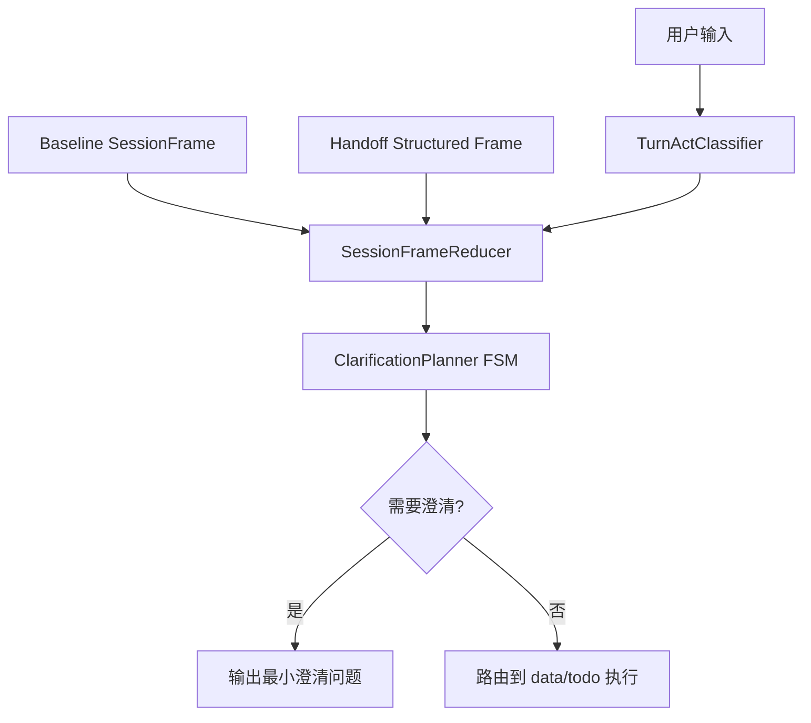

# AI 模块设计：跨 Agent 意图与运行时契约
> 更新时间：2026-03-13

> **用途**: 聚焦统一意图内核、handoff 协议、运行时缺口语义和独立工作流扩展。
> **入口说明**: 当前文档为 AI 架构权威源的专题正文；总览与阅读路径见 [AI模块设计](AI模块设计.md)。

## 文档导航
- 总览入口：[AI模块设计.md](AI模块设计.md)
- 多智能体与状态契约：[AI模块设计_多智能体与状态契约.md](AI模块设计_多智能体与状态契约.md)
- 待办协作契约：[AI模块设计_待办协作契约.md](AI模块设计_待办协作契约.md)
- 工具、事件与流式协议：[AI模块设计_工具事件与流式协议.md](AI模块设计_工具事件与流式协议.md)
- 问数语义层与结果增强：[AI模块设计_问数语义层与结果增强.md](AI模块设计_问数语义层与结果增强.md)
- 跨 Agent 意图与运行时契约：[AI模块设计_跨Agent意图与运行时契约.md](AI模块设计_跨Agent意图与运行时契约.md)

---

## 跨 Agent 会话意图内核

> 适用范围：`multi_agent_graph.py`、`data_graph.py`、`todo_graph.py`。  
> 目标：治理“补充回复误判 + 上下文真值分裂 + 重复澄清”三类问题。

### 1. 现状痛点（结构性）

1. **真值源分裂**：同一轮决策同时依赖 `state`、`pending_handoff.frame.query_text`、消息窗口，优先级在各节点实现不一致。
2. **行为判定分裂**：`data_expert` 与 `todo_expert` 各自维护补充/澄清规则，策略难以对齐。
3. **澄清策略分裂**：缺项驱动、重复保护、确认流程分别在不同节点实现，导致边界条件下反复追问。

### 2. 目标架构

#### 2.1 统一决策链

#### 2.2 核心组件职责

- **TurnActClassifier**：统一判断 `NEW_QUERY / SUPPLEMENT / CORRECTION / CONFIRM`。
- **SessionFrameReducer**：统一合并 `current + handoff + state`，输出唯一 `resolved_frame`。
- **ClarificationPlanner FSM**：按缺项驱动最小澄清，并维护防重复策略。

### 3. 状态模型（统一帧）

当前统一内部状态：

- `session_frame`: 当前任务统一帧（含 metric/time/dimensions/org_level/chart_type/query_shape/ranking/todo_action/todo_fields）。
- `turn_act`: 当前轮行为分类。
- `clarify_fsm_state`: `idle | asked_metric | asked_time | asked_org | asked_target | asked_action | done`。
- `clarify_round`: 当前任务澄清轮次。
- `frame_source_map`: 每个槽位来源（current/handoff/state/default）。

### 4. 与现有字段兼容映射

| 现有字段 | 统一帧字段 | 迁移策略 |
|---|---|---|
| `matched_metric` | `session_frame.metric` | 双写一段时间，稳定后下线旧字段读取 |
| `time_range` | `session_frame.time_range` | 同上 |
| `dimensions` | `session_frame.dimensions` | 同上 |
| `viz_type` | `session_frame.chart_type` | 同上 |
| `pending_operation.action` | `session_frame.todo_action` | Todo 先接入 |
| `pending_operation.data` | `session_frame.todo_fields` | Todo 先接入 |
| `pending_handoff.frame.query_text` | `handoff_structured_frame.query_text` | 已收敛为 data.query 单真源；禁止回退旧文本字段 |

### 5. Handoff 协议演进（内部）

当前 `HandoffResult` 的运行态约束如下：

- `data.query`：必须提供 `frame.query_text`，专家侧只消费 `frame` 真值。
- `todo.query/todo.write`：继续使用 `task_description` 作为文本任务描述，可选补充 `frame`。
- 增加：`turn_act_hint`（可选，辅助专家侧判定）
- 增加：`frame.tool_observations`（可选，Supervisor 工具观测摘要）
- 约束：`data.query` 禁止回退旧文本字段；`task_description` 不再承担 data 子任务语义恢复。

`tool_observations` 约定（2026-02）：
- 产生方：Supervisor（如 `tavily_search` 工具调用后）
- 消费方：TodoExpert（合并到 `description/progress_notes`）
- 推荐结构：`[{"tool":"tavily_search","topic":"web_search","summary":"...","status":"ok"}]`
- 兼容策略：缺失时按旧逻辑处理，不影响原有 handoff

原则：默认“先加字段、不改旧语义”；但**意图路由运行态合同**采用单轨 canonical（`router_result_v2`），不保留旧字段双轨。

### 6. 澄清状态机约束

- 仅对关键缺项发起澄清（问数：指标、时间；待办：目标任务、关键动作）。
- 同一任务同一槽位不得重复澄清。
- 当 `turn_act=SUPPLEMENT` 且补齐关键缺项后，禁止回退全量追问。
- 当 `turn_act=NEW_QUERY/CORRECTION` 时，必须清理不兼容继承字段。

### 7. 可观测性与回滚

统一日志字段（已落地/建议持续保留）：
- `turn_act`
- `frame_diff`
- `baseline_source`
- `clarify_reason`
- `clarify_fsm_state`
- `fallback_to_v1`

回滚策略（当前版本）：
- 默认值：会话意图内核 V2 在 `data_graph` 与 `todo_graph` 默认启用（当前无独立 `intent_kernel_v2_enabled` 运行时开关）。
- 运行时可调项：`data_graph.intent_policy`（`t_system_config`）用于策略微调（模式判定/确认词/延续词），读取入口为 `app/ai/workflow/data_graph.py` 的 `_load_data_graph_intent_policy()`。
- 轻量降级：Supervisor 仅透传 `task_description`，不传 `frame/turn_act_hint`，可快速回退到文本 handoff 主导模式（入口：`app/ai/workflow/multi_agent_graph.py` 的 `_create_task_handoff_tool`）。
- 全量回滚：发布层回退到上一稳定版本（恢复 V1 行为），推荐作为生产应急兜底。

### 7.1 机构与权限执行说明（2026-02-16）

- 机构层级默认策略保持不变：机构图表场景未明确层级时默认 `分行`，并在 `query_context.used_default_org_level=true` 留痕。
- SQL 仍统一经过 `sql_safety_check -> evaluate_sql_policy`：表级、行级、列级权限先于执行生效。
- 当权限重写实际生效（`permission_rewritten=true`）时，`sql_execute` 优先使用 `permission_scope_summary.display_text` 输出具体范围（例如“机构：广州分行（440100）；部门：公司金融部（A012）”），避免只提示“已过滤”但无法判断口径。
- `permission_scope_summary` 由 `evaluate_sql_policy` 基于 `UserPermissionContext` 统一构建并透传到 `query_context` 与 `sql_result.data`，避免在执行层重复拼装权限语义。

### 8. 当前运行时落点

1. `data.query` handoff 只写 `frame + turn_act_hint` 作为运行态真值；`task_description` 不再承担 data 子任务语义恢复。
2. `router_result_v2.conversation_state` 是唯一 replay snapshot，`owner` 固定为 `supervisor`；禁止再增加第二套顶层主会话快照。
3. `data_expert` 的内部推理消息只投影 `pending_handoff.frame.query_text`，并附带 `expert_input_contract(contract_id=data_handoff_query_text, contract_version=v1, state_owner=supervisor)`，避免继续把整句复合问题当专家真理源。
4. `data_graph.analyze_data_intent` 与 `todo_graph.analyze_intent` 统一消费 `turn_act/session_frame/frame_source_map/clarify_fsm_state/clarify_round`，不再各自维护补充轮主判定；workflow 只读投影，不回写主会话 owner。
5. `data_graph` 命中 handoff contract 时，会把 `expert_input_contract` 回填到 `query_context`，`todo_intent_helpers.filter_messages_for_todo` 命中 handoff 时会生成 `__internal_todo_handoff__ + expert_input_contract` 最小输入；两条链路都固定声明 `state_owner=supervisor`。
6. `knowledge_search` / `search_tool` / `read_uploaded_file` / `analyze_image` 仍是 atomic tool；当任务目标变成“多来源研究/对比/证据归纳”时，Supervisor 才切到统一 `research_subagent` 入口，由它在隔离上下文里编排 knowledge/web source provider。
7. `mixed` 路由仍由 `supervisor` 负责汇总与最终答复；workflow 和 research_subagent 只返回局部结果，不拥有主会话最终态。
8. `response_message` 已纳入 `TodoAgentState` 统一管理，避免 `analyze -> clarify` 链路字段丢失；`missing_info` 仅允许 `todo_target/time_range/todo_action` 三类 canonical 槽位。
9. 创建待办确认后若用户先取消再补充细节，且历史会话帧仍表明 `todo_action=create`，系统优先恢复原创建草稿并重新进入 `need_confirm`；确认文案与展示层只消费 canonical 槽位，不再把 UI 文案耦合进状态机决策。
10. 当前对外聊天 API 与 SSE 主协议保持不变，结构收敛集中在 AI 内部状态、handoff 协议、research contract 和确认链路；research 返回合同至少包含 `summary + evidence + insufficiency`，并允许附带 `media_refs` 复用现有图文展示链路。

### 9. 当前架构落点（2026-02-08 起持续生效）

当前稳定口径如下，且保持外部 API 不变（`/api/v1/chat/stream` 入参与响应结构不变）：

1. **会话意图内核落地**：新增 `app/ai/workflow/session_intent_kernel.py`，统一提供 `TurnActClassifier`、`SessionFrameReducer`、`Clarification FSM` 基础能力。
2. **Handoff 协议收敛**：`data.query` 已切到 `goal compiler -> frame + turn_act_hint` 单轨合同；`task_description` 仅保留给 todo / research 类 handoff。
3. **TopN contract 不丢槽**：`frame.query_shape/ranking` 会继续进入 `session_frame/query_context`，并由 SQL 生成直接消费；即使补充轮把问题摘要重写成“查询贷款余额，时间范围...”，也不得丢失 `TopN` 限定。
3. **Supervisor 透传结构化上下文**：`multi_agent_graph` handoff 工具可携带 `frame/turn_act_hint`，减少专家侧纯文本解析损耗。
4. **问数 Agent 接入 V2 内核**：`data_graph.analyze_data_intent` 已接入 `turn_act + session_frame + frame_source_map + clarify_fsm_state + clarify_round`，并将 handoff frame 纳入基线判定。
5. **待办 Agent 接入与收敛**：`todo_graph.analyze_intent` 已接入同一内核，并清理重复定义，统一补充轮合并与澄清状态推进。
6. **Handoff 预提取增强**：`todo_intent_helpers.filter_messages_for_todo` 优先消费 `pending_handoff.frame`，`task_description` 仅作为回退。
7. **测试状态**：`tests/unit/test_todo_nodes.py`（含补充轮收敛用例）通过；`data_graph` 相关用例在当前环境受 `vanna.base` 依赖缺失影响，已通过语法编译和代码审查校验。

### 10. 待办确认补充语义收敛（2026-02-18）

本次针对“确认后补充答非所问”问题，新增以下收敛约束：

1. **状态契约统一**：`response_message` 纳入全局 `TodoAgentState`，避免 `analyze -> clarify` 链路字段丢失。
2. **缺项字段严格契约**：`missing_info` 在模型输出与内部状态中仅允许 `todo_target/time_range/todo_action`，非法值直接丢弃并记录日志。
3. **取消后补充恢复**：当最近轮次存在“创建待办确认 -> 取消”后，用户发送补充语义时，优先尝试恢复最近创建草稿并回到 `need_confirm`，而非误转 `update + target_todo` 追问。
4. **确认话术对齐执行语义**：创建确认文案明确“补充请直接说，放弃请回复取消”，避免“拒绝=补充”的语义冲突。
5. **缺项槽位分层**：保留 `canonical slot` 归一层与用户展示层，状态机仅消费 canonical，展示文案统一由映射函数输出，避免业务逻辑和 UI 文案耦合。

对应实现入口：
- `app/ai/state.py`
- `app/ai/workflow/todo_graph.py`
- `app/ai/prompts/todo_prompts.py`

---

## 运行态缺口可见性收敛（2026-03-08）

### 结论

1. `coverage_gate` 与 `final_composer` 只负责完整性判定与结果收口，不再发 `clarification` 询问用户是否继续补齐。
2. 单目标规划若模型给出 `general.reply`，而规则兜底已能稳定识别为专家型目标（如 `data.query`），则在运行态执行**单目标强语义纠偏**。
3. 用户视图中的工具面板只展示用户可理解的工具；编排型工具调用与结果默认隐藏。

### 规则说明

| 场景 | 旧行为 | 新行为 |
|---|---|---|
| 单目标银行问数被模型判成 `general.reply` | 直接保留 `问题回复` 进入运行态 | 若规则兜底为单目标专家型目标，则提升为更具体目标 |
| coverage 缺口 | `emit_clarification` + “回复继续即可” | 仅输出结果性说明，不再要求用户确认 |
| 编排型工具展示 | 前端直出 `assign_to_* / decompose_goals / load_skills` | 作为内部运行态信息过滤，不进入用户面板 |

### 责任边界

- **planner / reconcile**：决定运行态目标语义，避免过宽泛目标污染后续门禁。
- **coverage gate / router blocked**：只判断是否已覆盖或是否能继续派发，不承担用户交互责任，也不再通过 `system_context` 回灌“继续补齐”提示。
- **clarify 节点**：仅处理真实缺参、真实用户补充信息。
- **presenter/UI**：只渲染脱敏后的用户可见 contract。

- **single-handoff 补口**：当 supervisor 未显式调用 `decompose_goals` 但已产生 handoff 时，必须在 values dispatcher 中补冻结 `decomposed_goals`，确保 router guard / coverage 与 planner 使用同一份活动目标。

## 📝 AI 出题独立工作流（2026-03）

- 本能力不接入现有 `chat/supervisor/multi_agent_graph` 主链。
- 唯一入口为后台管理页 + `/api/v1/exam-admin`。
- 运行链路固定为：`dataset_ids -> evidence retrieval -> paper contract -> quality gate -> pdf export -> history replay`。
- 只复用现有 `RAGFlow` 检索能力、LLM 运行能力与 MinIO 资产存储能力。
- 历史记录 canonical 固定为 `exam_generation_job.result_payload`，禁止复用聊天线程/消息真理源。
