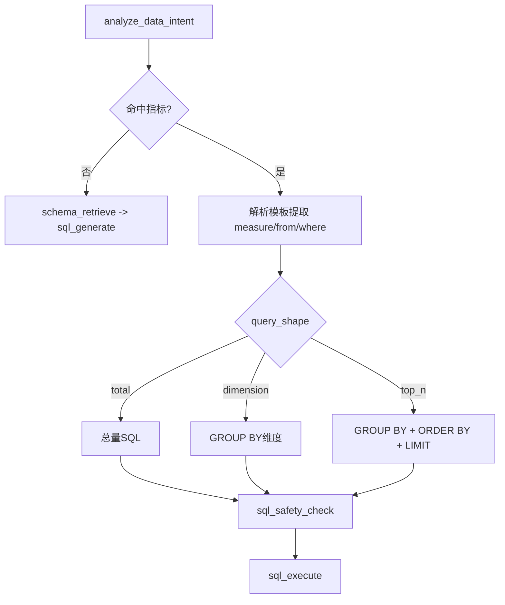
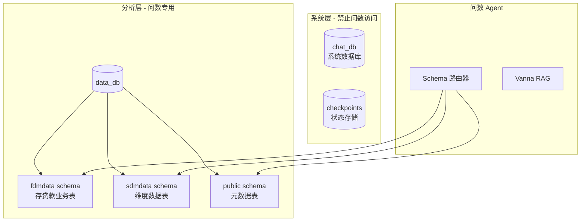
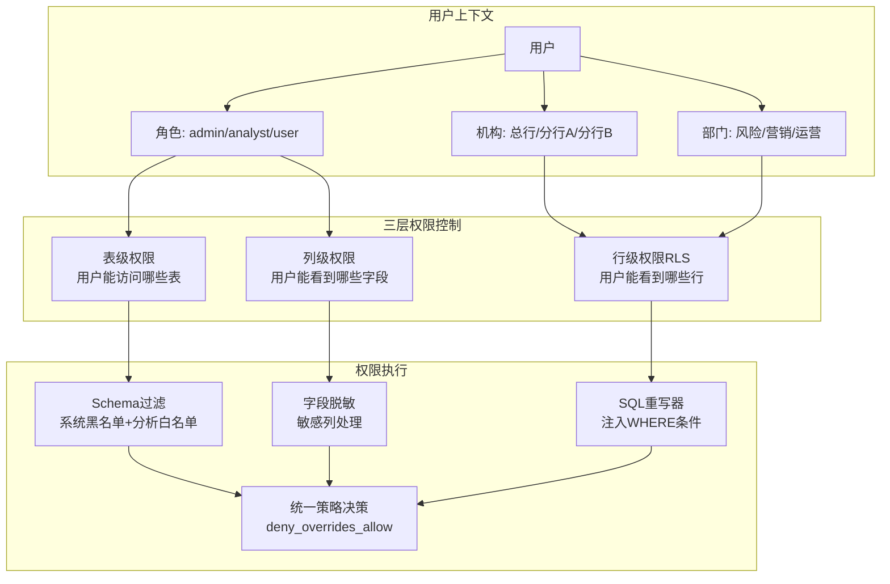
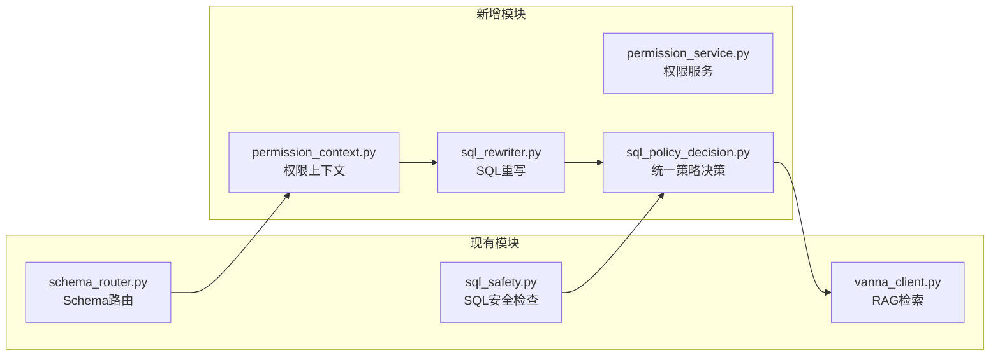
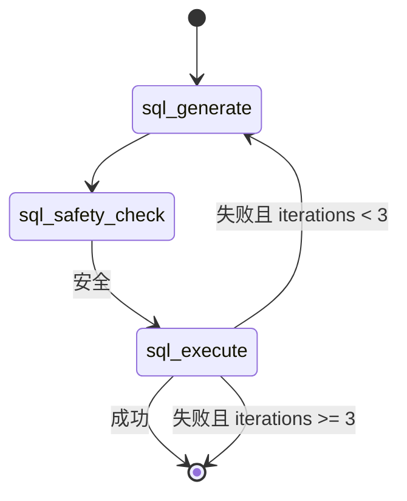
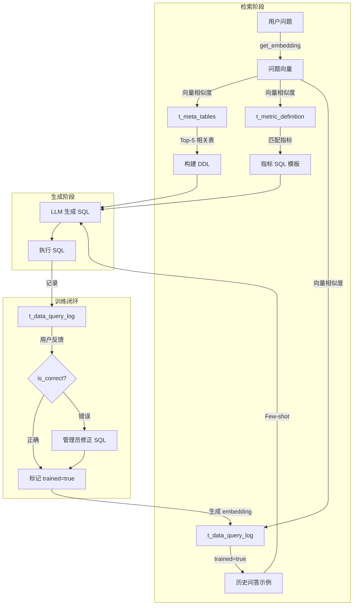
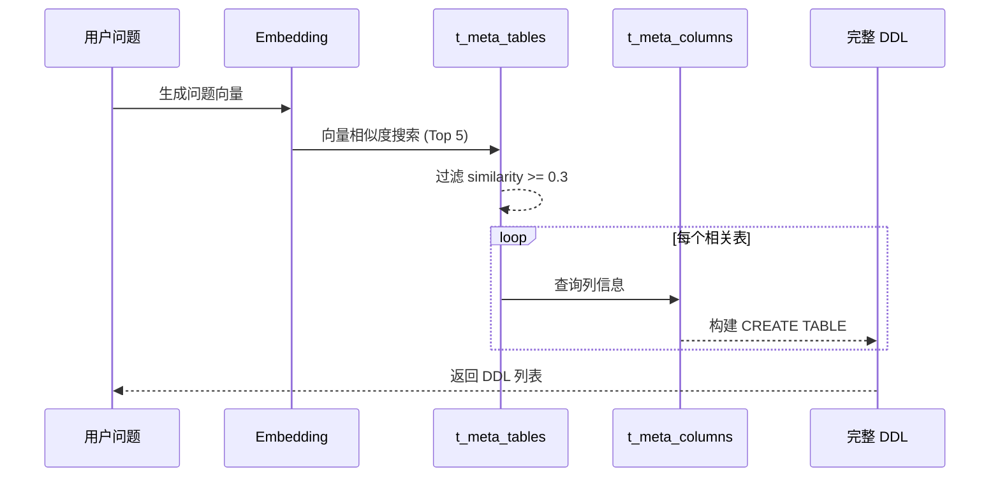
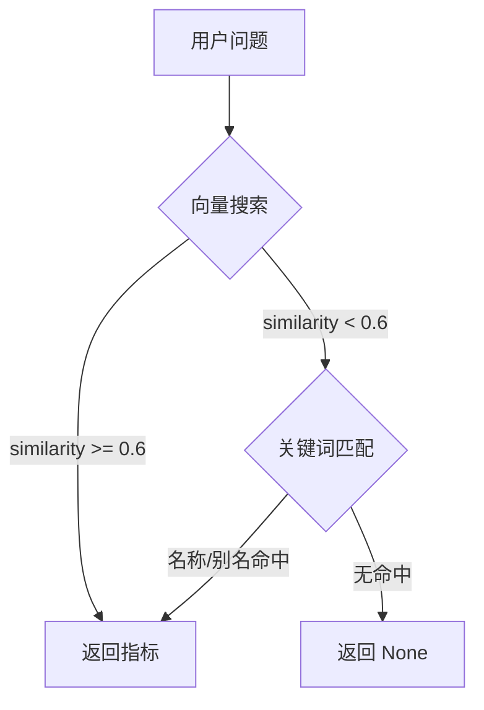
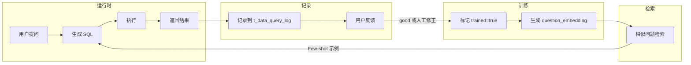
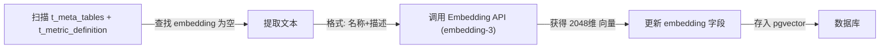

# AI 模块设计：问数语义层与结果增强
> 更新时间：2026-03-13

> **用途**: 聚焦问数 Agent 的语义层、Vanna/RAG、结果增强和数据查询治理。
> **入口说明**: 当前文档为 AI 架构权威源的专题正文；总览与阅读路径见 [AI模块设计](AI模块设计.md)。

## 文档导航
- 总览入口：[AI模块设计.md](AI模块设计.md)
- 多智能体与状态契约：[AI模块设计_多智能体与状态契约.md](AI模块设计_多智能体与状态契约.md)
- 待办协作契约：[AI模块设计_待办协作契约.md](AI模块设计_待办协作契约.md)
- 工具、事件与流式协议：[AI模块设计_工具事件与流式协议.md](AI模块设计_工具事件与流式协议.md)
- 问数语义层与结果增强：[AI模块设计_问数语义层与结果增强.md](AI模块设计_问数语义层与结果增强.md)
- 跨 Agent 意图与运行时契约：[AI模块设计_跨Agent意图与运行时契约.md](AI模块设计_跨Agent意图与运行时契约.md)

---

## 📊 问数 Agent 语义层 (Semantic Layer)

本节说明问数 Agent 如何将业务指标定义转化为语义向量，支持自然语言检索。

### 0. 2026-01 架构改进

> [!NOTE]
> 2026-01 深度审查后的重大改进，对比 Vanna 官方和 SQL-Sentinel 项目。

#### 改进清单

| 改进项 | 修改文件 | 说明 |
|--------|----------|------|
| RAG 上下文传递 | `data_graph.py` | 检索结果显式注入 SQL 生成 prompt，避免双重检索 |
| 完整 DDL 检索 | `vanna_client.py` | 从 `t_meta_columns` 获取完整列信息，构建真实 CREATE TABLE |
| 统一 SQL 解析 | `sql_parser.py` (新) | 使用 sqlglot 替代分散的正则表达式 |
| 错误自愈机制 | `data_graph.py` | 执行失败时自动重试（最多 3 次），错误信息反馈给 LLM |
| 空结果表切换自愈 | `data_graph.py` + `sql_empty_result_recovery.py` | vanna_rag 结果为空且命中历史空表（如 `f_mid_loan_tb`）时，自动切换到有数表（如 `f_mid_loan_k_tb`）并按字段映射重写历史列名（如 `org_cd->dept_cd`, `level7_val->dept_val`）后重试 |
| 统一安全检查 | `sql_safety.py` (新) | 消除代码重复，集中管理危险关键词和敏感表黑名单 |
| 向量相似度搜索 | `metric_service.py` | 指标匹配优先使用 embedding 向量搜索 |
| LLM Judge 评估 | `llm_judge.py` | SQL 生成后可选质量评估，需设置 `ENABLE_LLM_JUDGE=true` |
| Prompt 渐进披露 | `prompt_loader.py` | 复杂查询按需加载 sql_guide 参考文档，节省 Token |
| 指标可组合查询 | `data_graph.py` | 同一指标支持总量→维度→TopN 语义派生，保持过滤条件一致 |
| 规则驱动结果增强 | `data_graph.py` | 查询结果按规则链补齐展示字段（如客户号映射客户名称），避免场景硬编码 |

#### 同指标多轮追问策略（2026-02-08）

为避免"第一轮总量 + 第二轮TopN"返回重复答案，问数链路新增"指标可组合查询"策略：

1. **指标口径保持**：继续命中同一指标（如 `LOAN_001: 贷款余额`）
2. **形态识别**：从当前轮识别 `query_shape`（`total` / `dimension` / `top_n`）
3. **SQL 派生**：在指标模板的聚合表达式基础上派生 `GROUP BY`/`ORDER BY`/`LIMIT`
4. **条件继承**：继承同轮解析出的时间与筛选条件，避免用户重复输入
5. **安全回退**：无法可靠派生时回退到通用 RAG，避免返回错误或重复总量答案

> 当前默认客户维度映射：`客户 -> ecif_cust_no`（`f_mid_loan_k_tb`）。
> 查询执行后进入“结果增强规则链”，当前内置规则为 `ecif_cust_no -> 客户名称`（源表 `fdmdata.f_mid_dep_tb`），按 `data_dt + ecif_cust_no` 优先，失败时回退 `ecif_cust_no` 级别。

#### 查询结果展示增强（2026-02-08）

为提升业务可读性，`sql_execute` 在保持执行 SQL 语义不变的前提下，新增展示专用字段：

- `column_display_names`: 与 `columns` 索引对齐的表头显示名列表
- `display_sql`: SQL 折叠区展示字符串（可能包含中文别名）
- `chart`（可选）: 前端交互图规格（`type/x_key/y_key/data/field_meta`），用于“图表补充回合”直出图形
- `permission_scope_summary`（可选）: 权限范围摘要（机构/部门代码与名称），用于解释文本与前端提示统一口径

设计原则：

1. `sql` 保持原可执行 SQL（用于日志、修正台、回放）。
2. `rows` 键名保持原字段名，不做改写。
3. 展示层改写失败时回退原值，不影响主链路。
4. `chart` 仅作为展示增强字段，可推导失败时降级为仅表格展示。
5. 前端优先消费 `chart.field_meta` 的语义标注；仅在缺失时启用本地启发式回退。

`chart` 生成约束（v1）：

- 仅在用户意图为 `visualization` 或已携带 `viz_type` 时尝试生成；
- 数据点上限 50（避免前端图表卡顿）；
- `x/y` 轴由语义评分器选择：综合字段类型、列名/展示名、样本值分布、Agent 维度提示（如客户/机构/日期）与指标提示（如贷款余额）；
- `pie` 仍使用同一组 `x/y` 字段，不新增协议类型；
- 无可用数值列时不输出 `chart`，保留 `sql_result` 表格输出。
- 数值识别支持 `亿/万` 中文单位（如 `15.26 亿`、`6.9万`），避免将客户编号误判为度量轴。
- 轴选择会联合 `columns + column_display_names` 做语义判别，避免别名列（如 `cust_seq` 显示为“客户统一编号”）被误选为度量轴。
- 轴选择会读取 `state.dimensions` 与 `query_context.analysis` 的语义线索，在机构场景优先“机构名称”类字段，在客户场景优先“客户名称”类字段。

时间语义护栏（2026-02-13）：

- 时间字段识别优先级：`t_meta_columns.data_type` > 值样本模式（如 `YYYYMMDD`）> 列名关键词；
- 命中时间语义的字段不会进入 `y_key` 度量候选，避免“业务日期被画成金额轴”；
- 当存在日期维度和其他维度时，仅在“多时间点趋势”场景优先日期维度；固定单日查询优先非日期维度（如机构/客户）。

字段语义契约（2026-02-13）：

- `chart.field_meta` 为字段级契约，键为原始列名，值包含 `role/semantic_type/axis_hint/agg`；
- `role` 取值：`dimension | measure | time | identifier`；
- `semantic_type` 取值：`categorical | numeric | temporal`；
- `axis_hint` 取值：`x | y | series | none`，由后端轴选择器一次性给出；
- `agg` 当前固定 `none`，保留后续聚合策略扩展位。

维度唯一性约束（2026-02-13）：

- 当 `x_key` 存在重复值（典型场景：客户名称为空后统一为“未知”）时，后端会优先使用标识列补齐唯一后缀（如 `未知（2009001293）`）；
- 维度值中的占位符（`-`/`null`/`none`）会被视为缺失并统一为“未知”，再进入唯一化流程，避免图表图元塌缩；
- 若无可用标识列，则使用稳定序号后缀兜底，保证图表图元数与 SQL 明细行数一致；
- 时间维度（日期/月份）不启用该唯一化后缀，避免趋势图标签噪音。

列名映射来源与策略：

- 来源：`chat_db.t_meta_columns.display_name`
- 优先：按 SQL 涉及表（`schema.table`）过滤映射
- 回退：同名列全局映射（按出现频次择一）

展示 SQL 生成策略：

- 仅对未起别名的直出列补 `AS 中文名`
- 已有别名（英文或中文）保持不变
- SQL 解析失败时回退原 `sql`



#### 多数据源架构

问数 Agent 采用**数据库隔离设计**，系统数据与业务分析数据严格分离：



**数据库职责**：

| 数据库 | Schema | 用途 | 问数访问 |
|--------|--------|------|----------|
| `chat_db` | public | 系统数据（用户、聊天、待办） | ❌ 禁止 |
| `checkpoints` | - | LangGraph 状态持久化 | ❌ 禁止 |
| `data_db` | fdmdata | 存贷款等金融业务数据 | ✅ 允许 |
| `data_db` | sdmdata | 日期、机构等维度数据 | ✅ 允许 |
| `data_db` | public | 元数据表（t_meta_*） | ✅ 允许 |

**Schema 路由规则**：
1. **关键词匹配**：用户问题中包含 "存款"、"贷款" → `fdmdata`
2. **表名前缀**：`f_mid_*` → `fdmdata`，`s_ods_*` → `sdmdata`
3. **显式指定**：用户可通过 `@fdmdata` 显式指定 Schema
4. **默认回退**：无法识别时使用 `fdmdata` 作为默认 Schema

> 详细配置说明参见 [数据库设计](./数据库设计.md#多数据库架构)

#### 问数权限控制架构

基于 GitHub 开源项目（Cube.js 语义层、Vanna Tool Registry）的最佳实践，设计三层权限控制体系：



**三层权限模型**：

| 层级 | 控制维度 | 实现方式 | 配置表 |
|------|----------|----------|--------|
| 表级权限 | 用户能访问哪些表 | Schema 白名单 + 表白名单 | `t_data_permission_table` |
| 行级权限 (RLS) | 用户能看到哪些行 | SQL WHERE 条件注入 | `t_data_permission_row` |
| 列级权限 | 敏感字段脱敏 | SELECT 列替换 | `t_data_permission_column` |

**行级规则优先级（2026-02-16）**：

1. 若角色在 `t_data_permission_row` 中已命中显式行级规则（如 `dept_cd = user.dept_code`、`org_no = user.dept_code`），问数引擎直接复用该规则。
   - 当同一张表同时命中 `schema.table` 与 `schema.*` 规则时，`schema.table` 精确规则优先，避免叠加出冲突过滤条件。
2. 仅当当前表未命中任何显式行级规则时，才回退注入默认部门隔离条件 `dept_code = user.dept_code`。
3. `dept_code` 缺失导致的上下文拒绝仅在“无显式行级规则可用”时触发，避免与角色已配置规则冲突。
4. SQL 重写阶段会基于 `t_meta_columns` 校验过滤字段是否存在；若 `dept_cd/dept_code/org_cd/org_no` 等同义字段存在，自动映射到可用字段；若无可用字段则直接拒绝，避免执行期抛出 `UndefinedColumn`。

**权限上下文**（新文件 `app/ai/utils/permission_context.py`）：

```python
@dataclass
class UserPermissionContext:
user_id: int
role: str                    # admin / analyst / user
org_code: Optional[str]      # 机构代码
dept_code: Optional[str]     # 部门代码
allowed_schemas: List[str]   # 允许的 Schema
allowed_tables: List[str]    # 允许的表（空=全部）
row_filters: Dict[str, str]  # 行过滤规则 {table: "org_code = 'xxx'"}
masked_columns: Dict[str, str]  # 脱敏规则 {table.column: "partial"}
```

**SQL 重写器**（新文件 `app/ai/utils/sql_rewriter.py`）：

```python
def rewrite_sql_with_permissions(
sql: str, 
user_context: UserPermissionContext
) -> Tuple[str, bool, Optional[str]]:
"""
1. 检查表级权限（拒绝未授权表）
2. 注入行级过滤条件（WHERE org_code = 'xxx'）
3. 替换敏感列为脱敏表达式
"""
pass
```

**统一策略决策器**（新文件 `app/ai/utils/sql_policy_decision.py`）：

```python
def evaluate_sql_policy(sql: str, user_id: Optional[int], *, auto_limit: bool = True) -> SqlPolicyDecision:
"""
1. SQL 安全检查（只读、危险关键词、系统 Schema 黑名单、分析 Schema 白名单）
2. 用户权限重写（表级拒绝 + RLS + 列脱敏）
3. 决策合并：deny_overrides_allow
"""
pass
```

**集成到 Data Graph**（`sql_safety_check` 节点）：

```python
def sql_safety_check(state: DataAgentState) -> Dict:
sql = state.get("pending_sql") or state.get("generated_sql")
decision = evaluate_sql_policy(sql, state.get("user_id"), auto_limit=True)

if not decision.is_allowed:
    return {"clarification_needed": f"查询被拒绝：{decision.reason}"}

return {
    "generated_sql": decision.rewritten_sql,
    "pending_sql": decision.rewritten_sql,
    "sql_approved": True,
}
```

**与现有模块集成**：



关键集成点：
- **sql_safety.py**：Schema 判定拆分为 `askdata.analytics_schema_allowlist` + `askdata.system_schema_blacklist`
- **sql_policy_decision.py**：统一聚合安全检查与权限重写，强制 `deny_overrides_allow`
- **vanna_client.py**：`get_related_ddl()` 按用户权限过滤可见表

> 权限配置表结构详见 [数据库设计 - 问数权限控制表](./数据库设计.md#问数权限控制表)

#### 新增工具模块

```
app/ai/utils/
├── sql_parser.py      # SQL 解析工具（使用 sqlglot）
│   ├── extract_tables_from_sql()  # 提取表名
│   ├── validate_sql_syntax()      # 语法验证
│   ├── is_select_only()           # 只读检查
│   └── get_query_type()           # 语句类型
└── sql_safety.py      # SQL 安全检查工具
├── check_sql_safety()         # 综合安全检查
├── check_dangerous_keywords() # 危险操作检测
├── check_sensitive_tables()   # 敏感表检测
├── add_limit_if_missing()     # 自动添加 LIMIT
└── sanitize_sql()             # 综合处理
```

#### 错误自愈机制



**关键状态字段**（`DataAgentState`）：
- `iterations`: 当前迭代次数
- `last_error`: 最后一次执行错误信息
- `sql_history`: SQL 生成历史 `[{"sql": str, "error": str}]`

#### 向量搜索匹配

```python
# metric_service.py
def match_metric(self, question: str):
# 优先向量搜索（相似度阈值 0.6）
result = self._match_metric_by_vector(question)
if result:
    return result
# 降级到关键词匹配
return self._match_metric_by_keyword(question)
```

#### P2 改进：SQL 质量评估

**文件**: `app/ai/utils/sql_evaluator.py`

提供多维度的 SQL 质量评估：

```python
from app.ai.utils.sql_evaluator import evaluate_sql_quality, quick_evaluate

# 快速评估（不调用 LLM）
result = quick_evaluate(sql)
# {"is_valid": True, "warnings": ["缺少 LIMIT"], "complexity": "medium"}

# 完整评估（包含语义检查）
result = await evaluate_sql_quality(
question="本月存款余额",
sql="SELECT SUM(balance) FROM deposits",
ddl_context=["CREATE TABLE deposits ..."]
)
# 返回 SQLEvaluationResult，包含 syntax/semantic/retrieval/performance 评估
```

#### P2 改进：错误提示优化

**文件**: `app/ai/utils/error_handler.py`

提供智能错误分类和用户友好的提示：

| 错误类型 | 用户提示 | 建议 |
|----------|----------|------|
| 表不存在 | 🔍 找不到数据表 | 检查表名、添加 schema 前缀 |
| 列不存在 | 🔍 找不到数据列 | 检查列名拼写 |
| 语法错误 | ⚠️ SQL 语法错误 | 自动重试修正 |
| 权限不足 | 🔒 权限不足 | 联系管理员 |
| 查询超时 | ⏱️ 查询超时 | 添加筛选条件 |

#### P2 改进：可观测性

**文件**: `app/ai/utils/observability.py`

支持多后端的追踪模块，**无需外部 API 也可使用**。

**三种工作模式**：

| 配置 | 使用的 Tracer | 说明 |
|------|---------------|------|
| `ENABLE_OBSERVABILITY=false`（默认） | `NoopTracer` | 零开销，不记录任何追踪 |
| `ENABLE_OBSERVABILITY=true` + 无 Langfuse | `LoggingTracer` | 追踪信息写入应用日志 |
| `ENABLE_OBSERVABILITY=true` + 配置 Langfuse | `LangfuseTracer` | 发送到 Langfuse 平台 |

**生产环境推荐**：使用 `LoggingTracer`（本地日志），无需外部依赖：

```bash
# .env
ENABLE_OBSERVABILITY=true
# 不配置 LANGFUSE_* 变量即可
```

**使用示例**：

```python
from app.ai.utils.observability import trace_node, trace_sql_execution

# 追踪节点执行
with trace_node("sql_generate"):
# 节点逻辑
...

# 追踪 SQL 执行
trace_sql_execution(sql, success=True, duration_ms=150)
```

**完整配置**（如需使用 Langfuse）：

```bash
ENABLE_OBSERVABILITY=true
LANGFUSE_PUBLIC_KEY=pk-...
LANGFUSE_SECRET_KEY=sk-...
LANGFUSE_HOST=https://cloud.langfuse.com  # 可选
```

### 0.1 核心组件详解

#### Vanna RAG 架构

项目使用自定义的 `VannaPGVector` 类（继承 `VannaBase`），基于 PostgreSQL + PGVector 实现 RAG。

**文件**: `app/ai/semantic/vanna_client.py`

```
┌─────────────────────────────────────────────────────────────┐
│                    VannaPGVector                            │
├─────────────────────────────────────────────────────────────┤
│  generate_embedding()      → 使用项目统一 embedding 工具    │
│  get_related_ddl()         → t_meta_tables + t_meta_columns │
│  get_related_documentation()→ t_metric_definition (指标定义)│
│  get_related_question_sql() → t_data_query_log (训练数据)   │
│  submit_prompt()           → 通过 get_llm() 生成 SQL        │
│    接受 model_id / enable_thinking kwargs                    │
└─────────────────────────────────────────────────────────────┘
```

> **2026-02 修复**: `submit_prompt()` 已从自建 `OpenAI` 客户端改为统一使用 `get_llm()`，
> 自动跟随用户的模型选择和思考开关，解决推理模型 token 消耗问题。

**三大检索方法**：

| 方法 | 数据源 | 用途 |
|------|--------|------|
| `get_related_ddl()` | `t_meta_tables` + `t_meta_columns` | 检索相关表结构（DDL），构建完整 CREATE TABLE |
| `get_related_documentation()` | `t_metric_definition` | 检索相关指标定义，提供业务语义 |
| `get_related_question_sql()` | `t_data_query_log` (trained=true) | 检索相似历史问答，Few-shot 示例 |

**完整检索与训练流程**：



**代码位置**：`app/ai/workflow/data_graph.py` 第 213-219 行

```python
# 检索相关 DDL（传递 schema 参数，缩小检索范围）
ddl_list = vanna.get_related_ddl(question, schema=target_schema)

# 检索相关文档/指标
docs = vanna.get_related_documentation(question)

# 检索历史问答
similar_qs = vanna.get_related_question_sql(question)
```

**DDL 检索流程**：



#### 指标体系 (`t_metric_definition`)

指标体系是问数 Agent 的核心知识库，存储业务指标的语义定义和 SQL 模板。

**表结构**：

| 字段 | 类型 | 说明 |
|------|------|------|
| `metric_code` | VARCHAR | 指标代码（主键） |
| `metric_name` | VARCHAR | 指标名称（如"存款余额"） |
| `tags` | VARCHAR | 别名/标签（逗号分隔） |
| `description` | TEXT | 指标定义说明 |
| `formula` | TEXT | SQL 模板（计算逻辑） |
| `category` | VARCHAR | 指标分类 |
| `unit` | VARCHAR | 计量单位 |
| `embedding` | VECTOR(1024) | 语义向量（智谱 embedding-3） |

**匹配策略**：



**使用示例**：

```python
from app.services.metric_service import get_metric_service

service = get_metric_service()

# 匹配指标（向量优先 → 关键词降级）
metric = service.match_metric("本月存款余额是多少？")

if metric:
print(f"匹配到指标: {metric.metric_name}")
print(f"SQL 模板: {metric.sql_template}")
```

#### 人工训练机制 (`t_data_query_log`)

训练数据表存储历史问答对，支持人工审核标记，用于 Few-shot 学习。

**表结构**：

| 字段 | 类型 | 说明 |
|------|------|------|
| `id` | SERIAL | 主键 |
| `question` | TEXT | 用户原始问题 |
| `generated_sql` | TEXT | 生成/修正后的 SQL |
| `trained` | BOOLEAN | 是否已审核（**人工标记**） |
| `question_embedding` | VECTOR(1024) | 问题向量 |
| `created_at` | TIMESTAMP | 创建时间 |
| `user_feedback` | VARCHAR | 用户反馈（good/bad） |

**训练闭环**：



**Few-shot 检索**：

```python
# vanna_client.py
def get_related_question_sql(self, question: str) -> List[Dict]:
"""检索相似历史问答（仅 trained=true）"""
embedding = self.generate_embedding(question)

sql = """
    SELECT question, generated_sql 
    FROM t_data_query_log 
    WHERE trained = true 
    ORDER BY question_embedding <=> :embedding 
    LIMIT 3
"""
# 返回 [{"question": "...", "sql": "..."}]
```

**训练数据来源**：

| 来源 | 说明 |
|------|------|
| 用户正向反馈 | 用户对结果满意，标记 `trained=true` |
| 管理员修正 | 管理员修改 SQL 后标记 |
| 批量导入 | 从业务系统导入已验证的问答对 |

### 1. 核心流程

**脚本**: `app/ai/semantic/schema_sync.py`

向量化用于支持 **语义检索 (Semantic Retrieval)**，系统通过向量相似度找到最相关的表结构和指标定义。



### 2. 向量化策略

- **源表**: `t_meta_tables`（表元数据）+ `t_metric_definition`（指标定义），均在 chat_db 中
- **目标字段**: `embedding` (VECTOR(2048) 类型, 智谱 embedding-3 模型)
- **文本构建**:
  ```python
  # t_meta_tables
  text_content = f"{row.display_name or row.table_name}: {row.description or ''}"
  # t_metric_definition
  text_content = f"指标名称: {row.metric_name}\n定义: {row.description}"
  ```

> **重要**: embedding 模型升级时（如 1024维 -> 2048维），需同步执行：
> 1. ALTER TABLE 修改 embedding 列维度
> 2. 清空旧向量 (`UPDATE ... SET embedding = NULL`)
> 3. 重新运行 `python -m app.ai.semantic.schema_sync`

### 3. 两层漏斗查询策略

Data Agent 采用两层漏斗模型处理用户查询：

```
用户问题 → 第一层：指标匹配 → 第二层：AI 自由生成
          │                    │
       成功 → sql_template   成功 → AI 生成 SQL
          │                    │
       表检查                表检查
          │                    │
       缺表 → 返回错误      缺表 → 返回错误
          │                    │
       执行 SQL             执行 SQL
```

#### 第一层：指标匹配

1. **用户提问**: "本月存款余额是多少？"
2. **关键词匹配**: 在 `t_metric_definition` 中搜索 `metric_name` 和 `aliases`
3. **匹配成功**: 获取指标的 `sql_template`
4. **表可用性检查**: 提取 SQL 中的表名，验证是否存在于 `data_db`
5. **执行或报错**: 表存在则执行，缺表则返回友好提示

#### 第二层：AI 自由生成

1. **无指标匹配**: 调用 Vanna 生成 SQL
2. **表可用性检查**: 同上
3. **执行或报错**: 同上

#### 相关模块

| 模块 | 路径 | 职责 |
|-----|------|------|
| `MetricService` | `app/services/metric_service.py` | 指标匹配、表检查 |
| `semantic_query` | `app/ai/tools/data_query_tools.py` | 两层漏斗入口 |
| `t_metric_definition` | `chat_db` | 指标定义表 |

### 4. 知识库优化 (人工反馈闭环)

为了不断提升 SQL 生成的准确率，系统设计了"人工反馈 + 持续训练"的闭环机制。

#### 优化流程

1.  **收集反馈**: 记录用户的查询及满意的 SQL（或管理员手动修正的 SQL）。
2.  **训练 (Train)**: 将 `(Question, SQL)` 对存入 Vanna 向量数据库。
```python
# 核心 API
vanna.train(question="...", sql="...")
```
3.  **生效**: Vanna 会自动计算 embedding 并存入 `chromadb`。下次遇到相似问题时，会优先召回这优化的 SQL 样本作为上下文（Few-shot Learning）。

#### 两种优化路径

| 场景 | 方法 | 适用性 |
|-----|------|-------|
| **特定长尾问题** | Vanna Training | 将该特例加入向量库，作为 Few-shot 样本。 |
| **高频核心指标** | 指标固化 | 将 SQL作为模板写入 `t_metric_definition`，通过第一层漏斗直接命中。 |

### 5. 维护说明

- **新增指标**: 插入 `t_metric_definition` 时保持 `embedding` 为 NULL。
- **新增表元数据**: 通过 `scripts/schema_sync.py` 从 Analytics DB 导入，或通过管理后台 API。
- **运行向量同步**: 执行 `python -m app.ai.semantic.schema_sync` 自动补充缺失向量。
- **更换 Embedding 模型**: 需同步修改列维度 + 清空旧向量 + 重新同步（详见部署文档）。
- **DDL 检索降级**: 当向量检索不可用时，`vanna_client.py` 会自动降级到关键词匹配。
```

---

## 📝 扩展指南

### 添加新专家 Agent

1. 在 `app/ai/agents/` 创建 `new_agent.py`
2. 在 `AgentType` 枚举中添加类型
3. 在 `AGENT_DESCRIPTIONS` 中添加描述
4. 在 `create_multi_agent_graph()` 中注册节点

### 添加新工具

1. 在 `app/ai/tools/` 创建或修改工具文件
2. 定义 Pydantic Input Schema
3. 使用 `@tool(args_schema=...)` 装饰器
4. 在相应 Agent 的工具列表中注册

### 添加新事件类型

1. 在 `app/ai/events.py` 的 `EventType` 中添加
2. 创建对应的 `emit_xxx` 函数
3. 在 `web/src/hooks/useSSEStream.ts` 中处理
4. 在 `web/src/lib/backend.ts` 的 `StreamCallbacks` 中添加回调

### 问数补充回复继承与少问策略（2026-02）

为解决“第二轮仅补充图表词却再次追问指标+时间”的体验问题，`app/ai/workflow/data_graph.py` 的 `analyze_data_intent` 已增加三层上下文融合与缺项驱动澄清策略：

1. **上下文融合优先级**：当前轮明确输入 > `pending_handoff.frame.query_text` > 历史 state。  
2. **补充型短回复识别（收紧）**：基于“有历史上下文 + 输入长度 + 结构化信号（图表/层级/时间/维度）”综合判定 continuation；若识别到指标切换（如 `贷款余额 -> 存款户数`），强制视为新问题。  
3. **新问题上下文隔离**：命中“新问题信号”时，重置历史继承，避免旧时间/旧维度污染新问题。  
4. **缺项驱动澄清**：仅在关键槽位缺失时追问（指标、时间；图表分布场景补充机构层级）。  
5. **重复澄清保护**：上一轮已问展示方式后，本轮短回复补充不再回退追问“指标+时间”。  
6. **默认口径**：机构分布图表场景未指定层级时，默认按 `分行` 执行，并在 `query_context.used_default_org_level=true` 留痕。  
7. **策略可配置 + 缓存**：意图归一化/图表别名/指标同义词可通过 `t_system_config` 的 `data_graph.intent_policy`（JSON）配置；运行时带 60 秒本地缓存，降低重复读取开销。  
8. **日志增强**：新增 `continuation_reason/context_reset_for_new_query/intent_policy_source/intent_policy_cache_hit` 等排障字段。  
9. **Data Goal Compiler（2026-03）**：当 `decompose_goals` 命中 `data.query` 时，`multi_agent_graph` 会直接基于 `user_query + current_goal + session_frame` 编译 canonical `pending_handoff.frame`，并补齐 `turn_act_hint`（默认 `NEW_QUERY`）；禁止再把 `task_description` 当作 data 子任务真值源。  
10. **Handoff frame 单真源（2026-03）**：`data_graph._extract_handoff_context` 只消费 `pending_handoff.frame`，不再回退读取 `task_description`，避免文本噪声重新进入 data.query 语义链路。  
11. **NEW_QUERY 提示优先（2026-02-16）**：当 `turn_act_hint=NEW_QUERY` 且无历史 state 上下文时，禁止将当前轮误判为补充轮（`SUPPLEMENT`）。  
12. **结构化澄清级别（2026-02-16）**：意图分析输出新增 `clarify_level`（`required|optional`）。当关键槽位已齐备且 `clarify_level=optional` 时，Data Agent 跳过该澄清并继续执行；`required` 仍按澄清流程处理，避免依赖口径关键词硬编码。  
13. **session_frame 回收兜底（2026-02-18）**：在 MultiAgent 父图状态裁剪导致 `matched_metric/time_range/dimensions/viz_type/query_context` 丢失时，`analyze_data_intent` 会优先从 `session_frame` 回收同义槽位，保障“生成图表/分行”等补充轮延续上一轮已确认上下文。  
14. **Tool Observation 归一（2026-03-09）**：Supervisor / summarize 消费第三方搜索工具输出时，必须先经过 observation normalizer，将 HTML 属性、站点导航、标题锚点等网页噪声剔除后再写入 `handoff_execution_trace` 或最终答复；Tavily 无结果/错误文本不得直接透传给用户。  
15. **Coverage 失败/缺失收口（2026-03-09）**：`data.query` 交付物只有在存在结构化 `data` 或结构化 message 时才视为 `success`；若仅返回失败/澄清文本，则标记为 `failed` 并携带 `payload.failure_message`；若既无结构化结果也无失败摘要，则标记为 `missing`，由统一汇总阶段继续补齐。  
16. **TopN 合同前推到 SQL 生成（2026-03-10）**：`pending_handoff.frame.query_shape/ranking` 不再只作为路由校验字段存在，而是与 `session_frame/query_context` 一起成为 SQL 生成真值源；`metric_resolve/_derive_metric_sql` 优先消费结构化合同，重建自然语言问题只用于展示与日志，不得再单独决定 TopN 语义。  

#### 相关状态字段（DataAgentState）

- `last_clarify_slot`: 上一轮澄清槽位（`metric/time_range/display_mode/org_level`）
- `clarify_count`: 当前任务内已澄清次数（用于重复澄清保护）
- `continuation_mode`: 当前轮是否识别为补充型短回复

---

## 问数结果增强规则加载链路（C 方案，2026-02）

### 目标

将 `data_graph.py` 中的结果增强规则由“代码常量主驱动”升级为“数据库配置主驱动 + 常量兜底”，减少新增/调整规则时的发版成本。

### 运行链路

1. `sql_execute` 得到 `rows/columns` 后进入 `_enrich_result_rows_if_needed`。
2. 通过 `ResultEnrichmentRuleService.get_active_rules()` 获取当前生效规则：
   - 优先读进程内缓存（TTL 默认 `120s`）。
   - 缓存过期后从 `chat_db.t_result_enrichment_rule` 刷新。
   - 刷新失败时优先使用旧缓存；若无缓存则回退 `_FALLBACK_RESULT_LOOKUP_ENRICHMENT_RULES`。
3. 逐条规则执行 `_apply_lookup_enrichment_rule`，按 key 列补齐 target 列。
4. 映射值查询始终走 `data_db`（`ANALYTICS_DATABASE_URL`）。
5. 任一规则失败仅记录日志并跳过（Fail-open），不影响主查询结果返回。

### 安全约束

- 规则中的 `source_table` 必须是 `schema.table` 形式。
- `schema` 必须落在 `ANALYTICS_SCHEMAS` 白名单。
- 动态标识符（表名/列名）均做正则校验（`^[a-zA-Z_][a-zA-Z0-9_]*$`）。
- 禁止配置任意 SQL 片段，仅允许“表 + 列”级别参数化。

### 配置开关

- `ENABLE_RESULT_ENRICHMENT`：全局开关，默认 `true`。
- `RESULT_ENRICHMENT_RULE_TTL_SECONDS`：规则缓存 TTL，默认 `120`。
