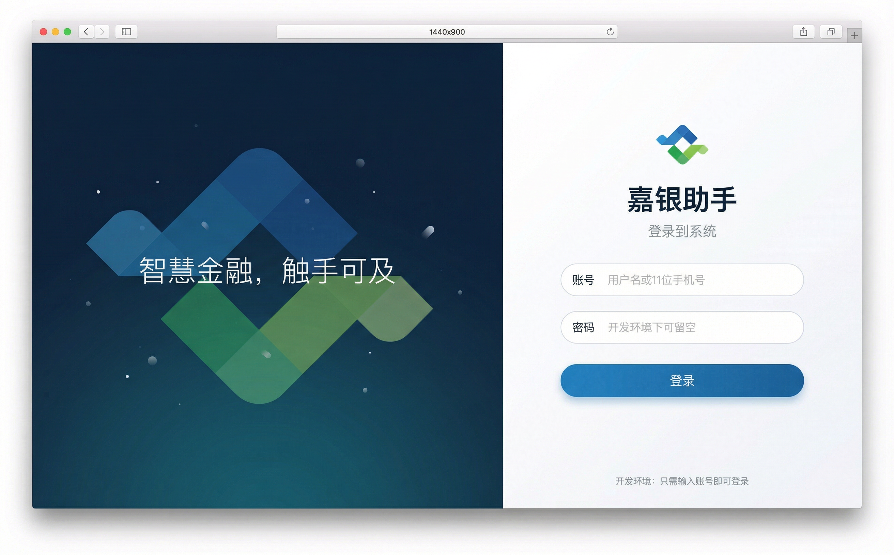
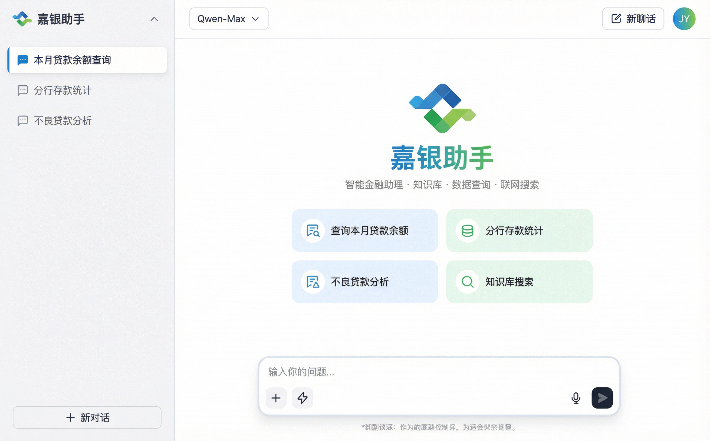
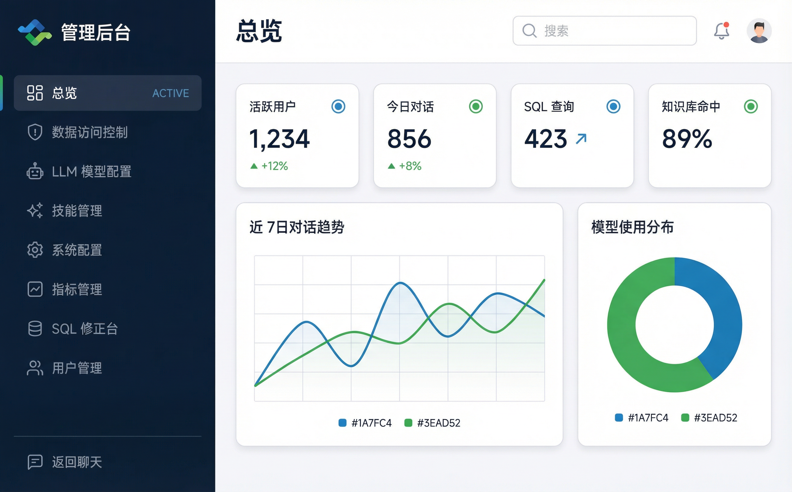
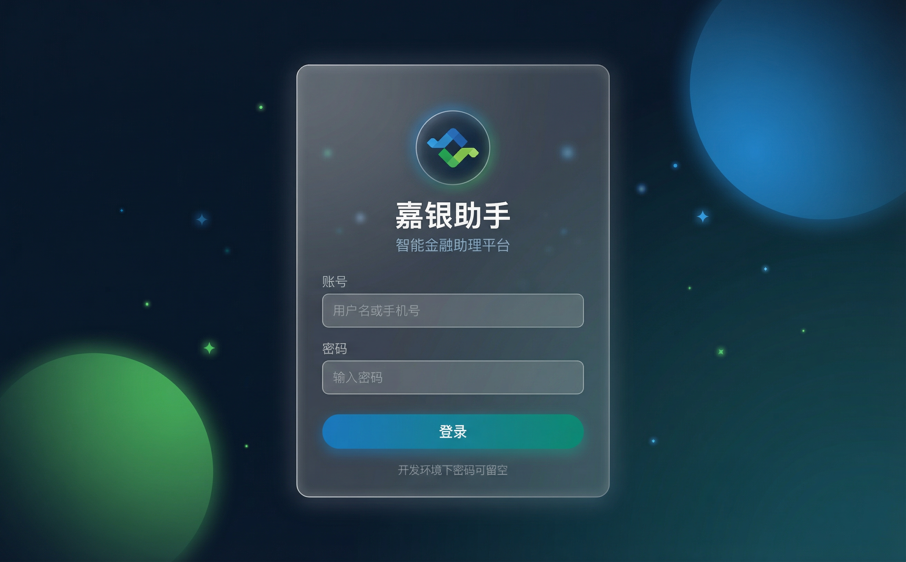
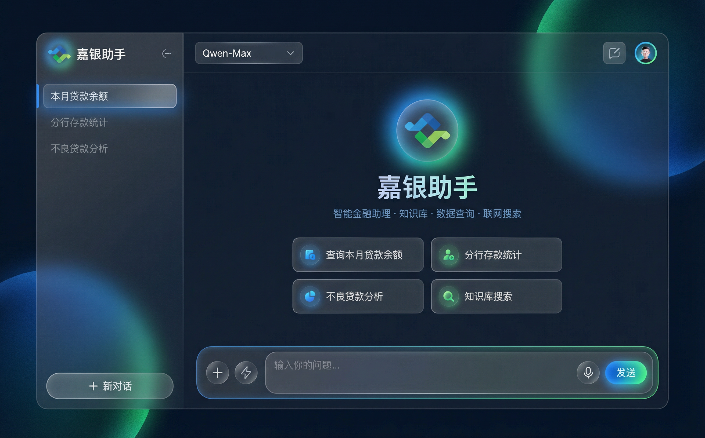
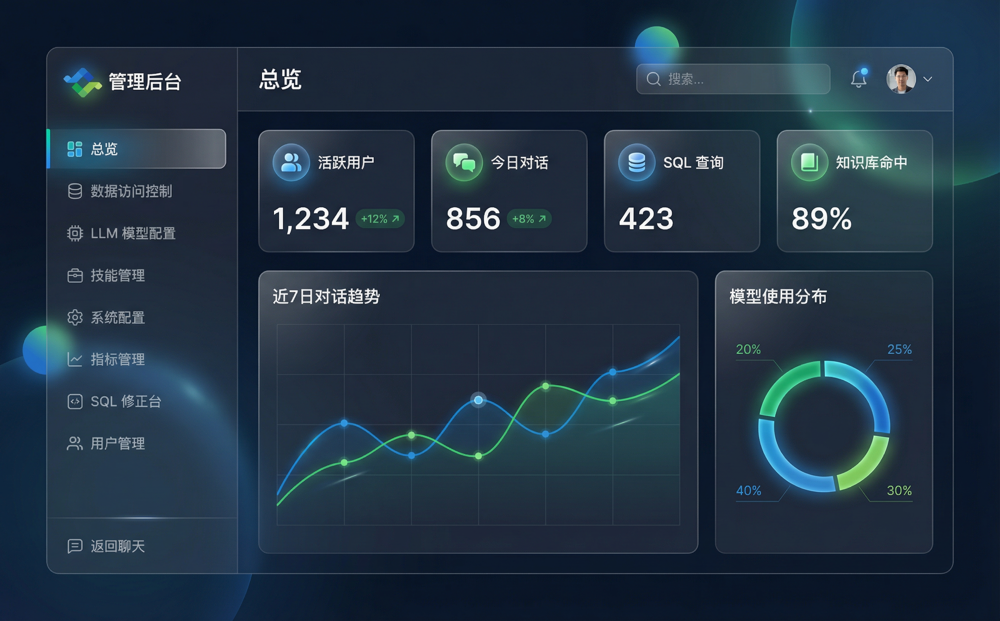
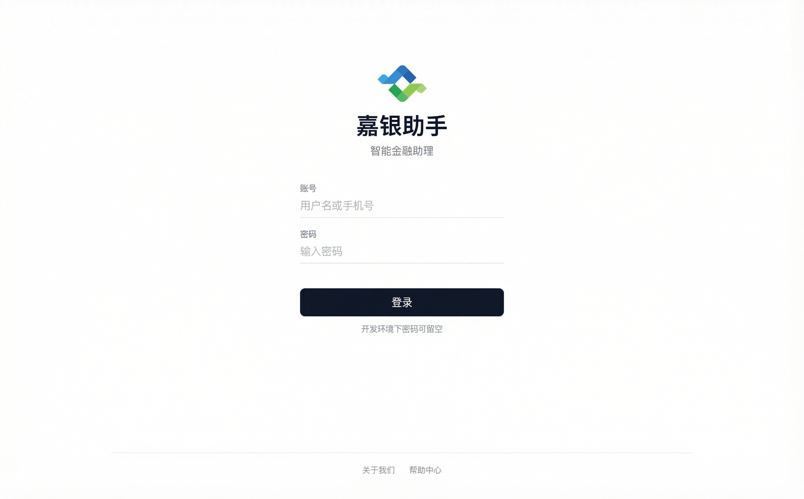
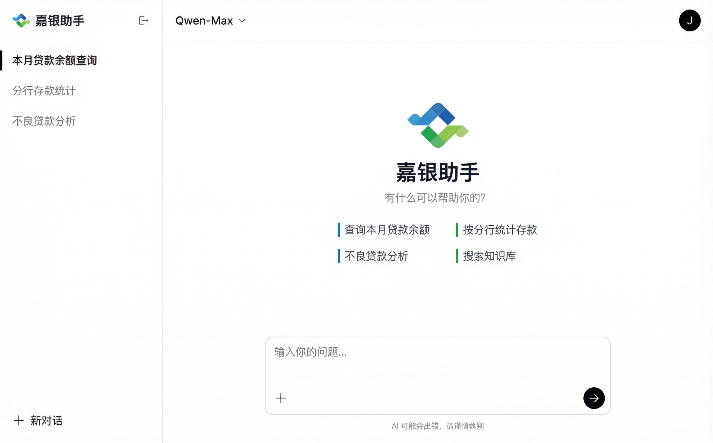
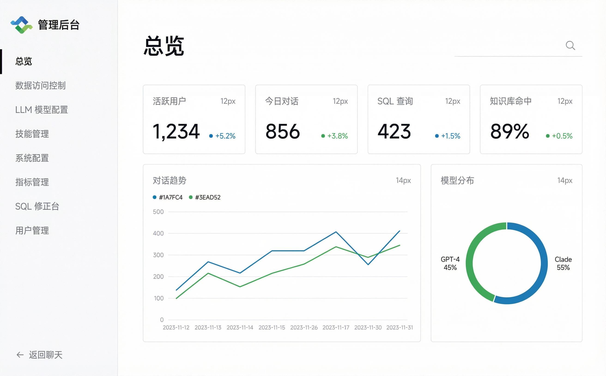

# 前端 UI 设计方案

> **文档目的**: 提供多版本 UI 设计方案供团队评审选择，确保品牌一致性与用户体验质量。
> **创建日期**: 2026-02-07
> **状态**: 待评审

---

## 目录

- [1. 设计背景与现状分析](#1-设计背景与现状分析)
- [2. Logo 分析与配色提取](#2-logo-分析与配色提取)
- [3. 方案 A：商务清新（推荐）](#3-方案-a商务清新推荐)
- [4. 方案 B：玻璃拟态暗色](#4-方案-b玻璃拟态暗色)
- [5. 方案 C：极简黑白](#5-方案-c极简黑白)
- [6. 三方案对比总结](#6-三方案对比总结)
- [7. 效果图功能实现状态](#7-效果图功能实现状态)
- [8. 技术实施指南](#8-技术实施指南)
- [9. 附录：CSS 变量定义](#9-附录css-变量定义)

---

## 1. 设计背景与现状分析

### 1.1 项目简介

嘉银助手是一款面向银行内部员工的 AI 智能助理平台，核心功能包括：

- 智能聊天对话（多智能体协作）
- 待办管理（自然语言创建/查询待办）
- 数据查询（Text-to-SQL 问数）
- 知识库搜索
- 管理后台（模型配置、数据访问控制、SQL 修正）

### 1.2 现状问题

| 问题 | 说明 |
|------|------|
| 品牌色不一致 | Logo 使用蓝(#1A7FC4)+绿(#3EAD52)，但界面主色为 #2F6868（青绿色），视觉割裂 |
| 登录页过于简单 | 纯白背景 + 居中卡片，缺乏品牌感 |
| 欢迎页引导不足 | 聊天首页仅有文字说明，缺少可视化快捷入口 |
| 管理后台视觉层级弱 | 侧边栏与聊天页风格相同，角色区分不明确 |
| 缺少暗色模式 | CSS 变量已预设 dark 模式，但未实际启用 |

### 1.3 设计目标

1. **品牌统一**: 界面配色与 Logo 保持一致
2. **角色区分**: 聊天界面亲和易用，管理后台专业高效
3. **银行气质**: 稳重、可信赖、专业的视觉调性
4. **技术可行**: 基于现有 TailwindCSS + shadcn/ui 技术栈，改动可控

---

## 2. Logo 分析与配色提取

### 2.1 Logo 视觉解读


- **造型**: 两个交叉的几何箭头/对勾，传达"连接"与"向上"
- **蓝色部分**: 位于左上，代表科技、信任、专业
- **绿色部分**: 位于右下，代表成长、财富、安全
- **交叉设计**: 象征AI与金融的交汇融合

### 2.2 提取的品牌色板

| 角色 | 色值 | 用途 |
|------|------|------|
| 品牌蓝 | `#1A7FC4` | 主色调，按钮、链接、强调色 |
| 品牌绿 | `#3EAD52` | 辅助色，成功状态、增长指标 |
| 深蓝 | `#0D2137` | 深色背景、管理后台侧边栏 |
| 浅蓝底 | `#EBF4FF` | 蓝系卡片/标签背景 |
| 浅绿底 | `#E8F8EA` | 绿系卡片/标签背景 |
| 主文字 | `#1A2332` | 标题、正文 |
| 次文字 | `#6B7280` | 辅助说明文字 |
| 边框 | `#E2E8F0` | 输入框、卡片边框 |
| 页面背景 | `#F7F8FA` | 内容区域背景 |

### 2.3 与现有配色对比

| 用途 | 现有值 | 建议更新 |
|------|--------|----------|
| `--primary` | `#2F6868` (青绿) | `#1A7FC4` (品牌蓝) |
| `--ring` | `#2F6868` | `#1A7FC4` |
| 侧边栏背景 | `#f8f9fa` (浅灰) | 方案 A: `#F7F8FA` / 方案 B: `#0D2137` |
| 品牌辅助色 | 无 | `#3EAD52` (品牌绿) |
| 头像背景 | `#E8F4F4` + `#2F6868` | `#EBF4FF` + `#1A7FC4` |

---

## 3. 方案 A：商务清新（推荐）

> **定位**: 专业、可信赖的企业级 AI 助手
> **风格关键词**: 清新、明亮、高效、亲和
> **适合场景**: 银行内部工具，日常办公使用频率高

### 3.1 登录页



**设计要点**:

- **左右分屏布局**: 左侧深蓝渐变(#0D2137 → #0A3D5C)品牌展示区，右侧白底登录表单
- **品牌装饰**: 左侧使用 Logo 几何元素的放大透明装饰图案，增强品牌识别
- **品牌标语**: "智慧金融，触手可及" — 传递产品定位
- **登录按钮**: 蓝色渐变(#1A7FC4 → #1565A0)，与 Logo 蓝一致
- **表单设计**: 圆角输入框(12px)，充足间距，清晰标签

### 3.2 聊天主界面



**设计要点**:

- **侧边栏**: 浅灰(#F7F8FA)背景，顶部 Logo + "嘉银助手" 品牌名
- **对话列表**: 活跃项白底微阴影 + 蓝色左边框，非活跃项灰色文字
- **欢迎区域**: Logo 居中 + 标题 + 功能说明，下方 2x2 快捷操作卡片
- **快捷卡片**: 蓝底(#EBF4FF)和绿底(#E8F8EA)交替，图标 + 文字
- **输入框**: 保持 ChatGPT 风格的浮动圆角容器，圆角 20px

### 3.3 管理后台



**设计要点**:

- **深色侧边栏**: 深蓝(#0D2137)背景，与聊天界面形成角色区分
- **活跃导航**: 蓝色左边框 + 浅色高亮背景
- **仪表盘卡片**: 白底圆角卡片，蓝/绿色图标装饰
- **数据可视化**: 蓝(#1A7FC4) + 绿(#3EAD52) 双色图表
- **顶部栏**: 页面标题 + 搜索 + 通知 + 用户头像

### 3.4 配色方案

```css
:root {
  --brand-blue: #1A7FC4;
  --brand-green: #3EAD52;
  --brand-dark: #0D2137;
  --primary: #1A7FC4;
  --primary-light: #EBF4FF;
  --secondary: #3EAD52;
  --secondary-light: #E8F8EA;
  --background: #FFFFFF;
  --surface: #F7F8FA;
  --text-primary: #1A2332;
  --text-secondary: #6B7280;
  --border: #E2E8F0;
}
```

### 3.5 优缺点

| 维度 | 评价 |
|------|------|
| 品牌一致性 | 高 - 蓝绿主色直接来自 Logo |
| 可读性 | 高 - 亮色背景，对比度好 |
| 专业感 | 高 - 符合银行企业形象 |
| 开发成本 | 中 - 主要调整配色变量 + 登录页重构 |
| 暗色模式 | 需额外开发 |
| 视觉冲击力 | 中 - 稳重但不抢眼 |

---

## 4. 方案 B：玻璃拟态暗色

> **定位**: 高端、科技感强的 AI 智能平台
> **风格关键词**: 暗色、玻璃质感、发光效果、未来感
> **适合场景**: 内部展示、Demo 演示、追求视觉冲击力

### 4.1 登录页



**设计要点**:

- **全屏深色背景**: 深蓝(#0B1929 → #0F3443)渐变
- **光球装饰**: 蓝色和绿色的模糊光球漂浮在背景中
- **毛玻璃登录卡**: 半透明白(rgba(255,255,255,0.08))，backdrop-blur，细白边框
- **Logo 发光环**: Logo 外围有品牌色发光效果
- **渐变按钮**: 蓝到青(#1A7FC4 → #15967D)的渐变登录按钮

### 4.2 聊天主界面



**设计要点**:

- **暗色基调**: 整体深蓝底(#0B1929)，内容区稍浅(#0F1B2D)
- **毛玻璃侧边栏**: 半透明面板，右侧细白边框
- **发光 Logo**: 欢迎区 Logo 带蓝绿色光晕效果
- **毛玻璃快捷卡片**: 半透明卡片，悬停时边框发光
- **发光输入框**: 输入区域带品牌色微光边框
- **发送按钮**: 蓝绿渐变发光效果

### 4.3 管理后台



**设计要点**:

- **全暗色系**: 与聊天界面保持统一暗色基调
- **毛玻璃卡片**: 所有数据卡片使用玻璃拟态效果
- **发光数据图表**: 折线图和饼图带蓝绿色发光
- **半透明导航**: 侧边栏同样使用毛玻璃效果

### 4.4 配色方案

```css
:root {
  --brand-blue: #1A7FC4;
  --brand-green: #3EAD52;
  --bg-base: #0B1929;
  --bg-surface: #0F1B2D;
  --glass-bg: rgba(255, 255, 255, 0.06);
  --glass-border: rgba(255, 255, 255, 0.1);
  --glass-hover: rgba(255, 255, 255, 0.12);
  --text-primary: #FFFFFF;
  --text-secondary: #8EACC4;
  --text-muted: #5A7A94;
  --glow-blue: 0 0 20px rgba(26, 127, 196, 0.3);
  --glow-green: 0 0 20px rgba(62, 173, 82, 0.3);
}
```

### 4.5 优缺点

| 维度 | 评价 |
|------|------|
| 品牌一致性 | 高 - 蓝绿色在暗色背景下更突出 |
| 可读性 | 中 - 暗色模式长时间阅读有疲劳感 |
| 专业感 | 高 - 科技感强，适合展示 |
| 开发成本 | 高 - 需全面重构配色系统 + 实现玻璃效果 |
| 暗色模式 | 天然支持（本身就是暗色） |
| 视觉冲击力 | 高 - 发光效果非常抢眼 |

### 4.6 技术注意事项

- `backdrop-filter: blur()` 在 Safari 和部分移动端有性能问题
- 需要为不支持 backdrop-filter 的浏览器提供降级方案
- 发光效果使用 `box-shadow` 实现，注意性能开销
- 半透明元素叠加层数不宜超过 3 层

---

## 5. 方案 C：极简黑白

> **定位**: 克制、内敛、以内容为中心的工具型界面
> **风格关键词**: 极简、黑白、瑞士风格、排版驱动
> **适合场景**: 追求极致简洁、注重内容的工具型产品

### 5.1 登录页



**设计要点**:

- **纯白全屏**: 完全的白色背景，Logo 是唯一的色彩元素
- **底线输入框**: 仅有底部横线的输入框，无圆角、无背景
- **黑色按钮**: 纯黑(#111827)背景白字，无渐变、无阴影
- **底部链接**: 细线分割 + 辅助链接
- **最大留白**: 上下左右充分留白，信息密度极低

### 5.2 聊天主界面



**设计要点**:

- **无图标侧边栏**: 对话列表仅用文字 + 左边框标识活跃状态
- **文字型快捷入口**: 用竖线色块(蓝/绿) + 文字替代卡片
- **极简输入框**: 仅细边框圆角容器 + 黑色圆形发送按钮
- **排版驱动层次**: 完全靠字号、字重、颜色深浅区分层级
- **消除冗余**: 去掉麦克风、快捷指令等非核心按钮

### 5.3 管理后台



**设计要点**:

- **无图标导航**: 侧边栏仅文字列表，活跃项加粗 + 黑色左边框
- **排版型数据卡片**: 极细边框，灰色标签 + 大号黑色数字
- **细线图表**: 折线图和饼图使用细描边风格
- **单像素分割**: 所有分割线使用 1px 极浅灰(#F3F4F6)

### 5.4 配色方案

```css
:root {
  --brand-blue: #1A7FC4;  /* 仅用于数据可视化 */
  --brand-green: #3EAD52; /* 仅用于数据可视化 */
  --background: #FFFFFF;
  --surface: #FFFFFF;
  --text-primary: #111827;
  --text-secondary: #6B7280;
  --text-muted: #9CA3AF;
  --border: #F3F4F6;
  --border-strong: #E5E7EB;
  --accent: #111827;      /* 按钮、活跃状态 */
}
```

### 5.5 优缺点

| 维度 | 评价 |
|------|------|
| 品牌一致性 | 低 - Logo 色彩仅在图标处体现 |
| 可读性 | 高 - 最大对比度，内容至上 |
| 专业感 | 高 - 简洁克制，设计师风格 |
| 开发成本 | 低 - 大量删减装饰，代码更精简 |
| 暗色模式 | 需额外开发（反转黑白） |
| 视觉冲击力 | 低 - 过于克制可能显得单调 |

---

## 6. 三方案对比总结

### 6.1 总览对比

| 维度 | 方案 A 商务清新 | 方案 B 玻璃拟态 | 方案 C 极简黑白 |
|------|:-:|:-:|:-:|
| **品牌一致性** | ★★★★★ | ★★★★☆ | ★★☆☆☆ |
| **可读性** | ★★★★★ | ★★★☆☆ | ★★★★★ |
| **专业感** | ★★★★☆ | ★★★★★ | ★★★★☆ |
| **视觉冲击力** | ★★★☆☆ | ★★★★★ | ★★☆☆☆ |
| **开发成本** | 中 | 高 | 低 |
| **维护难度** | 低 | 中 | 低 |
| **适合场景** | 日常办公 | Demo/展示 | 极客/工具控 |

### 6.2 推荐建议

| 优先级 | 推荐 | 理由 |
|--------|------|------|
| **首选** | 方案 A | 品牌一致性最好，银行场景适配度高，开发成本适中 |
| **备选** | 方案 A + B 混合 | 以方案 A 为基础，管理后台采用方案 B 的暗色侧边栏 |
| **长期** | 方案 A + 暗色模式 | 基于方案 A 开发，后续增加暗色模式支持 |

### 6.3 混合方案建议（A+B）

如果希望聊天界面保持清新亲和，管理后台呈现专业权威感，可以考虑混合：

- **登录页**: 采用方案 A 的分屏布局（左深右白）
- **聊天界面**: 采用方案 A 的亮色风格
- **管理后台**: 采用方案 B 的暗色侧边栏 + 方案 A 的亮色内容区

这样既保证了日常使用的舒适度，又通过暗色侧边栏区分管理后台的角色定位。

---

## 7. 效果图功能实现状态

> 效果图中展示了部分尚未实现的功能，以下为详细对比。
> 标注 **UI-only** 的条目仅需前端改造，标注 **Full-stack** 的条目需要前后端联合开发。

### 7.1 功能差距分析

| 效果图功能 | 当前状态 | 改造类型 | 工作量估算 |
|---|---|---|---|
| 登录页分屏布局（左品牌展示 + 右表单） | 居中白卡片，无品牌展示区 | UI-only | 0.5 天 |
| 聊天欢迎页 2x2 快捷操作卡片 | 仅输入框内下拉菜单 | UI-only | 0.5 天 |
| 管理后台深色侧边栏 | 浅灰色侧边栏 (#f8f9fa) | UI-only | 0.5 天 |
| 管理后台顶部搜索栏 | 无全局顶部栏组件 | UI-only | 0.5 天 |
| 管理后台通知铃铛 | 不存在 | Full-stack | 2-3 天 (含通知系统) |
| 概览仪表盘 — 指标卡片（活跃用户/今日对话/SQL查询/知识库命中） | 仅模块导航卡片 | Full-stack | 1-2 天 |
| 概览仪表盘 — 对话趋势折线图 | 无数据/无API/无前端 | Full-stack | 1-2 天 |
| 概览仪表盘 — 模型使用分布饼图 | 无数据/无API/无前端 | Full-stack | 1 天 |

### 7.2 后端需新增的 API

效果图中仪表盘功能需要以下后端统计接口：

| API 端点 | 返回数据 | 数据来源 |
|---|---|---|
| `GET /api/v1/admin/dashboard/stats` | 活跃用户数、今日对话数、SQL 查询数、知识库命中率 | `t_user` + LangGraph threads + 运行日志 |
| `GET /api/v1/admin/dashboard/trends` | 近 7/30 天对话量趋势（日维度） | LangGraph threads 按日聚合 |
| `GET /api/v1/admin/dashboard/model-usage` | 各模型调用次数/占比 | 运行日志或计费记录 |

> **注意**: 以上 API 为效果图展示需要，具体是否实现取决于产品优先级。
> 通知铃铛需要一套完整的消息/通知子系统，建议作为后续迭代功能。

### 7.3 建议实施优先级

| 阶段 | 内容 | 依赖 |
|------|------|------|
| P0 - 先做 | 配色统一 + 登录页 + 欢迎页卡片 | 无后端依赖，纯 UI |
| P1 - 次做 | 管理后台侧边栏 + 顶部栏 | 无后端依赖，纯 UI |
| P2 - 后做 | 概览仪表盘（指标卡+图表） | 需后端新增统计 API |
| P3 - 可选 | 通知铃铛 | 需设计通知系统 |

---

## 8. 技术实施指南

### 8.1 变更范围评估

无论选择哪个方案，核心变更文件如下：

| 文件 | 变更内容 | 影响范围 |
|------|----------|----------|
| `web/src/app/globals.css` | CSS 变量（品牌色系统） | 全局 |
| `web/src/components/auth/LoginCard.tsx` | 登录页重构 | 登录页 |
| `web/src/app/auth/page.tsx` | 登录页布局 | 登录页 |
| `web/src/components/chat/index.tsx` | 欢迎区域 + 快捷卡片 | 聊天首页 |
| `web/src/components/chat/ChatHeader.tsx` | 头像/品牌色调整 | 聊天顶栏 |
| `web/src/components/chat/ChatInput.tsx` | 输入框样式微调 | 输入区 |
| `web/src/components/chat/history/index.tsx` | 侧边栏样式 | 对话列表 |
| `web/src/components/admin/AdminSidebar.tsx` | 管理后台侧边栏 | 管理后台 |
| `web/src/app/admin/layout.tsx` | 管理后台布局 | 管理后台 |

### 8.2 实施优先级

建议按以下顺序分阶段落地：

**Phase 1 - 配色统一（1-2天）**
- 更新 `globals.css` 中的 CSS 变量
- 全局替换 `#2F6868` → `#1A7FC4`
- 全局替换 `#E8F4F4` → `#EBF4FF`

**Phase 2 - 登录页改造（1天）**
- 重构 `LoginCard.tsx` 和 `auth/page.tsx`
- 实现分屏布局 + 品牌展示区

**Phase 3 - 聊天首页优化（1天）**
- 改造欢迎区域（Logo + 渐变标题 + 快捷卡片）
- 优化侧边栏样式

**Phase 4 - 管理后台强化（1-2天）**
- 侧边栏暗色改造（如选择混合方案）
- 仪表盘首页（如有需要）

### 8.3 logo 文件准备

当前 `web/public/` 目录下缺少 logo 文件，需要添加：

```
web/public/
├── logo.png        # 主 Logo（透明背景 PNG，建议 512x512）
├── logo-white.png  # 白色版 Logo（用于深色背景）
└── favicon.ico     # 已有
```

---

## 9. 附录：CSS 变量定义

### 方案 A 的完整 CSS 变量

```css
:root {
  /* 品牌色 - 来自 Logo */
  --brand-blue: oklch(0.55 0.15 230);      /* #1A7FC4 */
  --brand-blue-light: oklch(0.93 0.03 230); /* #EBF4FF */
  --brand-green: oklch(0.62 0.18 145);      /* #3EAD52 */
  --brand-green-light: oklch(0.94 0.04 145); /* #E8F8EA */
  --brand-dark: oklch(0.18 0.03 240);       /* #0D2137 */

  /* 主色 */
  --primary: oklch(0.55 0.15 230);
  --primary-foreground: oklch(0.985 0 0);

  /* 页面基础 */
  --background: oklch(1 0 0);
  --foreground: oklch(0.17 0.02 250);       /* #1A2332 */
  --surface: oklch(0.98 0 0);              /* #F7F8FA */

  /* 边框 */
  --border: oklch(0.91 0.01 240);           /* #E2E8F0 */
  --input: oklch(0.91 0.01 240);

  /* 焦点环 */
  --ring: oklch(0.55 0.15 230);

  /* 其他保持不变... */
}
```

### 方案 B 的完整 CSS 变量

```css
:root {
  /* 品牌色 */
  --brand-blue: oklch(0.55 0.15 230);
  --brand-green: oklch(0.62 0.18 145);

  /* 暗色基础 */
  --bg-base: oklch(0.15 0.03 240);         /* #0B1929 */
  --bg-surface: oklch(0.18 0.03 240);      /* #0F1B2D */

  /* 玻璃效果 */
  --glass-bg: rgba(255, 255, 255, 0.06);
  --glass-border: rgba(255, 255, 255, 0.1);
  --glass-hover: rgba(255, 255, 255, 0.12);
  --backdrop-blur: blur(20px);

  /* 文字 */
  --text-primary: oklch(0.985 0 0);
  --text-secondary: oklch(0.7 0.04 220);
  --text-muted: oklch(0.5 0.04 220);
}
```

### 方案 C 的完整 CSS 变量

```css
:root {
  /* 品牌色 - 仅数据可视化使用 */
  --brand-blue: oklch(0.55 0.15 230);
  --brand-green: oklch(0.62 0.18 145);

  /* 极简基础 - 黑白灰 */
  --background: oklch(1 0 0);
  --foreground: oklch(0.13 0 0);           /* #111827 */
  --surface: oklch(1 0 0);

  /* 文字层级 */
  --text-primary: oklch(0.13 0 0);
  --text-secondary: oklch(0.45 0 0);       /* #6B7280 */
  --text-muted: oklch(0.65 0 0);           /* #9CA3AF */

  /* 极细边框 */
  --border: oklch(0.96 0 0);               /* #F3F4F6 */
  --border-strong: oklch(0.92 0 0);        /* #E5E7EB */

  /* 强调色 = 黑色 */
  --accent: oklch(0.13 0 0);
  --accent-foreground: oklch(1 0 0);
}
```

---

## 变更记录

| 日期 | 内容 |
|------|------|
| 2026-02-07 | 创建初始版本，包含三个设计方案 |
