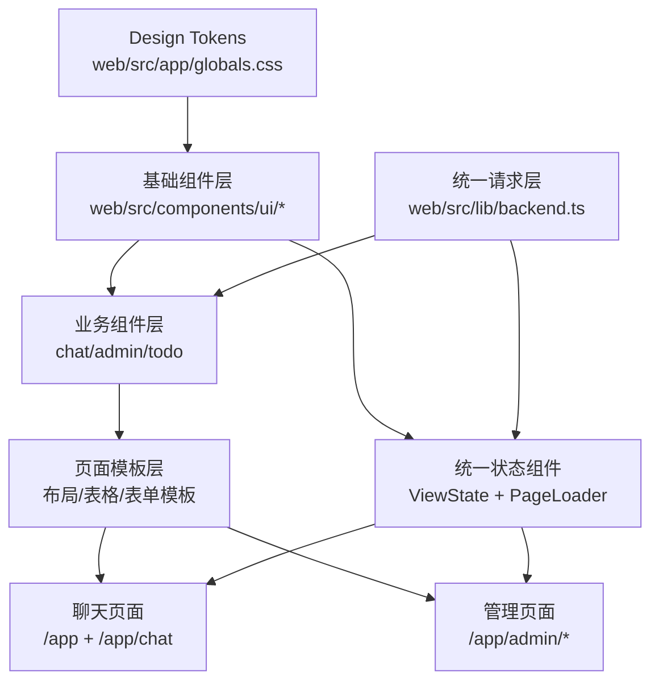
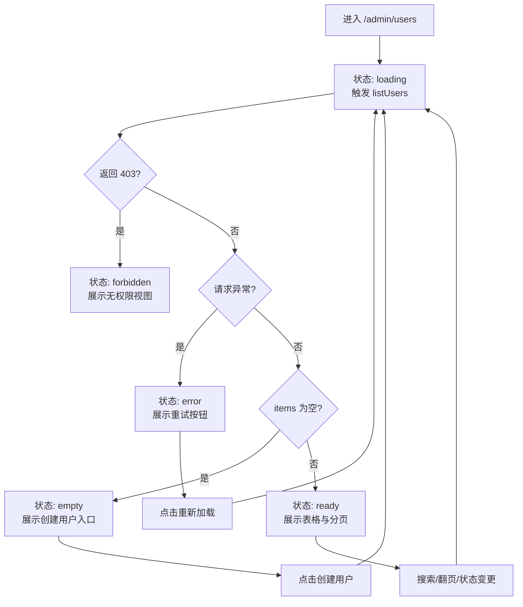
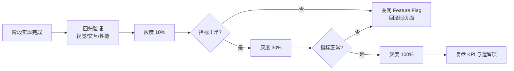

# 前端架构

> **用途**: 帮助 AI 理解前端代码结构，快速定位修改位置。


## 文档导航

- 全局架构入口：[系统总览](系统总览.md)
- AI 核心设计：[AI模块设计](AI模块设计.md)
- 后端分层设计：[后端架构](后端架构.md)
- 前端分层设计：[前端架构](前端架构.md)
- 数据模型与双库：[数据库设计](数据库设计.md)
- 对外接口定义：[接口文档](../../API文档/接口文档.md)
- 需求来源总览：[系统需求](../../产品文档/系统需求.md)

---

## 📁 目录结构

```
web/src/
├── app/                    # Next.js App Router
│   ├── page.tsx            # 主页（聊天界面）
│   ├── layout.tsx          # 根布局
│   ├── globals.css         # 全局样式
│   ├── admin/              # 管理后台
│   │   ├── page.tsx        # 总览驾驶舱入口页
│   │   └── data/page.tsx   # SQL 修正台
├── components/
│   ├── chat/               # 聊天相关组件
│   │   ├── index.tsx       # ⭐ Thread 主组件
│   │   ├── ChatInput.tsx   # 输入框
│   │   ├── ChatHeader.tsx  # 头部（模型选择）
│   │   ├── markdown-text.tsx # Markdown 渲染
│   │   ├── CompactApproval.tsx # 确认/拒绝 UI
│   │   └── messages/       # 消息组件
│   ├── todo/               # 待办相关组件
│   ├── admin/overview/     # 总览驾驶舱组件
│   ├── ui/                 # 通用 UI 组件
│   └── icons/              # 图标组件
├── hooks/
│   ├── useSSEStream.ts     # ⭐ SSE 流处理
│   ├── use-message-updater.ts # 消息状态更新
│   ├── use-model-config.ts # 模型配置
│   └── use-file-upload.tsx # 文件上传
├── lib/
│   ├── backend.ts          # ⭐ API 客户端（Token 使用 sessionStorage）
│   ├── utils.ts            # 工具函数 (cn, safeParseJson, ...)
│   └── model-config.ts     # 模型配置管理
├── providers/
│   ├── Stream.tsx          # StreamContext Provider
│   └── StreamContext.tsx   # 流状态定义
└── types/
    ├── message.ts          # 消息类型定义
    └── todo.ts             # 待办类型定义
```

---

## 🔄 状态管理

### StreamContext

**文件**: `web/src/providers/StreamContext.tsx`

```typescript
interface StreamContextValue {
  // 消息状态
  messages: Message[];
  values: StateType;
  
  // 流状态
  isLoading: boolean;
  error: unknown;
  threadId: string | null;
  
  // 中断相关
  interrupt: InterruptData | null;
  
  // 操作方法
  submit: (update?: { messages?: string; attachments?: Attachment[] }) => void;
  stop: () => void;
  resume: (decision: DecisionType) => Promise<void>;
  
  // 配置
  enableThinking: boolean;
  setEnableThinking: (v: boolean) => void;
  selectedModel: string | undefined;  // undefined 表示使用后端默认模型
  // 后端默认模型可在“管理后台 -> LLM 配置 -> 模型路由”中配置为 model_routing.default_chat
  handleModelChange: (modelId: string) => void;
  thinkingCapability: "always" | "never" | "optional";
  // 注意：useMultiAgent 已废弃（2026-01-31），系统默认使用多智能体模式
  hideToolCalls: boolean;
  setHideToolCalls: (v: boolean) => void;
  
  // 🆕 当前处理状态（结构化阶段 + 文案）
  currentStatus: { message: string; phase: "processing" | "generating" | "done" } | null;
}
```

### 消息类型

**文件**: `web/src/types/message.ts`

```typescript
interface Message {
  id: string;
  role: 'user' | 'assistant';
  content: string;
  createdAt: Date;
  
  // 扩展属性
  metadata?: MessageMetadata;
  toolCalls?: ToolCall[];
  thinkingContent?: string;
  interrupt?: InterruptData;
}

interface MessageMetadata {
  status?: string;           // 状态消息
  result?: ResultData;       // 结构化结果
  attachments?: Attachment[];
}
```

---

## 🎨 核心组件

### Thread (聊天主组件)

**文件**: `web/src/components/chat/index.tsx`

```
Thread
├── ChatHeader          # 模型选择、设置
├── StickyToBottomContent
│   └── MessageList     # 消息列表
│       ├── UserMessage
│       └── AssistantMessage
│           ├── MarkdownText
│           ├── ToolCallsDisplay
│           ├── ThinkingContent
│           └── CompactApproval
├── ChatInput           # 输入框、附件预览
└── ScrollToBottom      # 滚动到底部按钮
```

消息渲染约束：
- `MessageList` 中 `key` 使用 ```${message.id ?? message.type}-${index}```，避免后端返回重复 `id` 时触发 React 重复 key 告警。


### LLM 管理后台（模型路由）

**文件**: `web/src/components/admin/LLMAdminPanel.tsx`

关键行为：
- “模型路由”页签展示 5 类场景路由，其中主对话/SQL 生成/轻量任务与 Vision 支持可视化配置，Embedding 保持只读展示。
- 管理员更新路由后，前端通过 `getModelRouting()` 重新拉取并即时反映。
- 路由可编辑项按场景类型过滤模型：chat 场景仅显示启用中的 chat 模型，Vision 场景显示启用中的 vision/chat/reasoning 模型（支持多模态能力模型直接绑定）。

### AdminLayout（后台壳层）

**文件**: `web/src/app/admin/layout.tsx`

关键行为：
- 后台根布局使用 `app-shell-canvas` 与 `admin-main-scroll` 构建统一画布层，避免页面纯白铺满。
- 所有后台页面根容器统一为 `admin-page-content`，由样式变量控制最大宽度和内边距。
- 管理后台使用 `--admin-content-max-width`、`--admin-page-padding-x`、`--admin-page-padding-y` 控制紧凑密度，桌面与移动端共享同一套节奏。
- 管理后台侧栏与聊天历史侧栏共享 `--app-sidebar-*` 语义变量，统一背景、边框、hover、active 视觉语言。

### AdminOverviewCockpit（总览驾驶舱）

**文件**:

- `web/src/app/admin/page.tsx`
- `web/src/components/admin/overview/AdminOverviewCockpit.tsx`
- `web/src/lib/admin-overview-api.ts`
- `web/src/types/admin-overview.ts`

关键行为：

- `/admin` 页面通过动态加载渲染 `AdminOverviewCockpit`，首屏统一展示 8 块驾驶舱卡片。
- 实时数据链路采用 `SSE 优先 + 10 秒轮询降级`，并通过 `admin-overview-realtime-status` 展示当前连接态。
- 告警列表与模块矩阵支持按关键词路由映射，跳转到后台对应子模块（如 `llm/users/data`）。
- 趋势数据支持 `1h/24h` 双窗口，按后端快照字段绘制健康分、QPS 等趋势线。
- 驾驶舱卡片统一采用紧凑间距（`p-4`、`gap-3`、`py-2`），在不改字段含义的前提下提升单屏信息密度。

### AdminSidebar（管理导航）

**文件**: `web/src/components/admin/AdminSidebar.tsx`

关键行为：
- 导航项统一使用 `app-sidebar-item` / `app-sidebar-item-active` 状态类。
- 图标统一使用 `app-sidebar-icon` / `app-sidebar-icon-active`，减少硬编码颜色。
- 顶部、底部与列表分割线统一走 `app-sidebar-separator`，保证层级一致。
- 侧栏默认宽度 `212px`，折叠宽度 `60px`，导航项与底部入口统一 `text-[13px] + py-2` 的紧凑规格。

### SkillAdminPanel（技能管理）

**文件**: `web/src/components/admin/SkillAdminPanel.tsx`

关键行为：
- 概览卡片、筛选器与操作按钮统一为紧凑尺寸，减少列表页垂直空白。
- 技能表格头部与行高分别收敛到 `h-10` / `py-2.5`，单屏可见条目数更高。
- 搜索输入态（`searchInput`）与查询态（`searchQuery`）分离，避免按键级触发全页刷新。
- 首屏加载态与列表刷新态拆分：首屏使用页面级 loading，后续筛选/搜索仅在表格区域提示加载。
- 列表请求通过 `skip/limit` 分页聚合获取全量结果，避免固定上限（如 100 条）导致统计失真。
- 详情弹窗保留完整内容展示，但内部间距收敛到 `space-y-3`。


### ChatHeader（用户菜单）

**文件**: `web/src/components/chat/ChatHeader.tsx`

关键行为：
- 通过 `getMe()` 拉取 `/api/v1/me`，在右上角用户菜单展示当前登录用户信息。
- 菜单头部展示优先级：`username` > `mobile`，副信息优先展示 `mobile`。
- 菜单头部使用轻量卡片样式（头像首字母 + 主副文本），与操作区通过分割线隔离，增强信息层级。
- 菜单详情区附加展示 `用户 ID` 与 `数据角色`；数据角色优先使用后端返回的 `data_role_label`（来自系统配置键 `user.data_role_labels`），缺失时回退 `data_role` 原值，前端不再硬编码角色文案。
- 用户信息读取失败时保持菜单可用，仅回退为通用“当前用户”展示，不影响“系统设置/退出登录”操作。

### ChatInput

**文件**: `web/src/components/chat/ChatInput.tsx`

关键功能：
- 多行文本输入
- 文件/图片上传
- 附件预览
- 发送控制
- **待办讨论上下文**: 显示当前选中待办，绑定到 `threadId` 确保跨对话隔离

### MarkdownText

**文件**: `web/src/components/chat/markdown-text.tsx`

功能：
- Markdown 渲染
- 代码高亮
- 图片/图表显示
- 链接处理

### TodoListCard

**文件**: `web/src/components/todo/index.tsx`

**职责**: 渲染待办列表卡片，支持增删改查操作。

```typescript
interface TodoListCardProps {
  todos: Todo[];
  onAction?: (action: string) => void;
  readonly?: boolean;
  fetchLatest?: boolean;  // 是否从 API 获取实时数据
}
```

**数据刷新策略**:

| 场景 | `fetchLatest` | 数据来源 | 说明 |
|------|---------------|---------|------|
| 最新消息 | `true` | API 实时查询 | 确保刷新后数据准确 |
| 历史消息 | `false` | props.todos 快照 | 保持对话历史语义 |

**乐观更新机制**:

```typescript
// 删除操作示例
const handleDelete = async (id: number) => {
    try {
        await deleteTodoAPI(id);          // 调用 API
        setLocalTodos(prev => prev.filter(t => t.id !== id));  // 本地更新
        toast.success('已删除');
    } catch (error) {
        toast.error('删除失败');          // 失败回滚由用户刷新处理
    }
};
```

> **参考**: 特殊处理记录见 [防屎山记录手册](防屎山记录手册.md#sp-012-待办卡片乐观更新)

### SqlResultChart

**文件**: `web/src/components/chat/messages/sql-result-chart.tsx`

**职责**: 使用 Vega-Lite 渲染问数 `sql_result` 中的可选 `chart` 结构，支持图表与表格同屏展示。

渲染引擎：`react-vega` + `vega-lite`

- 选型原因：声明式 Spec 对 LLM 自动生成更稳，且可做结构化校验。
- 与 SSE 契约关系：仍消费单一 `sql_result` 事件，不新增事件类型。

图表类型映射：

- `chart.type='bar'` -> Vega-Lite `mark: "bar"`
- `chart.type='line'` -> Vega-Lite `mark: "line"`
- `chart.type='pie'` -> Vega-Lite `mark: "arc"`

渲染约束：

1. 图表组件仅消费 `sql_result.data.chart`，不新增 SSE 事件类型。
2. 消息渲染顺序固定为“图在上，表在下”。
3. `chart` 缺失时自动降级为仅渲染 `SqlResultTable`。
4. `react-vega` 使用 `options.actions=false` 关闭默认三点菜单，并固定 `renderer="svg"` 提升展示稳定性。
5. 渲染前会对 `y_key` 做数值归一化（支持千分位与 `亿/万` 单位），无法解析的点位跳过，避免整图空白。
6. X 轴类型优先读取 `chart.field_meta[x_key].semantic_type`（`temporal`/`categorical`），仅在缺失时回退样本推断。
7. 图表初始化后触发一次 `view.resize()+runAsync()`，修复容器宽度变化导致的空白绘图区。

视觉与可读性策略（2026-02-11）：

1. 图表外层统一使用卡片化容器（圆角、浅阴影、渐变背景），与聊天消息视觉体系对齐。
2. 标题区改为组件头部渲染，默认标题规则为 `Y 轴字段（按X轴字段）`，并展示图表类型与数据条数标签。
3. 类目型柱状图在“类目较多或标签较长”时自动切换为横向条形图，减少 X 轴标签重叠。
4. 纵向柱状图保留圆角顶部，横向条形图使用末端圆角，提升排序场景下的比较效率。
5. 纵向柱状图在类目轴场景下，X 轴标签采用逐字换行，从上到下展示，保持单字正向可读。
6. 坐标轴、网格线、颜色体系统一为低对比浅色基线 + 单主色强调，保证金融数据阅读稳定性。
7. 饼图启用更清晰的配色方案与分割线，提升类别区分度。

---

## 🔧 核心 Hooks

### useSSEStream

**文件**: `web/src/hooks/useSSEStream.ts`

职责：
- 管理消息状态
- 处理 SSE 事件流
- 发送消息
- 恢复中断流程

```typescript
function useSSEStream(): StreamContextValue {
  // 消息状态
  const [messages, setMessages] = useState<Message[]>([]);
  const [isStreaming, setIsStreaming] = useState(false);
  
  // 发送消息
  const sendMessage = async (content: string, attachments?: Attachment[]) => {
    // 1. 添加用户消息
    // 2. 创建 AI 占位消息
    // 3. 启动 SSE 流
    // 4. 实时更新消息内容
  };
  
  // 恢复中断
  const resumeWithDecision = async (decision: DecisionType) => {
    // 调用 resume API
    // 继续处理流
  };
  
  return { messages, isStreaming, sendMessage, ... };
}
```

### useMessageUpdater

**文件**: `web/src/hooks/use-message-updater.ts`

简化消息更新逻辑：

```typescript
const { appendContent, setToolCall, setMetadata } = useMessageUpdater(messages, setMessages);

// 追加内容
appendContent(messageId, token);

// 更新工具调用
setToolCall(messageId, toolName, { output, status: 'done' });
```

---

## 📡 API 客户端

### 核心函数

**文件**: `web/src/lib/backend.ts`

| 函数 | 用途 |
|------|------|
| `apiFetch` | 基础请求封装（自动注入 Token） |
| `login` | 用户登录 |
| `getMe` | 获取当前用户 |
| `getModels` | 获取模型列表 |
| `uploadFile` | 上传文件到 MinIO |
| `streamLLM` | 启动 SSE 流 |
| `startLLMStream` | 带中止控制的流 |
| `resumeChat` | 恢复中断流程 |
| `getThreads` | 获取对话列表 |
| `getThreadMessages` | 获取历史消息 |

### SSE 流处理

```typescript
async function streamLLM(
  prompt: string,
  callbacks: StreamCallbacks,
  options?: StreamOptions
): Promise<void> {
  const response = await fetch(`${API_BASE}/api/v1/chat/stream`, {
    method: 'POST',
    headers: { 'Content-Type': 'application/json', ... },
    body: JSON.stringify({ prompt, ...options })
  });
  
  const reader = response.body?.getReader();
  const decoder = new TextDecoder();
  
  while (true) {
    const { done, value } = await reader.read();
    if (done) break;
    
    const text = decoder.decode(value);
    // 解析 SSE 事件
    // 调用相应回调
  }
}
```

### SSE 单通道协议（2026-02 严格切换）

- 结构化数据唯一入口是 `onResult(data_type, data, message?)`。
- `onDone` 只做生命周期收口（结束 loading、刷新线程、更新 `message_id`）。
- `onDone` 不再透传或写入 `additional_kwargs`。
- `resumeChat` 的事件分发必须与 `streamLLM` 一致，至少覆盖 `result/status/clarification/kb_images`。

### SSE 事件冻结映射（2026-02-10）

- 事件数据类型统一声明在 `web/src/types/message.ts`，补齐了 `init/token/result/done/kb_images`。
- `done` 对齐 G0 冻结：`thread_id` required，`message_id/final_content/meta` optional。
- `web/src/lib/backend.ts` 统一 `streamLLM` 与 `resumeChat` 的 SSE 解析与分发，避免双份分支漂移。
- `web/src/hooks/useSSEStream.ts` 统一复用 `result` 写入与 `message_id` 回填逻辑，`done` 仅做生命周期收口。
- `status` 渲染规则（2026-02-15）：
  - 协议升级为结构化状态：`StatusEventData = { message, phase }`，`phase ∈ processing/generating/done`。
  - `useSSEStream` 不再做文案硬编码映射，只负责消费阶段字段并在收到 token 后清空状态条。
  - `AssistantMessage` 根据 `phase` 控制动画：`done` 为静态状态点，其他阶段保留 pulse/ping。

### SQL 结果展示字段（2026-02-10）

`data_type='sql_result'` 的 `data` 结构新增以下可选字段：

- `column_display_names?: string[]`：表头展示名，索引与 `columns` 对齐；
- `display_sql?: string`：SQL 折叠区优先展示内容。
- `permission_scope_applied?: boolean`：是否发生权限重写并应用范围过滤。
- `permission_scope_summary?: { data_role?: string; org_code?: string; org_name?: string; dept_code?: string; dept_name?: string; has_explicit_row_filters?: boolean; row_scope_keys?: string[]; display_text?: string }`：权限范围摘要；`display_text` 可直接用于“机构/部门口径”提示。
- `chart?: { type: "bar"|"line"|"pie"; title?: string; x_key: string; x_label?: string; y_key: string; y_label?: string; series_name?: string; field_meta?: Record<string, { role: "dimension"|"measure"|"time"|"identifier"; semantic_type: "categorical"|"numeric"|"temporal"; axis_hint: "x"|"y"|"series"|"none"; agg: "none"|"sum"|"avg"|"count" }>; data: Array<Record<string, string|number>> }`：问数图表增强载荷。

前端渲染约定：

1. 表头显示：`column_display_names[idx] ?? columns[idx]`
2. 单元格取值：仍按原 `row[columns[idx]]`
3. SQL 展示：`display_sql ?? sql`
4. 若存在 `chart`，先渲染图表再渲染 `SqlResultTable`
5. 轴类型推断遵循后端语义契约：优先使用 `field_meta`，仅在缺失时启用前端启发式推断

---

## 🎯 关键修改点

### 修改消息渲染

| 场景 | 文件 |
|------|------|
| Markdown 样式 | `components/chat/markdown-text.tsx` |
| 代码块样式 | `components/chat/syntax-highlighter.tsx` |
| 工具调用显示 | `components/chat/messages/` |

### 修改输入交互

| 场景 | 文件 |
|------|------|
| 输入框 UI | `components/chat/ChatInput.tsx` |
| 文件上传逻辑 | `hooks/use-file-upload.tsx` |
| 快捷键 | `components/chat/ChatInput.tsx` |

### 修改流处理

| 场景 | 文件 |
|------|------|
| 新事件类型 | `hooks/useSSEStream.ts` |
| API 请求 | `lib/backend.ts` |
| 状态管理 | `providers/StreamContext.tsx` |

---

## 📝 样式规范

### Tailwind 类名约定

```tsx
// 使用 cn() 合并类名
import { cn } from "@/lib/utils";

<div className={cn(
  "p-4 rounded-lg",           // 基础样式
  "bg-muted hover:bg-accent", // 交互样式
  className                    // 外部传入
)} />
```

### 颜色变量

| 变量 | 用途 |
|------|------|
| `bg-background` | 页面背景 |
| `bg-muted` | 次级背景 |
| `bg-card` | 卡片背景 |
| `text-foreground` | 主文本 |
| `text-muted-foreground` | 次级文本 |

---

## 🛠️ 管理后台 (Admin Panel)

后台提供 SQL 修正与人工训练功能，支持 `Human-in-the-loop` 优化流程。

### 核心页面

**路径**: `web/src/app/admin/data/page.tsx`
**组件**: `web/src/components/admin/DataAdminPanel.tsx`

### 功能模块

1. **待办列表 (Pending List)**
   - 展示 AI 生成失败或被用户"踩"的 SQL 记录
   - 显示原始问题、生成的 SQL、错误信息

2. **修正/训练 (Review & Train)**
   - **编辑 SQL**: 管理员可手动修正错误的 SQL
   - **执行测试**: 在修正过程中实时运行 SQL 验证结果
   - **提交训练**: 点击"训练"按钮，调用后端 `vanna.train` 接口，将 `(Question, CorrectSQL)` 存入向量库
   - **忽略日志**: 对待训练日志执行单条忽略，忽略后默认不再展示

3. **批量操作**
   - 支持批量选中记录进行训练
   - 支持批量选中记录进行忽略
   - 支持一键"训练全部待处理项"

### 视觉组件

- **Badge**: 状态指示 (待训练/已训练/训练中)
- **Monaco Editor**: SQL 代码高亮编辑
- **Table**: 结构化展示数据表格

---

## 🛠️ 工具函数

### `lib/utils.ts`

```typescript
// 安全解析 JSON 并使用 Zod 校验
export function safeParseJson<T>(
  json: string | null,
  schema: ZodSchema<T>,
  fallback: T
): T;

// 常用 sessionStorage 数据模式
export const SelectedTodoSchema = z.object({
  id: z.number(),
  title: z.string(),
  threadId: z.string().optional(),
});
```

### 待办选中态生命周期（`selectedTodo`）

`selectedTodo` 用于将 TodoListCard 中用户当前选中的待办透传到聊天输入与 SSE 请求：

1. 在待办列表点击某项后，消息组件将 `{id,title,threadId}` 写入 `sessionStorage.selectedTodo` 并派发 `todoSelected` 事件。
2. `ChatInput` 监听 `todoSelected/todoDeselected` 事件，仅负责展示"已选中"提示与取消按钮，不在提交前清空选中态。
3. `useSSEStream.submit()` 在真正发起 `/api/v1/chat/stream` 前读取 `selectedTodo.id`，并作为 `current_todo_id` 传给后端。
4. 请求启动后再清理 `selectedTodo` 并派发 `todoDeselected`，避免 `current_todo_id` 因提前清空而丢失。

该时序确保了"选中待办后直接输入完成/修改"场景下，后端能稳定拿到 `current_todo_id` 并注入选中待办上下文。

### 认证 Token 存储

使用 `sessionStorage` 而非 `localStorage` 存储认证 Token：

```typescript
// lib/backend.ts
window.sessionStorage.getItem("auth:token")
window.sessionStorage.setItem("auth:token", token)
```

**优点**：
- 会话级别安全，关闭浏览器自动清除
- 不跨标签页共享，降低 XSS 攻击窗口

---

## 🛡️ 错误边界

### `components/ErrorBoundary.tsx`

```typescript
// 通用错误边界
export class ErrorBoundary extends React.Component<Props, State> {
  static getDerivedStateFromError(error: Error) {
    return { hasError: true, error };
  }
  // 渲染 fallback UI，显示错误信息和重试按钮
}

// 聊天专用错误边界
export function ChatErrorBoundary({ children }: { children: React.ReactNode });
```

**使用场景**：
- 包裹关键路由组件
- 防止单个组件崩溃导致整个应用白屏

---

## DataAdminPanel 结果增强规则模块（2026-02）

`web/src/components/admin/DataAdminPanel.tsx` 升级为双 Tab：

1. **SQL 修正台**（原有）
   - 查询日志审核
   - SQL 修正
   - 反馈标记
   - 批量训练/忽略

2. **结果增强规则**（新增）
   - 规则列表展示（启停、优先级、来源映射）
   - 新建/编辑规则对话框
   - 优先级在线调整
   - 规则测试预览（输入样例 `rows/columns`）
   - 手动刷新规则缓存

对应 API 客户端扩展在 `web/src/lib/data-admin-api.ts`，类型定义在 `web/src/types/result-enrichment-rule.ts`。

---


## Design System 2.0 首批实现（2026-02-11）

### 新增基础状态组件

1. `web/src/components/ui/view-state.tsx`
   - 统一 `loading / empty / error / forbidden` 四类页面状态展示。
   - 支持可选动作按钮（重试、返回、创建等）并复用按钮体系。
2. `web/src/components/ui/page-loader.tsx`
   - 统一动态页面懒加载时的加载反馈样式。
   - 替换 chat 与 admin 动态页面原先的散装 spinner 实现。

### Design Token 首批落地

文件：`web/src/app/globals.css`

- 新增品牌梯度 Token：`--color-brand-600/700/800/50`
- 新增间距 Token：`--ds-space-1/2/3/4/6/8`
- 新增圆角 Token：`--ds-radius-sm/md/lg`
- 新增阴影 Token：`--ds-shadow-1/2`
- 新增动效时长 Token：`--ds-motion-fast/base/slow`
- 新增状态语义色：`--color-state-{loading|empty|error|forbidden}-*`

### 基础组件统一改造

1. `web/src/components/ui/button.tsx`
   - 接入 DS 圆角、阴影、动效时长。
   - `brand` 变体改为使用品牌 Token，移除硬编码色值。
2. `web/src/components/ui/input.tsx`
3. `web/src/components/ui/textarea.tsx`
4. `web/src/components/ui/select.tsx`
5. `web/src/components/ui/dialog.tsx`
6. `web/src/components/ui/alert-dialog.tsx`

以上组件统一了焦点环、阴影层级与过渡时长，便于跨页面一致复用。

### 用户管理页状态契约落地

文件：`web/src/components/admin/UserAdminPanel.tsx`

- 列表状态从单一 `loading` 扩展为 `loading / ready / empty / error / forbidden`。
- 403 权限拒绝时显示 `forbidden` 视图，不再只弹 toast。
- 加载失败显示 `error` 视图并提供“重新加载”。
- 无数据展示 `empty` 视图并支持直接进入“创建用户”。


## 前端重构架构图与流程图（2026-02-11）

### 架构图：Design System 分层与页面依赖



### 流程图：用户管理页状态流转



### 流程图：灰度发布与回滚闭环




## 前端重构落地计划（2026-02-11 ~ 2026-05-05）

### 范围与目标

1. 以聊天工作台、配置管理、用户权限三条高频链路为优先改造对象。
2. 统一 chat 与 admin 的导航层级、状态语义与反馈组件。
3. 重构过程中不新增后端业务能力，优先复用既有 API 与业务流程。
4. 全量替换通过 Feature Flag 灰度推进，确保随时可回滚。

### 高频任务流（Top 10）

| 编号 | 任务流 | 目标页面 |
|---|---|---|
| TF-01 | 发送问题并查看流式结果 | 聊天工作台 |
| TF-02 | 上传附件并追问结果 | 聊天工作台 |
| TF-03 | 异常后重试并恢复输入 | 聊天工作台 |
| TF-04 | 调整模型/系统配置并验证生效 | 配置管理 |
| TF-05 | 批量处理问数日志并刷新规则缓存 | 管理后台列表 |
| TF-06 | 新建用户并分配角色与机构权限 | 用户管理 |
| TF-07 | 禁用违规账户并记录审计说明 | 用户管理 |
| TF-08 | 按分行筛选配置并导出核对 | 配置管理 |
| TF-09 | 网络断开后的状态恢复 | 聊天/后台通用 |
| TF-10 | 移动端完成消息发送与审批确认 | 聊天工作台（移动端） |

### IA 与导航改造基线

- 一级导航：`工作台`、`管理中心`、`用户与权限`、`系统治理`
- 二级导航：
  - `工作台`：聊天工作台、会话历史
  - `管理中心`：配置管理、数据治理、模型配置
  - `用户与权限`：用户列表、角色权限、机构范围
  - `系统治理`：灰度发布、审计日志、运行状态
- 面包屑策略：
  1. 一级页不显示面包屑。
  2. 二级页显示“一级 > 二级”。
  3. 详情/编辑页显示“一级 > 二级 > 动作页”。

### 页面优先级

- P0：聊天工作台、配置管理、用户权限
- P1：后台列表筛选、批量操作、编辑表单
- P2：低频设置页与历史视图

### 阶段计划

| 阶段 | 时间 | 关键产出 |
|---|---|---|
| 阶段 A：诊断与 IA 重设 | 2026-02-11 ~ 2026-02-24 | 页面体检清单、任务流图、导航评审结论 |
| 阶段 B：Design System 2.0 | 2026-02-25 ~ 2026-03-10 | Token、组件分层、交互规范、可访问性基线 |
| 阶段 C：核心页面重构 | 2026-03-11 ~ 2026-04-07 | 聊天/后台核心页面改造 + 375/768/1024 适配 |
| 阶段 D：工程治理与性能 | 2026-04-08 ~ 2026-04-21 | 重渲染优化、按需加载、虚拟化、回归门禁 |
| 阶段 E：灰度发布与复盘 | 2026-04-22 ~ 2026-05-05 | 10% -> 30% -> 100% 放量、复盘与下期清单 |

### 状态契约与跨端约束

1. 页面状态统一为 `loading` / `empty` / `error` / `forbidden` / `ready`。
2. SSE 消费层保持单向依赖，页面组件不得重复解析协议字段。
3. 聊天重构必须冻结 `done`、`result`、`interrupt` 三类事件字段消费逻辑。
4. 用户权限相关页面默认最小可见原则，敏感字段列表态脱敏。

### 发布、回滚与验收指标

- 灰度策略：按页面 + 角色双维度控制，10% -> 30% -> 100%。
- 回滚策略：关闭 Feature Flag 即刻回到旧页面，不依赖后端回滚。
- 性能 KPI：`LCP < 2.5s`、`CLS < 0.1`、关键页面交互耗时下降 20%+。
- 业务 KPI：发送消息与修改配置任务完成时长下降 25%+。
- 工程 KPI：组件复用率 80%+、重复样式代码下降 40%+。

### 执行映射（Jira Epics）

1. IA 与导航重构
2. Design System 2.0
3. 聊天工作台重构
4. 后台管理重构
5. 性能与治理

> 详细 Token、组件分层与交互规范见 `docs/开发文档/架构设计/前端UI设计方案.md` 的“Design System 2.0 落地规范（2026-02）”。
