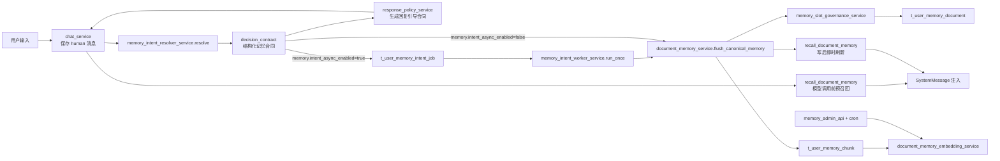
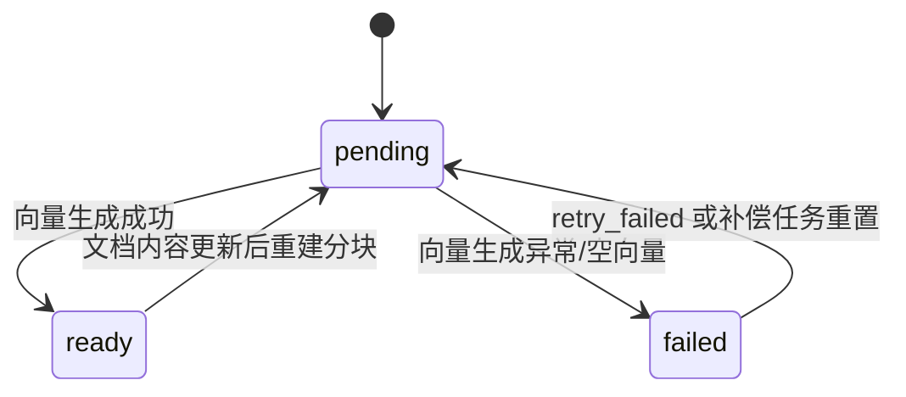

# 用户个性化永久记忆
> 更新时间：2026-03-12
> 适用范围：`chat_db` 中“用户个性化永久记忆（文档主表 + 分块表 + 可选异步队列）”能力  
> 关联实现：`app/services/chat_service.py`、`app/services/memory_intent_resolver_service.py`、`app/services/memory_intent_llm_service.py`、`app/services/response_policy_service.py`、`app/services/memory_slot_governance_service.py`、`app/services/document_memory_service.py`、`app/services/document_memory_embedding_service.py`、`app/repositories/document_memory_repo.py`、`app/api/v1/endpoints/memory_admin_api.py`

---

## 1. 设计目标与非目标

### 1.1 设计目标

1. 永久记忆采用“文档化知识沉淀”，不再以 KV 作为长期知识主载体。  
2. 所有记忆读写强制 `user_id` 过滤，保证多用户隔离。  
3. 主存储放在数据库（`t_user_memory_document` + `t_user_memory_chunk`），不依赖文件系统。  
4. 召回路径收敛为 `memory_search -> chunk_text/citation 注入`：检索结果直接携带片段与引用，不再维护额外局部精读步骤，避免整文塞进上下文。
5. 采用单一总开关控制记忆链路启停，降低配置复杂度与误配风险。

### 1.2 非目标（当前版本明确不做）

1. 不引入外部向量库（Milvus/Pinecone/ES Vector）。  
2. 不做跨集群分布式记忆复制。  
3. 不做复杂可视化管理 UI（仅提供管理 API + 脚本）。

---

## 2. 总体架构与模块边界



关键约束：

1. 编排层只负责接线、开关与降级，不负责关键词词表语义判定。  
2. 语义识别统一收敛到 `resolver + contract` 层，输出结构化合同后再落库。  
3. 删除记忆的运行时语义是“归档（archive）”，不是物理删行。  
4. 异步任务表仅在开启异步模式时参与主链路，表为空不代表记忆未保存。  

| 模块 | 职责 | 不该负责 | 关键入口 |
|---|---|---|---|
| 编排层 | 保存 human 消息、调用预召回、选择同步/异步分支、注入上下文 | 关键词硬编码判定“这是不是记忆” | `app/services/chat_service.py` |
| 意图解析层 | 基于当前输入、线程历史、active/archived 候选生成结构化 `decision_contract` | 直接写 DB / 直接拼回复文案 | `app/services/memory_intent_resolver_service.py`、`app/services/memory_intent_llm_service.py` |
| 回复策略层 | 根据持久化结果生成与数据库状态一致的回复引导合同 | 决定数据库写入目标 | `app/services/response_policy_service.py` |
| 槽位治理层 | 统一 `slot_key`、去重、同槽位覆盖、归档冲突处理、乱序保护 | 感知对话编排细节 | `app/services/memory_slot_governance_service.py` |
| 记忆服务层 | 按合同 flush、构建 `daily/preference` 文档、分块、召回、预算裁剪 | 直接做关键词语义识别 | `app/services/document_memory_service.py` |
| 异步 Worker 层 | 消费 `t_user_memory_intent_job`，在后台完成 resolver + flush | 参与同步直写路径 | `app/services/memory_intent_worker_service.py` |
| 仓储层 | 两表读写、混合检索 SQL、队列表状态推进 | 决定业务策略 | `app/repositories/document_memory_repo.py`、`app/repositories/user_memory_intent_job_repo.py` |
| 运维入口 | 重建 embedding、状态观测、失败重试 | 干预主链路语义决策 | `app/api/v1/endpoints/memory_admin_api.py`、`scripts/memory/rebuild_document_embeddings.py` |

---

## 3. 数据模型设计（两表）

### 3.1 文档主表 `t_user_memory_document`

用途：长期记忆正文主真相源（类似 `MEMORY.md` / 日记文档，但主存储在 DB）。

核心字段：

- `user_id`：用户隔离边界。  
- `doc_kind`：当前运行时主要为 `preference / daily`，预留 `session` 等扩展值。  
- `doc_key`：文档键（例如日期 `2026-03-01`）。  
- `slot_key`：槽位键（归一化后），用于“同槽位覆盖/归档/撤销”治理。  
- `operation`：最近一次写入动作（`upsert / archive / drop`）。  
- `last_event_time`：事件时间水位，用于乱序保护（旧事件不覆盖新事件）。  
- `content_md`：文档正文。  
- `content_hash`：文档去重与变更检测。  
- `revision`：文档版本递增。  
- `source/scope/scope_ref`：来源与作用域控制。  

关键索引：

1. `idx_user_memory_document_active_unique`：`(user_id, doc_kind, doc_key)`（`status='active'` 唯一）。  
2. `idx_user_memory_document_user_update`：按用户最近更新时间排序。  
3. `idx_user_memory_document_user_scope`：按用户、来源、作用域过滤。
4. `idx_user_memory_document_user_slot`：`(user_id, slot_key, status)`，用于按槽位筛选治理对象。  
5. `idx_user_memory_document_slot_event`：`(user_id, slot_key, last_event_time)`，用于同槽位事件有序处理。  

兼容性说明（2026-03-04）：

- 新增 Alembic 迁移 `20260304_0020`，用于为历史库补齐 `slot_key / operation / last_event_time` 及相关索引。
- 若后台出现 `UndefinedColumn: t_user_memory_document.slot_key does not exist`，说明未执行该迁移。

### 3.2 分块检索表 `t_user_memory_chunk`

用途：承载 `memory_search` 的检索单元，支持全文与向量融合排序。

核心字段：

- `doc_id + user_id`：文档归属与用户隔离。  
- `chunk_no/start_line/end_line`：片段定位。  
- `chunk_text/chunk_hash`：片段文本与幂等哈希。  
- `chunk_tsv`：`TSVECTOR` 生成列（FTS）。  
- `embedding`：`VECTOR(2048)`。  
- `embedding_status`：`pending / ready / failed`。  
- `embedding_retry_count/embedding_error`：补偿治理。  

关键索引：

1. `idx_user_memory_chunk_user_doc_no`：按文档顺序读取。  
2. `idx_user_memory_chunk_embedding_status`：补偿任务扫描 pending/failed。  
3. `idx_user_memory_chunk_tsv`：FTS GIN 索引。  
4. `idx_user_memory_chunk_unique_hash`：`(user_id, doc_id, chunk_hash)` 唯一去重。

### 3.3 向量索引策略说明

当前 `embedding` 维度是 `2048`，而 pgvector 的 `ivfflat/hnsw` 在当前约束下受 `2000` 维上限影响，因此**当前版本不创建 ANN 向量索引**；混合检索策略为：

1. 先按 `user_id + source + active status` 严格过滤候选集。  
2. 在候选集上做精确向量相似度计算。  
3. 与 FTS 分数融合排序。

---

## 4. 写入策略设计（resolver + contract + flush）

### 4.1 触发时机与前置条件

`chat_service` 在保存本轮 human 消息后，才进入记忆处理；这样可以保证 `source_message_id` 成为后续合同、文档、归档与排障的统一锚点。

前置条件：

1. `feature.enable_document_memory=true`。  
2. 当前消息存在 `user_id` 与 `source_message_id`。  
3. 记忆合同未被安全规则 reject。  

若任一前置条件不满足，系统直接跳过记忆链路，不影响主对话回答。

### 4.2 运行时判定：resolver 输出结构化合同

当前版本不再在 `chat_service` 中依赖关键词词表直接判断“保存/删除哪条记忆”，而是先调用 `memory_intent_resolver_service.resolve(...)`，由 resolver 输出结构化 `decision_contract`。

合同核心字段：

| 字段 | 含义 |
|---|---|
| `decision` | `accept / reject` |
| `reason_code` | 本次接受/拒绝的原因，例如 `accepted`、`reference_archive_resolved` |
| `audit.decision_id` | 决策审计 ID，用于串联日志、文档、排障 |
| `memories[].slot_key` | 归一化槽位键，作为同槽位覆盖/归档的主键 |
| `memories[].doc_kind` | 目标文档类型，当前运行时以 `preference` / `daily` 为主 |
| `memories[].operation` | `upsert / archive` |
| `memories[].canonical_text` | 标准化语义表述，用于正文与摘要 |
| `memories[].normalized_value` | 规整后的值，用于去重和展示 |
| `memories[].memory_kind` | 事实类 / 偏好类 / 助手人设类等细分类型 |

“删除这个记忆”这类指代式输入，会结合最近线程消息、active 候选、archived 候选进行引用解析；若已删过同一槽位，允许幂等返回 `archive` 合同。

### 4.3 同步与异步两条写入分支

| 分支 | 触发条件 | 行为 | 观测特征 |
|---|---|---|---|
| 同步直写 | `memory.intent_async_enabled=false` | 主链路内 `resolve -> flush_canonical_memory -> 写后 recall` | `t_user_memory_document` 有变化，而 `t_user_memory_intent_job` 可为空 |
| 异步入队 | `memory.intent_async_enabled=true` | 主链路只入队 `t_user_memory_intent_job`，由 worker 后台消费 | 先看到 job，再看到 document/chunk 变化 |

这也是排障时最容易误判的点：**异步任务表为空，不一定是失败，也可能是当前服务运行在同步直写模式。**

异步 Worker 的运行时约束：

1. 空闲轮询使用退避节奏：`0.5s -> 1s -> 2s -> 5s`，拿到任务后立即回到最小轮询间隔。  
2. 背压观测（`pending/dead_letter/latency`）按 worker 本地短窗口复用快照，避免每轮空轮询都重复统计整张任务表。  
3. 原始 SQL 日志默认关闭；若需排查 ORM/SQL 细节，应短时开启 `DB_ECHO=true`，排障后恢复。  

### 4.4 flush 落库语义

`document_memory_service.flush_canonical_memory(...)` 收到合同后，按 `doc_kind + slot_key + operation` 决定最终数据库状态：

1. `doc_kind=preference + operation=upsert`  
   - 以 `slot_key` 为主键语义更新/覆盖活跃记忆；  
   - 写入 `t_user_memory_document`；  
   - 重建 `t_user_memory_chunk`，新 chunk 初始为 `pending`。  
2. `doc_kind=preference + operation=archive`  
   - 归档同一 `slot_key` 的 active 文档；  
   - 文档保留历史痕迹，但 `status=archived`、`operation=archive`；  
   - 这是当前“删除成功”的数据库语义，不是物理删行。  
3. `doc_kind=daily`  
   - 追加/更新当日日记型记忆；  
   - 同步写 `summary_md`，便于后台管理与检索。  

为保证回复与数据库状态一致，`response_policy_service` 会根据 `persisted_doc_count + decision_contract` 生成响应指导合同，避免出现“回复说删除了，但数据库状态没对齐”的口径漂移。

### 4.5 幂等、乱序与去重

| 层级 | 机制 | 作用 |
|---|---|---|
| 消息级 | `source_message_id` | 将一次用户输入绑定到唯一来源消息 |
| 合同级 | `slot_key + operation` | 同槽位覆盖/归档收口 |
| 事件级 | `last_event_time` | 防止旧事件覆盖新事件 |
| 文档级 | `content_hash` | 内容无变化时避免无意义 `revision` 递增 |
| 分块级 | `chunk_hash` | 分块替换保持幂等 |
| 删除级 | archived 候选 + recent archived 候选 | 支持重复确认删除的幂等响应 |

---

## 5. 召回策略设计（memory_search -> chunk_text/citation 注入）

### 5.1 对话接线位置

`chat_service` 在模型调用前执行记忆召回：

1. 读取开关：`feature.enable_document_memory`（单开关）。  
2. 执行 `recall_document_memory(...)`。  
3. 将返回内容作为 `SystemMessage` 注入。

同时在本轮用户消息落库后，若 flush 成功，会再做一次即时 recall，确保本轮新增记忆可立即参与回答。

### 5.2 检索与精读

1. `memory_search`：在 `t_user_memory_chunk` 做混合排序，返回 `chunk_text + score + citation`。
2. `recall`：直接基于检索结果中的 `chunk_text + citation` 生成注入上下文，不再维护 `memory_get` 二次读取链路。
3. 引用格式统一为：`memory://user/{user_id}/{doc_kind}/{doc_key}#Lx-Ly`。
4. 注入前会过滤 `来源线程/来源消息` 等元数据行，避免 UUID/消息号污染模型上下文。

### 5.3 混合评分

- `text_score = ts_rank(chunk_tsv, plainto_tsquery(...))`  
- `vector_score = 1 - (embedding <=> query_embedding)`  
- `final_score = text_weight * text_score + vector_weight * vector_score`

当 query embedding 生成失败时，自动降级为纯文本检索（`vector_weight=0`）。

### 5.4 预算控制

预算配置（可通过 `t_system_config` 与环境变量回退）：

1. `memory.document.max_results`（默认 6）。  
2. `memory.document.max_injected_chars`（默认 1200）。  
3. `memory.document.hybrid.min_score`（默认 0.05）。

超预算时按召回顺序截断低优先片段，确保不挤占主对话上下文。

> 写入补充说明：`daily` 文档会同步写入 `summary_md`（从用户陈述提炼的短摘要），便于后台列表查询与管理展示。

---

## 6. Embedding 生命周期与运行方式

### 6.1 生命周期



### 6.2 运行方式对比

| 方案 | 优点 | 缺点 | 成本 | 推荐度 |
|---|---|---|---|---|
| 手动脚本触发 | 实现最简单、可控 | 运维依赖人工，容易滞后 | 低 | ⭐⭐⭐ |
| 管理 API 触发 | 可在线重建/重试，便于后台集成 | 仍需人工或上层平台触发 | 中 | ⭐⭐⭐⭐ |
| 定时补偿任务（Cron） | 自动清理 pending/failed，最终一致性更稳 | 需要运维配置调度与监控 | 中 | ⭐⭐⭐⭐⭐ |

推荐生产策略：**定时补偿为主 + 管理 API 手动兜底**。

### 6.3 当前可用入口

1. API：  
   - `POST /api/v1/memory-admin/document/rebuild-embeddings`  
   - `GET /api/v1/memory-admin/document/embedding-status`  
   - `POST /api/v1/memory-admin/document/retry-failed`
2. 脚本：`venv/bin/python scripts/memory/rebuild_document_embeddings.py --limit 200 --status pending,failed`  
3. Cron 包装脚本：`scripts/cron/document_memory_embedding_compensation.sh`
4. 服务层 canonical 入口：`app/services/document_memory_embedding_service.py::compensate_pending_embeddings`

---

## 7. 与 KV / 异步体系的关系与迁移策略

### 7.1 当前运行时真相源

| 表 | 当前角色 | 是否作为长期记忆真相源 | 说明 |
|---|---|---|---|
| `t_user_memory_document` | 主文档表 | 是 | 当前长期记忆、删除归档、槽位治理都以此为准 |
| `t_user_memory_chunk` | 检索分块表 | 是（检索索引层） | 承载 `memory_search -> chunk_text/citation 注入` 召回 |
| `t_user_memory_intent_job` | 可选异步队列 | 否 | 只在 `memory.intent_async_enabled=true` 时承载入队状态 |
| `t_user_memory` | 旧 KV 兼容层 | 否 | 仅保留历史兼容、迁移与观测用途，不再是默认运行时真相源 |

因此，判断“记忆是否保存成功/删除成功”时，优先看 `t_user_memory_document`，不要只看 `t_user_memory`。

### 7.2 为什么“旧表没数据”不等于失败

1. 同步直写模式下，`t_user_memory_intent_job` 为空是正常现象。  
2. 删除成功后，`t_user_memory_document` 往往仍保留该文档，但会变成 `status=archived`；这不是失败，而是有意保留审计痕迹。  
3. `t_user_memory_chunk.embedding_status=pending` 只表示向量补偿尚未完成，不等于记忆正文未保存。  
4. `t_user_memory` 为空只说明旧 KV 口径没有记录，不说明当前文档记忆没有落库。  

### 7.3 迁移建议（一次性）

1. 将 `t_user_memory` 活跃项迁移为 `doc_kind=preference` 的文档记忆。  
2. 验证 `t_user_memory_document` / `t_user_memory_chunk` 召回后，再冻结旧 KV 写入口。  
3. 若需要后台异步化，再单独开启 `memory.intent_async_enabled`，不要同时依赖两套真相源。  

### 7.4 回滚策略（单开关）

运行异常时仅需关闭：

- `feature.enable_document_memory`

关闭后主链路不再读写 document memory；若异步模式曾开启，任务队列表可独立清理，不影响旧数据留存。

---

## 8. 查询与排障（运维速查）

### 8.1 标准排障顺序

1. 先查 `t_chat_message`，确认 human / ai 消息是否真的入库。  
2. 再查 `t_user_memory_document`，确认是 `active` 还是 `archived`。  
3. 再查 `t_user_memory_chunk`，确认分块与 embedding 状态。  
4. 只有在异步模式开启时，才查 `t_user_memory_intent_job`。  
5. 最后再看 `t_user_memory`，仅用于兼容/迁移验证。  

### 8.2 查询某用户最近有效记忆

```sql
SELECT id, doc_kind, doc_key, slot_key, status, operation, revision, update_time
FROM t_user_memory_document
WHERE user_id = :user_id
  AND status = 'active'
ORDER BY update_time DESC
LIMIT 20;
```

### 8.3 查询某槽位是否已保存 / 已删除

```sql
SELECT
  id,
  doc_kind,
  doc_key,
  slot_key,
  status,
  operation,
  source_thread_id,
  source_message_id,
  summary_md,
  create_time,
  update_time
FROM t_user_memory_document
WHERE user_id = :user_id
  AND slot_key = :slot_key
ORDER BY id DESC;
```

判读规则：

- 存在 `status='active'`：当前记忆仍生效，可继续召回。  
- 只有 `status='archived'`：当前删除已生效，但保留归档审计痕迹。  
- 完全无记录：才是未写入或检索口径错误。  

### 8.4 查询删除后是否还有活跃残留

```sql
SELECT COUNT(*) AS active_count
FROM t_user_memory_document
WHERE user_id = :user_id
  AND slot_key = :slot_key
  AND status = 'active';
```

`active_count=0` 才表示该槽位已不再被当作有效长期记忆召回。

### 8.5 查询异步任务状态（仅异步模式）

```sql
SELECT id, source_thread_id, source_message_id, status, attempt_count, error_message, update_time
FROM t_user_memory_intent_job
WHERE user_id = :user_id
ORDER BY id DESC
LIMIT 50;
```

### 8.6 查询向量状态分布

```sql
SELECT embedding_status, COUNT(*) AS cnt
FROM t_user_memory_chunk
WHERE user_id = :user_id
GROUP BY embedding_status;
```

### 8.7 查询失败分块 TopN

```sql
SELECT id, doc_id, embedding_retry_count, embedding_error, update_time
FROM t_user_memory_chunk
WHERE user_id = :user_id
  AND embedding_status = 'failed'
ORDER BY update_time DESC
LIMIT 100;
```

### 8.8 常见误判与正确解释

| 现象 | 正确解释 |
|---|---|
| `t_user_memory` 没数据 | 不能直接判失败；当前长期记忆主真相源是 `t_user_memory_document` |
| `t_user_memory_intent_job` 没数据 | 可能运行在同步直写模式，属正常 |
| 删除后文档行还在 | 只要 `status='archived'`，就代表删除语义已经生效 |
| chunk 还是 `pending` | 只是向量补偿未完成，不代表正文没落库 |

---

## 9. 已知限制与演进路线

### 9.1 已知限制

1. 向量维度 2048 导致当前无法启用 pgvector ANN 索引（`ivfflat/hnsw`）。  
2. flush 规则当前以触发词与轻量规则为主，仍有误召回/漏召回空间。  
3. 召回预算以字符数为主，尚未引入 token 级精确预算器。

### 9.2 下一步演进建议

1. 引入降维或 halfvec 策略，评估 ANN 可行性。  
2. 增加语义去重与冲突折叠（同义事实合并、过期事实淘汰）。  
3. 增加记忆质量指标：命中率、引用覆盖率、注入后回答提升率。  
4. 补齐后台页面，统一查看文档、分块、状态与补偿任务。
