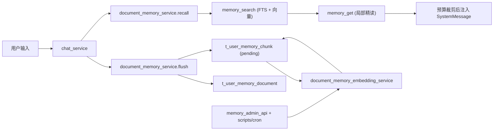
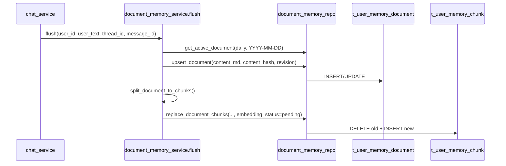
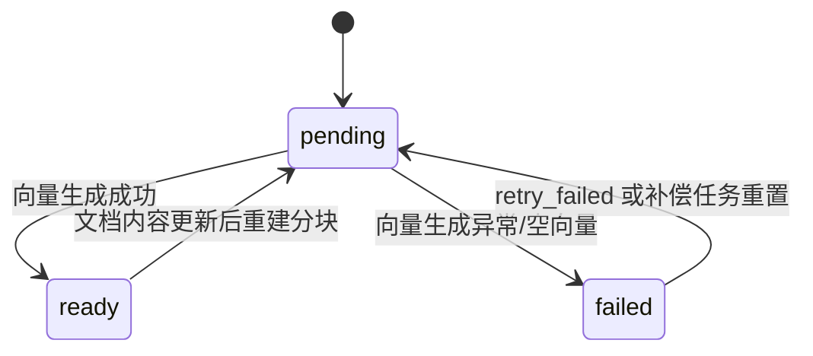

# 用户个性化永久记忆

> 更新时间：2026-03-01  
> 适用范围：`chat_db` 中“用户个性化永久记忆（两表）+ 混合检索（FTS+向量）”能力  
> 关联实现：`app/services/document_memory_service.py`、`app/services/document_memory_embedding_service.py`、`app/repositories/document_memory_repo.py`、`app/services/chat_service.py`、`app/api/v1/endpoints/memory_admin_api.py`

---

## 1. 设计目标与非目标

### 1.1 设计目标

1. 永久记忆采用“文档化知识沉淀”，不再以 KV 作为长期知识主载体。  
2. 所有记忆读写强制 `user_id` 过滤，保证多用户隔离。  
3. 主存储放在数据库（`t_user_memory_document` + `t_user_memory_chunk`），不依赖文件系统。  
4. 召回路径对齐 `memory_search -> memory_get`：先检索片段，再精读局部，避免整文塞进上下文。  
5. 采用单一总开关控制记忆链路启停，降低配置复杂度与误配风险。

### 1.2 非目标（当前版本明确不做）

1. 不引入外部向量库（Milvus/Pinecone/ES Vector）。  
2. 不做跨集群分布式记忆复制。  
3. 不做复杂可视化管理 UI（仅提供管理 API + 脚本）。

---

## 2. 总体架构与模块边界



| 模块 | 职责 | 关键入口 |
|---|---|---|
| 编排层 | 在对话主链路接入记忆召回与记忆写入，控制开关与降级 | `app/services/chat_service.py` |
| 记忆服务层 | 负责 flush、分块、检索、精读、预算裁剪 | `app/services/document_memory_service.py` |
| 向量补偿层 | 负责 pending/failed 分块向量化与重试 | `app/services/document_memory_embedding_service.py` |
| 仓储层 | 负责两表读写、混合检索 SQL、状态更新 | `app/repositories/document_memory_repo.py` |
| 运维入口 | 提供重建、状态、失败重试 | `app/api/v1/endpoints/memory_admin_api.py`、`scripts/memory/rebuild_document_embeddings.py` |

---

## 3. 数据模型设计（两表）

### 3.1 文档主表 `t_user_memory_document`

用途：长期记忆正文主真相源（类似 `MEMORY.md` / 日记文档，但主存储在 DB）。

核心字段：

- `user_id`：用户隔离边界。  
- `doc_kind`：`long_term / daily / session`。  
- `doc_key`：文档键（例如日期 `2026-03-01`）。  
- `content_md`：文档正文。  
- `content_hash`：文档去重与变更检测。  
- `revision`：文档版本递增。  
- `source/scope/scope_ref`：来源与作用域控制。  

关键索引：

1. `idx_user_memory_document_active_unique`：`(user_id, doc_kind, doc_key)`（`status='active'` 唯一）。  
2. `idx_user_memory_document_user_update`：按用户最近更新时间排序。  
3. `idx_user_memory_document_user_scope`：按用户、来源、作用域过滤。

### 3.2 分块检索表 `t_user_memory_chunk`

用途：承载 `memory_search` 的检索单元，支持全文与向量融合排序。

核心字段：

- `doc_id + user_id`：文档归属与用户隔离。  
- `chunk_no/start_line/end_line`：片段定位。  
- `chunk_text/chunk_hash`：片段文本与幂等哈希。  
- `chunk_tsv`：`TSVECTOR` 生成列（FTS）。  
- `embedding`：`VECTOR(2048)`。  
- `embedding_status`：`pending / ready / failed`。  
- `embedding_retry_count/embedding_error`：补偿治理。  

关键索引：

1. `idx_user_memory_chunk_user_doc_no`：按文档顺序读取。  
2. `idx_user_memory_chunk_embedding_status`：补偿任务扫描 pending/failed。  
3. `idx_user_memory_chunk_tsv`：FTS GIN 索引。  
4. `idx_user_memory_chunk_unique_hash`：`(user_id, doc_id, chunk_hash)` 唯一去重。

### 3.3 向量索引策略说明

当前 `embedding` 维度是 `2048`，而 pgvector 的 `ivfflat/hnsw` 在当前约束下受 `2000` 维上限影响，因此**当前版本不创建 ANN 向量索引**；混合检索策略为：

1. 先按 `user_id + source + active status` 严格过滤候选集。  
2. 在候选集上做精确向量相似度计算。  
3. 与 FTS 分数融合排序。

---

## 4. 写入策略设计（flush/沉淀）

### 4.1 触发策略

`document_memory_service.flush` 在满足以下任一条件时写入：

1. 显式记忆词触发（如“记住/长期/以后都/偏好”）。  
2. 轻量事实表达触发（如“我是/我住/我偏好/我的目标”）。

### 4.2 写入流程



### 4.3 幂等与去重

| 层级 | 机制 | 当前行为 |
|---|---|---|
| 文档级 | `content_hash` + upsert | 内容未变化时不递增 `revision` |
| 分块级 | `chunk_hash` 唯一键 | `replace_document_chunks` 全量替换后保持幂等 |
| 召回级 | 按分数与预算截断 | 限制重复片段进入上下文 |

---

## 5. 召回策略设计（memory_search -> memory_get）

### 5.1 对话接线位置

`chat_service` 在模型调用前执行记忆召回：

1. 读取开关：`feature.enable_document_memory`（单开关）。  
2. 执行 `recall_document_memory(...)`。  
3. 将返回内容作为 `SystemMessage` 注入。

同时在本轮用户消息落库后，若 flush 成功，会再做一次即时 recall，确保本轮新增记忆可立即参与回答。

### 5.2 检索与精读

1. `memory_search`：在 `t_user_memory_chunk` 做混合排序，返回 `snippet + score + citation`。  
2. `memory_get`：按 `doc_id + 行号区间` 局部读取，避免整文注入。  
3. 引用格式统一为：`memory://user/{user_id}/{doc_kind}/{doc_key}#Lx-Ly`。

### 5.3 混合评分

- `text_score = ts_rank(chunk_tsv, plainto_tsquery(...))`  
- `vector_score = 1 - (embedding <=> query_embedding)`  
- `final_score = text_weight * text_score + vector_weight * vector_score`

当 query embedding 生成失败时，自动降级为纯文本检索（`vector_weight=0`）。

### 5.4 预算控制

预算配置（可通过 `t_system_config` 与环境变量回退）：

1. `memory.document.max_results`（默认 6）。  
2. `memory.document.max_injected_chars`（默认 1200）。  
3. `memory.document.hybrid.min_score`（默认 0.05）。

超预算时按召回顺序截断低优先片段，确保不挤占主对话上下文。

---

## 6. Embedding 生命周期与运行方式

### 6.1 生命周期



### 6.2 运行方式对比

| 方案 | 优点 | 缺点 | 成本 | 推荐度 |
|---|---|---|---|---|
| 手动脚本触发 | 实现最简单、可控 | 运维依赖人工，容易滞后 | 低 | ⭐⭐⭐ |
| 管理 API 触发 | 可在线重建/重试，便于后台集成 | 仍需人工或上层平台触发 | 中 | ⭐⭐⭐⭐ |
| 定时补偿任务（Cron） | 自动清理 pending/failed，最终一致性更稳 | 需要运维配置调度与监控 | 中 | ⭐⭐⭐⭐⭐ |

推荐生产策略：**定时补偿为主 + 管理 API 手动兜底**。

### 6.3 当前可用入口

1. API：  
   - `POST /api/v1/memory-admin/document/rebuild-embeddings`  
   - `GET /api/v1/memory-admin/document/embedding-status`  
   - `POST /api/v1/memory-admin/document/retry-failed`
2. 脚本：`venv/bin/python scripts/memory/rebuild_document_embeddings.py --limit 200 --status pending,failed`  
3. Cron 包装脚本：`scripts/cron/document_memory_embedding_compensation.sh`

---

## 7. 与 KV 体系的关系与迁移策略

### 7.1 当前目标（纯文档）

1. 对话链路只读写 `t_user_memory_document/t_user_memory_chunk`。  
2. `t_user_memory` 仅作为历史兼容数据来源，不再参与运行时 recall/flush。  
3. 新增与管理统一采用“文档正文 + 分块检索”模式，不再按 KV 读写。

### 7.2 迁移建议（一次性）

1. 执行一次性迁移：将 `t_user_memory` 活跃项转换为 `doc_kind=preference` 文档。  
2. 迁移后运行时只启用 `feature.enable_document_memory=true`。  
3. 验证通过后冻结 `t_user_memory` 写入路径（只读/归档）。

### 7.3 回滚策略（单开关）

运行异常时仅需关闭：

- `feature.enable_document_memory`

---

## 8. 查询与排障（运维速查）

### 8.1 查询某用户最近文档

```sql
SELECT id, doc_kind, doc_key, revision, update_time
FROM t_user_memory_document
WHERE user_id = :user_id AND status = 'active'
ORDER BY update_time DESC
LIMIT 20;
```

### 8.2 查询向量状态分布

```sql
SELECT embedding_status, COUNT(*) AS cnt
FROM t_user_memory_chunk
WHERE user_id = :user_id
GROUP BY embedding_status;
```

### 8.3 查询失败分块 TopN

```sql
SELECT id, doc_id, embedding_retry_count, embedding_error, update_time
FROM t_user_memory_chunk
WHERE user_id = :user_id
  AND embedding_status = 'failed'
ORDER BY update_time DESC
LIMIT 100;
```

---

## 9. 已知限制与演进路线

### 9.1 已知限制

1. 向量维度 2048 导致当前无法启用 pgvector ANN 索引（`ivfflat/hnsw`）。  
2. flush 规则当前以触发词与轻量规则为主，仍有误召回/漏召回空间。  
3. 召回预算以字符数为主，尚未引入 token 级精确预算器。

### 9.2 下一步演进建议

1. 引入降维或 halfvec 策略，评估 ANN 可行性。  
2. 增加语义去重与冲突折叠（同义事实合并、过期事实淘汰）。  
3. 增加记忆质量指标：命中率、引用覆盖率、注入后回答提升率。  
4. 补齐后台页面，统一查看文档、分块、状态与补偿任务。
