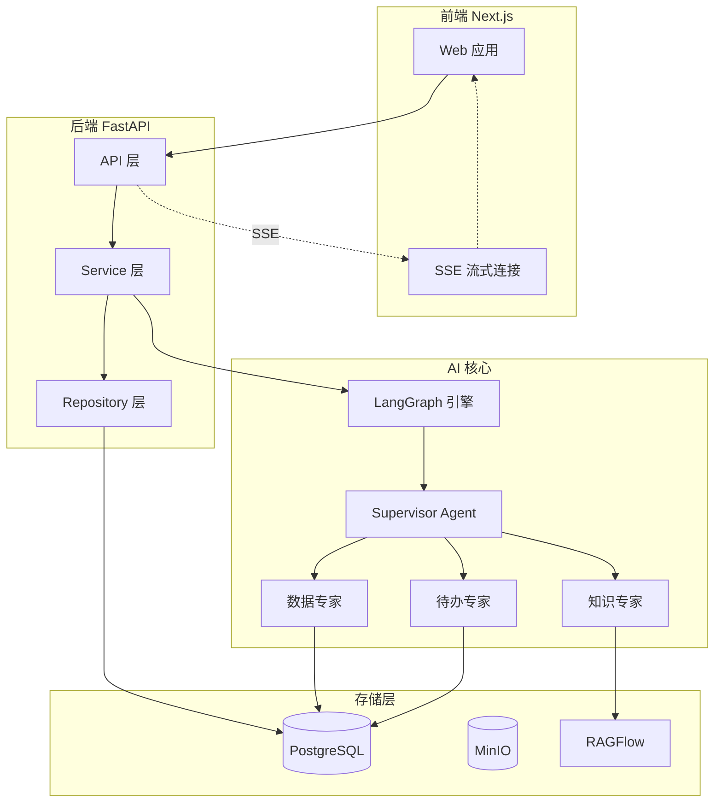
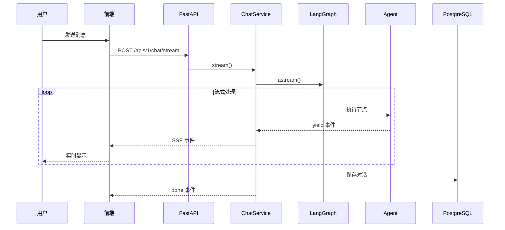

# 系统总览

> 本文档提供系统的宏观架构视图，帮助快速理解项目全貌。

---

## 项目简介

**一句话描述**: 基于 LangGraph 的多智能体 AI 助手系统，支持聊天、待办管理和数据分析。

## 技术栈

| 分类 | 技术 | 版本 |
|------|------|------|
| 后端框架 | FastAPI | 0.115+ |
| AI 框架 | LangGraph + LangChain | 1.0+ |
| ORM | SQLAlchemy | 2.0+ |
| 前端框架 | Next.js + React | 15 / 19 |
| 样式 | TailwindCSS | 4.0+ |
| 数据库 | PostgreSQL + pgvector | 16+ |
| 对象存储 | MinIO | 最新版 |

---

## 高层架构图



---

## 核心模块

### 1. 多智能体系统

采用 **Supervisor 模式** 的多智能体架构：

| 组件 | 职责 |
|------|------|
| Supervisor | 意图理解、任务路由、简单任务直接处理 |
| 数据专家 | 复杂数据分析、SQL 生成、图表绘制 |
| 待办专家 | 任务管理、多轮澄清、确认流程 |
| 知识专家 | 知识库检索 (RAGFlow 集成) |

### 2. SSE 流式通信

实时 Token 流 + 结构化事件：
- `token`: AI 文本输出
- `tool_start/end`: 工具调用
- `result`: 结构化结果（图表、列表）
- `interrupt`: 人机协作中断
- `done`: 流结束（包含 `additional_kwargs` 用于结构化数据同步）

**数据同步保障**：
- 同步追踪日志（`[SYNC-TRACE]`）+ 内容 hash 对比
- 基于 hash 的去重机制，避免重复保存
- 结构化数据收集，确保 TodoList 等卡片数据正确传递

### 3. 管理后台

提供 Web 管理界面，用于运维和配置：

| 模块 | 路径前缀 | 功能 |
|------|----------|------|
| 系统配置 | `/system-admin` | AI、RAGFlow、MCP 等运行参数管理 |
| LLM 配置 | `/llm-admin` | 提供商/模型 CRUD、默认模型设置 |
| 技能管理 | `/skill-admin` | 技能库查询、向量索引重建 |
| 数据访问控制 | `/access-admin` | 表白名单/黑名单、SQL 权限测试 |

### 4. 持久化层

| 数据库 | 用途 |
|--------|------|
| chat_db | 对话历史、待办事项、用户信息、LLM配置、系统配置、技能库 |
| data_db | 业务数据查询（问数功能） |

---

## 目录结构

```
fastapi/
├── app/                    # 后端应用
│   ├── api/                # API 端点
│   ├── ai/                 # AI 模块（核心）
│   │   ├── workflow/       # LangGraph 图
│   │   ├── agents/         # Agent 实现
│   │   ├── tools/          # 工具集
│   │   └── prompts/        # Prompt 管理
│   ├── services/           # 业务逻辑
│   ├── repositories/       # 数据访问
│   ├── models/             # ORM 模型
│   └── core/               # 核心基础设施
│
├── web/                    # 前端应用
│   ├── src/app/            # 页面路由
│   ├── src/components/     # React 组件
│   └── src/hooks/          # 自定义 Hooks
│
├── docs/                   # 文档目录
├── data/                   # 数据文件
└── scripts/                # 工具脚本
```

---

## 数据流

### 请求处理流程



> 完整的端到端时序图（含前端组件、SSE 事件类型、LangGraph 节点流转）见 [多智能体系统详解 - 第 0 章](../代码解读/多智能体系统详解.md#0-端到端全景图)。

---

## 关键路径

| 功能 | 入口文件 |
|------|----------|
| 后端启动 | `app/main.py` |
| AI 核心图 | `app/ai/workflow/multi_agent_graph.py` |
| 前端入口 | `web/src/app/chat/page.tsx` |
| 配置文件 | `.env.dev`, `app/core/config.py` |
| 文档导航 | `docs/SUMMARY.md` |

---

## 相关文档

- [AI模块设计](AI模块设计.md) - AI 模块详细实现
- [后端架构](后端架构.md) - 后端分层设计
- [前端架构](前端架构.md) - 前端组件设计
- [数据库设计](数据库设计.md) - 表结构与关系
