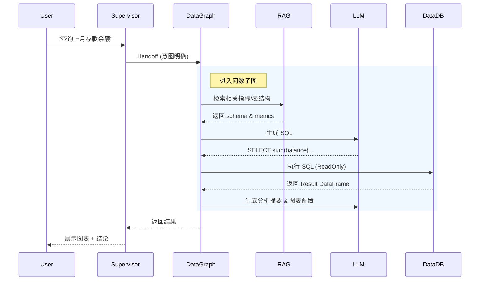

# 系统总览

> 本文档提供系统的宏观架构视图，帮助快速理解项目全貌。

## 文档导航

- 需求主入口：[系统需求](../../产品文档/系统需求.md)
- AI 模块设计：[AI模块设计](AI模块设计.md)
- 后端分层设计：[后端架构](后端架构.md)
- 前端分层设计：[前端架构](前端架构.md)
- 数据与表结构设计：[数据库设计](数据库设计.md)
- 对外接口定义：[接口文档](../../API文档/接口文档.md)
- 新人启动路径：[快速开始](../快速入门/快速开始.md)

---

## 项目简介

**一句话描述**: 基于 **LangGraph & LangChain** 的企业级多智能体 AI 助手，集成 DeepSeek 深度思考能力，支持复杂待办管理、精确问数分析（Text-to-SQL）和企业知识库检索。

## 技术栈

| 分类 | 技术 | 版本 | 说明 |
|------|------|------|------|
| **后端框架** | FastAPI | 0.115+ | 异步高性能 API，生命周期管理 |
| **AI 核心** | LangGraph | 0.2.6+ | 多智能体编排，StateGraph 状态机 |
| **LLM 接入** | LangChain Core | 0.3+ | 模型抽象，支持 DeepSeek/OpenAI/智谱 |
| **ORM** | SQLAlchemy | 2.0+ | 异步数据库操作 |
| **前端框架** | Next.js | 15.4+ | React 19, Server Components |
| **样式库** | TailwindCSS | 4.0+ | 现代 CSS 框架 |
| **组件库** | Radix UI | Latest | 无头组件库，极致可访问性 |
| **数据库** | PostgreSQL | 16+ | 业务存储 + pgvector 向量检索 |
| **对象存储** | MinIO | Latest | 图片、图表、文件存储 |
| **数据迁移** | Alembic | Latest | 数据库版本管理 |

---

## 高层架构图

系统采用 **Supervisor + Subgraph** 的分层多智能体架构，支持复杂任务的路由与子任务处理。

```mermaid
graph TB
    subgraph Frontend [前端 Next.js 15]
        Web[Web UI (React 19)]
        SSE[SSE 流式接收]
        Charts[Recharts 图表]
    end

    subgraph Backend [后端 FastAPI]
        API[API Router]
        Service[业务层 (Chat/Todo/Data)]
        Repo[Repo 层 (CRUD)]
        LLMConfig[LLM 配置服务]
    end

    subgraph AICore [AI 核心 (LangGraph)]
        Supervisor[Supervisor Agent (路由/简单任务)]
        
        subgraph SubGraphs [子图系统]
            DataGraph[问数专家子图]
            TodoGraph[待办专家子图]
        end
        
        Tools[通用工具集 (绘图/搜索)]
    end

    subgraph Storage [双库存储隔离]
        ChatDB[(chat_db\n系统/用户/配置)]
        DataDB[(data_db\n业务/数仓)]
        MinIO[(MinIO\n资产存储)]
    end

    Web <--> |HTTP/SSE| API
    API --> Service
    Service --> AICore
    
    Supervisor --> |Handoff| DataGraph
    Supervisor --> |Handoff| TodoGraph
    Supervisor --> Tools
    
    DataGraph --> |Text-to-SQL| DataDB
    TodoGraph --> |CRUD| ChatDB
    
    Service --> ChatDB
    AICore -.-> |DeepSeek R1| LLMConfig
```

---

## 核心模块详解

### 1. 多智能体系统 (AI Core)

基于 **LangGraph** 构建的有向无环图 (DAG)，采用 Supervisor 模式进行任务分发，支持子图 (Subgraph) 隔离复杂逻辑。

*   **Supervisor (总管)**:
    *   **意图识别**: 分析用户 Query，决定是直接回答、查知识库，还是转交给专家。
    *   **DeepSeek 适配**: 特别优化支持 DeepSeek R1 的 `reasoning_content` (深度思考) 透传前端。
    *   **安全护栏**: 输入/输出内容的安全过滤。

*   **DataExpert (问数专家)**:
    *   **独立子图**: 拥有独立的状态机，处理 Text-to-SQL 全流程。
    *   **RAG 增强**: 基于 `t_metric_definition` (指标库) 和 `t_meta_tables` (元数据) 进行各种 RAG 检索，提高 SQL 准确率。
    *   **权限控制**: 内置 **RLS (行级安全)** 和列级脱敏，确保数据安全。

*   **TodoExpert (待办专家)**:
    *   **独立子图**: 处理待办事项的增删改查 (CRUD)。
    *   **多轮交互**: 支持模糊指令澄清 (Clarification)，复杂时间解析 (ReAct 循环)。

*   **KnowledgeExpert (知识专家)**:
    *   **RAGFlow 集成**: 连接企业知识库，支持文档检索与问答。

### 2. 流式通信协议 (Streaming)

前端与后端通过标准 SSE (Server-Sent Events) 通信，协议升级支持结构化数据：

*   `token`: 文本流 (打字机效果)。
*   `thinking`: 深度思考过程 (DeepSeek R1/O1 风格，前端可折叠展示)。
*   `tool_start/end`: 工具调用状态与结果。
*   `result`: **结构化数据块** (Charts, Tables, JSON)，用于前端渲染富UI。
*   `interrupt`: 人机协作中断信号 (Human-in-the-loop)，如需用户确认执行高风险 SQL。

### 3. 双数据库架构 (Dual-DB)

为了安全与解耦，系统严格物理隔离了**系统库**与**业务库**：

| 数据库 | Schema | 描述 | 权限 |
|--------|--------|------|------|
| **chat_db** | `public` | 存储聊天记录、用户、待办、系统配置、Agent 技能 | 系统读写 |
| **data_db** | `fdmdata` | 金融业务事实表 (存贷款等) | **只读** (问数) |
| **data_db** | `sdmdata` | 维度表 (机构、日期等) | **只读** (问数) |
| **data_db** | `public` | 问数元数据 (指标定义、表结构描述) | 系统读写 |

### 4. 管理后台

提供完善的配置管理界面，支持热更新：

*   **LLM 管理**: 动态配置模型 (OpenAI/DeepSeek/Ollama)，无需重启。
*   **指标管理**: 维护业务指标口径 (Metric Definitions)，支持 AI 自动提取。
*   **权限管理**: 配置表级、行级 (RLS) 数据访问权限。
*   **技能管理**: 管理 Agent 的 Tool/Skill 向量索引。

---

## 目录结构

```bash
fastapi/
├── app/
│   ├── ai/                 # AI 核心逻辑
│   │   ├── workflow/       # LangGraph 定义 (Subgraphs)
│   │   ├── agents/         # Agent 具体实现
│   │   ├── tools/          # 工具函数 (Vanna/Tavily/Tools)
│   │   └── prompts/        # Prompt 模板管理
│   ├── api/                # API 路由层 (v1)
│   ├── core/               # 核心配置 (Config/Logging)
│   ├── db/                 # 数据库连接与 Session
│   ├── models/             # SQLAlchemy ORM 模型
│   ├── schemas/            # Pydantic 数据验证
│   ├── services/           # 业务逻辑服务
│   └── repositories/       # 数据访问层 (DAL)
├── web/                    # Next.js 前端
│   ├── src/app/            # App Router 页面
│   ├── src/components/     # React 组件 (Atomic Design)
│   └── src/lib/            # 前端工具库
├── docs/                   # 项目文档
└── data/                   # 初始数据与迁移脚本
```

---

## 关键数据流

### 问数查询 (Text-to-SQL)



---

## 维护记录

- **2025-02**: 升级 Next.js 15 & React 19，引入 Tailwind v4。
- **2025-01**: 架构升级为 LangGraph Subgraph 模式；支持 DeepSeek R1 思考模型。
- **2024-12**: 拆分 chat_db 与 data_db；引入指标管理模块。
