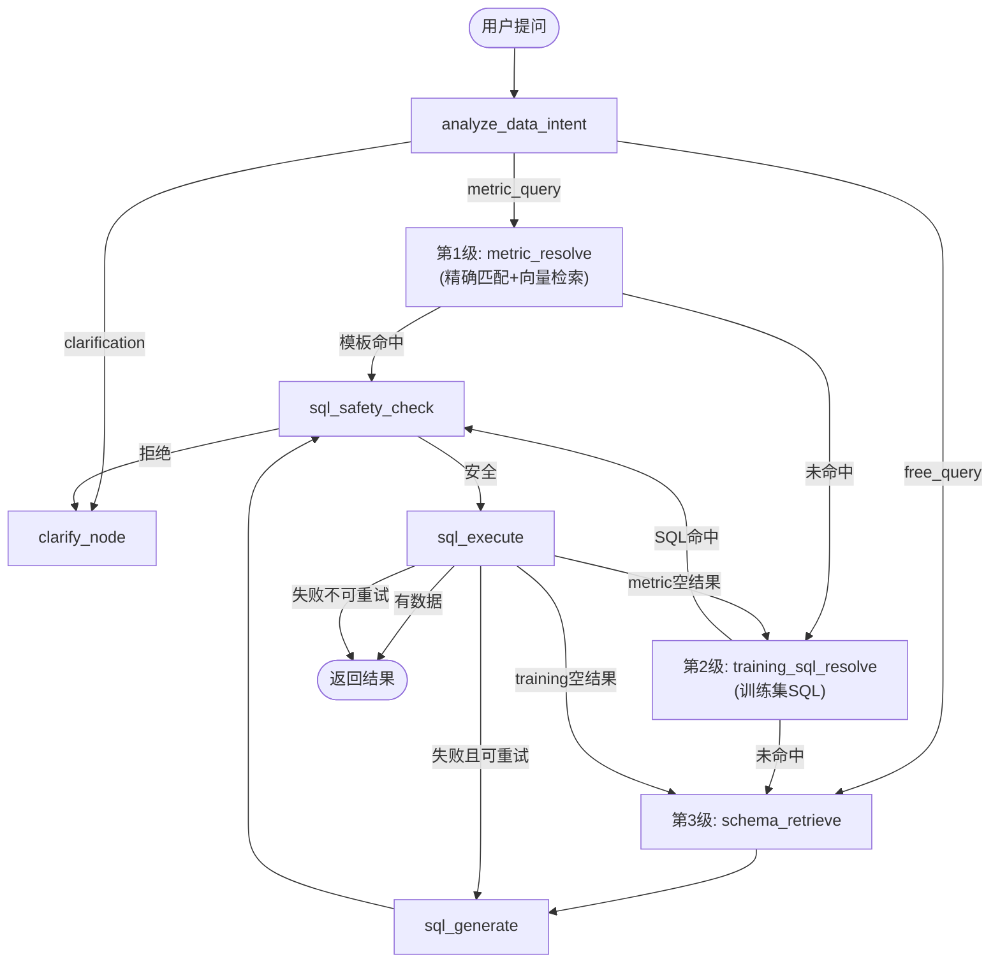
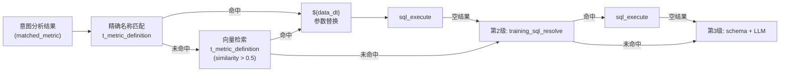
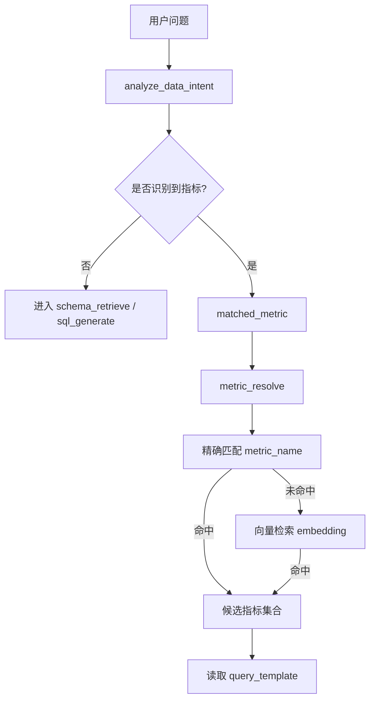
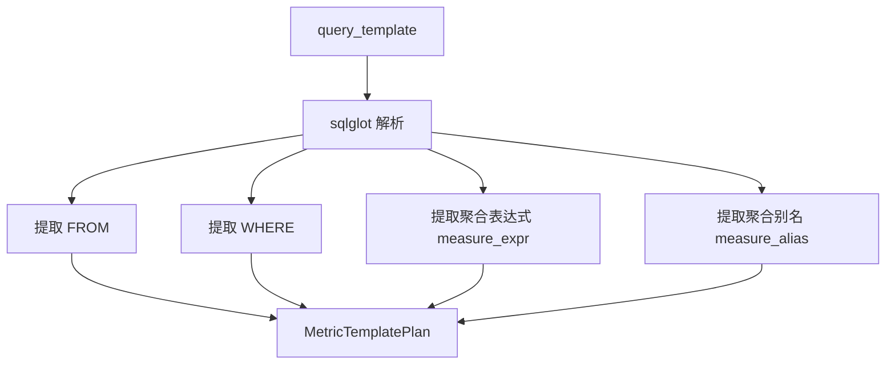
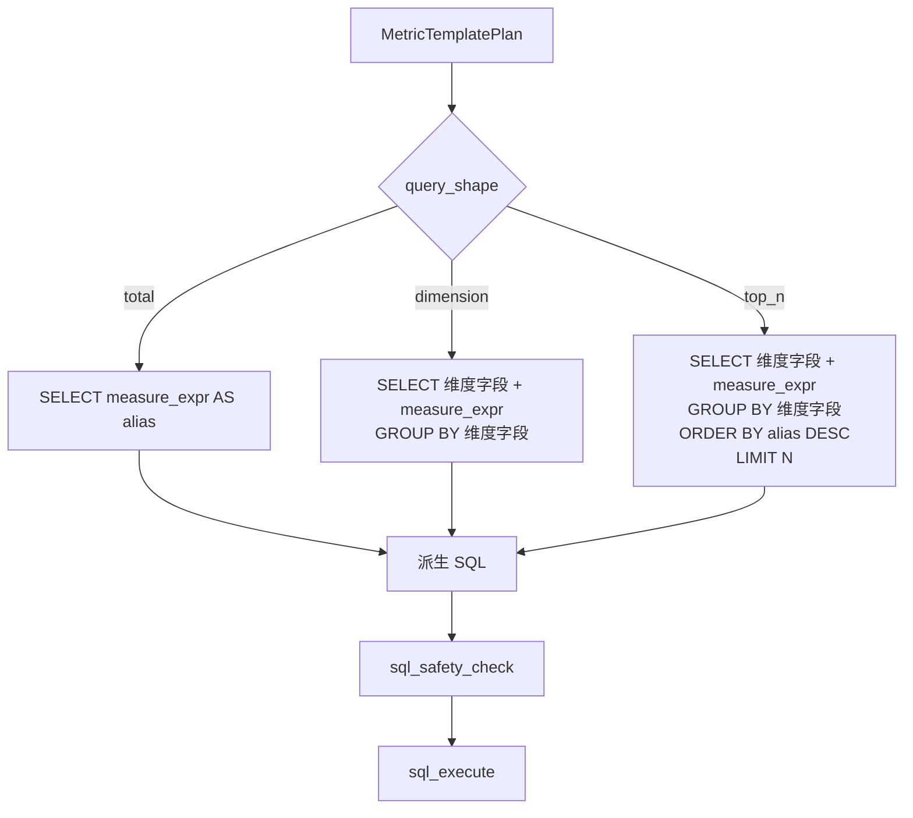
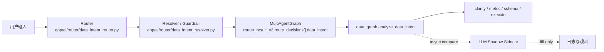
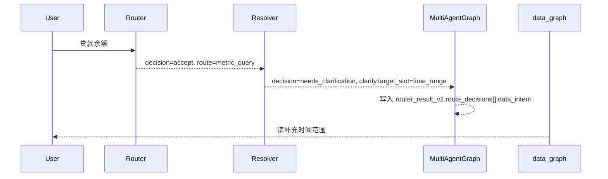
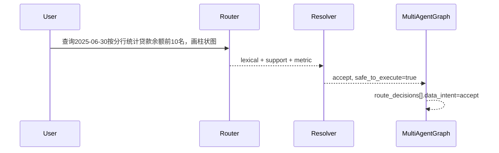

# 问数引擎设计

> **版本**: 1.4
> **创建时间**: 2026-02-06
> 更新时间：2026-03-12
> **范围**: 数据专家（data_expert）的完整 SQL 生成与执行流水线


## 文档导航

- 全局架构入口：[系统总览](系统总览.md)
- AI 核心设计：[AI模块设计](AI模块设计.md)
- 后端分层设计：[后端架构](后端架构.md)
- 前端分层设计：[前端架构](前端架构.md)
- 数据模型与双库：[数据库设计](数据库设计.md)
- 对外接口定义：[接口文档](../../API文档/接口文档.md)
- 需求来源总览：[系统需求](../../产品文档/系统需求.md)

---

## 1. 概述

问数引擎是系统中"数据专家"（data_expert）的核心实现，负责将用户的自然语言查询转化为 SQL 并执行。

**核心文件**: `app/ai/workflow/data_graph.py`

**设计理念**:
- **三级降级链**：指标模板 → 训练集 SQL → 通用 RAG 生成，逐级降级
- 指标优先：已有 query_template 的指标直接复用，不调 LLM
- 训练集复用：历史验证过的 SQL 直接复用，不调 LLM
- RAG 增强：均未命中时，通过 DDL + 文档 + 历史问答构建上下文，LLM 生成 SQL
- 安全校验：所有 SQL 经过 sqlglot 解析 + 权限检查后才执行
- 错误自愈：执行失败可自动重试（最多 3 次）
- 空结果降级：每级执行后如无数据，自动降级到下一级

---

## 2. 流水线全景



### 节点职责

| 节点 | 职责 | 降级层级 | LLM 调用 | Token 消耗 |
|------|------|---------|----------|-----------|
| `analyze_data_intent` | 意图分析（metric_query/free_query/clarification） | - | `get_llm(internal=True)` | ~500 |
| `metric_resolve` | 精确名称匹配 + 向量检索指标模板，命中则直接执行 | **第1级** | 无（精确匹配 + Embedding） | 0 |
| `training_sql_resolve` | 从 t_data_query_log 向量检索已训练 SQL，直接执行 | **第2级** | 无（仅 Embedding） | 0 |
| `schema_retrieve` | DDL/文档/历史问答向量检索 | **第3级** | 无（仅 Embedding） | 0 |
| `sql_generate` | 调用 LLM 生成 SQL（Vanna submit_prompt） | **第3级** | `get_llm()` via submit_prompt | ~4000-8000 |
| `sql_safety_check` | sqlglot 解析 + 权限校验 + LIMIT 注入 | - | 无 | 0 |
| `sql_execute` | 执行 SQL，空结果触发降级 | - | 无 | 0 |
| `clarify_node` | 生成澄清消息返回前端 | - | 无 | 0 |

---

## 3. 指标匹配机制

### 3.1 当前实现（2026-02-07 改造）

`metric_resolve` 采用两级匹配策略，避免语义漂移：



**两级匹配策略**（第1级内部）:
1. **精确名称匹配**（优先）：`metric_name = '贷款余额'` 或 `metric_name LIKE '%贷款余额%'`，按匹配度和名称长度排序
2. **向量语义检索**（降级）：向量相似度 > 0.5 时使用模板

**三级降级链**（2026-02-07 新增）:
- **第1级空结果** → 降级到第2级（训练集 SQL）
- **第2级空结果** → 降级到第3级（通用 RAG + LLM）
- 通过 `fallback_target` 状态字段控制（值为 `"training"` 或 `"schema"`），每级节点执行后自动清除，防止循环

**实测匹配效果**（2026-02-07）:
- "存款余额" → DEP_001（精确匹配）
- "贷款余额" → LOAN_001（精确匹配，不再误匹配"个人贷款"A002516）
- "不良贷款率" → LOAN_009（向量 0.636）
- "科技投入" → A002368（向量 0.592）

### 3.2 训练集 SQL 匹配（第2级）

**节点**: `training_sql_resolve`
**数据源**: `t_data_query_log`（`trained=true`，需有 `question_embedding`）

| 参数 | 值 | 说明 |
|------|-----|------|
| 相似度阈值 | 0.7 | 训练集 SQL 直接执行需更高置信度 |
| top_k | 3 | 检索候选数 |
| 日期替换 | `${data_dt}` | 与指标模板相同的参数替换逻辑 |

**当前状态**: t_data_query_log 为空（0条），需通过 SQL 修正台或手动导入训练数据。

**优势**:
- 精确匹配消除语义漂移（如"贷款余额"不再命中"个人贷款"）
- 第1/2级命中时跳过 LLM 调用，Token 消耗从 ~8000 降至 ~750
- `${data_dt}` 自动替换为分析库最新数据日期
- 空结果自动逐级降级，不会因无数据就终止

### 3.3 指标模板架构（2026-02 新增）

`t_metric_definition` 表的 SQL 模板存在两种形态：

| 列名 | 说明 | 内容形态 |
|------|------|----------|
| `sql_template` | 原始 ETL 脚本 | DELETE + INSERT 组合语句（1524 条），不可直接执行查询 |
| `query_template` | 可执行 SELECT 查询 | 从 ETL 脚本中提取/人工编写的纯 SELECT（当前覆盖率约 56.3%） |
| `template_source` | 模板来源标记 | `manual`（人工编写）/ `result_lookup`（结果表反查）/ `ai_extract`（AI 提取）/ `none`（无模板） |

**设计要点**:
- `sql_template` 存储原始 ETL 脚本（如 `DELETE FROM ... INSERT INTO ... SELECT ...`），仅作为参考信息，不能作为查询模板直接执行
- `query_template` 存储干净的 SELECT 语句，可带 `${data_dt}` 等占位符，直接参数化替换后执行
- RAG 检索时（`get_related_documentation`）优先使用 `query_template`，仅在其为空时回退到 `sql_template` 的截断展示
- 未覆盖的指标（`template_source='none'`）将回退到 Vanna RAG + LLM 路径

### 3.4 取指标 → 分解 → 组装（2026-02-08）

> 对应实现：`app/ai/workflow/data_graph.py` 中 `analyze_data_intent`、`metric_resolve`、`_derive_metric_sql`。

本节用于说明你关心的三件事：

1. **怎么取指标**（从用户问题命中 `matched_metric`）
2. **怎么分解模板**（把 `query_template` 拆成可组合片段）
3. **怎么组装 SQL**（按 total / dimension / top_n 生成最终 SQL）

#### 3.4.1 取指标流程图



#### 3.4.2 模板分解流程图



#### 3.4.3 SQL 组装流程图



#### 3.4.4 组装规则（当前口径）

| 步骤 | 规则 | 说明 |
|------|------|------|
| 形态识别 | `total` / `dimension` / `top_n` | 从问题关键词（前N/排名）和维度词判断 |
| 维度解析 | 先读指标配置，后读默认映射 | 当前默认包含 `客户 -> ecif_cust_no` |
| 条件继承 | 保留模板 WHERE + 时间替换 | `${data_dt}` 按当前轮 `time_range` 替换 |
| TopN 提取 | `前10`/`top10` -> `LIMIT 10` | 默认值 10，上限 100 |
| 回退策略 | 派生失败则回退 RAG | 保证不复读上一轮总量答案 |

#### 3.4.5 示例（贷款余额）

**输入**："查询2025年6月30日贷款余额前10名的客户"  
**指标模板**：`SELECT SUM(prin_bal) AS 贷款余额 FROM fdmdata.f_mid_loan_k_tb WHERE ccy_cd='CNY' AND data_dt='${data_dt}'`

**派生结果**：

```sql
SELECT ecif_cust_no, SUM(prin_bal) AS 贷款余额
FROM fdmdata.f_mid_loan_k_tb
WHERE ccy_cd = 'CNY' AND data_dt = '20250630'
GROUP BY ecif_cust_no
ORDER BY 贷款余额 DESC
LIMIT 10
```

---

## 4. DDL 检索策略

**文件**: `app/ai/semantic/vanna_client.py`

### 4.1 主路径：向量检索

```
用户问题 → Embedding → t_meta_tables 向量相似度 → top 5 表 → 拼接完整 DDL
```

### 4.2 降级路径：关键词匹配

当向量检索失败或无结果时，降级到 `_fallback_keyword_search`：

```
用户问题 → 分词 → ILIKE 匹配表名/描述 → 返回匹配的 DDL
```

### 4.3 指标文档检索（已优化）

`get_related_documentation` 检索 `t_metric_definition`：
- 相似度阈值 > 0.4，过滤不相关指标
- `DISTINCT ON (metric_name)` 去重（避免 A/AK 前缀重复）
- `sql_template` 截断到 200 字符
- 最多返回 3 条

---

## 4.5 Schema 路由

**文件**: `app/ai/utils/schema_router.py`

`schema_retrieve` 节点在执行向量检索前，先通过 `route_schema(question)` 确定目标 Schema，缩小 DDL 检索范围。

### 路由优先级

1. **显式指定**: 用户通过 `@fdmdata`、`@sdmdata` 语法指定 Schema
2. **SQL 表名前缀**: 根据表名前缀规则匹配（如 `f_mid_` → `fdmdata`，`s_dim_` → `sdmdata`）
3. **业务关键词匹配**: 根据 `SCHEMA_ALIASES` 配置，识别问题中的业务关键词
4. **默认回退**: 无法识别时使用 `ANALYTICS_DEFAULT_SCHEMA`（通常为 `fdmdata`）

### 决策逻辑

| 问题示例 | 匹配规则 | 目标 Schema |
|----------|----------|-------------|
| `@sdmdata 查询日期维度表` | 显式指定 | `sdmdata` |
| `查询 f_mid_dep_tb 的存款余额` | 表名前缀 `f_mid_` | `fdmdata` |
| `按分行统计贷款余额` | 关键词"贷款" | `fdmdata` |
| `查询维度表信息` | 关键词"维度" | `sdmdata` |
| `数据库有哪些表` | 默认回退 | `fdmdata` |

路由结果存入 `state["target_schema"]`，供 `sql_generate` 节点在 prompt 中指定目标 Schema。

---

## 5. SQL 安全检查

**文件**: `app/ai/utils/sql_safety.py`

### 5.1 检查流程

`check_sql_safety()` 执行 5 项静态检查，`sanitize_sql()` 在此基础上自动添加 LIMIT：

1. **只读查询检查**: 仅允许 SELECT/WITH 语句，拒绝其他类型
2. **危险关键词检查**: 使用词边界匹配（`\bKEYWORD\b`）检测 DROP/DELETE/UPDATE/TRUNCATE/ALTER/INSERT/CREATE 等，避免误判（如 `UPDATE_TIME` 不会命中）
3. **敏感表黑名单检查**: 通过 `extract_tables_from_sql()` 提取表名，对照 `DEFAULT_SENSITIVE_TABLES`（含运行时从数据库读取的黑名单）拒绝访问系统表
4. **Schema 检查**: 仅允许命中 `askdata.analytics_schema_allowlist`（回退 `ANALYTICS_SCHEMAS`），并拒绝 `askdata.system_schema_blacklist`（回退系统默认黑名单）
5. **多语句检测**: 移除字符串字面量和注释后按分号分割，防止 SQL 注入
6. **自动添加 LIMIT**: 通过 `add_limit_if_missing()` 为无 LIMIT 的 SELECT 添加 `LIMIT 1000`

> **统一决策位置（2026-02-14）**: 问数链路在 `sql_safety_check` 节点调用 `app/ai/utils/sql_policy_decision.py` 的 `evaluate_sql_policy(sql, user_id)`，统一串联安全检查与权限重写，采用 `deny_overrides_allow`（任一阶段拒绝即拒绝）。

### 5.2 降级

sqlglot 解析失败时，降级到正则表达式提取表名。

### 5.3 配置键治理（2026-02-14）

为避免 Schema 白名单/黑名单语义混用，问数访问控制拆分为两类独立配置键：

1. 表白名单：`askdata.table_whitelist`（兼容读取历史键 `data_access.table_whitelist`）
2. 表黑名单：`askdata.table_blacklist`（兼容读取历史键 `data_access.table_blacklist`）
3. 分析 Schema 白名单：`askdata.analytics_schema_allowlist`（兼容读取历史键 `askdata.schema_whitelist`、`data_access.schema_whitelist`）
4. 系统 Schema 黑名单：`askdata.system_schema_blacklist`（兼容读取历史键 `askdata.schema_blacklist`）

运行时读取逻辑位于 `app/ai/semantic/data_access_control.py`，并带 5 分钟本地缓存。管理后台写入后会主动清理该缓存，保证策略变更快速生效。

---

### 5.4 双角色权限决策（2026-02-16）

问数链路的权限判断统一收敛到 `evaluate_sql_policy(sql, user_id)`，执行顺序固定为：

`SQL 安全检查 -> 权限上下文校验 -> 表级判定 -> 行级注入 -> 列级脱敏 -> 决策输出`

#### 5.4.1 身份语义与角色优先级

1. `sys_role` 仅用于系统管理语义（如后台接口鉴权），不参与问数放行判定。
2. `data_role` 是问数权限唯一角色来源，优先级为：`user.data_role > 兼容 user.role(非 admin) > staff`。
3. `sys_role=admin` 不得绕过问数策略，若 `data_role=staff` 则按 `staff` 权限执行。

#### 5.4.2 默认行级策略与拒绝路径

1. 默认行级策略固定开启：`dept_code = user.dept_code`。
2. 若 `dept_code` 缺失，`validate_query_context()` 直接拒绝查询，拒绝原因可观测（如“缺少 dept_code，命中默认部门隔离策略”）。
3. 默认策略与显式规则可叠加，最终 SQL 条件去重后注入，避免重复过滤表达式。

#### 5.4.3 表级判定与 deny_overrides_allow

1. 表级命中顺序：显式拒绝（deny）优先于显式允许（allow）。
2. 未命中显式规则时按默认拒绝处理（`default_deny`）。
3. 统一策略结论遵循 `deny > allow > role_template > default`，任一阶段拒绝即终止执行。

#### 5.4.4 SQL 试跑与审计轨迹

1. `PermissionService.evaluate_sql_dry_run()` 输出原 SQL、重写 SQL、拒绝阶段（`denied_stage`）、拒绝原因码（`reason_code`）。
2. 审计轨迹 `policy_hits` 按表返回 `hit_rule_type`（`deny/allow/default_deny`）与命中规则。
3. 该能力用于策略变更前预演，避免直接发布后出现误放权或误拒绝。

### 5.5 权限治理接口对接

`app/api/v1/endpoints/access_admin_api.py` 提供问数权限治理能力：

1. `GET /api/v1/access-admin/data-roles`：查询全部 `data_role` 策略模板。
2. `PUT /api/v1/access-admin/data-roles/{data_role}`：全量替换角色策略（表级/行级/列级）。
3. `DELETE /api/v1/access-admin/data-roles/{data_role}`：清理指定角色策略。
4. `POST /api/v1/access-admin/sql-dry-run`：执行 SQL 试跑并返回策略命中轨迹。

策略写入后会触发权限缓存失效，保证策略生效时间可控。

---

## 6. 模型选择

> 详细路由表见 [AI模块设计.md](AI模块设计.md) "模型分类路由表" 章节。

### 问数流水线中的模型使用

| 环节 | 调用方式 | 模型来源 | 说明 |
|------|----------|----------|------|
| 意图分析 | `get_llm(internal=True, model_id=get_routing_model(MODEL_ROUTING_SQL_GENERATION, SQL_GENERATION_MODEL))` | 系统路由配置 (`MODEL_ROUTING_SQL_GENERATION`) | 禁用流式，不消耗 thinking token |
| SQL 生成 | `vanna.submit_prompt(model_id=get_routing_model(...), enable_thinking=...)` | 系统路由配置 (`MODEL_ROUTING_SQL_GENERATION`) | 通过 `get_llm()` 统一管道 |
| SQL 评估 | `get_llm(model_id=get_routing_model(MODEL_ROUTING_LLM_JUDGE, LLM_JUDGE_MODEL))` | 固定配置 | 默认 qwen-plus，可通过环境变量覆盖 |

**设计说明**:
- 意图分析和 SQL 生成**有意不跟随用户选择的模型**，而是使用系统路由配置的标准模型（如 qwen-plus）。这是为了避免推理模型（如 deepseek-r1、o1 等）在这些环节浪费 thinking tokens
- 推理模型的隐式推理不可控，token 消耗波动大（2000-4000），在 SQL 生成场景下性价比极低
- 用户选择的模型仅影响对话/聊天场景，数据查询场景由后台统一管控模型选择

---

## 7. Token 消耗分析

### 单次查询 token 消耗（Vanna 路径）

| 环节 | Prompt | Output | 合计 | 占比 |
|------|--------|--------|------|------|
| Supervisor 路由 | ~200 | ~50 | ~250 | 3% |
| 意图分析 | ~300 | ~200 | ~500 | 6% |
| **SQL 生成** | **~4000** | **~200-800** | **~4200-4800** | **55-60%** |
| 其中: DDL 上下文 | ~3000 | - | - | |
| 其中: 指标文档 | ~600 | - | - | |
| 其中: 系统提示 | ~400 | - | - | |
| SQL 评估（如启用） | ~500 | ~100 | ~600 | 8% |
| **合计** | | | **~5500-6200** | |

### 优化后预期（指标命中路径）

| 环节 | Token | 说明 |
|------|-------|------|
| Supervisor 路由 | ~250 | 不变 |
| 意图分析 | ~500 | 不变 |
| 指标模板匹配 | 0 | 向量匹配，无 LLM |
| SQL 安全检查 | 0 | 本地解析，无 LLM |
| **合计** | **~750** | 节省约 85% |

---

## 8. 已知问题与改进计划

| 问题 | 状态 | 计划 |
|------|------|------|
| metric_resolve 硬编码电商模板 | ✅ 已完成 | 已接入 t_metric_definition 向量匹配 (2026-02-07) |
| 指标匹配语义漂移 | ✅ 已修复 | 增加精确名称匹配优先步骤 (2026-02-07) |
| 空结果无降级 | ✅ 已修复 | 三级降级链: metric → training → schema(通用RAG) (2026-02-07) |
| 训练集 SQL 独立降级 | ✅ 已实现 | training_sql_resolve 节点，从 t_data_query_log 向量检索 (2026-02-07) |
| sample_values 缺失 | ✅ 已实现采样脚本 | `python -m app.ai.semantic.schema_sync --samples` 从分析库采样 |
| 训练集为空（t_data_query_log） | 待填充 | 需导入高质量问答对并标记 trained=true、生成 embedding |
| DDL 检索在命中指标时冗余 | 待优化 | 条件化检索（命中指标跳过） |
| A/AK 重复指标占用检索位 | 待清理 | 数据库去重或检索时去重 |
| 结果业务合理性评估 | 待实现 | 当前仅语法/性能评估，缺少对结果数据的业务验证 |
| `${data_dt}` 变量替换 | 已实现 | 已支持上月/本月/6月/精确日期及默认取分析库最新日期 |
| 错误自愈机制 | 已实现 | `MAX_RETRY_ITERATIONS=3`，`sql_execute` 失败后由 `route_after_execute` 判断是否可恢复，可恢复则回退到 `sql_generate` 重试；`_build_error_feedback()` 将上次失败的 SQL 和错误信息构建为反馈 prompt，帮助 LLM 修正 |
| 历史回放丢失 `sql_result` 卡片（date 序列化失败） | ✅ 已修复 | `t_chat_message.metadata` 入库前统一做 JSON 可序列化编码，避免 `Object of type date is not JSON serializable` 导致 postprocess 保存失败（2026-02-08） |

---

## 9. 相关文档

| 文档 | 内容 |
|------|------|
| [问数助手需求.md](../../产品文档/问数助手需求.md) | 用户故事与验收标准 |
| [AI模块设计.md](AI模块设计.md) | LLM 调用规范、模型路由表 |
| [数据库设计.md](数据库设计.md) | t_metric_definition、t_meta_tables 等表结构 |
| [问数引擎测试案例.md](../测试管理/问数引擎测试案例.md) | 测试用例 |


---

## 8.1 单目标问数规划纠偏（2026-03-08）

### 触发背景

问数请求“查询 2025 年 6 月 30 日各机构的贷款余额分布”属于典型单目标强数据语义，但模型主判定在部分场景会输出过宽泛的 `general.reply`，从而把运行态目标污染为“问题回复”。

### 收敛策略

1. 继续保持“模型主判定优先”。
2. 当且仅当以下条件同时满足时，执行单目标纠偏：
   - 模型产出只有 1 个必答目标；
   - 该目标 bucket 为 `general`；
   - 规则兜底也只有 1 个必答目标；
   - 规则兜底 bucket 为专家型目标（当前至少含 `data.query` / `todo.query`）。
3. 纠偏后运行态目标采用更具体的兜底目标，但保留 source 标记用于观测。

### 边界约束

- 不在多目标场景复用该纠偏逻辑，多目标仍由显式 marker + reconcile 主导。
- 不把泛动作词“查询”本身当成数据域证据，避免待办问句再次被误扩成问数。
- coverage 缺口不再转换成用户澄清问题；问数真正缺参仍由 `data_graph` clarify 分支负责。

- 问数单目标直派场景下，`data_expert` 委派前的运行态 goals 必须先冻结为 `data.query`，不得让 router guard 继续读取空 goals 或 `general.reply` 兜底目标。
- 若 supervisor 仍输出 `task_description` 型 data handoff，编排层必须在 router guard 前把它编译成 canonical `frame.query_text`，而不是让 `frame=null` 进入门禁后再回灌补齐提示。

---

## 8.2 Data Intent Contract 防误触发设计（2026-03-12）

### 8.2.1 背景与目标

这次治理的重点不是“多删几个关键词”，而是把问数入口从**模糊文本碰撞**重构成**结构化 contract 驱动**。

旧链路长期反复出现三类问题：

| 问题 | 旧行为 | 结果 |
|---|---|---|
| metadata substring 误触发 | `t_meta_columns` 中任意展示名子串命中，都会被加成维度词法信号 | `贷款余额` 会因为 `余额` 被抬成伪多信号命中 |
| metric-only 双口径 | router 先写 `accept`，后续 `data_graph` 再把它改成时间澄清 | `router_result_v2` 不是 runtime 真理源 |
| llm-shadow 只留占位 | 运行态只有 `shadow_status=bypassed_nonblocking`，没有真正对账 | 名义上有 shadow，实际上没有旁路观测能力 |

所以本节要回答四个问题：

1. 问数语义到底由谁负责判定？
2. 哪些信号算有效，哪些不算？
3. 缺关键槽位时，什么时候直接澄清？
4. shadow 为什么只能异步旁路，不能干预主路径？

### 8.2.2 收敛后的架构



核心原则：

- **主路径单轨**：`Router -> Resolver -> router_result_v2 -> data_graph`
- **shadow 旁路**：异步调度，只记差异，不得覆盖主判

### 8.2.3 模块边界

| 模块 | 单一职责 | 可以做什么 | 明确不能做什么 |
|---|---|---|---|
| `app/ai/router/data_intent_router.py` | 候选信号提取 + 初始 contract 判定 | 提取 lexical/support/frame signals；生成初始 `DataIntentContract` | 不做真理源 whitelist；不在 workflow 层继续堆关键词补丁 |
| `app/ai/router/data_intent_resolver.py` | truth source 校验 + 执行 guardrail | 校验指标/维度真理源；缺关键槽位时直接转成 `clarify_contract`；决定 `safe_to_execute` | 不负责用户文案；不接管编排 |
| `app/ai/workflow/multi_agent_graph.py` | 将 final contract 嵌入 runtime canonical payload | 把 `data_intent` 写入 `router_result_v2.route_decisions[]` | 不新增 `router_result_v3` 或平行 contract |
| `app/ai/workflow/data_graph.py` | 消费 contract + 会话融合 + 最终问数状态输出 | 读取 clarify contract 生成用户可见澄清；调度异步 shadow compare | 不再通过 substring/关键词/正则自己做主判 |
| shadow sidecar | 异步对账与观测 | 构造影子 contract，比较 diff，写日志 | 不阻塞主路径；不接管主回复 |

### 8.2.4 信号模型

当前问数语义判定只承认三类信号：

| 信号族 | 示例 | 用途 | 是否可单独放行 |
|---|---|---|---|
| `lexical` | `按分行`、`柱状图`、显式维度句式 | 表示用户当前轮新增了结构化意图 | `否` |
| `support` | `metric_metadata_support:贷款余额`、`resolver_precheck_support.time:2025-06-30` | 提供指标/时间等支持性证据 | `否` |
| `frame` | `session_frame_support`、`handoff_frame_support` | 允许补充轮在既有上下文下成立 | 仅 `frame-supported supplement` 可例外 |

必须遵守的三条规则：

1. **单个新的词法信号不能直接放行**
2. **只有 `frame-supported supplement` 才允许补充轮例外**
3. **`t_meta_columns` 不是 lexical signal catalog**

这意味着 `t_meta_columns` 现在只负责：

- whitelist 校验
- canonical display name / column_name 映射
- 维度与数据类型真理源

而不再负责：

- 任意子串命中触发
- 自由语义加分
- 词法词表扩散

### 8.2.4.1 信号组合判定矩阵

只看“有没有命中词”是不够的，真正决定是否放行的是**信号组合 + frame 背景 + resolver 最终校验**。

| 当前轮输入形态 | 当前轮信号 | 是否有 frame | Router 输出 | Resolver 最终输出 | 说明 |
|---|---|---|---|---|---|
| `贷款余额` | `metric_metadata_support` | 否 | `accept / metric_supported_accept` | `needs_clarification / missing_time_range` | 识别到指标，但执行前缺时间，最终必须转结构化澄清 |
| `贷款余额 画柱状图` | `metric_metadata_support + chart_request` | 否 | `accept / multi_signal_accept` | `needs_clarification / missing_time_range` | 图表词能证明展示诉求，但不能替代时间槽位 |
| `按分行` | 单个 lexical dimension signal | 否 | `reject / single_lexical_signal_forbidden` | 保持 reject | 单个新的词法信号不能直接放行 |
| `图看看` | 单个 lexical chart signal | 否 | `needs_clarification / missing_metric_time` | 保持澄清 | 用户表达了展示动作，但没有说“查什么、看哪段时间” |
| `2025-06-30 贷款余额` | `metric_metadata_support + time_support` | 否 | `accept / multi_signal_accept` | `accept / safe_to_execute=true` | 指标与时间齐备，可进入执行态 |
| `改成图看看` | chart/request lexical + frame support | 是 | `accept / frame_supported_supplement` | 若继承后槽位齐备则 accept | 这是唯一允许“短补充放行”的例外 |

可以把这个矩阵理解成一句话：

> **问数放行从来不是“命中了某个词”，而是“当前轮证据足够 + 既有 frame 可继承 + resolver 校验通过”。**

### 8.2.5 为什么 metadata substring 必须禁掉

旧逻辑的错误，不是“写法粗糙”，而是**职责错位**。

真实例子：

```text
用户输入: 贷款余额
t_meta_columns 中存在: 余额
```

旧链路会产生：

```json
[
  "keyword_candidate.dimension_hint:余额",
  "metric_metadata_support:贷款余额"
]
```

接着它就被错误识别成“多信号命中”，从而 accept。

但业务含义其实很简单：

- `贷款余额` 表达的是指标
- `余额` 不是用户明确要求聚合的维度
- 它只是指标名的一部分

所以正确结果只能是：

```json
[
  "metric_metadata_support:贷款余额"
]
```

一句话：
**真理源里“存在这个词”不等于用户“表达了这个维度”。**

### 8.2.6 Resolver / Guardrail 最终规则

Resolver 不是补丁层，而是最终放行门禁。

当前 guardrail 规则如下：

| 条件 | 最终输出 |
|---|---|
| 指标未命中 `t_metric_definition` | `reject / metric_not_found` |
| 维度未被 `t_meta_columns` whitelist 接住 | `reject / dimension_not_whitelisted` |
| 指标命中，但缺 `time_range` | `needs_clarification + clarify_contract(time_range)` |
| 时间存在但解析失败 | `reject / time_parse_failed` |
| 指标 / 维度 / 时间都通过 | `accept + safe_to_execute=true` |

这里最重要的一条是：

> **“贷款余额”这种纯指标问句，router 可以识别出 metric，但只有 resolver 才能决定它是否已具备执行前提。**

### 8.2.6.1 `clarify_contract` 为什么必须结构化

过去链路里一个很麻烦的问题是：运行态只留下“请补充时间范围”这类文案，后续节点再靠文案猜“这次到底缺的是时间、指标还是维度”。这会带来两个直接后果：

1. 文案一改，运行态槽位推断就可能漂移；
2. replay / review 只能看到自然语言，看不到机器可验证的缺口原因。

所以现在强制改成：

| 字段 | 含义 | 生产者 | 消费者 |
|---|---|---|---|
| `clarify.target_slot` | 这轮到底缺哪个关键槽位 | router / resolver | `data_graph`、replay、review |
| `clarify.reason_code` | 为什么缺 | router / resolver | 观测、回归、问题定位 |
| `clarify.prompt_template_key` | 该用哪类澄清模板 | router / resolver | 用户可见澄清文案生成 |

当前收敛后的责任分配是：

- `router` 只在“图表诉求但连 metric/time 都没给”这类首轮弱输入场景，直接生成首层澄清；
- `resolver` 负责把“router 先 accept，但执行前提仍不成立”的场景改写成最终澄清；
- `data_graph` 只负责消费 `clarify_contract` 生成用户文案，不再反向猜槽位。

这也是为什么这次必须把“缺时间追问”前移到 resolver，而不是继续留给 `data_graph` 临场补口径。

### 8.2.7 运行态时序

#### 场景 A：纯指标问句，缺时间

用户输入：`贷款余额`



收益：

- `router_result_v2` 和最终澄清同口径
- replay 看到的就是最终语义
- 不再出现“一边 accept、一边再追问时间”的双轨

#### 场景 B：显式 visualization

用户输入：`查询2025-06-30按分行统计贷款余额前10名，画柱状图`



#### 场景 C：补充轮图表切换

上一轮已确认：

- 指标：`贷款余额`
- 时间：`2025-06-30`
- 维度：`分行`

本轮输入：`改成图看看`

这个场景能成立，不是因为“图看看”够强，而是因为：

- 当前轮是短补充
- 已有 frame support
- 新增信号属于允许的 supplement 例外

### 8.2.8 Canonical Contract 示例

#### 示例 1：缺时间的 metric-only 查询

```json
{
  "decision": "needs_clarification",
  "route": "clarification",
  "reason_code": "missing_time_range",
  "safe_to_execute": false,
  "slots": {
    "metric": "贷款余额",
    "time_range": null,
    "dimensions": []
  },
  "clarify": {
    "target_slot": "time_range",
    "reason_code": "missing_time_range",
    "prompt_template_key": "ask_time_range"
  }
}
```

#### 示例 2：正常 visualization 查询

```json
{
  "decision": "accept",
  "route": "visualization",
  "reason_code": "multi_signal_accept",
  "safe_to_execute": true,
  "slots": {
    "metric": "贷款余额",
    "time_range": "2025-06-30",
    "dimensions": ["分行"],
    "chart_type": "柱状图",
    "query_shape": "top_n"
  }
}
```

#### 示例 3：补充轮图表切换

```json
{
  "decision": "accept",
  "route": "visualization",
  "reason_code": "frame_supported_supplement",
  "safe_to_execute": true,
  "slots": {
    "metric": "贷款余额",
    "time_range": "2025-06-30",
    "dimensions": ["分行"],
    "chart_type": "图表",
    "display_mode": "图表"
  }
}
```

这个 contract 想强调的不是“图看看”这个词本身多强，而是：

- 当前轮只有很弱的图表补充信号；
- 但上一轮 frame 已经把 metric / time / dimension 这些关键槽位补齐；
- 所以它可以作为 supplement 被合法继承。

### 8.2.9 `llm-shadow` 的真实运行方式

这次 shadow 设计的重点不是“多一个模型参与主判”，而是“多一条低风险旁路观测链”。

#### 启用条件

shadow 仅在以下条件同时满足时启用：

1. `intent_mode=model_primary`
2. `intent_shadow_enabled=true`
3. 当前不是 handoff short-circuit
4. 当前线程存在可用事件循环

#### 运行步骤

1. 主路径先完成 `decide_data_intent -> resolve_data_intent`
2. `data_graph.analyze_data_intent()` 异步调用 `_schedule_data_intent_shadow_compare(...)`
3. shadow runner 复用问数意图分析 scene LLM 与既有 prompt
4. `shadow_compare_async(...)` 只比较字段差异
5. callback 写日志：`status/diff_fields/shadow_decision/shadow_reason_code`

#### `shadow_status` 约定

| 状态 | 含义 |
|---|---|
| `disabled` | 配置未开启 shadow |
| `scheduled_nonblocking` | 已成功异步调度 |
| `skipped_handoff_short_circuit` | 当前轮直接走 handoff short-circuit |
| `bypassed_no_running_loop` | 无事件循环，安全跳过 |
| `shadow_runner_unavailable` | runner 初始化失败 |

#### 为什么它必须异步

如果 shadow 同步执行，会直接引入两个问题：

1. 主回复延迟被影子链路放大
2. 影子模型抖动会反向污染问数主链路 SLA

所以这里必须坚持：

- 主路径先返回
- shadow 只做 diff 记账
- 不允许把 shadow 结果回写为主判

#### diff 落点长什么样

shadow 完成后只会记录“主判和影子判定哪里不一样”，不会回写主 contract。典型记录内容长这样：

```json
{
  "status": "mismatch",
  "diff_fields": ["decision", "reason_code", "slots"],
  "shadow_decision": "needs_clarification",
  "shadow_reason_code": "missing_time_range"
}
```

这里的设计重点有两个：

1. `diff_fields` 只服务 review / verify / 观测排障；
2. 即便 shadow 认为“应该追问时间”，主路径也不会因此被重算或阻塞。

### 8.2.10 迁移与回滚策略

这次不是“加一层兼容双写”，而是一次性把运行态真相源收回到正确层级。

#### 迁移原则

| 项目 | 本次策略 | 原因 |
|---|---|---|
| runtime contract | 继续沿用 `router_result_v2` | replay 与运行态已经围绕它建立，不需要再发明 `v3` |
| data intent 挂载点 | 只挂 `route_decisions[].data_intent` | 避免 contract 平铺后再次出现双真相源 |
| workflow 旧语义判断 | 直接下线 | 编排层继续保留关键词/substring 只会重复引入误触发 |
| llm-shadow | 只做旁路接线 | shadow 的职责是对账，不是 second opinion 主判 |

#### 迁移动作

1. 从 router 侧移除基于 `t_meta_columns` 全量展示名的裸 substring 维度加分；
2. 让 resolver 成为 execution guardrail 的唯一出口，把“缺时间”直接改写为 `clarify_contract`；
3. 让 `multi_agent_graph` 只负责把最终 contract 写入 `router_result_v2.route_decisions[].data_intent`；
4. 让 `data_graph` 只消费 contract、补充会话上下文、调度异步 shadow compare；
5. 保留 `AI模块设计.md` 作为总览索引，详细算法、时序和边界统一沉到 `问数引擎设计.md`。

#### 回滚策略

| 风险点 | 回滚方式 | 不允许做的事 |
|---|---|---|
| shadow 对账异常 | 关闭 `intent_shadow_enabled`，主路径继续按 rule-primary 运行 | 不允许让 shadow 接管主判 |
| 文档/观测字段异常 | 继续以 `router_result_v2.route_decisions[].data_intent` 为唯一排障入口 | 不允许临时再加 `router_result_v3` |
| 单关键词误触发回归 | 回查 router/resolver 规则与 metadata 使用边界 | 不允许恢复 metadata substring 扫描 |

一句话：
**这次允许回滚的是 shadow 开关，不允许回滚的是“contract 单真相源”和“去 substring 误触发”这两个架构决定。**

### 8.2.11 正反例案例库

下面这些例子，是 review / verify 时最该直接拿来过一遍的。

| 用户输入 | 上下文 | 正确结果 | 为什么 |
|---|---|---|---|
| `贷款余额` | 无 | `needs_clarification(target_slot=time_range)` | 只有指标，没有执行所需时间 |
| `余额` | 无 | `reject / insufficient_signal` 或 `metric_not_found` | 不能因为 metadata 里有“余额”就猜成维度或指标 |
| `按分行` | 无 | `reject / single_lexical_signal_forbidden` | 单个维度词法信号不能直接放行 |
| `贷款余额 画图` | 无 | `needs_clarification(target_slot=time_range)` | 图表诉求成立，但时间仍缺失 |
| `2025-06-30 按分行统计贷款余额前10名` | 无 | `accept + safe_to_execute=true` | metric/time/dimension/topN 都齐 |
| `改成图看看` | 上一轮已确认 metric/time/dimension | `accept / frame_supported_supplement` | 这是补充轮，不是首轮独立问句 |
| `数据库有几张表` | 无 | 走 schema metadata 路径 | 这是库表元数据问题，不该追问指标和时间 |

#### 坏例子：这次明确禁止再出现

1. `贷款余额` 因为 metadata 里存在 `余额` 被抬成维度提示，然后直接 accept；
2. `router_result_v2` 里写 `accept`，最终用户却收到“请补充时间范围”；
3. 主回复同步等待 shadow compare，导致问数延迟被影子链路放大；
4. workflow 层又偷偷加一套关键词/正则补丁，把 router / resolver 的 contract 绕开。

### 8.2.12 评审与回归检查点

以后 review / verify 不该再只问“代码改了没有”，而应该直接核这五件事：

1. `router_result_v2.route_decisions[].data_intent` 还是不是唯一 runtime contract？
2. `metric-only` 缺时间时，是不是直接写 `clarify_contract(time_range)`？
3. `t_meta_columns` 有没有又被拿去做自由 lexical signal source？
4. `llm-shadow` 还是不是异步旁路、有没有接管主路径？
5. replay / clarify / supplement / shadow 四类回归是不是都还在？
