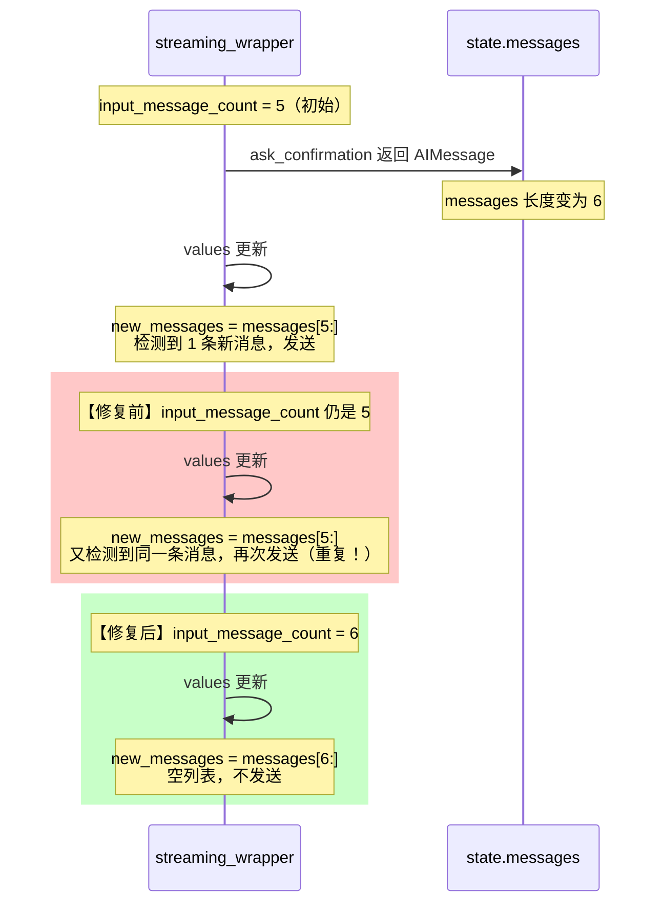
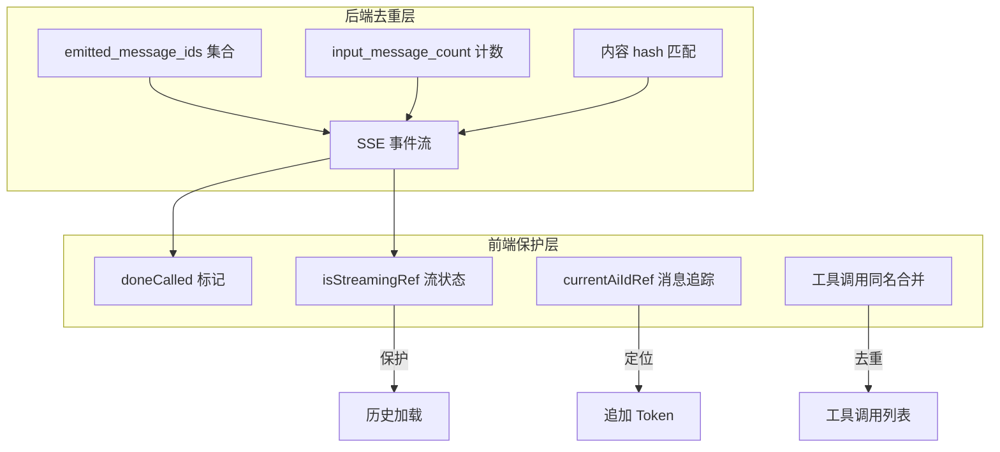
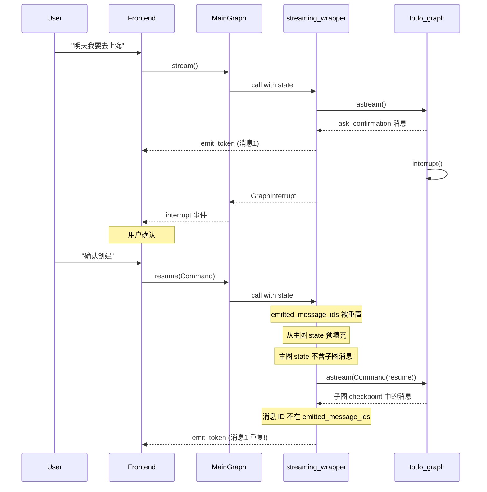
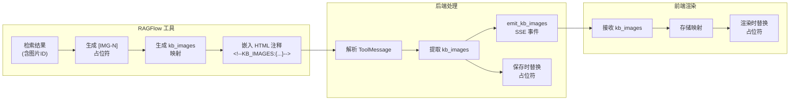
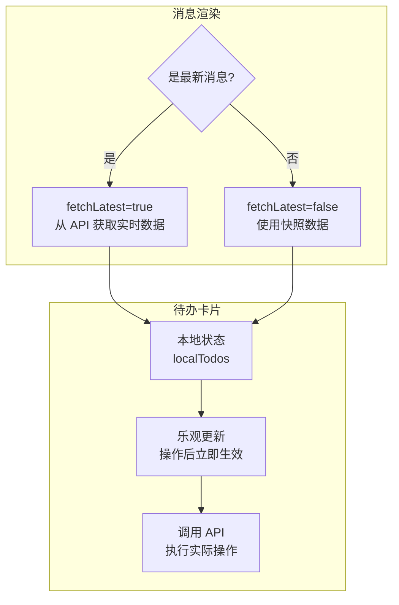
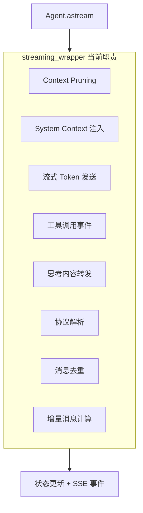

# 防屎山记录手册

> **用途**：记录系统中统一架构以外的特殊处理逻辑，为排查问题和优化架构提供参考。

## 文档导航

- 全局架构入口：[系统总览](系统总览.md)
- AI 核心设计：[AI模块设计](AI模块设计.md)
- 后端分层设计：[后端架构](后端架构.md)
- 前端分层设计：[前端架构](前端架构.md)
- 数据模型与双库：[数据库设计](数据库设计.md)
- 对外接口定义：[接口文档](../../API文档/接口文档.md)
- 需求来源总览：[系统需求](../../产品文档/系统需求.md)

---

## 状态跟踪清单

> 状态说明：待处理 / 跟踪中 / 已修复 / 已废弃 / 可接受

| 编号   | 名称                                      | 分类       | 风险 | 状态   | 添加日期   | 最后更新   |
| ------ | ----------------------------------------- | ---------- | ---- | ------ | ---------- | ---------- |
| SP-001 | 消息去重机制                              | 数据一致性 | 中   | 已修复 | 2026-01-31 | 2026-03-11 |
| SP-002 | DeepSeek reasoning_content 补丁           | 框架兼容   | 中   | 跟踪中 | 2026-01-31 | 2026-03-11 |
| SP-003 | 异常吞没模式                              | 错误处理   | 中   | 可接受 | 2026-01-31 | 2026-03-11 |
| SP-004 | 前端类型断言绕过                          | 类型安全   | 中   | 待处理 | 2026-01-31 | 2026-03-09 |
| SP-005 | MinIO URL 编码修复                        | 数据处理   | 低   | 可接受 | 2026-01-31 | 2026-03-10 |
| SP-006 | is_intermediate 中间消息标记              | 数据一致性 | 低   | 可接受 | 2026-01-31 | 2026-03-11 |
| SP-007 | SessionStorage 组件通信                   | 架构设计   | 中   | 待处理 | 2026-01-31 | 2026-03-09 |
| SP-008 | 默认值兜底逻辑                            | 错误处理   | 中   | 待处理 | 2026-01-31 | 2026-03-11 |
| SP-009 | 图片链接自动修复                          | 数据处理   | 低   | 可接受 | 2026-01-31 | 2026-03-11 |
| SP-010 | 调试日志硬编码路径                        | 代码质量   | -    | 已修复 | 2026-01-31 | 2026-02-04 |
| SP-011 | 知识库图片占位符机制                      | 架构设计   | 低   | 可接受 | 2026-01-31 | 2026-03-11 |
| SP-012 | 待办卡片乐观更新                          | 架构设计   | 低   | 可接受 | 2026-02-02 | 2026-03-09 |
| SP-013 | streaming_wrapper 上帝函数                | 架构设计   | 中   | 跟踪中 | 2026-02-04 | 2026-03-11 |
| SP-014 | internal 协议块清洗与 metadata 序列化兜底 | 协议兼容   | 中   | 跟踪中 | 2026-02-08 | 2026-02-08 |
| SP-015 | Vision 路由兼容多模态 Chat 模型           | 架构兼容   | 中   | 已修复 | 2026-02-14 | 2026-03-09 |
| SP-016 | SSE 状态文案归一化防闪烁                  | 交互兼容   | 低   | 已修复 | 2026-02-14 | 2026-03-11 |
| SP-017 | get_scene_llm 旧参数兼容映射              | 兼容补丁   | 低   | 已修复 | 2026-02-15 | 2026-02-18 |
| SP-018 | 空结果表切换字段兼容映射                  | 兼容补丁   | 中   | 跟踪中 | 2026-02-18 | 2026-03-10 |
| SP-019 | DataGraph 会话帧回收兜底                  | 兼容补丁   | 中   | 跟踪中 | 2026-02-18 | 2026-03-11 |
| SP-020 | Planner 模型主判定失败兜底                | 兼容补丁   | 中   | 跟踪中 | 2026-02-28 | 2026-03-11 |

### 2026-03-04 命中回填记录

| SP 编号 | 本轮命中文件                                                                                                     | 变更摘要                                                                                                                                   | 当前结论               |
| ------- | ---------------------------------------------------------------------------------------------------------------- | ------------------------------------------------------------------------------------------------------------------------------------------ | ---------------------- |
| SP-001  | `app/ai/workflow/multi_agent_graph.py`、`web/src/lib/backend.ts`                                                 | 增强 SSE 事件过滤与分发口径，继续压缩重复消息风险窗口                                                                                      | 保持“已修复”，持续观察 |
| SP-002  | `app/ai/workflow/multi_agent_graph.py`、`app/services/chat_service.py`                                           | 推进多意图主判定链路，保留异常兜底分支                                                                                                     | 保持“跟踪中”           |
| SP-003  | `app/ai/workflow/multi_agent_graph.py`、`web/src/lib/backend.ts`                                                 | 未知事件改为显式忽略并记录 warning，避免前端状态污染                                                                                       | 保持“可接受”           |
| SP-004  | `web/src/lib/backend.ts`                                                                                         | 前端流事件类型白名单化，仍存在少量 `unknown` 透传场景待清理                                                                                | 保持“待处理”           |
| SP-006  | `app/services/chat_service.py`                                                                                   | 记忆写入路径调整后仍保留中间态兼容标记                                                                                                     | 保持“可接受”           |
| SP-008  | `app/services/chat_service.py`                                                                                   | 记忆入队异常维持降级兜底，确保主链路可用                                                                                                   | 保持“待处理”           |
| SP-009  | `app/ai/workflow/multi_agent_graph.py`                                                                           | 检索链路继续保留图片修正与证据卡片兜底路径                                                                                                 | 保持“可接受”           |
| SP-011  | `app/ai/events.py`、`app/ai/tools/ragflow_tool.py`、`app/ai/workflow/multi_agent_graph.py`                       | 图像占位、事件写入与检索注入链路继续走兼容分支                                                                                             | 保持“可接受”           |
| SP-013  | `app/ai/workflow/multi_agent_graph.py`                                                                           | streaming/handoff 兼容逻辑仍集中在主图，但本轮已把 data goal canonical handoff 编译与 Router Guard 注入收口到统一 helper，未再新增并排分支 | 保持“跟踪中”           |
| SP-015  | `app/core/config.py`、`app/core/config_contract.py`                                                              | 多模态与记忆配置键继续兼容旧键读取口径                                                                                                     | 保持“已修复”           |
| SP-016  | `app/ai/events.py`、`app/ai/workflow/multi_agent_graph.py`、`web/src/lib/backend.ts`、`web/src/types/message.ts` | 状态事件扩展后继续维持文案与事件语义统一                                                                                                   | 保持“已修复”           |
| SP-020  | `app/ai/workflow/multi_agent_graph.py`                                                                           | Planner 主判定仍保留失败回退兜底，但 data.query 在进入 Router Guard 前已统一编译 canonical handoff，减少单目标查询误阻塞                   | 保持“跟踪中”           |

### 2026-03-11 命中回填记录

| SP 编号 | 本轮命中文件                                                                                 | 变更摘要                                                                       | 当前结论               |
| ------- | -------------------------------------------------------------------------------------------- | ------------------------------------------------------------------------------ | ---------------------- |
| SP-001  | `app/ai/workflow/multi_agent_graph.py`                                                       | values-mode 与路由回退逻辑继续收口，减少消息分发与状态判断重复分支             | 保持“已修复”，继续观察 |
| SP-002  | `app/ai/workflow/multi_agent_graph.py`、`app/services/chat_service.py`                       | 本轮只做编排与 contract 瘦身，没有继续扩大 DeepSeek 兼容补丁边界               | 保持“跟踪中”           |
| SP-003  | `app/ai/workflow/multi_agent_graph.py`、`app/ai/protocol.py`                                 | 继续压缩异常/协议路径中的说明噪音，未新增新的吞错分支                          | 保持“可接受”           |
| SP-006  | `app/services/chat_service.py`                                                               | 主链路只做合同收口与补发兜底，没有引入新的中间态模型                           | 保持“可接受”           |
| SP-008  | `app/services/chat_service.py`、`app/ai/protocol.py`                                         | 默认值与协议归一化逻辑继续集中，未新增并排 fallback 壳                         | 保持“待处理”           |
| SP-009  | `app/ai/workflow/multi_agent_graph.py`                                                       | 图片/检索相关兼容链路未扩张，本轮仅清理编排层重复与噪音                        | 保持“可接受”           |
| SP-011  | `app/ai/protocol.py`、`app/ai/tools/ragflow_tool.py`、`app/ai/workflow/multi_agent_graph.py` | 图片占位与知识检索合同仍存在，但本轮没有新增新的兼容分支                       | 保持“可接受”           |
| SP-013  | `app/ai/workflow/multi_agent_graph.py`                                                       | graph 热点函数继续瘦身，dispatch fallback / coverage 返回体 / 注释噪音持续收口 | 保持“跟踪中”           |
| SP-016  | `app/ai/workflow/multi_agent_graph.py`、`app/ai/protocol.py`                                 | 状态事件与结果协议继续做统一口径清理，未出现新的状态闪烁兼容层                 | 保持“已修复”           |
| SP-019  | `app/ai/workflow/data_graph.py`、`app/ai/state.py`                                           | DataGraph 相关状态字段未新增新兜底，本轮主要做 schema/说明瘦身                 | 保持“跟踪中”           |
| SP-020  | `app/ai/workflow/multi_agent_graph.py`                                                       | Planner fallback 保持最小必要兜底，未再扩大失败回退面                          | 保持“跟踪中”           |

### 2026-03-12 命中回填记录

| SP 编号 | 本轮命中文件 | 变更摘要 | 当前结论 |
|------|------|------|------|
| SP-001 | `app/ai/workflow/multi_agent_graph.py` | 原子 goal、deliverable 与 coverage 继续走统一收口，不再把多诉求压回单个 bucket 结果 | 保持“已修复”，继续观察 |
| SP-002 | `app/ai/workflow/multi_agent_graph.py` | 多意图运行态语义识别下沉到 `app/ai/intent/goal_resolver.py`，主图不再继续堆叠并排关键词判定 | 保持“跟踪中”，继续推动语义与编排彻底解耦 |
| SP-003 | `app/ai/workflow/multi_agent_graph.py` | `todo.query` observation gate 改为默认拒绝、显式 combine 才放行，异常/误判路径未新增吞错分支 | 保持“可接受” |
| SP-009 | `app/ai/workflow/multi_agent_graph.py` | 天气结果与知识库结果继续按原子 goal 分开交付，不再由天气富文本吞掉其他外部结果 | 保持“可接受” |
| SP-011 | `app/ai/workflow/multi_agent_graph.py` | 外部 tool observation 仍走兼容合同，但只在 handoff 明确要求结合外部结果时附带，避免 observation 泛滥 | 保持“可接受” |
| SP-013 | `app/ai/workflow/multi_agent_graph.py` | 运行态 goal 解析与 todo observation 判定外移后，主图继续瘦身，减少 streaming/handoff 相关内联分支 | 保持“跟踪中” |
| SP-016 | `app/ai/workflow/multi_agent_graph.py` | 图表正文、direct lookup 与最终答复继续按单一 delivery 合同收口，避免状态/正文语义漂移 | 保持“已修复” |
| SP-020 | `app/ai/workflow/multi_agent_graph.py` | planner/runtime fallback 仍保留最小必要兜底，但 data handoff 不再回填整句用户原问题，继续收窄失败回退面 | 保持“跟踪中” |

### 2026-03-10 命中回填记录

| SP 编号 | 本轮命中文件                                                                                                          | 变更摘要                                                                                                                  | 当前结论                                                |
| ------- | --------------------------------------------------------------------------------------------------------------------- | ------------------------------------------------------------------------------------------------------------------------- | ------------------------------------------------------- |
| SP-003  | `web/src/components/chat/markdown-text.tsx`、`web/src/components/chat/markdown-styles.css`                            | Markdown block 排版 owner 收口到 CSS，`tsx` 不再双写段落/标题间距，避免 loose list 在 `li > p` 结构下把空白撑大           | 保持“可接受”，前端异常/降级路径未继续扩张               |
| SP-005  | `web/src/components/chat/markdown-text.tsx`、`web/src/components/chat/markdown-styles.css`                            | 本轮只调整 Markdown 排版 owner，不新增图片 URL / MinIO 编码兼容分支，继续维持原有图片链路边界                             | 保持“可接受”，MinIO 兼容逻辑未外溢到更多组件            |
| SP-019  | `app/ai/workflow/data_graph.py`、`app/ai/workflow/data_query_contract.py`、`app/ai/workflow/session_intent_kernel.py` | TopN 的 `query_shape/ranking` 贯穿 handoff -> `session_frame/query_context` -> SQL 生成，减少补充轮依赖摘要文本回猜记录数 | 保持“跟踪中”，后续继续压缩 `full_question` 摘要重写路径 |

### 2026-03-11 命中回填记录

| SP 编号 | 本轮命中文件                                                                                                  | 变更摘要                                                                                             | 当前结论                             |
| ------- | ------------------------------------------------------------------------------------------------------------- | ---------------------------------------------------------------------------------------------------- | ------------------------------------ |
| SP-001  | `web/src/lib/backend.ts`                                                                                      | 聊天壳层重构补齐会话缓存清理接口，未改变既有 SSE 去重与 done 收口语义                                | 保持“已修复”，继续观察消息去重副作用 |
| SP-003  | `web/src/lib/backend.ts`                                                                                      | 401 与网络异常继续走统一 `ApiError`/清缓存路径，异常不向 UI 层静默扩散                               | 保持“可接受”                         |
| SP-004  | `web/src/lib/backend.ts`                                                                                      | 认证头注入仍集中在 `apiFetch`，旧的宽松 header 判定尚未完全移除                                      | 保持“待处理”                         |
| SP-016  | `web/src/lib/backend.ts`                                                                                      | 本轮只补会话态与缓存收口，不改变 SSE 状态文案归一化实现                                              | 保持“已修复”                         |
| SP-003  | `web/src/components/chat/markdown-text.tsx`、`web/src/components/ui/image-viewer.tsx`                         | 图片渲染入口改为 `next/image` / 受控 `unoptimized`，继续保留显式失败展示，不新增静默吞错分支         | 保持“可接受”                         |
| SP-004  | `web/src/components/chat/ChatInput.tsx`、`web/src/hooks/useSSEStream.ts`                                      | 聊天壳层与 lint 清理继续压缩前端宽松断言与噪音，类型断言边界未再扩张                                 | 保持“待处理”                         |
| SP-005  | `web/src/components/chat/markdown-text.tsx`                                                                   | 图片渲染入口切换到 `next/image` 后，MinIO/URL 兼容逻辑仍只留在必要链路，没有扩散到更多渲染路径       | 保持“可接受”                         |
| SP-007  | `web/src/components/chat/ChatInput.tsx`、`web/src/components/chat/index.tsx`、`web/src/hooks/useSSEStream.ts` | 聊天壳层 owner 收口与 lint 清理未改变 sessionStorage / provider 组件通信机制，只清理重复视觉与死代码 | 保持“待处理”                         |
| SP-011  | `web/src/components/chat/markdown-text.tsx`、`web/src/hooks/useSSEStream.ts`                                  | 状态条与图片展示 owner 收口后，知识库图片占位与结构化结果合同继续维持单一路径                        | 保持“可接受”                         |
| SP-012  | `web/src/components/chat/index.tsx`、`web/src/components/chat/ChatInput.tsx`                                  | 快捷入口与待办相关 UI 收口未改变待办乐观更新策略，只清理壳层与 lint 噪音                             | 保持“可接受”                         |
| SP-016  | `web/src/components/chat/index.tsx`、`web/src/hooks/useSSEStream.ts`                                          | 状态条视觉 owner 收口到 `chat-*` 主题 class，lint 清理不改变 done/result 收口与状态语义              | 保持“已修复”                         |

### 2026-03-09 命中回填记录

| SP 编号 | 本轮命中文件                                                                                                                                                        | 变更摘要                                                                                                                                                           | 当前结论                                                   |
| ------- | ------------------------------------------------------------------------------------------------------------------------------------------------------------------- | ------------------------------------------------------------------------------------------------------------------------------------------------------------------ | ---------------------------------------------------------- |
| SP-001  | `app/ai/workflow/multi_agent_graph.py`                                                                                                                              | 调整 data handoff 交付与 coverage 收口，不改变 SSE 去重主机制                                                                                                      | 保持“已修复”，继续观察消息去重副作用                       |
| SP-002  | `app/ai/workflow/multi_agent_graph.py`                                                                                                                              | mixed query 下保留精确 data task，减少主判定后 handoff 语义回退                                                                                                    | 保持“跟踪中”，继续朝结构化 contract 收敛                   |
| SP-003  | `app/ai/workflow/multi_agent_graph.py`、`app/ai/workflow/tool_observation_normalizer.py`                                                                            | Tavily 无结果/网页噪声先归一再消费，减少异常/脏文本透传                                                                                                            | 保持“可接受”，异常文本仍由 normalizer 显式清洗             |
| SP-009  | `app/ai/workflow/multi_agent_graph.py`                                                                                                                              | 检索摘要继续保留兼容清洗路径，但已外移到独立 normalizer 降低主图噪声                                                                                               | 保持“可接受”                                               |
| SP-011  | `app/ai/workflow/multi_agent_graph.py`                                                                                                                              | 检索 observation 仍走兼容消费链路，但页面噪声不再直接透传到答复                                                                                                    | 保持“可接受”                                               |
| SP-013  | `app/ai/workflow/multi_agent_graph.py`、`app/ai/workflow/tool_observation_normalizer.py`                                                                            | 将 Tavily 文本清洗从上帝函数侧边逻辑外移为独立模块，缩短 `multi_agent_graph` 内联分支                                                                              | 保持“跟踪中”，仍需继续拆 streaming/handoff 相关职责        |
| SP-016  | `app/ai/workflow/multi_agent_graph.py`                                                                                                                              | coverage pending 时继续统一汇总补齐，避免状态语义误闪为 success                                                                                                    | 保持“已修复”                                               |
| SP-020  | `app/ai/workflow/multi_agent_graph.py`、`app/ai/workflow/session_intent_kernel.py`                                                                                  | planner/handoff 失败兜底仍保留，但 generic task_description 判定收敛到 session intent kernel                                                                       | 保持“跟踪中”                                               |
| SP-011  | `app/ai/protocol.py`、`app/ai/workflow/multi_agent_graph.py`                                                                                                        | HandoffResult 对 `data.query` 放宽 `task_description` 必填约束，用户可见正文改走 `payload.display_markdown` contract，减少协议分裂                                 | 保持“可接受”，继续观察旧链路残留字段清理                   |
| SP-013  | `app/ai/protocol.py`、`app/ai/workflow/multi_agent_graph.py`                                                                                                        | 运行态 handoff/交付 contract 收敛到 `frame + turn_act_hint + summary/display_markdown`，继续压缩 graph 内联兼容分支                                                | 保持“跟踪中”，后续继续拆 streaming/handoff 职责            |
| SP-019  | `app/ai/workflow/data_graph.py`、`app/ai/workflow/multi_agent_graph.py`                                                                                             | `data.query` 改为 frame 单真源，新增 `build_data_query_handoff_frame()`，移除 `task_description` 回退恢复                                                          | 保持“跟踪中”，继续清理剩余文本兜底                         |
| SP-020  | `app/ai/workflow/multi_agent_graph.py`                                                                                                                              | `decompose_goals` 命中 data goal 后直接编译 canonical handoff，planner 失败仅保留导入/调用层最小兜底                                                               | 保持“跟踪中”，继续观察 goal compiler 边界                  |
| SP-002  | `app/services/chat_service.py`、`app/services/memory_intent_resolver_service.py`、`app/services/response_policy_service.py`、`app/ai/workflow/multi_agent_graph.py` | 记忆删除/保留判断从聊天编排层抽离为 resolver + contract，仍保留模型异常时的兼容兜底，但不再依赖关键词词表                                                          | 保持“跟踪中”，继续推动把剩余兼容分支收敛到统一合同链路     |
| SP-006  | `app/services/chat_service.py`、`app/services/document_memory_service.py`                                                                                           | 记忆写入与归档后的对话附带标记继续兼容中间态，但状态判断已从 chat_service 下沉到专用服务                                                                           | 保持“可接受”，后续可继续评估是否还能消掉中间态标记         |
| SP-008  | `app/services/chat_service.py`、`app/services/document_memory_service.py`                                                                                           | 数据库写入失败时仍保留降级保护，避免阻塞主回答；本轮把响应文案与归档事实对齐到结构化 contract                                                                      | 保持“待处理”，后续继续压缩默认值/降级分支                  |
| SP-013  | `app/ai/workflow/multi_agent_graph.py`、`app/services/response_policy_service.py`                                                                                   | 多智能体流式回复的重复/路由判定继续存在编排复杂度，但答复策略已抽成独立 service，缩短 graph 直接分支长度                                                           | 保持“跟踪中”，后续仍需继续拆图编排职责                     |
| SP-001  | `web/src/lib/backend.ts`、`web/src/hooks/useSSEStream.ts`                                                                                                           | 运行控制与停止提示改为中文显示，不改变 SSE 去重与收口语义                                                                                                          | 保持“已修复”，继续观察状态流一致性                         |
| SP-002  | `app/services/chat_service.py`                                                                                                                                      | 错误落库兜底文案改为中文，不改变 DeepSeek `reasoning_content` 兼容补丁                                                                                             | 保持“跟踪中”                                               |
| SP-002  | `app/ai/message_utils.py`、`app/ai/workflow/multi_agent_graph.py`、`app/services/chat_service.py`                                                                   | 历史回放空壳块从“仅 preprocess 清洗”改成“送模前再次复用消息契约层清洗”，并让 stream 收尾切片失败降级回退，不再把旧 checkpoint 脏块或局部切片异常放大成整轮失败     | 保持“跟踪中”，继续观察 runtime_recovery 历史指标清理       |
| SP-011  | `app/ai/message_utils.py`、`app/ai/protocol.py`、`app/ai/workflow/multi_agent_graph.py`                                                                             | Responses 历史回放继续剥离 raw function/tool block，并把旧“继续补齐”内部提示识别为不可回放内容，避免协议块再次泄漏到用户正文                                       | 保持“可接受”，后续继续清理旧线程残留正文                   |
| SP-013  | `app/ai/protocol.py`、`app/ai/workflow/multi_agent_graph.py`、`app/services/response_policy_service.py`                                                             | data handoff、router blocked 与历史回放收口到单一 contract：data 只认 canonical `frame.query_text`，blocked 只产出结果式答复，不再通过 system_context 注入补齐提示 | 保持“跟踪中”，继续拆分主图剩余 streaming/handoff 责任      |
| SP-016  | `app/ai/workflow/multi_agent_graph.py`、`app/services/chat_service.py`                                                                                              | router blocked 与 stream 收尾都改为结果式稳定收口，避免旧脏历史或切片异常把 SSE 状态误闪为 error/待补齐提示                                                        | 保持“已修复”                                               |
| SP-020  | `app/ai/workflow/multi_agent_graph.py`                                                                                                                              | planner/router 对 data.query 的兜底继续保留，但已改成编排层先编译 canonical frame，再进入 Router Guard，减少单目标问数误阻塞                                       | 保持“跟踪中”                                               |
| SP-003  | `app/services/chat_service.py`、`web/src/hooks/useSSEStream.ts`、`web/src/lib/backend.ts`、`web/src/components/chat/markdown-text.tsx`                              | 用户可见错误与异常兜底文案统一中文，继续保留异常隔离与降级路径                                                                                                     | 保持“可接受”                                               |
| SP-004  | `web/src/components/chat/ChatInput.tsx`、`web/src/hooks/useSSEStream.ts`、`web/src/lib/backend.ts`                                                                  | 文案中文化过程中仍沿用前端类型断言与事件白名单兼容策略，范围未继续扩张                                                                                             | 保持“待处理”                                               |
| SP-006  | `app/services/chat_service.py`                                                                                                                                      | 中间消息/错误落库链路保持兼容标记，只收敛用户可见错误文本                                                                                                          | 保持“可接受”                                               |
| SP-007  | `web/src/components/chat/ChatInput.tsx`、`web/src/components/chat/index.tsx`、`web/src/hooks/useSSEStream.ts`                                                       | 输入区、聊天工作台与流状态文案中文化未改变 sessionStorage 组件通信机制                                                                                             | 保持“待处理”                                               |
| SP-008  | `app/services/chat_service.py`、`web/src/lib/backend.ts`                                                                                                            | 登录、恢复与运行控制中文兜底已统一，但默认值/异常兜底链路仍存在                                                                                                    | 保持“待处理”                                               |
| SP-011  | `web/src/hooks/useSSEStream.ts`、`web/src/components/chat/markdown-text.tsx`                                                                                        | 流状态与内容渲染文案调整未改变知识库图片占位与兼容清洗机制                                                                                                         | 保持“可接受”                                               |
| SP-012  | `web/src/components/chat/index.tsx`、`web/src/components/todo/index.tsx`                                                                                            | 待办入口与快捷操作文案改中文，不改变待办卡片乐观更新策略                                                                                                           | 保持“可接受”                                               |
| SP-015  | `app/api/v1/endpoints/llm_admin_api.py`、`web/src/components/admin/LLMAdminPanel.tsx`                                                                               | Vision/模型路由校验与管理后台提示改为中文，不改变多模态模型兼容范围                                                                                                | 保持“已修复”                                               |
| SP-016  | `web/src/hooks/useSSEStream.ts`、`web/src/lib/backend.ts`                                                                                                           | 前端继续以 `/chat/runs/active + done/result` 作为单一运行态收口口径，未新增第二套本地 reducer；`run_id`、停止提示与恢复失败提示维持中文统一                        | 保持“已修复”                                               |
| SP-001  | `web/src/hooks/use-message-updater.ts`、`web/src/hooks/useSSEStream.ts`、`web/src/lib/backend.ts`                                                                   | 多会话并发改造把事件去重、active fallback 与线程级运行态收口到统一链路，避免侧栏同步时重复写消息或误清运行态                                                       | 保持“已修复”，继续观察跨会话去重边界                       |
| SP-002  | `app/services/chat_service.py`                                                                                                                                      | 本轮触碰聊天主链路以落地 run contract 与 cancel 收口，但未继续扩大 DeepSeek `reasoning_content` 兼容补丁的影响面                                                   | 保持“跟踪中”，继续推动编排语义从 chat_service 下沉         |
| SP-003  | `app/services/chat_service.py`、`web/src/hooks/useSSEStream.ts`、`web/src/lib/backend.ts`                                                                           | `/chat/runs/active` 空窗、cancel 异常与 stop 本地收口改为显式处理，避免异常路径污染运行态或用户提示                                                                | 保持“可接受”，异常链路仍存在少量降级分支                   |
| SP-004  | `web/src/components/chat/ChatInput.tsx`、`web/src/hooks/use-message-updater.ts`、`web/src/hooks/useSSEStream.ts`、`web/src/lib/backend.ts`                          | 新增 active run / unread / stop contract 后，前端仍通过部分类型断言消费 SSE/runtime 数据，但没有再扩散新的 `any/unknown` 入口                                      | 保持“待处理”，后续补齐线程级运行态类型模型                 |
| SP-006  | `app/services/chat_service.py`                                                                                                                                      | hard cancel 与 done 收口改造继续沿用中间态兼容标记，没有再引入第二套消息持久化模型                                                                                 | 保持“可接受”，后续继续评估中间态标记能否进一步收缩         |
| SP-007  | `web/src/components/chat/ChatInput.tsx`、`web/src/hooks/useSSEStream.ts`                                                                                            | 多会话切换、发送禁用与 stop 反馈仍复用现有 sessionStorage/provider 通信链路，本轮未继续扩张这层耦合                                                                | 保持“待处理”，后续可收敛到单一 store/contract              |
| SP-008  | `app/services/chat_service.py`                                                                                                                                      | cancel 与 active-run 新 contract 仍保留少量默认值/异常兜底，以保证 stop 后立即释放并发槽位而不是卡死主链路                                                         | 保持“待处理”，继续压缩 fallback 分支                       |
| SP-011  | `web/src/hooks/useSSEStream.ts`                                                                                                                                     | 侧栏 spinner/蓝点收口继续复用统一 result/done 生命周期，不改变知识库图片与结果占位兼容链路                                                                         | 保持“可接受”                                               |
| SP-016  | `web/src/hooks/useSSEStream.ts`、`web/src/lib/backend.ts`                                                                                                           | 侧栏仅 `running` 显示 spinner，`stopping`/已读 idle 不再误闪；hard cancel 成功后立即移除运行态并释放槽位                                                           | 保持“已修复”                                               |
| SP-016  | `web/src/hooks/useSSEStream.ts`、`web/src/components/chat/index.tsx`、`web/src/providers/StreamContext.tsx`                                                         | 当前会话选择权收口到用户显式动作，late init 不再抢焦点；run 完成后真实删除 active tracking，避免 spinner/蓝点误闪                                                  | 保持“已修复”                                               |
| SP-001  | `web/src/hooks/useSSEStream.ts`                                                                                                                                     | 草稿会话与真实线程 rekey 继续复用统一 runtime 收口链路，避免多会话切换时重复写消息或重复清状态                                                                     | 保持“已修复”，继续观察线程重映射边界                       |
| SP-003  | `web/src/hooks/useSSEStream.ts`                                                                                                                                     | active run 清理与 late init 只收口状态，不再靠异常/空结果兜底猜当前会话，异常路径仍保留最小降级保护                                                                | 保持“可接受”                                               |
| SP-004  | `web/src/hooks/useSSEStream.ts`、`web/src/components/chat/index.tsx`、`web/src/providers/StreamContext.tsx`                                                         | 多会话 owner 收口后仍存在少量 context/query-state 类型断言，但没有新增新的 `any` 扩散面                                                                            | 保持“待处理”，后续补齐 `StreamContext` 强类型              |
| SP-007  | `web/src/hooks/useSSEStream.ts`、`web/src/components/chat/index.tsx`                                                                                                | 新建对话与当前会话选择已收口到单一 hook，但 UI 仍通过 provider + query-state 协同，不算彻底单 store                                                                | 保持“待处理”，后续继续削平会话选择入口                     |
| SP-011  | `web/src/hooks/useSSEStream.ts`                                                                                                                                     | 本轮只调整运行态/未读态 owner，不改变知识库图片占位与结果兼容消费链路                                                                                              | 保持“可接受”                                               |
| SP-012  | `web/src/components/chat/index.tsx`                                                                                                                                 | “新建对话”按钮改走 `startNewThread` 统一入口，不影响待办卡片既有乐观更新策略                                                                                       | 保持“可接受”                                               |
| SP-003  | `app/services/chat_service.py`                                                                                                                                      | `result` 占位、stream token 与收口补发之间仍存在少量兜底分支；本轮把“是否真的发过正文”收口为显式标记，避免结果卡片把最终文本误吞掉                                 | 保持“可接受”，后续继续压缩 chat_service 内流式收口分支     |
| SP-006  | `app/services/chat_service.py`                                                                                                                                      | `done.final_content` 在 stream/resume 收口阶段继续承担“正文补发兜底”职责，保证结果卡片场景不丢最终 AI 文本                                                         | 保持“可接受”，后续可继续评估是否把补发语义前移到统一事件层 |

---

### 2026-03-10 命中回填记录

| SP 编号 | 本轮命中文件                                                                          | 变更摘要                                                                                                                                    | 当前结论                                                   |
| ------- | ------------------------------------------------------------------------------------- | ------------------------------------------------------------------------------------------------------------------------------------------- | ---------------------------------------------------------- |
| SP-001  | `app/ai/workflow/multi_agent_graph.py`                                                | graph provider 外移后，主图继续保留消息去重主机制，但 runtime owner 已从大文件中拆出，降低重复状态源风险                                    | 保持“已修复”，继续观察                                     |
| SP-002  | `app/ai/message_utils.py`、`app/db/postgres_checkpoint.py`                            | 将 Responses 兼容坏块的清洗收口到消息契约层，并补充 thread checkpoint 删除入口，避免空壳 assistant block 经 checkpoint 回放后再次打爆主链路 | 保持“跟踪中”，继续把框架兼容约束收口到 message contract 层 |
| SP-003  | `app/services/chat_service.py`、`app/ai/utils/observability.py`                       | runtime owner 收口后，异常仍走显式降级与日志记录，没有新增静默吞错层                                                                        | 保持“可接受”                                               |
| SP-006  | `app/services/chat_service.py`                                                        | run cancel / done 收口未改变中间消息兼容模型，只调整共享 owner 获取方式                                                                     | 保持“可接受”                                               |
| SP-008  | `app/services/chat_service.py`                                                        | 运行控制共享实例收口后，主链路仍保留必要默认值/异常兜底，避免停止与恢复链路卡死                                                             | 保持“待处理”                                               |
| SP-009  | `app/ai/workflow/multi_agent_graph.py`                                                | graph runtime owner 从主图拆出后，图片修复兼容路径仍保留在业务图中                                                                          | 保持“可接受”                                               |
| SP-011  | `app/ai/workflow/multi_agent_graph.py`                                                | 知识库图片占位与结果注入兼容链路未改语义，仅去掉图级 runtime owner 杂质                                                                     | 保持“可接受”                                               |
| SP-013  | `app/ai/workflow/multi_agent_graph.py`                                                | 本轮删除 graph cache / getter / reset 等运行态 owner，继续缩小大文件职责，但 `streaming_wrapper` 主体仍偏重                                 | 保持“跟踪中”                                               |
| SP-016  | `app/services/chat_service.py`                                                        | run control 收口后，SSE 停止/完成状态文案与事件语义继续统一，不回退到双口径                                                                 | 保持“已修复”                                               |
| SP-003  | `web/src/components/chat/markdown-text.tsx`、`web/src/components/chat/code-block.tsx` | Markdown 代码块复制/标题栏从 `markdown-text.tsx` 抽到共享 `CodeBlock`，错误处理仍局限在图片 URL 修复点，没有新增静默吞错分支                | 保持“可接受”                                               |
| SP-005  | `web/src/components/chat/markdown-text.tsx`                                           | MinIO URL 重复编码修复继续只存在于图片渲染入口，本轮抽离代码块后未把兼容逻辑扩散到 SQL/Markdown 其他渲染链路                                | 保持“可接受”                                               |
| SP-019  | `app/ai/workflow/data_graph.py`                                                       | 进程级 intent policy cache 已并入统一 registry，`DataGraph` 会话帧兜底仍保留在业务图内                                                      | 保持“跟踪中”                                               |
| SP-020  | `app/ai/workflow/multi_agent_graph.py`                                                | planner 主判定失败兜底逻辑仍存在，但与 graph runtime owner 已解耦                                                                           | 保持“跟踪中”                                               |

### 2026-03-11 命中回填记录

| SP 编号 | 本轮命中文件 | 变更摘要 | 当前结论 |
|------|------|------|------|
| SP-002 | `app/services/chat_service.py`、`app/services/chat_input_builder.py` | human 输入从 chat_service 内联拼接收口到 `HumanTurnPayloadBuilder`，避免附件展示语义散落在运行态与历史态两套逻辑 | 保持“跟踪中”，继续把剩余聊天主链兼容逻辑下沉到 contract 层 |
| SP-006 | `app/services/chat_service.py` | 中间态/最终态的消息写入口仍保持单一 owner，本轮只调整 human 持久化内容，不新增第二套消息模型 | 保持“可接受”，继续观察中间态标记是否还能收缩 |
| SP-008 | `app/services/chat_service.py`、`app/services/chat_input_builder.py` | 附件历史回放从“直接保存 prompt”改为显式 `display_content`，默认值与展示兜底集中到 builder，未新增并排 fallback 分支 | 保持“待处理”，后续继续压缩 chat_service 默认值链路 |

## 文档说明

### 为什么需要这个文档

在复杂系统中，总会存在一些"绕过"统一架构的特殊处理逻辑。这些代码可能是：

- 为解决特定 bug 而添加的补丁
- 针对边界条件的特殊处理
- 因框架限制而不得不采用的变通方案
- 历史遗留的兼容性代码

这些代码散落在各处，缺乏文档，容易在后续维护中被误改或遗忘。本手册集中记录这些"特殊处理"，便于：

1. **问题排查**：出现异常时快速定位可能相关的特殊逻辑
2. **架构优化**：识别技术债务，规划重构方向
3. **新人上手**：理解系统中的"坑"和历史决策

### 记录模板

每条记录应包含：

| 字段               | 说明                       |
| ------------------ | -------------------------- |
| 问题描述           | 这个特殊处理要解决什么问题 |
| 涉及文件           | 相关代码位置（文件:行号）  |
| 实现方式           | 具体怎么做的               |
| 为什么不走统一架构 | 解释原因                   |
| 潜在风险           | 可能引发的问题             |
| 优化方向           | 如何在未来消除这个特殊处理 |

---

## 记录索引

| 编号   | 名称                                      | 分类       | 涉及层    | 添加日期   |
| ------ | ----------------------------------------- | ---------- | --------- | ---------- |
| SP-001 | 消息去重机制                              | 数据一致性 | 前端+后端 | 2026-01-31 |
| SP-002 | DeepSeek reasoning_content 补丁           | 框架兼容   | 后端      | 2026-01-31 |
| SP-003 | 异常吞没模式                              | 错误处理   | 前端+后端 | 2026-01-31 |
| SP-004 | 前端类型断言绕过                          | 类型安全   | 前端      | 2026-01-31 |
| SP-005 | MinIO URL 编码修复                        | 数据处理   | 前端      | 2026-01-31 |
| SP-006 | is_intermediate 中间消息标记              | 数据一致性 | 后端      | 2026-01-31 |
| SP-007 | SessionStorage 组件通信                   | 架构设计   | 前端      | 2026-01-31 |
| SP-008 | 默认值兜底逻辑                            | 错误处理   | 前端+后端 | 2026-01-31 |
| SP-009 | 图片链接自动修复                          | 数据处理   | 后端      | 2026-01-31 |
| SP-010 | 调试日志硬编码路径                        | 代码质量   | 后端      | 2026-01-31 |
| SP-011 | 知识库图片占位符机制                      | 架构设计   | 前端+后端 | 2026-01-31 |
| SP-012 | 待办卡片乐观更新                          | 架构设计   | 前端      | 2026-02-02 |
| SP-013 | streaming_wrapper 上帝函数                | 架构设计   | 后端      | 2026-02-04 |
| SP-014 | internal 协议块清洗与 metadata 序列化兜底 | 协议兼容   | 后端      | 2026-02-08 |
| SP-015 | Vision 路由兼容多模态 Chat 模型           | 架构兼容   | 前后端    | 2026-02-14 |
| SP-016 | SSE 状态文案归一化防闪烁                  | 交互兼容   | 前后端    | 2026-02-15 |
| SP-017 | get_scene_llm 旧参数兼容映射              | 兼容补丁   | 后端      | 2026-02-15 |
| SP-018 | 空结果表切换字段兼容映射                  | 兼容补丁   | 后端      | 2026-02-18 |
| SP-019 | DataGraph 会话帧回收兜底                  | 兼容补丁   | 后端      | 2026-02-18 |
| SP-020 | Planner 模型主判定失败兜底                | 兼容补丁   | 后端      | 2026-02-28 |

---

## SP-001: 消息去重机制

### 问题描述

SSE 流式输出场景下，可能出现消息重复发送的问题：

1. LangGraph 的 `messages` 和 `values` 两种流模式可能重复发送同一条消息
2. 历史消息可能在新回复中重复出现
3. `onDone` 回调可能被多次触发

### 根本原因（2026-02-03 补充）

`streaming_wrapper` 使用 `input_message_count` 判断"新消息"：

```python
new_messages = messages[input_message_count:]  # 只处理索引 >= input_message_count 的消息
```

**问题**：`input_message_count` 在流开始时确定后不再变化。每次 values 更新都包含完整的 `state.messages`，所以同一条消息会在后续每次 values 更新中被重复检测并发送。

**时间线示例**：

```
1. 流开始: input_message_count = 5
2. ask_confirmation 返回 AIMessage -> state.messages 长度变为 6
3. values 更新 #1: messages[5:] 包含 1 条新消息 -> 发送
4. wait_for_confirmation 开始 -> values 更新 #2: messages[5:] 仍然包含那条消息 -> 再次发送（重复！）
```

**修复前后对比时序图**：



### 涉及文件

**后端（核心去重逻辑）**：

- `app/ai/workflow/multi_agent_graph.py` 第430-600行

**前端（辅助保护）**：

- `web/src/lib/backend.ts` 第342-346行（done 事件去重）
- `web/src/hooks/use-message-updater.ts` 第40-51行（工具调用去重）
- `web/src/hooks/useSSEStream.ts` 第127-128行（流状态保护）

### 实现方式

#### 后端去重（主要）

```python
# multi_agent_graph.py

# 1. 记录输入消息数量，区分历史和新增
input_message_count = len(pruned_state.get("messages", []))

# 2. 跟踪已发送的消息 ID
emitted_message_ids = set()

# 3. 处理 messages 模式时记录 ID
if hasattr(msg, 'id') and msg.id:
    emitted_message_ids.add(msg.id)

# 4. 处理 values 模式时去重检查
new_messages = messages[input_message_count:]  # 只处理新增消息
for new_msg in new_messages:
    # A. ID 去重
    if msg_id and msg_id in emitted_message_ids:
        continue
    # B. 内容匹配去重（无 ID 时的兜底）
    if msg_content in full_collected and len(msg_content) > 10:
        continue

# 5. 【关键修复 2026-02-03】动态更新 input_message_count
# 防止后续 values 更新重复处理同一条消息
input_message_count = len(messages)
```

#### 前端保护（辅助）

```typescript
// backend.ts - 防止 onDone 重复调用
let doneCalled = false;
if (!doneCalled) {
  doneCalled = true;
  onDone?.(options?.threadId);
}

// useSSEStream.ts - 流式期间禁止加载历史
if (isStreamingRef.current) return;

// use-message-updater.ts - 同名工具调用合并
const existingIdx = existingToolCalls.findIndex((tc) => tc.name === name);
if (existingIdx >= 0) {
  // 合并参数而不是添加新的
}
```

### 架构图



### 为什么不走统一架构

1. **LangGraph 框架限制**：`stream_mode=["messages", "values"]` 两种模式会产生重复事件，框架本身不提供去重
2. **消息 ID 不稳定**：某些场景下消息可能没有 ID，需要内容匹配兜底
3. **前后端职责分离**：后端负责主要去重，前端只做辅助保护，避免状态不一致

### 潜在风险

1. ~~**短内容误判**：内容匹配去重对短文本（<10字符）不生效，可能漏判或误判~~（通过动态更新 input_message_count 解决）
2. ~~**ID 缺失场景**：依赖内容匹配的场景可能有边界问题~~（通过动态更新 input_message_count 解决）
3. **性能开销**：每条消息都需要检查 set 和字符串匹配（可接受）

### 修复历史

| 日期       | 修复内容                                                                                                   |
| ---------- | ---------------------------------------------------------------------------------------------------------- |
| 2026-02-03 | 在 values 模式处理完新消息后，动态更新 `input_message_count = len(messages)`，从根本上解决重复检测问题     |
| 2026-02-04 | **方案4：统一状态管理** - `streaming_wrapper` 只返回增量消息，避免 `add_messages` 重复合并                 |
| 2026-02-05 | **增强预填充** - 从子图 checkpoint 获取已有消息 ID，解决 interrupt/resume 场景下子图消息未合并到主图的问题 |

### 方案4：统一状态管理（2026-02-04）

**根本原因发现**：LangChain 消息默认没有 ID（`msg.id = None`），当子 Agent 返回完整的 `final_state.messages` 时，`add_messages` reducer 无法正确去重，导致相同消息被重复添加。

### 增强预填充（2026-02-05）

**问题场景**：待办助手的 interrupt/resume 流程中，`ask_confirmation` 生成的消息在 resume 时被重复发送。

**根本原因**：`emitted_message_ids` 预填充来自主图 state，不包含子图在首次调用时生成的消息 ID。

**消息传递时序图**：



**修复方案**：在预填充 `emitted_message_ids` 时，额外从子图的 checkpoint 获取已有消息 ID：

```python
# 从主图 state 预填充
for existing_msg in state.get("messages", []):
    if hasattr(existing_msg, 'id') and existing_msg.id:
        emitted_message_ids.add(existing_msg.id)

# 增强：从子图 checkpoint 获取已有消息 ID
try:
    subgraph_state = await agent.aget_state(config)
    if subgraph_state and hasattr(subgraph_state, 'values'):
        subgraph_messages = subgraph_state.values.get("messages", [])
        for msg in subgraph_messages:
            if hasattr(msg, 'id') and msg.id:
                emitted_message_ids.add(msg.id)
except Exception:
    pass  # 首次调用时无 checkpoint，正常情况
```

**方案4 增量返回实现**：

```python
# streaming_wrapper 返回时，只返回增量消息
if final_state:
    messages = final_state.get("messages", [])
    # 使用 initial_input_count（流开始时的消息数），而非 input_message_count（已被更新）
    delta_messages = messages[initial_input_count:] if len(messages) > initial_input_count else []

    other_keys = {k: v for k, v in final_state.items() if k != "messages"}
    ret = other_keys.copy()
    ret["messages"] = delta_messages
    return ret
```

**关键点**：

1. 保存 `initial_input_count`（流开始时的消息数）
2. `input_message_count` 在流式处理中会被更新，不能用于最终计算
3. 返回增量消息而非完整列表，让 `add_messages` 正确追加

### LangGraph 框架层面根因（2026-02-04 补充）

经过对 LangGraph 官方文档和 GitHub Issues 的研究，发现这是一个已知的框架层面问题：

| 问题               | 原因                                                                                                            | 官方状态 |
| ------------------ | --------------------------------------------------------------------------------------------------------------- | -------- |
| 子图返回完整状态   | [Issue #3648](https://github.com/langchain-ai/langgraph/issues/3648): 子图在 updates 模式下返回完整状态而非增量 | 已知问题 |
| 消息无 ID          | LangChain 消息默认 `id=None`，`add_messages` 无法去重                                                           | 设计限制 |
| Reducer 行为不一致 | [Issue #3587](https://github.com/langchain-ai/langgraph/issues/3587): 子图中 reducer 行为不符合预期             | 已知问题 |

**`add_messages` Reducer 工作原理**：

```python
# LangGraph add_messages 的合并策略
if new_message.id == existing_message.id:
    # 更新现有消息（替换）
    replace(existing_message, new_message)
else:
    # 追加新消息
    append(new_message)

# 问题：LangChain 消息默认 id=None
msg = AIMessage(content="hello")
print(msg.id)  # 输出: None  ← 这是根因！
```

**当前修复的局限性**：

方案4（增量返回）是"绕过"而非"解决"，增加了代码复杂度。长期方案是为所有消息分配唯一 ID，让 `add_messages` 原生去重。参见 SP-013 中的消息工厂重构计划。

### 优化方向

1. ~~**LangGraph 升级**：关注 LangGraph 后续版本是否提供原生去重支持~~
2. ~~**统一消息 ID**：确保所有消息都有唯一 ID，可进一步简化去重逻辑~~（已通过 message_factory 实现）
3. ~~**前端去重**：考虑在前端增加基于消息 ID 的去重，作为双重保障~~（后端已彻底修复，前端无需额外去重）

### 最终修复确认（2026-02-04）

**消息工厂方案已落地**：

- `app/ai/utils/message_factory.py` 提供 `create_ai_message` 等工厂函数
- 所有消息创建时自动分配唯一 ID（格式：`{prefix}-{timestamp}-{random}-{uuid5}`）
- `multi_agent_graph.py` 已接入消息工厂
- `add_messages` reducer 可正确基于 ID 去重

### 相关决策

- 参见 `docs/内部参考/决策记录.md` 中的 ADR-005（Human-in-the-loop 中断恢复机制）

---

## SP-002: DeepSeek reasoning_content 补丁

### 问题描述

DeepSeek Reasoner (R1) 模型在 Thinking Mode 下有严格的 API 要求：

1. 历史 Assistant 消息必须包含 `reasoning_content` 字段
2. 多轮工具调用期间，每条 `AIMessage` 都必须携带该字段
3. 缺失该字段会导致 API 返回 400 错误："Missing reasoning_content field"

### 涉及文件

共 7 处代码需要协同工作：

| 文件                                   | 行号          | 作用                                                                             |
| -------------------------------------- | ------------- | -------------------------------------------------------------------------------- |
| `app/ai/message_utils.py`              | 16-156        | `validate_messages` 统一承担 `reasoning_content` 修复与 assistant 空壳文本块清洗 |
| `app/ai/middleware.py`                 | 26-90         | `_ensure_reasoning_content` 工具调用场景修复                                     |
| `app/ai/llm_util.py`                   | 41-93         | `CustomChatDeepSeek` 请求构建时注入                                              |
| `app/ai/workflow/multi_agent_graph.py` | 200-218       | 多智能体预处理节点调用                                                           |
| `app/services/chat_service.py`         | 290, 300, 599 | 过滤 `reasoning_content` 不传给前端                                              |
| `app/db/postgres_checkpoint.py`        | 89-103        | `delete_thread_checkpoint` 提供坏 checkpoint 的一次性清理入口                    |

> **注意**：`chat_graph.py` 单智能体模式已废弃（2026-01-31），系统默认使用多智能体模式。备份见 `docs/开发文档/归档备份/单智能体模式备份.md`

### 实现方式

```python
# message_utils.py - 核心修复函数
def fix_deepseek_reasoning(messages: list) -> list:
    """为缺失 reasoning_content 的 AIMessage 填充空字符串"""
    for msg in messages:
        if isinstance(msg, AIMessage):
            additional = getattr(msg, "additional_kwargs", {}) or {}
            if "reasoning_content" not in additional:
                msg.additional_kwargs["reasoning_content"] = ""
    return messages

# llm_util.py - 请求构建时注入
class CustomChatDeepSeek(ChatDeepSeek):
    def _create_message_dicts(self, messages, stop):
        # 在构建请求 Payload 时强制注入 reasoning_content
        for msg in message_dicts:
            if msg["role"] == "assistant":
                if "reasoning_content" not in msg:
                    msg["reasoning_content"] = ""
```

### 2026-03-10 补充

OpenAI Responses 风格的流式输出在边界场景下可能把 assistant `content` 写成 `[{"type": "text", "id": "...", "index": -1}]` 这类**只有壳、没有 `text` 正文**的块。

如果这种坏块进入 LangGraph checkpoint，后续同一 `thread_id` 恢复历史时会在上游 SDK 组装 payload 阶段再次炸掉，表现为“旧 thread 一直复用、一直报系统繁忙”。本轮没有再把兼容逻辑摊回 `chat_service` 或 graph 编排层，而是：

1. 在 `app/ai/message_utils.py` 的 `validate_messages()` 里统一清洗 assistant 空壳文本块；
2. 保留带 `tool_calls` 的消息，只把无正文壳块清空，避免误伤工具回合；
3. 在 `app/db/postgres_checkpoint.py` 提供 `delete_thread_checkpoint()`，只作为坏历史的一次性修复工具，不把清理职责塞进运行时主链路。

这次取舍仍然属于“框架兼容补丁”，但兼容边界被压回**消息契约层 + 运维清理脚本**，没有继续扩散到聊天编排层。

### 为什么不走统一架构

1. **第三方 API 限制**：DeepSeek R1 是第三方 API，其限制无法通过标准 LangChain 解决
2. **LangChain 序列化问题**：标准序列化可能丢失 `reasoning_content` 字段
3. **多层防护需求**：需要在消息验证、请求构建、预处理等多个层面处理

### 潜在风险

1. **代码分散**：7 处代码需要保持一致，修改一处可能遗漏其他
2. **性能开销**：每次请求都需要遍历检查消息
3. **依赖第三方行为**：DeepSeek API 行为变化可能导致补丁失效

### 优化方向

1. **等待官方修复**：代码中已标记 `TODO: 等待 DeepSeek 官方修复此 API 限制后可移除此补丁`
2. **统一入口**：考虑将所有修复逻辑集中到 `CustomChatDeepSeek` 中
3. **配置化**：通过配置开关控制是否启用补丁

---

## SP-003: 异常吞没模式

### 问题描述

代码中存在大量异常被捕获后仅记录日志、不抛出或不处理的模式。这种模式可能：

1. 掩盖真实问题
2. 导致功能静默失败
3. 增加问题排查难度

### 涉及文件

**后端高风险异常吞没**：

| 文件                                   | 行号    | 场景                   | 风险 |
| -------------------------------------- | ------- | ---------------------- | ---- |
| `app/core/middlewares/idempotency.py`  | 90-93   | 幂等检查失败直接放行   | 高   |
| `app/core/security.py`                 | 27-28   | 密码验证异常返回 False | 中   |
| `app/ai/workflow/multi_agent_graph.py` | 50-64   | 工具加载失败仅警告     | 中   |
| `app/ai/workflow/multi_agent_graph.py` | 270-271 | 技能检索失败仅警告     | 低   |
| `app/ai/workflow/multi_agent_graph.py` | 292-293 | 图片分析失败仅警告     | 低   |
| `app/ai/intent_classifier.py`          | 120-121 | 意图分类失败返回默认值 | 中   |

**前端异常吞没**：

| 文件                                        | 行号    | 场景                          |
| ------------------------------------------- | ------- | ----------------------------- |
| `web/src/hooks/useSSEStream.ts`             | 119-122 | 历史消息加载失败仅 toast      |
| `web/src/lib/backend.ts`                    | 329-331 | JSON 解析错误仅 console.error |
| `web/src/components/chat/markdown-text.tsx` | 309-323 | MinIO URL 修复失败返回原值    |

### 实现方式（典型模式）

```python
# 后端典型模式
try:
    # 可能失败的操作
    result = risky_operation()
except Exception as e:
    logger.warning("操作失败: %s", e)
    # 静默继续，不抛出

# 前端典型模式
try {
    const data = JSON.parse(rawData);
} catch (e) {
    console.error("解析失败:", e);
    // 返回默认值或忽略
}
```

### 为什么存在这些模式

1. **可用性优先**：避免单点故障导致整体不可用
2. **渐进降级**：部分功能失败不影响核心流程
3. **开发便利**：快速实现时的权宜之计

### 潜在风险

1. **问题隐藏**：真实错误被掩盖，难以发现
2. **数据不一致**：部分操作失败可能导致状态不一致
3. **排查困难**：问题发生时缺少足够的上下文信息

### 优化方向

1. **分级处理**：区分可恢复和不可恢复的异常
2. **监控告警**：关键异常即使不抛出也应触发告警
3. **明确降级策略**：记录每个异常吞没点的预期降级行为
4. **代码审查规范**：新增异常处理必须说明理由

### 状态变更记录（2026-02-04）

**风险降级：高 → 中，状态变更：待处理 → 可接受**

经代码审查，大部分异常吞没属于合理的防御性编程：

- 工具加载失败不影响核心流程
- 技能检索失败可降级到无技能模式
- 图片分析失败不影响对话主流程
- 意图分类失败返回默认值是合理的降级策略

关键路径（如幂等检查）的异常处理需要关注，但不构成系统性风险。

---

## SP-004: 前端类型断言绕过

### 问题描述

前端代码中存在大量 `as any` 类型断言，绕过 TypeScript 类型检查。共发现 21 处。

### 涉及文件

| 文件                                       | 出现次数 | 典型场景                   |
| ------------------------------------------ | -------- | -------------------------- |
| `web/src/hooks/useSSEStream.ts`            | 2        | Message content 类型不确定 |
| `web/src/hooks/use-message-updater.ts`     | 2        | 消息对象类型断言           |
| `web/src/lib/backend.ts`                   | 2        | Headers 类型处理           |
| `web/src/components/chat/index.tsx`        | 2        | Stream context 扩展属性    |
| `web/src/components/chat/ChatInput.tsx`    | 4        | Stream context 和样式      |
| `web/src/components/chat/messages/ai.tsx`  | 1        | Thread resume 方法         |
| `web/src/components/todo/TodoListCard.tsx` | 1        | 优先级类型                 |
| `web/src/lib/message-normalizer.ts`        | 2        | 消息类型转换               |

### 实现方式（典型模式）

```typescript
// 模式1: Stream Context 扩展属性访问
const { selectedModel } = stream as any;
const thinkingCapability = (stream as any).thinkingCapability;

// 模式2: 消息对象类型不确定
const ai = prev[idx] as any;
const content = ai.content;

// 模式3: 样式属性绕过
style={{ fieldSizing: 'content' } as any}
```

### 为什么存在这些绕过

1. **类型定义不完整**：第三方库或内部接口类型定义缺失
2. **动态扩展属性**：运行时添加的属性无法静态声明
3. **快速迭代**：追求开发速度时的权宜之计

### 潜在风险

1. **运行时错误**：类型假设错误导致 undefined 访问
2. **重构困难**：缺少类型信息，IDE 无法提供正确提示
3. **回归风险**：类型变化时编译器无法检测

### 优化方向

1. **完善类型定义**：为 StreamContext 等接口添加完整类型
2. **使用类型守卫**：用 `if ('prop' in obj)` 替代 `as any`
3. **声明文件**：为第三方库补充 `.d.ts` 声明
4. **逐步消除**：每次修改相关代码时消除一个 `as any`

### 状态检查（2026-02-04）

当前仍有 **21 处** `as any`，分布：

| 文件                     | 数量 |
| ------------------------ | ---- |
| `ChatInput.tsx`          | 4    |
| `backend.ts`             | 2    |
| `chat/index.tsx`         | 2    |
| `useSSEStream.ts`        | 2    |
| `use-message-updater.ts` | 2    |
| `message-normalizer.ts`  | 2    |
| `CompactApproval.tsx`    | 2    |
| `ai.tsx`                 | 1    |
| `human.tsx`              | 1    |
| 其他 Admin 组件          | 3    |

优先级：StreamContext 扩展属性（4处）> 消息类型断言（4处）> 其他

---

## SP-005: MinIO URL 编码修复

### 问题描述

MinIO 预签名 URL 在某些场景下会被重复编码，导致 `?`、`&`、`=` 变成 `%3F`、`%26`、`%3D`，图片无法正常加载。

### 涉及文件

- `web/src/components/chat/markdown-text.tsx` 第 376-394 行

### 实现方式

```typescript
function fixMinioUrl(url: string): string {
  // 检查是否是被重复编码的 MinIO URL
  if (url.includes("%3F") && url.includes("X-Amz-Algorithm")) {
    try {
      // 解码 URL 中被错误编码的字符
      return url.replace(/%3F/g, "?").replace(/%26/g, "&").replace(/%3D/g, "=");
    } catch (e) {
      console.error("Error fixing MinIO URL:", e);
      return url;
    }
  }
  return url;
}
```

### 为什么不走统一架构

1. **问题来源不明**：不确定是哪个环节导致了重复编码
2. **快速修复需求**：需要立即解决图片显示问题
3. **防御性处理**：即使上游修复，此处也能兼容

### 潜在风险

1. **误修复**：可能对本就正确的 URL 进行错误处理
2. **性能开销**：每个 URL 都需要检查和替换

### 优化方向

1. **定位根因**：找出导致重复编码的真正原因并修复
2. **服务端处理**：在 API 层统一处理 URL 编码问题

---

## SP-006: is_intermediate 中间消息标记

### 问题描述

在 interrupt-resume 场景下，会产生临时的中间 AI 回复。这些消息不应在历史记录中显示，需要特殊标记和过滤。

### 涉及文件

| 文件                            | 行号         | 作用                         |
| ------------------------------- | ------------ | ---------------------------- |
| `app/services/chat_service.py`  | 239, 353-394 | 保存时标记 `is_intermediate` |
| `app/repositories/chat_repo.py` | 101-111      | 查询时过滤中间消息           |

### 实现方式

```python
# 保存时标记
def _save_conversation_fallback(..., is_intermediate=False):
    extra_data = {}
    if is_intermediate:
        extra_data["is_intermediate"] = True
    # 保存到 metadata 字段

# 查询时过滤
def get_messages_by_thread(thread_id):
    query = query.where(
        text("COALESCE(metadata->>'is_intermediate', 'false') NOT IN ('true', 'True')")
    )
```

### 为什么不走统一架构

1. **LangGraph 设计**：官方 Agent Chat UI 使用 `do-not-render-` 前缀，我们选择了 metadata 标记方式
2. **数据库兼容**：需要处理历史数据中 metadata 为 NULL 的情况

### 潜在风险

1. **COALESCE 复杂性**：需要处理 NULL 和字符串比较
2. **遗漏标记**：新增的保存逻辑可能遗漏标记

### 优化方向

1. **统一保存入口**：所有消息保存走统一函数，自动处理标记
2. **数据库约束**：考虑使用单独的 `is_intermediate` 列

### 状态变更记录（2026-02-04）

**风险降级：中 → 低，状态变更：跟踪中 → 可接受**

经长期运行验证，`is_intermediate` 机制稳定有效：

- 中间消息在 Human-in-the-loop 场景中正确标记
- 历史查询正确过滤中间消息
- COALESCE 处理兼容历史数据
- 无需进一步优化

---

## SP-007: SessionStorage 组件通信

### 问题描述

前端使用 SessionStorage + Window Event 进行组件间通信（如待办选择状态），而非使用 React Context 或状态管理库。

### 涉及文件

| 文件                                      | 行号    | 作用                   |
| ----------------------------------------- | ------- | ---------------------- |
| `web/src/hooks/useSSEStream.ts`           | 207-219 | 读取 selectedTodo      |
| `web/src/components/chat/ChatInput.tsx`   | 124-164 | 监听 todoSelected 事件 |
| `web/src/components/chat/messages/ai.tsx` | 166-180 | 触发 todoSelected 事件 |

### 实现方式

```typescript
// 写入方
sessionStorage.setItem("selectedTodo", JSON.stringify({ id, title, threadId }));
window.dispatchEvent(new Event("todoSelected"));

// 读取方
useEffect(() => {
  const handleTodoSelected = () => {
    const stored = sessionStorage.getItem("selectedTodo");
    if (stored) {
      const parsed = JSON.parse(stored);
      // 使用数据
    }
  };
  window.addEventListener("todoSelected", handleTodoSelected);
  return () => window.removeEventListener("todoSelected", handleTodoSelected);
}, []);
```

### 为什么不走统一架构

1. **跨组件树通信**：选择状态需要在不相邻的组件间共享
2. **快速实现**：避免引入复杂的状态管理
3. **持久化需求**：刷新页面后状态仍需保留

### 潜在风险

1. **类型不安全**：JSON.parse 结果无类型检查
2. **事件竞态**：多个组件同时监听可能产生竞态
3. **调试困难**：事件流程不易追踪

### 优化方向

1. **React Context**：使用 Context + useReducer 管理状态
2. **Zustand/Jotai**：引入轻量级状态管理库
3. **类型校验**：使用 Zod 校验 SessionStorage 数据

### 状态检查（2026-02-04）

当前仍有 **5 个文件** 使用 SessionStorage 进行组件通信：

| 文件              | 用途                   |
| ----------------- | ---------------------- |
| `useSSEStream.ts` | 读取 selectedTodo      |
| `ChatInput.tsx`   | 监听 todoSelected 事件 |
| `ai.tsx`          | 触发 todoSelected 事件 |
| `backend.ts`      | 登录状态存储           |
| `LoginCard.tsx`   | 登录状态存储           |

其中 `backend.ts` 和 `LoginCard.tsx` 的登录状态存储属于合理用法，主要问题集中在待办选择状态的跨组件通信。

---

## SP-008: 默认值兜底逻辑

### 问题描述

代码中大量使用 `or ""`, `or []`, `or {}`, `getattr(..., default)` 等默认值兜底，可能掩盖数据缺失问题。

### 涉及文件

**典型位置**：

| 文件                              | 行号    | 示例                      |
| --------------------------------- | ------- | ------------------------- |
| `app/ai/workflow/todo_graph.py`   | 767-771 | 待办字段默认值            |
| `app/services/chat_service.py`    | 98-105  | 附件信息默认值            |
| `app/ai/semantic/vanna_client.py` | 112-114 | schema_name 默认 "public" |
| `app/repositories/chat_repo.py`   | 371     | 双重兜底 getattr + or     |

### 实现方式

```python
# 典型模式
title = data.get("title") or "新待办"
priority = data.get("priority") or "中"
schema_name = table_row.schema_name or "public"

# 双重兜底
additional_kwargs = getattr(last_ai, "additional_kwargs", {}) or {}
```

### 潜在风险

1. **数据问题被掩盖**：本应失败的操作静默使用默认值
2. **Schema 错误**：默认 "public" 可能访问错误的数据库 schema
3. **不完整数据**：待办可能被创建为不完整状态

### 优化方向

1. **明确必填字段**：必填字段缺失应抛出异常
2. **区分默认值场景**：合理默认值 vs 错误兜底
3. **日志记录**：使用默认值时记录警告日志

---

## SP-009: 图片链接自动修复

### 问题描述

LLM 可能在回复中遗漏工具生成的图片链接，需要在保存前自动检查并追加。

### 涉及文件

- `app/ai/utils/image_fixer.py` 第 16-141 行
- `app/ai/workflow/multi_agent_graph.py` 中的 postprocess 节点
- `app/repositories/chat_repo.py` 第 434-454 行

> 注意：`chat_graph.py` 已删除（2026-01-31），图片修复逻辑现仅在 `multi_agent_graph.py` 中使用。

### 实现方式

```python
def fix_missing_image_links(messages):
    """检查并修复缺失的图片链接。

    1. 从 ToolMessage 中提取成功生成的图片 URL
    2. 检查最后的 AIMessage 是否已包含这些 URL
    3. 如果缺失，将图片 Markdown 链接追加到内容末尾
    """
    # 遍历找到所有图片 URL
    # 检查 AI 回复中是否已引用
    # 缺失则自动追加
```

### 为什么需要这个修复

1. **LLM 不可靠**：模型可能"忘记"在回复中引用生成的图片
2. **用户体验**：确保用户能看到所有生成的图片

### 潜在风险

1. **重复追加**：如果检测逻辑不准确可能重复添加
2. **格式问题**：自动追加的格式可能与上下文不协调

### 优化方向

1. **Prompt 优化**：通过更好的提示词让 LLM 自己引用图片
2. **结构化输出**：使用 structured output 确保图片引用

### 修复记录（2026-02-15）

**状态：保持可接受（能力增强）**

- `chat_repo.save_conversation_from_messages` 新增统一提取函数 `_extract_tool_image_urls`：
  同时支持 Markdown 图片和 `fig_inter` 的 JSON `image_url`。
- 图表图片补齐逻辑改为消费统一提取结果，避免“工具返回 JSON 但无 Markdown”时漏补图片。
- 该改动不改变知识库图片策略，仅增强生成图片的持久化可靠性。

---

## SP-010: 调试日志硬编码路径

### 问题描述

代码中存在硬编码的调试日志路径，包含用户特定的目录结构。

### 涉及文件

- `app/repositories/chat_repo.py` 第 390-394, 403-406, 418-421, 423-426 行

### 实现方式

```python
# #region agent log
import json as _json
with open("/Users/jijingkun/bojxAI/fastapi/.cursor/debug.log", "a") as _f:
    _f.write(_json.dumps({
        "location": "chat_repo.py:save_conversation",
        "message": "进入图片替换逻辑",
        ...
    }) + "\n")
# #endregion
```

### 潜在风险

1. **生产环境崩溃**：路径不存在时会抛出异常
2. **敏感信息泄露**：可能暴露用户名等信息
3. **磁盘占用**：日志文件可能无限增长

### 优化方向

1. ~~**立即删除**：这类调试代码不应提交到仓库~~（已完成）
2. **使用标准日志**：通过 logger 输出调试信息
3. **环境变量控制**：如需本地调试，通过环境变量控制开关

### 修复记录（2026-02-04）

**状态变更：待处理 → 已修复**

硬编码调试日志路径 `/Users/jijingkun/bojxAI/fastapi/.cursor/debug.log` 已从 `chat_repo.py` 中移除。
代码审查确认相关 `#region agent log` 代码块已清理完成。

---

## SP-011: 知识库图片占位符机制

### 问题描述

RAGFlow 知识库检索结果中包含图片，需要在 AI 回复中正确展示这些图片。但 LLM 在处理图片引用时存在严重的可靠性问题。

### 设计决策背景

**为什么不能让 LLM 直接引用图片 URL**：

1. **LLM 经常"忘记"引用图片**：工具返回了图片 URL，但 LLM 在生成回复时可能完全不提及
2. **URL 容易被截断或修改**：长 URL（如 MinIO 预签名 URL）可能被 LLM 截断、换行或错误修改
3. **多图混排不可靠**：很多模型无法正确实现"文字+图片+文字+图片"的交替展示格式
4. **流式输出复杂性**：图片 URL 需要在流式传输过程中保持完整

### 涉及文件

| 文件                                   | 作用                                     |
| -------------------------------------- | ---------------------------------------- |
| `app/ai/tools/ragflow_tool.py`         | 生成 `[IMG-N]` 占位符和 `kb_images` 映射 |
| `app/ai/protocol.py`                   | 定义 `KB_IMAGES_PATTERN` 正则和解析函数  |
| `app/ai/events.py`                     | `emit_kb_images()` 发送 SSE 事件         |
| `app/ai/workflow/multi_agent_graph.py` | 从 ToolMessage 解析映射并发送事件        |
| `app/repositories/chat_repo.py`        | 保存时替换占位符                         |
| `web/src/components/chat/utils.ts`     | 前端替换占位符                           |
| `web/src/hooks/useSSEStream.ts`        | 接收 `kb_images` 事件                    |

### 实现方式

```
数据流：

1. RAGFlow 工具返回检索结果
   ↓
2. 生成短占位符 [IMG-0], [IMG-1], [IMG-2]...
   同时生成映射 {"0": "/api/v1/assets/proxy/ragflow/xxx", ...}
   ↓
3. 将映射嵌入工具输出：<!--KB_IMAGES:{"0":"url0","1":"url1"}-->
   ↓
4. 后端从 ToolMessage 解析映射，通过 SSE 发送 kb_images 事件
   ↓
5. 前端存储映射，渲染时替换 [IMG-N] → 
   ↓
6. 后端保存消息时也替换占位符（确保数据库内容完整）
```

**核心代码**：

```python
# ragflow_tool.py - 生成占位符和映射
if image_id:
    image_url = f"/api/v1/assets/proxy/ragflow/{image_id}"
    kb_images[i] = image_url
    result_text += f"\n   相关图片: [IMG-{i}]"

# 嵌入映射到工具输出
if kb_images:
    result_text += f"\n\n<!--KB_IMAGES:{json.dumps(kb_images)}-->"
```

```typescript
// utils.ts - 前端替换
for (const [idx, url] of Object.entries(kbImages)) {
  const placeholder = `[IMG-${idx}]`;
  result = result.replace(placeholder, ``);
}
```

### 架构图



### 为什么不走统一架构

1. **LangChain Tool 只能返回字符串**：无法直接返回结构化数据
2. **LLM 不可靠**：经验证明 LLM 无法可靠地在回复中正确引用图片
3. **流式传输需求**：需要在流式过程中传递附加数据
4. **占位符设计**：短占位符 `[IMG-N]` 不容易被 LLM 截断或修改

### 潜在风险

1. **代码分散**：6+ 文件需要协同，修改一处可能遗漏其他
2. **正则解析脆弱**：依赖正则匹配 HTML 注释，特殊内容可能破坏
3. **双重替换开销**：前端和后端都做替换，逻辑重复

### 优化方向

1. **清理调试日志**：相关文件中的硬编码调试日志应移除
2. **简化双重替换**：考虑只在后端替换，减少前端逻辑
3. **使用 LangGraph State**：未来可考虑将 `kb_images` 作为 State 字段传递

### 修复记录（2026-02-15）

**状态：已收口（2026-03-11 重构）**

- 旧方案已退役：不再把 `result.image` 实时落地到消息正文。
- 新口径收敛为单一 owner：结构化图片只通过 `additional_kwargs.result_events[]` 渲染，正文仅保留解释文本。
- 前端保留“渲染前去掉与 `result_events` 重复的 Markdown 图片”作为收口保护，但不再承担主展示职责。
- 占位符机制本身不变：知识库仍通过 `[IMG-N] + kb_images` 保障 inline 文图混排顺序。

### 相关文档

- 详细技术文档：`docs/开发文档/代码解读/RAG图片显示技术实现.md`

---

## SP-012: 待办卡片乐观更新

### 问题描述

**场景**：用户在待办列表卡片中执行删除/完成/编辑操作后，最新消息的待办数据如何保持准确？

**原因**：

1. 历史消息中的待办数据是不可变的快照（snapshot）
2. 用户在卡片中操作后，如果刷新页面，最新消息会从历史记录重新加载
3. 历史记录的快照数据与当前数据库状态不一致

### 解决方案

采用**混合策略**：区分"历史消息"和"最新消息"的数据来源。

```typescript
// web/src/components/todo/index.tsx
// 如果是最新消息，从 API 获取实时数据
useEffect(() => {
  if (fetchLatest) {
    refreshTodoList()
      .then((latestTodos) => {
        setLocalTodos(latestTodos);
      })
      .catch((err) => {
        console.warn("获取最新待办列表失败，使用快照数据:", err);
      });
  }
}, [fetchLatest]);
```

### 架构图



### 为什么不走统一架构

1. **历史消息不可变**：对话历史应保持原始状态，不应修改
2. **语义正确性**：历史消息展示的是"当时"的状态，是正确的
3. **仅最新消息需要实时**：用户通常只关心最新卡片的准确性

### 涉及文件

| 文件                                      | 修改内容                               |
| ----------------------------------------- | -------------------------------------- |
| `web/src/components/todo/index.tsx`       | 添加 `fetchLatest` prop 和实时数据获取 |
| `web/src/components/chat/messages/ai.tsx` | 传递 `isLatestMessage` 到 TodoListCard |
| `web/src/components/chat/index.tsx`       | 计算 `isLast` 并传递                   |

### 潜在风险

1. **首次加载闪烁**：最新消息可能先显示快照，再切换到实时数据
2. **网络失败降级**：API 调用失败时降级到快照数据，可能不一致
3. **判断逻辑**：`isLatestMessage` 基于数组索引，边界情况需验证

### 相关文档

- 需求文档：`docs/产品文档/待办助手需求.md` §5 卡片交互行为

---

## SP-013: streaming_wrapper 上帝函数

### 问题描述

`multi_agent_graph.py` 中的 `streaming_wrapper` 函数严重违反单一职责原则：

- **位置**：`app/ai/workflow/multi_agent_graph.py` 第 372-674 行
- **规模**：约 **297 行**代码
- **职责**：承担 **8 个不同职责**

### 涉及文件

| 文件                                   | 行号    | 作用                                                         |
| -------------------------------------- | ------- | ------------------------------------------------------------ |
| `app/ai/workflow/multi_agent_graph.py` | 372-674 | `_create_streaming_agent_wrapper` 及内部 `streaming_wrapper` |

### 职责清单

| 编号 | 职责                | 行数（估） | 说明                                   |
| ---- | ------------------- | ---------- | -------------------------------------- |
| 1    | Context Pruning     | 30         | 使用 `trim_messages` 裁剪消息历史      |
| 2    | System Context 注入 | 25         | 插入系统消息（时间、技能上下文）       |
| 3    | 流式 Token 发送     | 40         | `emit_token` 转发 LLM 输出             |
| 4    | 工具调用事件        | 35         | `emit_tool_start`/`emit_tool_end`      |
| 5    | 思考内容转发        | 15         | `emit_thinking` 发送 reasoning_content |
| 6    | 协议解析            | 50         | Handoff 检测、KB_IMAGES 提取           |
| 7    | 消息去重            | 40         | `emitted_message_ids` 跟踪             |
| 8    | 增量消息计算        | 30         | `delta_messages` 计算                  |

> 2026-03-09 补记：本轮未继续在 `streaming_wrapper` 内堆叠 data handoff 特判；`data.query` 的 canonical handoff 编译与 Router Guard 注入统一收敛到 helper，避免 streaming 与 guard 各自维护一套 data 兜底逻辑。

### 架构图



### 为什么存在这个问题

1. **LangGraph 限制**：`astream` 输出格式与 SSE 不兼容，需要手动转换
2. **协议转换需求**：需要在 Agent 和前端之间做协议转换（内部格式 → SSE 事件）
3. **框架缺陷补丁**：LangChain 消息无 ID，需手动计算增量（参见 SP-001）
4. **历史累积**：功能逐步添加，未及时重构

### 潜在风险

1. **可维护性差**：修改任一职责可能影响其他职责
2. **测试困难**：难以单独测试某个职责
3. **理解成本高**：新人需要理解 300 行复杂逻辑
4. **Bug 定位难**：问题发生时难以快速定位具体职责

### 优化方向

**短期（本次迭代）**：

1. 为消息分配 UUID，简化去重逻辑
2. 移除 `delta_messages` 计算（让 `add_messages` 原生去重）

**中期**：

1. 拆分为多个中间件/装饰器：
   - `ContextPruningMiddleware`
   - `SystemContextMiddleware`
   - `StreamingMiddleware`
   - `ProtocolParserMiddleware`

**长期**：

1. 等待 LangGraph 修复 [Issue #3648](https://github.com/langchain-ai/langgraph/issues/3648)
2. 使用 LangGraph 原生的 SSE 支持（如有）

### 重构计划

参见本次迭代的消息工厂重构计划：

1. ~~创建 `app/ai/utils/message_factory.py` - 统一消息创建~~（已完成）
2. 迁移所有 `AIMessage(...)` 使用工厂函数（进行中）
3. 简化 `streaming_wrapper`，移除 delta 计算逻辑

### 重构进展（2026-02-04）

**风险降级：高 → 中**

已完成的重构：

1. **消息工厂已创建**：`app/ai/utils/message_factory.py` 提供 `create_ai_message`、`create_human_message` 等工厂函数
2. **multi_agent_graph.py 已接入**：第18行 `from app.ai.utils.message_factory import create_ai_message`
3. **消息去重简化**：通过为消息分配唯一 ID，`add_messages` reducer 可原生去重

当前函数规模：约 **304 行**（378-682行），职责划分仍需进一步拆分。

### 收敛进展（2026-02-18）

在不改变主链路行为的前提下，完成一批结构收敛：

1. 移除 `create_multi_agent_graph` 中未接线的 `_classify_intent`、`route_by_intent` 定义，避免影子路由分支误导维护。
2. `supervisor_should_continue` 的可路由目标由统一常量映射驱动，减少散落字面量判断。
3. `streaming_wrapper` 的 `values` 分支完成第一阶段子职责抽取并接线，`handoff` 构造、`kb_images` 事件、`tool_start` 事件、文本补发去重与发送逻辑已迁移到独立 helper，降低主函数内联复杂度。
4. `streaming_wrapper` 的 `messages` 分支完成第一阶段子职责抽取并接线：消息 ID 预填充、`ToolMessage` 处理、token 发送、thinking 发送拆至 helper，减少事件分发与去重逻辑交织。
5. `streaming_wrapper` 的上下文准备与收尾返回完成抽取：消息裁剪+系统/技能上下文注入统一到 `_prepare_streaming_inference_state`，收尾增量返回统一到 `_build_streaming_delta_return`。
6. `streaming_wrapper` 的双模式事件循环完成 dispatcher 抽取：`messages` 与 `values` 处理分别下沉到 `_dispatch_messages_mode_chunk` 与 `_dispatch_values_mode_chunk`，主流程只保留分发与返回决策。
7. `streaming_wrapper` 的运行编排与异常兜底完成抽取：流循环由 `_run_streaming_dispatch_loop` 统一编排，异常路径由 `_handle_streaming_wrapper_exception` 统一管理 supervisor 降级与友好报错。
8. `streaming_wrapper` 工厂上提为模块级：`_create_streaming_agent_wrapper` 与 `_execute_streaming_wrapper` 从 `create_multi_agent_graph` 闭包中拆出，减少图构建函数内部逻辑体积并提高可测试性。
9. `streaming_wrapper` 协议解析依赖收敛到适配层：新增 `StreamingProtocolAdapter` 与 `_build_streaming_protocol_adapter`，由函数签名驱动 `parse_kb_images/should_filter_content/extract_latest_handoff_from_messages`，降低对 `AgentOutputParser` 具体实现的耦合。
10. `streaming_wrapper` 事件发射依赖收敛到适配层：新增 `StreamingEventEmitterAdapter` 与 `_build_streaming_event_emitter_adapter`，统一传递 `emit_token/emit_thinking/emit_tool_start/emit_tool_end/emit_status/emit_result/emit_kb_images`，将异常兜底、结构化结果与知识库图片事件出口从散落函数参数收敛为单一契约。
11. `streaming_wrapper` 事件载荷 schema 收敛：新增 `StreamingToolStartPayload/StreamingResultPayload/StreamingKbImagesPayload` 及对应 builder，tool/result/kb_images 三类事件统一先构造标准载荷再发射，减少字段拼装分支和跨函数参数歧义；载荷定义已上提到 `app/ai/protocol.py` 作为共享协议落点。
12. 共享载荷协议向跨图执行链路扩展：`data_graph.sql_execute` 的 `emit_result` 与 `todo_graph.execute_operation` 的结构化 `additional_kwargs` 均通过 `build_streaming_result_payload_from_fields` 统一构建，降低多图并行演进时的字段漂移风险。
13. 共享载荷协议向工具层扩展：`chatTools.fig_inter` 的图片流式输出改为复用 `build_streaming_result_payload_from_fields` 构造 `image` 结果载荷，再统一调用 `emit_result` 发射，减少 workflow 外事件字段拼装差异。
14. 共享载荷协议继续向问数回放路径扩展：`data_graph.sql_execute` 的 `create_ai_message.additional_kwargs` 改为由 `_build_sql_result_additional_kwargs` 统一构建（内部复用 `build_streaming_result_payload_from_fields`），收敛同节点“流式事件载荷/历史消息载荷”双份字段定义。
15. 共享载荷协议继续向待办确认回放路径扩展：`todo_graph.ask_confirmation` 的 `create_ai_message.additional_kwargs` 改为由 `build_operation_additional_kwargs_payload` 统一构建，同时 `operation` 读取统一由 `extract_operation_from_ai_message` 承接，减少“写入/读取 operation 结构”分支散落。
16. 待办确认结构化载荷内部构造收敛：`todo_graph.ask_confirmation` 的 `operation_data` 组装改为 `_build_todo_operation_payload` + `_build_todo_operation_target_task` + `_build_todo_operation_diff`，将 `target_task/diff` 从分支内联拼装下沉为可复用 helper。
17. 回放载荷 schema 校验入口统一上提：`app/ai/protocol.py` 新增 `build_result_additional_kwargs_payload` / `build_operation_additional_kwargs_payload` / `extract_operation_from_ai_message`，`data_graph` 与 `todo_graph` 统一复用，减少跨图重复归一化逻辑。
18. 问数空结果降级策略收敛为表驱动：`data_graph` 中 `metric→training→schema` 的 `next_target/hint` 与执行后 fallback 路由改为常量映射统一管理（`_SQL_EMPTY_RESULT_FALLBACK_POLICY`、`_EXECUTE_FALLBACK_ROUTE_MAP`），降低 if/elif 分支硬编码密度。
19. 不必要 fallback 清理：`data_graph._build_sql_result_additional_kwargs` 与 `todo_graph._build_todo_result_additional_kwargs` 的不可达/弱约束回退拼装分支已删除，统一改为协议层校验失败时返回空载荷，避免半结构回放数据悄然落库。
20. 不必要兼容覆盖清理：删除 `todo_graph` 末尾 `_get_user_id_from_state = get_user_id` 的重绑定别名，避免文件前部同名函数在后部被覆盖导致语义不一致。

当前状态仍为“跟踪中”：`streaming_wrapper` 已完成协议与事件出口+载荷适配，并扩展到跨图、工具层、问数回放与待办确认回放路径；回放载荷 schema 已形成协议层统一入口，问数降级路由已表驱动化，不必要 fallback/兼容覆盖已清理，后续可继续推进前后端共享事件 schema（统一类型定义与校验）以降低跨端分支判断。

### 相关文档

- SP-001：消息去重机制（与职责 7、8 强相关）
- LangGraph Issue #3648：子图返回完整状态问题

---

## SP-014: internal 协议块清洗与 metadata 序列化兜底

### 问题描述

在接入 OpenAI 兼容中转模型（如 gpt-5.2）后出现两类复合故障：

1. **internal 分析链路 400**：历史 `AIMessage.content` 可能包含 Responses 风格 `function_call` 块，
   透传到 Chat Completions 兼容端时报 `invalid_value`。
2. **历史回放卡片缺失**：问数结果 `metadata` 含 `date` 类型时，postprocess 入库报
   `Object of type date is not JSON serializable`，导致实时有结果、历史无卡片。

### 涉及文件

| 文件                                         | 行号            | 作用                                      |
| -------------------------------------------- | --------------- | ----------------------------------------- |
| `app/ai/llm_util.py`                         | 77-171, 206-216 | internal 输入清洗（仅 internal 调用生效） |
| `app/repositories/chat_repo.py`              | 49-55           | 入库前统一 JSON 可序列化编码              |
| `tests/unit/test_llm_proxy_experiment.py`    | 114-156         | internal 清洗回归测试                     |
| `tests/unit/test_chat_repo_serialization.py` | 23-41           | metadata `date` 序列化回归测试            |

### 实现方式

1. `InternalLLMWrapper.invoke/ainvoke` 增加 `_sanitize_internal_invoke_input`：
   - 对 `content` 为列表的消息，保留文本块，跳过 `function_call/tool_call/function_result`。
   - 仅用于本次 internal 调用，不改写原始消息。
2. `save_message` 入库前统一执行 `jsonable_encoder`：
   - `content`（list/dict）编码后再 `json.dumps`。
   - `extra_data(metadata)` 统一编码，日期落库为字符串。

### 为什么不走统一架构

- 问题由中转兼容差异触发，属于协议边界层；短期需要在调用边界加兜底以恢复可用性。
- 主对话协议与 SSE 单通道约束保持不变，未引入新的事件类型或数据库结构变更。

### 潜在风险

1. internal 清洗当前无独立开关，后续若误扩散可能影响分析上下文完整性。
2. 兜底逻辑增多会提高理解成本，需要与主链路规范持续对齐。

### 优化方向

1. 增加独立开关（建议：`ENABLE_INTERNAL_CONTENT_SANITIZE`），生产默认关闭。
2. 为中转 provider 增加能力探测，按 provider 差异化启用清洗策略。
3. 在持久化层统一抽象序列化策略，避免各模块重复兜底。

### 状态

- 当前状态：**跟踪中**（已修复现网故障，待开关化收口）。

## SP-015: Vision 路由兼容多模态 Chat 模型

### 问题描述

在模型管理中，`Vision` 路由原本只能绑定 `model_type=vision` 的模型。
当供应商将多模态能力挂在 `chat/reasoning` 类型（如 `gpt-5.2`）时，会出现：

1. 路由下拉无法选中该模型（前端仅过滤 `vision` 类型）；
2. 后端更新接口拒绝该模型（强校验 `model_type == vision`）；
3. `vision_tool.py` 仅读取 `type=vision` 默认模型，无法使用显式路由。

### 涉及文件

| 文件                                         | 作用                                                             |
| -------------------------------------------- | ---------------------------------------------------------------- |
| `app/api/v1/endpoints/llm_admin_api.py`      | Vision 路由支持 `vision/chat/reasoning`，并持久化路由键 `vision` |
| `app/ai/tools/vision_tool.py`                | Vision 调用链优先读取 `vision` 路由，回退 `type=vision` 默认模型 |
| `app/core/config.py`                         | 新增路由常量 `MODEL_ROUTING_VISION`                              |
| `app/core/config_contract.py`                | 注册 `vision` 配置契约，支持 DB 动态读取                         |
| `web/src/components/admin/LLMAdminPanel.tsx` | Vision 路由下拉放开模型过滤范围                                  |

### 实现方式

1. `PUT /llm-admin/model-routing` 的 `vision` 分支放开类型约束，允许 `vision/chat/reasoning`。
2. Vision 路由统一写入 `t_system_config(key='vision')`；若选择 `vision` 类型模型，额外同步 `t_llm_model.is_default` 以兼容旧逻辑。
3. `vision_tool.py` 新增“路由优先、类型回退”解析：优先 `get_routing_model("vision", "")`，失败再取 `get_model_by_type("vision")`。
4. 管理后台 Vision 路由候选模型扩展为 `vision/chat/reasoning`，确保多模态 chat 模型可选。
5. 2026-03-11 起，`web/src/components/admin/LLMAdminPanel.tsx` 的顶部摘要卡统一收敛为共享紧凑组件，仅调整后台摘要展示密度，不改变 Vision 路由过滤、保存与兼容读取合同。

### 潜在风险

1. 放开类型后，若误选不支持图像输入的 chat 模型，运行时可能收到上游 4xx 错误。
2. 新旧双链路（路由键 + 类型默认）并存，会增加排障时的定位复杂度。

### 优化方向

1. 在模型元数据中增加显式能力位（如 `supports_vision`），替代类型推断。
2. 管理后台提供连通性/能力探测，保存路由前先做一次最小请求校验。

### 状态

- 当前状态：**已修复**（2026-02-14，支持多模态 chat 模型接入 Vision 路由）。

## SP-016: SSE 状态文案归一化防闪烁

### 问题描述

原实现以“文案关键词 + 动画样式”驱动状态展示：

1. 后端发送 `status=图片分析完成` 后，前端仍按 loading 动画渲染；
2. 前端依赖文案匹配（如“完成/成功”）来关闭动画，语义不稳定；
3. 状态语义分散在文案与组件逻辑中，缺少统一契约。

### 涉及文件

| 文件                                      | 作用                                                   |
| ----------------------------------------- | ------------------------------------------------------ |
| `app/ai/events.py`                        | `emit_status` 升级为 `message + phase` 结构化载荷      |
| `app/ai/workflow/multi_agent_graph.py`    | 图片预处理链路显式发送 `processing -> generating` 阶段 |
| `web/src/types/message.ts`                | 新增 `StatusPhase` 类型并扩展 `StatusEventData`        |
| `web/src/lib/backend.ts`                  | 解析 `status.phase`，缺省回退为 `processing`           |
| `web/src/hooks/useSSEStream.ts`           | 消费结构化状态，移除文案硬编码映射                     |
| `web/src/components/chat/messages/ai.tsx` | 基于 `phase` 控制状态动画，不再使用关键词推断          |

### 实现方式

1. 协议层：`status.data` 统一为 `{ message, phase }`，`phase ∈ processing/generating/done`。
2. 发送层：`_preprocess_multimodal` 在“分析图片”发送 `processing`，进入回答生成发送 `generating`。
3. 消费层：前端状态回调改为接收对象，统一回填默认阶段，避免旧事件导致空白。
4. 展示层：消息组件仅根据 `phase` 决定是否闪烁，`done` 静态、其他阶段动画。
5. 运行态真相源继续固定为 `/chat/runs/active` + `done/result` 生命周期收口，禁止在 `useSSEStream` 旁边再长出第二套脱离真相源的状态 reducer。

### 为什么不走统一架构

- 本次已回到统一架构：通过协议字段表达状态语义，不再依赖组件内文案补丁。
- 保留 `phase` 缺省回退仅用于历史事件兼容，不改变主协议路径。

### 潜在风险

1. 若后端节点遗漏 `phase`，前端会降级为 `processing`，可能与期望阶段不一致。
2. 新增阶段值需同步前后端类型，否则会被前端回退为默认阶段。

### 优化方向

1. 增加状态阶段枚举校验测试（后端事件单测 + 前端解析单测）。
2. 在关键链路（如问数执行、审批恢复）补全 `done` 阶段状态，进一步统一体验。

### 状态

- 当前状态：**已修复**（2026-02-15，状态语义已升级为结构化阶段字段并完成前后端对齐）。

## 待记录项

以下是已知需要记录但尚未整理的特殊处理：

- [ ] Todo Agent 的意图驱动架构（非标准 ToolNode，见 ADR-009）
- [ ] Markdown 表格格式自动修复（`markdown-text.tsx`）
- [ ] 非流式 Agent 响应补充发送逻辑
- [ ] GraphInterrupt 特殊异常处理
- [ ] 确认格式兼容处理（todo_graph.py）
- [ ] SQL 解析正则降级方案

---

## SP-017: get_scene_llm 旧参数兼容映射

### 问题描述

模型场景治理已切换为 `scene_key=模块.函数名`，历史上为平滑迁移曾保留 `get_scene_llm(scene=...)` 兼容映射。该兼容层会长期放大调用粒度漂移风险。

### 涉及文件

- `app/ai/llm_util.py`

### 实现方式

2026-02-18 已完成兼容层下线：

1. `get_scene_llm` 仅接受 `scene_key` 参数，不再接收 `scene`。
2. 删除旧参数映射函数，避免隐式多对一映射掩盖配置问题。
3. 通过测试门禁确保代码库内调用均显式传递 `scene_key`。

### 为什么不走统一架构

本条已回归统一架构：运行时仅保留 `scene_key` 单一路径，不再保留旧参数兼容分支。

### 潜在风险

1. 仓库外若仍有旧调用（`scene=`）会在升级后报参数错误。
2. 需要在发布说明中明确迁移要求，避免外部脚本误用。

### 优化方向

1. 保持 CI 规则，持续禁止新增非 `scene_key` 调用。
2. 若未来出现跨仓库迁移需求，使用显式迁移脚本而非运行时兼容层。

### 状态

- 当前状态：**已修复**（2026-02-18，旧参数兼容映射已下线，场景调用契约统一为 `scene_key`）。

## SP-018: 空结果表切换字段兼容映射

### 问题描述

问数链路在 `f_mid_loan_tb` 空结果时会自动切换到 `f_mid_loan_k_tb`。但两张表字段并不完全一致：

- `f_mid_loan_tb` 存在 `org_cd`、`level7_val`
- `f_mid_loan_k_tb` 对应字段是 `dept_cd`、`dept_val`

原实现仅替换 `FROM` 表名，不会同步改写 `SELECT/WHERE/GROUP BY` 中的历史字段，导致重写后的 SQL 仍可能报错 `column ... does not exist`（如 `t.level7_val`）。

### 涉及文件

| 文件                                           | 作用                                                  |
| ---------------------------------------------- | ----------------------------------------------------- |
| `app/ai/utils/sql_empty_result_recovery.py`    | 扩展空结果重写规则，新增字段兼容映射与 SQL AST 列改写 |
| `tests/unit/test_sql_empty_result_recovery.py` | 新增字段映射、多表别名保护、旧规则兼容等回归测试      |

### 实现方式

1. 空结果重写规则升级为四元组：`(source_table, target_table, reason, column_mapping)`。
2. 使用 `sqlglot` 解析重写后的 SQL，在命中目标表（含别名）时按映射改写列名。
3. 多表查询中仅改写目标表别名下的列，避免误改关联表字段。
4. 兼容历史三元组规则，防止旧配置失效。

### 为什么不走统一架构

- 理想方案是上游 SQL 生成阶段完全按目标表结构出 SQL。
- 当前问题发生在“空结果后二次兜底切表”阶段，属于执行期自愈链路，必须在同层做字段一致性补偿，避免用户看到 `UndefinedColumn`。

### 潜在风险

1. 字段映射规则依赖人工维护，若目标表结构变化未同步，仍可能遗漏列改写。
2. 对极复杂 SQL（嵌套子查询、CTE 多重复用）仍可能存在边界场景，需要持续补充回归用例。

### 优化方向

1. 将字段映射配置下沉到元数据表，由 schema 同步任务自动生成差异映射。
2. 在 SQL 生成阶段引入“候选表字段可用性校验”，优先生成目标表可执行 SQL，减少执行期补丁。
3. 对空结果自愈链路增加观测指标（触发率、成功率、失败 SQL 样本）支持持续收敛。

### 状态

- 当前状态：**跟踪中**（2026-02-18，已补齐贷款空结果切表的字段映射兜底，待元数据化治理）。

## SP-019: DataGraph 会话帧回收兜底

### 问题描述

问数链路在多轮会话中，`data_expert` 第一轮会写入 `matched_metric/time_range/dimensions/viz_type/query_context`。但回到 MultiAgent 父图后，这些 DataGraph 专有字段不在 `MultiAgentState` schema 内，可能在后续节点被裁剪。第二轮用户仅输入“生成图表”时，`analyze_data_intent` 只能看到空上下文，从而错误触发“请补充查询指标和时间范围”。

### 涉及文件

| 文件                                          | 作用                                                                                   |
| --------------------------------------------- | -------------------------------------------------------------------------------------- |
| `app/ai/workflow/data_graph.py`               | 在 `analyze_data_intent` 增加 `session_frame` 槽位回收逻辑，优先恢复被父图裁剪的上下文 |
| `tests/unit/test_data_graph_clarify_guard.py` | 新增回归用例，覆盖“父图裁剪后补充轮仍可继承”场景                                       |
| `docs/开发文档/架构设计/AI模块设计.md`        | 同步问数补充继承策略，补充 session_frame 兜底说明                                      |

### 实现方式

1. `build_data_query_handoff_frame()` 在 handoff 侧补齐 `query_text/query_shape/ranking`，把“前10名”这类结构化 contract 固定进 frame。
2. `analyze_data_intent` 先读取 `state.session_frame`（若存在），恢复 `metric/time_range/dimensions/filters/chart_type/org_level/query_shape/ranking`，避免补充轮只剩摘要句。
3. `query_context` 与 `session_frame` 合并后继续携带 `query_shape/ranking`，`metric_resolve` / `training_sql_resolve` / SQL 语义护栏直接消费结构化 contract，而不是只靠 `original_question` 回猜 TopN。
4. 新增回归用例覆盖“补充轮摘要丢失 TopN 文本，但仍必须保留 `LIMIT 10`”场景，验证记录数不再退化为大查询。

### 为什么不走统一架构

理想状态是父图完整保留专家子图所有状态字段。但当前 `MultiAgentState` 作为总线状态，长期目标是保持字段收敛，短期不适合直接放宽到包含全部 DataGraph 私有字段。使用 `session_frame`（已在 BaseAgentState 定义）做回收，是在现有状态契约内的最小改动。

### 潜在风险

1. `session_frame/query_context` 与旧的摘要重写链路并存时，仍有来源优先级理解成本。
2. 若未来 handoff 未写入 `query_shape/ranking`，TopN 仍会回退到文本识别，需要结合日志排障。

### 优化方向

1. 继续压缩 `full_question` 摘要重写路径，让排序/数量语义完全退出自然语言兜底。
2. 推进父图/子图共享的“统一会话帧”单一真源，逐步下线 `matched_metric/time_range` 等历史重复字段读取。
3. 为“图表补充轮”增加端到端回归（含 SSE 流）监控，提前发现上下文丢失回归。

### 状态

- 当前状态：**跟踪中**（2026-02-18，已补齐 `session_frame` 回收兜底，待统一状态真源后收敛）。

## SP-020: Planner 模型主判定失败兜底

### 问题描述

多智能体链路中，planner 历史上主要依赖关键词推断 `intent_plan`。在包含泛词（如“查询”）的待办问句中，容易误扩增 `data.query` 目标，出现“用户问 1 个问题但显示 2 个待答目标”的体验偏差。

### 涉及文件

| 文件                                           | 作用                                                                     |
| ---------------------------------------------- | ------------------------------------------------------------------------ |
| `app/ai/workflow/multi_agent_graph.py`         | planner 优先走模型结构化分解，失败后回退到规则兜底，并记录 fallback 原因 |
| `tests/unit/test_intent_plan_model_primary.py` | 覆盖模型主判定、失败降级、heuristic_only 行为及“查询”泛词误判回归        |
| `docs/开发文档/架构设计/AI模块设计.md`         | 同步“模型主判定 + 规则兜底”机制说明                                      |

### 实现方式

1. 新增模型结构化 planner 输出（`source=model_primary`），按语义生成 `goals`。
2. 模型输出异常时进入 `heuristic_fallback`，并写入 `fallback_meta.reason` 便于观测。
3. 关键词规则仍保留，但职责收敛为兜底路径，不再作为主判定。
4. 调整数据域启发式词典，避免“查询”这类动作词直接触发 `data.query`。
5. 当本轮只有单个 `data.query` 且 handoff 仍是原始 `task_description` 形态时，Router Guard 会先注入 canonical `frame.query_text` 再校验，避免单目标查询被错误阻塞。

### 为什么不走统一架构

理想状态是全链路都由模型语义驱动并拥有稳定结构化输出。当前为了保证生产可用性，仍需保留 `heuristic_fallback` 作为故障兜底，因此属于过渡期兼容补丁。

### 潜在风险

1. 部分模型/供应商可能不稳定支持结构化输出，导致 fallback 命中率升高。
2. 兜底路径仍依赖关键词，极端口语化输入下可能出现漏判或保守判定。

### 优化方向

1. 增加 planner 输出质量指标（失败率、fallback 命中率、目标偏差率）并做灰度阈值治理。
2. 在运行时对账阶段引入更强的“证据反向收敛”策略，持续降低兜底副作用。
3. 后续将 `heuristic_fallback` 从业务链路下沉为灾备路径，并通过配置中心统一开关治理。

### 状态

- 当前状态：**跟踪中**（2026-02-28，模型主判定已接入，兜底策略待灰度数据收敛）。

### 状态变更记录（2026-03-08）

1. 新增“单目标强语义纠偏”：当模型单目标退化为 `general.reply`、规则兜底为专家型单目标时，运行态提升为更具体目标，避免问数问题在用户侧显示为“问题回复”。
2. coverage gate / final_composer 停止把内部补齐缺口转换成 `clarification` 交互，避免“回复继续即可”泄露内部执行状态。
3. 前端用户面板过滤 `assign_to_*`、`decompose_goals`、`load_skills` 等编排型工具名，收回到运行态观测层。
4. 状态维持：**跟踪中**；当前已从“模型兜底泄露到用户界面”收敛到“运行态内部治理”，后续继续观察模型主判定稳定性与 fallback 命中率。
