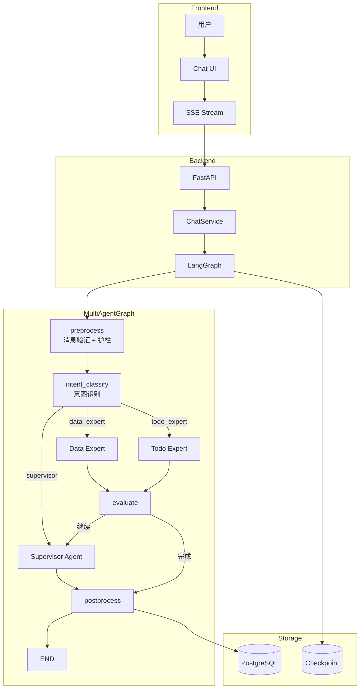
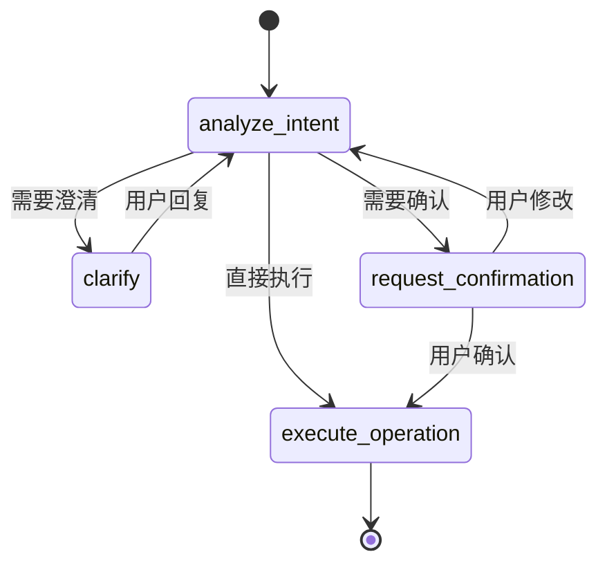

# 多智能体系统需求说明书

> **版本**: v2.0  
> **更新日期**: 2026-01-14  
> **作者**: AI Architecture Team

---

## 目录

1. [系统概述](#1-系统概述)
2. [架构设计](#2-架构设计)
3. [智能体定义](#3-智能体定义)
4. [状态管理](#4-状态管理)
5. [节点详解](#5-节点详解)
6. [工具集成](#6-工具集成)
7. [安全机制](#7-安全机制)
8. [事件协议](#8-事件协议)
9. [扩展能力](#9-扩展能力)
10. [API 规范](#10-api-规范)

---

## 1. 系统概述

### 1.1 项目背景

本系统是基于 **LangGraph + FastAPI** 构建的多智能体对话系统，采用 **Supervisor 模式** 协调多个专业 Agent 协同工作。

### 1.2 核心目标

| 目标 | 描述 |
|------|------|
| **智能路由** | 根据用户意图自动分发到合适的专家 Agent |
| **安全可控** | 护栏系统保障输入输出安全 |
| **高效响应** | 意图识别减少不必要的 LLM 调用 |
| **可扩展** | 易于添加新的专家 Agent |

### 1.3 技术栈

| 层级 | 技术 | 说明 |
|------|------|------|
| 编排层 | LangGraph | 状态图、流式处理 |
| 模型层 | LangChain | LLM 抽象、工具调用 |
| API 层 | FastAPI | 异步 API、SSE 推送 |
| 存储层 | PostgreSQL | 对话持久化、Checkpoint |
| 前端层 | Next.js + React | 实时 UI 更新 |

### 1.4 设计原则

1. **单一职责**: 每个 Agent 专注特定领域
2. **渐进披露**: Prompt 按需加载详细参考
3. **安全第一**: 输入输出双重护栏
4. **可观测性**: 完整的事件日志和追踪

---

## 2. 架构设计

### 2.1 整体架构



### 2.2 执行流程

```
1. 用户发送消息
   ↓
2. Preprocess 节点
   - 消息验证
   - 护栏检查（Prompt 注入、敏感信息）
   - 附件分析
   ↓
3. Intent Classify 节点
   - 使用轻量级模型识别意图
   - 决定路由目标
   ↓
4. 路由分发
   ├── Supervisor: 简单任务直接处理
   ├── Data Expert: 复杂数据分析
   └── Todo Expert: 待办事项管理
   ↓
5. Evaluate 节点（专家执行后）
   - 评估任务完成度
   - 决定是否需要继续
   ↓
6. Postprocess 节点
   - 保存对话历史
   - 清理临时资源
   ↓
7. 返回结果给用户
```

### 2.3 消息流向

| 阶段 | 输入 | 输出 | 说明 |
|------|------|------|------|
| Preprocess | HumanMessage | MultiAgentState | 消息验证、护栏 |
| Intent | MultiAgentState | detected_intent | 意图识别 |
| Supervisor | State + Tools | AIMessage | 路由决策或直接回复 |
| Expert | State + Task | AIMessage | 专业任务处理 |
| Evaluate | State | evaluation | 任务评估 |
| Postprocess | State | Final Response | 保存、清理 |

---

## 3. 智能体定义

### 3.1 Supervisor Agent

**职责**: 理解用户意图，直接处理简单任务，或委派给专家

**系统提示词** (决策树格式):

```
## 决策树

用户请求
    ├─ 简单问候？ → 直接回复
    ├─ 需要联网？ → tavily_search
    ├─ 知识库查询？ → knowledge_search
    ├─ 数据库查询？ → sql_inter
    ├─ 绘图请求？ → fig_inter
    ├─ 复杂分析？ → 委派 data_expert
    └─ 待办管理？ → 委派 todo_expert
```

**可用工具**:

| 工具 | 用途 | 直接/委派 |
|------|------|----------|
| `tavily_search` | 联网搜索 | 直接 |
| `knowledge_search` | 知识库检索 | 直接 |
| `sql_inter` | SQL 查询 | 直接 |
| `fig_inter` | 图表绘制 | 直接 |
| `analyze_image` | 图片分析 | 直接 |
| `read_uploaded_file` | 文件读取 | 直接 |
| `assign_to_data_expert` | 委派数据分析 | 委派 |
| `assign_to_todo_expert` | 委派待办管理 | 委派 |

### 3.2 Data Expert Agent

**职责**: 复杂多步骤数据分析

**适用场景**:
- 读取文件 + 数据清洗 + 统计分析 + 可视化
- 需要 Python 代码进行复杂计算
- 多维度数据分析报告

**可用工具**:
- `python_inter`: Python 代码执行
- `extract_data`: 数据提取
- `fig_inter`: 可视化
- `sql_inter`: 数据查询

### 3.3 Todo Expert Agent

**职责**: 待办事项管理，支持多轮对话

**状态机流程**:



**可用工具**:
- `add_todo`: 创建待办
- `list_todos`: 查询待办
- `update_todo`: 更新待办
- `complete_todo`: 完成待办
- `delete_todo`: 删除待办

**特殊能力**:
- 主动澄清追问
- 任务拆解
- 冲突检测
- 优先级动态调整

---

## 4. 状态管理

### 4.1 MultiAgentState

```python
class MultiAgentState(TypedDict):
    """多智能体状态定义。"""
    
    # 核心字段
    messages: Annotated[Sequence[BaseMessage], add_messages]
    user_id: Optional[int]
    thread_id: Optional[str]
    
    # 模型配置
    model_id: Optional[str]
    enable_thinking: Optional[bool]
    
    # 处理上下文
    attachment_analysis: Optional[str]  # 附件分析结果
    evaluation: Optional[str]           # 评估结果
    iteration_count: Optional[int]      # 迭代计数
    thinking_content: Optional[str]     # 思考内容
    
    # 意图识别（Phase 2）
    detected_intent: Optional[str]      # 识别到的意图
    intent_route: Optional[str]         # 路由目标
```

### 4.2 TodoAgentState

```python
class TodoAgentState(TypedDict):
    """待办 Agent 状态 - 多轮对话增强版。"""
    
    # 对话消息
    messages: Annotated[List[BaseMessage], add_messages]
    
    # 操作状态
    pending_operation: Optional[Dict]   # 待执行的操作
    user_confirmed: Optional[bool]      # 用户是否确认
    quick_mode: Optional[bool]          # 快速模式（跳过确认）
    skip_confirmation: Optional[bool]   # 跳过确认标记
    
    # 多轮对话增强
    pending_clarifications: Optional[List[str]]  # 待澄清问题
    detected_conflicts: Optional[List[Dict]]     # 检测到的冲突
    time_constraints: Optional[Dict]             # 时间约束
    extracted_info: Optional[Dict]               # 提取的信息
    
    # 批量处理
    project_queue: Optional[List[str]]           # 项目队列
    current_project_index: Optional[int]         # 当前项目索引
```

### 4.3 状态持久化

使用 PostgreSQL Checkpoint 保存状态：

```python
# 获取 Checkpointer
checkpointer = get_checkpointer()

# 创建图时传入
graph = create_multi_agent_graph(
    checkpointer=checkpointer,
    # ...
)

# 恢复中断的对话
config = {"configurable": {"thread_id": thread_id}}
await graph.astream(input, config)
```

---

## 5. 节点详解

### 5.1 Preprocess 节点

**文件**: `multi_agent_graph.py` - `_preprocess_multimodal()`

**职责**:
1. 消息验证与修复
2. **护栏验证**（Phase 3）
3. 附件分析（图片、文件）

**关键代码**:

```python
async def _preprocess_multimodal(state: MultiAgentState) -> dict:
    # 1. 消息验证
    validated = validate_messages(messages, fix_reasoning=should_fix_reasoning)
    
    # 2. 护栏验证
    if isinstance(last_msg, HumanMessage):
        passed, sanitized, reason = await guardrail_runner.validate_input(content)
        if not passed:
            emit_status(writer, message=f"安全检查: {reason}")
    
    # 3. 附件分析
    if image_urls:
        analysis_result = analyze_image.invoke({"image_url": image_urls[0]})
        updates["attachment_analysis"] = f"[图片分析结果] {analysis_result}"
    
    return updates
```

### 5.2 Intent Classify 节点

**文件**: `multi_agent_graph.py` - `_classify_intent()`

**职责**: 使用轻量级模型快速识别用户意图

**意图类型**:

| 意图 | 说明 | 路由目标 |
|------|------|----------|
| `greeting` | 问候/闲聊 | supervisor |
| `web_search` | 联网查询 | supervisor |
| `knowledge_query` | 知识库查询 | supervisor |
| `data_query` | 数据库查询 | supervisor |
| `data_analysis` | 复杂数据分析 | data_expert |
| `todo_management` | 待办管理 | todo_expert |
| `chart_drawing` | 绘图请求 | supervisor |
| `image_analysis` | 图片分析 | supervisor |
| `file_processing` | 文件处理 | data_expert |
| `unknown` | 未知 | supervisor |

### 5.3 Evaluate 节点

**文件**: `multi_agent_graph.py` - `_evaluate_expert_work()`

**职责**: 评估专家工作是否完成

**评估逻辑**:

```python
def _evaluate_expert_work(state: MultiAgentState) -> dict:
    # 检查最后一条消息
    last_msg = state["messages"][-1]
    
    # 如果是工具调用，可能需要继续
    if hasattr(last_msg, "tool_calls") and last_msg.tool_calls:
        return {"evaluation": "continue"}
    
    # 否则任务完成
    return {"evaluation": "done"}
```

### 5.4 Postprocess 节点

**文件**: `multi_agent_graph.py` - `_postprocess()`

**职责**:
1. 保存对话历史到数据库
2. 清理线程缓存
3. 发送完成事件

---

## 6. 工具集成

### 6.1 工具分类

| 类别 | 工具 | 文件 | 说明 |
|------|------|------|------|
| 数据工具 | `sql_inter` | `chatTools.py` | SQL 执行 |
| 数据工具 | `python_inter` | `chatTools.py` | Python 执行 |
| 数据工具 | `extract_data` | `chatTools.py` | 数据提取 |
| 可视化 | `fig_inter` | `chatTools.py` | 图表绘制 |
| 知识库 | `knowledge_search` | `ragflow_tool.py` | RAG 检索 |
| 文件 | `read_uploaded_file` | `file_tools.py` | 文件读取 |
| 视觉 | `analyze_image` | `vision_tool.py` | 图片分析 |
| 搜索 | `tavily_search` | 内置 | 联网搜索 |
| 待办 | `add_todo` 等 | `todo_tools.py` | 待办 CRUD |

### 6.2 工具规范

```python
@tool(args_schema=MyToolInput)
def my_tool(
    param1: str,
    param2: int = None,
    config: RunnableConfig = None
) -> str:
    """工具描述（会显示给 LLM）。
    
    详细说明：什么场景使用此工具。
    """
    user_id = _get_user_id(config)
    
    # 业务逻辑
    
    return "✅ 操作成功：xxx"
```

### 6.3 Handoff 工具

用于 Supervisor 委派任务给专家：

```python
def _create_task_handoff_tool(agent_name: str, description: str):
    """创建委派工具。"""
    
    @tool(name=f"assign_to_{agent_name}")
    def handoff_tool(
        task_description: str,
        state: Annotated[dict, InjectedState],
    ) -> Command:
        agent_input = {
            **state, 
            "messages": [HumanMessage(content=task_description, name="supervisor_handoff")]
        }
        return Command(
            goto=[Send(agent_name, agent_input)], 
            graph=Command.PARENT
        )
    
    return handoff_tool
```

---

## 7. 安全机制

### 7.1 护栏系统

**文件**: `app/ai/guardrails.py`

#### 输入护栏

| 护栏 | 功能 | 行为 |
|------|------|------|
| `check_content_length` | 限制输入长度 | 拒绝 > 50KB |
| `check_prompt_injection` | 检测注入攻击 | 拒绝危险模式 |
| `sanitize_sensitive_data` | 脱敏敏感信息 | 替换身份证/手机号/银行卡 |

#### 输出护栏

| 护栏 | 功能 | 行为 |
|------|------|------|
| `check_sensitive_output` | 检测信息泄露 | 过滤 API Key/密码 |
| `check_harmful_content` | 检测有害内容 | 过滤危险信息 |

#### 使用方式

```python
from app.ai.guardrails import guardrail_runner

# 输入验证
passed, content, reason = await guardrail_runner.validate_input(user_message)

# 输出验证
passed, content, reason = await guardrail_runner.validate_output(llm_response)
```

### 7.2 自定义护栏

```python
from app.ai.guardrails import input_guardrail, GuardrailResult

@input_guardrail
async def my_custom_check(content: str) -> GuardrailResult:
    if "禁止词" in content:
        return GuardrailResult(passed=False, reason="包含禁止词")
    return GuardrailResult(passed=True)

guardrail_runner.add_input_guardrail(my_custom_check)
```

---

## 8. 事件协议

### 8.1 SSE 事件类型

**文件**: `app/ai/events.py`

> [!IMPORTANT]
> 本节为开发速查。事件清单与字段规范以 `docs/开发文档/代码解读/SSE事件协议.md` 为权威来源。

| 事件 | 函数 | 用途 |
|------|------|------|
| `token` | `emit_token` | AI 文本输出 |
| `thinking` | `emit_thinking` | 思考过程 |
| `status` | `emit_status` | 状态更新 |
| `tool_start` | `emit_tool_start` | 工具调用开始 |
| `tool_end` | `emit_tool_end` | 工具调用结束 |
| `result` | `emit_result` | 结构化结果 |
| `confirmation` | `-` | 确认请求（按统一 stream contract 发送） |
| `clarification` | `emit_clarification` | 澄清请求 |
| `error` | `emit_error` | 错误信息 |
| `done` | `AgentEvent.done()` | 流结束 |

### 8.2 事件发送

```python
from langgraph.config import get_stream_writer
from app.ai.events import emit_status, emit_result

def my_node(state):
    writer = get_stream_writer()
    
    emit_status(writer, "正在处理...")
    
    # 业务逻辑
    
    emit_result(writer, "todo_list", {"todos": [...]})
    
    return state
```

### 8.3 前端处理

```typescript
const callbacks: StreamCallbacks = {
  onToken: (token) => appendToAiMessage(aiId, token),
  onThinking: (content) => handleThinking(aiId, content),
  onToolStart: (name, input) => addToolCallToMessage(aiId, name, input),
  onStatus: (message) => setCurrentStatus(message),
  onResult: (data) => handleResult(data),
  onDone: () => setIsLoading(false),
};
```

---

## 9. 扩展能力

### 9.1 添加新专家 Agent

1. 在 `AgentType` 中添加类型
2. 在 `AGENT_DESCRIPTIONS` 中添加描述
3. 创建 Agent 实例和工具
4. 在 `create_multi_agent_graph()` 中注册节点

```python
# 1. 添加类型
class AgentType:
    NEW_EXPERT = "new_expert"

# 2. 添加描述
AGENT_DESCRIPTIONS[AgentType.NEW_EXPERT] = "新专家的描述..."

# 3. 注册节点
workflow.add_node("new_expert", _create_streaming_agent_wrapper(new_agent, "new_expert"))
workflow.add_edge("new_expert", "evaluate")
```

### 9.2 添加新工具

1. 创建工具函数
2. 定义输入 Schema
3. 注册到 Agent

```python
from langchain.tools import tool
from pydantic import BaseModel, Field

class MyToolInput(BaseModel):
    param: str = Field(description="参数说明")

@tool(args_schema=MyToolInput)
def my_tool(param: str) -> str:
    """工具描述。"""
    return f"结果: {param}"
```

### 9.3 扩展模块

| 模块 | 文件 | 功能 |
|------|------|------|
| 意图识别 | `intent_classifier.py` | 意图分类 |
| 参数提取 | `parameter_extractor.py` | 结构化参数提取 |
| 输出评估 | `llm_judge.py` | LLM as Judge |
| 渐进披露 | `prompt_loader.py` | 按需加载参考文档 |

---

## 10. API 规范

### 10.1 聊天接口

```
POST /api/v1/chat/stream
Content-Type: application/json

{
  "message": "用户消息",
  "thread_id": "会话ID",
  "model_id": "模型ID",
  "enable_thinking": false,
  "multi_agent": true
}
```

### 10.2 恢复中断

```
POST /api/v1/chat/resume
Content-Type: application/json

{
  "thread_id": "会话ID",
  "user_input": "用户确认/取消"
}
```

### 10.3 历史查询

```
GET /api/v1/chat/history?thread_id=xxx
```

---

## 附录

### A. 配置参数

| 参数 | 环境变量 | 默认值 | 说明 |
|------|----------|--------|------|
| 默认模型 | `DEFAULT_MODEL` | `gpt-4o` | 主模型 |
| 快速模型 | `FAST_MODEL` | `gpt-4o-mini` | 意图识别等 |
| 最大迭代 | `MAX_ITERATIONS` | `10` | 防止无限循环 |
| 护栏开关 | `ENABLE_GUARDRAILS` | `true` | 安全护栏 |

### B. 错误码

| 错误码 | 说明 |
|--------|------|
| `E001` | 消息验证失败 |
| `E002` | 护栏拦截 |
| `E003` | 工具执行失败 |
| `E004` | 超过最大迭代 |
| `E005` | 模型调用失败 |

### C. 性能指标

| 指标 | 目标值 |
|------|--------|
| 意图识别延迟 | < 500ms |
| 首 Token 延迟 | < 2s |
| 完整响应 | < 30s |

---

> **下一步**: 阅读 [多智能体工作流](../代码解读/多智能体工作流.md) 了解代码模式，阅读 [AI模块设计](../架构设计/AI模块设计.md) 了解实现细节。
