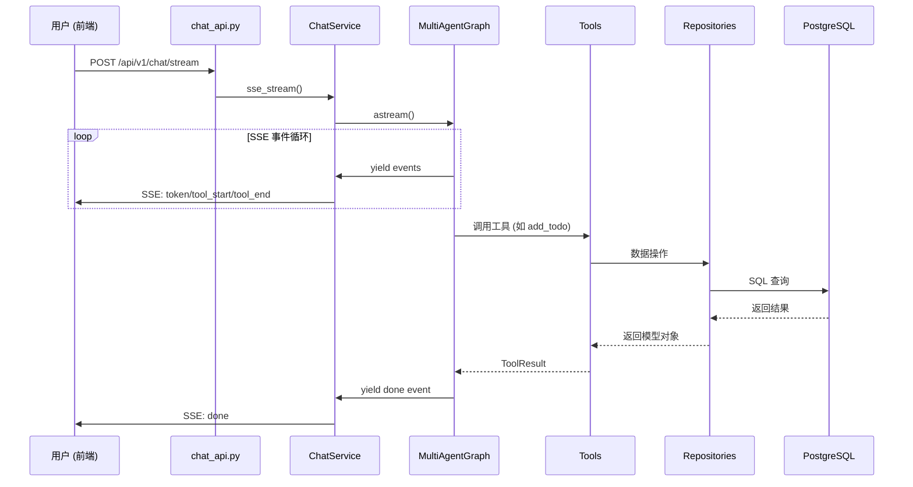
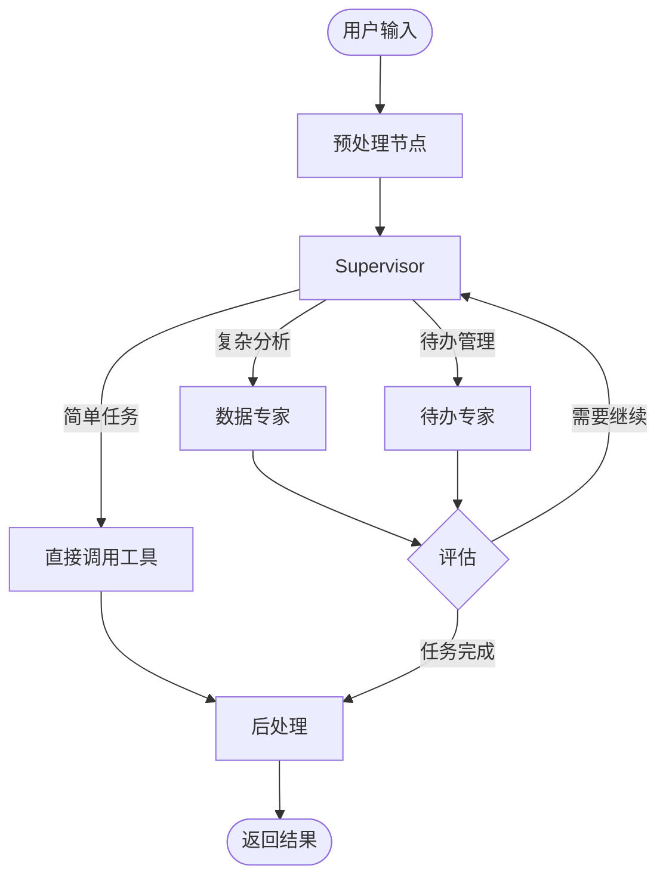

# 系统总览

本文档介绍项目的整体架构、技术栈和核心设计理念。

## 技术栈

### 后端 (Python ≥3.11)

| 分类 | 技术 | 版本 |
|------|------|------|
| **Web 框架** | FastAPI | 0.115.5 |
| **ASGI 服务器** | Uvicorn | 0.32.0 |
| **AI 框架** | LangChain | 1.0.8 |
| **状态图** | LangGraph | 1.0.3 |
| **ORM** | SQLAlchemy | 2.0.36 |
| **对象存储** | MinIO | ≥7.2.8 |

### 前端 (TypeScript)

| 分类 | 技术 | 版本 |
|------|------|------|
| **框架** | Next.js | 15.4.8 |
| **UI** | React | 19.0.0 |
| **类型** | TypeScript | 5.7.2 |
| **样式** | TailwindCSS | 4.0.13 |

---

## 项目结构

```
fastapi/
├── app/                    # 后端核心
│   ├── ai/                 # AI 模块（LangGraph、Agents、Tools）
│   ├── api/v1/endpoints/   # HTTP API 端点
│   ├── core/               # 基础设施（配置、安全、日志）
│   ├── db/                 # 数据库连接层
│   ├── models/             # SQLAlchemy ORM 模型
│   ├── repositories/       # 数据访问层（CRUD）
│   ├── schemas/            # Pydantic 请求/响应模型
│   ├── services/           # 业务逻辑服务层
│   └── tests/              # 测试套件
├── web/                    # 前端 Next.js
│   ├── src/app/            # App Router 页面
│   ├── src/components/     # React 组件
│   ├── src/hooks/          # 自定义 Hooks
│   ├── src/lib/            # 工具函数与 API 客户端
│   └── src/providers/      # React Context Providers
└── docs/                   # 项目文档
```

---

## 核心数据流

### 聊天请求流程



---

## 分层职责

| 层级 | 目录 | 职责 |
|------|------|------|
| **API** | `app/api/v1/endpoints/` | HTTP 入口、参数校验、路由 |
| **Service** | `app/services/` | 业务编排、SSE 流处理 |
| **AI** | `app/ai/` | LangGraph 图、Agent、Tools |
| **Repository** | `app/repositories/` | 数据访问、CRUD 操作 |
| **Model** | `app/models/` | ORM 定义、表结构 |

---

## 多智能体架构

系统采用 **Supervisor 模式** 的多智能体架构：



**工具分布：**

| 位置 | 工具 | 说明 |
|------|------|------|
| Supervisor | fig_inter, sql_inter, knowledge_search | 简单单步任务 |
| 数据专家 | extract_data, python_inter | 多步骤复杂分析 |
| 待办专家 | add_todo, list_todos, update_todo | 需要确认流程 |

---

## 配置管理

项目使用 **双层配置机制**：

1. **环境变量** (`.env.dev` / `.env.prod`)：基础设施配置
2. **数据库配置** (`t_llm_provider`, `t_system_config`)：运行时可修改

配置优先级：`数据库配置 > 环境变量 > 代码默认值`

---

## 启动流程

应用启动时，`lifespan` 函数依次执行：

1. **日志初始化** - 配置日志格式和输出
2. **配置校验** - 验证必要环境变量
3. **数据库初始化** - 可选创建表和管理员
4. **Checkpointer 初始化** - LangGraph 状态持久化
5. **配置服务加载** - 从数据库加载 LLM 和系统配置
