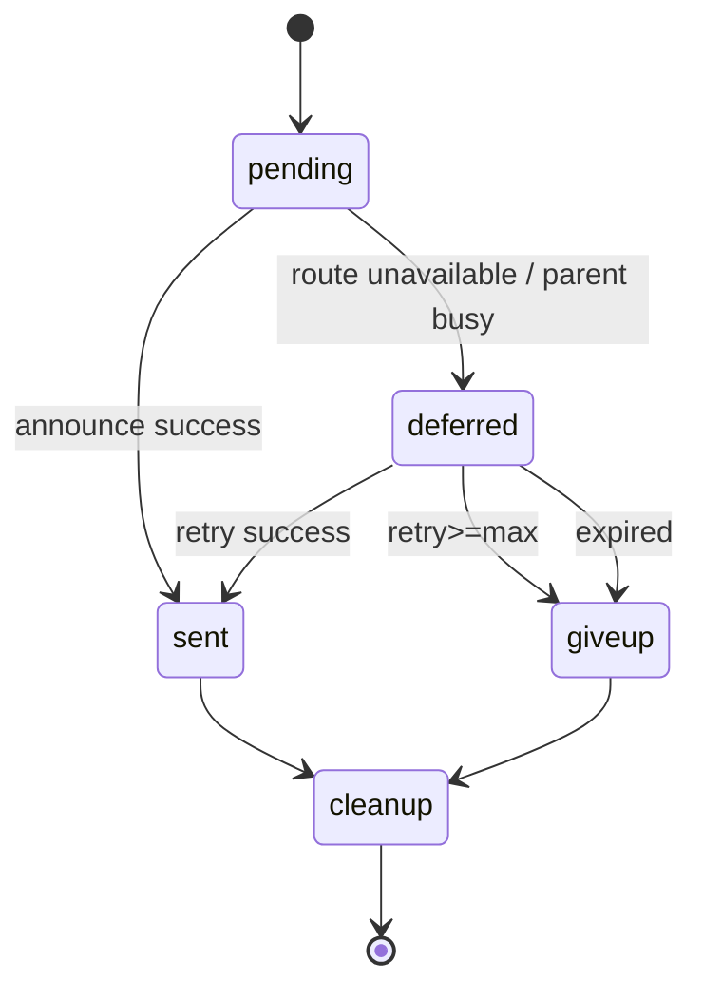

# OpenClaw 吃透度补强：B0-2 注册表恢复与公告补发验证手册

> 文档类型：验证手册（动态链路）  
> 创建日期：2026-02-18  
> 目标：验证 subagent registry 在“进程重启、公告延迟、重试上限、过期清理”下的真实行为，证明系统不是“看起来会恢复”而是“可证据恢复”。

---

## 0. 验证目标

B0-2 要回答两个硬问题：

1. **registry 状态是否可恢复**（重启后不丢关键 run 上下文）
2. **deferred announce 是否可补发**（不是卡死在 pending/deferred）

验证通过后，才能说我们对 OpenClaw 的“子任务状态耐久 + 回传恢复”真的吃透。

---

## 1. 机制背景（先统一心智模型）

基于现有专题结论（`OpenClaw深度解析-Subagent生命周期与编排控制.md`）：

- 子任务不是一次性临时对象，而是有 `registry` 持久状态；
- 公告（announce）不是“立刻发不出去就丢”，而是可进入 deferred 重试链；
- 有硬边界保护：
  - `MAX_ANNOUNCE_RETRY_COUNT = 3`
  - `ANNOUNCE_EXPIRY_MS = 5 min`
- 到上限/过期后应进入 `giveup + cleanupCompleted`，防无限重试热循环。

这意味着 B0-2 不只是“能发一次消息”，而是验证**恢复与收敛策略**。

---

## 2. 代码锚点与检索关键词

> 本手册优先使用“符号 + 关键词”定位，避免受行号漂移影响。

### 2.1 重点文件（按现有专题引用）

- `../bot/openclaw/src/agents/subagents/subagent-registry.ts`
- 与 `runSubagentAnnounceFlow` 相关的调用路径文件（按仓库实际搜索结果为准）

### 2.2 必查符号

- `registerSubagentRun`
- `runSubagentAnnounceFlow`
- `MAX_ANNOUNCE_RETRY_COUNT`
- `ANNOUNCE_EXPIRY_MS`
- `cleanupCompleted`
- `replaceSubagentRunAfterSteer`

### 2.3 建议检索命令

- `rg -n "runSubagentAnnounceFlow|deferred|announce|retry|expiry|cleanupCompleted" ../bot/openclaw/src`
- `rg -n "registerSubagentRun|subagent-registry" ../bot/openclaw/src`

---

## 3. 状态机与验证范围

## 3.1 最小状态机（announce 维度）



## 3.2 本次必须覆盖的边界

1. deferred 后不重启也能补发（正常重试链）
2. deferred + 重启后仍能补发（恢复链）
3. 重试达到上限后 giveup（上限链）
4. 超过 expiry 后 giveup（过期链）

---

## 4. 场景矩阵（必须全过）

| 场景 | 输入条件 | 预期状态转移 | 必须证据 |
|---|---|---|---|
| S1 deferred->sent（同进程） | 人为制造短暂不可达，再恢复 | `pending -> deferred -> sent` | retry 次数递增、最终 sent |
| S2 deferred + restart -> sent | deferred 后立刻重启进程 | 重启后恢复 registry 并补发成功 | 重启前后同 `run_id` 关联、sent 证据 |
| S3 retry 达上限 -> giveup | 持续不可达 | `deferred -> giveup`（因 retry 上限） | `retry_count >= MAX_ANNOUNCE_RETRY_COUNT` |
| S4 expiry -> giveup | 人为加速到过期窗口 | `deferred -> giveup`（因超时） | `expires_at` 与最终 giveup 对应 |

---

## 5. 执行步骤（脚本化模板）

> 核心原则：每个场景都输出“前快照 + 事件链 + 后快照”。

## 5.1 通用准备

1. 启动 gateway/agent，开启结构化事件日志。
2. 准备可稳定触发 subagent 的任务（最好是固定 prompt）。
3. 准备“可控阻断条件”（例如临时关闭目标 route / 切断父会话回传）。
4. 记录 `baseline_ts`，清空旧样本目录。

建议证据目录：

- `output/openclaw源码解析/验证记录/B0-2/`

---

## 5.2 S1：deferred->sent（不重启）

1. 触发子任务并确保初始会走 announce。
2. 在首次 announce 时制造短暂不可达，触发 `deferred`。
3. 恢复可达条件。
4. 等待下一轮重试，确认转为 `sent`。

通过标准：

- 有 `deferred` 记录；
- 重试次数 > 0；
- 最终 `announce_state=sent`。

---

## 5.3 S2：deferred + restart -> sent

1. 重复 S1 前两步，拿到 `deferred`。
2. 导出**重启前快照**（registry + announce queue）。
3. 重启 gateway/agent 进程。
4. 导出**重启后快照**，校验关键 run 仍在可恢复集合。
5. 恢复 route 可达，等待补发完成。

通过标准：

- 同一 `run_id` 在重启后仍可追踪；
- 能看到恢复后的补发尝试；
- 最终 `announce_state=sent`。

---

## 5.4 S3：retry 上限 -> giveup

1. 触发 deferred。
2. 始终保持不可达，直到超过最大重试。
3. 观察状态转为 `giveup`，并记录 `cleanupCompleted`。

通过标准：

- `retry_count` 达上限；
- 最终 `announce_state=giveup`；
- 不再无限尝试。

---

## 5.5 S4：expiry -> giveup

1. 触发 deferred。
2. 通过测试配置缩短 expiry（或等待真实过期窗口）。
3. 过期后检查状态与清理动作。

通过标准：

- `now > expires_at` 后转 `giveup`；
- 有清理标记；
- 无后续重复补发。

---

## 6. 证据链 Schema（每场景必填）

```json
{
  "scenario": "S2_deferred_restart_sent",
  "run_id": "run_xxx",
  "parent_session_id": "sess_parent",
  "child_session_id": "sess_child",
  "announce_key": "ann_xxx",
  "before_restart_snapshot": {
    "announce_state": "deferred",
    "retry_count": 1,
    "expires_at": "2026-02-18T10:30:00Z"
  },
  "after_restart_snapshot": {
    "restored": true,
    "announce_state": "deferred",
    "retry_count": 1
  },
  "timeline": [
    {"ts": "...", "event": "subagent.registered"},
    {"ts": "...", "event": "subagent.announce.deferred", "reason": "route_unavailable"},
    {"ts": "...", "event": "process.restart"},
    {"ts": "...", "event": "subagent.registry.restored"},
    {"ts": "...", "event": "subagent.announce.retry"},
    {"ts": "...", "event": "subagent.announce.sent"}
  ],
  "result": "pass",
  "risks": []
}
```

---

## 7. 关键观测字段（建议统一）

- `run_id`
- `parent_session_id`
- `child_session_id`
- `announce_state`（`pending/deferred/sent/giveup`）
- `retry_count`
- `first_deferred_at`
- `expires_at`
- `cleanup_completed`
- `last_error`
- `delivery_route`（channel/to/account/thread）

没有这些字段，就很难证明“真的恢复了”。

---

## 8. 常见失败模式与定位

## 8.1 重启后找不到 run

排查：

- registry 是否只在内存未持久化；
- restore 时过滤条件是否过严；
- run/session 关联键是否变更。

## 8.2 重启后有恢复但不补发

排查：

- 补发任务调度是否被 draining 标志阻塞；
- 是否误判为 `expired/giveup`；
- route 恢复探测是否未生效。

## 8.3 无限重试不收敛

排查：

- retry 计数是否未持久化；
- expiry 判定是否依赖错误时钟；
- cleanup 标记写入是否失败。

---

## 9. B0-2 通过门槛（DoD）

仅当以下条件全部满足，B0-2 才算通过：

1. S1~S4 全部执行并留存证据 JSON；
2. 至少一次“deferred + restart + sent”成功样本；
3. 至少一次“上限/过期 giveup”样本；
4. 不存在“已 giveup 仍继续重试”的矛盾事件；
5. 产出汇总结论（通过/失败/风险/建议）。

---

## 10. 与你当前重构路线的关系

- B0-2 通过前：`P2` 的子任务并发能力不建议放大到多租户高并发；
- B0-2 通过后：可以进入 B0-3（跨 channel collect 路由一致性），再评估是否放开 collect 自动合并策略。

**一句话：B0-2 证明的是“系统崩了重启后，仍知道该回什么、何时放弃”。**
