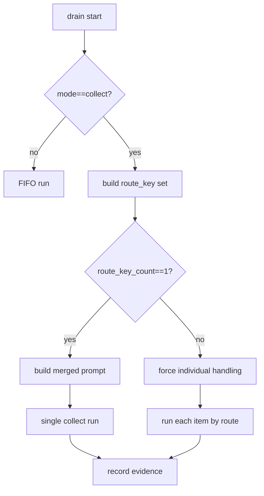

# OpenClaw 吃透度补强：B0-3 跨 Channel Collect 路由一致性验证手册

> 文档类型：验证手册（动态链路）  
> 创建日期：2026-02-18  
> 目标：验证 collect 模式在同路由可合并、跨路由强制拆分，确保“不会串频道合并回复”。

---

## 0. 验证目标

B0-3 只验证一个关键事实：

**OpenClaw 在 collect 模式下，是否严格遵守 route 一致性边界。**

如果这条不成立，你在重构时会遇到最危险的问题：

- A 群和 B 私聊的消息被合并成同一轮回答；
- 多账号/多线程消息交叉污染；
- 看起来“效率高”，本质上是数据越权。

---

## 1. 背景依据（来自已完成深度专题）

基于 `OpenClaw深度解析-Followup队列与任务循环.md` 的结论：

- followup 采用队列化协议；
- `mode=collect` 时会尝试合并 backlog；
- 但存在关键保护：**跨 route（channel/to/account/thread）不合并，改为逐条处理**。

B0-3 的任务就是把这个“源码结论”变成“动态证据”。

---

## 2. 代码锚点与定位关键词

### 2.1 重点文件

- `../bot/openclaw/src/agents/followup/*`（按实际路径搜索）
- collect/drain 相关实现文件（按仓库实际命名）

### 2.2 必查关键词

- `mode == collect`
- `cross-channel`
- `route`
- `channel/to/account/thread`
- `force individual`
- `drain`

### 2.3 建议检索命令

- `rg -n "collect|cross-channel|route|thread|drain" ../bot/openclaw/src/agents`

---

## 3. 最小模型：Route Key

建议把 route 一致性统一抽象为：

```text
route_key = channel + to + account + thread
```

collect 合并的前置条件：

- backlog 中所有消息的 `route_key` 相同。

只要出现多个 `route_key`：

- 必须降级为逐条处理（individual collect 或 FIFO）。

---

## 4. 场景矩阵（必须全过）

| 场景 | 输入队列 | 预期行为 | 必须证据 |
|---|---|---|---|
| S1 同 route collect | 同 channel/to/account/thread 多条消息 | 允许单轮合并执行 | 1 次 collect run + 关联多 message_id |
| S2 跨 thread | 同 channel/account，但 thread 不同 | 禁止合并，逐条处理 | 每条各自 run 或分批 run |
| S3 跨 channel | channel 不同（如 web + telegram） | 禁止合并，逐条处理 | 明确 `cross_route=true` 证据 |
| S4 跨 account | channel 相同但 account 不同 | 禁止合并 | route 维度拆分证据 |
| S5 混合队列（同/跨混合） | backlog 同时包含可合并与不可合并消息 | 仅同 route 子集可合并，其余逐条 | 分组后的执行轨迹 |

---

## 5. 流程图（collect 路由判定）



---

## 6. 执行步骤（脚本模板）

## 6.1 通用准备

1. 固定 queue 配置（mode=collect，给定 debounce/cap）。
2. 准备可注入 backlog 的测试通道（至少 2 个 route 维度）。
3. 开启事件日志并确保包含 route 字段。

建议证据目录：

- `output/openclaw源码解析/验证记录/B0-3/`

---

## 6.2 S1：同 route 合并

1. 连续注入 3 条同 route 消息。
2. 等待一次 drain。
3. 验证只产生 1 次 collect 执行。

通过标准：

- `merged_message_count >= 2`；
- 输出仅投递到该 route。

---

## 6.3 S2/S3/S4：跨维度拆分

1. 分别构造跨 thread、跨 channel、跨 account backlog。
2. 触发 drain。
3. 验证每个 route 独立处理。

通过标准：

- 出现 `cross_route=true`（或同义字段）；
- 无跨 route 合并 run。

---

## 6.4 S5：混合队列

1. 同时投喂：两条同 route + 两条跨 route。
2. 触发 drain。
3. 验证系统只合并可合并子集。

通过标准：

- 至少 1 个 merged run；
- 至少 1 组 individual run；
- 最终消息均投递到正确 route。

---

## 7. 证据链 Schema（每场景必填）

```json
{
  "scenario": "S3_cross_channel_individual",
  "queue_mode": "collect",
  "items": [
    {"message_id": "m1", "channel": "web", "to": "uA", "account": "a1", "thread": "t1"},
    {"message_id": "m2", "channel": "telegram", "to": "uA", "account": "a1", "thread": "t1"}
  ],
  "route_groups": [
    {"route_key": "web:uA:a1:t1", "count": 1},
    {"route_key": "telegram:uA:a1:t1", "count": 1}
  ],
  "timeline": [
    {"ts": "...", "event": "followup.enqueued", "message_id": "m1"},
    {"ts": "...", "event": "followup.enqueued", "message_id": "m2"},
    {"ts": "...", "event": "followup.drain.start"},
    {"ts": "...", "event": "followup.collect.route_check", "cross_route": true},
    {"ts": "...", "event": "followup.collect.force_individual"},
    {"ts": "...", "event": "followup.run.completed", "message_id": "m1"},
    {"ts": "...", "event": "followup.run.completed", "message_id": "m2"}
  ],
  "result": "pass"
}
```

---

## 8. 输出正确性校验（必须加）

除了队列事件，还要校验最终回包：

1. **投递目标校验**：`channel/to/account/thread` 与入队消息一致；
2. **内容污染校验**：A route 回包不得引用 B route 私有上下文；
3. **顺序校验**：同 route 内遵守 FIFO 或策略定义顺序。

建议每条回包附带：

- `source_message_ids`
- `route_key`
- `drain_round`

---

## 9. 常见失败模式

## 9.1 路由字段缺失导致误合并

排查：

- route_key 构造时是否使用了默认空值；
- 某些 channel 适配器是否漏填 account/thread。

## 9.2 只在日志里拆分，实际发送仍串路由

排查：

- 执行层与发送层是否使用同一 route 结构；
- send API 入参是否在中间层被覆盖。

## 9.3 队列超限后 summary 混入跨路由内容

排查：

- dropped summary 是否按 route 分桶；
- summary prompt 是否带 route 隔离上下文。

---

## 10. B0-3 通过门槛（DoD）

B0-3 通过条件：

1. S1~S5 全部执行并留证；
2. 至少 1 个跨 route 队列样本证明“强制 individual”；
3. 最终回包投递目标 100% 正确；
4. 无“跨 route 内容污染”样本；
5. 形成路由一致性风险清单与防护建议。

---

## 11. 与你项目改造的直接关系

- B0-3 通过前：`collect` 模式只能在单 route 严格受控灰度；
- B0-3 通过后：可把 `queue+collect` 从“可用”提升到“可上线”；
- 对你现有 FastAPI + LangGraph：这一步直接决定 `followup/collect` 能否安全接入生产多渠道。

**一句话：B0-3 证明的是“系统会自动推进，但不会自动越界”。**
