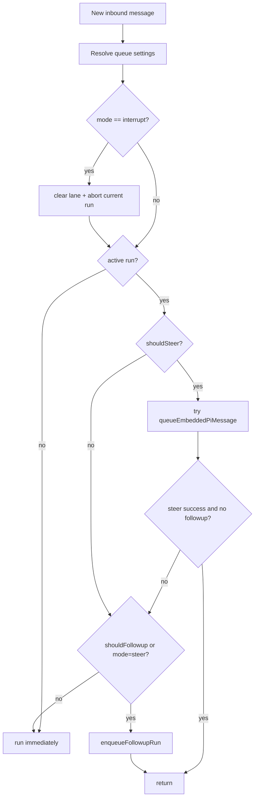
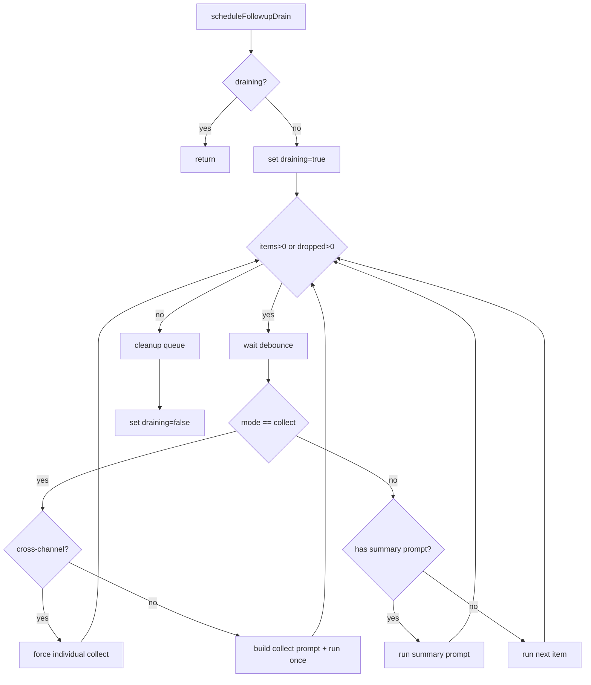

# OpenClaw 深度解析：Followup 队列与任务循环

> 文档类型：源码级深挖（长期维护）  
> 创建日期：2026-02-18  
> 主题：为什么 OpenClaw 在多轮追问里不会轻易“乱节奏”

---

## 0. 结论先行

OpenClaw 的多轮稳定性，不是靠模型“临场发挥”，而是靠 **队列协议 + 模式机 + drain 循环**。

一句话：

**每条新消息先进入统一队列判定（steer / followup / collect / interrupt），再由 drain 机制按规则出队；模型只负责内容，节奏由协议控制。**

---

## 1. 源码入口（关键文件）

- `../bot/openclaw/src/auto-reply/reply/queue/types.ts`
- `../bot/openclaw/src/auto-reply/reply/queue/state.ts`
- `../bot/openclaw/src/auto-reply/reply/queue/settings.ts`
- `../bot/openclaw/src/auto-reply/reply/queue/directive.ts`
- `../bot/openclaw/src/auto-reply/reply/queue/enqueue.ts`
- `../bot/openclaw/src/auto-reply/reply/queue/drain.ts`
- `../bot/openclaw/src/utils/queue-helpers.ts`
- `../bot/openclaw/src/auto-reply/reply/get-reply-run.ts`
- `../bot/openclaw/src/auto-reply/reply/agent-runner.ts`
- `../bot/openclaw/src/auto-reply/reply/queue/cleanup.ts`

---

## 2. 队列模式机（QueueMode）

`QueueMode` 定义：

- `steer`
- `followup`
- `collect`
- `steer-backlog`
- `interrupt`
- `queue`（归一化后会映射到 `steer`）

归一化在 `normalizeQueueMode(...)` 中处理，同义词如 `queued`, `coalesce`, `abort` 都会被映射成标准模式。

---

## 3. 配置优先级：谁决定当前消息怎么排队

`resolveQueueSettings(...)` 的优先级非常清晰：

1. 当前消息 inline 指令（`/queue ...`）
2. session 持久配置
3. channel 覆盖（`byChannel`）
4. channel plugin 默认
5. global 默认
6. 代码默认（mode 默认 `collect`）

这意味着：

- 你可以全局给默认行为；
- 关键消息也可以临时改模式；
- 不会出现“改了一个地方全局乱掉”。

---

## 4. `/queue` 指令如何解析（协议化输入）

`extractQueueDirective(...)` 会从消息文本中抽出队列指令，并把正文清理掉 `/queue` 片段。

支持参数：

- `mode`：`steer/followup/collect/steer+backlog/interrupt`
- `debounce:<duration>`
- `cap:<int>`
- `drop:<old|new|summarize>`
- `reset/default/clear`

若参数非法，会在 `directive-handling.queue-validation.ts` 直接返回错误提示，不进入执行链路。

---

## 5. 入队前置判定：中断、steer、followup 的分流

`get-reply-run.ts` 与 `agent-runner.ts` 组合起来形成判定门：

1. 先算 `resolvedQueue`
2. 若 `interrupt` 且 lane 有任务：清 lane + 中断当前 run
3. 计算：
   - `shouldSteer = steer || steer-backlog`
   - `shouldFollowup = followup || collect || steer-backlog`
4. 如果当前 run active：
   - steer 先尝试注入消息到 active run
   - followup/steer 模式则入队并返回

---

## 6. 入队策略：去重 + cap + drop

### 6.1 去重

`enqueueFollowupRun(...)` 支持 dedupe mode：

- `message-id`（默认）
- `prompt`
- `none`

默认会比较 messageId + 路由维度（channel/to/account/thread），防止同消息重复排队。

### 6.2 cap 与 drop

`applyQueueDropPolicy(...)` 支持：

- `drop:new`：新消息直接丢弃
- `drop:old`：挤掉最旧消息
- `drop:summarize`（默认）：挤掉最旧并生成 summaryLines

`summaryLines` 会在 drain 阶段合成为 “Queue overflow summary prompt”。

---

## 7. Drain 循环：真正的“节奏控制器”

`scheduleFollowupDrain(...)` 是核心循环：

- 每次出队前都 `waitForQueueDebounce`
- 如果 mode=collect：
  - 尝试批量合并
  - 若跨 channel / 路由不一致，则强制单条处理（防串路由）
- 若有 dropped summary：优先发送 summaryPrompt
- 常规情况：FIFO 逐条执行

错误时不会丢队列：

- catch 里只刷新 `lastEnqueuedAt`，然后 finally 重新调度 drain

---

## 8. Collect 模式的关键细节（防“合并错发”）

OpenClaw 在 collect 模式下有一个容易被忽略但非常关键的逻辑：

- 如果待合并消息跨多个路由目标（channel/to/account/thread），**不合并**，改为逐条执行。

这避免了一个常见事故：

- A 群 + B 私聊消息被错误合并到同一回复里。

这类“路由一致性保护”是调研/多线程场景稳定性的核心。

---

## 9. Queue 状态可观测字段

`FollowupQueueState` 包含：

- `items`
- `draining`
- `mode`
- `debounceMs`
- `cap`
- `dropPolicy`
- `droppedCount`
- `summaryLines`
- `lastRun`

这些状态使得系统可以实现“可解释”：

- 当前为何没回复？（在排队）
- 为何丢消息？（cap + drop policy）
- 为什么先回 summary？（overflow 摘要先行）

---

## 10. 清理与中止：不是只停当前 run

`clearSessionQueues(...)` 会同时清两类队列：

1. followup queue
2. command lane

在 `kill/steer/abort` 等操作中，这能避免“当前任务停了，但积压队列继续把旧上下文喂回去”的假死行为。

---

## 11. 为什么这会让 OpenClaw 看起来“会自动推进”

你会看到它很像在自主推进，是因为：

- 新信息不会打断执行链，而是进入协议化 backlog；
- 执行完成后 drain 自动续跑；
- collect 让一堆追问先合并成一轮“高质量处理”；
- interrupt/steer 支持高优先级抢占。

本质是 **任务节奏由系统态驱动，不由 LLM 临时决定**。

---

## 12. 对你 FastAPI + LangGraph 的落地映射

### 12.1 必做最小集

建议新增：

- `FollowupQueueState`（每 session 一份）
- `resolve_queue_settings(...)`（按 inline/session/global 优先级）
- `enqueue_followup(...)`（dedupe + cap + drop）
- `drain_followup(...)`（collect + summary + retry）

### 12.2 与你当前图编排的接点

- Supervisor 输出消息后，不直接“结束”；
- 如果 active run 存在，新消息进入 queue；
- Evaluate 节点结束时触发 drain；
- `done criteria` 只在 queue 清空 + 当前 run 达成时判 true。

### 12.3 你应新增的事件字段

建议在 `app/ai/events.py` 补：

- `queue_mode`
- `queue_depth`
- `queue_drop_policy`
- `dropped_count`
- `drain_round_id`
- `drain_reason`

这样前端与日志能直接解释“系统当前在干嘛”。

---

## 13. 反模式与防线

### 13.1 反模式

- 无队列：active run 时新消息直接覆盖上下文
- 只做 collect，不做跨路由保护
- drop 后不留 summary，导致信息静默丢失
- 结束条件只看“这一轮有没有 tool_call”

### 13.2 防线

- queue 状态可观测
- drain 循环可恢复
- collect 受路由一致性约束
- done criteria 绑定 queue + evidence，而非模型自述

---

## 14. 你下一步可直接执行的三件事

1. 落地 `/queue` 指令解析，支持 `mode/debounce/cap/drop`。  
2. 在现有 `multi_agent_graph` 后接一个 `queue_drain` 机制。  
3. 把“结束判定”改为：`queue empty AND done_criteria met AND evidence complete`。

