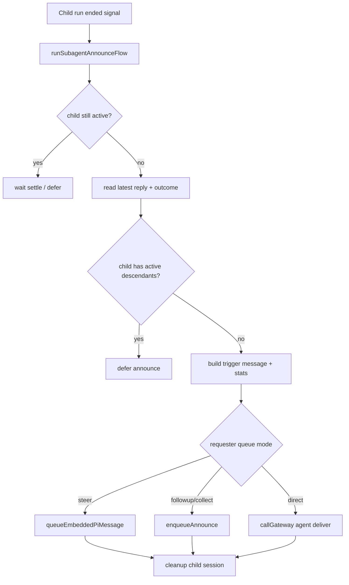
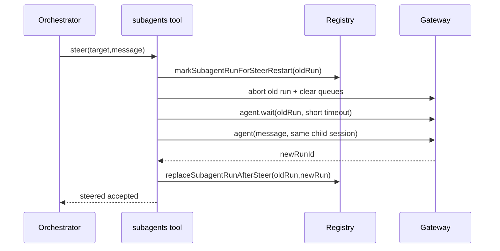

# OpenClaw 深度解析：Subagent 生命周期与编排控制

> 文档类型：源码级深挖（长期维护）  
> 创建日期：2026-02-18  
> 主题：OpenClaw 如何把“子任务自治”做成可控系统，而不是失控并发

---

## 0. 结论先行

OpenClaw 的 subagent 不是“随便开线程”，而是完整的生命周期系统：

**spawn 准入 -> 注册与持久化 -> 运行监听 -> 完成公告 -> 清理/归档 -> steer/kill 干预 -> 重试与兜底。**

这套机制让它具备两个关键特征：

1. 看起来会并行推进（确实在并行）；
2. 即使失败/中断/重启，也能从状态层恢复，不轻易丢结果。

---

## 1. 源码入口（关键文件）

### 1.1 Spawn 与工具入口

- `../bot/openclaw/src/agents/tools/sessions-spawn-tool.ts`
- `../bot/openclaw/src/agents/subagent-spawn.ts`

### 1.2 生命周期注册与持久化

- `../bot/openclaw/src/agents/subagent-registry.ts`
- `../bot/openclaw/src/agents/subagent-registry.store.ts`
- `../bot/openclaw/src/agents/subagent-depth.ts`

### 1.3 运行时控制与回传

- `../bot/openclaw/src/agents/tools/subagents-tool.ts`
- `../bot/openclaw/src/agents/subagent-announce.ts`
- `../bot/openclaw/src/agents/subagent-announce-queue.ts`

---

## 2. Spawn 准入：不是“能调 sessions_spawn 就一定能开”

`spawnSubagentDirect(...)` 在真正发起前做了多重准入：

1. 深度检查：`callerDepth >= maxSpawnDepth` 直接 forbidden
2. 子任务数检查：`activeChildren >= maxChildrenPerAgent` forbidden
3. 跨 agent 代理检查：若 `targetAgentId != requesterAgentId`，必须命中 allowAgents
4. thinking 值合法性检查（不合法直接 error）
5. model patch 的 recoverable / non-recoverable 错误分流

核心思想：

- spawn 是受控资源，不是随意扩散。

---

## 3. Spawn 后的初始化动作

通过准入后，OpenClaw 会做这些事：

1. 生成 `childSessionKey = agent:<agentId>:subagent:<uuid>`
2. `sessions.patch` 写入 `spawnDepth`
3. 按规则 patch model / thinking
4. 构造 `buildSubagentSystemPrompt(...)`
5. 调 `agent` RPC 启动 child run（`lane=AGENT_LANE_SUBAGENT`）
6. `registerSubagentRun(...)` 写入 registry

其中第 4 步尤其关键：

- prompt 里明确“你是子代理，不是主代理”；
- 明确能否继续 spawn（按 depth）；
- 明确“结果自动回传，不要 busy polling”。

---

## 4. Subagent 系统提示词：约束角色边界

`buildSubagentSystemPrompt(...)` 明确了这些规则：

- 只做分配任务，不扩展范围
- 完成后自动汇报给上级
- 不主动心跳、不做旁支动作
- 可选允许 spawn（orchestrator）或禁止（leaf）
- 提醒 compaction/truncation 后要分块重读而非全量重读

这是一条非常实用的经验：

**“子代理可控”首先是角色规约可控。**

---

## 5. Registry：生命周期的状态中枢

`SubagentRunRecord` 记录了完整生命周期字段：

- 基础：`runId/childSessionKey/requesterSessionKey/task/cleanup/label/model`
- 时间：`createdAt/startedAt/endedAt/archiveAtMs`
- 结果：`outcome`
- 清理：`cleanupHandled/cleanupCompletedAt`
- 公告：`suppressAnnounceReason/announceRetryCount/lastAnnounceRetryAt`

并且持久化到：

- `state/subagents/runs.json`（v2，支持从 v1 迁移）

这让多进程/重启后依然能恢复现场。

---

## 6. 完成监听与收敛：lifecycle + agent.wait 双通道

`subagent-registry.ts` 里有两条完成检测通道：

1. 事件监听：`onAgentEvent(lifecycle)` 捕捉 `start/end/error`
2. 主动等待：`waitForSubagentCompletion(runId, timeout)` 走 `agent.wait`

任一通道拿到结束状态后，会触发 `runSubagentAnnounceFlow(...)`。

这样做的好处：

- embedded 情况下实时；
- 跨进程时也可通过 gateway wait 恢复。

---

## 7. Announce 流：结果如何回到请求方

`runSubagentAnnounceFlow(...)` 的核心步骤：

1. 若 child 仍在 active，先等 settle（防 compaction 重试期误报）
2. 读取 child 最新 assistant reply（含 retry）
3. 若 child 仍有 active descendants，暂不公告（避免中间态）
4. 生成 status label + stats line
5. 按 requester queue 模式决定：
   - steer 注入
   - queued 入 announce queue
   - 或 direct send
6. finally 阶段做 label patch 和 child session delete（按 cleanup 策略）

---

## 8. 嵌套子代理的回传兜底：父会话不存在时上浮

在 announce 流中，如果 requester 本身也是 subagent，会检查：

- 该 requester session 是否还活着；
- 若父 session 已不存在，则用 `resolveRequesterForChildSession(...)` 回退到更上层 requester。

如果找不到上层，则返回 `false` 保持“可重试”，避免结果静默丢失。

这就是为什么 OpenClaw 在复杂嵌套任务里不容易“结果黑洞”。

---

## 9. `subagents` 工具：list / kill / steer 的真实实现

### 9.1 list

- 按 requester 取 runs
- 分 active + recent
- 带 model/runtime/token usage 展示

### 9.2 kill

- `killSubagentRun(...)`：abort 当前 run + clear followup/lane + 标记 terminated
- `cascadeKillChildren(...)`：递归杀掉后代，防遗留子树继续跑

### 9.3 steer（最关键）

流程：

1. 目标解析（index/label/runId/sessionKey）
2. rate limit（默认 2s）
3. 标记 `markSubagentRunForSteerRestart`（先抑制旧 run announce）
4. abort + clear queue
5. 等 `agent.wait` 短暂 settle
6. 重新发 `agent` 内部消息（restart）
7. `replaceSubagentRunAfterSteer(...)` 替换 registry 主记录

---

## 10. 防公告死循环：retry 上限与过期

`subagent-registry.ts` 加了两个硬保护：

- `MAX_ANNOUNCE_RETRY_COUNT = 3`
- `ANNOUNCE_EXPIRY_MS = 5 min`

当 `runSubagentAnnounceFlow` 多次返回 false（deferred）时：

- 到上限或过期会 give up，并标记 cleanupCompleted，防无限重试。

这正是“工程可持续性”的细节：

- 不因边缘状态把系统拖进热循环。

---

## 11. 归档与清理

`registerSubagentRun(...)` 时会计算 `archiveAtMs`（默认来自 `archiveAfterMinutes`）。

sweeper 定时扫描：

- 到期删除 registry entry
- 尝试 `sessions.delete` 删除子会话 transcript

这保证子代理不会长期堆积成状态垃圾。

---

## 12. 为什么这会让 OpenClaw 显得“会自己推进任务”

因为它并不是“一个模型在单线程里强行模拟并发”，而是：

- 子任务真实隔离到独立 session/run
- 有明确的 spawn/kill/steer 控制面
- 有公告回流与队列节奏
- 有持久化与重试机制

所以你看到的是“像自动推进”，实际上是 **系统协议在推进**。

---

## 13. 对你 FastAPI + LangGraph 的落地映射

### 13.1 先做 L1 版本（两周内可落地）

1. `spawn_task`：创建子任务记录 + 限流 + depth
2. `task_registry`：持久化 run 状态
3. `task_control`：`list/kill/steer`
4. `task_announce`：子任务完成回传到主会话

### 13.2 关键数据结构（建议）

至少包含：

- `task_id/parent_task_id/session_key`
- `status(created/running/done/error/timeout/killed)`
- `spawn_depth`
- `announce_state(pending/sent/deferred/giveup)`
- `retry_count`
- `evidence_ref`（结果证据链接）

### 13.3 你当前项目中的建议接线点

- `app/ai/workflow/multi_agent_graph.py`：新增 subtask orchestrator 节点
- `app/ai/state.py`：新增 `subtasks[]/subtask_registry/announce_queue`
- `app/ai/events.py`：新增 `subtask_spawned/subtask_updated/subtask_announced`

---

## 14. 反模式与防线

### 14.1 反模式

- 只有 spawn，没有 registry
- 只有 list，没有 steer/kill
- 子任务完成直接写自然语言，不走结构化 announce
- 父子关系只靠 prompt 文本，不落状态

### 14.2 防线

- 所有 run 必须有状态记录
- kill 必须 cascade
- steer 必须“先抑制旧公告再重启”
- announce 失败必须有重试上限和过期策略

---

## 15. 你下一步可直接执行的三件事

1. 先把“子任务注册表 + 持久化”做出来（没有这层别做复杂并发）。  
2. 实现 `list/kill/steer` 三个控制面，特别是 steer 的 restart 链路。  
3. 把子任务结果回传改成“队列化 announce + 证据字段”，不要直接拼口语文本。

