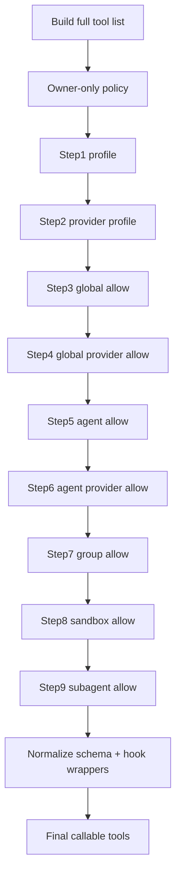
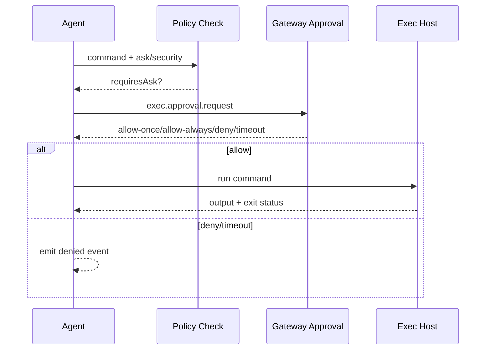

# OpenClaw 深度解析：工具策略管线与权限边界

> 文档类型：源码级深挖（长期维护）  
> 创建日期：2026-02-18  
> 适用目标：解释 OpenClaw 为什么“看起来会自己知道什么时候该用什么工具”

---

## 0. 结论先行

OpenClaw 在“工具调用”这件事上，不是把所有工具直接丢给模型，而是做了 **多层策略管线 + 运行时权限边界 + 审批机制**。  
因此模型即使在复杂任务里也会表现得更“自控”，核心原因不是它更聪明，而是 **可调用空间被结构化约束**。

一句话版本：

**先构建工具全集，再按 7+2 层策略逐层收紧，再按 sandbox/审批约束执行路径，最终形成“能做什么、不能做什么、什么时候要人工批准”的硬边界。**

---

## 1. 源码入口（关键文件）

### 1.1 管线与策略

- `../bot/openclaw/src/agents/tool-policy-pipeline.ts`
- `../bot/openclaw/src/agents/tool-policy.ts`
- `../bot/openclaw/src/agents/pi-tools.policy.ts`
- `../bot/openclaw/src/agents/pi-tools.ts`

### 1.2 沙箱与执行审批

- `../bot/openclaw/src/agents/sandbox/tool-policy.ts`
- `../bot/openclaw/src/agents/sandbox/constants.ts`
- `../bot/openclaw/src/agents/bash-tools.exec.ts`

---

## 2. 核心机制一：7 层默认工具策略管线

`buildDefaultToolPolicyPipelineSteps(...)` 定义了 OpenClaw 的基础 7 层（按顺序执行）：

1. `tools.profile`
2. `tools.byProvider.profile`
3. `tools.allow`
4. `tools.byProvider.allow`
5. `agents.<id>.tools.allow`
6. `agents.<id>.tools.byProvider.allow`
7. `group tools.allow`

然后在实际运行时，`pi-tools.ts` 又追加两层：

8. `sandbox tools.allow`
9. `subagent tools.allow`

这就是经常提到的“7+2 层”运行态策略。

---

## 3. 核心机制二：策略不是一次判断，而是逐层过滤

`applyToolPolicyPipeline(...)` 的执行模型是：

- 拿到初始 `tools[]`
- for 每一个 step：
  - 对策略做预处理（比如 strip plugin-only allowlist）
  - 扩展 plugin group
  - `filterToolsByPolicy` 再过滤一轮
- 输出最终可见工具集

这意味着上层给的“宽策略”可以被下层继续收紧，形成 deterministic 的最小可执行集合。

---

## 4. 核心机制三：插件 allowlist 误配置的“防误杀”

这是 OpenClaw 非常关键的稳定性细节。

在 `stripPluginOnlyAllowlist(...)` 里，如果发现某一层 allowlist 只写了插件工具（没有 core tool），系统会把这层 allowlist 的 `allow` 去掉（置空），避免把核心工具整体误杀。

并且会给 warning：

- unknown entry 会提示；
- 若是 plugin-only allowlist，会提醒使用 `tools.alsoAllow` 做增量插件放开。

本质是：

- **配置错误默认降级为“保核心能力”**，而不是“一刀切全不可用”。

---

## 5. 核心机制四：group/profile/alias 与插件组扩展

`tool-policy.ts` 还做了几件基础治理：

- 工具别名归一化：`bash -> exec`, `apply-patch -> apply_patch`
- 工具组定义（如 `group:fs`, `group:runtime`, `group:sessions`）
- profile（`minimal/coding/messaging/full`）
- plugin group 扩展（`group:plugins`、按 pluginId 展开）

结果是：

- 策略可写抽象组，不必硬编码每个工具名；
- provider 和 plugin 变化时，策略仍能稳定生效。

---

## 6. 核心机制五：owner-only 与 subagent 深度约束

### 6.1 Owner-only

`applyOwnerOnlyToolPolicy(...)` 会拦截 owner-only 工具（如 `whatsapp_login`）：

- 非 owner 调用直接从工具列表过滤掉；
- 即便漏过，还会在 execute 层抛错兜底。

### 6.2 Subagent 工具白黑名单（按深度）

`resolveSubagentToolPolicy(...)` 会按深度生成 deny list：

- 永久 deny：`gateway`, `agents_list`, `memory_search`, `memory_get`, `sessions_send` 等
- leaf 节点追加 deny：`sessions_spawn`, `sessions_list`, `sessions_history`

也就是：

- 一级可编排子代理（orchestrator subagent）还能管理子任务；
- 叶子 worker 只做执行，不再继续扩散。

---

## 7. 核心机制六：Sandbox 侧工具策略与默认边界

`sandbox/tool-policy.ts` 中，policy 来源优先级是：

- agent 级配置 > global 配置 > 默认值

默认值来自 `sandbox/constants.ts`：

- 默认允许：`exec/process/read/write/edit/apply_patch/image/sessions_*/subagents/session_status`
- 默认拒绝：`browser/canvas/nodes/cron/gateway` 和 channel 工具

同时还会保底把 `image` 注入 allow（除非显式 deny），兼顾多模态工作流。

这对应 OpenClaw 的一个工程取舍：

- sandbox 不是“全开放运行机”，而是“受限能力容器”。

---

## 8. 核心机制七：Exec 审批流（approval required）

`bash-tools.exec.ts` 的执行路径里，`requiresExecApproval(...)` 会根据：

- `ask` 策略
- `security` 策略
- allowlist 命中情况
- 语义分析结果

决定是否进入审批。

进入审批后：

1. 发起 `exec.approval.request`
2. 等待决策：`allow-once / allow-always / deny / timeout`
3. 决策通过才实际执行
4. 可记录 allowlist（allow-always）
5. 通过系统事件回传“running/finished/denied”

这层机制保证了“高风险命令不是模型一句话就能直接跑”。

---

## 9. 为什么这会让 OpenClaw“像会自己判断”

从外观上看是“模型知道该怎么做”，本质上是三重约束叠加：

1. **可见工具面被多层策略收紧**（模型选项空间变小）
2. **执行路径被 sandbox 与审批机制约束**（高风险路径需要额外确认）
3. **子代理有深度与能力分层**（不会无限自我复制与越权）

因此行为更稳定、可预测、可复盘。

---

## 10. 对你 FastAPI + LangGraph 的可落地映射

### 10.1 最小可落地策略层（建议先做）

建议在你项目中按同样思路定义 `ToolPolicyPipeline`：

1. profile（场景）
2. provider profile（模型差异）
3. global allow/deny
4. agent allow/deny
5. tenant/group allow/deny
6. runtime policy（sandbox/subagent）

### 10.2 关键实现要点

- 每层都输出 `before_tools_count / after_tools_count / dropped_tools[]`
- 保留 `policy_label` 与 `policy_source`
- 插件型 allowlist 必须防误杀核心工具（strip + warning）
- subagent 深度策略应在“工具可见性层”就截断

### 10.3 最小事件模型（建议）

可新增事件：

- `tool_policy_applied`
- `tool_policy_warning`
- `tool_call_blocked`
- `exec_approval_pending`
- `exec_approval_decision`

这样可直接把“为什么这个工具没被调用”解释清楚。

---

## 11. 风险与反模式

### 11.1 反模式

- 把所有规则都塞进 Supervisor prompt
- allowlist 写插件名但误以为会“追加”
- 只做前置过滤，不做执行层兜底
- 不记录策略生效链，导致排障靠猜

### 11.2 该文档对应的“防屎山”原则

- 规则必须分层，不混层
- 每层必须有输入/输出可观测
- 关键安全策略必须双层防线（可见性 + execute）

---

## 12. 建议你下一步直接落地的 3 件事

1. 在 `app/ai` 增加 `tool_policy_pipeline.py`，实现 6 层策略收敛。  
2. 在 `app/ai/events.py` 增加策略链路事件，记录每层过滤结果。  
3. 在高风险工具（比如 shell / 外部写操作）前加 approval gate 与 deny-fail-closed。

