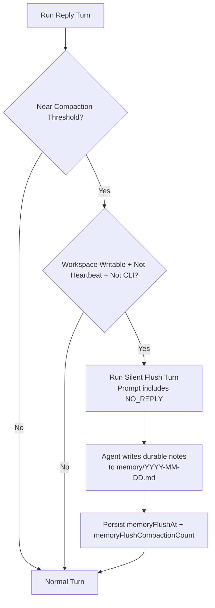
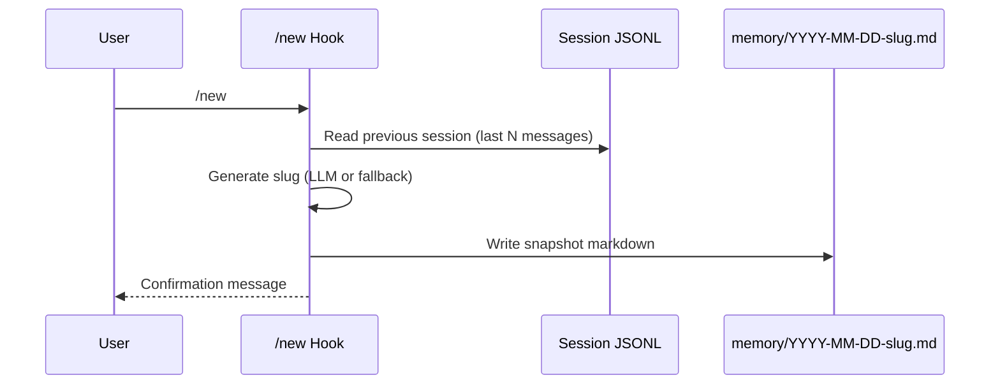
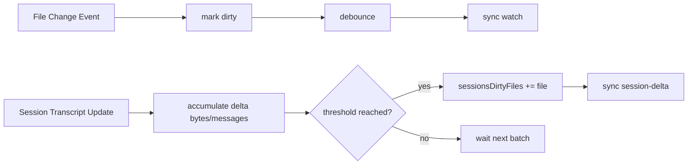
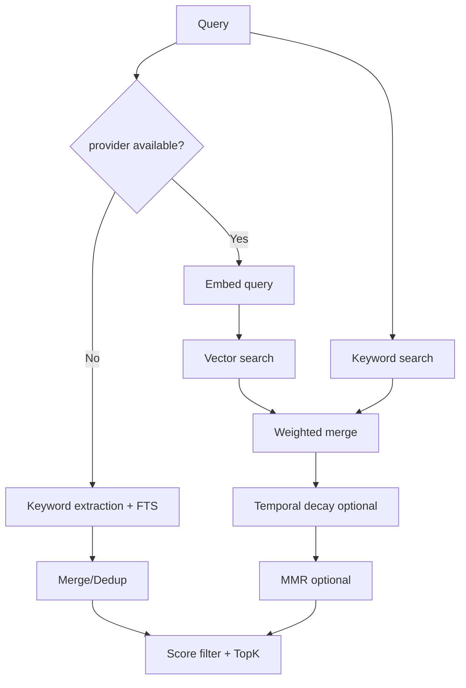
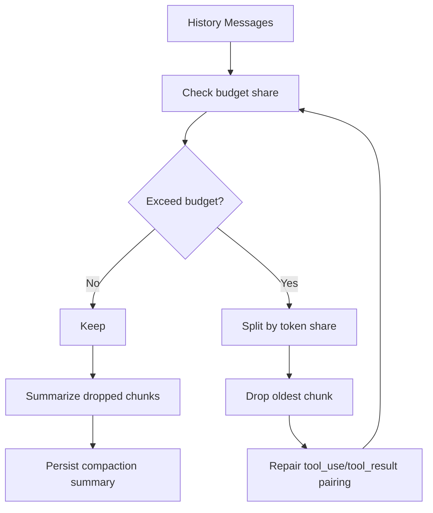
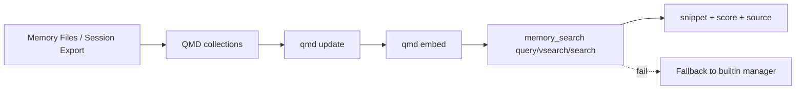

# OpenClaw 深度解析：记忆机制与流程图（源码级）

> 版本：v1.1（2026-02-18）  
> 目标：回答“OpenClaw 的记忆到底怎么实现（保存、压缩、裁剪、更新、检索）”  
> 方法：结合 `docs + src` 源码做机制拆解，不做抽象空谈。
> 源码核对基线：OpenClaw `02025da35`（2026-02-18 复核）。

---

## 1. 总览：OpenClaw 的记忆不是“模型内存”，而是“文件 + 索引 + 协议”

OpenClaw 记忆系统可以分成五层：

1. **记忆载体层（Source of Truth）**：Markdown 文件（`MEMORY.md`、`memory/YYYY-MM-DD.md`）。
2. **写入触发层**：用户指令写入、预压缩 flush、`/new` hook 沉淀。
3. **索引更新层**：文件监听 + 会话增量阈值 + 定时同步。
4. **检索排序层**：向量检索 + BM25 + MMR + 时间衰减。
5. **压缩保真层**：会话 compaction 前后保护（flush、摘要、审计）。

```mermaid
flowchart TD
  A[Memory Files\nMEMORY.md + memory/YYYY-MM-DD.md] --> B[Index Sync]
  B --> C[SQLite/QMD Index]
  C --> D[memory_search]
  D --> E[memory_get]
  F[Pre-compaction Memory Flush] --> A
  G[/new Session Hook] --> A
  H[Compaction Summary] --> I[Session Transcript JSONL]
  I --> B
```

---

## 2. 记忆类型：到底有几种“记忆”

### 2.1 文件记忆（主记忆）

#### A. 长期记忆（Curated）
- 文件：`MEMORY.md`（可选也支持 `memory.md`）。
- 用途：长期事实、偏好、决策、稳定约束。
- 特点：长期可读，通常在主私聊会话中重点使用。

#### B. 每日记忆（Daily Log）
- 文件：`memory/YYYY-MM-DD.md`。
- 用途：当天上下文、阶段性记录、随手记。
- 特点：append 风格，易沉淀到长期记忆。

> 依据：`docs/concepts/memory.md`、`docs/reference/templates/AGENTS.md`。

### 2.2 会话记忆（实验性）

- 来源：`sessions/*.jsonl` 转换后的 user/assistant 文本。
- 开关：`memorySearch.experimental.sessionMemory=true` + `sources:["memory","sessions"]`。
- 特点：不直接等于 memory 文件，但可被 `memory_search` 召回。

> 关键实现：`src/memory/session-files.ts`、`src/agents/memory-search.ts`。

### 2.3 压缩记忆（Transcript 内摘要）

- 不是 memory 文件，而是会话 transcript 的 `compaction` 结构化摘要。
- 作用：上下文溢出后保留历史语义，不完全丢失。

> 关键文档：`docs/reference/session-management-compaction.md`。

---

## 3. 保存与更新：OpenClaw 如何“写记忆”

OpenClaw 的记忆写入不是单一路径，而是三条写入通道并行：

### 3.1 通道 1：显式写入（Agent 主动写文件）

- Agent 按提示词策略把事实写入 `MEMORY.md` 或 `memory/YYYY-MM-DD.md`。
- 核心理念：**记忆以磁盘文件为准，不依赖模型隐式记忆**。

### 3.2 通道 2：预压缩 flush（自动）

当会话接近 compaction 阈值时，OpenClaw 触发一个“静默回合”提醒模型先落盘记忆。

- 触发逻辑：
  - `totalTokens >= contextWindow - reserveTokensFloor - softThresholdTokens`
- 默认配置：`softThresholdTokens=4000`。
- 保护逻辑：
  - 每个 compaction 周期只触发一次（`memoryFlushCompactionCount`）。
  - 只在可写工作区触发（`workspaceAccess=rw`）。
  - heartbeat/CLI provider 跳过。
  - token 计数优先使用 `totalTokensFresh`（由 `resolveFreshSessionTotalTokens()` 统一读取）。
  - flush prompt/systemPrompt 若未显式包含 `NO_REPLY` token，会被 `ensureNoReplyHint()` 自动补齐提示。



> 关键实现：`src/auto-reply/reply/memory-flush.ts`、`src/auto-reply/reply/agent-runner-memory.ts`、`src/auto-reply/reply/agent-runner.ts`。

### 3.3 通道 3：`/new` 会话钩子沉淀

- `session-memory` hook 在 `/new` 时抽取上一会话最后 N 条消息。
- 仅在 `event.type=command && event.action=new` 时触发。
- `messages` 可配置，默认抽取最后 15 条 user/assistant 消息。
- 优先用 `previousSessionEntry`（避免 `/new` 旋转后读到空 transcript）。
- 若会话文件为空或命中 `.reset.`，会回退查找上一份可用 transcript（含 reset fallback）。
- slug 可由 LLM 生成（`llmSlug` 可禁用）；测试环境会强制禁用并回退 `HHMM` 时间戳。
- 结果写入 `memory/YYYY-MM-DD-<slug>.md`，用于跨会话沉淀。



> 关键实现：`src/hooks/bundled/session-memory/handler.ts`。

---

## 4. 索引与同步：记忆如何被“检索系统看到”

### 4.1 配置解析与默认值

记忆索引配置由 `resolveMemorySearchConfig()` 合并默认与 agent 覆盖，核心默认值：

- `chunking.tokens=400`, `chunking.overlap=80`
- `sync.watchDebounceMs=1500`
- `sync.sessions.deltaBytes=100000`, `deltaMessages=50`
- `query.hybrid.enabled=true`（向量+关键词）
- `mmr.enabled=false`（默认关闭）
- `temporalDecay.enabled=false`（默认关闭）

> 关键实现：`src/agents/memory-search.ts`。

### 4.2 脏标记触发机制（Dirty Strategy）

#### A. Memory 文件监听
- 监听 `MEMORY.md`、`memory/**/*.md` 及额外路径。
- add/change/unlink -> `dirty=true` -> debounce 后 `sync(reason="watch")`。

#### B. Session transcript 增量触发
- 监听会话 transcript 更新事件。
- 每 5s 批处理增量（字节/消息数）。
- 达阈值才标记 `sessionsDirtyFiles` 并触发 `sync(reason="session-delta")`。



> 关键实现：`src/memory/manager-sync-ops.ts`。

### 4.3 Full Reindex 与原子切换

触发 full reindex 的条件（任一满足）：

- 无 meta；
- provider/model/providerKey 变化；
- chunk 参数变化；
- vector 维度信息缺失；
- `force=true`。

执行策略：

- 默认是 **safe reindex**：临时 DB 全量构建 -> 原子替换主 DB（防止半成品索引）。
- 测试环境可走 unsafe reindex（减少 I/O）。

> 关键实现：`src/memory/manager-sync-ops.ts` 的 `runSync/runSafeReindex`。

### 4.4 索引存储结构（SQLite）

表结构核心：

- `files`：文件级 hash/mtime/size/source
- `chunks`：分块文本 + embedding + line range
- `chunks_fts`：FTS5 文本检索（可选）
- `chunks_vec`：sqlite-vec 向量表（可选）
- `embedding_cache`：chunk embedding 缓存

> 关键实现：`src/memory/memory-schema.ts`。

### 4.5 分块策略（Chunking）

- `chunkMarkdown` 按 token 近似字符预算切块（`tokens*4` chars）。
- overlap 按 `overlap*4` chars 回带上下文。
- session 源会做 lineMap 反映射，保证引用行号对应原 JSONL。

> 关键实现：`src/memory/internal.ts`、`src/memory/manager-embedding-ops.ts`。

---

## 5. 检索：memory_search/memory_get 怎么工作

### 5.1 Tool 层行为

- `memory_search`：语义召回 + 可选引用（path#line）。
- `memory_get`：按路径读取指定行范围，路径被严格限制在记忆白名单。

系统提示词还会强制“先 recall 再回答历史类问题”。

> 关键实现：
> - `src/agents/tools/memory-tool.ts`
> - `src/agents/system-prompt.ts`

### 5.2 Backend 选择与降级

- 支持 builtin SQLite backend 或 QMD backend。
- 若 QMD 失败，`FallbackMemoryManager` 会切回 builtin，保障可用性。

> 关键实现：`src/memory/search-manager.ts`、`src/memory/backend-config.ts`。

### 5.3 检索排序流水线（builtin）

#### 场景 A：无 embedding provider（FTS-only）
- 抽关键词（query expansion）
- FTS 检索 + 合并去重 + minScore/topK

#### 场景 B：有 embedding provider（Hybrid）
- 向量检索（vector）
- 关键词检索（keyword）
- 加权合并（vectorWeight/textWeight）
- 时间衰减（可选）
- MMR 去冗余（可选）
- minScore 过滤 + topK



> 关键实现：`src/memory/manager.ts`、`src/memory/manager-search.ts`、`src/memory/hybrid.ts`、`src/memory/mmr.ts`、`src/memory/temporal-decay.ts`。

### 5.4 结果裁剪与引用策略

- snippet 默认上限约 700 chars。
- citation 显示模式：`on/off/auto`，auto 下偏向 direct chat。
- QMD 模式下还有注入字符预算限制（`maxInjectedChars`）。

### 5.5 源码核对补充（实现细节，容易漏）

- FTS-only 不是“一次全文检索”：会先 `extractKeywords()`，再按关键词逐次检索并按 chunk id 合并去重（保留高分）。
- Hybrid 的后处理顺序是固定的：`merge(vector+keyword)` -> `temporal decay`（可选）-> 排序 -> `MMR`（可选）。
- MMR 的“相似度”并非 embedding 余弦，而是对文本 token 集做 Jaccard（`tokenize + jaccardSimilarity`）。
- 时间衰减优先从 `memory/YYYY-MM-DD.md` 路径解析日期；`MEMORY.md`/`memory.md`/`memory/*` 非 dated 文件视为 evergreen，不衰减；其余再 fallback 到文件 `mtime`。

> 关键实现：`src/memory/manager.ts`、`src/memory/hybrid.ts`、`src/memory/mmr.ts`、`src/memory/temporal-decay.ts`。

---

## 6. 压缩 / 裁剪 / 更新：你关心的“会不会丢记忆”

这里要分清两类“压缩”：

### 6.1 会话压缩（Compaction）

目标：当上下文接近上限时，压缩对话历史而不是直接爆窗。

核心机制：

1. `pruneHistoryForContextShare` 先按预算裁剪历史占比（默认 50%）。
2. 按 token share 分块，循环丢最旧 chunk。
3. 丢弃后修复 tool_use/tool_result 配对，避免 orphaned tool_result。
4. 对 dropped history 分阶段摘要（失败时有 fallback）。
5. 过大消息（>上下文 50%）会被标记为 omitted note，避免摘要崩溃。



> 关键实现：`src/agents/compaction.ts`。

### 6.2 索引分块（Chunking）

目标：让检索可控，不把整文件注入模型。

- 每个 chunk 带 line range，可回溯。
- embedding cache 防止重复重算。
- batch embedding 失败有自动降级与失败计数。

> 关键实现：`src/memory/internal.ts`、`src/memory/manager-embedding-ops.ts`。

### 6.3 预压缩记忆 flush（防“晚期健忘”）

这是 OpenClaw 记忆方案最关键的一步：

- 在 compaction 前，先触发“静默记忆落盘”。
- 即使 compaction 后历史被摘要，关键事实已写入 memory 文件，不依赖临时上下文。

---

## 7. QMD 后端：OpenClaw 的增强路线

QMD 是 builtin 之外的“检索增强后端”：

- 组合 BM25 + vector + rerank。
- 通过 sidecar 维护 collections（memory/custom/sessions）。
- `update + embed` 定时运行，支持 onBoot 初始化。
- 当 QMD 不可用时自动回落 builtin。



> 关键实现：`src/memory/qmd-manager.ts`、`src/memory/search-manager.ts`、`src/memory/backend-config.ts`。

### 7.1 QMD 查询兼容回退（不兼容参数时降级）

- `memory.backend=qmd` 时先走 QMD；如未启用则直接 builtin。
- `searchMode=search/vsearch` 但 QMD 版本不支持某些 flags 时，会自动回退 `query` 命令重试。
- 多 collection 下，`query` 走逐 collection 查询并按 `docid` 取最高分，避免跨 collection 漏召回。

### 7.2 QMD 可用性保护与会话纳入机制

- `FallbackMemoryManager` 在 QMD 主链路失败后切 builtin，并驱逐缓存，允许后续请求重新尝试 QMD。
- 结果裁剪有两层预算：单条 `maxSnippetChars` + 总注入 `maxInjectedChars`。
- `sessions.enabled=true` 时，会将 `sessions/*.jsonl` 导出为 markdown 并自动追加到 QMD collection（`kind=sessions`）。
- `runUpdate()` 内置防并发（`pendingUpdate` / 强制队列）+ debounce，避免频繁重复 update/embed。

> 关键实现：`src/memory/search-manager.ts`、`src/memory/qmd-manager.ts`、`src/memory/backend-config.ts`。

---

## 8. 关键参数速查（调优必看）

| 目标 | 参数 | 默认 | 影响 |
|---|---|---:|---|
| 预压缩 flush 提前量 | `compaction.memoryFlush.softThresholdTokens` | 4000 | 越大越早写记忆，token 成本上升 |
| 历史保留预算 | `maxHistoryShare`（compaction） | 0.5 | 越小越激进裁剪 |
| 分块大小 | `memorySearch.chunking.tokens` | 400 | 越小召回粒度细但索引量大 |
| 分块重叠 | `chunking.overlap` | 80 | 越大上下文连续性更好但冗余更高 |
| session 增量触发 | `sync.sessions.deltaBytes/messages` | 100KB / 50 | 越小越实时，索引压力更高 |
| 混合权重 | `query.hybrid.vectorWeight/textWeight` | 0.7 / 0.3 | 调语义 vs 关键词偏好 |
| MMR 多样性 | `query.hybrid.mmr.enabled/lambda` | false / 0.7 | 减少重复片段 |
| 时间衰减 | `temporalDecay.enabled/halfLifeDays` | false / 30 | 新信息优先 |
| 向量缓存 | `memorySearch.cache.enabled` | true | 减少重复 embedding 成本 |

---

## 9. 对你当前重构最有价值的 5 个“可抄作业点”

1. **把“记忆写入”前置到 compaction 前**，而不是事后补救。  
2. **检索采用两层降级**：QMD -> builtin -> FTS-only，不让 recall 失效。  
3. **把 session transcript 作为可选记忆源**，但通过阈值增量同步控成本。  
4. **让 recall 成为硬约束提示词**（先 search 再答历史问题）。  
5. **把裁剪与摘要当成“安全工程”处理**（tool_result 清洗、配对修复、失败回退）。

---

## 10. 源码导航（本解析涉及）

- `docs/concepts/memory.md`
- `docs/reference/session-management-compaction.md`
- `docs/reference/templates/AGENTS.md`
- `src/auto-reply/reply/memory-flush.ts`
- `src/auto-reply/reply/agent-runner-memory.ts`
- `src/auto-reply/reply/agent-runner.ts`
- `src/memory/manager.ts`
- `src/memory/manager-sync-ops.ts`
- `src/memory/manager-embedding-ops.ts`
- `src/memory/manager-search.ts`
- `src/memory/hybrid.ts`
- `src/memory/mmr.ts`
- `src/memory/temporal-decay.ts`
- `src/memory/memory-schema.ts`
- `src/agents/tools/memory-tool.ts`
- `src/agents/system-prompt.ts`
- `src/hooks/bundled/session-memory/handler.ts`
- `src/memory/search-manager.ts`
- `src/memory/qmd-manager.ts`
- `src/agents/memory-search.ts`

---

## 11. 结论（记忆系统视角）

OpenClaw 记忆强的根因，不是“某个向量库很强”，而是它把记忆做成了**闭环系统**：

**写入触发（flush/hook） + 文件落盘（source of truth） + 增量索引（watch/delta） + 混合检索（hybrid/mmr/decay） + 压缩保真（pre-compact + compaction safeguards）**。

这也是它“看起来像会自己记住并继续做事”的核心基础设施。
