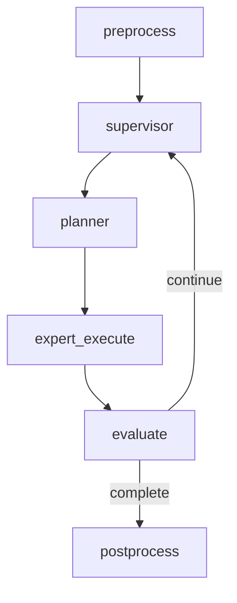

# OpenClaw 迁移改造蓝图（代码级实施版）

> 文档类型：实施蓝图（可直接转工单）  
> 创建日期：2026-02-18  
> 适用项目：`/Users/jijingkun/bojxAI/fastapi`  
> 目标：在保留现有 FastAPI + LangGraph 架构基础上，增量复刻 OpenClaw 的“自动推进 + 可控收敛”能力

---

## 0. 当前基线与核心缺口

### 0.1 你项目已有能力（可复用）

- Supervisor + 专家路由：`app/ai/workflow/multi_agent_graph.py`
- Todo 专家子图：`app/ai/workflow/todo_graph.py`
- 统一状态定义：`app/ai/state.py`
- 流式事件协议：`app/ai/events.py`
- RAG 工具：`app/ai/tools/ragflow_tool.py`

### 0.2 关键缺口（本蓝图聚焦）

1. 缺执行协议（plan/checklist/done criteria）
2. evaluate 收敛弱（当前仍偏向“无 tool_call 即完成”）
3. 缺诊断类工具（KB 盘点、RAGFlow 健康检查）
4. 缺证据链状态字段（做了什么、凭什么结束）
5. 缺 followup 队列协议（collect/steer-backlog/interrupt）
6. 缺记忆闭环（`/new` 沉淀、pre-compaction flush、文件记忆检索链路）

### 0.3 当前决策（2026-02-18）

> 本节用于固化已确认策略，避免后续反复回到“先做小版还是全版”的分歧。

1. **策略已定：只上全版机制，不上小版/阉割版。**
2. **当前状态：先文档融合与方案冻结，不进入立即开发。**
3. **实施边界：**
   - 不把“前端 stop 按钮”视为“后端可中断机制已完成”；
   - 不仅做 queue MVP，而是按完整控制面（协议 + 队列 + 子任务 + 控制 + 可观测）建设；
   - 不新增平行架构，必须融合到现有模块（`app/ai/state.py`、`app/ai/events.py`、`app/ai/workflow/multi_agent_graph.py`、`app/services/chat_service.py`）。

### 0.4 与“深度解析/源码解析”覆盖对齐（补充）

> 结论：本蓝图已吸收核心方向，但此前对“记忆闭环”的实施映射不够显式（偏概念，缺文件级落点）。

| 来源文档 | 当前蓝图覆盖情况 | 说明 |
|---|---|---|
| `OpenClaw深度解析-工具策略管线与权限边界.md` | 部分覆盖 | 已在 P4 提到策略分层；需补每层事件与 deny-fail-closed 执行门禁细则 |
| `OpenClaw深度解析-Followup队列与任务循环.md` | 覆盖较完整 | 已在 P1/P3 体现 queue + drain + interrupt 思路 |
| `OpenClaw深度解析-Subagent生命周期与编排控制.md` | 覆盖较完整 | 已在 P2/P5 体现 registry + control + recover |
| `OpenClaw深度解析-记忆机制与流程图.md` | 已补齐 | 已形成 P2.5 记忆闭环阶段、文件清单、事件字段、验收与回滚 |
| `OpenClaw源码解析-长期主档.md` | 已补齐 | 已吸收总路线（P0~P5）并纳入 P2.5（记忆闭环）/P4.5（D5 模型容错与插件治理）实施映射 |

---

## 1. 分阶段实施（P0 ~ P5 + P2.5/P4.5，当前冻结）

## 1.1 P0（1~1.5 周）先让系统“先做后说、可证据结束”

**目标**：收敛判定从“消息形态”升级为“done criteria + evidence”

交付：

- 执行协议骨架（Checklist + Done Criteria）
- 证据账本（Tool Ledger）
- evaluate 硬门禁
- 两个诊断工具（`kb_inventory_scan`、`ragflow_health_check`）

退出标准：

- 调研类任务在未满足 criteria 前不会提前结束
- 最终输出可回溯到工具执行证据

## 1.2 P1（1 周）补“节奏控制”

**目标**：多轮追问不打乱当前执行，支持 followup/collect

交付：

- queue state + drain 机制
- `steer-backlog`、`interrupt` 协议
- queue 相关事件可观测

退出标准：

- 连续补充消息不会导致上下文漂移
- 队列深度、丢弃策略、drain 轮次可追踪

## 1.3 P2（1~2 周）补“可控子任务并发”

**目标**：引入受约束 subtask（不是全量 OpenClaw 复制）

交付：

- subtask registry
- list/kill/steer 控制面
- 子任务回传与聚合

退出标准：

- 并发任务可控、可中断、可追责

## 1.3.1 P2.5（1~1.5 周）补“记忆闭环”

**目标**：把现有“偏好 KV 记忆”升级为“文件记忆 + 检索 + 压缩前落盘”的可回溯闭环。

交付：

- 记忆分层：`MEMORY.md`（长期）+ `memory/YYYY-MM-DD*.md`（日记/会话沉淀）
- 会话沉淀：线程切换（等价 `/new`）时生成记忆快照
- pre-compaction flush：上下文逼近阈值时先落 durable notes
- recall 工具链：`memory_search` / `memory_get`（最小可用版本）
- 检索降级：vector/hybrid 失败时自动回退关键词检索

退出标准：

- 跨会话问题可通过 memory recall 复用历史事实
- 压缩后关键信息不明显丢失（flush 命中可观测）
- 记忆链路可追溯（写入、索引、检索、注入都有事件）

## 1.4 全版目标态（补齐 P3 / P4 / P5）

> 说明：P0~P2.5 是能力骨架；P3~P5（含 P4.5）是全版闭环，不做则不算“机制完成”。

### P3（1~1.5 周）运行时控制面闭环

**目标**：把“停止/打断/插话”从前端行为升级为后端可控运行时。

交付：

- thread/session 级 `active_run_registry`
- 后端可中断控制（abort + clear pending queue）
- SSE 断连与 run 生命周期解耦（前端断流不等于后端停跑）
- `stop/interrupt/steer` 统一事件语义

退出标准：

- 任一线程可由服务端可靠终止当前 run
- 中止后不会继续回灌旧 backlog
- 中止原因可在事件与日志中追溯

### P4（1 周）策略分层与会话隔离

**目标**：把机制从“能跑”提升到“可治理”。

交付：

- queue/policy 配置分层：global → channel → session → per-turn
- 用户/角色可见性与能力边界（工具、队列模式、子任务能力）
- 与现有 prompt/route 规则统一，不形成双标准

退出标准：

- 同一能力可按用户/会话策略稳定生效
- 错配配置可被观测与快速回滚

### P4.5（1~1.5 周）模型解析与容错治理（D5）

**目标**：把“模型可用性”从静态配置升级为“可解析、可降级、可观测”的运行时能力，并建立插件化扩展基线。

交付：

- `ModelRef(provider, model)` 统一解析（provider 归一化 + alias + allowlist）
- 主模型 + fallback 候选链（错误分类 + 逐级降级）
- fallback attempt 事件与聚合错误摘要
- Plugin Registry 最小骨架（插件元数据 + 生命周期 + 安全门禁）

退出标准：

- 主模型故障时可自动切换 fallback 并保留可追溯证据
- 非可恢复错误不会盲目重试（避免雪崩）
- 插件加载失败/被策略阻断时有明确事件与降级路径

### P5（1~2 周）生产级稳态与恢复

**目标**：补齐长期运行所需的恢复/耐久/审计能力。

交付：

- queue 与 subtask 状态持久化
- 进程重启后的恢复与 orphan 清理
- 关键路径 SLO 指标（队列等待、丢弃率、中断成功率、回传时延）
- 失败降级与回退策略模板

退出标准：

- 重启后任务状态可恢复或可回收
- 高压下具备稳定降级能力
- 关键运维指标可观测并可告警

## 1.5 当前执行策略（非立即开发）

当前只做两件事：

1. **文档冻结**：在本蓝图中固化全版目标态、接线点、验收门禁；
2. **排期前置条件准备**：补齐监控基线与风险台账，再进入开发排期。

明确不做：

- 不单独落“P1 小队列版”；
- 不以“前端 Stop 可点”替代后端中断控制面。

---

## 2. 精确到文件的改造清单

## 2.1 必改文件（P0）

| 文件 | 改造点 | 原则 |
|---|---|---|
| `app/ai/state.py` | 新增协议状态、证据账本、收敛字段 | 仅增量字段，不破坏现有节点读取 |
| `app/ai/events.py` | 扩展事件类型与 emit helper（policy/queue/evidence/convergence） | 向后兼容，旧前端不崩 |
| `app/ai/workflow/multi_agent_graph.py` | evaluate 节点改为 evidence-driven；加入协议循环控制 | 先保守门禁，再扩图 |
| `app/ai/prompts/agent_prompts.py` | Supervisor 提示词加入“执行协议模板” | 规则在 Prompt + Node 双层约束 |

## 2.2 建议新增（P0）

| 文件 | 作用 |
|---|---|
| `app/ai/tools/diagnostic_tools.py` | 放 `kb_inventory_scan`、`ragflow_health_check` |
| `app/ai/workflow/protocol_helpers.py` | checklist/done criteria/evidence 判定工具函数 |
| `tests/unit/test_multi_agent_protocol.py` | evaluate 门禁与协议循环单测 |
| `tests/unit/test_diagnostic_tools.py` | 诊断工具 schema 与输出契约单测 |

## 2.3 必改文件（P1）

| 文件 | 改造点 |
|---|---|
| `app/ai/state.py` | 新增 queue_state、drain_round 等字段 |
| `app/ai/workflow/multi_agent_graph.py` | 引入 queue enqueue/drain 节点或 helper 调用 |
| `app/ai/events.py` | 增加 queue_update/queue_drain 事件 |
| `app/services/chat_service.py` | 接入 followup 队列策略（按 thread/session 维度） |

## 2.4 建议新增（P1）

| 文件 | 作用 |
|---|---|
| `app/ai/queue/followup_queue.py` | 队列状态机与 drain 循环 |
| `tests/unit/test_followup_queue.py` | dedupe/cap/drop/collect 测试 |

## 2.5 P2 预留（按需开启）

| 文件 | 改造点 |
|---|---|
| `app/ai/state.py` | subtask_registry / subtask_queue / announce_state |
| `app/ai/workflow/multi_agent_graph.py` | subtask orchestrator 节点 |
| `app/ai/events.py` | subtask_lifecycle 事件 |
| `app/ai/tools/subtask_control_tools.py`（新增） | list/kill/steer |

## 2.6 记忆闭环改造（P2.5）

| 文件 | 改造点 |
|---|---|
| `app/services/chat_service.py` | 接入记忆检索注入顺序（memory recall 与现有偏好注入协同） |
| `app/ai/state.py` | 增加 memory 检索与 flush 状态字段 |
| `app/ai/events.py` | 增加 memory_write/memory_recall/memory_flush 事件 |
| `app/ai/workflow/multi_agent_graph.py` | 增加记忆检索节点或 helper 接线；evaluate 结合 memory 证据 |
| `app/services/user_preference_memory_service.py` | 与文件记忆双写/回填策略对齐（保持兼容） |

建议新增：

- `app/ai/memory/file_memory_store.py`：`MEMORY.md` 与 daily memory 文件读写
- `app/ai/memory/session_snapshot.py`：线程切换沉淀（等价 `/new` hook）
- `app/ai/memory/memory_retriever.py`：`memory_search` / `memory_get` 最小实现
- `tests/unit/test_memory_pipeline.py`：写入/检索/flush/降级回退用例

## 2.7 全版补充文件（P3 / P4 / P5）

| 文件 | 改造点 |
|---|---|
| `app/services/chat_service.py` | 增加 run controller 接线：active run 注册、中断调度、断流与执行解耦 |
| `app/api/v1/endpoints/chat_api.py` | 预留线程级控制接口（stop/abort），统一与 SSE 生命周期语义 |
| `app/ai/state.py` | 增加运行时控制与恢复字段（active_run_id、queue_checkpoint、recovery_meta） |
| `app/ai/events.py` | 增加 run_control/queue_recovery/subtask_recovery 事件 |
| `app/ai/workflow/multi_agent_graph.py` | 融合 queue + subtask + convergence 的单一闭环，不拆平行流程 |
| `app/ai/queue/followup_queue.py` | 扩展持久化、恢复、overflow 审计 |
| `app/ai/workflow/protocol_helpers.py` | 增加 recoverability 判定与回退决策 helper |
| `tests/unit/test_run_control.py`（新增） | 中断一致性、断流不终止、恢复后不回灌旧任务 |
| `tests/unit/test_queue_recovery.py`（新增） | 队列持久化、重启恢复、drop summary 保真 |
| `tests/unit/test_subtask_recovery.py`（新增） | 子任务 orphan 清理与回传恢复 |

## 2.8 D5 模型容错与插件扩展改造（P4.5）

| 文件 | 改造点 |
|---|---|
| `app/ai/state.py` | 增加 model resolution/fallback runtime 元信息字段 |
| `app/ai/events.py` | 增加 model_resolved/model_fallback_attempt/plugin_lifecycle 事件 |
| `app/ai/workflow/multi_agent_graph.py` | 接入统一 model resolve + fallback wrapper（节点级可复用） |
| `app/services/llm_config_service.py` | 增加模型别名与 allowlist 解析能力（与现有配置兼容） |

建议新增：

- `app/ai/model/model_resolver.py`：ModelRef 归一化 + alias + allowlist
- `app/ai/model/model_fallback.py`：候选链 + 错误分类 + fallback 执行器
- `app/ai/plugins/plugin_registry.py`：插件注册、加载、禁用、健康状态
- `tests/unit/test_model_fallback.py`：容错链路与错误分类测试
- `tests/unit/test_plugin_registry.py`：插件加载/阻断/降级测试

---

## 3. 状态字段设计（可直接落 `state.py`）

## 3.1 协议核心字段（P0）

建议在 `BaseAgentState` 或 `MultiAgentState` 增加：

```python
protocol_context: Dict[str, Any]          # 协议元信息：mode/version/round/max_round
checklist_state: List[Dict[str, Any]]     # [{id,title,status,required,evidence_ids,notes}]
done_criteria: List[Dict[str, Any]]       # [{id,rule,required,weight,status,reason}]
tool_execution_ledger: List[Dict[str, Any]]  # [{tool_call_id,tool,status,args_digest,result_digest,error,started_at,ended_at}]
evidence_ledger: List[Dict[str, Any]]     # [{evidence_id,source_type,source_ref,summary,reliability,created_at}]
convergence_reason: str                   # e.g. done_criteria_met / max_round / blocked
final_report: Dict[str, Any]              # 结构化最终报告
```

## 3.2 队列字段（P1）

```python
queue_state: Dict[str, Any]  # {mode,depth,cap,drop_policy,dropped_count,last_enqueued_at,draining}
drain_round: int
pending_followups: List[Dict[str, Any]]
```

## 3.3 子任务字段（P2）

```python
subtask_registry: Dict[str, Dict[str, Any]]
subtask_announce_queue: List[Dict[str, Any]]
```

## 3.4 记忆字段（P2.5）

```python
memory_context_refs: List[Dict[str, Any]]   # 当前轮注入的 memory 证据引用
memory_flush_state: Dict[str, Any]          # {enabled,last_flush_at,last_compaction_count,trigger_reason}
memory_snapshot_state: Dict[str, Any]       # {last_snapshot_at,last_snapshot_file,source_session}
memory_search_debug: Dict[str, Any]         # {backend,mode,hits,fallback_reason}
```

## 3.5 模型与插件字段（P4.5）

```python
model_resolution_meta: Dict[str, Any]       # {provider,model,alias,allowlist_hit,resolved_at}
model_fallback_attempts: List[Dict[str, Any]]  # [{provider,model,error,reason,attempt_idx,ts}]
plugin_runtime_state: Dict[str, Any]        # {loaded,blocked,failed,by_plugin_id}
```

---

## 4. 事件字段设计（可直接落 `events.py`）

## 4.1 新增事件类型（P0/P1）

扩展 `EventType` / `AgentEventType`：

- `policy_applied`
- `protocol_step`
- `evidence_attached`
- `convergence_check`
- `queue_update`
- `queue_drain`

## 4.2 统一 payload 约束

所有新增事件必须至少包含：

- `trace_id`
- `node`
- `round_id`
- `ts`

工具相关事件追加：

- `tool_call_id`
- `tool_name`
- `status`
- `evidence_id`（若产出证据）

## 4.3 推荐新增 helper

- `emit_protocol_step(...)`
- `emit_policy_applied(...)`
- `emit_evidence_attached(...)`
- `emit_convergence_check(...)`
- `emit_queue_update(...)`
- `emit_queue_drain(...)`

## 4.4 记忆相关事件（P2.5）

- `memory_snapshot_written`
- `memory_flush_triggered`
- `memory_flush_skipped`
- `memory_recall_started`
- `memory_recall_finished`
- `memory_recall_fallback`

## 4.5 模型与插件事件（P4.5）

- `model_resolved`
- `model_fallback_attempt`
- `model_fallback_exhausted`
- `plugin_loaded`
- `plugin_blocked`
- `plugin_failed`

---

## 5. 诊断工具 schema（让模型稳定“先做后说”）

## 5.1 `kb_inventory_scan`

### 输入 schema（建议）

```json
{
  "roots": ["docs", "knowledge_base"],
  "recursive": true,
  "max_files": 5000,
  "sample_limit": 50,
  "detect_duplicates": true,
  "hash_algo": "sha1",
  "unsupported_ext": [".exe", ".bin"],
  "timeout_ms": 120000
}
```

### 输出 schema（建议）

```json
{
  "scan_id": "kbscan_...",
  "status": "ok|partial|error",
  "summary": {
    "total_files": 0,
    "total_bytes": 0,
    "ingestable_files": 0,
    "unsupported_files": 0,
    "duplicate_groups": 0
  },
  "by_ext": [{"ext": ".md", "count": 0, "bytes": 0}],
  "duplicates": [{"hash": "...", "files": ["..."]}],
  "unsupported_samples": ["..."],
  "evidence": {
    "evidence_id": "ev_...",
    "artifact_path": "output/diagnostics/kbscan_xxx.json"
  },
  "errors": []
}
```

## 5.2 `ragflow_health_check`

### 输入 schema（建议）

```json
{
  "base_url": "${RAGFLOW_BASE_URL}",
  "api_key_ref": "RAGFLOW_API_KEY",
  "check_endpoints": ["/api/v1/version", "/api/v1/datasets"],
  "check_indexes": true,
  "check_recent_tasks": true,
  "recent_window_minutes": 60,
  "timeout_ms": 30000
}
```

### 输出 schema（建议）

```json
{
  "check_id": "raghc_...",
  "status": "healthy|degraded|down|error",
  "connectivity": {"ok": true, "latency_ms": 0},
  "auth": {"ok": true},
  "indexes": {"ok": true, "ready": 0, "failed": 0},
  "tasks": {"ok": true, "running": 0, "failed": 0},
  "findings": ["..."],
  "actions": ["..."],
  "evidence": {
    "evidence_id": "ev_...",
    "artifact_path": "output/diagnostics/raghc_xxx.json"
  },
  "errors": []
}
```

## 5.3 “先做后说”稳定策略（关键）

- 工具输出必须带 `status` + `evidence`；
- Evaluate 只认可带 `evidence_id` 的结论；
- 最终回答必须引用 `evidence_id`，否则判定未完成。

---

## 6. 执行协议与图编排落点

## 6.1 协议放置建议（你的架构最佳实践）

采用 **B + C（独立 Planner Node + 强 Evaluate Gate）**：

- Supervisor Prompt：只定义“总原则与路由约束”
- Planner Node：把任务拆为 checklist + done criteria
- Evaluate Node：硬门禁收敛（不满足则继续）

> 不建议仅靠 Prompt 做协议：可观测与一致性不足。

## 6.2 建议图流（P0）



## 6.3 evaluate 门禁伪代码（替换当前“无 tool_call 即完成”）

```python
def _evaluate_expert_work(state):
    iteration = state.get("iteration_count", 0)
    if iteration >= MAX_ITER:
        return {"evaluation": "complete", "convergence_reason": "max_iteration"}

    checklist = state.get("checklist_state", [])
    criteria = state.get("done_criteria", [])
    evidence = state.get("evidence_ledger", [])

    unmet = [c for c in criteria if c.get("required") and c.get("status") != "met"]
    if unmet:
        return {
            "evaluation": "continue",
            "iteration_count": iteration + 1,
            "convergence_reason": "criteria_unmet",
        }

    if not evidence:
        return {
            "evaluation": "continue",
            "iteration_count": iteration + 1,
            "convergence_reason": "no_evidence",
        }

    return {
        "evaluation": "complete",
        "convergence_reason": "done_criteria_met",
    }
```

---

## 7. 如何避免“看起来做了，其实没执行”

## 7.1 证据链强制规则

每一次关键动作都必须形成链路：

- `tool_start(tool_call_id)`
- `tool_end(tool_call_id, status)`
- `evidence_attached(evidence_id, tool_call_id)`
- `convergence_check(criteria_id, evidence_ids)`

任一关键环缺失，则不能 complete。

## 7.2 最终输出格式（建议）

最终报告结构化输出：

```json
{
  "summary": "...",
  "checklist": [
    {"id": "c1", "status": "done|blocked", "evidence_ids": ["ev_1"]}
  ],
  "risks": ["..."],
  "next_steps": ["..."],
  "convergence_reason": "done_criteria_met"
}
```

## 7.3 拒绝“空完成”

只要命中以下任一情况，evaluate 必须继续：

- 无 evidence
- required checklist 未 done
- required criteria 未 met
- 结论与证据不一致

---

## 8. 验收用例（可直接转测试）

## 8.1 P0 验收

1. **调研任务未执行工具**  
   输入：让系统评估 KB 入库质量。  
   预期：evaluate=continue，不可直接完成。

2. **工具失败但模型强行总结**  
   输入：模拟 `ragflow_health_check` 失败。  
   预期：最终报告 status=blocked，附风险与下一步，不可 complete。

3. **工具执行成功有证据**  
   输入：`kb_inventory_scan` 返回 `evidence_id`。  
   预期：criteria 对应项 met，可推进 complete。

## 8.2 P1 验收

1. 连续 3 条补充消息（同线程）→ collect 合并后一次处理
2. interrupt 模式可抢占正在运行任务
3. queue overflow 触发 drop:summarize 并生成摘要

## 8.3 P3~P5 验收补充

1. 前端 stop 后，后端 run 终止与 queue 清理保持一致（无旧任务回灌）
2. 同线程并发输入在策略层按配置生效（非随机覆盖）
3. 服务重启后 queue/subtask 状态可恢复或可回收
4. 跨会话回忆命中率达标，且 recall 失败时有可观测 fallback 事件
5. 压缩前 flush 命中后，压缩轮次内关键事实可在 memory 中检索到
6. 主模型失败时 fallback 自动接管，且 attempt 链路可追溯
7. 插件加载/阻断/失败状态可观测，且不影响核心链路可用性

## 8.4 测试文件建议

- `tests/unit/test_multi_agent_protocol.py`
- `tests/unit/test_diagnostic_tools.py`
- `tests/unit/test_followup_queue.py`
- `tests/unit/test_run_control.py`
- `tests/unit/test_queue_recovery.py`
- `tests/unit/test_subtask_recovery.py`
- `tests/unit/test_memory_pipeline.py`
- `tests/unit/test_model_fallback.py`
- `tests/unit/test_plugin_registry.py`

---

## 9. 回滚策略（必须预置）

## 9.1 Feature Flag

建议增加配置开关：

- `AI_EXEC_PROTOCOL_ENABLED`
- `AI_EVIDENCE_GATE_ENABLED`
- `AI_QUEUE_PROTOCOL_ENABLED`
- `AI_DIAGNOSTIC_TOOLS_ENABLED`
- `AI_MEMORY_PIPELINE_ENABLED`
- `AI_MEMORY_FLUSH_ENABLED`
- `AI_MEMORY_SNAPSHOT_ENABLED`
- `AI_MODEL_FALLBACK_ENABLED`
- `AI_PLUGIN_REGISTRY_ENABLED`

## 9.2 快速回滚路径

- P0 回滚：evaluate 退回旧逻辑（但保留事件与状态字段，避免数据结构回退）
- P1 回滚：queue 模式强制 `followup` 或关闭 collect
- P2 回滚：关闭 subtask spawn，仅保留单图执行
- P2.5 回滚：关闭 memory pipeline，保留现有 `t_user_memory` 注入链路
- P3 回滚：关闭后端 run 控制面，恢复只读流模式（保留中断事件字段）
- P4 回滚：策略分层回退为 session/global 两层，保留配置兼容解析
- P4.5 回滚：关闭 model fallback 与 plugin registry，回退单模型+静态工具注册
- P5 回滚：关闭恢复流程，回退到“重启后从空状态开始”并启用人工清理脚本

---

## 10. 与当前代码的直接对照（重点提醒）

- 当前 `multi_agent_graph.py` 的 `_evaluate_expert_work`（约 1319 行）仍是“无 tool_calls 即完成”逻辑，属于本次改造的第一优先级。  
- 当前 `events.py` 尚无 protocol/queue/evidence/convergence 事件，前端无法解释“为什么继续/为什么结束”。  
- 当前 `state.py` 没有完整证据账本与 done criteria 状态，导致评估只能看消息外观。
- 当前跨会话记忆仍以 `t_user_memory` 注入为主，缺文件记忆沉淀、flush 与 recall 闭环。
- 当前模型链路缺 provider 归一化/alias allowlist/fallback 包装与插件注册层，扩展成本高。

---

## 11. 全版实施顺序（推荐）

1. **先完成排期门禁**：观测基线、风险台账、回滚脚本模板先落文档。
2. **按 P0 → P5（含 P2.5/P4.5）顺序推进**：不跳步，不把 P1 当最终态。
3. **每阶段必须过验收再进下一阶段**：未达退出标准不得前移。
4. **任何阶段都保持同一主干融合**：不新建平行 workflow 体系。

---

## 12. 未来启动时的标准指令（全版）

```markdown
请按《OpenClaw迁移改造蓝图-代码级实施版》执行全版改造（P0~P5，含 P2.5 记忆闭环 + P4.5 模型容错与插件治理），要求：
1) 在现有模块内融合，不新增平行架构；
2) 先过阶段门禁再进入编码；
3) 每阶段完成后提交“退出标准达成证明 + 回滚验证结果”；
4) 禁止以小版替代全版目标；
5) 输出文件级改动清单、事件契约变更、测试与验收报告。
```
