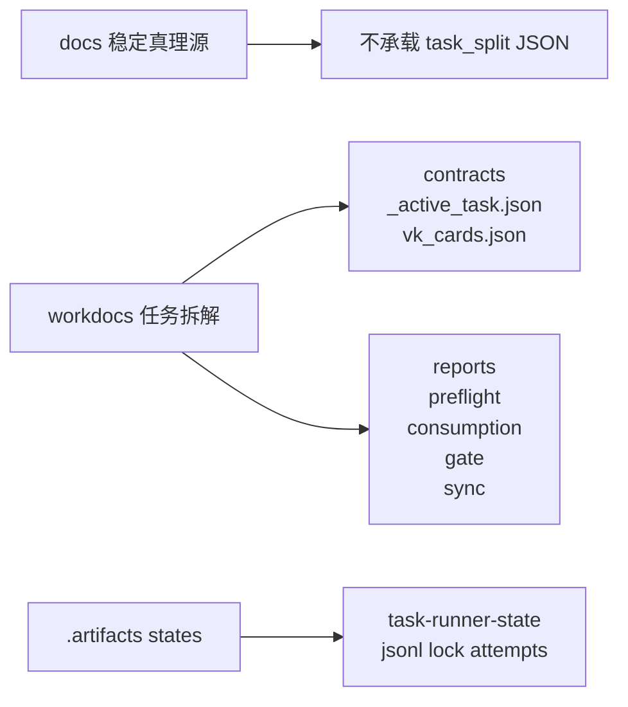
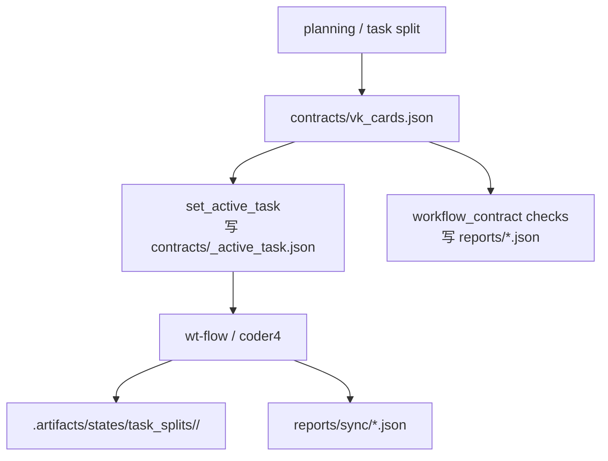

# 任务拆解目录

> 这里是 task_split 的 canonical 根目录。
> 规则一句话：**过程正文在根目录，过程契约在 `contracts/`，过程报告在 `reports/`，真实运行态在 `.artifacts/`。**

## 当前约定

- 新增 task_split 一律进入 `workdocs/任务拆解/<task_split_dir>/`。
- `workdocs/任务拆解/` 不再承载 task_split 机器契约或过程 JSON。
- task_split 根目录只放人读正文：`parallel_plan.md`、`workstreams/*.md`、说明文件。
- `implementation_plan.md`、`uat_cases.md`、`_active_task.json`、`vk_cards.json` 只放 `contracts/`。
- `preflight_status.json`、`consumption_report.json`、`gate_contract_report.json`、`sync/**` 只放 `reports/`。
- `review_report.md`、`test_report.md`、`verify_report.md`、`debug_report.md`、`wtimp_report.md` 只放 `reports/`。

## 目录结构

```text
workdocs/任务拆解/
├── _templates/
└── <task_split_dir>/
    ├── parallel_plan.md
    ├── workstreams/
    ├── contracts/
    │   ├── implementation_plan.md
    │   ├── uat_cases.md
    │   ├── _active_task.json
    │   ├── vk_cards.json
    │   └── *.json
    └── reports/
        ├── review_report.md
        ├── test_report.md
        ├── verify_report.md
        ├── debug_report.md
        ├── wtimp_report.md
        ├── preflight_status.json
        ├── consumption_report.json
        ├── gate_contract_report.json
        └── sync/
            ├── vktodo_create_result.json
            └── vksync_status.json
```

## 目录边界图



## 执行链流转图



## 运行态约定

- task_split 运行态 canonical 根目录：`.artifacts/states/task_splits/<task_split_dir>/`
- task_key 级状态目录：`.artifacts/states/task_splits/<task_split_dir>/<task_key>/`
- `workdocs/` 不承载 `.state/`、`.jsonl`、`.lock`、`attempt_*.json`

## 文档门禁

- 实现 PR 必须同步更新目录说明与流程图。
- 若代码已切到新 canonical path，但 README / 流程图没更新，视为未完成。
