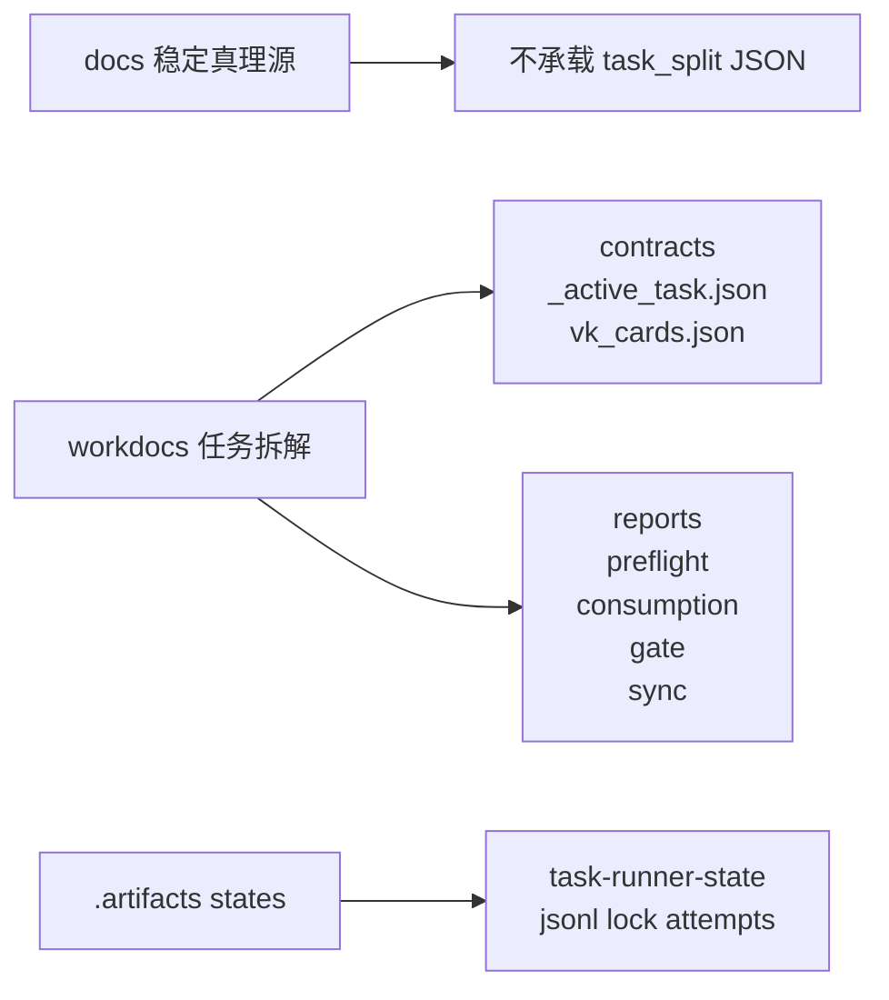
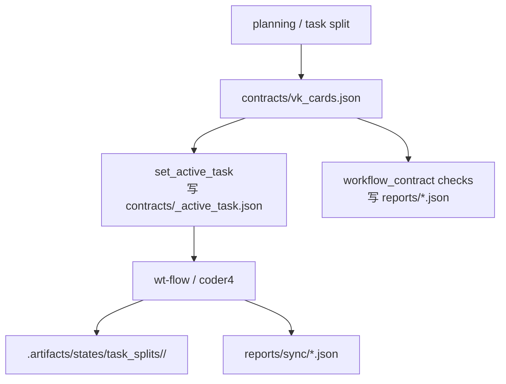

# 任务拆解目录

> 这里是 task_split 的 canonical 根目录。
> 规则一句话：**过程正文在根目录，过程契约在 `contracts/`，过程报告在 `reports/`，真实运行态在 `.artifacts/`。**

## 当前约定

- 新增 task_split 一律进入 `workdocs/任务拆解/<task_split_dir>/`。
- `workdocs/任务拆解/` 不再承载 task_split 机器契约或过程 JSON。
- task_split 根目录只放人读正文：`parallel_plan.md`、`workstreams/*.md`、说明文件。
- `implementation_plan.md`、`uat_cases.md`、`_active_task.json`、`vk_cards.json` 只放 `contracts/`。
- `preflight_status.json`、`consumption_report.json`、`gate_contract_report.json`、`sync/**` 只放 `reports/`。
- `review_report.md`、`test_report.md`、`verify_report.md`、`debug_report.md`、`wtimp_report.md` 只放 `reports/`。

## 目录结构

```text
workdocs/任务拆解/
├── _templates/
└── <task_split_dir>/
    ├── parallel_plan.md
    ├── workstreams/
    ├── contracts/
    │   ├── implementation_plan.md
    │   ├── uat_cases.md
    │   ├── _active_task.json
    │   ├── vk_cards.json
    │   └── *.json
    └── reports/
        ├── review_report.md
        ├── test_report.md
        ├── verify_report.md
        ├── debug_report.md
        ├── wtimp_report.md
        ├── preflight_status.json
        ├── consumption_report.json
        ├── gate_contract_report.json
        └── sync/
            ├── vktodo_create_result.json
            └── vksync_status.json
```

## 目录边界图



## 执行链流转图



## 运行态约定

- task_split 运行态 canonical 根目录：`.artifacts/states/task_splits/<task_split_dir>/`
- task_key 级状态目录：`.artifacts/states/task_splits/<task_split_dir>/<task_key>/`
- `workdocs/` 不承载 `.state/`、`.jsonl`、`.lock`、`attempt_*.json`

## 何时转归档

`task_split` 不是做完就立刻搬。只有同时满足下面条件，才应该从 `workdocs/任务拆解/` 迁到 `workdocs/归档/任务拆解/`：

1. 当前不再有活跃执行上下文：
   - `contracts/_active_task.json` 已删除，或明确改成历史只读留痕
   - 对应脚本不再把这个 bundle 当成当前 `status_source_of_truth`
2. 过程合同已经收口：
   - 若存在 `consumption_report.json`，要求 `ok=true`
   - 若存在 `gate_contract_report.json`，要求 `ok=true`
   - 不存在“待执行 / 待回填 / failed / blocked”一类主状态
3. 人读正文已经有稳定去处：
   - 需求、设计、实施计划、测试/验收/审查正文已经沉到 `workdocs/归档/*`
   - `task_split` 目录只剩“以后查当时怎么拆卡”的追溯价值
4. 运行态已经完全外置：
   - `.artifacts/states/task_splits/<task_split_dir>/` 才是真正运行态
   - `workdocs/任务拆解/<task_split_dir>/` 不再承担活跃状态写入

一句话判断：

- 还在驱动脚本执行，就留在 `workdocs/任务拆解/`
- 只剩追溯价值，就迁到 `workdocs/归档/任务拆解/`

处理存量 bundle 时，先出一份 `workdocs/归档/任务拆解/归档候选清单_YYYY-MM-DD.md`，把目录分成“继续保留 / 可归档 / 暂缓归档”三类，再迁移已经确认的 bundle；不要一边判断一边直接搬。

## 文档门禁

- 实现 PR 必须同步更新目录说明与流程图。
- 若代码已切到新 canonical path，但 README / 流程图没更新，视为未完成。
