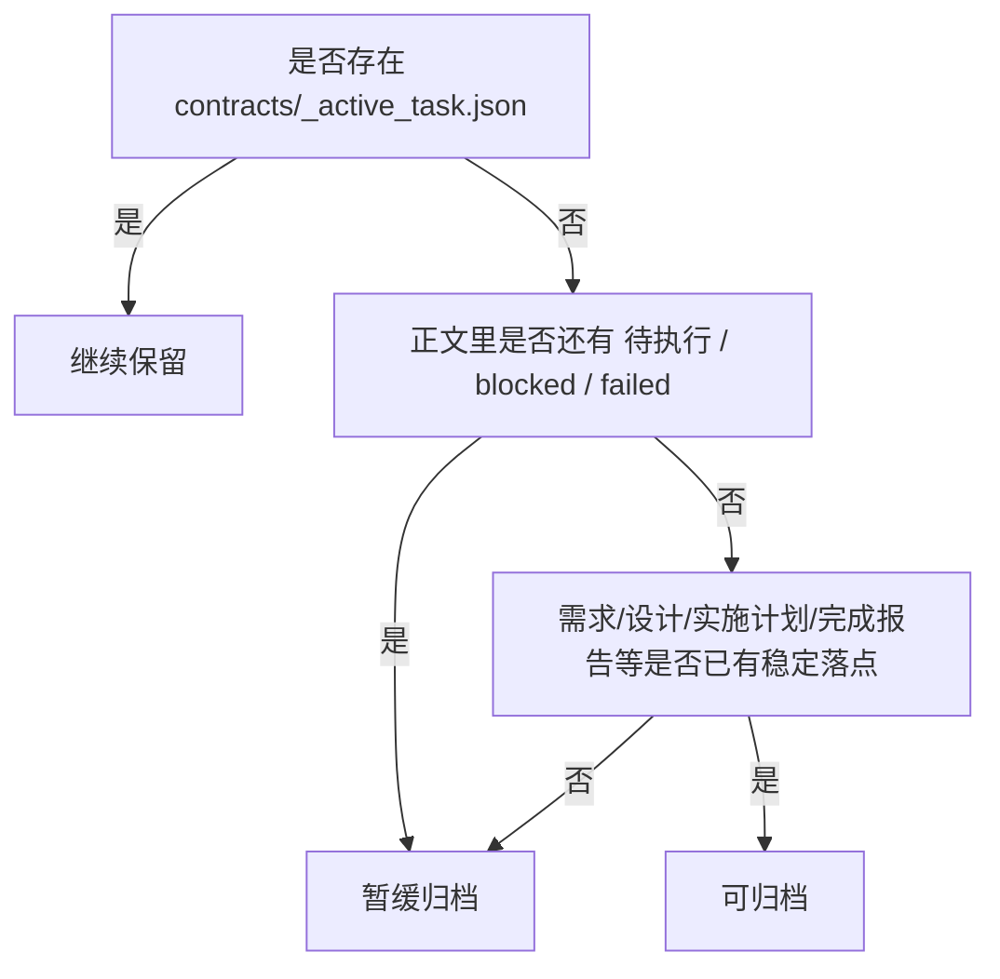

# Task Split 归档候选清单（2026-03-13）

> 目的：给当前 `workdocs/任务拆解/` 存量 bundle 做一次归档性盘点，避免把仍在驱动脚本执行的目录误迁。
> 判定口径：优先看 `_active_task.json`，再看 `blocked/failed/待执行` 等未收口信号，最后看需求/设计/实施计划/完成报告等正文是否已经有稳定落点。
> 执行结果补记：`2026-02-21_openclaw迁移重建基线` 与 `2026-02-28_自动化大型任务开发_主机方案` 已于 `2026-03-13` 迁入 `workdocs/归档/任务拆解/`。

## 结论先看

| task_split_dir | 判定 | 主要原因 | 建议动作 |
|---|---|---|---|
| `2026-02-21_openclaw迁移重建基线` | 已归档 | 无 `_active_task.json`；`preflight_status.json.passed=true`；归档区已有需求与实施计划；正文未发现 `blocked/failed/待执行` 主状态 | 已迁入 `workdocs/归档/任务拆解/` |
| `2026-02-28_自动化大型任务开发_主机方案` | 已归档 | 无 `_active_task.json`；完成报告明确 11 张卡全部 `done`；归档区已有需求/设计/实施计划/完成报告 | 已迁入 `workdocs/归档/任务拆解/` |
| `2026-02-28_意图目标分解治理` | 暂缓归档 | 虽然无 `_active_task.json`，但 `parallel_plan.md` 和多个 workstream 仍有 `待执行/blocked`；缺少 `consumption/gate` 收口报告 | 先补收口状态或清理旧执行语义，再决定是否归档 |
| `2026-03-01_用户个性化永久记忆与管理能力` | 继续保留 | 仍有 `_active_task.json`；正文仍有 `待执行/blocked/failed` | 继续作为活跃 bundle |
| `2026-03-01_知识库检索P2分阶段治理` | 继续保留 | 仍有 `_active_task.json`；正文仍有 `待执行/blocked` | 继续作为活跃 bundle |
| `2026-03-01_聊天断页续跑与强停止` | 继续保留 | 仍有 `_active_task.json`；正文仍有 `待执行/blocked` | 继续作为活跃 bundle |
| `2026-03-04_用户个性化永久记忆与管理能力` | 继续保留 | 仍有 `_active_task.json`；`consumption_report.json.ok=false` | 不可归档，先收口失败项 |
| `2026-03-06_工程减法治理` | 继续保留 | 仍有 `_active_task.json`；虽有 `consumption_report.json.ok=true`，但活跃标记未清 | 等活跃作用域切走后再复核 |

## 判断流程图

## 详细依据

### 1. 可归档

#### `2026-02-21_openclaw迁移重建基线`

- 活跃标记：`contracts/_active_task.json` 不存在。
- 收口证据：`reports/preflight_status.json` 中 `passed=true`。
- 正文落点：`workdocs/归档/正文/需求/openclaw迁移重建基线_requirements.md`、`workdocs/归档/正文/实施计划/openclaw迁移重建基线_implementation_plan.md` 已存在。
- 文本状态：`parallel_plan.md` 与各 `workstreams/*.md` 未扫到 `待执行/blocked/failed` 主状态。
- 结论：这个 bundle 更像“历史拆卡包”，不是当前执行入口。

#### `2026-02-28_自动化大型任务开发_主机方案`

- 活跃标记：`contracts/_active_task.json` 不存在。
- 收口证据：`workdocs/归档/报告/完成报告/自动化大型任务开发_主机方案_completion_report_20260301.md` 明确写明 11 张卡全部 `done`，并说明 `_active_task.json` 已切到下一主题。
- 正文落点：归档区已有需求、设计、实施计划、完成报告。
- 文本状态：当前 bundle 正文未扫到 `待执行/blocked/failed` 主状态。
- 结论：已经满足“当前不驱动执行，只剩追溯价值”的定位。

### 2. 暂缓归档

#### `2026-02-28_意图目标分解治理`

- 活跃标记：`contracts/_active_task.json` 不存在。
- 问题点：`parallel_plan.md` 仍出现 `待执行`；多个 `workstreams/*.md` 仍出现 `blocked`。
- 收口证据：未找到 `consumption_report.json` 与 `gate_contract_report.json`。
- 结论：它虽然不是当前活跃主题，但“执行语义还没擦干净”，直接归档会让人误以为已经完全收口。

### 3. 继续保留

以下 5 个 bundle 仍应留在 `workdocs/任务拆解/`：

- `2026-03-01_用户个性化永久记忆与管理能力`
- `2026-03-01_知识库检索P2分阶段治理`
- `2026-03-01_聊天断页续跑与强停止`
- `2026-03-04_用户个性化永久记忆与管理能力`
- `2026-03-06_工程减法治理`

共同原因很简单：

- 仍存在 `contracts/_active_task.json`，说明它们还可能被脚本当作当前作用域消费；
- 或者已经出现明确未收口信号，例如 `consumption_report.json.ok=false`、正文仍写着 `待执行/blocked/failed`。

## 建议的清理顺序

1. 先迁 `2026-02-28_自动化大型任务开发_主机方案`，因为完成证据最完整。
2. 再迁 `2026-02-21_openclaw迁移重建基线`，迁移前只需再确认一遍没有新的脚本引用把它当活跃入口。
3. `2026-02-28_意图目标分解治理` 先补一份收口说明，或者把旧的 `待执行/blocked` 口径清掉，再重新盘点。

## 一句话结论

当前 8 个存量 bundle 里，只有 2 个适合列为“可归档”，1 个应该“暂缓归档”，其余 5 个继续留在活跃目录最稳妥。
