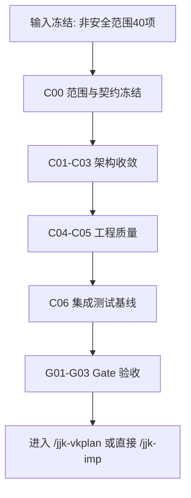

# 全面代码审查整改（非安全范围）— 实施方案（2026-02-27 重跑版）

> 对应需求：`workdocs/归档/需求/全面代码审查整改_requirements.md`
> 代码基线：`5fe3f55`

> **范围冻结声明（强制）**
> 本实施方案**不包含任何安全问题整改**。安全相关问题（认证、鉴权、注入、RCE、密钥、CORS、安全护栏、健康鉴权等）已从本轮卡片与 Gate 中剔除。
> 执行阶段若发现新的安全议题，仅记录到 backlog，不得并入本轮实施卡。

---

## 0. 运行模式与输入来源

### 0.1 模式声明

```yaml
plan_mode:
  mode: core
  parallel_seed_enabled: false
  hydrate_enabled: false
  security_scope: excluded
```

### 0.2 输入来源清单（source_id）

| source_id | 来源 | 用途 | 可追溯锚点 |
|---|---|---|---|
| S01 | `output/全面代码审查报告_合并版_20260225.md` | 40 项非安全问题主清单 | `#8 #9 #16-#59(按纳入集)` |
| S02 | 当前代码快照（HEAD=5fe3f55） | 规模与复杂度现状校准 | `git rev-parse --short HEAD` |
| S03 | 后端架构代码路径 | 分层与状态治理落点 | `app/services/*`, `app/ai/workflow/*` |
| S04 | 前端代码路径 | 类型与交互治理落点 | `web/src/**/*` |
| S05 | 测试目录现状 | QA 基线补齐 | `tests/unit`, `tests/integration` |

### 0.3 剔除清单（安全项）

```yaml
excluded_security_issues:
  - 1
  - 2
  - 3
  - 4
  - 5
  - 6
  - 7
  - 10
  - 11
  - 12
  - 13
  - 14
  - 15
  - 34
  - 36
  - 37
  - 39
  - 47
  - 49
  - 60
  - 61
  - 62
  - 63
  - 64
  - 65
  - 66
  - 67
  - 68
```

---

## 1. 架构变更范围（非安全）

1. **编排与状态平面**：`data_graph` / `multi_agent_graph` / run-control / checkpoint 一致性收敛。
2. **服务分层平面**：Service、Controller、Repository 边界收敛，降低耦合。
3. **后端工程质量平面**：模型、Schema、异常治理、性能热点收敛。
4. **前端交互平面**：类型系统、SSE 收尾、缓存与事件生命周期收敛。
5. **验证平面**：建立可执行的 integration 基线与 Gate。

---

## 2. API 与契约调整（非安全）

| API/契约点 | 现状问题 | 目标调整 | 兼容策略 |
|---|---|---|---|
| `todo_api` 参数校验 | 空指针/validator 类型不匹配 | 参数校验前置 + 类型约束统一 | 保持响应结构 |
| `run_control` 状态字段 | 内存态与 DB 态可能不一致 | DB 真值优先，内存只缓存 | 增量切换开关 |
| SSE done/result | 异常结束后线程列表不刷新 | 统一 done/result 收尾触发刷新 | 保留现有 UI 协议 |
| 前端 `DecisionType` | 类型传参错误 | 强类型约束并修正调用点 | 兼容期加运行时断言 |
| `list_skills` 查询路径 | O(n^2) 性能问题 | 改为索引/字典映射 | 保留返回字段 |

---

## 3. 架构影响与约束

### 3.1 模块边界

- Workflow 只做编排，不承载分层策略拼接。
- Repository 仅负责数据访问，不承载业务流程判定。
- Controller/Endpoint 不新增业务规则分支，统一下沉到 Service。

### 3.2 状态契约

- `run_id/thread_id/status/updated_at` 采用 canonical 来源。
- 去除重复别名字段，防止状态歧义。

### 3.3 路由闭环

- 意图 -> 执行 -> 完成需要单环收敛，禁止重复回流。
- SSE 结束态必须驱动前端刷新，避免 UI 残留旧状态。

### 3.4 端到端链路

- 前端 `current_todo_id` 与后端状态注入时序一致。
- `handleConfirm` 参数必须与后端契约一一对应。

### 3.5 可测试性

- 每个 feature_id 至少 1 条 unit/integration 验证命令。
- Gate 仅接受可执行命令结果，不接受口头放行。

---

## 4. 功能机制包总表（Feature Packet）

| feature_id | 目标与边界 | 触发条件与状态流转 | 代码锚点（文件+函数/类） | 关键契约字段 | 回滚锚点 | 验证命令 | 来源证据 |
|---|---|---|---|---|---|---|---|
| FP-ARC-01 | Graph/State 体量收敛；不破坏调用入口 | 拆分模块 -> 兼容导出 -> 旧入口保留 | `app/ai/workflow/data_graph.py`, `app/ai/workflow/multi_agent_graph.py`, `app/ai/state.py` | `state_version`, `graph_entry` | `GRAPH_SPLIT_PHASE` | `pytest tests/unit -k "graph or state" -q` | S01(#16,#23,#59) |
| FP-ARC-02 | 分层依赖纠偏；不改业务语义 | Service/Repo/API 依赖重排 -> 回归通过 | `app/services/chat_service.py`, `app/services/skill_service.py`, `app/repositories/*`, `app/api/*` | `service_boundary`, `repo_contract` | `LAYER_REFACTOR_STAGE` | `pytest tests/unit -k "service or repository or deps" -q` | S01(#17,#18,#19,#20,#40,#41,#42,#45,#46,#56,#57) |
| FP-ARC-03 | 运行态一致性与异步可靠性 | run 状态流转 -> DB 真值 -> 内存缓存对齐 | `app/services/run_control_service.py`, `app/services/postgres_checkpoint.py` | `run_id`, `status`, `updated_at` | `RUN_STATE_DB_SOURCE` | `pytest tests/unit -k "run_control or checkpoint" -q` | S01(#21,#22,#38,#43,#58) |
| FP-BE-01 | 后端模型/Schema/异常治理 | 模型导出/校验/异常处理标准化 | `app/models/*`, `app/schemas/*`, `app/api/todo_api.py` | `model_exports`, `schema_id`, `error_type` | `BACKEND_STRICT_SCHEMA` | `pytest tests/unit -k "todo_api or models or schema" -q` | S01(#8,#24,#29,#30,#31,#32,#33,#44,#48,#50,#51) |
| FP-FE-01 | 前端类型与交互一致性 | UI 事件 -> 类型校验 -> 刷新一致 | `web/src/hooks/useSSEStream.ts`, `web/src/lib/backend.ts`, `web/src/types/message.ts` | `decision_type`, `sse_done`, `cache_key` | `FRONTEND_STRICT_TYPES` | `cd web && pnpm lint && pnpm test` | S01(#9,#26,#27,#28,#35,#52,#53,#54,#55) |
| FP-QA-01 | 集成测试基线建立 | 关键链路冒烟 -> 集成回归 -> 证据入账 | `tests/integration/**/*` | `case_id`, `trace_id`, `evidence_ref` | `INTEGRATION_GATE_LEVEL` | `pytest tests/integration -q` | S01(#25) |

### 4.1 最小代码样例（每个 feature_id 至少 1 条）

```python
# FP-ARC-01
from app.ai.workflow.graph_runtime import run_graph  # 新入口

# FP-ARC-02
class ChatRepository:
    def get_thread(self, thread_id: str) -> Thread: ...

# FP-ARC-03
run = run_repo.load(run_id)
run.transition(next_state, source="db")

# FP-BE-01
class TodoCreate(BaseModel):
    title: constr(min_length=1, max_length=200)

# FP-FE-01
type DecisionType = "approve" | "reject"
const onConfirm = (decision: DecisionType) => submit(decision)

# FP-QA-01
@pytest.mark.integration
def test_sse_done_refreshes_thread_list(api_client): ...
```

---

## 5. 测试策略（TDD 前置）

显式 TC 覆盖补齐：`TC-ARC-01`、`TC-ARC-02`、`TC-ARC-03`、`TC-BE-01`、`TC-FE-01`、`TC-QA-01`。

```yaml
test_strategy:
  - feature_id: FP-ARC-01
    test_cases:
      - TC-ARC-01-01: "新旧 graph 入口兼容"
    test_first: true
  - feature_id: FP-ARC-02
    test_cases:
      - TC-ARC-02-01: "Repo 不再反向依赖 Service"
    test_first: true
  - feature_id: FP-ARC-03
    test_cases:
      - TC-ARC-03-01: "run 状态以 DB 为真值"
    test_first: true
  - feature_id: FP-BE-01
    test_cases:
      - TC-BE-01-01: "todo validator 类型匹配"
      - TC-BE-01-02: "list_skills 复杂度回归"
    test_first: true
  - feature_id: FP-FE-01
    test_cases:
      - TC-FE-01-01: "DecisionType 类型收敛"
      - TC-FE-01-02: "SSE done 后线程列表刷新"
    test_first: true
  - feature_id: FP-QA-01
    test_cases:
      - TC-QA-01-01: "integration smoke"
    test_first: false
```

---

## 6. 偏差修复清单

| 偏差类型 | 旧口径 | 新口径 | 处置 |
|---|---|---|---|
| 计划范围漂移 | 安全与非安全混排 | 本轮只保留非安全 40 项 | 安全项全部剔除 |
| 卡片泛化 | 卡片不绑定 feature_id | 每卡显式绑定 feature_ids | 旧泛化卡作废 |
| Gate 文本化 | 仅文字门禁 | Gate 实体卡片化（G01-G03） | 纳入 `card_order` |

---

## 7. 分阶段路线图与依赖矩阵

### 7.1 路线图

1. **Phase0（C00）**：冻结范围与执行契约（含“安全剔除声明”）。
2. **Phase1（C01-C03）**：架构收敛（Graph、分层、运行态）。
3. **Phase2（C04-C05）**：工程质量治理（BE/FE）。
4. **Phase3（C06）**：集成测试基线建立。
5. **Gates（G01-G03）**：架构、质量、文档归档验收。

### 7.2 跨模块依赖矩阵

| 模块 | 依赖模块 | 依赖类型 | 关键约束 |
|---|---|---|---|
| `app/api/*` | `app/services/*` | 强依赖 | API 不承载业务规则分叉 |
| `app/services/*` | `app/repositories/*`, `app/models/*` | 强依赖 | Service 负责流程，Repo 只做数据访问 |
| `app/ai/workflow/*` | `app/ai/state.py`, `app/services/*` | 中依赖 | 状态字段 canonical |
| `web/src/*` | 后端 API/SSE 契约 | 强依赖 | done/result 刷新时序一致 |
| `tests/integration/*` | 全链路模块 | 关卡依赖 | Gate 前必须通过核心用例 |

---

## 8. 与 `/jjk-vkplan` 对接契约（planning_contract）

```yaml
planning_contract:
  task_key: PP-20260227-全面代码审查整改-非安全重跑
  execution_mode: serial
  card_order: [C00, C01, C02, C03, C04, C05, C06, G01, G02, G03]
  strict_single_active_card: true

  auto_done_policy:
    implementation-card: hard_gate
    inspection/question-card: policy_gate

  gate_contract:
    mode: as_cards
    gate_ids: [G01, G02, G03]
    depends_on:
      G01: [C03]
      G02: [C06]
      G03: [G02]

  cards:
    - card_id: C00
      title: 基线冻结与范围声明（非安全）
      task_mode: implementation-card
      merge_required: false
      feature_ids: [FP-ARC-01, FP-ARC-02, FP-ARC-03, FP-BE-01, FP-FE-01, FP-QA-01]
      depends_on: []
      done_gate:
        - "纳入 40 项与剔除 28 项清单冻结"
        - "planning_contract 与 gate_contract 冻结"
      acceptance_checks:
        - "python3 scripts/docs_guard.py --strict"
      evidence_entry: "workdocs/归档/需求/全面代码审查整改_requirements.md"

    - card_id: C01
      title: Graph/State 体量收敛第一阶段
      task_mode: implementation-card
      merge_required: true
      feature_ids: [FP-ARC-01]
      depends_on: [C00]
      done_gate:
        - "Graph/State 拆分并保持兼容入口"
      acceptance_checks:
        - "python3 -m pytest tests/unit -k 'graph or state' -q"
      evidence_entry: "app/ai/workflow/"

    - card_id: C02
      title: Service/Controller/Repo 分层重排
      task_mode: implementation-card
      merge_required: true
      feature_ids: [FP-ARC-02]
      depends_on: [C01]
      done_gate:
        - "分层依赖方向单向化"
      acceptance_checks:
        - "python3 -m pytest tests/unit -k 'service or repository or deps' -q"
      evidence_entry: "app/services/, app/repositories/, app/api/"

    - card_id: C03
      title: 运行态一致性与异步可靠性
      task_mode: implementation-card
      merge_required: true
      feature_ids: [FP-ARC-03]
      depends_on: [C02]
      done_gate:
        - "run-control 以 DB 真值为主源"
      acceptance_checks:
        - "python3 -m pytest tests/unit -k 'run_control or checkpoint' -q"
      evidence_entry: "app/services/run_control_service.py"

    - card_id: C04
      title: 后端模型/Schema/异常治理
      task_mode: implementation-card
      merge_required: true
      feature_ids: [FP-BE-01]
      depends_on: [C03]
      done_gate:
        - "后端 schema 与异常治理收敛"
      acceptance_checks:
        - "python3 -m pytest tests/unit -k 'todo_api or models or schema' -q"
      evidence_entry: "app/models/, app/schemas/"

    - card_id: C05
      title: 前端类型与交互一致性治理
      task_mode: implementation-card
      merge_required: true
      feature_ids: [FP-FE-01]
      depends_on: [C04]
      done_gate:
        - "DecisionType 与 SSE 收尾行为一致"
      acceptance_checks:
        - "cd web && pnpm lint"
        - "cd web && pnpm test"
      evidence_entry: "web/src/"

    - card_id: C06
      title: 集成测试基线补齐
      task_mode: implementation-card
      merge_required: true
      feature_ids: [FP-QA-01]
      depends_on: [C05]
      done_gate:
        - "tests/integration 建立并通过关键链路"
      acceptance_checks:
        - "python3 -m pytest tests/integration -q"
      evidence_entry: "tests/integration/"

    - card_id: G01
      title: Gate-架构收敛验收
      task_mode: inspection-card
      merge_required: false
      feature_ids: [G-1]
      depends_on: [C03]
      done_gate:
        - "架构拆分与状态一致性通过"
      acceptance_checks:
        - "python3 -m pytest tests/unit -k 'graph or run_control or repository' -q"
      evidence_entry: "gate/architecture-report.md"

    - card_id: G02
      title: Gate-质量与回归验收
      task_mode: inspection-card
      merge_required: false
      feature_ids: [G-2]
      depends_on: [C06]
      done_gate:
        - "BE/FE/Integration 关键回归通过"
      acceptance_checks:
        - "python3 -m pytest tests/unit -k 'todo_api or models or schema' -q"
        - "python3 -m pytest tests/integration -q"
      evidence_entry: "gate/quality-report.md"

    - card_id: G03
      title: Gate-文档与证据归档验收
      task_mode: inspection-card
      merge_required: false
      feature_ids: [G-3]
      depends_on: [G02]
      done_gate:
        - "文档索引一致"
        - "证据与回滚台账归档"
      acceptance_checks:
        - "python3 scripts/docs_guard.py --strict"
      evidence_entry: "docs/SUMMARY.md"
```

---

## 9. 执行流程图



ASCII 备份：

```text
[输入冻结] -> [C00] -> [C01~C03] -> [C04~C05] -> [C06] -> [G01~G03]
```

---

## 10. 风险矩阵与回滚

| 风险 | 触发条件 | 影响 | 预防措施 | 回滚 |
|---|---|---|---|---|
| Graph 拆分引入循环依赖 | 模块重排不完整 | 启动失败/运行异常 | 分阶段拆分+兼容导出 | 回退 `GRAPH_SPLIT_PHASE` |
| 分层重排行为漂移 | Service/Repo 接口变更 | 功能回归 | 先补测试后重构 | 回退 `LAYER_REFACTOR_STAGE` |
| run-control 状态不同步 | 内存与 DB 双写不一致 | 运行态混乱 | DB 真值优先 + 状态审计 | 回退 `RUN_STATE_DB_SOURCE` |
| 前端类型收紧导致交互异常 | `any` 替换后调用不兼容 | UI 回归 | 增量收口 + 回归测试 | 回退对应 FE patch |
| docs_guard 全局断链阻塞 | 历史 SUMMARY 悬挂 | Gate 失败 | 单独立项治理文档债务 | 临时采用“新增文档局部门禁” |

---

## 11. 文档同步与完成度声明

1. 索引条目已存在：
   - `需求基线（全面代码审查整改，68项覆盖）`
   - `实施方案（全面代码审查整改，分阶段路线）`
2. 已执行：`python3 scripts/docs_guard.py --strict`
3. 结果：存在历史断链债务（非本次新增）。

```yaml
plan_status:
  state: READY
  security_scope: excluded
  blockers_for_planning: []
  repo_debts:
    - "docs/SUMMARY 历史 broken_links/summary_broken_targets 需单独治理"
```
