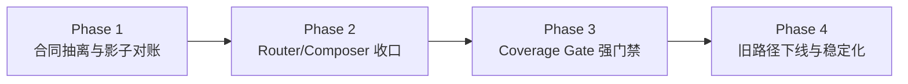

# 多智能体合同驱动分层 — 实施方案

> 日期：2026-02-28
> 对应需求：`workdocs/归档/正文/需求/多智能体合同驱动分层_requirements.md`
> 执行模式：`serial`（架构重构阶段单活推进）
> 目标：将 `multi_agent_graph` 从“混合编排”迁移到“合同驱动五层编排”

---

## 0. 输入来源清单（执行前冻结）

### 0.1 代码来源

1. `app/ai/workflow/multi_agent_graph.py`
2. `app/ai/workflow/todo_graph.py`
3. `app/ai/workflow/data_graph.py`
4. `app/ai/state.py`
5. `app/ai/events.py`
6. `app/ai/protocol.py`
7. `app/services/chat_service.py`
8. `web/src/hooks/useSSEStream.ts`
9. `web/src/lib/backend.ts`
10. `web/src/components/chat/messages/ai.tsx`

### 0.2 测试来源

1. `tests/unit/test_multi_intent_queue_flow.py`
2. `tests/unit/test_multi_agent_streaming_helpers.py`
3. `tests/unit/test_chat_service_done_payload.py`
4. `tests/unit/test_todo_handoff_observation.py`
5. 显式 TC 覆盖补齐：`TC-CDL-001`、`TC-CDL-002`、`TC-CDL-003`、`TC-CDL-004`、`TC-CDL-005`、`TC-CDL-006`。

### 0.3 外部参考（实现准绳）

1. [langgraph-supervisor-py](https://github.com/langchain-ai/langgraph-supervisor-py)
2. [langgraph-swarm-py](https://github.com/langchain-ai/langgraph-swarm-py)
3. [crewAI allowed_agents PR](https://github.com/crewAIInc/crewAI/pull/2068)
4. [openai/swarm](https://github.com/openai/swarm)

---

## 1. 执行总览（可直接落地）



### 1.1 阶段门禁规则（强制）

1. 每个 Phase 完成后，必须跑“阶段最小回归命令集”。
2. 未通过阶段门禁，不得进入下一 Phase。
3. 任一 Phase 引入 P1 级故障，立即执行回滚开关并冻结发布。

### 1.2 迁移开关（统一）

1. `delivery.contract_layer.enabled`
2. `delivery.router_contract_guard.enabled`
3. `delivery.coverage_gate.enforced`
4. `delivery.composer.single_exit.enabled`
5. `delivery.legacy_path.enabled`（回滚保护开关）

---

## 2. 工作包拆解（执行版）

| 工作包 | 目标 | 主要文件 | 预估成本 | 进入条件 | 完成标准 |
|---|---|---|---|---|---|
| WP-01 合同模型抽离 | 固化 5 类合同对象与校验器 | `app/ai/contracts/**`, `app/ai/state.py` | M | 需求评审通过 | 合同对象可序列化且有单测 |
| WP-02 Planner/Router 分层 | Planner 只拆目标，Router 只做委派 | `app/ai/workflow/multi_agent_graph.py`, `app/ai/workflow/nodes/**` | M | WP-01 完成 | route 决策仅消费合同字段 |
| WP-03 Subgraph 交付统一 | todo/data 输出标准 deliverable | `app/ai/workflow/todo_graph.py`, `app/ai/workflow/data_graph.py` | M | WP-02 完成 | 每个 goal 都能绑定 deliverable |
| WP-04 Coverage Gate | must_answer 门禁化 | `app/ai/workflow/multi_agent_graph.py`, `app/ai/events.py` | M | WP-03 完成 | 缺口场景不可 done |
| WP-05 Composer 唯一出口 | 最终答案只由 Composer 产出 | `app/ai/workflow/multi_agent_graph.py`, `app/services/chat_service.py` | M | WP-04 完成 | final_answer 单出口稳定 |
| WP-06 前端事件分层 | 过程事件与最终正文解耦 | `web/src/hooks/useSSEStream.ts`, `web/src/components/chat/messages/ai.tsx` | S | WP-05 完成 | UI 不再被过程事件污染 |
| WP-07 灰度与回滚 | 双栈运行 + 指标观测 + 快速回切 | `app/core/config_contract.py`, `app/services/runtime_request_metrics.py` | S | WP-06 完成 | 回滚演练通过 |

---

## 3. Phase 1：合同抽离 + 影子对账（不改现网行为）

### 3.1 目标

1. 新增合同对象，但不改变当前对外流程。
2. 让现有链路在运行时并行产出 `intent_plan/route_decision/deliverable/coverage_report/final_answer` 的影子数据。

### 3.2 变更清单

1. 新增 `app/ai/contracts/delivery_contracts.py`
2. 新增 `app/ai/contracts/delivery_contract_validators.py`
3. 在 `app/ai/state.py` 增补合同字段（保留旧字段）
4. 在 `app/ai/workflow/multi_agent_graph.py` 增加影子合同填充函数（只写不控流）

### 3.3 最小任务序列（按顺序）

1. 定义 Pydantic 合同模型（Goal/RouteDecision/Deliverable/CoverageReport/FinalAnswer）。
2. 写合同校验单测（非法字段、缺字段、类型错误）。
3. 在 preprocess/planner/evaluate/postprocess 旁路写入影子合同。
4. 增加日志埋点：`thread_id/run_id/goal_id/target_agent`。

### 3.4 阶段回归命令

```bash
PYTHONPATH=. pytest -q tests/unit/test_multi_agent_streaming_helpers.py
PYTHONPATH=. pytest -q tests/unit/test_multi_intent_queue_flow.py
```

### 3.5 退出门禁

1. 影子合同生成率 >= 99%。
2. 线上行为（done/final_answer）无语义变化。

---

## 4. Phase 2：Router/Composer 收口（行为开始切换）

### 4.1 目标

1. Router 严格依据 `allowed_agents` 委派。
2. Composer 只消费标准合同对象渲染最终答复。

### 4.2 变更清单

1. 新增 `app/ai/workflow/nodes/planner_layer.py`
2. 新增 `app/ai/workflow/nodes/router_layer.py`
3. 新增 `app/ai/workflow/nodes/composer_layer.py`
4. `app/ai/workflow/multi_agent_graph.py` 改为编排节点注册与边定义，不再内聚渲染细节

### 4.3 最小任务序列

1. 从现有 `_build_planner_intent_plan` 提取 Planner Layer。
2. Router 引入 `allowed_agents` 校验，不满足时输出结构化阻塞原因。
3. 从 `_render_final_answer` 提取 Composer Layer，输入只允许合同对象。
4. 增加“内部术语泄露”防线测试。

### 4.4 阶段回归命令

```bash
PYTHONPATH=. pytest -q tests/unit/test_multi_intent_queue_flow.py -k "order or summary"
PYTHONPATH=. pytest -q tests/unit/test_chat_service_done_payload.py -k "final_answer"
```

### 4.5 退出门禁

1. 最终答复顺序稳定按 `intent_plan.order`。
2. 用户可见文本不包含 `handoff`、`*_expert`、`assign_to_*`。

---

## 5. Phase 3：Coverage Gate 强门禁（质量先于结束）

### 5.1 目标

1. `must_answer` 未覆盖时禁止进入 done。
2. 缺口必须结构化暴露并可驱动补齐。

### 5.2 变更清单

1. 新增 `app/ai/workflow/nodes/coverage_gate_layer.py`
2. 在 `app/ai/events.py` 增加稳定 `coverage_check` payload
3. 在 `app/services/chat_service.py` 补齐 coverage 事件透传与收口规则

### 5.3 最小任务序列

1. 计算 `matched_goal_ids/missing_goals/failure_goals`。
2. `coverage_pass=false` 时路由回 Router 补齐（最多 N 次，防死循环）。
3. `coverage_pass=true` 才可进入 Composer。
4. 增加“缺口场景不得 done”回归测试。

### 5.4 阶段回归命令

```bash
PYTHONPATH=. pytest -q tests/unit/test_multi_intent_queue_flow.py
PYTHONPATH=. pytest -q tests/unit/test_chat_service_done_payload.py
```

### 5.5 退出门禁

1. 缺失目标场景 done 阻断率 100%。
2. 复合问题完整覆盖率达到预设阈值。

---

## 6. Phase 4：旧路径下线 + 稳定化

### 6.1 目标

1. 删除跨层临时字段依赖与重复汇总逻辑。
2. 保留可控回滚开关，完成双栈收口。

### 6.2 变更清单

1. `app/ai/workflow/multi_agent_graph.py` 删除废弃 helper 与旧路由分支。
2. `app/ai/state.py` 清理无主字段与别名漂移字段。
3. `web/src/hooks/useSSEStream.ts` 清理旧 fallback 代码（保留兼容必要分支）。

### 6.3 最小任务序列

1. 标记旧字段 deprecated，并输出迁移日志。
2. 移除未被引用的旧汇总函数。
3. 回归所有核心用例并做一次回滚演练。

### 6.4 阶段回归命令

```bash
PYTHONPATH=. pytest -q tests/unit/test_multi_agent_streaming_helpers.py tests/unit/test_multi_intent_queue_flow.py tests/unit/test_chat_service_done_payload.py
cd web && pnpm test -- --runInBand useSSEStream
```

### 6.5 退出门禁

1. `delivery.legacy_path.enabled=false` 灰度稳定 3 天。
2. 回滚演练在 30 秒内恢复旧路径可用。

---

## 7. 观测与告警（上线必备）

### 7.1 指标

1. `delivery_goal_coverage_pass_rate`
2. `delivery_missing_goal_count`
3. `delivery_final_answer_order_mismatch`
4. `delivery_internal_term_leak_count`
5. `delivery_fallback_to_legacy_count`

### 7.2 告警阈值（建议）

1. 覆盖率 < 95%（5 分钟窗口）告警。
2. 内部术语泄露 > 0 告警。
3. 旧路径回退次数连续升高告警。

---

## 8. 风险、缓解与回滚

| 风险 | 影响 | 缓解策略 | 回滚动作 |
|---|---|---|---|
| 合同字段与旧字段并存冲突 | 状态不一致 | 双写期间只读合同主键，旧字段仅兼容 | 打开 `delivery.legacy_path.enabled` |
| Coverage 门禁过严 | 用户体验阻塞 | 加入最大补齐轮次与可解释降级文本 | 暂时关闭 `delivery.coverage_gate.enforced` |
| 前端事件兼容不足 | UI 渲染异常 | 保留旧事件消费路径并灰度启用 final_answer 优先 | 关闭 `delivery.composer.single_exit.enabled` |

---

## 9. 执行排期（建议）

1. D1-D2：Phase 1（合同影子层）
2. D3-D4：Phase 2（Router/Composer 收口）
3. D5：Phase 3（Coverage Gate 强门禁）
4. D6：Phase 4（清理 + 回滚演练 + 文档收口）

---

## 10. 完成定义（DoD）

1. 需求文档中的 AC 全部有测试映射并通过。
2. 双目标复合请求“顺序正确 + 覆盖完整 + 无内部术语泄露”稳定通过。
3. `docs/SUMMARY.md` 索引同步，`python3 scripts/docs_guard.py --strict` 通过。
4. 灰度与回滚记录可追溯。
