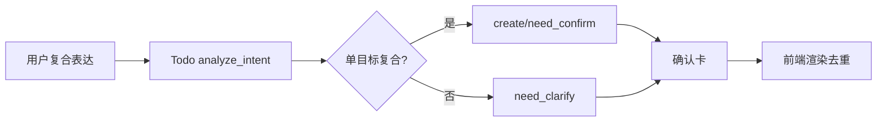

# 实施方案（待办单目标复合描述识别）

> 文档日期：2026-03-01
> 执行模式：serial
> 状态：implementation_ready

---

## 0. 输入来源清单

1. `workdocs/归档/报告/修复计划/fix_plan_todo_compound_clarify_loop_20260301.md`
2. `workdocs/归档/正文/需求/待办单目标复合描述识别_requirements.md`
3. `logs/assistant.log`（线程 `c535dbdd-e0d4-4537-ab5d-a740ac742adb`）
4. 代码锚点：
   - `app/ai/prompts/todo_prompts.py`
   - `app/ai/workflow/todo_graph.py`
   - `web/src/hooks/useSSEStream.ts`

## 0.1 设计审批门禁

```yaml
design_approved: true
approved_at: "2026-03-01 16:35 CST"
approval_round: "round-1"
approval_source: "用户明确确认：这是一个目标，买票是子任务"
DESIGN_APPROVAL_FALLBACK_ACK: true
```

## 0.2 执行意图门禁

```yaml
execution_intent: implementation_requested
intent_source: "用户显式触发 $jjk-plan + $jjk-imp"
```

---

## 1. 架构影响与约束

### 1.1 模块边界
1. Prompt 层：只定义语义约束，不实现流程分支。
2. Workflow 层：负责意图纠偏与收敛，不污染 Repo/API。
3. Frontend Hook 层：只做渲染去重，不改后端语义。

### 1.2 状态契约
1. `intent` 仅允许已知动作语义（create/update/query/complete/delete/clarify/chat/confirm/cancel/out_of_scope）。
2. `pending_operation.action` 与 `session_frame.todo_action` 保持一致来源。
3. 澄清场景消息单语义展示（避免同轮重复写入）。

### 1.3 路由闭环
1. `analyze_intent` -> `need_confirm`（单目标复合描述优先归并）。
2. 弱结构补充轮（“一个待办”）-> 直接收敛确认。
3. 明确拆分表达才继续 `need_clarify`。

### 1.4 端到端一致性



### 1.5 可测试性
1. 后端单测覆盖复合表达识别与补充轮收敛。
2. 不新增 DB 依赖，不引入集成环境门槛。
3. 针对渲染重复增加最小 hook 逻辑回归。
4. 显式 TC 覆盖补齐：`TC-TODO-COMPOUND-001`、`TC-TODO-COMPOUND-002`、`TC-TODO-COMPOUND-003`。

---

## 2. 修复方案对比

| 方案 | 优点 | 缺点 | 成本 | 推荐度 |
|---|---|---|---|---|
| A. 仅改 Prompt | 改动最小 | 对模型漂移敏感，稳定性一般 | 低 | ⭐⭐⭐ |
| B. Prompt + Workflow 收敛规则（推荐） | 语义与流程双保险，稳定性高 | 需补单测 | 中 | ⭐⭐⭐⭐⭐ |
| C. 强行前端兜底 | 快速见效 | 治标不治本，后端仍误判 | 低 | ⭐⭐ |

### 推荐方案
- 采用 **方案 B**：Prompt 明确语义 + Workflow 可解释收敛规则，前端仅做小幅去重保障。

---

## 3. 功能机制包总表

| feature_id | card_id | 目标摘要 | 代码锚点（文件+函数/类） | 验证命令 | 来源证据 |
|---|---|---|---|---|---|
| P1-01 | C01 | 单目标复合描述语义识别 | `app/ai/prompts/todo_prompts.py` `TODO_INTENT_ANALYZE_PROMPT` | `venv/bin/python -m pytest -q tests/unit/test_todo_nodes.py -k compound_single_goal` | fix_plan §2 |
| P1-02 | C01 | 补充轮“一个待办”收敛为确认 | `app/ai/workflow/todo_graph.py` `analyze_intent` | `venv/bin/python -m pytest -q tests/unit/test_todo_nodes.py -k single_todo_preference` | 日志 38647/38692 |
| P1-03 | C02 | 澄清消息展示去重 | `web/src/hooks/useSSEStream.ts` `onToken/onClarification` | `cd web && npm run lint` | fix_plan §2.2 |

---

## 4. implementation_tasks（工单级 HOW）

```yaml
implementation_tasks:
  - task_id: T-01
    feature_id: P1-01
    pr_id: PR-01
    phase: Phase-1
    file_paths:
      - app/ai/prompts/todo_prompts.py
    symbols:
      - TODO_INTENT_ANALYZE_PROMPT
    change_type: modify
    acceptance_cmds:
      - venv/bin/python -m pytest -q tests/unit/test_todo_nodes.py -k compound_single_goal
    rollback_point: 回退 TODO_INTENT_ANALYZE_PROMPT 对“单目标复合描述”规则改动

  - task_id: T-02
    feature_id: P1-02
    pr_id: PR-01
    phase: Phase-1
    file_paths:
      - app/ai/workflow/todo_graph.py
      - tests/unit/test_todo_nodes.py
    symbols:
      - analyze_intent
      - _merge_pending_operation_by_supplement
    change_type: modify
    acceptance_cmds:
      - venv/bin/python -m pytest -q tests/unit/test_todo_nodes.py -k "compound_single_goal or single_todo_preference"
    rollback_point: 关闭新增复合归并/补充收敛逻辑，回到原 need_clarify 规则

  - task_id: T-03
    feature_id: P1-03
    pr_id: PR-01
    phase: Phase-2
    file_paths:
      - web/src/hooks/useSSEStream.ts
    symbols:
      - onToken
      - applyClarificationToMessage
    change_type: modify
    acceptance_cmds:
      - cd web && npm run lint
    rollback_point: 回退 useSSEStream 澄清去重逻辑
```

---

## 5. planning_contract（供后续链路消费）

```yaml
planning_contract:
  execution_mode: serial
  card_order: [C01, C02]
  strict_single_active_card: true
  cards:
    - card_id: C01
      wave: P1
      feature_ids: [P1-01, P1-02]
      depends_on: []
      task_mode: implementation-card
      merge_required: true
      done_gate:
        - Prompt语义规则与Workflow收敛规则测试通过
      acceptance_checks:
        - venv/bin/python -m pytest -q tests/unit/test_todo_nodes.py -k "compound_single_goal or single_todo_preference"
      evidence_entry: workdocs/归档/正文/实施计划/待办单目标复合描述识别_implementation_plan.md

    - card_id: C02
      wave: P1
      feature_ids: [P1-03]
      depends_on: [C01]
      task_mode: implementation-card
      merge_required: true
      done_gate:
        - 澄清展示无重复
      acceptance_checks:
        - cd web && npm run lint
      evidence_entry: workdocs/归档/正文/实施计划/待办单目标复合描述识别_implementation_plan.md

  task_to_pr_mapping:
    - task_id: T-01
      pr_id: PR-01
      pr_branch: codex/todo-single-goal-compound-pr-01
      pr_subject: "待办单目标复合描述识别优化"
      pr_depends_on: []
      acceptance_cmds:
        - venv/bin/python -m pytest -q tests/unit/test_todo_nodes.py -k compound_single_goal
      rollback_point: 回退 Prompt 规则

    - task_id: T-02
      pr_id: PR-01
      pr_branch: codex/todo-single-goal-compound-pr-01
      pr_subject: "待办补充轮收敛优化"
      pr_depends_on: []
      acceptance_cmds:
        - venv/bin/python -m pytest -q tests/unit/test_todo_nodes.py -k single_todo_preference
      rollback_point: 回退 analyze_intent 收敛逻辑

    - task_id: T-03
      pr_id: PR-01
      pr_branch: codex/todo-single-goal-compound-pr-01
      pr_subject: "澄清展示去重"
      pr_depends_on: [PR-01]
      acceptance_cmds:
        - cd web && npm run lint
      rollback_point: 回退前端 clarification/token 处理
```

---

## 6. implementation_readiness

```yaml
implementation_readiness:
  implementation_ready: true
  blocked_by: []
  next_step: /jjk-imp
```
